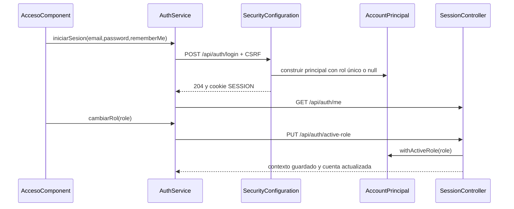
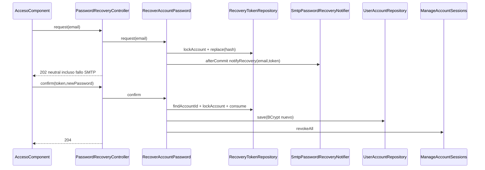
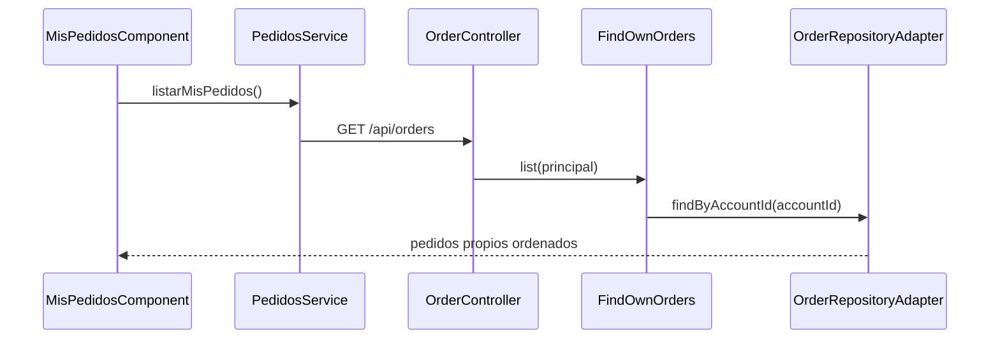
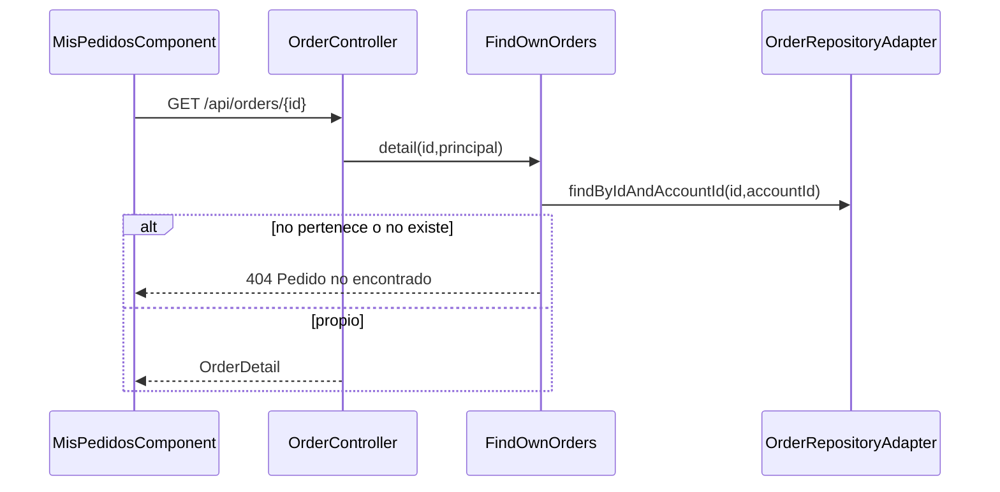

# Sustentación CU-08 y CU-11

Material de consulta de la implementación inspeccionada el 22 de septiembre de 2026. Lectura estática de código, SQL y pruebas; **las suites no fueron ejecutadas en esta revisión**. Un test localizado significa evidencia escrita, no una ejecución aprobada hoy. Se conserva el estado previo del workspace; solo se crea este Markdown.

**Fuente oficial:** `/Users/sofiamantilla/Downloads/CU_Marketplace.xlsx`, hojas `C.U corregidos` (filas 12 y 15), `UC-08`, `UC-11` y `Requerimientos`. La plantilla `/Users/sofiamantilla/Documents/Plantilla_CU_Marketplace_ajustada.xlsx` no contiene las hojas requeridas y no se usa como versión oficial. Ambos CUs figuran como **Alta**, responsable **Sofia**. CU-08 absorbe recuperación: no es un CU independiente.

**Convenciones:** SÍ = recorrido localizado; PARCIAL = faltan partes del alcance; NO IMPLEMENTADO = obligación oficial sin implementación en el recorrido revisado; NO LOCALIZADO EN EL REPOSITORIO = evidencia no encontrada. La cobertura de integración de un colaborador compartido no equivale a probar toda la ruta del comprador. Los enlaces son relativos a este documento; los números de línea son orientativos, siempre acompañados por archivo y símbolo.

1. [ÍNDICE RÁPIDO](#seccion-1)
2. [RESUMEN OFICIAL DE CU-08](#seccion-2)
3. [RESUMEN OFICIAL DE CU-11](#seccion-3)
4. [MAPA DE ARCHIVOS — CU-08](#seccion-4)
5. [MAPA DE ARCHIVOS — CU-11](#seccion-5)
6. [CU-08 — FLUJO COMPLETO](#seccion-6)
7. [CU-11 — FLUJO COMPLETO](#seccion-7)
8. [ENDPOINTS](#seccion-8)
9. [DICCIONARIO DE FUNCIONES IMPORTANTES](#seccion-9)
10. [BASE DE DATOS](#seccion-10)
11. [MIGRACIONES FLYWAY](#seccion-11)
12. [MODELO DE DOMINIO](#seccion-12)
13. [SEGURIDAD CU-08](#seccion-13)
14. [SEGURIDAD CU-11](#seccion-14)
15. [EXCEPCIONES Y CASOS DE ERROR](#seccion-15)
16. [TESTS DE INTEGRACIÓN — CU-08](#seccion-16)
17. [TESTS DE INTEGRACIÓN — CU-11](#seccion-17)
18. [E2E / PLAYWRIGHT](#seccion-18)
19. [FRONTEND — ¿DÓNDE ESTÁ EL BOTÓN?](#seccion-19)
20. [INTEGRACIONES EXTERNAS](#seccion-20)
21. [TRANSACCIONES Y ATOMICIDAD](#seccion-21)
22. [DIAGRAMAS MERMAID](#seccion-22)
23. [MATRIZ DE TRAZABILIDAD DE CU-08](#seccion-23)
24. [MATRIZ DE TRAZABILIDAD DE CU-11](#seccion-24)
25. [MATRIZ RF → CÓDIGO → TEST](#seccion-25)
26. [MATRIZ RNF → IMPLEMENTACIÓN](#seccion-26)
27. [RELACIÓN CON OTROS CUs](#seccion-27)
28. [PREGUNTAS PROBABLES DEL PROFESOR](#seccion-28)
29. [¿DÓNDE ESTÁ…?](#seccion-29)
30. [CHEAT SHEET — RESPUESTAS EN 10 SEGUNDOS](#seccion-30)
31. [POSIBLES PREGUNTAS PELIGROSAS / DISCREPANCIAS](#seccion-31)
32. [RESPUESTAS PARA MI DEMO MANUAL](#seccion-32)
33. [LÍNEAS, REFERENCIAS Y VALIDACIÓN](#seccion-33)

<a id="seccion-1"></a>

# 1. ÍNDICE RÁPIDO

| Tema | CU | Archivo principal | Clase | Método/función | Endpoint |
|---|---|---|---|---|---|
| [Login](#op-login) | 08 | [backend/demo/src/main/java/com/transformersas/marketplace/auth/infrastructure/security/AccountUserDetailsService.java](../../backend/demo/src/main/java/com/transformersas/marketplace/auth/infrastructure/security/AccountUserDetailsService.java) | AccountUserDetailsService | loadUserByUsername | POST /api/auth/login |
| [Cuenta actual](#op-me) | 08 | [backend/demo/src/main/java/com/transformersas/marketplace/auth/infrastructure/security/CurrentAccountSessionFilter.java](../../backend/demo/src/main/java/com/transformersas/marketplace/auth/infrastructure/security/CurrentAccountSessionFilter.java) | CurrentAccountSessionFilter | doFilterInternal | GET /api/auth/me |
| [Roles](#op-roles) | 08 | [backend/demo/src/main/java/com/transformersas/marketplace/auth/infrastructure/security/AccountPrincipal.java](../../backend/demo/src/main/java/com/transformersas/marketplace/auth/infrastructure/security/AccountPrincipal.java) | AccountPrincipal | withActiveRole | GET /api/auth/me; PUT /api/auth/active-role |
| [Selección de rol inicial](#op-initial) | 08 | [backend/demo/src/main/java/com/transformersas/marketplace/auth/infrastructure/security/AccountPrincipal.java](../../backend/demo/src/main/java/com/transformersas/marketplace/auth/infrastructure/security/AccountPrincipal.java) | AccountPrincipal | constructor / record | POST /api/auth/login |
| [Cambio de rol](#op-switch) | 08 | [backend/demo/src/main/java/com/transformersas/marketplace/auth/infrastructure/security/AccountPrincipal.java](../../backend/demo/src/main/java/com/transformersas/marketplace/auth/infrastructure/security/AccountPrincipal.java) | AccountPrincipal | withActiveRole | PUT /api/auth/active-role |
| [Autorización por rol](#op-authorization) | 08 | [backend/demo/src/main/java/com/transformersas/marketplace/auth/infrastructure/security/AccountPrincipal.java](../../backend/demo/src/main/java/com/transformersas/marketplace/auth/infrastructure/security/AccountPrincipal.java) | AccountPrincipal | withActiveRole | GET /api/auth/validation/comprador; GET /api/auth/validation/vendedor |
| [Sesiones activas](#op-sessions) | 08 | [backend/demo/src/main/java/com/transformersas/marketplace/auth/application/usecase/ManageAccountSessions.java](../../backend/demo/src/main/java/com/transformersas/marketplace/auth/application/usecase/ManageAccountSessions.java) | ManageAccountSessions | list | GET /api/auth/sessions |
| [Revocar una sesión](#op-revoke) | 08 | [backend/demo/src/main/java/com/transformersas/marketplace/auth/application/usecase/ManageAccountSessions.java](../../backend/demo/src/main/java/com/transformersas/marketplace/auth/application/usecase/ManageAccountSessions.java) | ManageAccountSessions | revoke | DELETE /api/auth/sessions/{id} |
| [Revocar otras sesiones](#op-others) | 08 | [backend/demo/src/main/java/com/transformersas/marketplace/auth/application/usecase/ManageAccountSessions.java](../../backend/demo/src/main/java/com/transformersas/marketplace/auth/application/usecase/ManageAccountSessions.java) | ManageAccountSessions | revokeOthers | POST /api/auth/sessions/revoke-others |
| [Logout](#op-logout) | 08 | [backend/demo/src/main/java/com/transformersas/marketplace/shared/SecurityConfiguration.java](../../backend/demo/src/main/java/com/transformersas/marketplace/shared/SecurityConfiguration.java) | SecurityConfiguration | securityFilterChain | POST /api/auth/logout |
| [Expiración/revocación](#op-expiry) | 08 | [backend/demo/src/main/java/com/transformersas/marketplace/auth/infrastructure/security/LoginSessionPolicy.java](../../backend/demo/src/main/java/com/transformersas/marketplace/auth/infrastructure/security/LoginSessionPolicy.java) | LoginSessionPolicy | onAuthenticationSuccess | GET /api/auth/me (o cualquier recurso protegido) |
| [Solicitar recuperación de contraseña](#op-recovery) | 08 | [backend/demo/src/main/java/com/transformersas/marketplace/auth/application/usecase/RecoverAccountPassword.java](../../backend/demo/src/main/java/com/transformersas/marketplace/auth/application/usecase/RecoverAccountPassword.java) | RecoverAccountPassword | request | POST /api/auth/password-recovery/request |
| [Validar token](#op-token) | 08 | [backend/demo/src/main/java/com/transformersas/marketplace/auth/application/usecase/RecoverAccountPassword.java](../../backend/demo/src/main/java/com/transformersas/marketplace/auth/application/usecase/RecoverAccountPassword.java) | RecoverAccountPassword | confirm | POST /api/auth/password-recovery/confirm |
| [Restablecer contraseña](#op-reset) | 08 | [backend/demo/src/main/java/com/transformersas/marketplace/auth/application/usecase/RecoverAccountPassword.java](../../backend/demo/src/main/java/com/transformersas/marketplace/auth/application/usecase/RecoverAccountPassword.java) | RecoverAccountPassword | confirm | POST /api/auth/password-recovery/confirm |
| [Cambiar contraseña autenticado](#op-change) | 08 | [backend/demo/src/main/java/com/transformersas/marketplace/auth/application/usecase/ChangeAccountPassword.java](../../backend/demo/src/main/java/com/transformersas/marketplace/auth/application/usecase/ChangeAccountPassword.java) | ChangeAccountPassword | execute | PUT /api/auth/password |
| [Verificación/reenvío de correo](#op-verification) | 08 | [backend/demo/src/main/java/com/transformersas/marketplace/auth/application/usecase/VerifyAccountEmail.java](../../backend/demo/src/main/java/com/transformersas/marketplace/auth/application/usecase/VerifyAccountEmail.java) | VerifyAccountEmail | confirm | POST /api/auth/email-verification/confirm; POST /api/auth/email-verification/resend |
| [Restricciones/bloqueos](#op-restrictions) | 08 | [backend/demo/src/main/java/com/transformersas/marketplace/auth/infrastructure/security/CurrentAccountSessionFilter.java](../../backend/demo/src/main/java/com/transformersas/marketplace/auth/infrastructure/security/CurrentAccountSessionFilter.java) | CurrentAccountSessionFilter | doFilterInternal | POST /api/auth/login y recursos protegidos |
| [Listar pedidos](#op-list) | 11 | [backend/demo/src/main/java/com/transformersas/marketplace/orders/application/usecase/FindOwnOrders.java](../../backend/demo/src/main/java/com/transformersas/marketplace/orders/application/usecase/FindOwnOrders.java) | FindOwnOrders | list | GET /api/orders |
| [Filtrar pedidos](#op-filter) | 11 | [backend/demo/src/main/java/com/transformersas/marketplace/orders/application/usecase/FindOwnOrders.java](../../backend/demo/src/main/java/com/transformersas/marketplace/orders/application/usecase/FindOwnOrders.java) | FindOwnOrders | list | GET /api/orders |
| [Ver detalle](#op-detail) | 11 | [backend/demo/src/main/java/com/transformersas/marketplace/orders/application/usecase/FindOwnOrders.java](../../backend/demo/src/main/java/com/transformersas/marketplace/orders/application/usecase/FindOwnOrders.java) | FindOwnOrders | detail | GET /api/orders/{id} |
| [Ownership](#op-ownership) | 11 | [backend/demo/src/main/java/com/transformersas/marketplace/orders/application/usecase/FindOwnOrders.java](../../backend/demo/src/main/java/com/transformersas/marketplace/orders/application/usecase/FindOwnOrders.java) | FindOwnOrders | detail | GET /api/orders/{id}; POST /api/orders/{id}/cancellation |
| [Historial de estados](#op-history) | 11 | [backend/demo/src/main/java/com/transformersas/marketplace/orders/application/usecase/OrderChangeRecorder.java](../../backend/demo/src/main/java/com/transformersas/marketplace/orders/application/usecase/OrderChangeRecorder.java) | OrderChangeRecorder | recordTransition | GET /api/orders/{id} (no devuelve historial interno) |
| [Tracking](#op-tracking) | 11 | [backend/demo/src/main/java/com/transformersas/marketplace/orders/application/usecase/GetOrderTrackingUseCase.java](../../backend/demo/src/main/java/com/transformersas/marketplace/orders/application/usecase/GetOrderTrackingUseCase.java) | GetOrderTrackingUseCase | forBuyer | GET /api/orders/{orderId}/tracking; POST /api/orders/{orderId}/tracking/refresh |
| [Comprobante](#op-receipt) | 11 | [backend/demo/src/main/java/com/transformersas/marketplace/orders/application/usecase/FindOwnOrders.java](../../backend/demo/src/main/java/com/transformersas/marketplace/orders/application/usecase/FindOwnOrders.java) | FindOwnOrders | detail | NO LOCALIZADO EN EL REPOSITORIO |
| [Determinar si puede cancelar](#op-canCancel) | 11 | [backend/demo/src/main/java/com/transformersas/marketplace/orders/domain/model/OrderStatus.java](../../backend/demo/src/main/java/com/transformersas/marketplace/orders/domain/model/OrderStatus.java) | OrderStatus | requireTransitionTo | POST /api/orders/{id}/cancellation |
| [Abrir diálogo de cancelación](#op-dialog) | 11 | [backend/demo/src/main/java/com/transformersas/marketplace/orders/application/dto/CancelOrderCommand.java](../../backend/demo/src/main/java/com/transformersas/marketplace/orders/application/dto/CancelOrderCommand.java) | CancelOrderCommand | constructor / record | POST /api/orders/{id}/cancellation (solo al confirmar) |
| [Motivos](#op-reasons) | 11 | [backend/demo/src/main/java/com/transformersas/marketplace/orders/application/usecase/RequestOrderCancellation.java](../../backend/demo/src/main/java/com/transformersas/marketplace/orders/application/usecase/RequestOrderCancellation.java) | RequestOrderCancellation | execute | POST /api/orders/{id}/cancellation |
| [OTRO + explicación](#op-other) | 11 | [backend/demo/src/main/java/com/transformersas/marketplace/orders/application/dto/CancelOrderCommand.java](../../backend/demo/src/main/java/com/transformersas/marketplace/orders/application/dto/CancelOrderCommand.java) | CancelOrderCommand | constructor / record | POST /api/orders/{id}/cancellation |
| [Revalidación de estado](#op-revalidate) | 11 | [backend/demo/src/main/java/com/transformersas/marketplace/orders/application/usecase/CancelOrderUseCase.java](../../backend/demo/src/main/java/com/transformersas/marketplace/orders/application/usecase/CancelOrderUseCase.java) | CancelOrderUseCase | cancel | POST /api/orders/{id}/cancellation |
| [Cancelación](#op-cancel) | 11 | [backend/demo/src/main/java/com/transformersas/marketplace/orders/application/usecase/CancelOrderUseCase.java](../../backend/demo/src/main/java/com/transformersas/marketplace/orders/application/usecase/CancelOrderUseCase.java) | CancelOrderUseCase | execute | POST /api/orders/{id}/cancellation |
| [Persistencia de CANCELLED](#op-persist) | 11 | [backend/demo/src/main/java/com/transformersas/marketplace/orders/infrastructure/persistence/repository/OrderRepositoryAdapter.java](../../backend/demo/src/main/java/com/transformersas/marketplace/orders/infrastructure/persistence/repository/OrderRepositoryAdapter.java) | OrderRepositoryAdapter | transitionStatus | POST /api/orders/{id}/cancellation |
| [Inventario](#op-inventory) | 11 | [backend/demo/src/main/java/com/transformersas/marketplace/inventory/application/usecase/RestoreStockUseCase.java](../../backend/demo/src/main/java/com/transformersas/marketplace/inventory/application/usecase/RestoreStockUseCase.java) | RestoreStockUseCase | execute | Interno de POST /api/orders/{id}/cancellation |
| [Refund](#op-refund) | 11 | [backend/demo/src/main/java/com/transformersas/marketplace/payments/application/usecase/RequestRefundUseCase.java](../../backend/demo/src/main/java/com/transformersas/marketplace/payments/application/usecase/RequestRefundUseCase.java) | RequestRefundUseCase | execute | Interno de POST /api/orders/{id}/cancellation |
| [Refund pending](#op-pending) | 11 | [backend/demo/src/main/java/com/transformersas/marketplace/orders/application/usecase/CancelOrderUseCase.java](../../backend/demo/src/main/java/com/transformersas/marketplace/orders/application/usecase/CancelOrderUseCase.java) | CancelOrderUseCase | settleRefund | POST /api/orders/{id}/cancellation |
| [Error de refund](#op-refundError) | 11 | [backend/demo/src/main/java/com/transformersas/marketplace/payments/application/usecase/RequestRefundUseCase.java](../../backend/demo/src/main/java/com/transformersas/marketplace/payments/application/usecase/RequestRefundUseCase.java) | RequestRefundUseCase | process | POST /api/orders/{id}/cancellation |
| [Pago pendiente](#op-paymentPending) | 11 | [backend/demo/src/main/java/com/transformersas/marketplace/payments/application/usecase/ProcessPaymentUseCase.java](../../backend/demo/src/main/java/com/transformersas/marketplace/payments/application/usecase/ProcessPaymentUseCase.java) | ProcessPaymentUseCase | execute | POST /api/payments/process (CU-03) |
| [Notificaciones](#op-notifications) | 11 | [backend/demo/src/main/java/com/transformersas/marketplace/orders/application/usecase/OrderChangeRecorder.java](../../backend/demo/src/main/java/com/transformersas/marketplace/orders/application/usecase/OrderChangeRecorder.java) | OrderChangeRecorder | notifyBuyer | Interno de POST /api/orders/{id}/cancellation |
| [Refresh/persistencia](#op-refresh) | 11 | [backend/demo/src/main/java/com/transformersas/marketplace/orders/application/usecase/FindOwnOrders.java](../../backend/demo/src/main/java/com/transformersas/marketplace/orders/application/usecase/FindOwnOrders.java) | FindOwnOrders | detail | GET /api/orders/{id} |
| [Relación con devolución CU-19](#op-returns) | 11 | [backend/demo/src/main/java/com/transformersas/marketplace/orders/domain/model/OrderStatus.java](../../backend/demo/src/main/java/com/transformersas/marketplace/orders/domain/model/OrderStatus.java) | OrderStatus | allowedTargets | GET /api/orders/{id} (selección); API de devoluciones aparte |


<a id="seccion-2"></a>

# 2. RESUMEN OFICIAL DE CU-08

Transcripción de celdas de la especificación oficial; **no implica que cada obligación esté implementada**. Las matrices §23/24 contrastan cada paso.

## Nombre — `UC-08!C3`

Administrar el acceso y la seguridad de la cuenta

## Actor — `UC-08!C4`

Principal: usuario registrado    Secundarios: servicio de correo electrónico

## Objetivo — `UC-08!C5`

Yo: como usuario registrado del marketplace.

Quiero: iniciar y cerrar sesión, recuperar o modificar mi contraseña y controlar las sesiones asociadas a mi cuenta.

Para: acceder de manera segura a las funcionalidades correspondientes a mi rol activo y proteger mi cuenta frente a accesos no autorizados.

## Precondiciones — `UC-08!C6`

El usuario debe poseer una cuenta registrada en el marketplace.
Para modificar la contraseña o administrar sesiones desde la cuenta, el usuario debe encontrarse autenticado.

## Postcondiciones — `UC-08!C7`

1. Si la autenticación es exitosa, se crea una sesión asociada al usuario y este accede a las funciones correspondientes al rol activo seleccionado.

2. Si el usuario cierra sesión o revoca una sesión, esta deja de permitir el acceso a funciones protegidas.

3. Si la contraseña es modificada o recuperada, la nueva contraseña queda vigente y las demás sesiones abiertas son cerradas.

4. Las acciones realizadas sobre las sesiones y credenciales quedan aplicadas a la cuenta correspondiente.

## Flujo principal — `UC-08!C8`

1. El usuario accede a la pantalla de inicio de sesión.
2. El sistema muestra los campos de correo electrónico y contraseña y la opción de mantener la sesión iniciada.
3. El usuario ingresa sus credenciales.
4. El usuario puede seleccionar la opción de mantener la sesión iniciada.
5. El usuario confirma el inicio de sesión.
6. El sistema valida las credenciales ingresadas.
7. El sistema verifica que la cuenta se encuentre activa, que el correo esté verificado y consulta las restricciones vigentes.
8. Si existe una restricción que impide el acceso a toda la cuenta, se continúa según A3.
9. El sistema crea una sesión para el usuario.
10. El sistema consulta los roles asociados a la cuenta y las restricciones aplicables a cada uno.
11. Si la cuenta tiene un solo rol, el sistema informa con cuál está ingresando y aplica únicamente las restricciones correspondientes a ese rol.
12. Si la cuenta tiene varios roles, el sistema muestra los roles disponibles y solicita seleccionar con cuál desea ingresar.
13. El usuario selecciona uno de sus roles.
14. El sistema muestra claramente el rol activo y únicamente las funciones permitidas para ese rol según las restricciones vigentes.
15. Mientras la sesión permanezca activa, el usuario puede acceder únicamente a las funciones autorizadas para el rol activo.
16. El usuario puede cambiar entre sus roles sin utilizar una cuenta diferente.
17. El sistema actualiza el rol activo y aplica las restricciones correspondientes al nuevo rol.
18. El usuario puede acceder a la sección de seguridad de su cuenta.
19. El sistema muestra las sesiones activas indicando dispositivo o navegador, última actividad e identificación de la sesión actual.
20. El usuario puede revocar una sesión específica o cerrar todas las demás sesiones.
21. El sistema invalida las sesiones seleccionadas.
22. Cuando el usuario decide finalizar su sesión actual, selecciona la opción de cerrar sesión.
23. El sistema invalida la sesión y dirige al usuario nuevamente a la pantalla de inicio de sesión.

## Alternos y excepciones — `UC-08!C9`

A1. Credenciales incorrectas: si el correo o la contraseña no son válidos, el sistema rechaza el acceso e informa que las credenciales ingresadas no son correctas sin indicar cuál de los dos datos produjo el error.

A2. Correo no verificado: si las credenciales son válidas pero la cuenta permanece pendiente de verificación, el sistema impide el acceso, informa que el correo debe verificarse y ofrece la opción de reenviar el mecanismo de verificación.

A3. Cuenta o rol restringido: si existe una restricción que impide el acceso a toda la cuenta, el sistema rechaza el inicio de sesión e informa la situación. Si la restricción afecta únicamente a un rol, el usuario puede iniciar sesión y utilizar sus demás roles normalmente; al utilizar el rol restringido, solo tendrá disponibles las funciones permitidas por la medida aplicada.

A4. Recuperar contraseña: el usuario selecciona “Olvidé mi contraseña”, ingresa su correo y el sistema muestra un mensaje neutral indicando que, si existe una cuenta asociada, recibirá instrucciones de recuperación. El sistema solicita al servicio de correo el envío de un mecanismo temporal. El usuario utiliza dicho mecanismo, define y confirma una nueva contraseña y, una vez validada, el sistema actualiza la credencial y cierra las demás sesiones abiertas.

A5. Mecanismo de recuperación inválido: si el mecanismo de recuperación es incorrecto, ha vencido o ya fue utilizado, el sistema informa que no es válido y permite solicitar uno nuevo.

A6. Cambiar contraseña desde la cuenta: el usuario selecciona la opción de cambiar contraseña, ingresa su contraseña actual, define y confirma una nueva contraseña y confirma el cambio. El sistema valida la contraseña actual y las condiciones de la nueva, actualiza la credencial y cierra las demás sesiones abiertas.

A7. Contraseña actual incorrecta: si la contraseña proporcionada para autorizar el cambio es incorrecta, el sistema rechaza la modificación e informa al usuario.

A8. Nueva contraseña inválida: si la nueva contraseña no cumple las condiciones de seguridad establecidas o no coincide con su confirmación, el sistema informa qué debe corregirse.

A9. Sesión expirada: si la sesión deja de ser válida debido a inactividad u otra condición de seguridad, el sistema informa al usuario y solicita autenticarse nuevamente antes de continuar.

A10. Sesión revocada: si una sesión es revocada desde otro dispositivo, cualquier nueva solicitud realizada desde esa sesión requiere autenticarse nuevamente.

A11. Error del servicio de correo: si no es posible enviar el mecanismo de recuperación o verificación, el sistema informa que el envío no pudo completarse y permite solicitarlo nuevamente posteriormente.

A12. Cuenta con varios roles: si la cuenta tiene más de un rol, el sistema solicita seleccionar uno antes de acceder a las funciones correspondientes.

A13. Cambio de rol: si el usuario cambia su rol activo, el sistema actualiza los permisos y funciones disponibles sin cerrar la sesión.

A14. Acceso a función de otro rol: si el usuario intenta acceder a una función que no corresponde al rol activo, el sistema impide el acceso y puede ofrecer cambiar a uno de los roles que tenga disponibles.

## RF — `UC-08!C11`

RF-033, RF-036, RF-192, RF-193, RF-194

## RNF — `UC-08!C10`

RNF-001, RNF-002, RNF-003, RNF-004, RNF-005, RNF-010, RNF-011, RNF-027, RNF-035, RNF-037, RNF-042, RNF-045

## CUs relacionados — `UC-08!C12`

Relacionado con CU-07 — Registrar una cuenta de comprador, ya que la cuenta debe existir antes de intentar iniciar sesión; durante el acceso el sistema verifica si la cuenta ya fue activada.

Relacionado con CU-09 — Actualizar el perfil y las preferencias personales, donde se administran los datos personales y de contacto diferentes a las credenciales y sesiones.

Relacionado con CU-12 — Registrar una cuenta de vendedor, porque las cuentas de vendedor también utilizan este proceso de autenticación y seguridad.


<a id="seccion-3"></a>

# 3. RESUMEN OFICIAL DE CU-11

Transcripción de celdas de la especificación oficial; **no implica que cada obligación esté implementada**. Las matrices §23/24 contrastan cada paso.

## Nombre — `UC-11!C3`

Consultar pedidos y solicitar su cancelación

## Actor — `UC-11!C4`

Principal: comprador    Secundarios: vendedor, pasarela de pagos, servicio externo de notificaciones

## Objetivo — `UC-11!C5`

Yo: como comprador del marketplace.

Quiero: consultar la información y seguimiento de mis pedidos y solicitar la cancelación de un pedido cuando su estado lo permita.

Para: conocer el progreso de mis compras y detener oportunamente aquellas que ya no deseo recibir.

## Precondiciones — `UC-11!C6`

1. El comprador debe tener una cuenta registrada y encontrarse autenticado.

2. Debe existir al menos un pedido asociado a la cuenta del comprador para realizar una consulta.

3. Para solicitar una cancelación, el pedido debe encontrarse en estado Confirmado o En preparación.

## Postcondiciones — `UC-11!C7`

1. El comprador puede consultar la información actualizada y el seguimiento histórico de sus pedidos.

2. Si una cancelación es válida, el pedido queda en estado Cancelado.

3. Las unidades correspondientes al pedido cancelado son liberadas o reintegradas al inventario.

4. Si existía un pago aprobado, se inicia el proceso de reembolso correspondiente.

5. Si el reembolso no puede completarse inmediatamente, el pedido permanece cancelado y el reembolso queda registrado como pendiente.

6. El comprador y el vendedor reciben la notificación correspondiente sobre la cancelación o los cambios relevantes de estado.

## Flujo principal — `UC-11!C8`

1. El comprador accede a la sección de sus pedidos.
2. El sistema muestra el historial de pedidos asociados a su cuenta.
3. El comprador puede filtrar o seleccionar un pedido para consultar su información.
4. El sistema muestra los productos, cantidades, precios, descuentos, costo de envío, total pagado, dirección de entrega, método de envío y estado del pago.
5. El sistema muestra el estado actual del pedido y su historial de seguimiento.
6. Si el pedido ya se encuentra dentro del proceso logístico, el sistema muestra las actualizaciones recibidas del servicio logístico externo, como Recogido, En camino, Novedad, Intento de entrega fallido, Entregado o Retornado al vendedor.
7. El comprador puede consultar o descargar el comprobante asociado a la compra.
8. Si el pedido se encuentra en estado Confirmado o En preparación, el sistema muestra la opción de solicitar su cancelación.
9. El comprador selecciona la opción de cancelar el pedido completo.
10. El sistema muestra los motivos de cancelación disponibles e incluye la opción Otro.
11. El comprador selecciona un motivo y, cuando corresponde, proporciona una explicación adicional.
12. El sistema muestra las consecuencias de la cancelación y solicita confirmación.
13. El comprador confirma que desea cancelar el pedido.
14. El sistema verifica nuevamente que el pedido continúe en un estado que permita la cancelación.
15. El sistema cambia el pedido a estado Cancelado.
16. El sistema libera o reintegra al inventario las unidades correspondientes al pedido.
17. Si el pago ya fue aprobado, el sistema solicita a la pasarela de pagos el reembolso correspondiente.
18. Si el pago aún estaba pendiente, el sistema cancela el proceso asociado y evita que posteriormente se genere un pedido confirmado a partir de ese intento.
19. El sistema registra el motivo, fecha y resultado de la cancelación en el historial del pedido.
20. El sistema genera una notificación para el comprador y el vendedor e intenta enviarla mediante el servicio externo de notificaciones.
21. El sistema muestra al comprador la confirmación de la cancelación y el estado del eventual reembolso.

## Alternos y excepciones — `UC-11!C9`

A1. No existen pedidos: si el comprador no posee pedidos registrados, el sistema informa que todavía no tiene compras para consultar.

A2. Pedido no cancelable: si el pedido se encuentra en estado Listo para despacho, Recogido, En camino, Entregado u otro estado posterior al inicio del despacho, el sistema no muestra o deshabilita la opción de cancelación e informa que ya no puede cancelarse.

A3. Producto ya despachado: si el comprador ya no desea un pedido que inició su proceso logístico, el sistema informa que deberá esperar su recepción y posteriormente utilizar el proceso de Devolución de compra, siempre que cumpla sus condiciones.

A4. Cambio de estado durante la cancelación: si el pedido cambia a Listo para despacho antes de que el comprador confirme la solicitud, el sistema rechaza la cancelación e informa que el estado del pedido cambió.

A5. Cancelación automática: cuando el pedido se encuentra en un estado permitido, no se requiere aprobación adicional del vendedor; el sistema procesa la cancelación después de la confirmación del comprador.

A6. Motivo Otro: si el comprador selecciona esta opción, el sistema solicita una explicación antes de permitir continuar.

A7. Reembolso pendiente: si la pasarela de pagos no permite completar el reembolso en ese momento, el pedido conserva el estado Cancelado, el reembolso queda marcado como pendiente y el sistema informa esta situación al comprador.

A8. Error en el reembolso: si la pasarela devuelve un error, el sistema conserva la cancelación y registra el fallo sin intentar restaurar automáticamente el pedido.

A9. Pago pendiente: si el pedido todavía posee un pago pendiente al momento de cancelarse, el sistema evita que una confirmación posterior de ese pago reactive o duplique el pedido.

A10. Consulta del seguimiento: si todavía no existen eventos logísticos asociados al pedido, el sistema muestra el estado interno disponible sin inventar estados de transporte.

A11. Novedad o intento fallido de entrega: si el servicio logístico externo registra una novedad o intento fallido, el sistema la muestra dentro del seguimiento del pedido y conserva los eventos anteriores.

A12. Retorno al vendedor: si después de intentos fallidos el servicio logístico informa que el pedido fue retornado al vendedor, el sistema refleja dicho estado en el seguimiento.

A13. Falla del servicio externo de notificaciones: si no es posible enviar una notificación externa, la actualización o cancelación del pedido permanece válida y visible dentro del marketplace.

A14. Error al consultar un pedido: si no es posible recuperar temporalmente la información, el sistema informa el error y permite volver a intentar la consulta sin modificar el pedido.

## RF — `UC-11!C11`

RF-026, RF-027, RF-028, RF-029, RF-030, RF-054, RF-055, RF-056, RF-057

## RNF — `UC-11!C10`

RNF-001, RNF-003, RNF-009, RNF-010, RNF-011, RNF-015, RNF-020, RNF-037, RNF-038, RNF-042, RNF-043, RNF-045

## CUs relacionados — `UC-11!C12`

Relacionado con CU-03 — Preparar el carrito y completar una compra, porque un pago aprobado en dicho caso genera el pedido que posteriormente puede consultarse aquí.

Relacionado con CU-19 — Devolución de compra, ya que un pedido que ha avanzado más allá del estado permitido para cancelación deberá utilizar el proceso de devolución después de su entrega.

Relacionado con CU-23 — Preparar y despachar pedidos recibidos, porque las acciones realizadas por el vendedor modifican estados como Confirmado, En preparación y Listo para despacho.

Relacionado con CU-24 — Procesar el seguimiento logístico de pedidos, porque los estados de distribución mostrados al comprador son los registrados a partir del servicio logístico externo.


<a id="seccion-4"></a>

# 4. MAPA DE ARCHIVOS — CU-08

Inventario de archivos del recorrido y colaboradores. Los métodos se extraen de declaraciones reales; puertos/records pueden carecer de cuerpos de métodos. Responsabilidades precisas de operaciones: fichas §6/7.

## Frontend

| Path completo | Clase/componente | Responsabilidad | Métodos/elementos |
|---|---|---|---|
| [frontend/src/app/cuenta/models/usuario.model.ts](../../frontend/src/app/cuenta/models/usuario.model.ts) | template / estilos | Interfaz de cuenta |  |
| [frontend/src/app/cuenta/components/perfil-resumen.component.ts](../../frontend/src/app/cuenta/components/perfil-resumen.component.ts) | PerfilResumenComponent | Interfaz de cuenta |  |
| [frontend/src/app/cuenta/services/cuenta.service.ts](../../frontend/src/app/cuenta/services/cuenta.service.ts) | CuentaService | Interfaz de cuenta |  |
| [frontend/src/app/core/interceptors/session.interceptor.ts](../../frontend/src/app/core/interceptors/session.interceptor.ts) | sessionInterceptor | Interfaz de cuenta |  |
| [frontend/src/app/core/config/api.config.ts](../../frontend/src/app/core/config/api.config.ts) | API_BASE | Interfaz de cuenta |  |
| [frontend/src/app/core/models/auth.model.ts](../../frontend/src/app/core/models/auth.model.ts) | Rol, CuentaSesion, CredencialesLogin, CambioRol, SesionActiva, CambioContrasena, SolicitudRecuperacion, ConfirmacionRecuperacion, RespuestaRecuperacion, RespuestaCsrf, TokenCsrf | Interfaz de cuenta |  |
| [frontend/src/app/core/components/acceso.component.html](../../frontend/src/app/core/components/acceso.component.html) | template / estilos | Interfaz de cuenta | Template/estilos del componente homónimo |
| [frontend/src/app/core/components/acceso.component.ts](../../frontend/src/app/core/components/acceso.component.ts) | AccesoComponent | Interfaz de cuenta |  |
| [frontend/src/app/core/components/acceso.component.scss](../../frontend/src/app/core/components/acceso.component.scss) | template / estilos | Interfaz de cuenta | Template/estilos del componente homónimo |
| [frontend/src/app/core/services/auth.service.ts](../../frontend/src/app/core/services/auth.service.ts) | AuthService | Interfaz de cuenta |  |

## Controller/API

| Path completo | Clase/record/enum | Responsabilidad | Métodos relevantes |
|---|---|---|---|
| [backend/demo/src/main/java/com/transformersas/marketplace/auth/infrastructure/web/controller/EmailVerificationController.java](../../backend/demo/src/main/java/com/transformersas/marketplace/auth/infrastructure/web/controller/EmailVerificationController.java) | EmailVerificationController | Controller/API; módulo auth | `EmailVerificationController`, `ResendRequest`, `Confirmation`, `resend`, `confirm` |
| [backend/demo/src/main/java/com/transformersas/marketplace/auth/infrastructure/web/controller/PasswordRecoveryController.java](../../backend/demo/src/main/java/com/transformersas/marketplace/auth/infrastructure/web/controller/PasswordRecoveryController.java) | PasswordRecoveryController | Controller/API; módulo auth | `PasswordRecoveryController`, `RecoveryRequest`, `Confirmation`, `RecoveryResponse`, `request`, `confirm` |
| [backend/demo/src/main/java/com/transformersas/marketplace/auth/infrastructure/web/controller/SessionController.java](../../backend/demo/src/main/java/com/transformersas/marketplace/auth/infrastructure/web/controller/SessionController.java) | SessionController | Controller/API; módulo auth | `SessionController`, `CsrfResponse`, `AuthenticatedAccountResponse`, `ActiveRoleRequest`, `PasswordChangeRequest`, `toString`, `changePassword`, `csrf`, `me`, `changeRole`, `sessions`, `revokeOtherSessions`, `revokeSession`, `validateActiveRole` |

## Application / Use Cases

| Path completo | Clase/record/enum | Responsabilidad | Métodos relevantes |
|---|---|---|---|
| [backend/demo/src/main/java/com/transformersas/marketplace/users/application/usecase/FindAccountByEmail.java](../../backend/demo/src/main/java/com/transformersas/marketplace/users/application/usecase/FindAccountByEmail.java) | FindAccountByEmail | Application / Use Cases; módulo users | `FindAccountByEmail`, `execute` |
| [backend/demo/src/main/java/com/transformersas/marketplace/auth/application/CurrentAccount.java](../../backend/demo/src/main/java/com/transformersas/marketplace/auth/application/CurrentAccount.java) | CurrentAccount | Application / Use Cases; módulo auth | `CurrentAccount`, `id` |
| [backend/demo/src/main/java/com/transformersas/marketplace/auth/application/port/PasswordRecoveryNotifier.java](../../backend/demo/src/main/java/com/transformersas/marketplace/auth/application/port/PasswordRecoveryNotifier.java) | PasswordRecoveryNotifier | Application / Use Cases; módulo auth | Declaración de datos, estados o contrato de puerto; ver fuente |
| [backend/demo/src/main/java/com/transformersas/marketplace/auth/application/port/EmailVerificationNotifier.java](../../backend/demo/src/main/java/com/transformersas/marketplace/auth/application/port/EmailVerificationNotifier.java) | EmailVerificationNotifier | Application / Use Cases; módulo auth | Declaración de datos, estados o contrato de puerto; ver fuente |
| [backend/demo/src/main/java/com/transformersas/marketplace/auth/application/usecase/ManageAccountSessions.java](../../backend/demo/src/main/java/com/transformersas/marketplace/auth/application/usecase/ManageAccountSessions.java) | ManageAccountSessions | Application / Use Cases; módulo auth | `ManageAccountSessions`, `SessionSummary`, `list`, `revoke`, `revokeOthers`, `revokeAll`, `ownedSessions`, `publicId` |
| [backend/demo/src/main/java/com/transformersas/marketplace/auth/application/usecase/RecoverAccountPassword.java](../../backend/demo/src/main/java/com/transformersas/marketplace/auth/application/usecase/RecoverAccountPassword.java) | RecoverAccountPassword | Application / Use Cases; módulo auth | `RecoverAccountPassword`, `request`, `confirm`, `invalidToken`, `hash` |
| [backend/demo/src/main/java/com/transformersas/marketplace/auth/application/usecase/VerifyAccountEmail.java](../../backend/demo/src/main/java/com/transformersas/marketplace/auth/application/usecase/VerifyAccountEmail.java) | VerifyAccountEmail | Application / Use Cases; módulo auth | `VerifyAccountEmail`, `send`, `confirm`, `invalidCredentials`, `invalidToken`, `hash` |
| [backend/demo/src/main/java/com/transformersas/marketplace/auth/application/usecase/ChangeAccountPassword.java](../../backend/demo/src/main/java/com/transformersas/marketplace/auth/application/usecase/ChangeAccountPassword.java) | ChangeAccountPassword | Application / Use Cases; módulo auth | `ChangeAccountPassword`, `execute` |
| [backend/demo/src/main/java/com/transformersas/marketplace/auth/application/usecase/PasswordPolicy.java](../../backend/demo/src/main/java/com/transformersas/marketplace/auth/application/usecase/PasswordPolicy.java) | PasswordPolicy | Application / Use Cases; módulo auth | `PasswordPolicy`, `validate` |

## Domain

| Path completo | Clase/record/enum | Responsabilidad | Métodos relevantes |
|---|---|---|---|
| [backend/demo/src/main/java/com/transformersas/marketplace/users/domain/repository/UserAccountRepository.java](../../backend/demo/src/main/java/com/transformersas/marketplace/users/domain/repository/UserAccountRepository.java) | UserAccountRepository | Domain; módulo users | Declaración de datos, estados o contrato de puerto; ver fuente |
| [backend/demo/src/main/java/com/transformersas/marketplace/users/domain/model/AccountStatus.java](../../backend/demo/src/main/java/com/transformersas/marketplace/users/domain/model/AccountStatus.java) | AccountStatus | Domain; módulo users | Declaración de datos, estados o contrato de puerto; ver fuente |
| [backend/demo/src/main/java/com/transformersas/marketplace/users/domain/model/Role.java](../../backend/demo/src/main/java/com/transformersas/marketplace/users/domain/model/Role.java) | Role | Domain; módulo users | Declaración de datos, estados o contrato de puerto; ver fuente |
| [backend/demo/src/main/java/com/transformersas/marketplace/users/domain/model/UserAccount.java](../../backend/demo/src/main/java/com/transformersas/marketplace/users/domain/model/UserAccount.java) | UserAccount | Domain; módulo users | `UserAccount`, `toString` |
| [backend/demo/src/main/java/com/transformersas/marketplace/auth/domain/repository/EmailVerificationTokenRepository.java](../../backend/demo/src/main/java/com/transformersas/marketplace/auth/domain/repository/EmailVerificationTokenRepository.java) | EmailVerificationTokenRepository | Domain; módulo auth | Declaración de datos, estados o contrato de puerto; ver fuente |
| [backend/demo/src/main/java/com/transformersas/marketplace/auth/domain/model/EmailVerified.java](../../backend/demo/src/main/java/com/transformersas/marketplace/auth/domain/model/EmailVerified.java) | EmailVerified | Domain; módulo auth | `EmailVerified` |

## Persistence

| Path completo | Clase/record/enum | Responsabilidad | Métodos relevantes |
|---|---|---|---|
| [backend/demo/src/main/java/com/transformersas/marketplace/users/infrastructure/persistence/repository/JpaUserAccountRepository.java](../../backend/demo/src/main/java/com/transformersas/marketplace/users/infrastructure/persistence/repository/JpaUserAccountRepository.java) | JpaUserAccountRepository | Persistence; módulo users | `isEmailVerified`, `markEmailVerified`, `JpaUserAccountRepository`, `save`, `findById`, `findByEmail` |
| [backend/demo/src/main/java/com/transformersas/marketplace/users/infrastructure/persistence/repository/SpringDataUserAccountRepository.java](../../backend/demo/src/main/java/com/transformersas/marketplace/users/infrastructure/persistence/repository/SpringDataUserAccountRepository.java) | SpringDataUserAccountRepository | Persistence; módulo users | Declaración de datos, estados o contrato de puerto; ver fuente |
| [backend/demo/src/main/java/com/transformersas/marketplace/users/infrastructure/persistence/entity/UserAccountEntity.java](../../backend/demo/src/main/java/com/transformersas/marketplace/users/infrastructure/persistence/entity/UserAccountEntity.java) | UserAccountEntity | Persistence; módulo users | Declaración de datos, estados o contrato de puerto; ver fuente |
| [backend/demo/src/main/java/com/transformersas/marketplace/users/infrastructure/persistence/mapper/UserAccountMapper.java](../../backend/demo/src/main/java/com/transformersas/marketplace/users/infrastructure/persistence/mapper/UserAccountMapper.java) | UserAccountMapper | Persistence; módulo users | `UserAccountMapper`, `toEntity`, `toDomain` |
| [backend/demo/src/main/java/com/transformersas/marketplace/auth/infrastructure/persistence/repository/RecoveryTokenRepository.java](../../backend/demo/src/main/java/com/transformersas/marketplace/auth/infrastructure/persistence/repository/RecoveryTokenRepository.java) | RecoveryTokenRepository | Persistence; módulo auth | `RecoveryTokenRepository`, `lockAccount`, `replace`, `findAccountId`, `consume` |
| [backend/demo/src/main/java/com/transformersas/marketplace/auth/infrastructure/persistence/repository/JdbcEmailVerificationTokenRepository.java](../../backend/demo/src/main/java/com/transformersas/marketplace/auth/infrastructure/persistence/repository/JdbcEmailVerificationTokenRepository.java) | JdbcEmailVerificationTokenRepository | Persistence; módulo auth | `JdbcEmailVerificationTokenRepository`, `lockAccount`, `replace`, `findAccountId`, `consume` |

## Security

| Path completo | Clase/record/enum | Responsabilidad | Métodos relevantes |
|---|---|---|---|
| [backend/demo/src/main/java/com/transformersas/marketplace/auth/infrastructure/security/CurrentAccountSessionFilter.java](../../backend/demo/src/main/java/com/transformersas/marketplace/auth/infrastructure/security/CurrentAccountSessionFilter.java) | CurrentAccountSessionFilter | Security; módulo auth | `CurrentAccountSessionFilter`, `doFilterInternal` |
| [backend/demo/src/main/java/com/transformersas/marketplace/auth/infrastructure/security/SessionSellerActorProvider.java](../../backend/demo/src/main/java/com/transformersas/marketplace/auth/infrastructure/security/SessionSellerActorProvider.java) | SessionSellerActorProvider | Security; módulo auth | `SessionSellerActorProvider`, `storeId`, `requestedStoreId`, `actorId`, `principal` |
| [backend/demo/src/main/java/com/transformersas/marketplace/auth/infrastructure/security/LoginSessionPolicy.java](../../backend/demo/src/main/java/com/transformersas/marketplace/auth/infrastructure/security/LoginSessionPolicy.java) | LoginSessionPolicy | Security; módulo auth | `LoginSessionPolicy`, `onAuthenticationSuccess`, `writeCookieValue` |
| [backend/demo/src/main/java/com/transformersas/marketplace/auth/infrastructure/security/BuyerAccess.java](../../backend/demo/src/main/java/com/transformersas/marketplace/auth/infrastructure/security/BuyerAccess.java) | BuyerAccess | Security; módulo auth | `BuyerAccess`, `accountId`, `requireAccountId` |
| [backend/demo/src/main/java/com/transformersas/marketplace/auth/infrastructure/security/AccountUserDetailsService.java](../../backend/demo/src/main/java/com/transformersas/marketplace/auth/infrastructure/security/AccountUserDetailsService.java) | AccountUserDetailsService | Security; módulo auth | `AccountUserDetailsService`, `loadUserByUsername` |
| [backend/demo/src/main/java/com/transformersas/marketplace/auth/infrastructure/security/EmailNotVerifiedException.java](../../backend/demo/src/main/java/com/transformersas/marketplace/auth/infrastructure/security/EmailNotVerifiedException.java) | EmailNotVerifiedException | Security; módulo auth | `EmailNotVerifiedException` |
| [backend/demo/src/main/java/com/transformersas/marketplace/auth/infrastructure/security/AccountPrincipal.java](../../backend/demo/src/main/java/com/transformersas/marketplace/auth/infrastructure/security/AccountPrincipal.java) | AccountPrincipal | Security; módulo auth | `AccountPrincipal`, `accountId`, `roles`, `activeRole`, `refresh`, `withActiveRole` |
| [backend/demo/src/main/java/com/transformersas/marketplace/shared/SecurityConfiguration.java](../../backend/demo/src/main/java/com/transformersas/marketplace/shared/SecurityConfiguration.java) | SecurityConfiguration | Security; módulo shared | `securityContextRepository`, `accountAuthenticationProvider`, `securityFilterChain` |

## Email / Notifications

| Path completo | Clase/record/enum | Responsabilidad | Métodos relevantes |
|---|---|---|---|
| [backend/demo/src/main/java/com/transformersas/marketplace/auth/infrastructure/notification/SmtpPasswordRecoveryNotifier.java](../../backend/demo/src/main/java/com/transformersas/marketplace/auth/infrastructure/notification/SmtpPasswordRecoveryNotifier.java) | SmtpPasswordRecoveryNotifier | Email / Notifications; módulo auth | `SmtpPasswordRecoveryNotifier`, `notifyRecovery` |
| [backend/demo/src/main/java/com/transformersas/marketplace/auth/infrastructure/notification/RecoveryNotificationConfiguration.java](../../backend/demo/src/main/java/com/transformersas/marketplace/auth/infrastructure/notification/RecoveryNotificationConfiguration.java) | RecoveryNotificationConfiguration | Email / Notifications; módulo auth | Declaración de datos, estados o contrato de puerto; ver fuente |
| [backend/demo/src/main/java/com/transformersas/marketplace/auth/infrastructure/notification/SmtpEmailVerificationNotifier.java](../../backend/demo/src/main/java/com/transformersas/marketplace/auth/infrastructure/notification/SmtpEmailVerificationNotifier.java) | SmtpEmailVerificationNotifier | Email / Notifications; módulo auth | `notifyVerification` |

## Configuration / adapters

| Path completo | Clase/record/enum | Responsabilidad | Métodos relevantes |
|---|---|---|---|
| [backend/demo/src/main/java/com/transformersas/marketplace/users/infrastructure/config/LocalDemoAccountConfiguration.java](../../backend/demo/src/main/java/com/transformersas/marketplace/users/infrastructure/config/LocalDemoAccountConfiguration.java) | LocalDemoAccountConfiguration | Configuration / adapters; módulo users | `provisionLocalDemoAccount` |
| [backend/demo/src/main/java/com/transformersas/marketplace/shared/PasswordEncodingConfiguration.java](../../backend/demo/src/main/java/com/transformersas/marketplace/shared/PasswordEncodingConfiguration.java) | PasswordEncodingConfiguration | Configuration / adapters; módulo shared | `passwordEncoder` |

## Spring Session / Flyway / tests y E2E

Spring Session se integra desde [backend/demo/src/main/java/com/transformersas/marketplace/shared/SecurityConfiguration.java](../../backend/demo/src/main/java/com/transformersas/marketplace/shared/SecurityConfiguration.java#L35) — `SecurityConfiguration` → `securityContextRepository(...)` (L35) y [backend/demo/src/main/java/com/transformersas/marketplace/auth/application/usecase/ManageAccountSessions.java](../../backend/demo/src/main/java/com/transformersas/marketplace/auth/application/usecase/ManageAccountSessions.java#L58) — `ManageAccountSessions` → `ownedSessions(...)` (L58). No hay entidad JPA propia de sesión. Esquema y migraciones: §10–11. Inventario de pruebas con método: §16–18.

## Spring Session

[backend/demo/src/main/java/com/transformersas/marketplace/auth/application/usecase/ManageAccountSessions.java](../../backend/demo/src/main/java/com/transformersas/marketplace/auth/application/usecase/ManageAccountSessions.java#L1) — `ManageAccountSessions`; [backend/demo/src/main/java/com/transformersas/marketplace/auth/infrastructure/security/LoginSessionPolicy.java](../../backend/demo/src/main/java/com/transformersas/marketplace/auth/infrastructure/security/LoginSessionPolicy.java#L1) — `LoginSessionPolicy`; esquema V7 y timeout en application.properties. Métodos list/revoke/revokeOthers/revokeAll y onAuthenticationSuccess/writeCookieValue.

## Configuration

[backend/demo/src/main/resources/application.properties](../../backend/demo/src/main/resources/application.properties); [backend/demo/pom.xml](../../backend/demo/pom.xml). Conexión MySQL, Flyway, Spring Session y proveedores. Valores exactos en §13/20.

## Flyway / DB

Esquemas SQL literales y ALTER en [§10](#seccion-10) y [§11](#seccion-11).

## Tests de integración

Catálogo archivo/clase/método/aserciones en [§16 CU-08](#seccion-16) y [§17 CU-11](#seccion-17).

## E2E

Specs reales, interceptados y repositorio externo disponible en [§18](#seccion-18).


<a id="seccion-5"></a>

# 5. MAPA DE ARCHIVOS — CU-11

Inventario de archivos del recorrido y colaboradores. Los métodos se extraen de declaraciones reales; puertos/records pueden carecer de cuerpos de métodos. Responsabilidades precisas de operaciones: fichas §6/7.

## Frontend

| Path completo | Clase/componente | Responsabilidad | Métodos/elementos |
|---|---|---|---|
| [frontend/src/app/seguimiento/models/seguimiento.model.ts](../../frontend/src/app/seguimiento/models/seguimiento.model.ts) | ResultadoConsulta, ResultadoEvento, EvidenciaEntrega, EventoSeguimiento, SeguimientoPedido, SeguimientoDevolucion, RolConsulta, TipoSeguimiento, ETIQUETA_EVENTO_PEDIDO, ETIQUETA_ESTADO_ENVIO, ETIQUETA_EVENTO_DEVOLUCION, ETIQUETA_ESTADO_DEVOLUCION, ETIQUETA_RESULTADO_EVENTO | Consulta, cancelación y seguimiento |  |
| [frontend/src/app/seguimiento/components/consulta-devolucion.component.ts](../../frontend/src/app/seguimiento/components/consulta-devolucion.component.ts) | ConsultaDevolucionComponent | Consulta, cancelación y seguimiento |  |
| [frontend/src/app/seguimiento/components/seguimiento-logistico.component.ts](../../frontend/src/app/seguimiento/components/seguimiento-logistico.component.ts) | SeguimientoLogisticoComponent | Consulta, cancelación y seguimiento |  |
| [frontend/src/app/seguimiento/services/seguimiento.service.ts](../../frontend/src/app/seguimiento/services/seguimiento.service.ts) | SeguimientoService | Consulta, cancelación y seguimiento |  |
| [frontend/src/app/pedidos/models/pedido.model.ts](../../frontend/src/app/pedidos/models/pedido.model.ts) | EstadoPedido, ETIQUETA_ESTADO_PEDIDO, Pedido, ItemPedido, DetallePedido, MotivoCancelacion, CancelacionPedido, ResultadoCancelacion | Consulta, cancelación y seguimiento |  |
| [frontend/src/app/pedidos/components/mis-pedidos.component.scss](../../frontend/src/app/pedidos/components/mis-pedidos.component.scss) | template / estilos | Consulta, cancelación y seguimiento | Template/estilos del componente homónimo |
| [frontend/src/app/pedidos/components/resumen-pedido.component.ts](../../frontend/src/app/pedidos/components/resumen-pedido.component.ts) | ResumenPedidoComponent | Consulta, cancelación y seguimiento |  |
| [frontend/src/app/pedidos/components/mis-pedidos.component.html](../../frontend/src/app/pedidos/components/mis-pedidos.component.html) | template / estilos | Consulta, cancelación y seguimiento | Template/estilos del componente homónimo |
| [frontend/src/app/pedidos/components/mis-pedidos.component.ts](../../frontend/src/app/pedidos/components/mis-pedidos.component.ts) | MisPedidosComponent | Consulta, cancelación y seguimiento | constructor |
| [frontend/src/app/pedidos/services/pedidos.service.ts](../../frontend/src/app/pedidos/services/pedidos.service.ts) | PedidosService | Consulta, cancelación y seguimiento |  |

## Controller/API

| Path completo | Clase/record/enum | Responsabilidad | Métodos relevantes |
|---|---|---|---|
| [backend/demo/src/main/java/com/transformersas/marketplace/logistics/infrastructure/web/response/ReturnTrackingResponse.java](../../backend/demo/src/main/java/com/transformersas/marketplace/logistics/infrastructure/web/response/ReturnTrackingResponse.java) | ReturnTrackingResponse | Controller/API; módulo logistics | `Event`, `Evidence`, `from`, `event` |
| [backend/demo/src/main/java/com/transformersas/marketplace/logistics/infrastructure/web/response/WebhookResponse.java](../../backend/demo/src/main/java/com/transformersas/marketplace/logistics/infrastructure/web/response/WebhookResponse.java) | WebhookResponse | Controller/API; módulo logistics | `WebhookResponse` |
| [backend/demo/src/main/java/com/transformersas/marketplace/logistics/infrastructure/web/controller/ReturnTrackingController.java](../../backend/demo/src/main/java/com/transformersas/marketplace/logistics/infrastructure/web/controller/ReturnTrackingController.java) | ReturnTrackingController | Controller/API; módulo logistics | `ReturnTrackingController`, `buyerTracking`, `buyerRefresh`, `sellerTracking`, `sellerRefresh`, `buyer` |
| [backend/demo/src/main/java/com/transformersas/marketplace/logistics/infrastructure/web/controller/LogisticsWebhookController.java](../../backend/demo/src/main/java/com/transformersas/marketplace/logistics/infrastructure/web/controller/LogisticsWebhookController.java) | LogisticsWebhookController | Controller/API; módulo logistics | `LogisticsWebhookController`, `shipment`, `returned`, `parse` |
| [backend/demo/src/main/java/com/transformersas/marketplace/logistics/infrastructure/web/controller/WebhookSignatureVerifier.java](../../backend/demo/src/main/java/com/transformersas/marketplace/logistics/infrastructure/web/controller/WebhookSignatureVerifier.java) | WebhookSignatureVerifier | Controller/API; módulo logistics | `verify`, `signature`, `sign`, `invalid` |
| [backend/demo/src/main/java/com/transformersas/marketplace/logistics/infrastructure/web/request/TrackingEventRequest.java](../../backend/demo/src/main/java/com/transformersas/marketplace/logistics/infrastructure/web/request/TrackingEventRequest.java) | TrackingEventRequest | Controller/API; módulo logistics | `TrackingEventRequest`, `Evidence`, `toShipmentUpdate`, `toReturnUpdate`, `instant`, `toEvidence`, `build` |
| [backend/demo/src/main/java/com/transformersas/marketplace/logistics/infrastructure/web/request/EmptyRefreshRequest.java](../../backend/demo/src/main/java/com/transformersas/marketplace/logistics/infrastructure/web/request/EmptyRefreshRequest.java) | EmptyRefreshRequest | Controller/API; módulo logistics | Declaración de datos, estados o contrato de puerto; ver fuente |
| [backend/demo/src/main/java/com/transformersas/marketplace/orders/infrastructure/web/response/ShipmentResponse.java](../../backend/demo/src/main/java/com/transformersas/marketplace/orders/infrastructure/web/response/ShipmentResponse.java) | ShipmentResponse | Controller/API; módulo orders | `ShipmentResponse`, `from` |
| [backend/demo/src/main/java/com/transformersas/marketplace/orders/infrastructure/web/response/OrderTrackingResponse.java](../../backend/demo/src/main/java/com/transformersas/marketplace/orders/infrastructure/web/response/OrderTrackingResponse.java) | OrderTrackingResponse | Controller/API; módulo orders | `Event`, `Evidence`, `from`, `evidence` |
| [backend/demo/src/main/java/com/transformersas/marketplace/orders/infrastructure/web/response/CancelOrderResponse.java](../../backend/demo/src/main/java/com/transformersas/marketplace/orders/infrastructure/web/response/CancelOrderResponse.java) | CancelOrderResponse | Controller/API; módulo orders | `CancelOrderResponse`, `Refund`, `from` |
| [backend/demo/src/main/java/com/transformersas/marketplace/orders/infrastructure/web/response/PageResponse.java](../../backend/demo/src/main/java/com/transformersas/marketplace/orders/infrastructure/web/response/PageResponse.java) | PageResponse | Controller/API; módulo orders | `from` |
| [backend/demo/src/main/java/com/transformersas/marketplace/orders/infrastructure/web/response/ReadyForDispatchResponse.java](../../backend/demo/src/main/java/com/transformersas/marketplace/orders/infrastructure/web/response/ReadyForDispatchResponse.java) | ReadyForDispatchResponse | Controller/API; módulo orders | `ReadyForDispatchResponse`, `from` |
| [backend/demo/src/main/java/com/transformersas/marketplace/orders/infrastructure/web/response/SellerOrderSummaryResponse.java](../../backend/demo/src/main/java/com/transformersas/marketplace/orders/infrastructure/web/response/SellerOrderSummaryResponse.java) | SellerOrderSummaryResponse | Controller/API; módulo orders | `SellerOrderSummaryResponse`, `from` |
| [backend/demo/src/main/java/com/transformersas/marketplace/orders/infrastructure/web/response/OrderStatusResponse.java](../../backend/demo/src/main/java/com/transformersas/marketplace/orders/infrastructure/web/response/OrderStatusResponse.java) | OrderStatusResponse | Controller/API; módulo orders | `OrderStatusResponse`, `from` |
| [backend/demo/src/main/java/com/transformersas/marketplace/orders/infrastructure/web/response/IssueResponse.java](../../backend/demo/src/main/java/com/transformersas/marketplace/orders/infrastructure/web/response/IssueResponse.java) | IssueResponse | Controller/API; módulo orders | `IssueResponse`, `from` |
| [backend/demo/src/main/java/com/transformersas/marketplace/orders/infrastructure/web/response/SellerOrderDetailResponse.java](../../backend/demo/src/main/java/com/transformersas/marketplace/orders/infrastructure/web/response/SellerOrderDetailResponse.java) | SellerOrderDetailResponse | Controller/API; módulo orders | `Delivery`, `Item`, `History`, `ShipmentInfo`, `Issue`, `from`, `history`, `shipment`, `issue` |
| [backend/demo/src/main/java/com/transformersas/marketplace/orders/infrastructure/web/controller/SellerOrderFulfillmentController.java](../../backend/demo/src/main/java/com/transformersas/marketplace/orders/infrastructure/web/controller/SellerOrderFulfillmentController.java) | SellerOrderFulfillmentController | Controller/API; módulo orders | `SellerOrderFulfillmentController`, `registerIssue`, `resolveIssue`, `readyForDispatch`, `shipment` |
| [backend/demo/src/main/java/com/transformersas/marketplace/orders/infrastructure/web/controller/OrderController.java](../../backend/demo/src/main/java/com/transformersas/marketplace/orders/infrastructure/web/controller/OrderController.java) | OrderController | Controller/API; módulo orders | `OrderController`, `requestCancellation`, `OrderSummary`, `from`, `OrderDetail`, `list`, `detail` |
| [backend/demo/src/main/java/com/transformersas/marketplace/orders/infrastructure/web/controller/OrderTrackingController.java](../../backend/demo/src/main/java/com/transformersas/marketplace/orders/infrastructure/web/controller/OrderTrackingController.java) | OrderTrackingController | Controller/API; módulo orders | `OrderTrackingController`, `buyerTracking`, `buyerRefresh`, `sellerTracking`, `sellerRefresh`, `accountId` |
| [backend/demo/src/main/java/com/transformersas/marketplace/orders/infrastructure/web/controller/SellerOrderController.java](../../backend/demo/src/main/java/com/transformersas/marketplace/orders/infrastructure/web/controller/SellerOrderController.java) | SellerOrderController | Controller/API; módulo orders | `SellerOrderController`, `list`, `detail`, `startPreparation` |
| [backend/demo/src/main/java/com/transformersas/marketplace/orders/infrastructure/web/controller/SellerOrderCancellationController.java](../../backend/demo/src/main/java/com/transformersas/marketplace/orders/infrastructure/web/controller/SellerOrderCancellationController.java) | SellerOrderCancellationController | Controller/API; módulo orders | `SellerOrderCancellationController`, `cancel` |
| [backend/demo/src/main/java/com/transformersas/marketplace/orders/infrastructure/web/request/EmptyActionRequest.java](../../backend/demo/src/main/java/com/transformersas/marketplace/orders/infrastructure/web/request/EmptyActionRequest.java) | EmptyActionRequest | Controller/API; módulo orders | Declaración de datos, estados o contrato de puerto; ver fuente |
| [backend/demo/src/main/java/com/transformersas/marketplace/orders/infrastructure/web/request/RegisterIssueRequest.java](../../backend/demo/src/main/java/com/transformersas/marketplace/orders/infrastructure/web/request/RegisterIssueRequest.java) | RegisterIssueRequest | Controller/API; módulo orders | Declaración de datos, estados o contrato de puerto; ver fuente |
| [backend/demo/src/main/java/com/transformersas/marketplace/orders/infrastructure/web/request/CancelOrderRequest.java](../../backend/demo/src/main/java/com/transformersas/marketplace/orders/infrastructure/web/request/CancelOrderRequest.java) | CancelOrderRequest | Controller/API; módulo orders | Declaración de datos, estados o contrato de puerto; ver fuente |
| [backend/demo/src/main/java/com/transformersas/marketplace/payments/infrastructure/web/response/PaymentResponse.java](../../backend/demo/src/main/java/com/transformersas/marketplace/payments/infrastructure/web/response/PaymentResponse.java) | PaymentResponse | Controller/API; módulo payments | `PaymentResponse`, `from` |
| [backend/demo/src/main/java/com/transformersas/marketplace/payments/infrastructure/web/controller/PaymentController.java](../../backend/demo/src/main/java/com/transformersas/marketplace/payments/infrastructure/web/controller/PaymentController.java) | PaymentController | Controller/API; módulo payments | `PaymentController`, `process` |
| [backend/demo/src/main/java/com/transformersas/marketplace/payments/infrastructure/web/request/PaymentRequest.java](../../backend/demo/src/main/java/com/transformersas/marketplace/payments/infrastructure/web/request/PaymentRequest.java) | PaymentRequest | Controller/API; módulo payments | `PaymentRequest` |
| [backend/demo/src/main/java/com/transformersas/marketplace/shared/web/CorrelationIdFilter.java](../../backend/demo/src/main/java/com/transformersas/marketplace/shared/web/CorrelationIdFilter.java) | CorrelationIdFilter | Controller/API; módulo shared | `doFilterInternal` |

## Application / Use Cases

| Path completo | Clase/record/enum | Responsabilidad | Métodos relevantes |
|---|---|---|---|
| [backend/demo/src/main/java/com/transformersas/marketplace/notifications/application/dto/NotificationPublished.java](../../backend/demo/src/main/java/com/transformersas/marketplace/notifications/application/dto/NotificationPublished.java) | NotificationPublished | Application / Use Cases; módulo notifications | `NotificationPublished` |
| [backend/demo/src/main/java/com/transformersas/marketplace/notifications/application/dto/PublishNotificationCommand.java](../../backend/demo/src/main/java/com/transformersas/marketplace/notifications/application/dto/PublishNotificationCommand.java) | PublishNotificationCommand | Application / Use Cases; módulo notifications | `PublishNotificationCommand`, `require` |
| [backend/demo/src/main/java/com/transformersas/marketplace/notifications/application/usecase/PublishNotificationUseCase.java](../../backend/demo/src/main/java/com/transformersas/marketplace/notifications/application/usecase/PublishNotificationUseCase.java) | PublishNotificationUseCase | Application / Use Cases; módulo notifications | `PublishNotificationUseCase`, `execute` |
| [backend/demo/src/main/java/com/transformersas/marketplace/notifications/application/usecase/DispatchExternalNotificationUseCase.java](../../backend/demo/src/main/java/com/transformersas/marketplace/notifications/application/usecase/DispatchExternalNotificationUseCase.java) | DispatchExternalNotificationUseCase | Application / Use Cases; módulo notifications | `DispatchExternalNotificationUseCase`, `execute` |
| [backend/demo/src/main/java/com/transformersas/marketplace/logistics/application/dto/ShipmentTracking.java](../../backend/demo/src/main/java/com/transformersas/marketplace/logistics/application/dto/ShipmentTracking.java) | ShipmentTracking | Application / Use Cases; módulo logistics | `ShipmentTracking` |
| [backend/demo/src/main/java/com/transformersas/marketplace/logistics/application/dto/TrackingPolicy.java](../../backend/demo/src/main/java/com/transformersas/marketplace/logistics/application/dto/TrackingPolicy.java) | TrackingPolicy | Application / Use Cases; módulo logistics | `TrackingPolicy` |
| [backend/demo/src/main/java/com/transformersas/marketplace/logistics/application/dto/ReturnViewer.java](../../backend/demo/src/main/java/com/transformersas/marketplace/logistics/application/dto/ReturnViewer.java) | ReturnViewer | Application / Use Cases; módulo logistics | `ReturnViewer`, `buyer`, `seller`, `canView` |
| [backend/demo/src/main/java/com/transformersas/marketplace/logistics/application/dto/ShipmentResult.java](../../backend/demo/src/main/java/com/transformersas/marketplace/logistics/application/dto/ShipmentResult.java) | ShipmentResult | Application / Use Cases; módulo logistics | `ShipmentResult` |
| [backend/demo/src/main/java/com/transformersas/marketplace/logistics/application/dto/RefreshOutcome.java](../../backend/demo/src/main/java/com/transformersas/marketplace/logistics/application/dto/RefreshOutcome.java) | RefreshOutcome | Application / Use Cases; módulo logistics | Declaración de datos, estados o contrato de puerto; ver fuente |
| [backend/demo/src/main/java/com/transformersas/marketplace/logistics/application/dto/ReturnDeliveredToSeller.java](../../backend/demo/src/main/java/com/transformersas/marketplace/logistics/application/dto/ReturnDeliveredToSeller.java) | ReturnDeliveredToSeller | Application / Use Cases; módulo logistics | `ReturnDeliveredToSeller` |
| [backend/demo/src/main/java/com/transformersas/marketplace/logistics/application/dto/RegisterReturnShipmentCommand.java](../../backend/demo/src/main/java/com/transformersas/marketplace/logistics/application/dto/RegisterReturnShipmentCommand.java) | RegisterReturnShipmentCommand | Application / Use Cases; módulo logistics | `RegisterReturnShipmentCommand`, `requirePositive`, `requireText` |
| [backend/demo/src/main/java/com/transformersas/marketplace/logistics/application/dto/ReturnTracking.java](../../backend/demo/src/main/java/com/transformersas/marketplace/logistics/application/dto/ReturnTracking.java) | ReturnTracking | Application / Use Cases; módulo logistics | `ReturnTracking`, `withRefresh` |
| [backend/demo/src/main/java/com/transformersas/marketplace/logistics/application/dto/CreateShipmentCommand.java](../../backend/demo/src/main/java/com/transformersas/marketplace/logistics/application/dto/CreateShipmentCommand.java) | CreateShipmentCommand | Application / Use Cases; módulo logistics | `CreateShipmentCommand` |
| [backend/demo/src/main/java/com/transformersas/marketplace/logistics/application/dto/UpdateResult.java](../../backend/demo/src/main/java/com/transformersas/marketplace/logistics/application/dto/UpdateResult.java) | UpdateResult | Application / Use Cases; módulo logistics | Declaración de datos, estados o contrato de puerto; ver fuente |
| [backend/demo/src/main/java/com/transformersas/marketplace/logistics/application/usecase/GetShipmentUseCase.java](../../backend/demo/src/main/java/com/transformersas/marketplace/logistics/application/usecase/GetShipmentUseCase.java) | GetShipmentUseCase | Application / Use Cases; módulo logistics | `GetShipmentUseCase`, `execute` |
| [backend/demo/src/main/java/com/transformersas/marketplace/logistics/application/usecase/RegisterReturnShipmentUseCase.java](../../backend/demo/src/main/java/com/transformersas/marketplace/logistics/application/usecase/RegisterReturnShipmentUseCase.java) | RegisterReturnShipmentUseCase | Application / Use Cases; módulo logistics | `RegisterReturnShipmentUseCase`, `execute`, `Registration` |
| [backend/demo/src/main/java/com/transformersas/marketplace/logistics/application/usecase/RefreshShipmentTrackingUseCase.java](../../backend/demo/src/main/java/com/transformersas/marketplace/logistics/application/usecase/RefreshShipmentTrackingUseCase.java) | RefreshShipmentTrackingUseCase | Application / Use Cases; módulo logistics | `RefreshShipmentTrackingUseCase`, `execute`, `refresh` |
| [backend/demo/src/main/java/com/transformersas/marketplace/logistics/application/usecase/GetReturnTrackingUseCase.java](../../backend/demo/src/main/java/com/transformersas/marketplace/logistics/application/usecase/GetReturnTrackingUseCase.java) | GetReturnTrackingUseCase | Application / Use Cases; módulo logistics | `GetReturnTrackingUseCase`, `execute` |
| [backend/demo/src/main/java/com/transformersas/marketplace/logistics/application/usecase/PollActiveTrackingUseCase.java](../../backend/demo/src/main/java/com/transformersas/marketplace/logistics/application/usecase/PollActiveTrackingUseCase.java) | PollActiveTrackingUseCase | Application / Use Cases; módulo logistics | `PollActiveTrackingUseCase`, `execute` |
| [backend/demo/src/main/java/com/transformersas/marketplace/logistics/application/usecase/RefreshReturnTrackingUseCase.java](../../backend/demo/src/main/java/com/transformersas/marketplace/logistics/application/usecase/RefreshReturnTrackingUseCase.java) | RefreshReturnTrackingUseCase | Application / Use Cases; módulo logistics | `RefreshReturnTrackingUseCase`, `execute`, `refresh` |
| [backend/demo/src/main/java/com/transformersas/marketplace/logistics/application/usecase/ProcessReturnUpdateUseCase.java](../../backend/demo/src/main/java/com/transformersas/marketplace/logistics/application/usecase/ProcessReturnUpdateUseCase.java) | ProcessReturnUpdateUseCase | Application / Use Cases; módulo logistics | `ProcessReturnUpdateUseCase`, `execute`, `apply`, `afterApplied`, `notify`, `publish` |
| [backend/demo/src/main/java/com/transformersas/marketplace/logistics/application/usecase/CreateShipmentUseCase.java](../../backend/demo/src/main/java/com/transformersas/marketplace/logistics/application/usecase/CreateShipmentUseCase.java) | CreateShipmentUseCase | Application / Use Cases; módulo logistics | `CreateShipmentUseCase`, `execute` |
| [backend/demo/src/main/java/com/transformersas/marketplace/logistics/application/usecase/ProcessShipmentUpdateUseCase.java](../../backend/demo/src/main/java/com/transformersas/marketplace/logistics/application/usecase/ProcessShipmentUpdateUseCase.java) | ProcessShipmentUpdateUseCase | Application / Use Cases; módulo logistics | `ProcessShipmentUpdateUseCase`, `execute`, `apply` |
| [backend/demo/src/main/java/com/transformersas/marketplace/logistics/application/usecase/GetShipmentTrackingUseCase.java](../../backend/demo/src/main/java/com/transformersas/marketplace/logistics/application/usecase/GetShipmentTrackingUseCase.java) | GetShipmentTrackingUseCase | Application / Use Cases; módulo logistics | `GetShipmentTrackingUseCase`, `execute` |
| [backend/demo/src/main/java/com/transformersas/marketplace/orders/application/dto/ShipmentOutcome.java](../../backend/demo/src/main/java/com/transformersas/marketplace/orders/application/dto/ShipmentOutcome.java) | ShipmentOutcome | Application / Use Cases; módulo orders | `ShipmentOutcome`, `created`, `failed` |
| [backend/demo/src/main/java/com/transformersas/marketplace/orders/application/dto/OrderActionCommand.java](../../backend/demo/src/main/java/com/transformersas/marketplace/orders/application/dto/OrderActionCommand.java) | OrderActionCommand | Application / Use Cases; módulo orders | `OrderActionCommand` |
| [backend/demo/src/main/java/com/transformersas/marketplace/orders/application/dto/OrderConfirmation.java](../../backend/demo/src/main/java/com/transformersas/marketplace/orders/application/dto/OrderConfirmation.java) | OrderConfirmation | Application / Use Cases; módulo orders | `OrderConfirmation` |
| [backend/demo/src/main/java/com/transformersas/marketplace/orders/application/dto/ListOrdersQuery.java](../../backend/demo/src/main/java/com/transformersas/marketplace/orders/application/dto/ListOrdersQuery.java) | ListOrdersQuery | Application / Use Cases; módulo orders | `ListOrdersQuery` |
| [backend/demo/src/main/java/com/transformersas/marketplace/orders/application/dto/SellerOrderDetail.java](../../backend/demo/src/main/java/com/transformersas/marketplace/orders/application/dto/SellerOrderDetail.java) | SellerOrderDetail | Application / Use Cases; módulo orders | `SellerOrderDetail`, `Line` |
| [backend/demo/src/main/java/com/transformersas/marketplace/orders/application/dto/OrderTracking.java](../../backend/demo/src/main/java/com/transformersas/marketplace/orders/application/dto/OrderTracking.java) | OrderTracking | Application / Use Cases; módulo orders | `OrderTracking` |
| [backend/demo/src/main/java/com/transformersas/marketplace/orders/application/dto/CancelOrderCommand.java](../../backend/demo/src/main/java/com/transformersas/marketplace/orders/application/dto/CancelOrderCommand.java) | CancelOrderCommand | Application / Use Cases; módulo orders | `CancelOrderCommand` |
| [backend/demo/src/main/java/com/transformersas/marketplace/orders/application/dto/CancelOrderResult.java](../../backend/demo/src/main/java/com/transformersas/marketplace/orders/application/dto/CancelOrderResult.java) | CancelOrderResult | Application / Use Cases; módulo orders | `CancelOrderResult`, `RefundOutcome` |
| [backend/demo/src/main/java/com/transformersas/marketplace/orders/application/dto/IssueCommands.java](../../backend/demo/src/main/java/com/transformersas/marketplace/orders/application/dto/IssueCommands.java) | IssueCommands | Application / Use Cases; módulo orders | `IssueCommands`, `Register`, `Resolve` |
| [backend/demo/src/main/java/com/transformersas/marketplace/orders/application/dto/OrderStatusResult.java](../../backend/demo/src/main/java/com/transformersas/marketplace/orders/application/dto/OrderStatusResult.java) | OrderStatusResult | Application / Use Cases; módulo orders | `OrderStatusResult` |
| [backend/demo/src/main/java/com/transformersas/marketplace/orders/application/dto/ReadyForDispatchResult.java](../../backend/demo/src/main/java/com/transformersas/marketplace/orders/application/dto/ReadyForDispatchResult.java) | ReadyForDispatchResult | Application / Use Cases; módulo orders | `ReadyForDispatchResult` |
| [backend/demo/src/main/java/com/transformersas/marketplace/orders/application/usecase/FindOwnOrders.java](../../backend/demo/src/main/java/com/transformersas/marketplace/orders/application/usecase/FindOwnOrders.java) | FindOwnOrders | Application / Use Cases; módulo orders | `FindOwnOrders`, `list`, `detail`, `accountId` |
| [backend/demo/src/main/java/com/transformersas/marketplace/orders/application/usecase/ApplyLogisticsUpdateUseCase.java](../../backend/demo/src/main/java/com/transformersas/marketplace/orders/application/usecase/ApplyLogisticsUpdateUseCase.java) | ApplyLogisticsUpdateUseCase | Application / Use Cases; módulo orders | `ApplyLogisticsUpdateUseCase`, `apply`, `reason`, `notifyParties` |
| [backend/demo/src/main/java/com/transformersas/marketplace/orders/application/usecase/GetOrderTrackingUseCase.java](../../backend/demo/src/main/java/com/transformersas/marketplace/orders/application/usecase/GetOrderTrackingUseCase.java) | GetOrderTrackingUseCase | Application / Use Cases; módulo orders | `GetOrderTrackingUseCase`, `forBuyer`, `forSeller`, `view`, `notFound` |
| [backend/demo/src/main/java/com/transformersas/marketplace/orders/application/usecase/ResolveOrderIssueUseCase.java](../../backend/demo/src/main/java/com/transformersas/marketplace/orders/application/usecase/ResolveOrderIssueUseCase.java) | ResolveOrderIssueUseCase | Application / Use Cases; módulo orders | `ResolveOrderIssueUseCase`, `execute` |
| [backend/demo/src/main/java/com/transformersas/marketplace/orders/application/usecase/MarkReadyForDispatchUseCase.java](../../backend/demo/src/main/java/com/transformersas/marketplace/orders/application/usecase/MarkReadyForDispatchUseCase.java) | MarkReadyForDispatchUseCase | Application / Use Cases; módulo orders | `MarkReadyForDispatchUseCase`, `execute`, `markReady` |
| [backend/demo/src/main/java/com/transformersas/marketplace/orders/application/usecase/StartPreparationUseCase.java](../../backend/demo/src/main/java/com/transformersas/marketplace/orders/application/usecase/StartPreparationUseCase.java) | StartPreparationUseCase | Application / Use Cases; módulo orders | `StartPreparationUseCase`, `execute`, `attempt`, `inventoryProblem`, `Attempt` |
| [backend/demo/src/main/java/com/transformersas/marketplace/orders/application/usecase/OrderChangeRecorder.java](../../backend/demo/src/main/java/com/transformersas/marketplace/orders/application/usecase/OrderChangeRecorder.java) | OrderChangeRecorder | Application / Use Cases; módulo orders | `OrderChangeRecorder`, `recordTransition`, `notifyBuyer`, `notifyStore` |
| [backend/demo/src/main/java/com/transformersas/marketplace/orders/application/usecase/RequestShipmentUseCase.java](../../backend/demo/src/main/java/com/transformersas/marketplace/orders/application/usecase/RequestShipmentUseCase.java) | RequestShipmentUseCase | Application / Use Cases; módulo orders | `RequestShipmentUseCase`, `execute` |
| [backend/demo/src/main/java/com/transformersas/marketplace/orders/application/usecase/RefreshOrderTrackingUseCase.java](../../backend/demo/src/main/java/com/transformersas/marketplace/orders/application/usecase/RefreshOrderTrackingUseCase.java) | RefreshOrderTrackingUseCase | Application / Use Cases; módulo orders | `RefreshOrderTrackingUseCase`, `forBuyer`, `forSeller`, `withOutcome` |
| [backend/demo/src/main/java/com/transformersas/marketplace/orders/application/usecase/CreateOrderUseCase.java](../../backend/demo/src/main/java/com/transformersas/marketplace/orders/application/usecase/CreateOrderUseCase.java) | CreateOrderUseCase | Application / Use Cases; módulo orders | `CreateOrderUseCase`, `execute`, `resolveStore`, `snapshotOf` |
| [backend/demo/src/main/java/com/transformersas/marketplace/orders/application/usecase/ShipmentRequester.java](../../backend/demo/src/main/java/com/transformersas/marketplace/orders/application/usecase/ShipmentRequester.java) | ShipmentRequester | Application / Use Cases; módulo orders | `ShipmentRequester`, `request` |
| [backend/demo/src/main/java/com/transformersas/marketplace/orders/application/usecase/CancelOrderUseCase.java](../../backend/demo/src/main/java/com/transformersas/marketplace/orders/application/usecase/CancelOrderUseCase.java) | CancelOrderUseCase | Application / Use Cases; módulo orders | `CancelOrderUseCase`, `execute`, `cancel`, `load`, `refundCommand`, `settleRefund`, `Cancelled` |
| [backend/demo/src/main/java/com/transformersas/marketplace/orders/application/usecase/RegisterOrderIssueUseCase.java](../../backend/demo/src/main/java/com/transformersas/marketplace/orders/application/usecase/RegisterOrderIssueUseCase.java) | RegisterOrderIssueUseCase | Application / Use Cases; módulo orders | `RegisterOrderIssueUseCase`, `execute` |
| [backend/demo/src/main/java/com/transformersas/marketplace/orders/application/usecase/RequestOrderCancellation.java](../../backend/demo/src/main/java/com/transformersas/marketplace/orders/application/usecase/RequestOrderCancellation.java) | RequestOrderCancellation | Application / Use Cases; módulo orders | `RequestOrderCancellation`, `execute` |
| [backend/demo/src/main/java/com/transformersas/marketplace/orders/application/usecase/ListSellerOrdersUseCase.java](../../backend/demo/src/main/java/com/transformersas/marketplace/orders/application/usecase/ListSellerOrdersUseCase.java) | ListSellerOrdersUseCase | Application / Use Cases; módulo orders | `ListSellerOrdersUseCase`, `execute` |
| [backend/demo/src/main/java/com/transformersas/marketplace/orders/application/usecase/GetSellerOrderDetailUseCase.java](../../backend/demo/src/main/java/com/transformersas/marketplace/orders/application/usecase/GetSellerOrderDetailUseCase.java) | GetSellerOrderDetailUseCase | Application / Use Cases; módulo orders | `GetSellerOrderDetailUseCase`, `execute` |
| [backend/demo/src/main/java/com/transformersas/marketplace/inventory/application/usecase/RestoreStockUseCase.java](../../backend/demo/src/main/java/com/transformersas/marketplace/inventory/application/usecase/RestoreStockUseCase.java) | RestoreStockUseCase | Application / Use Cases; módulo inventory | `RestoreStockUseCase`, `execute` |
| [backend/demo/src/main/java/com/transformersas/marketplace/inventory/application/usecase/GetStockLevelsUseCase.java](../../backend/demo/src/main/java/com/transformersas/marketplace/inventory/application/usecase/GetStockLevelsUseCase.java) | GetStockLevelsUseCase | Application / Use Cases; módulo inventory | `GetStockLevelsUseCase`, `execute` |
| [backend/demo/src/main/java/com/transformersas/marketplace/payments/application/dto/RefundCommand.java](../../backend/demo/src/main/java/com/transformersas/marketplace/payments/application/dto/RefundCommand.java) | RefundCommand | Application / Use Cases; módulo payments | `RefundCommand` |
| [backend/demo/src/main/java/com/transformersas/marketplace/payments/application/dto/PaymentResponse.java](../../backend/demo/src/main/java/com/transformersas/marketplace/payments/application/dto/PaymentResponse.java) | PaymentResponse | Application / Use Cases; módulo payments | Declaración de datos, estados o contrato de puerto; ver fuente |
| [backend/demo/src/main/java/com/transformersas/marketplace/payments/application/dto/PaymentProcessResult.java](../../backend/demo/src/main/java/com/transformersas/marketplace/payments/application/dto/PaymentProcessResult.java) | PaymentProcessResult | Application / Use Cases; módulo payments | `PaymentProcessResult` |
| [backend/demo/src/main/java/com/transformersas/marketplace/payments/application/dto/PaymentRequest.java](../../backend/demo/src/main/java/com/transformersas/marketplace/payments/application/dto/PaymentRequest.java) | PaymentRequest | Application / Use Cases; módulo payments | Declaración de datos, estados o contrato de puerto; ver fuente |
| [backend/demo/src/main/java/com/transformersas/marketplace/payments/application/usecase/ProcessPaymentUseCase.java](../../backend/demo/src/main/java/com/transformersas/marketplace/payments/application/usecase/ProcessPaymentUseCase.java) | ProcessPaymentUseCase | Application / Use Cases; módulo payments | `ProcessPaymentUseCase`, `execute` |
| [backend/demo/src/main/java/com/transformersas/marketplace/payments/application/usecase/RequestRefundUseCase.java](../../backend/demo/src/main/java/com/transformersas/marketplace/payments/application/usecase/RequestRefundUseCase.java) | RequestRefundUseCase | Application / Use Cases; módulo payments | `RequestRefundUseCase`, `registerPending`, `execute`, `register`, `ensureWithinOrderTotal`, `process` |
| [backend/demo/src/main/java/com/transformersas/marketplace/returns/application/usecase/RequestReturnUseCase.java](../../backend/demo/src/main/java/com/transformersas/marketplace/returns/application/usecase/RequestReturnUseCase.java) | RequestReturnUseCase | Application / Use Cases; módulo returns | `EvidenceUpload`, `Command`, `ValidatedEvidence`, `RequestReturnUseCase`, `execute`, `persist`, `requested`, `parseReason`, `validateImages`, `fileName` |

## Domain

| Path completo | Clase/record/enum | Responsabilidad | Métodos relevantes |
|---|---|---|---|
| [backend/demo/src/main/java/com/transformersas/marketplace/notifications/domain/repository/NotificationRepository.java](../../backend/demo/src/main/java/com/transformersas/marketplace/notifications/domain/repository/NotificationRepository.java) | NotificationRepository | Domain; módulo notifications | `Insertion` |
| [backend/demo/src/main/java/com/transformersas/marketplace/notifications/domain/repository/ExternalNotificationGateway.java](../../backend/demo/src/main/java/com/transformersas/marketplace/notifications/domain/repository/ExternalNotificationGateway.java) | ExternalNotificationGateway | Domain; módulo notifications | Declaración de datos, estados o contrato de puerto; ver fuente |
| [backend/demo/src/main/java/com/transformersas/marketplace/notifications/domain/model/ExternalStatus.java](../../backend/demo/src/main/java/com/transformersas/marketplace/notifications/domain/model/ExternalStatus.java) | ExternalStatus | Domain; módulo notifications | Declaración de datos, estados o contrato de puerto; ver fuente |
| [backend/demo/src/main/java/com/transformersas/marketplace/notifications/domain/model/ExternalNotificationUnavailableException.java](../../backend/demo/src/main/java/com/transformersas/marketplace/notifications/domain/model/ExternalNotificationUnavailableException.java) | ExternalNotificationUnavailableException | Domain; módulo notifications | `ExternalNotificationUnavailableException` |
| [backend/demo/src/main/java/com/transformersas/marketplace/notifications/domain/model/Notification.java](../../backend/demo/src/main/java/com/transformersas/marketplace/notifications/domain/model/Notification.java) | Notification | Domain; módulo notifications | Declaración de datos, estados o contrato de puerto; ver fuente |
| [backend/demo/src/main/java/com/transformersas/marketplace/notifications/domain/model/RecipientType.java](../../backend/demo/src/main/java/com/transformersas/marketplace/notifications/domain/model/RecipientType.java) | RecipientType | Domain; módulo notifications | Declaración de datos, estados o contrato de puerto; ver fuente |
| [backend/demo/src/main/java/com/transformersas/marketplace/notifications/domain/model/ExternalNotificationRejectedException.java](../../backend/demo/src/main/java/com/transformersas/marketplace/notifications/domain/model/ExternalNotificationRejectedException.java) | ExternalNotificationRejectedException | Domain; módulo notifications | `ExternalNotificationRejectedException` |
| [backend/demo/src/main/java/com/transformersas/marketplace/logistics/domain/repository/ShippingMethodCatalog.java](../../backend/demo/src/main/java/com/transformersas/marketplace/logistics/domain/repository/ShippingMethodCatalog.java) | ShippingMethodCatalog | Domain; módulo logistics | Declaración de datos, estados o contrato de puerto; ver fuente |
| [backend/demo/src/main/java/com/transformersas/marketplace/logistics/domain/repository/ReturnShipmentRepository.java](../../backend/demo/src/main/java/com/transformersas/marketplace/logistics/domain/repository/ReturnShipmentRepository.java) | ReturnShipmentRepository | Domain; módulo logistics | `Change`, `Insertion`, `EventInsertion` |
| [backend/demo/src/main/java/com/transformersas/marketplace/logistics/domain/repository/OrderTrackingPort.java](../../backend/demo/src/main/java/com/transformersas/marketplace/logistics/domain/repository/OrderTrackingPort.java) | OrderTrackingPort | Domain; módulo logistics | Declaración de datos, estados o contrato de puerto; ver fuente |
| [backend/demo/src/main/java/com/transformersas/marketplace/logistics/domain/repository/ShipmentTrackingRepository.java](../../backend/demo/src/main/java/com/transformersas/marketplace/logistics/domain/repository/ShipmentTrackingRepository.java) | ShipmentTrackingRepository | Domain; módulo logistics | `Insertion` |
| [backend/demo/src/main/java/com/transformersas/marketplace/logistics/domain/repository/ShipmentRepository.java](../../backend/demo/src/main/java/com/transformersas/marketplace/logistics/domain/repository/ShipmentRepository.java) | ShipmentRepository | Domain; módulo logistics | `Insertion` |
| [backend/demo/src/main/java/com/transformersas/marketplace/logistics/domain/repository/LogisticsGateway.java](../../backend/demo/src/main/java/com/transformersas/marketplace/logistics/domain/repository/LogisticsGateway.java) | LogisticsGateway | Domain; módulo logistics | Declaración de datos, estados o contrato de puerto; ver fuente |
| [backend/demo/src/main/java/com/transformersas/marketplace/logistics/domain/model/ShipmentEventType.java](../../backend/demo/src/main/java/com/transformersas/marketplace/logistics/domain/model/ShipmentEventType.java) | ShipmentEventType | Domain; módulo logistics | `parse`, `closesTracking` |
| [backend/demo/src/main/java/com/transformersas/marketplace/logistics/domain/model/TrackingSource.java](../../backend/demo/src/main/java/com/transformersas/marketplace/logistics/domain/model/TrackingSource.java) | TrackingSource | Domain; módulo logistics | Declaración de datos, estados o contrato de puerto; ver fuente |
| [backend/demo/src/main/java/com/transformersas/marketplace/logistics/domain/model/Shipment.java](../../backend/demo/src/main/java/com/transformersas/marketplace/logistics/domain/model/Shipment.java) | Shipment | Domain; módulo logistics | `Shipment` |
| [backend/demo/src/main/java/com/transformersas/marketplace/logistics/domain/model/ShipmentRequest.java](../../backend/demo/src/main/java/com/transformersas/marketplace/logistics/domain/model/ShipmentRequest.java) | ShipmentRequest | Domain; módulo logistics | `ShipmentRequest`, `idempotencyKey`, `Recipient`, `toString`, `Item` |
| [backend/demo/src/main/java/com/transformersas/marketplace/logistics/domain/model/ReturnEventType.java](../../backend/demo/src/main/java/com/transformersas/marketplace/logistics/domain/model/ReturnEventType.java) | ReturnEventType | Domain; módulo logistics | `parse` |
| [backend/demo/src/main/java/com/transformersas/marketplace/logistics/domain/model/TrackingState.java](../../backend/demo/src/main/java/com/transformersas/marketplace/logistics/domain/model/TrackingState.java) | TrackingState | Domain; módulo logistics | `TrackingState`, `lastPollFailed` |
| [backend/demo/src/main/java/com/transformersas/marketplace/logistics/domain/model/ReturnReceipt.java](../../backend/demo/src/main/java/com/transformersas/marketplace/logistics/domain/model/ReturnReceipt.java) | ReturnReceipt | Domain; módulo logistics | `ReturnReceipt` |
| [backend/demo/src/main/java/com/transformersas/marketplace/logistics/domain/model/ReturnRequestData.java](../../backend/demo/src/main/java/com/transformersas/marketplace/logistics/domain/model/ReturnRequestData.java) | ReturnRequestData | Domain; módulo logistics | `ReturnRequestData`, `idempotencyKey` |
| [backend/demo/src/main/java/com/transformersas/marketplace/logistics/domain/model/ReturnTrackingUpdate.java](../../backend/demo/src/main/java/com/transformersas/marketplace/logistics/domain/model/ReturnTrackingUpdate.java) | ReturnTrackingUpdate | Domain; módulo logistics | `ReturnTrackingUpdate` |
| [backend/demo/src/main/java/com/transformersas/marketplace/logistics/domain/model/TrackingEvent.java](../../backend/demo/src/main/java/com/transformersas/marketplace/logistics/domain/model/TrackingEvent.java) | TrackingEvent | Domain; módulo logistics | Declaración de datos, estados o contrato de puerto; ver fuente |
| [backend/demo/src/main/java/com/transformersas/marketplace/logistics/domain/model/LogisticsRejectedException.java](../../backend/demo/src/main/java/com/transformersas/marketplace/logistics/domain/model/LogisticsRejectedException.java) | LogisticsRejectedException | Domain; módulo logistics | `LogisticsRejectedException` |
| [backend/demo/src/main/java/com/transformersas/marketplace/logistics/domain/model/LogisticsUnavailableException.java](../../backend/demo/src/main/java/com/transformersas/marketplace/logistics/domain/model/LogisticsUnavailableException.java) | LogisticsUnavailableException | Domain; módulo logistics | `LogisticsUnavailableException` |
| [backend/demo/src/main/java/com/transformersas/marketplace/logistics/domain/model/ReturnTrackingEvent.java](../../backend/demo/src/main/java/com/transformersas/marketplace/logistics/domain/model/ReturnTrackingEvent.java) | ReturnTrackingEvent | Domain; módulo logistics | Declaración de datos, estados o contrato de puerto; ver fuente |
| [backend/demo/src/main/java/com/transformersas/marketplace/logistics/domain/model/TrackingOutcome.java](../../backend/demo/src/main/java/com/transformersas/marketplace/logistics/domain/model/TrackingOutcome.java) | TrackingOutcome | Domain; módulo logistics | Declaración de datos, estados o contrato de puerto; ver fuente |
| [backend/demo/src/main/java/com/transformersas/marketplace/logistics/domain/model/TrackingEvidence.java](../../backend/demo/src/main/java/com/transformersas/marketplace/logistics/domain/model/TrackingEvidence.java) | TrackingEvidence | Domain; módulo logistics | `TrackingEvidence` |
| [backend/demo/src/main/java/com/transformersas/marketplace/logistics/domain/model/ShipmentStatus.java](../../backend/demo/src/main/java/com/transformersas/marketplace/logistics/domain/model/ShipmentStatus.java) | ShipmentStatus | Domain; módulo logistics | Declaración de datos, estados o contrato de puerto; ver fuente |
| [backend/demo/src/main/java/com/transformersas/marketplace/logistics/domain/model/ReturnTransitions.java](../../backend/demo/src/main/java/com/transformersas/marketplace/logistics/domain/model/ReturnTransitions.java) | ReturnTransitions | Domain; módulo logistics | `Evaluation`, `ReturnTransitions`, `evaluate`, `apply`, `record`, `reject`, `failedPickup` |
| [backend/demo/src/main/java/com/transformersas/marketplace/logistics/domain/model/ReturnMethod.java](../../backend/demo/src/main/java/com/transformersas/marketplace/logistics/domain/model/ReturnMethod.java) | ReturnMethod | Domain; módulo logistics | `ReturnMethod` |
| [backend/demo/src/main/java/com/transformersas/marketplace/logistics/domain/model/ShipmentReceipt.java](../../backend/demo/src/main/java/com/transformersas/marketplace/logistics/domain/model/ShipmentReceipt.java) | ShipmentReceipt | Domain; módulo logistics | `ShipmentReceipt` |
| [backend/demo/src/main/java/com/transformersas/marketplace/logistics/domain/model/ReturnStatus.java](../../backend/demo/src/main/java/com/transformersas/marketplace/logistics/domain/model/ReturnStatus.java) | ReturnStatus | Domain; módulo logistics | `isFinal` |
| [backend/demo/src/main/java/com/transformersas/marketplace/logistics/domain/model/TrackingConflictException.java](../../backend/demo/src/main/java/com/transformersas/marketplace/logistics/domain/model/TrackingConflictException.java) | TrackingConflictException | Domain; módulo logistics | `TrackingConflictException` |
| [backend/demo/src/main/java/com/transformersas/marketplace/logistics/domain/model/ReturnShipment.java](../../backend/demo/src/main/java/com/transformersas/marketplace/logistics/domain/model/ReturnShipment.java) | ReturnShipment | Domain; módulo logistics | `canRequestNewPickup` |
| [backend/demo/src/main/java/com/transformersas/marketplace/logistics/domain/model/TrackingUpdate.java](../../backend/demo/src/main/java/com/transformersas/marketplace/logistics/domain/model/TrackingUpdate.java) | TrackingUpdate | Domain; módulo logistics | `TrackingUpdate`, `requireEventId`, `requireReference`, `truncate` |
| [backend/demo/src/main/java/com/transformersas/marketplace/orders/domain/repository/OrderRepository.java](../../backend/demo/src/main/java/com/transformersas/marketplace/orders/domain/repository/OrderRepository.java) | OrderRepository | Domain; módulo orders | Declaración de datos, estados o contrato de puerto; ver fuente |
| [backend/demo/src/main/java/com/transformersas/marketplace/orders/domain/repository/OrderCancellationRepository.java](../../backend/demo/src/main/java/com/transformersas/marketplace/orders/domain/repository/OrderCancellationRepository.java) | OrderCancellationRepository | Domain; módulo orders | Declaración de datos, estados o contrato de puerto; ver fuente |
| [backend/demo/src/main/java/com/transformersas/marketplace/orders/domain/repository/OrderStatusHistoryRepository.java](../../backend/demo/src/main/java/com/transformersas/marketplace/orders/domain/repository/OrderStatusHistoryRepository.java) | OrderStatusHistoryRepository | Domain; módulo orders | Declaración de datos, estados o contrato de puerto; ver fuente |
| [backend/demo/src/main/java/com/transformersas/marketplace/orders/domain/repository/OrderIssueRepository.java](../../backend/demo/src/main/java/com/transformersas/marketplace/orders/domain/repository/OrderIssueRepository.java) | OrderIssueRepository | Domain; módulo orders | `Registration` |
| [backend/demo/src/main/java/com/transformersas/marketplace/orders/domain/model/Order.java](../../backend/demo/src/main/java/com/transformersas/marketplace/orders/domain/model/Order.java) | Order | Domain; módulo orders | Declaración de datos, estados o contrato de puerto; ver fuente |
| [backend/demo/src/main/java/com/transformersas/marketplace/orders/domain/model/OrderSearchCriteria.java](../../backend/demo/src/main/java/com/transformersas/marketplace/orders/domain/model/OrderSearchCriteria.java) | OrderSearchCriteria | Domain; módulo orders | `OrderSearchCriteria` |
| [backend/demo/src/main/java/com/transformersas/marketplace/orders/domain/model/OrderItem.java](../../backend/demo/src/main/java/com/transformersas/marketplace/orders/domain/model/OrderItem.java) | OrderItem | Domain; módulo orders | `OrderItem` |
| [backend/demo/src/main/java/com/transformersas/marketplace/orders/domain/model/InventoryConsistency.java](../../backend/demo/src/main/java/com/transformersas/marketplace/orders/domain/model/InventoryConsistency.java) | InventoryConsistency | Domain; módulo orders | `InventoryConsistency`, `isConsistent` |
| [backend/demo/src/main/java/com/transformersas/marketplace/orders/domain/model/OrderIssue.java](../../backend/demo/src/main/java/com/transformersas/marketplace/orders/domain/model/OrderIssue.java) | OrderIssue | Domain; módulo orders | Declaración de datos, estados o contrato de puerto; ver fuente |
| [backend/demo/src/main/java/com/transformersas/marketplace/orders/domain/model/OrderStatus.java](../../backend/demo/src/main/java/com/transformersas/marketplace/orders/domain/model/OrderStatus.java) | OrderStatus | Domain; módulo orders | `allowedTargets`, `allowedLogisticsTargets`, `canTransitionTo`, `requireTransitionTo`, `allowsPreparationIssues` |
| [backend/demo/src/main/java/com/transformersas/marketplace/orders/domain/model/DeliverySnapshot.java](../../backend/demo/src/main/java/com/transformersas/marketplace/orders/domain/model/DeliverySnapshot.java) | DeliverySnapshot | Domain; módulo orders | `DeliverySnapshot`, `toString` |
| [backend/demo/src/main/java/com/transformersas/marketplace/orders/domain/model/OrderPaymentStatus.java](../../backend/demo/src/main/java/com/transformersas/marketplace/orders/domain/model/OrderPaymentStatus.java) | OrderPaymentStatus | Domain; módulo orders | Declaración de datos, estados o contrato de puerto; ver fuente |
| [backend/demo/src/main/java/com/transformersas/marketplace/orders/domain/model/IssueType.java](../../backend/demo/src/main/java/com/transformersas/marketplace/orders/domain/model/IssueType.java) | IssueType | Domain; módulo orders | Declaración de datos, estados o contrato de puerto; ver fuente |
| [backend/demo/src/main/java/com/transformersas/marketplace/orders/domain/model/PageResult.java](../../backend/demo/src/main/java/com/transformersas/marketplace/orders/domain/model/PageResult.java) | PageResult | Domain; módulo orders | `totalPages` |
| [backend/demo/src/main/java/com/transformersas/marketplace/orders/domain/model/OrderCancellation.java](../../backend/demo/src/main/java/com/transformersas/marketplace/orders/domain/model/OrderCancellation.java) | OrderCancellation | Domain; módulo orders | `OrderCancellation` |
| [backend/demo/src/main/java/com/transformersas/marketplace/orders/domain/model/CancellationReason.java](../../backend/demo/src/main/java/com/transformersas/marketplace/orders/domain/model/CancellationReason.java) | CancellationReason | Domain; módulo orders | Declaración de datos, estados o contrato de puerto; ver fuente |
| [backend/demo/src/main/java/com/transformersas/marketplace/orders/domain/model/OrderStatusHistoryEntry.java](../../backend/demo/src/main/java/com/transformersas/marketplace/orders/domain/model/OrderStatusHistoryEntry.java) | OrderStatusHistoryEntry | Domain; módulo orders | `OrderStatusHistoryEntry` |
| [backend/demo/src/main/java/com/transformersas/marketplace/orders/domain/model/IssueStatus.java](../../backend/demo/src/main/java/com/transformersas/marketplace/orders/domain/model/IssueStatus.java) | IssueStatus | Domain; módulo orders | Declaración de datos, estados o contrato de puerto; ver fuente |
| [backend/demo/src/main/java/com/transformersas/marketplace/orders/domain/model/CancellationInitiator.java](../../backend/demo/src/main/java/com/transformersas/marketplace/orders/domain/model/CancellationInitiator.java) | CancellationInitiator | Domain; módulo orders | Declaración de datos, estados o contrato de puerto; ver fuente |
| [backend/demo/src/main/java/com/transformersas/marketplace/orders/domain/model/OrderSummary.java](../../backend/demo/src/main/java/com/transformersas/marketplace/orders/domain/model/OrderSummary.java) | OrderSummary | Domain; módulo orders | `OrderSummary` |
| [backend/demo/src/main/java/com/transformersas/marketplace/inventory/domain/repository/StockAdjustmentRepository.java](../../backend/demo/src/main/java/com/transformersas/marketplace/inventory/domain/repository/StockAdjustmentRepository.java) | StockAdjustmentRepository | Domain; módulo inventory | Declaración de datos, estados o contrato de puerto; ver fuente |
| [backend/demo/src/main/java/com/transformersas/marketplace/inventory/domain/repository/StockRepository.java](../../backend/demo/src/main/java/com/transformersas/marketplace/inventory/domain/repository/StockRepository.java) | StockRepository | Domain; módulo inventory | Declaración de datos, estados o contrato de puerto; ver fuente |
| [backend/demo/src/main/java/com/transformersas/marketplace/payments/domain/repository/PaymentGateway.java](../../backend/demo/src/main/java/com/transformersas/marketplace/payments/domain/repository/PaymentGateway.java) | PaymentGateway | Domain; módulo payments | Declaración de datos, estados o contrato de puerto; ver fuente |
| [backend/demo/src/main/java/com/transformersas/marketplace/payments/domain/repository/RefundGateway.java](../../backend/demo/src/main/java/com/transformersas/marketplace/payments/domain/repository/RefundGateway.java) | RefundGateway | Domain; módulo payments | Declaración de datos, estados o contrato de puerto; ver fuente |
| [backend/demo/src/main/java/com/transformersas/marketplace/payments/domain/repository/RefundRepository.java](../../backend/demo/src/main/java/com/transformersas/marketplace/payments/domain/repository/RefundRepository.java) | RefundRepository | Domain; módulo payments | `Insertion`, `Ledger` |
| [backend/demo/src/main/java/com/transformersas/marketplace/payments/domain/model/RefundRequestFailedException.java](../../backend/demo/src/main/java/com/transformersas/marketplace/payments/domain/model/RefundRequestFailedException.java) | RefundRequestFailedException | Domain; módulo payments | `RefundRequestFailedException` |
| [backend/demo/src/main/java/com/transformersas/marketplace/payments/domain/model/PaymentStatus.java](../../backend/demo/src/main/java/com/transformersas/marketplace/payments/domain/model/PaymentStatus.java) | PaymentStatus | Domain; módulo payments | Declaración de datos, estados o contrato de puerto; ver fuente |
| [backend/demo/src/main/java/com/transformersas/marketplace/payments/domain/model/Refund.java](../../backend/demo/src/main/java/com/transformersas/marketplace/payments/domain/model/Refund.java) | Refund | Domain; módulo payments | Declaración de datos, estados o contrato de puerto; ver fuente |
| [backend/demo/src/main/java/com/transformersas/marketplace/payments/domain/model/RefundGatewayResult.java](../../backend/demo/src/main/java/com/transformersas/marketplace/payments/domain/model/RefundGatewayResult.java) | RefundGatewayResult | Domain; módulo payments | `RefundGatewayResult` |
| [backend/demo/src/main/java/com/transformersas/marketplace/payments/domain/model/PaymentResult.java](../../backend/demo/src/main/java/com/transformersas/marketplace/payments/domain/model/PaymentResult.java) | PaymentResult | Domain; módulo payments | `PaymentResult` |
| [backend/demo/src/main/java/com/transformersas/marketplace/payments/domain/model/RefundStatus.java](../../backend/demo/src/main/java/com/transformersas/marketplace/payments/domain/model/RefundStatus.java) | RefundStatus | Domain; módulo payments | Declaración de datos, estados o contrato de puerto; ver fuente |

## Persistence

| Path completo | Clase/record/enum | Responsabilidad | Métodos relevantes |
|---|---|---|---|
| [backend/demo/src/main/java/com/transformersas/marketplace/notifications/infrastructure/persistence/repository/JdbcNotificationRepository.java](../../backend/demo/src/main/java/com/transformersas/marketplace/notifications/infrastructure/persistence/repository/JdbcNotificationRepository.java) | JdbcNotificationRepository | Persistence; módulo notifications | `JdbcNotificationRepository`, `insertIfAbsent`, `findById`, `findByEventKey`, `markSent`, `markFailed`, `map` |
| [backend/demo/src/main/java/com/transformersas/marketplace/logistics/infrastructure/persistence/repository/JdbcReturnShipmentRepository.java](../../backend/demo/src/main/java/com/transformersas/marketplace/logistics/infrastructure/persistence/repository/JdbcReturnShipmentRepository.java) | JdbcReturnShipmentRepository | Persistence; módulo logistics | `JdbcReturnShipmentRepository`, `lock`, `insertIfAbsent`, `findById`, `findByReturnId`, `findByProviderReturnId`, `findShipment`, `applyChange`, `insertEventIfAbsent`, `findEvent`, `updateEventOutcome`, `findEvents`, `findDueForPolling`, `findState`, `markPolled`, `closeTracking`, `shipment`, `event` |
| [backend/demo/src/main/java/com/transformersas/marketplace/logistics/infrastructure/persistence/repository/JdbcShipmentRepository.java](../../backend/demo/src/main/java/com/transformersas/marketplace/logistics/infrastructure/persistence/repository/JdbcShipmentRepository.java) | JdbcShipmentRepository | Persistence; módulo logistics | `JdbcShipmentRepository`, `findByOrderId`, `findById`, `findByProviderShipmentId`, `find`, `insertIfAbsent` |
| [backend/demo/src/main/java/com/transformersas/marketplace/logistics/infrastructure/persistence/repository/JdbcShipmentTrackingRepository.java](../../backend/demo/src/main/java/com/transformersas/marketplace/logistics/infrastructure/persistence/repository/JdbcShipmentTrackingRepository.java) | JdbcShipmentTrackingRepository | Persistence; módulo logistics | `JdbcShipmentTrackingRepository`, `lock`, `insertEventIfAbsent`, `findEvent`, `updateEventOutcome`, `findEvents`, `findState`, `findDueForPolling`, `markPolled`, `closeTracking`, `state`, `event` |
| [backend/demo/src/main/java/com/transformersas/marketplace/orders/infrastructure/persistence/repository/OrderRepositoryAdapter.java](../../backend/demo/src/main/java/com/transformersas/marketplace/orders/infrastructure/persistence/repository/OrderRepositoryAdapter.java) | OrderRepositoryAdapter | Persistence; módulo orders | `OrderRepositoryAdapter`, `save`, `findById`, `findByIdAndStoreId`, `search`, `transitionStatus`, `transitionPaymentStatus`, `findByAccountId`, `findByIdAndAccountId`, `requestCancellation`, `existsByIdAndAccountId` |
| [backend/demo/src/main/java/com/transformersas/marketplace/orders/infrastructure/persistence/repository/JdbcOrderCancellationRepository.java](../../backend/demo/src/main/java/com/transformersas/marketplace/orders/infrastructure/persistence/repository/JdbcOrderCancellationRepository.java) | JdbcOrderCancellationRepository | Persistence; módulo orders | `JdbcOrderCancellationRepository`, `insert`, `findByOrderId` |
| [backend/demo/src/main/java/com/transformersas/marketplace/orders/infrastructure/persistence/repository/JdbcOrderForReturnReader.java](../../backend/demo/src/main/java/com/transformersas/marketplace/orders/infrastructure/persistence/repository/JdbcOrderForReturnReader.java) | JdbcOrderForReturnReader | Persistence; módulo orders | `JdbcOrderForReturnReader`, `OrderRow`, `orderRow`, `findForBuyer`, `findByBuyer`, `assemble` |
| [backend/demo/src/main/java/com/transformersas/marketplace/orders/infrastructure/persistence/repository/SpringDataOrderRepository.java](../../backend/demo/src/main/java/com/transformersas/marketplace/orders/infrastructure/persistence/repository/SpringDataOrderRepository.java) | SpringDataOrderRepository | Persistence; módulo orders | Declaración de datos, estados o contrato de puerto; ver fuente |
| [backend/demo/src/main/java/com/transformersas/marketplace/orders/infrastructure/persistence/repository/JdbcOrderStatusHistoryRepository.java](../../backend/demo/src/main/java/com/transformersas/marketplace/orders/infrastructure/persistence/repository/JdbcOrderStatusHistoryRepository.java) | JdbcOrderStatusHistoryRepository | Persistence; módulo orders | `JdbcOrderStatusHistoryRepository`, `append`, `findByOrderId` |
| [backend/demo/src/main/java/com/transformersas/marketplace/orders/infrastructure/persistence/repository/JdbcOrderIssueRepository.java](../../backend/demo/src/main/java/com/transformersas/marketplace/orders/infrastructure/persistence/repository/JdbcOrderIssueRepository.java) | JdbcOrderIssueRepository | Persistence; módulo orders | `JdbcOrderIssueRepository`, `register`, `findByIdAndOrderId`, `findByOrderId`, `findOpenByOrderId`, `resolve`, `findById`, `map` |
| [backend/demo/src/main/java/com/transformersas/marketplace/orders/infrastructure/persistence/entity/OrderItemEntity.java](../../backend/demo/src/main/java/com/transformersas/marketplace/orders/infrastructure/persistence/entity/OrderItemEntity.java) | OrderItemEntity | Persistence; módulo orders | `OrderItemEntity`, `getId`, `getOrder`, `setOrder`, `getProductId`, `setProductId`, `getProductName`, `setProductName`, `getQuantity`, `setQuantity`, `getUnitPrice`, `setUnitPrice`, `getSubtotal`, `setSubtotal` |
| [backend/demo/src/main/java/com/transformersas/marketplace/orders/infrastructure/persistence/entity/OrderEntity.java](../../backend/demo/src/main/java/com/transformersas/marketplace/orders/infrastructure/persistence/entity/OrderEntity.java) | OrderEntity | Persistence; módulo orders | `OrderEntity`, `getId`, `getStatus`, `setStatus`, `getPaymentStatus`, `setPaymentStatus`, `getTotal`, `setTotal`, `getStoreId`, `setStoreId`, `getAccountId`, `setAccountId`, `getAddressId`, `setAddressId`, `getShippingMethod`, `setShippingMethod`, `getDeliveryRecipientName`, `setDeliveryRecipientName`, `getDeliveryStreet`, `setDeliveryStreet`, `getDeliveryCity`, `setDeliveryCity`, `getDeliveryDepartment`, `setDeliveryDepartment`, `getDeliveryPostalCode`, `setDeliveryPostalCode`, `getDeliveryPhone`, `setDeliveryPhone`, `getTransactionId`, `setTransactionId`, `getCreatedAt`, `setCreatedAt`, `getItems`, `addItem` |
| [backend/demo/src/main/java/com/transformersas/marketplace/orders/infrastructure/persistence/mapper/OrderMapper.java](../../backend/demo/src/main/java/com/transformersas/marketplace/orders/infrastructure/persistence/mapper/OrderMapper.java) | OrderMapper | Persistence; módulo orders | `OrderMapper`, `newEntity`, `toSummary`, `toDomain` |
| [backend/demo/src/main/java/com/transformersas/marketplace/inventory/infrastructure/persistence/repository/JdbcStockRepository.java](../../backend/demo/src/main/java/com/transformersas/marketplace/inventory/infrastructure/persistence/repository/JdbcStockRepository.java) | JdbcStockRepository | Persistence; módulo inventory | `JdbcStockRepository`, `findStock` |
| [backend/demo/src/main/java/com/transformersas/marketplace/inventory/infrastructure/persistence/repository/JdbcStockAdjustmentRepository.java](../../backend/demo/src/main/java/com/transformersas/marketplace/inventory/infrastructure/persistence/repository/JdbcStockAdjustmentRepository.java) | JdbcStockAdjustmentRepository | Persistence; módulo inventory | `JdbcStockAdjustmentRepository`, `increase` |
| [backend/demo/src/main/java/com/transformersas/marketplace/payments/infrastructure/persistence/repository/JdbcRefundRepository.java](../../backend/demo/src/main/java/com/transformersas/marketplace/payments/infrastructure/persistence/repository/JdbcRefundRepository.java) | JdbcRefundRepository | Persistence; módulo payments | `JdbcRefundRepository`, `insertIfAbsent`, `findByIdempotencyKey`, `lockLedger`, `findById`, `markCompleted`, `markPending`, `markFailed`, `map` |

## Configuration / adapters

| Path completo | Clase/record/enum | Responsabilidad | Métodos relevantes |
|---|---|---|---|
| [backend/demo/src/main/java/com/transformersas/marketplace/reservation/InventoryReservationService.java](../../backend/demo/src/main/java/com/transformersas/marketplace/reservation/InventoryReservationService.java) | InventoryReservationService | Configuration / adapters; módulo reservation | `InventoryReservationService`, `reserveCart`, `getActiveReservedQuantity`, `confirmReservations`, `releaseReservations`, `validateOwnership`, `ownedReservations`, `expireOldReservations`, `toResponse` |
| [backend/demo/src/main/java/com/transformersas/marketplace/reservation/InventoryReservationRepository.java](../../backend/demo/src/main/java/com/transformersas/marketplace/reservation/InventoryReservationRepository.java) | InventoryReservationRepository | Configuration / adapters; módulo reservation | Declaración de datos, estados o contrato de puerto; ver fuente |
| [backend/demo/src/main/java/com/transformersas/marketplace/reservation/InventoryReservation.java](../../backend/demo/src/main/java/com/transformersas/marketplace/reservation/InventoryReservation.java) | InventoryReservation | Configuration / adapters; módulo reservation | `InventoryReservation`, `getAccountId`, `setAccountId`, `getId`, `getProduct`, `setProduct`, `getQuantity`, `setQuantity`, `getStatus`, `setStatus`, `getCreatedAt`, `setCreatedAt`, `getExpiresAt`, `setExpiresAt` |
| [backend/demo/src/main/java/com/transformersas/marketplace/reservation/InventoryReservationController.java](../../backend/demo/src/main/java/com/transformersas/marketplace/reservation/InventoryReservationController.java) | InventoryReservationController | Configuration / adapters; módulo reservation | `InventoryReservationController`, `reserveCart` |
| [backend/demo/src/main/java/com/transformersas/marketplace/reservation/ReservationStatus.java](../../backend/demo/src/main/java/com/transformersas/marketplace/reservation/ReservationStatus.java) | ReservationStatus | Configuration / adapters; módulo reservation | Declaración de datos, estados o contrato de puerto; ver fuente |
| [backend/demo/src/main/java/com/transformersas/marketplace/notifications/infrastructure/dispatch/AfterCommitNotificationDispatcher.java](../../backend/demo/src/main/java/com/transformersas/marketplace/notifications/infrastructure/dispatch/AfterCommitNotificationDispatcher.java) | AfterCommitNotificationDispatcher | Configuration / adapters; módulo notifications | `AfterCommitNotificationDispatcher`, `onPublished`, `shutdown` |
| [backend/demo/src/main/java/com/transformersas/marketplace/notifications/infrastructure/gateway/HttpExternalNotificationGateway.java](../../backend/demo/src/main/java/com/transformersas/marketplace/notifications/infrastructure/gateway/HttpExternalNotificationGateway.java) | HttpExternalNotificationGateway | Configuration / adapters; módulo notifications | `HttpExternalNotificationGateway`, `create`, `send`, `post`, `Payload`, `from`, `Recipient`, `Reference` |
| [backend/demo/src/main/java/com/transformersas/marketplace/notifications/infrastructure/gateway/NotificationsHttpProperties.java](../../backend/demo/src/main/java/com/transformersas/marketplace/notifications/infrastructure/gateway/NotificationsHttpProperties.java) | NotificationsHttpProperties | Configuration / adapters; módulo notifications | `NotificationsHttpProperties` |
| [backend/demo/src/main/java/com/transformersas/marketplace/notifications/infrastructure/gateway/NotificationsConfiguration.java](../../backend/demo/src/main/java/com/transformersas/marketplace/notifications/infrastructure/gateway/NotificationsConfiguration.java) | NotificationsConfiguration | Configuration / adapters; módulo notifications | `httpExternalNotificationGateway` |
| [backend/demo/src/main/java/com/transformersas/marketplace/notifications/infrastructure/gateway/SimulatedExternalNotificationGateway.java](../../backend/demo/src/main/java/com/transformersas/marketplace/notifications/infrastructure/gateway/SimulatedExternalNotificationGateway.java) | SimulatedExternalNotificationGateway | Configuration / adapters; módulo notifications | `send`, `setMode`, `accepted`, `requestCount`, `reset` |
| [backend/demo/src/main/java/com/transformersas/marketplace/logistics/infrastructure/scheduling/TrackingPoller.java](../../backend/demo/src/main/java/com/transformersas/marketplace/logistics/infrastructure/scheduling/TrackingPoller.java) | TrackingPoller | Configuration / adapters; módulo logistics | `pollOnce`, `start`, `stop`, `isRunning` |
| [backend/demo/src/main/java/com/transformersas/marketplace/logistics/infrastructure/gateway/LogisticsHttpProperties.java](../../backend/demo/src/main/java/com/transformersas/marketplace/logistics/infrastructure/gateway/LogisticsHttpProperties.java) | LogisticsHttpProperties | Configuration / adapters; módulo logistics | `LogisticsHttpProperties` |
| [backend/demo/src/main/java/com/transformersas/marketplace/logistics/infrastructure/gateway/SimulatedLogisticsGateway.java](../../backend/demo/src/main/java/com/transformersas/marketplace/logistics/infrastructure/gateway/SimulatedLogisticsGateway.java) | SimulatedLogisticsGateway | Configuration / adapters; módulo logistics | `createShipment`, `fetchShipmentUpdates`, `fetchReturnUpdates`, `fetchReturnMethods`, `createReturn`, `failIfNotAvailable`, `publish`, `publishReturn`, `setMode`, `setScript`, `setUnavailableReturnMethods`, `requestCount`, `distinctReturns`, `distinctShipments`, `reset` |
| [backend/demo/src/main/java/com/transformersas/marketplace/logistics/infrastructure/gateway/ConfiguredShippingMethodCatalog.java](../../backend/demo/src/main/java/com/transformersas/marketplace/logistics/infrastructure/gateway/ConfiguredShippingMethodCatalog.java) | ConfiguredShippingMethodCatalog | Configuration / adapters; módulo logistics | `availableMethods` |
| [backend/demo/src/main/java/com/transformersas/marketplace/logistics/infrastructure/gateway/LogisticsConfiguration.java](../../backend/demo/src/main/java/com/transformersas/marketplace/logistics/infrastructure/gateway/LogisticsConfiguration.java) | LogisticsConfiguration | Configuration / adapters; módulo logistics | `httpLogisticsGateway` |
| [backend/demo/src/main/java/com/transformersas/marketplace/logistics/infrastructure/gateway/HttpLogisticsGateway.java](../../backend/demo/src/main/java/com/transformersas/marketplace/logistics/infrastructure/gateway/HttpLogisticsGateway.java) | HttpLogisticsGateway | Configuration / adapters; módulo logistics | `HttpLogisticsGateway`, `create`, `createShipment`, `send`, `fetchReturnMethods`, `createReturn`, `sendReturn`, `fetchShipmentUpdates`, `fetchReturnUpdates`, `fetchEvents`, `toShipmentUpdate`, `toReturnUpdate`, `evidence`, `call`, `blank`, `Payload`, `from`, `Party`, `Line`, `Response`, `ReturnPayload`, `ReturnResponse`, `MethodsResponse`, `MethodPayload`, `EventsResponse`, `EventPayload`, `EvidencePayload` |
| [backend/demo/src/main/java/com/transformersas/marketplace/reservation/dto/ReservationResponse.java](../../backend/demo/src/main/java/com/transformersas/marketplace/reservation/dto/ReservationResponse.java) | ReservationResponse | Configuration / adapters; módulo reservation | `ReservationResponse` |
| [backend/demo/src/main/java/com/transformersas/marketplace/payments/infrastructure/gateway/SimulatedRefundGateway.java](../../backend/demo/src/main/java/com/transformersas/marketplace/payments/infrastructure/gateway/SimulatedRefundGateway.java) | SimulatedRefundGateway | Configuration / adapters; módulo payments | `refund`, `setMode`, `requestCount`, `distinctRefunds`, `reset` |
| [backend/demo/src/main/java/com/transformersas/marketplace/payments/infrastructure/gateway/MockPaymentGateway.java](../../backend/demo/src/main/java/com/transformersas/marketplace/payments/infrastructure/gateway/MockPaymentGateway.java) | MockPaymentGateway | Configuration / adapters; módulo payments | `process` |
| [backend/demo/src/main/java/com/transformersas/marketplace/shared/error/BusinessException.java](../../backend/demo/src/main/java/com/transformersas/marketplace/shared/error/BusinessException.java) | BusinessException | Configuration / adapters; módulo shared | `BusinessException`, `invalid`, `unauthenticated`, `forbidden`, `notFound`, `conflict`, `badGateway`, `kind`, `code`, `details` |
| [backend/demo/src/main/java/com/transformersas/marketplace/shared/error/BusinessExceptionHandler.java](../../backend/demo/src/main/java/com/transformersas/marketplace/shared/error/BusinessExceptionHandler.java) | BusinessExceptionHandler | Configuration / adapters; módulo shared | `CodedApiError`, `business` |
| [backend/demo/src/main/java/com/transformersas/marketplace/shared/ApiExceptionHandler.java](../../backend/demo/src/main/java/com/transformersas/marketplace/shared/ApiExceptionHandler.java) | ApiExceptionHandler | Configuration / adapters; módulo shared | `ApiError`, `validation`, `malformed`, `business`, `concurrency`, `integrity`, `response` |

## Spring Session / Flyway / tests y E2E

Orders, Payments / Refunds, Inventory, Logistics y Notifications aparecen separados por paquete en los paths completos anteriores. Esquema y migraciones: §10–11. Inventario de pruebas con método: §16–18.

## Orders

- [backend/demo/src/main/java/com/transformersas/marketplace/orders/infrastructure/web/controller/OrderController.java](../../backend/demo/src/main/java/com/transformersas/marketplace/orders/infrastructure/web/controller/OrderController.java#L1) — `OrderController`; métodos/responsabilidad en catálogo por capas anterior y fichas §7.
- [backend/demo/src/main/java/com/transformersas/marketplace/orders/application/usecase/FindOwnOrders.java](../../backend/demo/src/main/java/com/transformersas/marketplace/orders/application/usecase/FindOwnOrders.java#L1) — `FindOwnOrders`; métodos/responsabilidad en catálogo por capas anterior y fichas §7.
- [backend/demo/src/main/java/com/transformersas/marketplace/orders/application/usecase/RequestOrderCancellation.java](../../backend/demo/src/main/java/com/transformersas/marketplace/orders/application/usecase/RequestOrderCancellation.java#L1) — `RequestOrderCancellation`; métodos/responsabilidad en catálogo por capas anterior y fichas §7.
- [backend/demo/src/main/java/com/transformersas/marketplace/orders/application/usecase/CancelOrderUseCase.java](../../backend/demo/src/main/java/com/transformersas/marketplace/orders/application/usecase/CancelOrderUseCase.java#L1) — `CancelOrderUseCase`; métodos/responsabilidad en catálogo por capas anterior y fichas §7.
- [backend/demo/src/main/java/com/transformersas/marketplace/orders/application/usecase/OrderChangeRecorder.java](../../backend/demo/src/main/java/com/transformersas/marketplace/orders/application/usecase/OrderChangeRecorder.java#L1) — `OrderChangeRecorder`; métodos/responsabilidad en catálogo por capas anterior y fichas §7.
## Payments / Refunds

- [backend/demo/src/main/java/com/transformersas/marketplace/payments/application/usecase/RequestRefundUseCase.java](../../backend/demo/src/main/java/com/transformersas/marketplace/payments/application/usecase/RequestRefundUseCase.java#L1) — `RequestRefundUseCase`; métodos/responsabilidad en catálogo por capas anterior y fichas §7.
- [backend/demo/src/main/java/com/transformersas/marketplace/payments/domain/repository/RefundGateway.java](../../backend/demo/src/main/java/com/transformersas/marketplace/payments/domain/repository/RefundGateway.java#L1) — `RefundGateway`; métodos/responsabilidad en catálogo por capas anterior y fichas §7.
- [backend/demo/src/main/java/com/transformersas/marketplace/payments/infrastructure/gateway/SimulatedRefundGateway.java](../../backend/demo/src/main/java/com/transformersas/marketplace/payments/infrastructure/gateway/SimulatedRefundGateway.java#L1) — `SimulatedRefundGateway`; métodos/responsabilidad en catálogo por capas anterior y fichas §7.
- [backend/demo/src/main/java/com/transformersas/marketplace/payments/infrastructure/persistence/repository/JdbcRefundRepository.java](../../backend/demo/src/main/java/com/transformersas/marketplace/payments/infrastructure/persistence/repository/JdbcRefundRepository.java#L1) — `JdbcRefundRepository`; métodos/responsabilidad en catálogo por capas anterior y fichas §7.
## Inventory

- [backend/demo/src/main/java/com/transformersas/marketplace/inventory/application/usecase/RestoreStockUseCase.java](../../backend/demo/src/main/java/com/transformersas/marketplace/inventory/application/usecase/RestoreStockUseCase.java#L1) — `RestoreStockUseCase`; métodos/responsabilidad en catálogo por capas anterior y fichas §7.
- [backend/demo/src/main/java/com/transformersas/marketplace/inventory/infrastructure/persistence/repository/JdbcStockAdjustmentRepository.java](../../backend/demo/src/main/java/com/transformersas/marketplace/inventory/infrastructure/persistence/repository/JdbcStockAdjustmentRepository.java#L1) — `JdbcStockAdjustmentRepository`; métodos/responsabilidad en catálogo por capas anterior y fichas §7.
- [backend/demo/src/main/java/com/transformersas/marketplace/reservation/InventoryReservationService.java](../../backend/demo/src/main/java/com/transformersas/marketplace/reservation/InventoryReservationService.java#L1) — `InventoryReservationService`; métodos/responsabilidad en catálogo por capas anterior y fichas §7.
- [backend/demo/src/main/java/com/transformersas/marketplace/stock/StockMovementRepository.java](../../backend/demo/src/main/java/com/transformersas/marketplace/stock/StockMovementRepository.java#L1) — `StockMovementRepository`; métodos/responsabilidad en catálogo por capas anterior y fichas §7.
## Logistics

- [backend/demo/src/main/java/com/transformersas/marketplace/orders/application/usecase/GetOrderTrackingUseCase.java](../../backend/demo/src/main/java/com/transformersas/marketplace/orders/application/usecase/GetOrderTrackingUseCase.java#L1) — `GetOrderTrackingUseCase`; métodos/responsabilidad en catálogo por capas anterior y fichas §7.
- [backend/demo/src/main/java/com/transformersas/marketplace/orders/application/usecase/RefreshOrderTrackingUseCase.java](../../backend/demo/src/main/java/com/transformersas/marketplace/orders/application/usecase/RefreshOrderTrackingUseCase.java#L1) — `RefreshOrderTrackingUseCase`; métodos/responsabilidad en catálogo por capas anterior y fichas §7.
- [backend/demo/src/main/java/com/transformersas/marketplace/orders/application/usecase/ApplyLogisticsUpdateUseCase.java](../../backend/demo/src/main/java/com/transformersas/marketplace/orders/application/usecase/ApplyLogisticsUpdateUseCase.java#L1) — `ApplyLogisticsUpdateUseCase`; métodos/responsabilidad en catálogo por capas anterior y fichas §7.
- [backend/demo/src/main/java/com/transformersas/marketplace/logistics/infrastructure/scheduling/TrackingPoller.java](../../backend/demo/src/main/java/com/transformersas/marketplace/logistics/infrastructure/scheduling/TrackingPoller.java#L1) — `TrackingPoller`; métodos/responsabilidad en catálogo por capas anterior y fichas §7.
## Notifications

- [backend/demo/src/main/java/com/transformersas/marketplace/notifications/application/usecase/PublishNotificationUseCase.java](../../backend/demo/src/main/java/com/transformersas/marketplace/notifications/application/usecase/PublishNotificationUseCase.java#L1) — `PublishNotificationUseCase`; métodos/responsabilidad en catálogo por capas anterior y fichas §7.
- [backend/demo/src/main/java/com/transformersas/marketplace/notifications/application/usecase/DispatchExternalNotificationUseCase.java](../../backend/demo/src/main/java/com/transformersas/marketplace/notifications/application/usecase/DispatchExternalNotificationUseCase.java#L1) — `DispatchExternalNotificationUseCase`; métodos/responsabilidad en catálogo por capas anterior y fichas §7.
- [backend/demo/src/main/java/com/transformersas/marketplace/notifications/infrastructure/dispatch/AfterCommitNotificationDispatcher.java](../../backend/demo/src/main/java/com/transformersas/marketplace/notifications/infrastructure/dispatch/AfterCommitNotificationDispatcher.java#L1) — `AfterCommitNotificationDispatcher`; métodos/responsabilidad en catálogo por capas anterior y fichas §7.
- [backend/demo/src/main/java/com/transformersas/marketplace/notifications/infrastructure/persistence/repository/JdbcNotificationRepository.java](../../backend/demo/src/main/java/com/transformersas/marketplace/notifications/infrastructure/persistence/repository/JdbcNotificationRepository.java#L1) — `JdbcNotificationRepository`; métodos/responsabilidad en catálogo por capas anterior y fichas §7.
## Configuration

[backend/demo/src/main/resources/application.properties](../../backend/demo/src/main/resources/application.properties); [backend/demo/pom.xml](../../backend/demo/pom.xml). Conexión MySQL, Flyway, Spring Session y proveedores. Valores exactos en §13/20.

## Flyway / DB

Esquemas SQL literales y ALTER en [§10](#seccion-10) y [§11](#seccion-11).

## Tests de integración

Catálogo archivo/clase/método/aserciones en [§16 CU-08](#seccion-16) y [§17 CU-11](#seccion-17).

## E2E

Specs reales, interceptados y repositorio externo disponible en [§18](#seccion-18).


<a id="seccion-6"></a>

# 6. CU-08 — FLUJO COMPLETO

<a id="op-login"></a>

## Login

#### Operación: Login

**Estado:** SÍ.

**Frontend**
- Archivo: [frontend/src/app/core/components/acceso.component.ts](../../frontend/src/app/core/components/acceso.component.ts).
- Componente: `AccesoComponent`.
- Método/propiedad: `enviar`.
- Qué hace y reglas: Formulario email/password/rememberMe. DaoAuthenticationProvider consulta la cuenta y compara mediante PasswordEncoder; AccountPrincipal habilita solo ACTIVA. La comprobación de correo se hace después de validar contraseña. Un rol se activa automáticamente; varios dejan activeRole=null. Éxito 204; luego el cliente renueva CSRF y obtiene /me. No existe LoginController ni método Java login propio.

**Servicio frontend**
- Archivo: [frontend/src/app/core/services/auth.service.ts](../../frontend/src/app/core/services/auth.service.ts).
- Clase: `AuthService`.
- Método: `iniciarSesion`. Para faltantes, este es el servicio de la pantalla cercana, no una implementación de la operación ausente.

**HTTP**
- Verbo/ruta: `POST /api/auth/login`.
- Request/response: contrato de la ficha y DTO del controller siguiente; catálogo de campos exactos en §8. Las operaciones internas no tienen endpoint propio.

**Controller**
- Archivo/clase/método: [backend/demo/src/main/java/com/transformersas/marketplace/shared/SecurityConfiguration.java](../../backend/demo/src/main/java/com/transformersas/marketplace/shared/SecurityConfiguration.java#L81) — `SecurityConfiguration` → `securityFilterChain(...)` (L81).

**Application / Use case**
- Archivo/clase/método: [backend/demo/src/main/java/com/transformersas/marketplace/auth/infrastructure/security/AccountUserDetailsService.java](../../backend/demo/src/main/java/com/transformersas/marketplace/auth/infrastructure/security/AccountUserDetailsService.java#L18) — `AccountUserDetailsService` → `loadUserByUsername(...)` (L18).
- Reglas e invariantes: Formulario email/password/rememberMe. DaoAuthenticationProvider consulta la cuenta y compara mediante PasswordEncoder; AccountPrincipal habilita solo ACTIVA. La comprobación de correo se hace después de validar contraseña. Un rol se activa automáticamente; varios dejan activeRole=null. Éxito 204; luego el cliente renueva CSRF y obtiene /me. No existe LoginController ni método Java login propio.

**Dominio**
- Clase: [backend/demo/src/main/java/com/transformersas/marketplace/auth/infrastructure/security/AccountPrincipal.java](../../backend/demo/src/main/java/com/transformersas/marketplace/auth/infrastructure/security/AccountPrincipal.java#L1) — `AccountPrincipal`.
- Invariantes/métodos: `activeRole` nulo o perteneciente a `roles`; cuenta habilitada únicamente ACTIVA; PasswordPolicy aplica a nueva contraseña. Las sesiones son objetos Spring Session, no UserAccount.

**Persistencia**
- Tablas/columnas: `user_accounts; user_account_roles; SPRING_SESSION; SPRING_SESSION_ATTRIBUTES`.
- Repository/método: JpaUserAccountRepository.findByEmail; HttpSessionSecurityContextRepository.saveContext; Spring Session JDBC guarda contexto.

**Seguridad**
- Autenticación/autorización/rol: login, recuperación y verificación permiten anónimo; me/roles/sesiones/password requieren sesión; selector solo roles asignados.
- CSRF: GET/HEAD son lectura; POST/PUT/DELETE de estas rutas exigen token, incluso login/reset públicos.
- Sesión: cookie SESSION y SecurityContext JDBC; no JWT/localStorage de autenticación.

**Errores**
- Condición/excepción/HTTP: 401 credenciales/cuenta inactiva; 403 EMAIL_NOT_VERIFIED; 403 CSRF ausente.

**Tests**
- Archivo/clase/método: [backend/demo/src/test/java/com/transformersas/marketplace/auth/SessionAuthenticationTests.java](../../backend/demo/src/test/java/com/transformersas/marketplace/auth/SessionAuthenticationTests.java#L64) — `SessionAuthenticationTests` → `loginPersistsSessionAndRotatesIdWithoutStoringCredentials(...)` (L64).
- Qué demuestra: el comportamiento nombrado en ese método y sus aserciones reproducidas en §16/17. No acredita las partes marcadas PARCIAL/NO IMPLEMENTADO.

<a id="op-me"></a>

## Cuenta actual

#### Operación: Cuenta actual

**Estado:** SÍ.

**Frontend**
- Archivo: [frontend/src/app/core/components/acceso.component.ts](../../frontend/src/app/core/components/acceso.component.ts).
- Componente: `AccesoComponent`.
- Método/propiedad: `cambiarVista`.
- Qué hace y reglas: Devuelve accountId, email, roles y activeRole. El filtro vuelve a leer estado, correo y roles de la cuenta antes de autorización; no devuelve datos de perfil. /me no es una consulta de nombres/direcciones.

**Servicio frontend**
- Archivo: [frontend/src/app/core/services/auth.service.ts](../../frontend/src/app/core/services/auth.service.ts).
- Clase: `AuthService`.
- Método: `obtenerCuentaActual`. Para faltantes, este es el servicio de la pantalla cercana, no una implementación de la operación ausente.

**HTTP**
- Verbo/ruta: `GET /api/auth/me`.
- Request/response: contrato de la ficha y DTO del controller siguiente; catálogo de campos exactos en §8. Las operaciones internas no tienen endpoint propio.

**Controller**
- Archivo/clase/método: [backend/demo/src/main/java/com/transformersas/marketplace/auth/infrastructure/web/controller/SessionController.java](../../backend/demo/src/main/java/com/transformersas/marketplace/auth/infrastructure/web/controller/SessionController.java#L60) — `SessionController` → `me(...)` (L60).

**Application / Use case**
- Archivo/clase/método: [backend/demo/src/main/java/com/transformersas/marketplace/auth/infrastructure/security/CurrentAccountSessionFilter.java](../../backend/demo/src/main/java/com/transformersas/marketplace/auth/infrastructure/security/CurrentAccountSessionFilter.java#L28) — `CurrentAccountSessionFilter` → `doFilterInternal(...)` (L28).
- Reglas e invariantes: Devuelve accountId, email, roles y activeRole. El filtro vuelve a leer estado, correo y roles de la cuenta antes de autorización; no devuelve datos de perfil. /me no es una consulta de nombres/direcciones.

**Dominio**
- Clase: [backend/demo/src/main/java/com/transformersas/marketplace/auth/infrastructure/security/AccountPrincipal.java](../../backend/demo/src/main/java/com/transformersas/marketplace/auth/infrastructure/security/AccountPrincipal.java#L1) — `AccountPrincipal`.
- Invariantes/métodos: `activeRole` nulo o perteneciente a `roles`; cuenta habilitada únicamente ACTIVA; PasswordPolicy aplica a nueva contraseña. Las sesiones son objetos Spring Session, no UserAccount.

**Persistencia**
- Tablas/columnas: `user_accounts; user_account_roles; SPRING_SESSION_ATTRIBUTES`.
- Repository/método: JpaUserAccountRepository.findById; no modificación por SessionController.me; filtro puede actualizar contexto.

**Seguridad**
- Autenticación/autorización/rol: login, recuperación y verificación permiten anónimo; me/roles/sesiones/password requieren sesión; selector solo roles asignados.
- CSRF: GET/HEAD son lectura; POST/PUT/DELETE de estas rutas exigen token, incluso login/reset públicos.
- Sesión: cookie SESSION y SecurityContext JDBC; no JWT/localStorage de autenticación.

**Errores**
- Condición/excepción/HTTP: 401 cuenta ausente/inactiva o sesión inválida.

**Tests**
- Archivo/clase/método: [backend/demo/src/test/java/com/transformersas/marketplace/auth/CurrentAccountSessionIntegrationTests.java](../../backend/demo/src/test/java/com/transformersas/marketplace/auth/CurrentAccountSessionIntegrationTests.java#L122) — `CurrentAccountSessionIntegrationTests` → `meAsFirstRequestReflectsCurrentRolesAndNoRoleIsSelectedEvenIfOnlyOneRemains(...)` (L122).
- Qué demuestra: el comportamiento nombrado en ese método y sus aserciones reproducidas en §16/17. No acredita las partes marcadas PARCIAL/NO IMPLEMENTADO.

<a id="op-roles"></a>

## Roles

#### Operación: Roles

**Estado:** SÍ.

**Frontend**
- Archivo: [frontend/src/app/core/components/acceso.component.ts](../../frontend/src/app/core/components/acceso.component.ts).
- Componente: `AccesoComponent`.
- Método/propiedad: `cambiarRol`.
- Qué hace y reglas: roles enum COMPRADOR, VENDEDOR, ADMIN, SOPORTE. No hay endpoint independiente /roles. El selector usa roles de /me; con múltiples roles obliga a escoger antes de obtener autoridad de rol.

**Servicio frontend**
- Archivo: [frontend/src/app/core/services/auth.service.ts](../../frontend/src/app/core/services/auth.service.ts).
- Clase: `AuthService`.
- Método: `cambiarRol`. Para faltantes, este es el servicio de la pantalla cercana, no una implementación de la operación ausente.

**HTTP**
- Verbo/ruta: `GET /api/auth/me; PUT /api/auth/active-role`.
- Request/response: contrato de la ficha y DTO del controller siguiente; catálogo de campos exactos en §8. Las operaciones internas no tienen endpoint propio.

**Controller**
- Archivo/clase/método: [backend/demo/src/main/java/com/transformersas/marketplace/auth/infrastructure/web/controller/SessionController.java](../../backend/demo/src/main/java/com/transformersas/marketplace/auth/infrastructure/web/controller/SessionController.java#L66) — `SessionController` → `changeRole(...)` (L66).

**Application / Use case**
- Archivo/clase/método: [backend/demo/src/main/java/com/transformersas/marketplace/auth/infrastructure/security/AccountPrincipal.java](../../backend/demo/src/main/java/com/transformersas/marketplace/auth/infrastructure/security/AccountPrincipal.java#L46) — `AccountPrincipal` → `withActiveRole(...)` (L46).
- Reglas e invariantes: roles enum COMPRADOR, VENDEDOR, ADMIN, SOPORTE. No hay endpoint independiente /roles. El selector usa roles de /me; con múltiples roles obliga a escoger antes de obtener autoridad de rol.

**Dominio**
- Clase: [backend/demo/src/main/java/com/transformersas/marketplace/auth/infrastructure/security/AccountPrincipal.java](../../backend/demo/src/main/java/com/transformersas/marketplace/auth/infrastructure/security/AccountPrincipal.java#L1) — `AccountPrincipal`.
- Invariantes/métodos: `activeRole` nulo o perteneciente a `roles`; cuenta habilitada únicamente ACTIVA; PasswordPolicy aplica a nueva contraseña. Las sesiones son objetos Spring Session, no UserAccount.

**Persistencia**
- Tablas/columnas: `user_account_roles; SPRING_SESSION_ATTRIBUTES`.
- Repository/método: user_account_roles leído con UserAccount; contexts.saveContext guarda el rol activo en atributo de sesión.

**Seguridad**
- Autenticación/autorización/rol: login, recuperación y verificación permiten anónimo; me/roles/sesiones/password requieren sesión; selector solo roles asignados.
- CSRF: GET/HEAD son lectura; POST/PUT/DELETE de estas rutas exigen token, incluso login/reset públicos.
- Sesión: cookie SESSION y SecurityContext JDBC; no JWT/localStorage de autenticación.

**Errores**
- Condición/excepción/HTTP: 403 rol no asignado; 400 role nulo o enum desconocido.

**Tests**
- Archivo/clase/método: [backend/demo/src/test/java/com/transformersas/marketplace/auth/SessionAuthenticationTests.java](../../backend/demo/src/test/java/com/transformersas/marketplace/auth/SessionAuthenticationTests.java#L142) — `SessionAuthenticationTests` → `multipleRolesRequireSelectionAndSwitchPermissionsInOnlyThatSession(...)` (L142).
- Qué demuestra: el comportamiento nombrado en ese método y sus aserciones reproducidas en §16/17. No acredita las partes marcadas PARCIAL/NO IMPLEMENTADO.

<a id="op-initial"></a>

## Selección de rol inicial

#### Operación: Selección de rol inicial

**Estado:** SÍ.

**Frontend**
- Archivo: [frontend/src/app/core/components/acceso.component.ts](../../frontend/src/app/core/components/acceso.component.ts).
- Componente: `AccesoComponent`.
- Método/propiedad: `enviar`.
- Qué hace y reglas: El constructor elige el único rol si roles.size()==1; si hay varios asigna null y lista de autoridades vacía. El frontend muestra «Selecciona tu rol activo».

**Servicio frontend**
- Archivo: [frontend/src/app/core/services/auth.service.ts](../../frontend/src/app/core/services/auth.service.ts).
- Clase: `AuthService`.
- Método: `iniciarSesion`. Para faltantes, este es el servicio de la pantalla cercana, no una implementación de la operación ausente.

**HTTP**
- Verbo/ruta: `POST /api/auth/login`.
- Request/response: contrato de la ficha y DTO del controller siguiente; catálogo de campos exactos en §8. Las operaciones internas no tienen endpoint propio.

**Controller**
- Archivo/clase/método: [backend/demo/src/main/java/com/transformersas/marketplace/shared/SecurityConfiguration.java](../../backend/demo/src/main/java/com/transformersas/marketplace/shared/SecurityConfiguration.java#L81) — `SecurityConfiguration` → `securityFilterChain(...)` (L81).

**Application / Use case**
- Archivo/clase/método: [backend/demo/src/main/java/com/transformersas/marketplace/auth/infrastructure/security/AccountPrincipal.java](../../backend/demo/src/main/java/com/transformersas/marketplace/auth/infrastructure/security/AccountPrincipal.java#L1) — `AccountPrincipal`.
- Reglas e invariantes: El constructor elige el único rol si roles.size()==1; si hay varios asigna null y lista de autoridades vacía. El frontend muestra «Selecciona tu rol activo».

**Dominio**
- Clase: [backend/demo/src/main/java/com/transformersas/marketplace/auth/infrastructure/security/AccountPrincipal.java](../../backend/demo/src/main/java/com/transformersas/marketplace/auth/infrastructure/security/AccountPrincipal.java#L1) — `AccountPrincipal`.
- Invariantes/métodos: `activeRole` nulo o perteneciente a `roles`; cuenta habilitada únicamente ACTIVA; PasswordPolicy aplica a nueva contraseña. Las sesiones son objetos Spring Session, no UserAccount.

**Persistencia**
- Tablas/columnas: `user_account_roles; SPRING_SESSION_ATTRIBUTES`.
- Repository/método: UserAccountRepository.findByEmail; Spring Session guarda principal resultante.

**Seguridad**
- Autenticación/autorización/rol: login, recuperación y verificación permiten anónimo; me/roles/sesiones/password requieren sesión; selector solo roles asignados.
- CSRF: GET/HEAD son lectura; POST/PUT/DELETE de estas rutas exigen token, incluso login/reset públicos.
- Sesión: cookie SESSION y SecurityContext JDBC; no JWT/localStorage de autenticación.

**Errores**
- Condición/excepción/HTTP: Controles HTTP comunes 401/403 y errores de datos documentados en §15; no se identifica una excepción adicional específica para esta operación.

**Tests**
- Archivo/clase/método: [backend/demo/src/test/java/com/transformersas/marketplace/auth/SessionAuthenticationTests.java](../../backend/demo/src/test/java/com/transformersas/marketplace/auth/SessionAuthenticationTests.java#L131) — `SessionAuthenticationTests` → `singleRoleIsAutomaticallyActive(...)` (L131).
- Qué demuestra: el comportamiento nombrado en ese método y sus aserciones reproducidas en §16/17. No acredita las partes marcadas PARCIAL/NO IMPLEMENTADO.

<a id="op-switch"></a>

## Cambio de rol

#### Operación: Cambio de rol

**Estado:** SÍ.

**Frontend**
- Archivo: [frontend/src/app/core/components/acceso.component.ts](../../frontend/src/app/core/components/acceso.component.ts).
- Componente: `AccesoComponent`.
- Método/propiedad: `cambiarRol`.
- Qué hace y reglas: ActiveRoleRequest(@NotNull Role role). Verifica pertenencia; construye nuevo principal, UsernamePasswordAuthenticationToken y SecurityContext; contexts.saveContext persiste. Solo cambia esta sesión, no los roles asignados ni otras sesiones. Responde AuthenticatedAccountResponse 200.

**Servicio frontend**
- Archivo: [frontend/src/app/core/services/auth.service.ts](../../frontend/src/app/core/services/auth.service.ts).
- Clase: `AuthService`.
- Método: `cambiarRol`. Para faltantes, este es el servicio de la pantalla cercana, no una implementación de la operación ausente.

**HTTP**
- Verbo/ruta: `PUT /api/auth/active-role`.
- Request/response: contrato de la ficha y DTO del controller siguiente; catálogo de campos exactos en §8. Las operaciones internas no tienen endpoint propio.

**Controller**
- Archivo/clase/método: [backend/demo/src/main/java/com/transformersas/marketplace/auth/infrastructure/web/controller/SessionController.java](../../backend/demo/src/main/java/com/transformersas/marketplace/auth/infrastructure/web/controller/SessionController.java#L66) — `SessionController` → `changeRole(...)` (L66).

**Application / Use case**
- Archivo/clase/método: [backend/demo/src/main/java/com/transformersas/marketplace/auth/infrastructure/security/AccountPrincipal.java](../../backend/demo/src/main/java/com/transformersas/marketplace/auth/infrastructure/security/AccountPrincipal.java#L46) — `AccountPrincipal` → `withActiveRole(...)` (L46).
- Reglas e invariantes: ActiveRoleRequest(@NotNull Role role). Verifica pertenencia; construye nuevo principal, UsernamePasswordAuthenticationToken y SecurityContext; contexts.saveContext persiste. Solo cambia esta sesión, no los roles asignados ni otras sesiones. Responde AuthenticatedAccountResponse 200.

**Dominio**
- Clase: [backend/demo/src/main/java/com/transformersas/marketplace/auth/infrastructure/security/AccountPrincipal.java](../../backend/demo/src/main/java/com/transformersas/marketplace/auth/infrastructure/security/AccountPrincipal.java#L1) — `AccountPrincipal`.
- Invariantes/métodos: `activeRole` nulo o perteneciente a `roles`; cuenta habilitada únicamente ACTIVA; PasswordPolicy aplica a nueva contraseña. Las sesiones son objetos Spring Session, no UserAccount.

**Persistencia**
- Tablas/columnas: `SPRING_SESSION_ATTRIBUTES`.
- Repository/método: SecurityContextRepository.saveContext; no escritura de user_account_roles.

**Seguridad**
- Autenticación/autorización/rol: login, recuperación y verificación permiten anónimo; me/roles/sesiones/password requieren sesión; selector solo roles asignados.
- CSRF: GET/HEAD son lectura; POST/PUT/DELETE de estas rutas exigen token, incluso login/reset públicos.
- Sesión: cookie SESSION y SecurityContext JDBC; no JWT/localStorage de autenticación.

**Errores**
- Condición/excepción/HTTP: 403 no pertenece; 400 input; 401 sin sesión; 403 sin CSRF.

**Tests**
- Archivo/clase/método: [backend/demo/src/test/java/com/transformersas/marketplace/auth/SessionAuthenticationTests.java](../../backend/demo/src/test/java/com/transformersas/marketplace/auth/SessionAuthenticationTests.java#L186) — `SessionAuthenticationTests` → `unavailableRoleIsForbiddenAndDoesNotChangeSessionOrAccount(...)` (L186).
- Qué demuestra: el comportamiento nombrado en ese método y sus aserciones reproducidas en §16/17. No acredita las partes marcadas PARCIAL/NO IMPLEMENTADO.

<a id="op-authorization"></a>

## Autorización por rol

#### Operación: Autorización por rol

**Estado:** SÍ.

**Frontend**
- Archivo: [frontend/src/app/core/components/acceso.component.ts](../../frontend/src/app/core/components/acceso.component.ts).
- Componente: `AccesoComponent`.
- Método/propiedad: `cambiarRol`.
- Qué hace y reglas: Solo ROLE_<activeRole> entra en autoridades. GET y HEAD de validación y pedidos están protegidos. Cambiar UI no otorga permisos. Las rutas restantes /api/** exigen autenticación; las reglas específicas deben revisarse por ruta.

**Servicio frontend**
- Archivo: [frontend/src/app/core/services/auth.service.ts](../../frontend/src/app/core/services/auth.service.ts).
- Clase: `AuthService`.
- Método: `cambiarRol`. Para faltantes, este es el servicio de la pantalla cercana, no una implementación de la operación ausente.

**HTTP**
- Verbo/ruta: `GET /api/auth/validation/comprador; GET /api/auth/validation/vendedor`.
- Request/response: contrato de la ficha y DTO del controller siguiente; catálogo de campos exactos en §8. Las operaciones internas no tienen endpoint propio.

**Controller**
- Archivo/clase/método: [backend/demo/src/main/java/com/transformersas/marketplace/shared/SecurityConfiguration.java](../../backend/demo/src/main/java/com/transformersas/marketplace/shared/SecurityConfiguration.java#L81) — `SecurityConfiguration` → `securityFilterChain(...)` (L81).

**Application / Use case**
- Archivo/clase/método: [backend/demo/src/main/java/com/transformersas/marketplace/auth/infrastructure/security/AccountPrincipal.java](../../backend/demo/src/main/java/com/transformersas/marketplace/auth/infrastructure/security/AccountPrincipal.java#L46) — `AccountPrincipal` → `withActiveRole(...)` (L46).
- Reglas e invariantes: Solo ROLE_<activeRole> entra en autoridades. GET y HEAD de validación y pedidos están protegidos. Cambiar UI no otorga permisos. Las rutas restantes /api/** exigen autenticación; las reglas específicas deben revisarse por ruta.

**Dominio**
- Clase: [backend/demo/src/main/java/com/transformersas/marketplace/auth/infrastructure/security/AccountPrincipal.java](../../backend/demo/src/main/java/com/transformersas/marketplace/auth/infrastructure/security/AccountPrincipal.java#L1) — `AccountPrincipal`.
- Invariantes/métodos: `activeRole` nulo o perteneciente a `roles`; cuenta habilitada únicamente ACTIVA; PasswordPolicy aplica a nueva contraseña. Las sesiones son objetos Spring Session, no UserAccount.

**Persistencia**
- Tablas/columnas: `SPRING_SESSION_ATTRIBUTES`.
- Repository/método: Contexto cargado de sesión; AccountPrincipal determina authorities sin SQL de permisos propio.

**Seguridad**
- Autenticación/autorización/rol: login, recuperación y verificación permiten anónimo; me/roles/sesiones/password requieren sesión; selector solo roles asignados.
- CSRF: GET/HEAD son lectura; POST/PUT/DELETE de estas rutas exigen token, incluso login/reset públicos.
- Sesión: cookie SESSION y SecurityContext JDBC; no JWT/localStorage de autenticación.

**Errores**
- Condición/excepción/HTTP: 403 rol equivocado o sin selección.

**Tests**
- Archivo/clase/método: [backend/demo/src/test/java/com/transformersas/marketplace/auth/SessionAuthenticationTests.java](../../backend/demo/src/test/java/com/transformersas/marketplace/auth/SessionAuthenticationTests.java#L175) — `SessionAuthenticationTests` → `headValidationUsesTheSameActiveRoleAuthorizationAsGet(...)` (L175).
- Qué demuestra: el comportamiento nombrado en ese método y sus aserciones reproducidas en §16/17. No acredita las partes marcadas PARCIAL/NO IMPLEMENTADO.

<a id="op-sessions"></a>

## Sesiones activas

#### Operación: Sesiones activas

**Estado:** PARCIAL.

**Frontend**
- Archivo: [frontend/src/app/core/components/acceso.component.ts](../../frontend/src/app/core/components/acceso.component.ts).
- Componente: `AccesoComponent`.
- Método/propiedad: `cargarSesiones`.
- Qué hace y reglas: SessionSummary(id,createdAt,lastAccessedAt,expiresAt,current). Busca por principal/email, filtra expiradas y verifica accountId dentro del SecurityContext. id es SHA-256 del ID real, no cookie bearer. Orden por creación e ID. Dispositivo, navegador e IP: NO IMPLEMENTADO en resumen/UI.

**Servicio frontend**
- Archivo: [frontend/src/app/core/services/auth.service.ts](../../frontend/src/app/core/services/auth.service.ts).
- Clase: `AuthService`.
- Método: `listarSesiones`. Para faltantes, este es el servicio de la pantalla cercana, no una implementación de la operación ausente.

**HTTP**
- Verbo/ruta: `GET /api/auth/sessions`.
- Request/response: contrato de la ficha y DTO del controller siguiente; catálogo de campos exactos en §8. Las operaciones internas no tienen endpoint propio.

**Controller**
- Archivo/clase/método: [backend/demo/src/main/java/com/transformersas/marketplace/auth/infrastructure/web/controller/SessionController.java](../../backend/demo/src/main/java/com/transformersas/marketplace/auth/infrastructure/web/controller/SessionController.java#L81) — `SessionController` → `sessions(...)` (L81).

**Application / Use case**
- Archivo/clase/método: [backend/demo/src/main/java/com/transformersas/marketplace/auth/application/usecase/ManageAccountSessions.java](../../backend/demo/src/main/java/com/transformersas/marketplace/auth/application/usecase/ManageAccountSessions.java#L30) — `ManageAccountSessions` → `list(...)` (L30).
- Reglas e invariantes: SessionSummary(id,createdAt,lastAccessedAt,expiresAt,current). Busca por principal/email, filtra expiradas y verifica accountId dentro del SecurityContext. id es SHA-256 del ID real, no cookie bearer. Orden por creación e ID. Dispositivo, navegador e IP: NO IMPLEMENTADO en resumen/UI.

**Dominio**
- Clase: [backend/demo/src/main/java/com/transformersas/marketplace/auth/infrastructure/security/AccountPrincipal.java](../../backend/demo/src/main/java/com/transformersas/marketplace/auth/infrastructure/security/AccountPrincipal.java#L1) — `AccountPrincipal`.
- Invariantes/métodos: `activeRole` nulo o perteneciente a `roles`; cuenta habilitada únicamente ACTIVA; PasswordPolicy aplica a nueva contraseña. Las sesiones son objetos Spring Session, no UserAccount.

**Persistencia**
- Tablas/columnas: `SPRING_SESSION; SPRING_SESSION_ATTRIBUTES`.
- Repository/método: FindByIndexNameSessionRepository.findByPrincipalName; lectura de atributos SPRING_SECURITY_CONTEXT.

**Seguridad**
- Autenticación/autorización/rol: login, recuperación y verificación permiten anónimo; me/roles/sesiones/password requieren sesión; selector solo roles asignados.
- CSRF: GET/HEAD son lectura; POST/PUT/DELETE de estas rutas exigen token, incluso login/reset públicos.
- Sesión: cookie SESSION y SecurityContext JDBC; no JWT/localStorage de autenticación.

**Errores**
- Condición/excepción/HTTP: Controles HTTP comunes 401/403 y errores de datos documentados en §15; no se identifica una excepción adicional específica para esta operación.

**Tests**
- Archivo/clase/método: [backend/demo/src/test/java/com/transformersas/marketplace/auth/SessionAuthenticationTests.java](../../backend/demo/src/test/java/com/transformersas/marketplace/auth/SessionAuthenticationTests.java#L215) — `SessionAuthenticationTests` → `listsOwnSessionsAndRevokesOnlyTheSelectedSession(...)` (L215).
- Qué demuestra: el comportamiento nombrado en ese método y sus aserciones reproducidas en §16/17. No acredita las partes marcadas PARCIAL/NO IMPLEMENTADO.

<a id="op-revoke"></a>

## Revocar una sesión

#### Operación: Revocar una sesión

**Estado:** SÍ.

**Frontend**
- Archivo: [frontend/src/app/core/components/acceso.component.ts](../../frontend/src/app/core/components/acceso.component.ts).
- Componente: `AccesoComponent`.
- Método/propiedad: `revocar`.
- Qué hace y reglas: El frontend usa pedirRevocacion para confirmar y envía el identificador público. Backend busca únicamente sesiones propias, deleteById(realId); devuelve boolean si es actual. En ese caso el controller además ejecuta SecurityContextLogoutHandler.logout. Respuesta 204.

**Servicio frontend**
- Archivo: [frontend/src/app/core/services/auth.service.ts](../../frontend/src/app/core/services/auth.service.ts).
- Clase: `AuthService`.
- Método: `revocarSesion`. Para faltantes, este es el servicio de la pantalla cercana, no una implementación de la operación ausente.

**HTTP**
- Verbo/ruta: `DELETE /api/auth/sessions/{id}`.
- Request/response: contrato de la ficha y DTO del controller siguiente; catálogo de campos exactos en §8. Las operaciones internas no tienen endpoint propio.

**Controller**
- Archivo/clase/método: [backend/demo/src/main/java/com/transformersas/marketplace/auth/infrastructure/web/controller/SessionController.java](../../backend/demo/src/main/java/com/transformersas/marketplace/auth/infrastructure/web/controller/SessionController.java#L94) — `SessionController` → `revokeSession(...)` (L94).

**Application / Use case**
- Archivo/clase/método: [backend/demo/src/main/java/com/transformersas/marketplace/auth/application/usecase/ManageAccountSessions.java](../../backend/demo/src/main/java/com/transformersas/marketplace/auth/application/usecase/ManageAccountSessions.java#L41) — `ManageAccountSessions` → `revoke(...)` (L41).
- Reglas e invariantes: El frontend usa pedirRevocacion para confirmar y envía el identificador público. Backend busca únicamente sesiones propias, deleteById(realId); devuelve boolean si es actual. En ese caso el controller además ejecuta SecurityContextLogoutHandler.logout. Respuesta 204.

**Dominio**
- Clase: [backend/demo/src/main/java/com/transformersas/marketplace/auth/infrastructure/security/AccountPrincipal.java](../../backend/demo/src/main/java/com/transformersas/marketplace/auth/infrastructure/security/AccountPrincipal.java#L1) — `AccountPrincipal`.
- Invariantes/métodos: `activeRole` nulo o perteneciente a `roles`; cuenta habilitada únicamente ACTIVA; PasswordPolicy aplica a nueva contraseña. Las sesiones son objetos Spring Session, no UserAccount.

**Persistencia**
- Tablas/columnas: `SPRING_SESSION; SPRING_SESSION_ATTRIBUTES`.
- Repository/método: FindByIndexNameSessionRepository.deleteById después de localizar sesión propia por ID público.

**Seguridad**
- Autenticación/autorización/rol: login, recuperación y verificación permiten anónimo; me/roles/sesiones/password requieren sesión; selector solo roles asignados.
- CSRF: GET/HEAD son lectura; POST/PUT/DELETE de estas rutas exigen token, incluso login/reset públicos.
- Sesión: cookie SESSION y SecurityContext JDBC; no JWT/localStorage de autenticación.

**Errores**
- Condición/excepción/HTTP: 404 ID ajeno/desconocido; 401 anónimo con CSRF válido; 403 CSRF.

**Tests**
- Archivo/clase/método: [backend/demo/src/test/java/com/transformersas/marketplace/auth/SessionAuthenticationTests.java](../../backend/demo/src/test/java/com/transformersas/marketplace/auth/SessionAuthenticationTests.java#L254) — `SessionAuthenticationTests` → `cannotRevokeAnotherAccountsSessionOrAnUnknownSession(...)` (L254).
- Qué demuestra: el comportamiento nombrado en ese método y sus aserciones reproducidas en §16/17. No acredita las partes marcadas PARCIAL/NO IMPLEMENTADO.

<a id="op-others"></a>

## Revocar otras sesiones

#### Operación: Revocar otras sesiones

**Estado:** SÍ.

**Frontend**
- Archivo: [frontend/src/app/core/components/acceso.component.ts](../../frontend/src/app/core/components/acceso.component.ts).
- Componente: `AccesoComponent`.
- Método/propiedad: `cerrarDemasSesiones`.
- Qué hace y reglas: Excluye ID real de sesión actual. No revoca otra cuenta. Responde 204; frontend elimina las demás localmente y refresca lista, diferenciando fallo de revocación y fallo de consulta posterior.

**Servicio frontend**
- Archivo: [frontend/src/app/core/services/auth.service.ts](../../frontend/src/app/core/services/auth.service.ts).
- Clase: `AuthService`.
- Método: `cerrarDemasSesiones`. Para faltantes, este es el servicio de la pantalla cercana, no una implementación de la operación ausente.

**HTTP**
- Verbo/ruta: `POST /api/auth/sessions/revoke-others`.
- Request/response: contrato de la ficha y DTO del controller siguiente; catálogo de campos exactos en §8. Las operaciones internas no tienen endpoint propio.

**Controller**
- Archivo/clase/método: [backend/demo/src/main/java/com/transformersas/marketplace/auth/infrastructure/web/controller/SessionController.java](../../backend/demo/src/main/java/com/transformersas/marketplace/auth/infrastructure/web/controller/SessionController.java#L88) — `SessionController` → `revokeOtherSessions(...)` (L88).

**Application / Use case**
- Archivo/clase/método: [backend/demo/src/main/java/com/transformersas/marketplace/auth/application/usecase/ManageAccountSessions.java](../../backend/demo/src/main/java/com/transformersas/marketplace/auth/application/usecase/ManageAccountSessions.java#L48) — `ManageAccountSessions` → `revokeOthers(...)` (L48).
- Reglas e invariantes: Excluye ID real de sesión actual. No revoca otra cuenta. Responde 204; frontend elimina las demás localmente y refresca lista, diferenciando fallo de revocación y fallo de consulta posterior.

**Dominio**
- Clase: [backend/demo/src/main/java/com/transformersas/marketplace/auth/infrastructure/security/AccountPrincipal.java](../../backend/demo/src/main/java/com/transformersas/marketplace/auth/infrastructure/security/AccountPrincipal.java#L1) — `AccountPrincipal`.
- Invariantes/métodos: `activeRole` nulo o perteneciente a `roles`; cuenta habilitada únicamente ACTIVA; PasswordPolicy aplica a nueva contraseña. Las sesiones son objetos Spring Session, no UserAccount.

**Persistencia**
- Tablas/columnas: `SPRING_SESSION; SPRING_SESSION_ATTRIBUTES`.
- Repository/método: FindByIndexNameSessionRepository.findByPrincipalName/deleteById excluyendo sesión actual.

**Seguridad**
- Autenticación/autorización/rol: login, recuperación y verificación permiten anónimo; me/roles/sesiones/password requieren sesión; selector solo roles asignados.
- CSRF: GET/HEAD son lectura; POST/PUT/DELETE de estas rutas exigen token, incluso login/reset públicos.
- Sesión: cookie SESSION y SecurityContext JDBC; no JWT/localStorage de autenticación.

**Errores**
- Condición/excepción/HTTP: Controles HTTP comunes 401/403 y errores de datos documentados en §15; no se identifica una excepción adicional específica para esta operación.

**Tests**
- Archivo/clase/método: [backend/demo/src/test/java/com/transformersas/marketplace/auth/PersistentSessionIntegrationTests.java](../../backend/demo/src/test/java/com/transformersas/marketplace/auth/PersistentSessionIntegrationTests.java#L226) — `PersistentSessionIntegrationTests` → `revokeOthersKeepsCurrentSessionAndOtherAccount(...)` (L226).
- Qué demuestra: el comportamiento nombrado en ese método y sus aserciones reproducidas en §16/17. No acredita las partes marcadas PARCIAL/NO IMPLEMENTADO.

<a id="op-logout"></a>

## Logout

#### Operación: Logout

**Estado:** SÍ.

**Frontend**
- Archivo: [frontend/src/app/core/components/acceso.component.ts](../../frontend/src/app/core/components/acceso.component.ts).
- Componente: `AccesoComponent`.
- Método/propiedad: `salir`.
- Qué hace y reglas: Logout lo maneja Spring Security mediante logoutUrl, invalidateHttpSession(true), clearAuthentication(true), éxito 204. No existe método logout de SessionController. AuthService olvida identidad solo tras éxito. Logout borra la sesión actual, no todas.

**Servicio frontend**
- Archivo: [frontend/src/app/core/services/auth.service.ts](../../frontend/src/app/core/services/auth.service.ts).
- Clase: `AuthService`.
- Método: `cerrarSesion`. Para faltantes, este es el servicio de la pantalla cercana, no una implementación de la operación ausente.

**HTTP**
- Verbo/ruta: `POST /api/auth/logout`.
- Request/response: contrato de la ficha y DTO del controller siguiente; catálogo de campos exactos en §8. Las operaciones internas no tienen endpoint propio.

**Controller**
- Archivo/clase/método: [backend/demo/src/main/java/com/transformersas/marketplace/shared/SecurityConfiguration.java](../../backend/demo/src/main/java/com/transformersas/marketplace/shared/SecurityConfiguration.java#L81) — `SecurityConfiguration` → `securityFilterChain(...)` (L81).

**Application / Use case**
- Archivo/clase/método: [backend/demo/src/main/java/com/transformersas/marketplace/shared/SecurityConfiguration.java](../../backend/demo/src/main/java/com/transformersas/marketplace/shared/SecurityConfiguration.java#L81) — `SecurityConfiguration` → `securityFilterChain(...)` (L81).
- Reglas e invariantes: Logout lo maneja Spring Security mediante logoutUrl, invalidateHttpSession(true), clearAuthentication(true), éxito 204. No existe método logout de SessionController. AuthService olvida identidad solo tras éxito. Logout borra la sesión actual, no todas.

**Dominio**
- Clase: [backend/demo/src/main/java/com/transformersas/marketplace/auth/infrastructure/security/AccountPrincipal.java](../../backend/demo/src/main/java/com/transformersas/marketplace/auth/infrastructure/security/AccountPrincipal.java#L1) — `AccountPrincipal`.
- Invariantes/métodos: `activeRole` nulo o perteneciente a `roles`; cuenta habilitada únicamente ACTIVA; PasswordPolicy aplica a nueva contraseña. Las sesiones son objetos Spring Session, no UserAccount.

**Persistencia**
- Tablas/columnas: `SPRING_SESSION; SPRING_SESSION_ATTRIBUTES`.
- Repository/método: HttpSession invalidada por handlers Spring Security; Spring Session elimina persistencia.

**Seguridad**
- Autenticación/autorización/rol: login, recuperación y verificación permiten anónimo; me/roles/sesiones/password requieren sesión; selector solo roles asignados.
- CSRF: GET/HEAD son lectura; POST/PUT/DELETE de estas rutas exigen token, incluso login/reset públicos.
- Sesión: cookie SESSION y SecurityContext JDBC; no JWT/localStorage de autenticación.

**Errores**
- Condición/excepción/HTTP: 403 sin CSRF; GET no cierra sesión; error de red conserva identidad local.

**Tests**
- Archivo/clase/método: [backend/demo/src/test/java/com/transformersas/marketplace/auth/SessionAuthenticationTests.java](../../backend/demo/src/test/java/com/transformersas/marketplace/auth/SessionAuthenticationTests.java#L100) — `SessionAuthenticationTests` → `logoutDeletesCurrentSessionAndOldCookieCannotAuthenticate(...)` (L100).
- Qué demuestra: el comportamiento nombrado en ese método y sus aserciones reproducidas en §16/17. No acredita las partes marcadas PARCIAL/NO IMPLEMENTADO.

<a id="op-expiry"></a>

## Expiración/revocación

#### Operación: Expiración/revocación

**Estado:** SÍ.

**Frontend**
- Archivo: [frontend/src/app/core/components/acceso.component.ts](../../frontend/src/app/core/components/acceso.component.ts).
- Componente: `AccesoComponent`.
- Método/propiedad: `ejecutar`.
- Qué hace y reglas: Timeout normal de inactividad 30m; rememberMe=true usa 7d y Max-Age persistente. Cookie SESSION, HttpOnly y SameSite=Lax; Secure depende de request.isSecure(). sessionInterceptor limpia ante 401 protegido salvo STORE_IDENTITY_MISSING. No hay canal push: revocación se observa en la siguiente petición. No hay límite absoluto adicional al de inactividad en el código propio.

**Servicio frontend**
- Archivo: [frontend/src/app/core/services/auth.service.ts](../../frontend/src/app/core/services/auth.service.ts).
- Clase: `AuthService`.
- Método: `sesionExpirada`. Para faltantes, este es el servicio de la pantalla cercana, no una implementación de la operación ausente.

**HTTP**
- Verbo/ruta: `GET /api/auth/me (o cualquier recurso protegido)`.
- Request/response: contrato de la ficha y DTO del controller siguiente; catálogo de campos exactos en §8. Las operaciones internas no tienen endpoint propio.

**Controller**
- Archivo/clase/método: [backend/demo/src/main/java/com/transformersas/marketplace/shared/SecurityConfiguration.java](../../backend/demo/src/main/java/com/transformersas/marketplace/shared/SecurityConfiguration.java#L81) — `SecurityConfiguration` → `securityFilterChain(...)` (L81).

**Application / Use case**
- Archivo/clase/método: [backend/demo/src/main/java/com/transformersas/marketplace/auth/infrastructure/security/LoginSessionPolicy.java](../../backend/demo/src/main/java/com/transformersas/marketplace/auth/infrastructure/security/LoginSessionPolicy.java#L25) — `LoginSessionPolicy` → `onAuthenticationSuccess(...)` (L25).
- Reglas e invariantes: Timeout normal de inactividad 30m; rememberMe=true usa 7d y Max-Age persistente. Cookie SESSION, HttpOnly y SameSite=Lax; Secure depende de request.isSecure(). sessionInterceptor limpia ante 401 protegido salvo STORE_IDENTITY_MISSING. No hay canal push: revocación se observa en la siguiente petición. No hay límite absoluto adicional al de inactividad en el código propio.

**Dominio**
- Clase: [backend/demo/src/main/java/com/transformersas/marketplace/auth/infrastructure/security/AccountPrincipal.java](../../backend/demo/src/main/java/com/transformersas/marketplace/auth/infrastructure/security/AccountPrincipal.java#L1) — `AccountPrincipal`.
- Invariantes/métodos: `activeRole` nulo o perteneciente a `roles`; cuenta habilitada únicamente ACTIVA; PasswordPolicy aplica a nueva contraseña. Las sesiones son objetos Spring Session, no UserAccount.

**Persistencia**
- Tablas/columnas: `SPRING_SESSION.MAX_INACTIVE_INTERVAL; EXPIRY_TIME; SPRING_SESSION_ATTRIBUTES`.
- Repository/método: Spring Session JDBC usa tiempos de sesión; LoginSessionPolicy cambia maxInactiveInterval.

**Seguridad**
- Autenticación/autorización/rol: login, recuperación y verificación permiten anónimo; me/roles/sesiones/password requieren sesión; selector solo roles asignados.
- CSRF: GET/HEAD son lectura; POST/PUT/DELETE de estas rutas exigen token, incluso login/reset públicos.
- Sesión: cookie SESSION y SecurityContext JDBC; no JWT/localStorage de autenticación.

**Errores**
- Condición/excepción/HTTP: 401 al reutilizar cookie expirada.

**Tests**
- Archivo/clase/método: [backend/demo/src/test/java/com/transformersas/marketplace/auth/PersistentSessionIntegrationTests.java](../../backend/demo/src/test/java/com/transformersas/marketplace/auth/PersistentSessionIntegrationTests.java#L135) — `PersistentSessionIntegrationTests` → `bothModesExpireOnServerEvenIfClientReplaysCookie(...)` (L135).
- Qué demuestra: el comportamiento nombrado en ese método y sus aserciones reproducidas en §16/17. No acredita las partes marcadas PARCIAL/NO IMPLEMENTADO.

<a id="op-recovery"></a>

## Solicitar recuperación de contraseña

#### Operación: Solicitar recuperación de contraseña

**Estado:** SÍ.

**Frontend**
- Archivo: [frontend/src/app/core/components/acceso.component.ts](../../frontend/src/app/core/components/acceso.component.ts).
- Componente: `AccesoComponent`.
- Método/propiedad: `solicitarRecuperacion`.
- Qué hace y reglas: RecoveryRequest(email); RecoveryResponse(message), HTTP 202 neutral. Email vacío, >254, desconocido o cuenta INACTIVA retorna sin enviar. Cuenta ACTIVA: lockAccount, 32 bytes SecureRandom, Base64 URL sin padding (43 caracteres), SHA-256, replace. afterCommit envía correo; RuntimeException de SMTP se captura sin revelar existencia. No se exige correo previamente verificado para solicitar reset.

**Servicio frontend**
- Archivo: [frontend/src/app/core/services/auth.service.ts](../../frontend/src/app/core/services/auth.service.ts).
- Clase: `AuthService`.
- Método: `solicitarRecuperacion`. Para faltantes, este es el servicio de la pantalla cercana, no una implementación de la operación ausente.

**HTTP**
- Verbo/ruta: `POST /api/auth/password-recovery/request`.
- Request/response: contrato de la ficha y DTO del controller siguiente; catálogo de campos exactos en §8. Las operaciones internas no tienen endpoint propio.

**Controller**
- Archivo/clase/método: [backend/demo/src/main/java/com/transformersas/marketplace/auth/infrastructure/web/controller/PasswordRecoveryController.java](../../backend/demo/src/main/java/com/transformersas/marketplace/auth/infrastructure/web/controller/PasswordRecoveryController.java#L20) — `PasswordRecoveryController` → `request(...)` (L20).

**Application / Use case**
- Archivo/clase/método: [backend/demo/src/main/java/com/transformersas/marketplace/auth/application/usecase/RecoverAccountPassword.java](../../backend/demo/src/main/java/com/transformersas/marketplace/auth/application/usecase/RecoverAccountPassword.java#L42) — `RecoverAccountPassword` → `request(...)` (L42).
- Reglas e invariantes: RecoveryRequest(email); RecoveryResponse(message), HTTP 202 neutral. Email vacío, >254, desconocido o cuenta INACTIVA retorna sin enviar. Cuenta ACTIVA: lockAccount, 32 bytes SecureRandom, Base64 URL sin padding (43 caracteres), SHA-256, replace. afterCommit envía correo; RuntimeException de SMTP se captura sin revelar existencia. No se exige correo previamente verificado para solicitar reset.

**Dominio**
- Clase: [backend/demo/src/main/java/com/transformersas/marketplace/auth/infrastructure/security/AccountPrincipal.java](../../backend/demo/src/main/java/com/transformersas/marketplace/auth/infrastructure/security/AccountPrincipal.java#L1) — `AccountPrincipal`.
- Invariantes/métodos: `activeRole` nulo o perteneciente a `roles`; cuenta habilitada únicamente ACTIVA; PasswordPolicy aplica a nueva contraseña. Las sesiones son objetos Spring Session, no UserAccount.

**Persistencia**
- Tablas/columnas: `password_recovery_tokens; user_accounts`.
- Repository/método: RecoveryTokenRepository.lockAccount/replace; JpaUserAccountRepository.findByEmail.

**Seguridad**
- Autenticación/autorización/rol: login, recuperación y verificación permiten anónimo; me/roles/sesiones/password requieren sesión; selector solo roles asignados.
- CSRF: GET/HEAD son lectura; POST/PUT/DELETE de estas rutas exigen token, incluso login/reset públicos.
- Sesión: cookie SESSION y SecurityContext JDBC; no JWT/localStorage de autenticación.

**Errores**
- Condición/excepción/HTTP: Fallo SMTP conserva HTTP 202 y hash persistido; no se comunica fallo específico. La neutralidad no demuestra igualdad temporal.

**Tests**
- Archivo/clase/método: [backend/demo/src/test/java/com/transformersas/marketplace/auth/PasswordRecoverySmtpIntegrationTests.java](../../backend/demo/src/test/java/com/transformersas/marketplace/auth/PasswordRecoverySmtpIntegrationTests.java#L130) — `PasswordRecoverySmtpIntegrationTests` → `existingMissingInactiveAndMalformedEmailsHaveSameResponseWithoutSendingToUnknownAccounts(...)` (L130).
- Qué demuestra: el comportamiento nombrado en ese método y sus aserciones reproducidas en §16/17. No acredita las partes marcadas PARCIAL/NO IMPLEMENTADO.

<a id="op-token"></a>

## Validar token

#### Operación: Validar token

**Estado:** SÍ.

**Frontend**
- Archivo: [frontend/src/app/core/components/acceso.component.ts](../../frontend/src/app/core/components/acceso.component.ts).
- Componente: `AccesoComponent`.
- Método/propiedad: `confirmarRecuperacion`.
- Qué hace y reglas: No hay endpoint separado de prevalidación. Primero PasswordPolicy.validate; luego formato [A-Za-z0-9_-]{43}, hash SHA-256, findAccountId, lockAccount, ACTIVA, consume condicionado por used_at IS NULL y expires_at > CURRENT_TIMESTAMP(6). Reemplazo invalida tokens previos. Expira en 15 minutos desde BD.

**Servicio frontend**
- Archivo: [frontend/src/app/core/services/auth.service.ts](../../frontend/src/app/core/services/auth.service.ts).
- Clase: `AuthService`.
- Método: `confirmarRecuperacion`. Para faltantes, este es el servicio de la pantalla cercana, no una implementación de la operación ausente.

**HTTP**
- Verbo/ruta: `POST /api/auth/password-recovery/confirm`.
- Request/response: contrato de la ficha y DTO del controller siguiente; catálogo de campos exactos en §8. Las operaciones internas no tienen endpoint propio.

**Controller**
- Archivo/clase/método: [backend/demo/src/main/java/com/transformersas/marketplace/auth/infrastructure/web/controller/PasswordRecoveryController.java](../../backend/demo/src/main/java/com/transformersas/marketplace/auth/infrastructure/web/controller/PasswordRecoveryController.java#L27) — `PasswordRecoveryController` → `confirm(...)` (L27).

**Application / Use case**
- Archivo/clase/método: [backend/demo/src/main/java/com/transformersas/marketplace/auth/application/usecase/RecoverAccountPassword.java](../../backend/demo/src/main/java/com/transformersas/marketplace/auth/application/usecase/RecoverAccountPassword.java#L65) — `RecoverAccountPassword` → `confirm(...)` (L65).
- Reglas e invariantes: No hay endpoint separado de prevalidación. Primero PasswordPolicy.validate; luego formato [A-Za-z0-9_-]{43}, hash SHA-256, findAccountId, lockAccount, ACTIVA, consume condicionado por used_at IS NULL y expires_at > CURRENT_TIMESTAMP(6). Reemplazo invalida tokens previos. Expira en 15 minutos desde BD.

**Dominio**
- Clase: [backend/demo/src/main/java/com/transformersas/marketplace/auth/infrastructure/security/AccountPrincipal.java](../../backend/demo/src/main/java/com/transformersas/marketplace/auth/infrastructure/security/AccountPrincipal.java#L1) — `AccountPrincipal`.
- Invariantes/métodos: `activeRole` nulo o perteneciente a `roles`; cuenta habilitada únicamente ACTIVA; PasswordPolicy aplica a nueva contraseña. Las sesiones son objetos Spring Session, no UserAccount.

**Persistencia**
- Tablas/columnas: `password_recovery_tokens(token_hash,expires_at,used_at)`.
- Repository/método: RecoveryTokenRepository.findAccountId/lockAccount/consume; consume verifica expiración y used_at.

**Seguridad**
- Autenticación/autorización/rol: login, recuperación y verificación permiten anónimo; me/roles/sesiones/password requieren sesión; selector solo roles asignados.
- CSRF: GET/HEAD son lectura; POST/PUT/DELETE de estas rutas exigen token, incluso login/reset públicos.
- Sesión: cookie SESSION y SecurityContext JDBC; no JWT/localStorage de autenticación.

**Errores**
- Condición/excepción/HTTP: ResponseStatusException 400 «Token inválido o expirado» también para usado. Contraseña inválida se rechaza antes del token.

**Tests**
- Archivo/clase/método: [backend/demo/src/test/java/com/transformersas/marketplace/auth/SessionAuthenticationTests.java](../../backend/demo/src/test/java/com/transformersas/marketplace/auth/SessionAuthenticationTests.java#L420) — `SessionAuthenticationTests` → `recoveryRejectsInvalidExpiredAndSupersededTokens(...)` (L420).
- Qué demuestra: el comportamiento nombrado en ese método y sus aserciones reproducidas en §16/17. No acredita las partes marcadas PARCIAL/NO IMPLEMENTADO.

<a id="op-reset"></a>

## Restablecer contraseña

#### Operación: Restablecer contraseña

**Estado:** SÍ.

**Frontend**
- Archivo: [frontend/src/app/core/components/acceso.component.ts](../../frontend/src/app/core/components/acceso.component.ts).
- Componente: `AccesoComponent`.
- Método/propiedad: `confirmarRecuperacion`.
- Qué hace y reglas: Confirmation(token,newPassword), sin campo de confirmación backend. AccesoComponent.errorContrasena(false) exige coincidencia de nueva/confirmacion. @Transactional: valida política/token/cuenta; consume; rechaza contraseña igual; accounts.save con encoder.encode; principal.eraseCredentials; sessions.revokeAll. Respuesta 204. Si se rechaza igualdad después de consume, rollback conserva token. Cliente invalida CSRF y consulta /me: conserva una sesión de otra cuenta si la hubiera.

**Servicio frontend**
- Archivo: [frontend/src/app/core/services/auth.service.ts](../../frontend/src/app/core/services/auth.service.ts).
- Clase: `AuthService`.
- Método: `confirmarRecuperacion`. Para faltantes, este es el servicio de la pantalla cercana, no una implementación de la operación ausente.

**HTTP**
- Verbo/ruta: `POST /api/auth/password-recovery/confirm`.
- Request/response: contrato de la ficha y DTO del controller siguiente; catálogo de campos exactos en §8. Las operaciones internas no tienen endpoint propio.

**Controller**
- Archivo/clase/método: [backend/demo/src/main/java/com/transformersas/marketplace/auth/infrastructure/web/controller/PasswordRecoveryController.java](../../backend/demo/src/main/java/com/transformersas/marketplace/auth/infrastructure/web/controller/PasswordRecoveryController.java#L27) — `PasswordRecoveryController` → `confirm(...)` (L27).

**Application / Use case**
- Archivo/clase/método: [backend/demo/src/main/java/com/transformersas/marketplace/auth/application/usecase/RecoverAccountPassword.java](../../backend/demo/src/main/java/com/transformersas/marketplace/auth/application/usecase/RecoverAccountPassword.java#L65) — `RecoverAccountPassword` → `confirm(...)` (L65).
- Reglas e invariantes: Confirmation(token,newPassword), sin campo de confirmación backend. AccesoComponent.errorContrasena(false) exige coincidencia de nueva/confirmacion. @Transactional: valida política/token/cuenta; consume; rechaza contraseña igual; accounts.save con encoder.encode; principal.eraseCredentials; sessions.revokeAll. Respuesta 204. Si se rechaza igualdad después de consume, rollback conserva token. Cliente invalida CSRF y consulta /me: conserva una sesión de otra cuenta si la hubiera.

**Dominio**
- Clase: [backend/demo/src/main/java/com/transformersas/marketplace/auth/infrastructure/security/AccountPrincipal.java](../../backend/demo/src/main/java/com/transformersas/marketplace/auth/infrastructure/security/AccountPrincipal.java#L1) — `AccountPrincipal`.
- Invariantes/métodos: `activeRole` nulo o perteneciente a `roles`; cuenta habilitada únicamente ACTIVA; PasswordPolicy aplica a nueva contraseña. Las sesiones son objetos Spring Session, no UserAccount.

**Persistencia**
- Tablas/columnas: `user_accounts.password_hash; password_recovery_tokens.used_at; SPRING_SESSION; SPRING_SESSION_ATTRIBUTES`.
- Repository/método: RecoveryTokenRepository.consume; JpaUserAccountRepository.save; FindByIndexNameSessionRepository.deleteById vía revokeAll.

**Seguridad**
- Autenticación/autorización/rol: login, recuperación y verificación permiten anónimo; me/roles/sesiones/password requieren sesión; selector solo roles asignados.
- CSRF: GET/HEAD son lectura; POST/PUT/DELETE de estas rutas exigen token, incluso login/reset públicos.
- Sesión: cookie SESSION y SecurityContext JDBC; no JWT/localStorage de autenticación.

**Errores**
- Condición/excepción/HTTP: 400 token o contraseña; 403 CSRF. Reset revoca TODAS las sesiones propias; no inicia sesión automáticamente.

**Tests**
- Archivo/clase/método: [backend/demo/src/test/java/com/transformersas/marketplace/auth/PasswordRecoverySmtpIntegrationTests.java](../../backend/demo/src/test/java/com/transformersas/marketplace/auth/PasswordRecoverySmtpIntegrationTests.java#L94) — `PasswordRecoverySmtpIntegrationTests` → `realMailContainsUsableTokenOnlyHashIsStoredAndConfirmationChangesPasswordAndRevokesSessions(...)` (L94).
- Qué demuestra: el comportamiento nombrado en ese método y sus aserciones reproducidas en §16/17. No acredita las partes marcadas PARCIAL/NO IMPLEMENTADO.

<a id="op-change"></a>

## Cambiar contraseña autenticado

#### Operación: Cambiar contraseña autenticado

**Estado:** SÍ.

**Frontend**
- Archivo: [frontend/src/app/core/components/acceso.component.ts](../../frontend/src/app/core/components/acceso.component.ts).
- Componente: `AccesoComponent`.
- Método/propiedad: `cambiarContrasena`.
- Qué hace y reglas: PasswordChangeRequest(currentPassword,newPassword); validación actual no nula/no blanca/≤72 bytes, política nueva, carga cuenta, encoder.matches actual, nueva diferente, BCrypt, save, revokeOthers. Conserva sesión actual. Confirmación de nueva solo frontend. Respuesta 204.

**Servicio frontend**
- Archivo: [frontend/src/app/core/services/auth.service.ts](../../frontend/src/app/core/services/auth.service.ts).
- Clase: `AuthService`.
- Método: `cambiarContrasena`. Para faltantes, este es el servicio de la pantalla cercana, no una implementación de la operación ausente.

**HTTP**
- Verbo/ruta: `PUT /api/auth/password`.
- Request/response: contrato de la ficha y DTO del controller siguiente; catálogo de campos exactos en §8. Las operaciones internas no tienen endpoint propio.

**Controller**
- Archivo/clase/método: [backend/demo/src/main/java/com/transformersas/marketplace/auth/infrastructure/web/controller/SessionController.java](../../backend/demo/src/main/java/com/transformersas/marketplace/auth/infrastructure/web/controller/SessionController.java#L49) — `SessionController` → `changePassword(...)` (L49).

**Application / Use case**
- Archivo/clase/método: [backend/demo/src/main/java/com/transformersas/marketplace/auth/application/usecase/ChangeAccountPassword.java](../../backend/demo/src/main/java/com/transformersas/marketplace/auth/application/usecase/ChangeAccountPassword.java#L26) — `ChangeAccountPassword` → `execute(...)` (L26).
- Reglas e invariantes: PasswordChangeRequest(currentPassword,newPassword); validación actual no nula/no blanca/≤72 bytes, política nueva, carga cuenta, encoder.matches actual, nueva diferente, BCrypt, save, revokeOthers. Conserva sesión actual. Confirmación de nueva solo frontend. Respuesta 204.

**Dominio**
- Clase: [backend/demo/src/main/java/com/transformersas/marketplace/auth/infrastructure/security/AccountPrincipal.java](../../backend/demo/src/main/java/com/transformersas/marketplace/auth/infrastructure/security/AccountPrincipal.java#L1) — `AccountPrincipal`.
- Invariantes/métodos: `activeRole` nulo o perteneciente a `roles`; cuenta habilitada únicamente ACTIVA; PasswordPolicy aplica a nueva contraseña. Las sesiones son objetos Spring Session, no UserAccount.

**Persistencia**
- Tablas/columnas: `user_accounts.password_hash; SPRING_SESSION; SPRING_SESSION_ATTRIBUTES`.
- Repository/método: JpaUserAccountRepository.findById/save; FindByIndexNameSessionRepository.deleteById vía revokeOthers.

**Seguridad**
- Autenticación/autorización/rol: login, recuperación y verificación permiten anónimo; me/roles/sesiones/password requieren sesión; selector solo roles asignados.
- CSRF: GET/HEAD son lectura; POST/PUT/DELETE de estas rutas exigen token, incluso login/reset públicos.
- Sesión: cookie SESSION y SecurityContext JDBC; no JWT/localStorage de autenticación.

**Errores**
- Condición/excepción/HTTP: 400 formato/nueva igual; 403 actual incorrecta; 401 cuenta no disponible.

**Tests**
- Archivo/clase/método: [backend/demo/src/test/java/com/transformersas/marketplace/auth/SessionAuthenticationTests.java](../../backend/demo/src/test/java/com/transformersas/marketplace/auth/SessionAuthenticationTests.java#L299) — `SessionAuthenticationTests` → `passwordChangeStoresBcryptAndRevokesOnlyOtherSessionsOfTheAccount(...)` (L299).
- Qué demuestra: el comportamiento nombrado en ese método y sus aserciones reproducidas en §16/17. No acredita las partes marcadas PARCIAL/NO IMPLEMENTADO.

<a id="op-verification"></a>

## Verificación/reenvío de correo

#### Operación: Verificación/reenvío de correo

**Estado:** SÍ.

**Frontend**
- Archivo: [frontend/src/app/core/components/acceso.component.ts](../../frontend/src/app/core/components/acceso.component.ts).
- Componente: `AccesoComponent`.
- Método/propiedad: `verificarCorreo`.
- Qué hace y reglas: confirm recibe Confirmation(token): formato/hash, lock cuenta, ACTIVA, todavía no verificada, consume; markEmailVerified; evento EmailVerified. resend recibe ResendRequest(email,password), usa send: comprueba credenciales con hash ficticio para cuenta inexistente, genera 32 bytes/hash y token de 30m bajo READ_COMMITTED; SMTP tras commit. No autentica al verificar.

**Servicio frontend**
- Archivo: [frontend/src/app/core/services/auth.service.ts](../../frontend/src/app/core/services/auth.service.ts).
- Clase: `AuthService`.
- Método: `confirmarCorreo`. Para faltantes, este es el servicio de la pantalla cercana, no una implementación de la operación ausente.

**HTTP**
- Verbo/ruta: `POST /api/auth/email-verification/confirm; POST /api/auth/email-verification/resend`.
- Request/response: contrato de la ficha y DTO del controller siguiente; catálogo de campos exactos en §8. Las operaciones internas no tienen endpoint propio.

**Controller**
- Archivo/clase/método: [backend/demo/src/main/java/com/transformersas/marketplace/auth/infrastructure/web/controller/EmailVerificationController.java](../../backend/demo/src/main/java/com/transformersas/marketplace/auth/infrastructure/web/controller/EmailVerificationController.java#L33) — `EmailVerificationController` → `confirm(...)` (L33).

**Application / Use case**
- Archivo/clase/método: [backend/demo/src/main/java/com/transformersas/marketplace/auth/application/usecase/VerifyAccountEmail.java](../../backend/demo/src/main/java/com/transformersas/marketplace/auth/application/usecase/VerifyAccountEmail.java#L84) — `VerifyAccountEmail` → `confirm(...)` (L84).
- Reglas e invariantes: confirm recibe Confirmation(token): formato/hash, lock cuenta, ACTIVA, todavía no verificada, consume; markEmailVerified; evento EmailVerified. resend recibe ResendRequest(email,password), usa send: comprueba credenciales con hash ficticio para cuenta inexistente, genera 32 bytes/hash y token de 30m bajo READ_COMMITTED; SMTP tras commit. No autentica al verificar.

**Dominio**
- Clase: [backend/demo/src/main/java/com/transformersas/marketplace/auth/infrastructure/security/AccountPrincipal.java](../../backend/demo/src/main/java/com/transformersas/marketplace/auth/infrastructure/security/AccountPrincipal.java#L1) — `AccountPrincipal`.
- Invariantes/métodos: `activeRole` nulo o perteneciente a `roles`; cuenta habilitada únicamente ACTIVA; PasswordPolicy aplica a nueva contraseña. Las sesiones son objetos Spring Session, no UserAccount.

**Persistencia**
- Tablas/columnas: `email_verification_tokens; user_accounts.email_verified_at`.
- Repository/método: JdbcEmailVerificationTokenRepository.lockAccount/replace/consume; JpaUserAccountRepository.isEmailVerified/markEmailVerified.

**Seguridad**
- Autenticación/autorización/rol: login, recuperación y verificación permiten anónimo; me/roles/sesiones/password requieren sesión; selector solo roles asignados.
- CSRF: GET/HEAD son lectura; POST/PUT/DELETE de estas rutas exigen token, incluso login/reset públicos.
- Sesión: cookie SESSION y SecurityContext JDBC; no JWT/localStorage de autenticación.

**Errores**
- Condición/excepción/HTTP: 400 INVALID_VERIFICATION_TOKEN; 401 INVALID_CREDENTIALS; resend 503 si SMTP falla; 202 si envío aceptado; confirm 204.

**Tests**
- Archivo/clase/método: [backend/demo/src/test/java/com/transformersas/marketplace/auth/EmailVerificationIntegrationTests.java](../../backend/demo/src/test/java/com/transformersas/marketplace/auth/EmailVerificationIntegrationTests.java#L1) — `EmailVerificationIntegrationTests`.
- Qué demuestra: consultar los métodos y aserciones individuales del catálogo §16/17; no asumir cobertura total por nombre de clase.

<a id="op-restrictions"></a>

## Restricciones/bloqueos

#### Operación: Restricciones/bloqueos

**Estado:** PARCIAL.

**Frontend**
- Archivo: [frontend/src/app/core/components/acceso.component.ts](../../frontend/src/app/core/components/acceso.component.ts).
- Componente: `AccesoComponent`.
- Método/propiedad: `enviar`.
- Qué hace y reglas: Implementado ACTIVA/INACTIVA y actualización de roles asignados. Restricciones administrativas por alcance, motivo, duración y permisos parciales de un rol: NO IMPLEMENTADO. Retirar un rol o inactivar cuenta no equivale al modelo de restricciones oficial. Rate limiting de 5 intentos/15 minutos: NO IMPLEMENTADO localizado en auth/security.

**Servicio frontend**
- Archivo: [frontend/src/app/core/services/auth.service.ts](../../frontend/src/app/core/services/auth.service.ts).
- Clase: `AuthService`.
- Método: `iniciarSesion`. Para faltantes, este es el servicio de la pantalla cercana, no una implementación de la operación ausente.

**HTTP**
- Verbo/ruta: `POST /api/auth/login y recursos protegidos`.
- Request/response: contrato de la ficha y DTO del controller siguiente; catálogo de campos exactos en §8. Las operaciones internas no tienen endpoint propio.

**Controller**
- Archivo/clase/método: [backend/demo/src/main/java/com/transformersas/marketplace/shared/SecurityConfiguration.java](../../backend/demo/src/main/java/com/transformersas/marketplace/shared/SecurityConfiguration.java#L48) — `SecurityConfiguration` → `accountAuthenticationProvider(...)` (L48).

**Application / Use case**
- Archivo/clase/método: [backend/demo/src/main/java/com/transformersas/marketplace/auth/infrastructure/security/CurrentAccountSessionFilter.java](../../backend/demo/src/main/java/com/transformersas/marketplace/auth/infrastructure/security/CurrentAccountSessionFilter.java#L28) — `CurrentAccountSessionFilter` → `doFilterInternal(...)` (L28).
- Reglas e invariantes: Implementado ACTIVA/INACTIVA y actualización de roles asignados. Restricciones administrativas por alcance, motivo, duración y permisos parciales de un rol: NO IMPLEMENTADO. Retirar un rol o inactivar cuenta no equivale al modelo de restricciones oficial. Rate limiting de 5 intentos/15 minutos: NO IMPLEMENTADO localizado en auth/security.

**Dominio**
- Clase: [backend/demo/src/main/java/com/transformersas/marketplace/auth/infrastructure/security/AccountPrincipal.java](../../backend/demo/src/main/java/com/transformersas/marketplace/auth/infrastructure/security/AccountPrincipal.java#L1) — `AccountPrincipal`.
- Invariantes/métodos: `activeRole` nulo o perteneciente a `roles`; cuenta habilitada únicamente ACTIVA; PasswordPolicy aplica a nueva contraseña. Las sesiones son objetos Spring Session, no UserAccount.

**Persistencia**
- Tablas/columnas: `user_accounts.status; user_account_roles`.
- Repository/método: JpaUserAccountRepository.findById; NO LOCALIZADO repositorio de medidas administrativas de cuenta/rol.

**Seguridad**
- Autenticación/autorización/rol: login, recuperación y verificación permiten anónimo; me/roles/sesiones/password requieren sesión; selector solo roles asignados.
- CSRF: GET/HEAD son lectura; POST/PUT/DELETE de estas rutas exigen token, incluso login/reset públicos.
- Sesión: cookie SESSION y SecurityContext JDBC; no JWT/localStorage de autenticación.

**Errores**
- Condición/excepción/HTTP: Controles HTTP comunes 401/403 y errores de datos documentados en §15; no se identifica una excepción adicional específica para esta operación.

**Tests**
- Archivo/clase/método: [backend/demo/src/test/java/com/transformersas/marketplace/auth/CurrentAccountSessionIntegrationTests.java](../../backend/demo/src/test/java/com/transformersas/marketplace/auth/CurrentAccountSessionIntegrationTests.java#L178) — `CurrentAccountSessionIntegrationTests` → `deletedAccountAlsoInvalidatesTheExistingSession(...)` (L178).
- Qué demuestra: el comportamiento nombrado en ese método y sus aserciones reproducidas en §16/17. No acredita las partes marcadas PARCIAL/NO IMPLEMENTADO.


<a id="seccion-7"></a>

# 7. CU-11 — FLUJO COMPLETO

<a id="op-list"></a>

## Listar pedidos

#### Operación: Listar pedidos

**Estado:** SÍ.

**Frontend**
- Archivo: [frontend/src/app/pedidos/components/mis-pedidos.component.ts](../../frontend/src/app/pedidos/components/mis-pedidos.component.ts).
- Componente: `MisPedidosComponent`.
- Método/propiedad: `cargarLista`.
- Qué hace y reglas: Identidad de @AuthenticationPrincipal; accountId positivo. findByAccountId → findByAccountIdOrderByCreatedAtDescIdDesc. Lista OrderSummary(id,status,total,shippingMethod,createdAt); solo propios, sin elegir accountId por request. Sin pedidos retorna [].

**Servicio frontend**
- Archivo: [frontend/src/app/pedidos/services/pedidos.service.ts](../../frontend/src/app/pedidos/services/pedidos.service.ts).
- Clase: `PedidosService`.
- Método: `listarMisPedidos`. Para faltantes, este es el servicio de la pantalla cercana, no una implementación de la operación ausente.

**HTTP**
- Verbo/ruta: `GET /api/orders`.
- Request/response: contrato de la ficha y DTO del controller siguiente; catálogo de campos exactos en §8. Las operaciones internas no tienen endpoint propio.

**Controller**
- Archivo/clase/método: [backend/demo/src/main/java/com/transformersas/marketplace/orders/infrastructure/web/controller/OrderController.java](../../backend/demo/src/main/java/com/transformersas/marketplace/orders/infrastructure/web/controller/OrderController.java#L57) — `OrderController` → `list(...)` (L57).

**Application / Use case**
- Archivo/clase/método: [backend/demo/src/main/java/com/transformersas/marketplace/orders/application/usecase/FindOwnOrders.java](../../backend/demo/src/main/java/com/transformersas/marketplace/orders/application/usecase/FindOwnOrders.java#L17) — `FindOwnOrders` → `list(...)` (L17).
- Reglas e invariantes: Identidad de @AuthenticationPrincipal; accountId positivo. findByAccountId → findByAccountIdOrderByCreatedAtDescIdDesc. Lista OrderSummary(id,status,total,shippingMethod,createdAt); solo propios, sin elegir accountId por request. Sin pedidos retorna [].

**Dominio**
- Clase: [backend/demo/src/main/java/com/transformersas/marketplace/orders/domain/model/OrderStatus.java](../../backend/demo/src/main/java/com/transformersas/marketplace/orders/domain/model/OrderStatus.java#L1) — `OrderStatus`.
- Invariantes/métodos: `Order` es record inmutable. `OrderStatus.requireTransitionTo` centraliza cambios manuales; `allowedLogisticsTargets` separa logística; `CancelOrderCommand` valida motivo/detalle.

**Persistencia**
- Tablas/columnas: `orders; order_items (mapeo de dominio)`.
- Repository/método: OrderRepositoryAdapter.findByAccountId → SpringDataOrderRepository.findByAccountIdOrderByCreatedAtDescIdDesc.

**Seguridad**
- Autenticación/autorización/rol: consulta/cancelación/tracking requieren sesión y rol activo COMPRADOR; propietario se obtiene del principal; las llamadas internas heredan la autorización de entrada.
- CSRF: GET/HEAD son lectura; POST/PUT/DELETE de estas rutas exigen token, incluso login/reset públicos.
- Sesión: cookie SESSION y SecurityContext JDBC; no JWT/localStorage de autenticación.

**Errores**
- Condición/excepción/HTTP: 401 anónimo; 403 otro rol; error temporal UI permite Actualizar pedidos.

**Tests**
- Archivo/clase/método: [backend/demo/src/test/java/com/transformersas/marketplace/orders/OrderOwnershipIntegrationTests.java](../../backend/demo/src/test/java/com/transformersas/marketplace/orders/OrderOwnershipIntegrationTests.java#L159) — `OrderOwnershipIntegrationTests` → `listIncludesOnlyOwnOrdersAndIgnoresClientAccountSelectors(...)` (L159).
- Qué demuestra: el comportamiento nombrado en ese método y sus aserciones reproducidas en §16/17. No acredita las partes marcadas PARCIAL/NO IMPLEMENTADO.

<a id="op-filter"></a>

## Filtrar pedidos

#### Operación: Filtrar pedidos

**Estado:** NO IMPLEMENTADO.

**Frontend**
- Archivo: [frontend/src/app/pedidos/components/mis-pedidos.component.ts](../../frontend/src/app/pedidos/components/mis-pedidos.component.ts).
- Componente: `MisPedidosComponent`.
- Método/propiedad: `cargarLista`.
- Qué hace y reglas: NO IMPLEMENTADO: consulta comprador sin parámetros fecha/estado ni controles UI. search(OrderSearchCriteria) existe para vendedor con storeId y no es llamado por esta ruta. Seleccionar pedido sí está implementado.

**Servicio frontend**
- Archivo: [frontend/src/app/pedidos/services/pedidos.service.ts](../../frontend/src/app/pedidos/services/pedidos.service.ts).
- Clase: `PedidosService`.
- Método: `listarMisPedidos`. Para faltantes, este es el servicio de la pantalla cercana, no una implementación de la operación ausente.

**HTTP**
- Verbo/ruta: `GET /api/orders`.
- Request/response: contrato de la ficha y DTO del controller siguiente; catálogo de campos exactos en §8. Las operaciones internas no tienen endpoint propio.

**Controller**
- Archivo/clase/método: [backend/demo/src/main/java/com/transformersas/marketplace/orders/infrastructure/web/controller/OrderController.java](../../backend/demo/src/main/java/com/transformersas/marketplace/orders/infrastructure/web/controller/OrderController.java#L57) — `OrderController` → `list(...)` (L57).

**Application / Use case**
- Archivo/clase/método: [backend/demo/src/main/java/com/transformersas/marketplace/orders/application/usecase/FindOwnOrders.java](../../backend/demo/src/main/java/com/transformersas/marketplace/orders/application/usecase/FindOwnOrders.java#L17) — `FindOwnOrders` → `list(...)` (L17).
- Reglas e invariantes: NO IMPLEMENTADO: consulta comprador sin parámetros fecha/estado ni controles UI. search(OrderSearchCriteria) existe para vendedor con storeId y no es llamado por esta ruta. Seleccionar pedido sí está implementado.

**Dominio**
- Clase: [backend/demo/src/main/java/com/transformersas/marketplace/orders/domain/model/OrderStatus.java](../../backend/demo/src/main/java/com/transformersas/marketplace/orders/domain/model/OrderStatus.java#L1) — `OrderStatus`.
- Invariantes/métodos: `Order` es record inmutable. `OrderStatus.requireTransitionTo` centraliza cambios manuales; `allowedLogisticsTargets` separa logística; `CancelOrderCommand` valida motivo/detalle.

**Persistencia**
- Tablas/columnas: `orders`.
- Repository/método: NO IMPLEMENTADO repositorio/consulta comprador con filtros; findByAccountId solo ownership.

**Seguridad**
- Autenticación/autorización/rol: consulta/cancelación/tracking requieren sesión y rol activo COMPRADOR; propietario se obtiene del principal; las llamadas internas heredan la autorización de entrada.
- CSRF: GET/HEAD son lectura; POST/PUT/DELETE de estas rutas exigen token, incluso login/reset públicos.
- Sesión: cookie SESSION y SecurityContext JDBC; no JWT/localStorage de autenticación.

**Errores**
- Condición/excepción/HTTP: Controles HTTP comunes 401/403 y errores de datos documentados en §15; no se identifica una excepción adicional específica para esta operación.

**Tests**
- Archivo/clase/método: [backend/demo/src/test/java/com/transformersas/marketplace/orders/OrderOwnershipIntegrationTests.java](../../backend/demo/src/test/java/com/transformersas/marketplace/orders/OrderOwnershipIntegrationTests.java#L159) — `OrderOwnershipIntegrationTests` → `listIncludesOnlyOwnOrdersAndIgnoresClientAccountSelectors(...)` (L159).
- Qué demuestra: el comportamiento nombrado en ese método y sus aserciones reproducidas en §16/17. No acredita las partes marcadas PARCIAL/NO IMPLEMENTADO.

<a id="op-detail"></a>

## Ver detalle

#### Operación: Ver detalle

**Estado:** PARCIAL.

**Frontend**
- Archivo: [frontend/src/app/pedidos/components/mis-pedidos.component.ts](../../frontend/src/app/pedidos/components/mis-pedidos.component.ts).
- Componente: `MisPedidosComponent`.
- Método/propiedad: `verDetalle`.
- Qué hace y reglas: OrderDetail(id,status,total,addressId,shippingMethod,transactionId,createdAt,items). Ítems: productId,productName,quantity,unitPrice,subtotal. No expone delivery snapshot, paymentStatus, vendedor, descuento ni costo de envío desglosado. La UI muestra número de dirección, no dirección completa.

**Servicio frontend**
- Archivo: [frontend/src/app/pedidos/services/pedidos.service.ts](../../frontend/src/app/pedidos/services/pedidos.service.ts).
- Clase: `PedidosService`.
- Método: `obtenerPedido`. Para faltantes, este es el servicio de la pantalla cercana, no una implementación de la operación ausente.

**HTTP**
- Verbo/ruta: `GET /api/orders/{id}`.
- Request/response: contrato de la ficha y DTO del controller siguiente; catálogo de campos exactos en §8. Las operaciones internas no tienen endpoint propio.

**Controller**
- Archivo/clase/método: [backend/demo/src/main/java/com/transformersas/marketplace/orders/infrastructure/web/controller/OrderController.java](../../backend/demo/src/main/java/com/transformersas/marketplace/orders/infrastructure/web/controller/OrderController.java#L62) — `OrderController` → `detail(...)` (L62).

**Application / Use case**
- Archivo/clase/método: [backend/demo/src/main/java/com/transformersas/marketplace/orders/application/usecase/FindOwnOrders.java](../../backend/demo/src/main/java/com/transformersas/marketplace/orders/application/usecase/FindOwnOrders.java#L21) — `FindOwnOrders` → `detail(...)` (L21).
- Reglas e invariantes: OrderDetail(id,status,total,addressId,shippingMethod,transactionId,createdAt,items). Ítems: productId,productName,quantity,unitPrice,subtotal. No expone delivery snapshot, paymentStatus, vendedor, descuento ni costo de envío desglosado. La UI muestra número de dirección, no dirección completa.

**Dominio**
- Clase: [backend/demo/src/main/java/com/transformersas/marketplace/orders/domain/model/OrderStatus.java](../../backend/demo/src/main/java/com/transformersas/marketplace/orders/domain/model/OrderStatus.java#L1) — `OrderStatus`.
- Invariantes/métodos: `Order` es record inmutable. `OrderStatus.requireTransitionTo` centraliza cambios manuales; `allowedLogisticsTargets` separa logística; `CancelOrderCommand` valida motivo/detalle.

**Persistencia**
- Tablas/columnas: `orders; order_items; snapshot delivery_* almacenado pero no expuesto`.
- Repository/método: OrderRepositoryAdapter.findByIdAndAccountId → SpringDataOrderRepository.findByIdAndAccountId.

**Seguridad**
- Autenticación/autorización/rol: consulta/cancelación/tracking requieren sesión y rol activo COMPRADOR; propietario se obtiene del principal; las llamadas internas heredan la autorización de entrada.
- CSRF: GET/HEAD son lectura; POST/PUT/DELETE de estas rutas exigen token, incluso login/reset públicos.
- Sesión: cookie SESSION y SecurityContext JDBC; no JWT/localStorage de autenticación.

**Errores**
- Condición/excepción/HTTP: 404 inexistente/ajeno/histórico sin dueño.

**Tests**
- Archivo/clase/método: [backend/demo/src/test/java/com/transformersas/marketplace/orders/OrderOwnershipIntegrationTests.java](../../backend/demo/src/test/java/com/transformersas/marketplace/orders/OrderOwnershipIntegrationTests.java#L189) — `OrderOwnershipIntegrationTests` → `ownOrderDetailMapsAllMainFieldsAndItems(...)` (L189).
- Qué demuestra: el comportamiento nombrado en ese método y sus aserciones reproducidas en §16/17. No acredita las partes marcadas PARCIAL/NO IMPLEMENTADO.

<a id="op-ownership"></a>

## Ownership

#### Operación: Ownership

**Estado:** SÍ.

**Frontend**
- Archivo: [frontend/src/app/pedidos/components/mis-pedidos.component.ts](../../frontend/src/app/pedidos/components/mis-pedidos.component.ts).
- Componente: `MisPedidosComponent`.
- Método/propiedad: `verDetalle`.
- Qué hace y reglas: detail consulta por id Y accountId; cancelación usa RequestOrderCancellation.execute → existsByIdAndAccountId antes de invocar núcleo compartido. Anónimo 401, ajeno igual a inexistente 404. Headers/query/body de identidad no seleccionan propietario.

**Servicio frontend**
- Archivo: [frontend/src/app/pedidos/services/pedidos.service.ts](../../frontend/src/app/pedidos/services/pedidos.service.ts).
- Clase: `PedidosService`.
- Método: `obtenerPedido`. Para faltantes, este es el servicio de la pantalla cercana, no una implementación de la operación ausente.

**HTTP**
- Verbo/ruta: `GET /api/orders/{id}; POST /api/orders/{id}/cancellation`.
- Request/response: contrato de la ficha y DTO del controller siguiente; catálogo de campos exactos en §8. Las operaciones internas no tienen endpoint propio.

**Controller**
- Archivo/clase/método: [backend/demo/src/main/java/com/transformersas/marketplace/orders/infrastructure/web/controller/OrderController.java](../../backend/demo/src/main/java/com/transformersas/marketplace/orders/infrastructure/web/controller/OrderController.java#L62) — `OrderController` → `detail(...)` (L62).

**Application / Use case**
- Archivo/clase/método: [backend/demo/src/main/java/com/transformersas/marketplace/orders/application/usecase/FindOwnOrders.java](../../backend/demo/src/main/java/com/transformersas/marketplace/orders/application/usecase/FindOwnOrders.java#L21) — `FindOwnOrders` → `detail(...)` (L21).
- Reglas e invariantes: detail consulta por id Y accountId; cancelación usa RequestOrderCancellation.execute → existsByIdAndAccountId antes de invocar núcleo compartido. Anónimo 401, ajeno igual a inexistente 404. Headers/query/body de identidad no seleccionan propietario.

**Dominio**
- Clase: [backend/demo/src/main/java/com/transformersas/marketplace/orders/domain/model/OrderStatus.java](../../backend/demo/src/main/java/com/transformersas/marketplace/orders/domain/model/OrderStatus.java#L1) — `OrderStatus`.
- Invariantes/métodos: `Order` es record inmutable. `OrderStatus.requireTransitionTo` centraliza cambios manuales; `allowedLogisticsTargets` separa logística; `CancelOrderCommand` valida motivo/detalle.

**Persistencia**
- Tablas/columnas: `orders.account_id`.
- Repository/método: OrderRepositoryAdapter.findByIdAndAccountId / existsByIdAndAccountId.

**Seguridad**
- Autenticación/autorización/rol: consulta/cancelación/tracking requieren sesión y rol activo COMPRADOR; propietario se obtiene del principal; las llamadas internas heredan la autorización de entrada.
- CSRF: GET/HEAD son lectura; POST/PUT/DELETE de estas rutas exigen token, incluso login/reset públicos.
- Sesión: cookie SESSION y SecurityContext JDBC; no JWT/localStorage de autenticación.

**Errores**
- Condición/excepción/HTTP: 404 evita distinguir pedido ajeno del inexistente.

**Tests**
- Archivo/clase/método: [backend/demo/src/test/java/com/transformersas/marketplace/orders/OrderOwnershipIntegrationTests.java](../../backend/demo/src/test/java/com/transformersas/marketplace/orders/OrderOwnershipIntegrationTests.java#L211) — `OrderOwnershipIntegrationTests` → `foreignHistoricalAndMissingOrdersAllReturn404(...)` (L211).
- Qué demuestra: el comportamiento nombrado en ese método y sus aserciones reproducidas en §16/17. No acredita las partes marcadas PARCIAL/NO IMPLEMENTADO.

<a id="op-history"></a>

## Historial de estados

#### Operación: Historial de estados

**Estado:** PARCIAL.

**Frontend**
- Archivo: [frontend/src/app/pedidos/components/mis-pedidos.component.ts](../../frontend/src/app/pedidos/components/mis-pedidos.component.ts).
- Componente: `MisPedidosComponent`.
- Método/propiedad: `verDetalle`.
- Qué hace y reglas: order_status_history conserva from/to, actor, reason, correlationId y createdAt; JdbcOrderStatusHistoryRepository.append. API de comprador no devuelve ese historial. Tracking devuelve shipment_tracking_events, que no son el historial interno completo.

**Servicio frontend**
- Archivo: [frontend/src/app/pedidos/services/pedidos.service.ts](../../frontend/src/app/pedidos/services/pedidos.service.ts).
- Clase: `PedidosService`.
- Método: `obtenerPedido`. Para faltantes, este es el servicio de la pantalla cercana, no una implementación de la operación ausente.

**HTTP**
- Verbo/ruta: `GET /api/orders/{id} (no devuelve historial interno)`.
- Request/response: contrato de la ficha y DTO del controller siguiente; catálogo de campos exactos en §8. Las operaciones internas no tienen endpoint propio.

**Controller**
- Archivo/clase/método: [backend/demo/src/main/java/com/transformersas/marketplace/orders/infrastructure/web/controller/OrderController.java](../../backend/demo/src/main/java/com/transformersas/marketplace/orders/infrastructure/web/controller/OrderController.java#L62) — `OrderController` → `detail(...)` (L62).

**Application / Use case**
- Archivo/clase/método: [backend/demo/src/main/java/com/transformersas/marketplace/orders/application/usecase/OrderChangeRecorder.java](../../backend/demo/src/main/java/com/transformersas/marketplace/orders/application/usecase/OrderChangeRecorder.java#L38) — `OrderChangeRecorder` → `recordTransition(...)` (L38).
- Reglas e invariantes: order_status_history conserva from/to, actor, reason, correlationId y createdAt; JdbcOrderStatusHistoryRepository.append. API de comprador no devuelve ese historial. Tracking devuelve shipment_tracking_events, que no son el historial interno completo.

**Dominio**
- Clase: [backend/demo/src/main/java/com/transformersas/marketplace/orders/domain/model/OrderStatus.java](../../backend/demo/src/main/java/com/transformersas/marketplace/orders/domain/model/OrderStatus.java#L1) — `OrderStatus`.
- Invariantes/métodos: `Order` es record inmutable. `OrderStatus.requireTransitionTo` centraliza cambios manuales; `allowedLogisticsTargets` separa logística; `CancelOrderCommand` valida motivo/detalle.

**Persistencia**
- Tablas/columnas: `order_status_history; audit_events`.
- Repository/método: JdbcOrderStatusHistoryRepository.append; auditoría mediante AuditRecorder.record.

**Seguridad**
- Autenticación/autorización/rol: consulta/cancelación/tracking requieren sesión y rol activo COMPRADOR; propietario se obtiene del principal; las llamadas internas heredan la autorización de entrada.
- CSRF: GET/HEAD son lectura; POST/PUT/DELETE de estas rutas exigen token, incluso login/reset públicos.
- Sesión: cookie SESSION y SecurityContext JDBC; no JWT/localStorage de autenticación.

**Errores**
- Condición/excepción/HTTP: Controles HTTP comunes 401/403 y errores de datos documentados en §15; no se identifica una excepción adicional específica para esta operación.

**Tests**
- Archivo/clase/método: [backend/demo/src/test/java/com/transformersas/marketplace/orders/OrderOwnershipIntegrationTests.java](../../backend/demo/src/test/java/com/transformersas/marketplace/orders/OrderOwnershipIntegrationTests.java#L252) — `OrderOwnershipIntegrationTests` → `cancellationChangesOnlyTheOwnedOrderAndRepeatReturns409(...)` (L252).
- Qué demuestra: el comportamiento nombrado en ese método y sus aserciones reproducidas en §16/17. No acredita las partes marcadas PARCIAL/NO IMPLEMENTADO.

<a id="op-tracking"></a>

## Tracking

#### Operación: Tracking

**Estado:** SÍ.

**Frontend**
- Archivo: [frontend/src/app/pedidos/components/mis-pedidos.component.ts](../../frontend/src/app/pedidos/components/mis-pedidos.component.ts).
- Componente: `MisPedidosComponent`.
- Método/propiedad: `conSeguimiento`.
- Qué hace y reglas: Ownership antes de lectura/refresh. GetShipmentTrackingUseCase.execute obtiene eventos; response incluye estado, código, tracking, fallos, fechas, evidencia y eventos. Sin envío: estado interno, tracking=false, events=[]. UI SeguimientoLogisticoComponent; refresh delega RefreshOrderTrackingUseCase.forBuyer y conserva último estado si UNAVAILABLE.

**Servicio frontend**
- Archivo: [frontend/src/app/seguimiento/services/seguimiento.service.ts](../../frontend/src/app/seguimiento/services/seguimiento.service.ts).
- Clase: `SeguimientoService`.
- Método: `pedido`. Para faltantes, este es el servicio de la pantalla cercana, no una implementación de la operación ausente.

**HTTP**
- Verbo/ruta: `GET /api/orders/{orderId}/tracking; POST /api/orders/{orderId}/tracking/refresh`.
- Request/response: contrato de la ficha y DTO del controller siguiente; catálogo de campos exactos en §8. Las operaciones internas no tienen endpoint propio.

**Controller**
- Archivo/clase/método: [backend/demo/src/main/java/com/transformersas/marketplace/orders/infrastructure/web/controller/OrderTrackingController.java](../../backend/demo/src/main/java/com/transformersas/marketplace/orders/infrastructure/web/controller/OrderTrackingController.java#L40) — `OrderTrackingController` → `buyerTracking(...)` (L40).

**Application / Use case**
- Archivo/clase/método: [backend/demo/src/main/java/com/transformersas/marketplace/orders/application/usecase/GetOrderTrackingUseCase.java](../../backend/demo/src/main/java/com/transformersas/marketplace/orders/application/usecase/GetOrderTrackingUseCase.java#L28) — `GetOrderTrackingUseCase` → `forBuyer(...)` (L28).
- Reglas e invariantes: Ownership antes de lectura/refresh. GetShipmentTrackingUseCase.execute obtiene eventos; response incluye estado, código, tracking, fallos, fechas, evidencia y eventos. Sin envío: estado interno, tracking=false, events=[]. UI SeguimientoLogisticoComponent; refresh delega RefreshOrderTrackingUseCase.forBuyer y conserva último estado si UNAVAILABLE.

**Dominio**
- Clase: [backend/demo/src/main/java/com/transformersas/marketplace/orders/domain/model/OrderStatus.java](../../backend/demo/src/main/java/com/transformersas/marketplace/orders/domain/model/OrderStatus.java#L1) — `OrderStatus`.
- Invariantes/métodos: `Order` es record inmutable. `OrderStatus.requireTransitionTo` centraliza cambios manuales; `allowedLogisticsTargets` separa logística; `CancelOrderCommand` valida motivo/detalle.

**Persistencia**
- Tablas/columnas: `orders; shipments; shipment_tracking_events`.
- Repository/método: OrderRepositoryAdapter.findByIdAndAccountId; repositorio tracking detallado en §10 y mapa de Logistics.

**Seguridad**
- Autenticación/autorización/rol: consulta/cancelación/tracking requieren sesión y rol activo COMPRADOR; propietario se obtiene del principal; las llamadas internas heredan la autorización de entrada.
- CSRF: GET/HEAD son lectura; POST/PUT/DELETE de estas rutas exigen token, incluso login/reset públicos.
- Sesión: cookie SESSION y SecurityContext JDBC; no JWT/localStorage de autenticación.

**Errores**
- Condición/excepción/HTTP: 404 ownership; 401/403 seguridad; UNAVAILABLE es resultado controlado, no cambio ficticio.

**Tests**
- Archivo/clase/método: [backend/demo/src/test/java/com/transformersas/marketplace/logistics/ShipmentTrackingRefreshTests.java](../../backend/demo/src/test/java/com/transformersas/marketplace/logistics/ShipmentTrackingRefreshTests.java#L252) — `ShipmentTrackingRefreshTests` → `trackingOfAnotherBuyersOrOtherStoresOrderIsIndistinguishableFromNotFound(...)` (L252).
- Qué demuestra: el comportamiento nombrado en ese método y sus aserciones reproducidas en §16/17. No acredita las partes marcadas PARCIAL/NO IMPLEMENTADO.

<a id="op-receipt"></a>

## Comprobante

#### Operación: Comprobante

**Estado:** NO IMPLEMENTADO.

**Frontend**
- Archivo: [frontend/src/app/pedidos/components/mis-pedidos.component.ts](../../frontend/src/app/pedidos/components/mis-pedidos.component.ts).
- Componente: `MisPedidosComponent`.
- Método/propiedad: `verDetalle`.
- Qué hace y reglas: NO IMPLEMENTADO: comprobante de compra visualizable/descargable. transactionId no es un comprobante. Evidence logística acredita entrega, no sustituye RF-029.

**Servicio frontend**
- Archivo: [frontend/src/app/pedidos/services/pedidos.service.ts](../../frontend/src/app/pedidos/services/pedidos.service.ts).
- Clase: `PedidosService`.
- Método: `obtenerPedido`. Para faltantes, este es el servicio de la pantalla cercana, no una implementación de la operación ausente.

**HTTP**
- Verbo/ruta: `NO LOCALIZADO EN EL REPOSITORIO`.
- Request/response: contrato de la ficha y DTO del controller siguiente; catálogo de campos exactos en §8. Las operaciones internas no tienen endpoint propio.

**Controller**
- Archivo/clase/método: [backend/demo/src/main/java/com/transformersas/marketplace/orders/infrastructure/web/controller/OrderController.java](../../backend/demo/src/main/java/com/transformersas/marketplace/orders/infrastructure/web/controller/OrderController.java#L62) — `OrderController` → `detail(...)` (L62).

**Application / Use case**
- Archivo/clase/método: [backend/demo/src/main/java/com/transformersas/marketplace/orders/application/usecase/FindOwnOrders.java](../../backend/demo/src/main/java/com/transformersas/marketplace/orders/application/usecase/FindOwnOrders.java#L21) — `FindOwnOrders` → `detail(...)` (L21).
- Reglas e invariantes: NO IMPLEMENTADO: comprobante de compra visualizable/descargable. transactionId no es un comprobante. Evidence logística acredita entrega, no sustituye RF-029.

**Dominio**
- Clase: [backend/demo/src/main/java/com/transformersas/marketplace/orders/domain/model/OrderStatus.java](../../backend/demo/src/main/java/com/transformersas/marketplace/orders/domain/model/OrderStatus.java#L1) — `OrderStatus`.
- Invariantes/métodos: `Order` es record inmutable. `OrderStatus.requireTransitionTo` centraliza cambios manuales; `allowedLogisticsTargets` separa logística; `CancelOrderCommand` valida motivo/detalle.

**Persistencia**
- Tablas/columnas: `NO LOCALIZADO EN EL REPOSITORIO`.
- Repository/método: NO LOCALIZADO EN EL REPOSITORIO: tabla/archivo/repository de comprobante de compra.

**Seguridad**
- Autenticación/autorización/rol: consulta/cancelación/tracking requieren sesión y rol activo COMPRADOR; propietario se obtiene del principal; las llamadas internas heredan la autorización de entrada.
- CSRF: GET/HEAD son lectura; POST/PUT/DELETE de estas rutas exigen token, incluso login/reset públicos.
- Sesión: cookie SESSION y SecurityContext JDBC; no JWT/localStorage de autenticación.

**Errores**
- Condición/excepción/HTTP: Controles HTTP comunes 401/403 y errores de datos documentados en §15; no se identifica una excepción adicional específica para esta operación.

**Tests**
- Archivo/clase/método: [backend/demo/src/test/java/com/transformersas/marketplace/orders/OrderOwnershipIntegrationTests.java](../../backend/demo/src/test/java/com/transformersas/marketplace/orders/OrderOwnershipIntegrationTests.java#L189) — `OrderOwnershipIntegrationTests` → `ownOrderDetailMapsAllMainFieldsAndItems(...)` (L189).
- Qué demuestra: el comportamiento nombrado en ese método y sus aserciones reproducidas en §16/17. No acredita las partes marcadas PARCIAL/NO IMPLEMENTADO.

<a id="op-canCancel"></a>

## Determinar si puede cancelar

#### Operación: Determinar si puede cancelar

**Estado:** SÍ.

**Frontend**
- Archivo: [frontend/src/app/pedidos/components/mis-pedidos.component.ts](../../frontend/src/app/pedidos/components/mis-pedidos.component.ts).
- Componente: `MisPedidosComponent`.
- Método/propiedad: `puedeCancelar`.
- Qué hace y reglas: Solo CONFIRMED e IN_PREPARATION permiten CANCELLED. PREPARATION no existe. Backend adicionalmente rechaza cualquier envío existente con ORDER_HAS_SHIPMENT. Frontend solo comprueba estado; podría ofrecer botón que luego recibe 409 por envío.

**Servicio frontend**
- Archivo: [frontend/src/app/pedidos/services/pedidos.service.ts](../../frontend/src/app/pedidos/services/pedidos.service.ts).
- Clase: `PedidosService`.
- Método: `cancelarPedido`. Para faltantes, este es el servicio de la pantalla cercana, no una implementación de la operación ausente.

**HTTP**
- Verbo/ruta: `POST /api/orders/{id}/cancellation`.
- Request/response: contrato de la ficha y DTO del controller siguiente; catálogo de campos exactos en §8. Las operaciones internas no tienen endpoint propio.

**Controller**
- Archivo/clase/método: [backend/demo/src/main/java/com/transformersas/marketplace/orders/infrastructure/web/controller/OrderController.java](../../backend/demo/src/main/java/com/transformersas/marketplace/orders/infrastructure/web/controller/OrderController.java#L36) — `OrderController` → `requestCancellation(...)` (L36).

**Application / Use case**
- Archivo/clase/método: [backend/demo/src/main/java/com/transformersas/marketplace/orders/domain/model/OrderStatus.java](../../backend/demo/src/main/java/com/transformersas/marketplace/orders/domain/model/OrderStatus.java#L58) — `OrderStatus` → `requireTransitionTo(...)` (L58).
- Reglas e invariantes: Solo CONFIRMED e IN_PREPARATION permiten CANCELLED. PREPARATION no existe. Backend adicionalmente rechaza cualquier envío existente con ORDER_HAS_SHIPMENT. Frontend solo comprueba estado; podría ofrecer botón que luego recibe 409 por envío.

**Dominio**
- Clase: [backend/demo/src/main/java/com/transformersas/marketplace/orders/domain/model/OrderStatus.java](../../backend/demo/src/main/java/com/transformersas/marketplace/orders/domain/model/OrderStatus.java#L1) — `OrderStatus`.
- Invariantes/métodos: `Order` es record inmutable. `OrderStatus.requireTransitionTo` centraliza cambios manuales; `allowedLogisticsTargets` separa logística; `CancelOrderCommand` valida motivo/detalle.

**Persistencia**
- Tablas/columnas: `orders.status; shipments`.
- Repository/método: OrderRepositoryAdapter.findById y consulta envío GetShipmentUseCase.execute; transitionStatus condicional.

**Seguridad**
- Autenticación/autorización/rol: consulta/cancelación/tracking requieren sesión y rol activo COMPRADOR; propietario se obtiene del principal; las llamadas internas heredan la autorización de entrada.
- CSRF: GET/HEAD son lectura; POST/PUT/DELETE de estas rutas exigen token, incluso login/reset públicos.
- Sesión: cookie SESSION y SecurityContext JDBC; no JWT/localStorage de autenticación.

**Errores**
- Condición/excepción/HTTP: 409 ORDER_INVALID_TRANSITION u ORDER_HAS_SHIPMENT.

**Tests**
- Archivo/clase/método: [backend/demo/src/test/java/com/transformersas/marketplace/orders/OrderOwnershipIntegrationTests.java](../../backend/demo/src/test/java/com/transformersas/marketplace/orders/OrderOwnershipIntegrationTests.java#L367) — `OrderOwnershipIntegrationTests` → `cancellationRejectsNonCancelableStatesWithoutEffects(...)` (L367).
- Qué demuestra: el comportamiento nombrado en ese método y sus aserciones reproducidas en §16/17. No acredita las partes marcadas PARCIAL/NO IMPLEMENTADO.

<a id="op-dialog"></a>

## Abrir diálogo de cancelación

#### Operación: Abrir diálogo de cancelación

**Estado:** PARCIAL.

**Frontend**
- Archivo: [frontend/src/app/pedidos/components/mis-pedidos.component.ts](../../frontend/src/app/pedidos/components/mis-pedidos.component.ts).
- Componente: `MisPedidosComponent`.
- Método/propiedad: `prepararCancelacion`.
- Qué hace y reglas: Resetea motivo/explicación, confirmar=true. Template exige motivo válido y confirma «cancelación definitiva». No hay llamada al abrir; POST al confirmar. Mensaje previo no detalla stock/reembolso: explicación de consecuencias PARCIAL.

**Servicio frontend**
- Archivo: [frontend/src/app/pedidos/services/pedidos.service.ts](../../frontend/src/app/pedidos/services/pedidos.service.ts).
- Clase: `PedidosService`.
- Método: `cancelarPedido`. Para faltantes, este es el servicio de la pantalla cercana, no una implementación de la operación ausente.

**HTTP**
- Verbo/ruta: `POST /api/orders/{id}/cancellation (solo al confirmar)`.
- Request/response: contrato de la ficha y DTO del controller siguiente; catálogo de campos exactos en §8. Las operaciones internas no tienen endpoint propio.

**Controller**
- Archivo/clase/método: [backend/demo/src/main/java/com/transformersas/marketplace/orders/infrastructure/web/controller/OrderController.java](../../backend/demo/src/main/java/com/transformersas/marketplace/orders/infrastructure/web/controller/OrderController.java#L36) — `OrderController` → `requestCancellation(...)` (L36).

**Application / Use case**
- Archivo/clase/método: [backend/demo/src/main/java/com/transformersas/marketplace/orders/application/dto/CancelOrderCommand.java](../../backend/demo/src/main/java/com/transformersas/marketplace/orders/application/dto/CancelOrderCommand.java#L1) — `CancelOrderCommand`.
- Reglas e invariantes: Resetea motivo/explicación, confirmar=true. Template exige motivo válido y confirma «cancelación definitiva». No hay llamada al abrir; POST al confirmar. Mensaje previo no detalla stock/reembolso: explicación de consecuencias PARCIAL.

**Dominio**
- Clase: [backend/demo/src/main/java/com/transformersas/marketplace/orders/domain/model/OrderStatus.java](../../backend/demo/src/main/java/com/transformersas/marketplace/orders/domain/model/OrderStatus.java#L1) — `OrderStatus`.
- Invariantes/métodos: `Order` es record inmutable. `OrderStatus.requireTransitionTo` centraliza cambios manuales; `allowedLogisticsTargets` separa logística; `CancelOrderCommand` valida motivo/detalle.

**Persistencia**
- Tablas/columnas: `Sin escritura al abrir; order_cancellations al confirmar`.
- Repository/método: Sin persistencia al abrir diálogo; backend solo se invoca al confirmar.

**Seguridad**
- Autenticación/autorización/rol: consulta/cancelación/tracking requieren sesión y rol activo COMPRADOR; propietario se obtiene del principal; las llamadas internas heredan la autorización de entrada.
- CSRF: GET/HEAD son lectura; POST/PUT/DELETE de estas rutas exigen token, incluso login/reset públicos.
- Sesión: cookie SESSION y SecurityContext JDBC; no JWT/localStorage de autenticación.

**Errores**
- Condición/excepción/HTTP: Controles HTTP comunes 401/403 y errores de datos documentados en §15; no se identifica una excepción adicional específica para esta operación.

**Tests**
- Archivo/clase/método: [backend/demo/src/test/java/com/transformersas/marketplace/orders/OrderOwnershipIntegrationTests.java](../../backend/demo/src/test/java/com/transformersas/marketplace/orders/OrderOwnershipIntegrationTests.java#L378) — `OrderOwnershipIntegrationTests` → `otherRequiresExplanationAndPersistsIt(...)` (L378).
- Qué demuestra: el comportamiento nombrado en ese método y sus aserciones reproducidas en §16/17. No acredita las partes marcadas PARCIAL/NO IMPLEMENTADO.

<a id="op-reasons"></a>

## Motivos

#### Operación: Motivos

**Estado:** SÍ.

**Frontend**
- Archivo: [frontend/src/app/pedidos/components/mis-pedidos.component.ts](../../frontend/src/app/pedidos/components/mis-pedidos.component.ts).
- Componente: `MisPedidosComponent`.
- Método/propiedad: `motivoValido`.
- Qué hace y reglas: Comprador solo CHANGED_MIND («Ya no quiero el pedido») y OTHER («Otro»). Enum también contiene OUT_OF_STOCK y PRODUCT_DAMAGED para vendedor; comprador no puede usarlos. CancelOrderRequest @NotNull reasonCode y @Size(max=1000) details; StrictJsonRequest no admite extras.

**Servicio frontend**
- Archivo: [frontend/src/app/pedidos/services/pedidos.service.ts](../../frontend/src/app/pedidos/services/pedidos.service.ts).
- Clase: `PedidosService`.
- Método: `cancelarPedido`. Para faltantes, este es el servicio de la pantalla cercana, no una implementación de la operación ausente.

**HTTP**
- Verbo/ruta: `POST /api/orders/{id}/cancellation`.
- Request/response: contrato de la ficha y DTO del controller siguiente; catálogo de campos exactos en §8. Las operaciones internas no tienen endpoint propio.

**Controller**
- Archivo/clase/método: [backend/demo/src/main/java/com/transformersas/marketplace/orders/infrastructure/web/controller/OrderController.java](../../backend/demo/src/main/java/com/transformersas/marketplace/orders/infrastructure/web/controller/OrderController.java#L36) — `OrderController` → `requestCancellation(...)` (L36).

**Application / Use case**
- Archivo/clase/método: [backend/demo/src/main/java/com/transformersas/marketplace/orders/application/usecase/RequestOrderCancellation.java](../../backend/demo/src/main/java/com/transformersas/marketplace/orders/application/usecase/RequestOrderCancellation.java#L27) — `RequestOrderCancellation` → `execute(...)` (L27).
- Reglas e invariantes: Comprador solo CHANGED_MIND («Ya no quiero el pedido») y OTHER («Otro»). Enum también contiene OUT_OF_STOCK y PRODUCT_DAMAGED para vendedor; comprador no puede usarlos. CancelOrderRequest @NotNull reasonCode y @Size(max=1000) details; StrictJsonRequest no admite extras.

**Dominio**
- Clase: [backend/demo/src/main/java/com/transformersas/marketplace/orders/domain/model/OrderStatus.java](../../backend/demo/src/main/java/com/transformersas/marketplace/orders/domain/model/OrderStatus.java#L1) — `OrderStatus`.
- Invariantes/métodos: `Order` es record inmutable. `OrderStatus.requireTransitionTo` centraliza cambios manuales; `allowedLogisticsTargets` separa logística; `CancelOrderCommand` valida motivo/detalle.

**Persistencia**
- Tablas/columnas: `order_cancellations.reason_code`.
- Repository/método: OrderRepositoryAdapter.existsByIdAndAccountId antes de motivo; JdbcOrderCancellationRepository.insert al cancelar.

**Seguridad**
- Autenticación/autorización/rol: consulta/cancelación/tracking requieren sesión y rol activo COMPRADOR; propietario se obtiene del principal; las llamadas internas heredan la autorización de entrada.
- CSRF: GET/HEAD son lectura; POST/PUT/DELETE de estas rutas exigen token, incluso login/reset públicos.
- Sesión: cookie SESSION y SecurityContext JDBC; no JWT/localStorage de autenticación.

**Errores**
- Condición/excepción/HTTP: 400 CANCELLATION_REASON_INVALID; validación DTO o JSON inválido.

**Tests**
- Archivo/clase/método: [backend/demo/src/test/java/com/transformersas/marketplace/orders/OrderOwnershipIntegrationTests.java](../../backend/demo/src/test/java/com/transformersas/marketplace/orders/OrderOwnershipIntegrationTests.java#L378) — `OrderOwnershipIntegrationTests` → `otherRequiresExplanationAndPersistsIt(...)` (L378).
- Qué demuestra: el comportamiento nombrado en ese método y sus aserciones reproducidas en §16/17. No acredita las partes marcadas PARCIAL/NO IMPLEMENTADO.

<a id="op-other"></a>

## OTRO + explicación

#### Operación: OTRO + explicación

**Estado:** SÍ.

**Frontend**
- Archivo: [frontend/src/app/pedidos/components/mis-pedidos.component.ts](../../frontend/src/app/pedidos/components/mis-pedidos.component.ts).
- Componente: `MisPedidosComponent`.
- Método/propiedad: `motivoValido`.
- Qué hace y reglas: Constructor compacto strip() details; OTHER exige texto no vacío; longitud máxima 1000. UI trim y maxlength=1000. Motivo inválido se detecta antes de abrir transacción de cancelación; no confiar solo en botón deshabilitado.

**Servicio frontend**
- Archivo: [frontend/src/app/pedidos/services/pedidos.service.ts](../../frontend/src/app/pedidos/services/pedidos.service.ts).
- Clase: `PedidosService`.
- Método: `cancelarPedido`. Para faltantes, este es el servicio de la pantalla cercana, no una implementación de la operación ausente.

**HTTP**
- Verbo/ruta: `POST /api/orders/{id}/cancellation`.
- Request/response: contrato de la ficha y DTO del controller siguiente; catálogo de campos exactos en §8. Las operaciones internas no tienen endpoint propio.

**Controller**
- Archivo/clase/método: [backend/demo/src/main/java/com/transformersas/marketplace/orders/infrastructure/web/controller/OrderController.java](../../backend/demo/src/main/java/com/transformersas/marketplace/orders/infrastructure/web/controller/OrderController.java#L36) — `OrderController` → `requestCancellation(...)` (L36).

**Application / Use case**
- Archivo/clase/método: [backend/demo/src/main/java/com/transformersas/marketplace/orders/application/dto/CancelOrderCommand.java](../../backend/demo/src/main/java/com/transformersas/marketplace/orders/application/dto/CancelOrderCommand.java#L1) — `CancelOrderCommand`.
- Reglas e invariantes: Constructor compacto strip() details; OTHER exige texto no vacío; longitud máxima 1000. UI trim y maxlength=1000. Motivo inválido se detecta antes de abrir transacción de cancelación; no confiar solo en botón deshabilitado.

**Dominio**
- Clase: [backend/demo/src/main/java/com/transformersas/marketplace/orders/domain/model/OrderStatus.java](../../backend/demo/src/main/java/com/transformersas/marketplace/orders/domain/model/OrderStatus.java#L1) — `OrderStatus`.
- Invariantes/métodos: `Order` es record inmutable. `OrderStatus.requireTransitionTo` centraliza cambios manuales; `allowedLogisticsTargets` separa logística; `CancelOrderCommand` valida motivo/detalle.

**Persistencia**
- Tablas/columnas: `order_cancellations.details`.
- Repository/método: Sin repositorio en constructor; JdbcOrderCancellationRepository.insert persiste details ya validado.

**Seguridad**
- Autenticación/autorización/rol: consulta/cancelación/tracking requieren sesión y rol activo COMPRADOR; propietario se obtiene del principal; las llamadas internas heredan la autorización de entrada.
- CSRF: GET/HEAD son lectura; POST/PUT/DELETE de estas rutas exigen token, incluso login/reset públicos.
- Sesión: cookie SESSION y SecurityContext JDBC; no JWT/localStorage de autenticación.

**Errores**
- Condición/excepción/HTTP: 400 CANCELLATION_DETAILS_REQUIRED / CANCELLATION_DETAILS_TOO_LONG / CANCELLATION_REASON_REQUIRED.

**Tests**
- Archivo/clase/método: [backend/demo/src/test/java/com/transformersas/marketplace/orders/OrderOwnershipIntegrationTests.java](../../backend/demo/src/test/java/com/transformersas/marketplace/orders/OrderOwnershipIntegrationTests.java#L378) — `OrderOwnershipIntegrationTests` → `otherRequiresExplanationAndPersistsIt(...)` (L378).
- Qué demuestra: el comportamiento nombrado en ese método y sus aserciones reproducidas en §16/17. No acredita las partes marcadas PARCIAL/NO IMPLEMENTADO.

<a id="op-revalidate"></a>

## Revalidación de estado

#### Operación: Revalidación de estado

**Estado:** SÍ.

**Frontend**
- Archivo: [frontend/src/app/pedidos/components/mis-pedidos.component.ts](../../frontend/src/app/pedidos/components/mis-pedidos.component.ts).
- Componente: `MisPedidosComponent`.
- Método/propiedad: `cancelarPedido`.
- Qué hace y reglas: Dentro de TransactionTemplate: load, requireTransitionTo, consulta envío, transitionStatus con estado esperado. UPDATE condicionado evita carrera; perdedor recibe 409. El código valida motivo antes de cargar/revalidar estado en el núcleo.

**Servicio frontend**
- Archivo: [frontend/src/app/pedidos/services/pedidos.service.ts](../../frontend/src/app/pedidos/services/pedidos.service.ts).
- Clase: `PedidosService`.
- Método: `cancelarPedido`. Para faltantes, este es el servicio de la pantalla cercana, no una implementación de la operación ausente.

**HTTP**
- Verbo/ruta: `POST /api/orders/{id}/cancellation`.
- Request/response: contrato de la ficha y DTO del controller siguiente; catálogo de campos exactos en §8. Las operaciones internas no tienen endpoint propio.

**Controller**
- Archivo/clase/método: [backend/demo/src/main/java/com/transformersas/marketplace/orders/infrastructure/web/controller/OrderController.java](../../backend/demo/src/main/java/com/transformersas/marketplace/orders/infrastructure/web/controller/OrderController.java#L36) — `OrderController` → `requestCancellation(...)` (L36).

**Application / Use case**
- Archivo/clase/método: [backend/demo/src/main/java/com/transformersas/marketplace/orders/application/usecase/CancelOrderUseCase.java](../../backend/demo/src/main/java/com/transformersas/marketplace/orders/application/usecase/CancelOrderUseCase.java#L89) — `CancelOrderUseCase` → `cancel(...)` (L89).
- Reglas e invariantes: Dentro de TransactionTemplate: load, requireTransitionTo, consulta envío, transitionStatus con estado esperado. UPDATE condicionado evita carrera; perdedor recibe 409. El código valida motivo antes de cargar/revalidar estado en el núcleo.

**Dominio**
- Clase: [backend/demo/src/main/java/com/transformersas/marketplace/orders/domain/model/OrderStatus.java](../../backend/demo/src/main/java/com/transformersas/marketplace/orders/domain/model/OrderStatus.java#L1) — `OrderStatus`.
- Invariantes/métodos: `Order` es record inmutable. `OrderStatus.requireTransitionTo` centraliza cambios manuales; `allowedLogisticsTargets` separa logística; `CancelOrderCommand` valida motivo/detalle.

**Persistencia**
- Tablas/columnas: `orders.status`.
- Repository/método: OrderRepositoryAdapter.findById/transitionStatus; SpringDataOrderRepository usa @Modifying y clearAutomatically.

**Seguridad**
- Autenticación/autorización/rol: consulta/cancelación/tracking requieren sesión y rol activo COMPRADOR; propietario se obtiene del principal; las llamadas internas heredan la autorización de entrada.
- CSRF: GET/HEAD son lectura; POST/PUT/DELETE de estas rutas exigen token, incluso login/reset públicos.
- Sesión: cookie SESSION y SecurityContext JDBC; no JWT/localStorage de autenticación.

**Errores**
- Condición/excepción/HTTP: 409 ORDER_STATE_CONFLICT si compare-and-set pierde; ORDER_INVALID_TRANSITION si ya cargó estado nuevo.

**Tests**
- Archivo/clase/método: [backend/demo/src/test/java/com/transformersas/marketplace/orders/OrderOwnershipIntegrationTests.java](../../backend/demo/src/test/java/com/transformersas/marketplace/orders/OrderOwnershipIntegrationTests.java#L335) — `OrderOwnershipIntegrationTests` → `simultaneousCancellationRequestsPerformExactlyOneTransition(...)` (L335).
- Qué demuestra: el comportamiento nombrado en ese método y sus aserciones reproducidas en §16/17. No acredita las partes marcadas PARCIAL/NO IMPLEMENTADO.

<a id="op-cancel"></a>

## Cancelación

#### Operación: Cancelación

**Estado:** SÍ.

**Frontend**
- Archivo: [frontend/src/app/pedidos/components/mis-pedidos.component.ts](../../frontend/src/app/pedidos/components/mis-pedidos.component.ts).
- Componente: `MisPedidosComponent`.
- Método/propiedad: `cancelarPedido`.
- Qué hace y reglas: RequestOrderCancellation.execute autoriza, ownership y motivos; CancelOrderCommand valida; execute usa transacción cancel(command), luego settleRefund. No aprobación del vendedor. Order es record inmutable y NO tiene cancel(): OrderStatus valida, repositorio ejecuta transición. Respuesta CancelOrderResponse(orderId,status,paymentStatus,refund{status,message}), 200 incluso si refund pendiente/fallido.

**Servicio frontend**
- Archivo: [frontend/src/app/pedidos/services/pedidos.service.ts](../../frontend/src/app/pedidos/services/pedidos.service.ts).
- Clase: `PedidosService`.
- Método: `cancelarPedido`. Para faltantes, este es el servicio de la pantalla cercana, no una implementación de la operación ausente.

**HTTP**
- Verbo/ruta: `POST /api/orders/{id}/cancellation`.
- Request/response: contrato de la ficha y DTO del controller siguiente; catálogo de campos exactos en §8. Las operaciones internas no tienen endpoint propio.

**Controller**
- Archivo/clase/método: [backend/demo/src/main/java/com/transformersas/marketplace/orders/infrastructure/web/controller/OrderController.java](../../backend/demo/src/main/java/com/transformersas/marketplace/orders/infrastructure/web/controller/OrderController.java#L36) — `OrderController` → `requestCancellation(...)` (L36).

**Application / Use case**
- Archivo/clase/método: [backend/demo/src/main/java/com/transformersas/marketplace/orders/application/usecase/CancelOrderUseCase.java](../../backend/demo/src/main/java/com/transformersas/marketplace/orders/application/usecase/CancelOrderUseCase.java#L76) — `CancelOrderUseCase` → `execute(...)` (L76).
- Reglas e invariantes: RequestOrderCancellation.execute autoriza, ownership y motivos; CancelOrderCommand valida; execute usa transacción cancel(command), luego settleRefund. No aprobación del vendedor. Order es record inmutable y NO tiene cancel(): OrderStatus valida, repositorio ejecuta transición. Respuesta CancelOrderResponse(orderId,status,paymentStatus,refund{status,message}), 200 incluso si refund pendiente/fallido.

**Dominio**
- Clase: [backend/demo/src/main/java/com/transformersas/marketplace/orders/domain/model/OrderStatus.java](../../backend/demo/src/main/java/com/transformersas/marketplace/orders/domain/model/OrderStatus.java#L1) — `OrderStatus`.
- Invariantes/métodos: `Order` es record inmutable. `OrderStatus.requireTransitionTo` centraliza cambios manuales; `allowedLogisticsTargets` separa logística; `CancelOrderCommand` valida motivo/detalle.

**Persistencia**
- Tablas/columnas: `orders; order_cancellations; products; refunds; order_status_history; audit_events; notifications`.
- Repository/método: OrderRepositoryAdapter.transitionStatus; JdbcOrderCancellationRepository.insert; JdbcStockAdjustmentRepository.increase; JdbcRefundRepository.insertIfAbsent; JdbcOrderStatusHistoryRepository.append; JdbcNotificationRepository.insertIfAbsent.

**Seguridad**
- Autenticación/autorización/rol: consulta/cancelación/tracking requieren sesión y rol activo COMPRADOR; propietario se obtiene del principal; las llamadas internas heredan la autorización de entrada.
- CSRF: GET/HEAD son lectura; POST/PUT/DELETE de estas rutas exigen token, incluso login/reset públicos.
- Sesión: cookie SESSION y SecurityContext JDBC; no JWT/localStorage de autenticación.

**Errores**
- Condición/excepción/HTTP: Repetir cancelación da 409; efectos una vez, no respuesta 200 idempotente.

**Tests**
- Archivo/clase/método: [backend/demo/src/test/java/com/transformersas/marketplace/orders/OrderOwnershipIntegrationTests.java](../../backend/demo/src/test/java/com/transformersas/marketplace/orders/OrderOwnershipIntegrationTests.java#L252) — `OrderOwnershipIntegrationTests` → `cancellationChangesOnlyTheOwnedOrderAndRepeatReturns409(...)` (L252).
- Qué demuestra: el comportamiento nombrado en ese método y sus aserciones reproducidas en §16/17. No acredita las partes marcadas PARCIAL/NO IMPLEMENTADO.

<a id="op-persist"></a>

## Persistencia de CANCELLED

#### Operación: Persistencia de CANCELLED

**Estado:** SÍ.

**Frontend**
- Archivo: [frontend/src/app/pedidos/components/mis-pedidos.component.ts](../../frontend/src/app/pedidos/components/mis-pedidos.component.ts).
- Componente: `MisPedidosComponent`.
- Método/propiedad: `cancelarPedido`.
- Qué hace y reglas: Delegación a SpringDataOrderRepository.transitionStatus devuelve filas afectadas ==1. La modificación real está en UPDATE de repositorio, no en setters de Order. order_cancellations tiene UNIQUE(order_id). Commit precede pasarela refund.

**Servicio frontend**
- Archivo: [frontend/src/app/pedidos/services/pedidos.service.ts](../../frontend/src/app/pedidos/services/pedidos.service.ts).
- Clase: `PedidosService`.
- Método: `cancelarPedido`. Para faltantes, este es el servicio de la pantalla cercana, no una implementación de la operación ausente.

**HTTP**
- Verbo/ruta: `POST /api/orders/{id}/cancellation`.
- Request/response: contrato de la ficha y DTO del controller siguiente; catálogo de campos exactos en §8. Las operaciones internas no tienen endpoint propio.

**Controller**
- Archivo/clase/método: [backend/demo/src/main/java/com/transformersas/marketplace/orders/infrastructure/web/controller/OrderController.java](../../backend/demo/src/main/java/com/transformersas/marketplace/orders/infrastructure/web/controller/OrderController.java#L36) — `OrderController` → `requestCancellation(...)` (L36).

**Application / Use case**
- Archivo/clase/método: [backend/demo/src/main/java/com/transformersas/marketplace/orders/infrastructure/persistence/repository/OrderRepositoryAdapter.java](../../backend/demo/src/main/java/com/transformersas/marketplace/orders/infrastructure/persistence/repository/OrderRepositoryAdapter.java#L82) — `OrderRepositoryAdapter` → `transitionStatus(...)` (L82).
- Reglas e invariantes: Delegación a SpringDataOrderRepository.transitionStatus devuelve filas afectadas ==1. La modificación real está en UPDATE de repositorio, no en setters de Order. order_cancellations tiene UNIQUE(order_id). Commit precede pasarela refund.

**Dominio**
- Clase: [backend/demo/src/main/java/com/transformersas/marketplace/orders/domain/model/OrderStatus.java](../../backend/demo/src/main/java/com/transformersas/marketplace/orders/domain/model/OrderStatus.java#L1) — `OrderStatus`.
- Invariantes/métodos: `Order` es record inmutable. `OrderStatus.requireTransitionTo` centraliza cambios manuales; `allowedLogisticsTargets` separa logística; `CancelOrderCommand` valida motivo/detalle.

**Persistencia**
- Tablas/columnas: `orders.status; order_cancellations.order_id`.
- Repository/método: OrderRepositoryAdapter.transitionStatus → SpringDataOrderRepository.transitionStatus; JDBC cancellation.insert.

**Seguridad**
- Autenticación/autorización/rol: consulta/cancelación/tracking requieren sesión y rol activo COMPRADOR; propietario se obtiene del principal; las llamadas internas heredan la autorización de entrada.
- CSRF: GET/HEAD son lectura; POST/PUT/DELETE de estas rutas exigen token, incluso login/reset públicos.
- Sesión: cookie SESSION y SecurityContext JDBC; no JWT/localStorage de autenticación.

**Errores**
- Condición/excepción/HTTP: Controles HTTP comunes 401/403 y errores de datos documentados en §15; no se identifica una excepción adicional específica para esta operación.

**Tests**
- Archivo/clase/método: [backend/demo/src/test/java/com/transformersas/marketplace/orders/CancellationPersistenceIntegrationTests.java](../../backend/demo/src/test/java/com/transformersas/marketplace/orders/CancellationPersistenceIntegrationTests.java#L16) — `CancellationPersistenceIntegrationTests` → `cancellationRoundTripAndDatabaseUniquenessPreserveOriginalReason(...)` (L16).
- Qué demuestra: el comportamiento nombrado en ese método y sus aserciones reproducidas en §16/17. No acredita las partes marcadas PARCIAL/NO IMPLEMENTADO.

<a id="op-inventory"></a>

## Inventario

#### Operación: Inventario

**Estado:** SÍ.

**Frontend**
- Archivo: [frontend/src/app/pedidos/components/mis-pedidos.component.ts](../../frontend/src/app/pedidos/components/mis-pedidos.component.ts).
- Componente: `MisPedidosComponent`.
- Método/propiedad: `cancelarPedido`.
- Qué hace y reglas: MANDATORY: requiere transacción existente. Por cada OrderItem aumenta products.stock atómicamente con JdbcStockAdjustmentRepository.increase. quantity>0. Producto inexistente se omite y registra skippedProducts en auditoría. No inserta stock_movements ni libera reservas desde CancelOrderUseCase. Reservas ya consumidas en compra aprobada; no afirmar integración con kardex.

**Servicio frontend**
- Archivo: [frontend/src/app/pedidos/services/pedidos.service.ts](../../frontend/src/app/pedidos/services/pedidos.service.ts).
- Clase: `PedidosService`.
- Método: `cancelarPedido`. Para faltantes, este es el servicio de la pantalla cercana, no una implementación de la operación ausente.

**HTTP**
- Verbo/ruta: `Interno de POST /api/orders/{id}/cancellation`.
- Request/response: contrato de la ficha y DTO del controller siguiente; catálogo de campos exactos en §8. Las operaciones internas no tienen endpoint propio.

**Controller**
- Archivo/clase/método: [backend/demo/src/main/java/com/transformersas/marketplace/orders/infrastructure/web/controller/OrderController.java](../../backend/demo/src/main/java/com/transformersas/marketplace/orders/infrastructure/web/controller/OrderController.java#L36) — `OrderController` → `requestCancellation(...)` (L36).

**Application / Use case**
- Archivo/clase/método: [backend/demo/src/main/java/com/transformersas/marketplace/inventory/application/usecase/RestoreStockUseCase.java](../../backend/demo/src/main/java/com/transformersas/marketplace/inventory/application/usecase/RestoreStockUseCase.java#L26) — `RestoreStockUseCase` → `execute(...)` (L26).
- Reglas e invariantes: MANDATORY: requiere transacción existente. Por cada OrderItem aumenta products.stock atómicamente con JdbcStockAdjustmentRepository.increase. quantity>0. Producto inexistente se omite y registra skippedProducts en auditoría. No inserta stock_movements ni libera reservas desde CancelOrderUseCase. Reservas ya consumidas en compra aprobada; no afirmar integración con kardex.

**Dominio**
- Clase: [backend/demo/src/main/java/com/transformersas/marketplace/orders/domain/model/OrderStatus.java](../../backend/demo/src/main/java/com/transformersas/marketplace/orders/domain/model/OrderStatus.java#L1) — `OrderStatus`.
- Invariantes/métodos: `Order` es record inmutable. `OrderStatus.requireTransitionTo` centraliza cambios manuales; `allowedLogisticsTargets` separa logística; `CancelOrderCommand` valida motivo/detalle.

**Persistencia**
- Tablas/columnas: `products.stock; audit_events.metadata (restoredUnits/skippedProducts)`.
- Repository/método: JdbcStockAdjustmentRepository.increase; no StockMovementRepository ni InventoryReservationRepository en esa cadena.

**Seguridad**
- Autenticación/autorización/rol: consulta/cancelación/tracking requieren sesión y rol activo COMPRADOR; propietario se obtiene del principal; las llamadas internas heredan la autorización de entrada.
- CSRF: GET/HEAD son lectura; POST/PUT/DELETE de estas rutas exigen token, incluso login/reset públicos.
- Sesión: cookie SESSION y SecurityContext JDBC; no JWT/localStorage de autenticación.

**Errores**
- Condición/excepción/HTTP: 400 INVALID_QUANTITY si cantidad ≤0; falla DB revierte la transacción antes de refund.

**Tests**
- Archivo/clase/método: [backend/demo/src/test/java/com/transformersas/marketplace/orders/SellerCancelOrderTests.java](../../backend/demo/src/test/java/com/transformersas/marketplace/orders/SellerCancelOrderTests.java#L208) — `SellerCancelOrderTests` → `rf122_stockIsRestoredForEveryLineOfTheOrder(...)` (L208).
- Qué demuestra: el comportamiento nombrado en ese método y sus aserciones reproducidas en §16/17. No acredita las partes marcadas PARCIAL/NO IMPLEMENTADO.

<a id="op-refund"></a>

## Refund

#### Operación: Refund

**Estado:** SÍ.

**Frontend**
- Archivo: [frontend/src/app/pedidos/components/mis-pedidos.component.ts](../../frontend/src/app/pedidos/components/mis-pedidos.component.ts).
- Componente: `MisPedidosComponent`.
- Método/propiedad: `cancelarPedido`.
- Qué hace y reglas: Si order.paymentStatus()==APPROVED: registerPending dentro de cancelación; monto order.total(), key order-cancel-<id>; pasa APPROVED→REFUND_PENDING. Tras commit execute registra/recupera, omite gateway si COMPLETED, si no process llama RefundGateway.refund. SimulatedRefundGateway es el único adaptador. Resultado COMPLETED permite pasar a REFUNDED. lockLedger evita exceder total sumando no fallidos.

**Servicio frontend**
- Archivo: [frontend/src/app/pedidos/services/pedidos.service.ts](../../frontend/src/app/pedidos/services/pedidos.service.ts).
- Clase: `PedidosService`.
- Método: `cancelarPedido`. Para faltantes, este es el servicio de la pantalla cercana, no una implementación de la operación ausente.

**HTTP**
- Verbo/ruta: `Interno de POST /api/orders/{id}/cancellation`.
- Request/response: contrato de la ficha y DTO del controller siguiente; catálogo de campos exactos en §8. Las operaciones internas no tienen endpoint propio.

**Controller**
- Archivo/clase/método: [backend/demo/src/main/java/com/transformersas/marketplace/orders/infrastructure/web/controller/OrderController.java](../../backend/demo/src/main/java/com/transformersas/marketplace/orders/infrastructure/web/controller/OrderController.java#L36) — `OrderController` → `requestCancellation(...)` (L36).

**Application / Use case**
- Archivo/clase/método: [backend/demo/src/main/java/com/transformersas/marketplace/payments/application/usecase/RequestRefundUseCase.java](../../backend/demo/src/main/java/com/transformersas/marketplace/payments/application/usecase/RequestRefundUseCase.java#L59) — `RequestRefundUseCase` → `execute(...)` (L59).
- Reglas e invariantes: Si order.paymentStatus()==APPROVED: registerPending dentro de cancelación; monto order.total(), key order-cancel-<id>; pasa APPROVED→REFUND_PENDING. Tras commit execute registra/recupera, omite gateway si COMPLETED, si no process llama RefundGateway.refund. SimulatedRefundGateway es el único adaptador. Resultado COMPLETED permite pasar a REFUNDED. lockLedger evita exceder total sumando no fallidos.

**Dominio**
- Clase: [backend/demo/src/main/java/com/transformersas/marketplace/orders/domain/model/OrderStatus.java](../../backend/demo/src/main/java/com/transformersas/marketplace/orders/domain/model/OrderStatus.java#L1) — `OrderStatus`.
- Invariantes/métodos: `Order` es record inmutable. `OrderStatus.requireTransitionTo` centraliza cambios manuales; `allowedLogisticsTargets` separa logística; `CancelOrderCommand` valida motivo/detalle.

**Persistencia**
- Tablas/columnas: `refunds; orders.payment_status; audit_events`.
- Repository/método: JdbcRefundRepository.lockLedger/insertIfAbsent/findById/markCompleted/markPending/markFailed; OrderRepositoryAdapter.transitionPaymentStatus.

**Seguridad**
- Autenticación/autorización/rol: consulta/cancelación/tracking requieren sesión y rol activo COMPRADOR; propietario se obtiene del principal; las llamadas internas heredan la autorización de entrada.
- CSRF: GET/HEAD son lectura; POST/PUT/DELETE de estas rutas exigen token, incluso login/reset públicos.
- Sesión: cookie SESSION y SecurityContext JDBC; no JWT/localStorage de autenticación.

**Errores**
- Condición/excepción/HTTP: 409 REFUND_EXCEEDS_ORDER_TOTAL durante registro puede revertir cancelación; no es un fallo externo posterior.

**Tests**
- Archivo/clase/método: [backend/demo/src/test/java/com/transformersas/marketplace/payments/RequestRefundUseCaseTests.java](../../backend/demo/src/test/java/com/transformersas/marketplace/payments/RequestRefundUseCaseTests.java#L82) — `RequestRefundUseCaseTests` → `rnf043_theSameKeyTwiceRefundsOnceAndDoesNotCallTheGatewayAgain(...)` (L82).
- Qué demuestra: el comportamiento nombrado en ese método y sus aserciones reproducidas en §16/17. No acredita las partes marcadas PARCIAL/NO IMPLEMENTADO.

<a id="op-pending"></a>

## Refund pending

#### Operación: Refund pending

**Estado:** SÍ.

**Frontend**
- Archivo: [frontend/src/app/pedidos/components/mis-pedidos.component.ts](../../frontend/src/app/pedidos/components/mis-pedidos.component.ts).
- Componente: `MisPedidosComponent`.
- Método/propiedad: `cancelarPedido`.
- Qué hace y reglas: Gateway PENDING mantiene refunds.status=PENDING, orders.payment_status=REFUND_PENDING y orders.status=CANCELLED. HTTP 200 mensaje «Reembolso en proceso». No existe scheduler automático de reembolsos ni botón comprador para reintentar.

**Servicio frontend**
- Archivo: [frontend/src/app/pedidos/services/pedidos.service.ts](../../frontend/src/app/pedidos/services/pedidos.service.ts).
- Clase: `PedidosService`.
- Método: `cancelarPedido`. Para faltantes, este es el servicio de la pantalla cercana, no una implementación de la operación ausente.

**HTTP**
- Verbo/ruta: `POST /api/orders/{id}/cancellation`.
- Request/response: contrato de la ficha y DTO del controller siguiente; catálogo de campos exactos en §8. Las operaciones internas no tienen endpoint propio.

**Controller**
- Archivo/clase/método: [backend/demo/src/main/java/com/transformersas/marketplace/orders/infrastructure/web/controller/OrderController.java](../../backend/demo/src/main/java/com/transformersas/marketplace/orders/infrastructure/web/controller/OrderController.java#L36) — `OrderController` → `requestCancellation(...)` (L36).

**Application / Use case**
- Archivo/clase/método: [backend/demo/src/main/java/com/transformersas/marketplace/orders/application/usecase/CancelOrderUseCase.java](../../backend/demo/src/main/java/com/transformersas/marketplace/orders/application/usecase/CancelOrderUseCase.java#L157) — `CancelOrderUseCase` → `settleRefund(...)` (L157).
- Reglas e invariantes: Gateway PENDING mantiene refunds.status=PENDING, orders.payment_status=REFUND_PENDING y orders.status=CANCELLED. HTTP 200 mensaje «Reembolso en proceso». No existe scheduler automático de reembolsos ni botón comprador para reintentar.

**Dominio**
- Clase: [backend/demo/src/main/java/com/transformersas/marketplace/orders/domain/model/OrderStatus.java](../../backend/demo/src/main/java/com/transformersas/marketplace/orders/domain/model/OrderStatus.java#L1) — `OrderStatus`.
- Invariantes/métodos: `Order` es record inmutable. `OrderStatus.requireTransitionTo` centraliza cambios manuales; `allowedLogisticsTargets` separa logística; `CancelOrderCommand` valida motivo/detalle.

**Persistencia**
- Tablas/columnas: `refunds.status; orders.payment_status`.
- Repository/método: JdbcRefundRepository.markPending; orders.payment_status permanece REFUND_PENDING.

**Seguridad**
- Autenticación/autorización/rol: consulta/cancelación/tracking requieren sesión y rol activo COMPRADOR; propietario se obtiene del principal; las llamadas internas heredan la autorización de entrada.
- CSRF: GET/HEAD son lectura; POST/PUT/DELETE de estas rutas exigen token, incluso login/reset públicos.
- Sesión: cookie SESSION y SecurityContext JDBC; no JWT/localStorage de autenticación.

**Errores**
- Condición/excepción/HTTP: Controles HTTP comunes 401/403 y errores de datos documentados en §15; no se identifica una excepción adicional específica para esta operación.

**Tests**
- Archivo/clase/método: [backend/demo/src/test/java/com/transformersas/marketplace/orders/OrderOwnershipIntegrationTests.java](../../backend/demo/src/test/java/com/transformersas/marketplace/orders/OrderOwnershipIntegrationTests.java#L398) — `OrderOwnershipIntegrationTests` → `pendingRefundKeepsTheOrderCancelledAndDoesNotRestoreStockTwice(...)` (L398).
- Qué demuestra: el comportamiento nombrado en ese método y sus aserciones reproducidas en §16/17. No acredita las partes marcadas PARCIAL/NO IMPLEMENTADO.

<a id="op-refundError"></a>

## Error de refund

#### Operación: Error de refund

**Estado:** SÍ.

**Frontend**
- Archivo: [frontend/src/app/pedidos/components/mis-pedidos.component.ts](../../frontend/src/app/pedidos/components/mis-pedidos.component.ts).
- Componente: `MisPedidosComponent`.
- Método/propiedad: `cancelarPedido`.
- Qué hace y reglas: RefundRequestFailedException: markFailed, auditoría FAILURE y devuelve refund. settleRefund traduce a FAILED y conserva REFUND_PENDING en pedido. RuntimeException inesperada también se captura tras commit; fila puede seguir PENDING según punto de fallo. No reactiva pedido ni revierte stock. Reintento con misma clave está en servicio, sin automatización.

**Servicio frontend**
- Archivo: [frontend/src/app/pedidos/services/pedidos.service.ts](../../frontend/src/app/pedidos/services/pedidos.service.ts).
- Clase: `PedidosService`.
- Método: `cancelarPedido`. Para faltantes, este es el servicio de la pantalla cercana, no una implementación de la operación ausente.

**HTTP**
- Verbo/ruta: `POST /api/orders/{id}/cancellation`.
- Request/response: contrato de la ficha y DTO del controller siguiente; catálogo de campos exactos en §8. Las operaciones internas no tienen endpoint propio.

**Controller**
- Archivo/clase/método: [backend/demo/src/main/java/com/transformersas/marketplace/orders/infrastructure/web/controller/OrderController.java](../../backend/demo/src/main/java/com/transformersas/marketplace/orders/infrastructure/web/controller/OrderController.java#L36) — `OrderController` → `requestCancellation(...)` (L36).

**Application / Use case**
- Archivo/clase/método: [backend/demo/src/main/java/com/transformersas/marketplace/payments/application/usecase/RequestRefundUseCase.java](../../backend/demo/src/main/java/com/transformersas/marketplace/payments/application/usecase/RequestRefundUseCase.java#L103) — `RequestRefundUseCase` → `process(...)` (L103).
- Reglas e invariantes: RefundRequestFailedException: markFailed, auditoría FAILURE y devuelve refund. settleRefund traduce a FAILED y conserva REFUND_PENDING en pedido. RuntimeException inesperada también se captura tras commit; fila puede seguir PENDING según punto de fallo. No reactiva pedido ni revierte stock. Reintento con misma clave está en servicio, sin automatización.

**Dominio**
- Clase: [backend/demo/src/main/java/com/transformersas/marketplace/orders/domain/model/OrderStatus.java](../../backend/demo/src/main/java/com/transformersas/marketplace/orders/domain/model/OrderStatus.java#L1) — `OrderStatus`.
- Invariantes/métodos: `Order` es record inmutable. `OrderStatus.requireTransitionTo` centraliza cambios manuales; `allowedLogisticsTargets` separa logística; `CancelOrderCommand` valida motivo/detalle.

**Persistencia**
- Tablas/columnas: `refunds.status/attempts/last_error; orders.payment_status; audit_events`.
- Repository/método: JdbcRefundRepository.markFailed/findById; auditoría REFUND_RESULT FAILURE.

**Seguridad**
- Autenticación/autorización/rol: consulta/cancelación/tracking requieren sesión y rol activo COMPRADOR; propietario se obtiene del principal; las llamadas internas heredan la autorización de entrada.
- CSRF: GET/HEAD son lectura; POST/PUT/DELETE de estas rutas exigen token, incluso login/reset públicos.
- Sesión: cookie SESSION y SecurityContext JDBC; no JWT/localStorage de autenticación.

**Errores**
- Condición/excepción/HTTP: HTTP 200 con refund.status=FAILED; FAILED refund no equivale a estado de pedido FAILED.

**Tests**
- Archivo/clase/método: [backend/demo/src/test/java/com/transformersas/marketplace/orders/SellerCancelOrderTests.java](../../backend/demo/src/test/java/com/transformersas/marketplace/orders/SellerCancelOrderTests.java#L243) — `SellerCancelOrderTests` → `rnf045_aRefundFailureLeavesTheOrderCancelledAndTheRefundRetryable(...)` (L243).
- Qué demuestra: el comportamiento nombrado en ese método y sus aserciones reproducidas en §16/17. No acredita las partes marcadas PARCIAL/NO IMPLEMENTADO.

<a id="op-paymentPending"></a>

## Pago pendiente

#### Operación: Pago pendiente

**Estado:** NO IMPLEMENTADO.

**Frontend**
- Archivo: [frontend/src/app/pedidos/components/mis-pedidos.component.ts](../../frontend/src/app/pedidos/components/mis-pedidos.component.ts).
- Componente: `MisPedidosComponent`.
- Método/propiedad: `cancelarPedido`.
- Qué hace y reglas: NO IMPLEMENTADO flujo oficial de cancelar pedido de pago pendiente y bloquear confirmación tardía. PaymentStatus.PENDING no crea pedido; mantiene reserva ACTIVE. OrderPaymentStatus solo APPROVED, REFUND_PENDING, REFUNDED. No hay callback de pago tardío localizado. Rama NOT_APPLICABLE de settleRefund no prueba ese flujo oficial.

**Servicio frontend**
- Archivo: [frontend/src/app/pedidos/services/pedidos.service.ts](../../frontend/src/app/pedidos/services/pedidos.service.ts).
- Clase: `PedidosService`.
- Método: `cancelarPedido`. Para faltantes, este es el servicio de la pantalla cercana, no una implementación de la operación ausente.

**HTTP**
- Verbo/ruta: `POST /api/payments/process (CU-03)`.
- Request/response: contrato de la ficha y DTO del controller siguiente; catálogo de campos exactos en §8. Las operaciones internas no tienen endpoint propio.

**Controller**
- Archivo/clase/método: [backend/demo/src/main/java/com/transformersas/marketplace/orders/infrastructure/web/controller/OrderController.java](../../backend/demo/src/main/java/com/transformersas/marketplace/orders/infrastructure/web/controller/OrderController.java#L36) — `OrderController` → `requestCancellation(...)` (L36).

**Application / Use case**
- Archivo/clase/método: [backend/demo/src/main/java/com/transformersas/marketplace/payments/application/usecase/ProcessPaymentUseCase.java](../../backend/demo/src/main/java/com/transformersas/marketplace/payments/application/usecase/ProcessPaymentUseCase.java#L56) — `ProcessPaymentUseCase` → `execute(...)` (L56).
- Reglas e invariantes: NO IMPLEMENTADO flujo oficial de cancelar pedido de pago pendiente y bloquear confirmación tardía. PaymentStatus.PENDING no crea pedido; mantiene reserva ACTIVE. OrderPaymentStatus solo APPROVED, REFUND_PENDING, REFUNDED. No hay callback de pago tardío localizado. Rama NOT_APPLICABLE de settleRefund no prueba ese flujo oficial.

**Dominio**
- Clase: [backend/demo/src/main/java/com/transformersas/marketplace/orders/domain/model/OrderStatus.java](../../backend/demo/src/main/java/com/transformersas/marketplace/orders/domain/model/OrderStatus.java#L1) — `OrderStatus`.
- Invariantes/métodos: `Order` es record inmutable. `OrderStatus.requireTransitionTo` centraliza cambios manuales; `allowedLogisticsTargets` separa logística; `CancelOrderCommand` valida motivo/detalle.

**Persistencia**
- Tablas/columnas: `inventory_reservations; no orders para pago PENDING`.
- Repository/método: InventoryReservationRepository conserva reservas ACTIVE; no existe fila orders para pago no aprobado.

**Seguridad**
- Autenticación/autorización/rol: consulta/cancelación/tracking requieren sesión y rol activo COMPRADOR; propietario se obtiene del principal; las llamadas internas heredan la autorización de entrada.
- CSRF: GET/HEAD son lectura; POST/PUT/DELETE de estas rutas exigen token, incluso login/reset públicos.
- Sesión: cookie SESSION y SecurityContext JDBC; no JWT/localStorage de autenticación.

**Errores**
- Condición/excepción/HTTP: Controles HTTP comunes 401/403 y errores de datos documentados en §15; no se identifica una excepción adicional específica para esta operación.

**Tests**
- Archivo/clase/método: [backend/demo/src/test/java/com/transformersas/marketplace/orders/OrderOwnershipIntegrationTests.java](../../backend/demo/src/test/java/com/transformersas/marketplace/orders/OrderOwnershipIntegrationTests.java#L149) — `OrderOwnershipIntegrationTests` → `nonApprovedPaymentsStillDoNotCreateOrders(...)` (L149).
- Qué demuestra: el comportamiento nombrado en ese método y sus aserciones reproducidas en §16/17. No acredita las partes marcadas PARCIAL/NO IMPLEMENTADO.

<a id="op-notifications"></a>

## Notificaciones

#### Operación: Notificaciones

**Estado:** PARCIAL.

**Frontend**
- Archivo: [frontend/src/app/pedidos/components/mis-pedidos.component.ts](../../frontend/src/app/pedidos/components/mis-pedidos.component.ts).
- Componente: `MisPedidosComponent`.
- Método/propiedad: `cancelarPedido`.
- Qué hace y reglas: notifyBuyer usa BUYER/accountId y notifyStore STORE/storeId. PublishNotificationUseCase.execute MANDATORY inserta con event_key única y publica NotificationPublished. AfterCommitNotificationDispatcher.onPublished encola fuera del hilo request; DispatchExternalNotificationUseCase.execute usa gateway. Fallo externo marca FAILED y no revierte; fallo de inserción interna sí revierte. UI de bandeja comprador/vendedor para estas filas: NO LOCALIZADO EN EL REPOSITORIO.

**Servicio frontend**
- Archivo: [frontend/src/app/pedidos/services/pedidos.service.ts](../../frontend/src/app/pedidos/services/pedidos.service.ts).
- Clase: `PedidosService`.
- Método: `cancelarPedido`. Para faltantes, este es el servicio de la pantalla cercana, no una implementación de la operación ausente.

**HTTP**
- Verbo/ruta: `Interno de POST /api/orders/{id}/cancellation`.
- Request/response: contrato de la ficha y DTO del controller siguiente; catálogo de campos exactos en §8. Las operaciones internas no tienen endpoint propio.

**Controller**
- Archivo/clase/método: [backend/demo/src/main/java/com/transformersas/marketplace/orders/infrastructure/web/controller/OrderController.java](../../backend/demo/src/main/java/com/transformersas/marketplace/orders/infrastructure/web/controller/OrderController.java#L36) — `OrderController` → `requestCancellation(...)` (L36).

**Application / Use case**
- Archivo/clase/método: [backend/demo/src/main/java/com/transformersas/marketplace/orders/application/usecase/OrderChangeRecorder.java](../../backend/demo/src/main/java/com/transformersas/marketplace/orders/application/usecase/OrderChangeRecorder.java#L47) — `OrderChangeRecorder` → `notifyBuyer(...)` (L47).
- Reglas e invariantes: notifyBuyer usa BUYER/accountId y notifyStore STORE/storeId. PublishNotificationUseCase.execute MANDATORY inserta con event_key única y publica NotificationPublished. AfterCommitNotificationDispatcher.onPublished encola fuera del hilo request; DispatchExternalNotificationUseCase.execute usa gateway. Fallo externo marca FAILED y no revierte; fallo de inserción interna sí revierte. UI de bandeja comprador/vendedor para estas filas: NO LOCALIZADO EN EL REPOSITORIO.

**Dominio**
- Clase: [backend/demo/src/main/java/com/transformersas/marketplace/orders/domain/model/OrderStatus.java](../../backend/demo/src/main/java/com/transformersas/marketplace/orders/domain/model/OrderStatus.java#L1) — `OrderStatus`.
- Invariantes/métodos: `Order` es record inmutable. `OrderStatus.requireTransitionTo` centraliza cambios manuales; `allowedLogisticsTargets` separa logística; `CancelOrderCommand` valida motivo/detalle.

**Persistencia**
- Tablas/columnas: `notifications; audit_events`.
- Repository/método: JdbcNotificationRepository.insertIfAbsent/findById/markSent/markFailed.

**Seguridad**
- Autenticación/autorización/rol: consulta/cancelación/tracking requieren sesión y rol activo COMPRADOR; propietario se obtiene del principal; las llamadas internas heredan la autorización de entrada.
- CSRF: GET/HEAD son lectura; POST/PUT/DELETE de estas rutas exigen token, incluso login/reset públicos.
- Sesión: cookie SESSION y SecurityContext JDBC; no JWT/localStorage de autenticación.

**Errores**
- Condición/excepción/HTTP: Controles HTTP comunes 401/403 y errores de datos documentados en §15; no se identifica una excepción adicional específica para esta operación.

**Tests**
- Archivo/clase/método: [backend/demo/src/test/java/com/transformersas/marketplace/notifications/NotificationsIntegrationTests.java](../../backend/demo/src/test/java/com/transformersas/marketplace/notifications/NotificationsIntegrationTests.java#L1) — `NotificationsIntegrationTests`.
- Qué demuestra: consultar los métodos y aserciones individuales del catálogo §16/17; no asumir cobertura total por nombre de clase.

<a id="op-refresh"></a>

## Refresh/persistencia

#### Operación: Refresh/persistencia

**Estado:** PARCIAL.

**Frontend**
- Archivo: [frontend/src/app/pedidos/components/mis-pedidos.component.ts](../../frontend/src/app/pedidos/components/mis-pedidos.component.ts).
- Componente: `MisPedidosComponent`.
- Método/propiedad: `verDetalle`.
- Qué hace y reglas: Al recargar AuthService.restaurar usa /me; abrir Mis pedidos dispara GET y detalle lee BD. CANCELLED sigue ocultando botón. Mensaje refund de POST está en exito temporal y se pierde; GET detalle no devuelve refund/paymentStatus.

**Servicio frontend**
- Archivo: [frontend/src/app/pedidos/services/pedidos.service.ts](../../frontend/src/app/pedidos/services/pedidos.service.ts).
- Clase: `PedidosService`.
- Método: `obtenerPedido`. Para faltantes, este es el servicio de la pantalla cercana, no una implementación de la operación ausente.

**HTTP**
- Verbo/ruta: `GET /api/orders/{id}`.
- Request/response: contrato de la ficha y DTO del controller siguiente; catálogo de campos exactos en §8. Las operaciones internas no tienen endpoint propio.

**Controller**
- Archivo/clase/método: [backend/demo/src/main/java/com/transformersas/marketplace/orders/infrastructure/web/controller/OrderController.java](../../backend/demo/src/main/java/com/transformersas/marketplace/orders/infrastructure/web/controller/OrderController.java#L62) — `OrderController` → `detail(...)` (L62).

**Application / Use case**
- Archivo/clase/método: [backend/demo/src/main/java/com/transformersas/marketplace/orders/application/usecase/FindOwnOrders.java](../../backend/demo/src/main/java/com/transformersas/marketplace/orders/application/usecase/FindOwnOrders.java#L21) — `FindOwnOrders` → `detail(...)` (L21).
- Reglas e invariantes: Al recargar AuthService.restaurar usa /me; abrir Mis pedidos dispara GET y detalle lee BD. CANCELLED sigue ocultando botón. Mensaje refund de POST está en exito temporal y se pierde; GET detalle no devuelve refund/paymentStatus.

**Dominio**
- Clase: [backend/demo/src/main/java/com/transformersas/marketplace/orders/domain/model/OrderStatus.java](../../backend/demo/src/main/java/com/transformersas/marketplace/orders/domain/model/OrderStatus.java#L1) — `OrderStatus`.
- Invariantes/métodos: `Order` es record inmutable. `OrderStatus.requireTransitionTo` centraliza cambios manuales; `allowedLogisticsTargets` separa logística; `CancelOrderCommand` valida motivo/detalle.

**Persistencia**
- Tablas/columnas: `orders; order_items`.
- Repository/método: OrderRepositoryAdapter.findByIdAndAccountId; no GET financiero en respuesta de detalle.

**Seguridad**
- Autenticación/autorización/rol: consulta/cancelación/tracking requieren sesión y rol activo COMPRADOR; propietario se obtiene del principal; las llamadas internas heredan la autorización de entrada.
- CSRF: GET/HEAD son lectura; POST/PUT/DELETE de estas rutas exigen token, incluso login/reset públicos.
- Sesión: cookie SESSION y SecurityContext JDBC; no JWT/localStorage de autenticación.

**Errores**
- Condición/excepción/HTTP: Controles HTTP comunes 401/403 y errores de datos documentados en §15; no se identifica una excepción adicional específica para esta operación.

**Tests**
- Archivo/clase/método: [backend/demo/src/test/java/com/transformersas/marketplace/orders/OrderOwnershipIntegrationTests.java](../../backend/demo/src/test/java/com/transformersas/marketplace/orders/OrderOwnershipIntegrationTests.java#L252) — `OrderOwnershipIntegrationTests` → `cancellationChangesOnlyTheOwnedOrderAndRepeatReturns409(...)` (L252).
- Qué demuestra: el comportamiento nombrado en ese método y sus aserciones reproducidas en §16/17. No acredita las partes marcadas PARCIAL/NO IMPLEMENTADO.

<a id="op-returns"></a>

## Relación con devolución CU-19

#### Operación: Relación con devolución CU-19

**Estado:** PARCIAL.

**Frontend**
- Archivo: [frontend/src/app/pedidos/components/mis-pedidos.component.ts](../../frontend/src/app/pedidos/components/mis-pedidos.component.ts).
- Componente: `MisPedidosComponent`.
- Método/propiedad: `verDetalle`.
- Qué hace y reglas: MisPedidos muestra DevolverLineaComponent con entregado=pedido.status===DELIVERED. CU-19 valida sus condiciones en RequestReturnUseCase. No cambia CANCELLED a devolución. Orientación explícita «espere recepción» cuando ya despachado: NO LOCALIZADO en template comprador; enlace a devolución existe por línea al entregar.

**Servicio frontend**
- Archivo: [frontend/src/app/pedidos/services/pedidos.service.ts](../../frontend/src/app/pedidos/services/pedidos.service.ts).
- Clase: `PedidosService`.
- Método: `obtenerPedido`. Para faltantes, este es el servicio de la pantalla cercana, no una implementación de la operación ausente.

**HTTP**
- Verbo/ruta: `GET /api/orders/{id} (selección); API de devoluciones aparte`.
- Request/response: contrato de la ficha y DTO del controller siguiente; catálogo de campos exactos en §8. Las operaciones internas no tienen endpoint propio.

**Controller**
- Archivo/clase/método: [backend/demo/src/main/java/com/transformersas/marketplace/orders/infrastructure/web/controller/OrderController.java](../../backend/demo/src/main/java/com/transformersas/marketplace/orders/infrastructure/web/controller/OrderController.java#L62) — `OrderController` → `detail(...)` (L62).

**Application / Use case**
- Archivo/clase/método: [backend/demo/src/main/java/com/transformersas/marketplace/orders/domain/model/OrderStatus.java](../../backend/demo/src/main/java/com/transformersas/marketplace/orders/domain/model/OrderStatus.java#L27) — `OrderStatus` → `allowedTargets(...)` (L27).
- Reglas e invariantes: MisPedidos muestra DevolverLineaComponent con entregado=pedido.status===DELIVERED. CU-19 valida sus condiciones en RequestReturnUseCase. No cambia CANCELLED a devolución. Orientación explícita «espere recepción» cuando ya despachado: NO LOCALIZADO en template comprador; enlace a devolución existe por línea al entregar.

**Dominio**
- Clase: [backend/demo/src/main/java/com/transformersas/marketplace/orders/domain/model/OrderStatus.java](../../backend/demo/src/main/java/com/transformersas/marketplace/orders/domain/model/OrderStatus.java#L1) — `OrderStatus`.
- Invariantes/métodos: `Order` es record inmutable. `OrderStatus.requireTransitionTo` centraliza cambios manuales; `allowedLogisticsTargets` separa logística; `CancelOrderCommand` valida motivo/detalle.

**Persistencia**
- Tablas/columnas: `return_requests (CU-19); orders`.
- Repository/método: RequestReturnUseCase y persistencia de CU-19 independientes; no intervienen al cancelar.

**Seguridad**
- Autenticación/autorización/rol: consulta/cancelación/tracking requieren sesión y rol activo COMPRADOR; propietario se obtiene del principal; las llamadas internas heredan la autorización de entrada.
- CSRF: GET/HEAD son lectura; POST/PUT/DELETE de estas rutas exigen token, incluso login/reset públicos.
- Sesión: cookie SESSION y SecurityContext JDBC; no JWT/localStorage de autenticación.

**Errores**
- Condición/excepción/HTTP: Controles HTTP comunes 401/403 y errores de datos documentados en §15; no se identifica una excepción adicional específica para esta operación.

**Tests**
- Archivo/clase/método: [backend/demo/src/test/java/com/transformersas/marketplace/orders/OrderOwnershipIntegrationTests.java](../../backend/demo/src/test/java/com/transformersas/marketplace/orders/OrderOwnershipIntegrationTests.java#L367) — `OrderOwnershipIntegrationTests` → `cancellationRejectsNonCancelableStatesWithoutEffects(...)` (L367).
- Qué demuestra: el comportamiento nombrado en ese método y sus aserciones reproducidas en §16/17. No acredita las partes marcadas PARCIAL/NO IMPLEMENTADO.


<a id="seccion-8"></a>

# 8. ENDPOINTS

## Endpoints CU-08

| Método | Ruta | Controller/config | Método Java | Auth | Rol | Descripción |
|---|---|---|---|---|---|---|
| GET | /api/auth/csrf | SessionController | csrf | No | — | CsrfResponse(headerName,token) |
| POST | /api/auth/login | SecurityConfiguration | securityFilterChain | No; CSRF | — | form email,password,rememberMe; 204 |
| POST | /api/auth/logout | SecurityConfiguration | securityFilterChain | CSRF | — | 204; filtro LogoutFilter |
| GET | /api/auth/me | SessionController | me | Sí | cualquiera/sin seleccionar | accountId,email,roles,activeRole |
| PUT | /api/auth/active-role | SessionController | changeRole | Sí + CSRF | asignado | {role}; cuenta 200 |
| GET | /api/auth/sessions | SessionController | sessions | Sí | cualquiera | SessionSummary[] |
| DELETE | /api/auth/sessions/{id} | SessionController | revokeSession | Sí + CSRF | cualquiera | ID público propio; 204 |
| POST | /api/auth/sessions/revoke-others | SessionController | revokeOtherSessions | Sí + CSRF | cualquiera | 204 |
| PUT | /api/auth/password | SessionController | changePassword | Sí + CSRF | cualquiera | currentPassword,newPassword;204 |
| POST | /api/auth/password-recovery/request | PasswordRecoveryController | request | No; CSRF | — | email;202 message |
| POST | /api/auth/password-recovery/confirm | PasswordRecoveryController | confirm | No; CSRF | — | token,newPassword;204 |
| POST | /api/auth/email-verification/resend | EmailVerificationController | resend | Credenciales + CSRF | — | email,password;202/503 |
| POST | /api/auth/email-verification/confirm | EmailVerificationController | confirm | No; CSRF | — | token;204 |
| GET/HEAD | /api/auth/validation/comprador | SessionController | validateActiveRole | Sí | COMPRADOR | 204 |
| GET/HEAD | /api/auth/validation/vendedor | SessionController | validateActiveRole | Sí | VENDEDOR | 204 |

## Endpoints CU-11

| Método | Ruta | Controller | Método Java | Auth | Rol | Descripción |
|---|---|---|---|---|---|---|
| GET/HEAD | /api/orders | OrderController | list | Sí | COMPRADOR | OrderSummary[]; sin filtros |
| GET/HEAD | /api/orders/{id} | OrderController | detail | Sí | COMPRADOR | OrderDetail propio |
| POST | /api/orders/{id}/cancellation | OrderController | requestCancellation | Sí + CSRF | COMPRADOR | CancelOrderRequest → CancelOrderResponse |
| GET | /api/orders/{orderId}/tracking | OrderTrackingController | buyerTracking | Sí | COMPRADOR | OrderTrackingResponse |
| POST | /api/orders/{orderId}/tracking/refresh | OrderTrackingController | buyerRefresh | Sí + CSRF | COMPRADOR | EmptyActionRequest opcional → tracking con refresh |

HEAD de lista/detalle usa mappings GET de Spring y reglas explícitas HEAD de seguridad. No afirmar que existe método Java head. No hay endpoint comprador de filtros, PDF, historial interno completo, reintento de refund ni listado separado de roles.

## DTOs de respuesta y request — declaraciones exactas

### [backend/demo/src/main/java/com/transformersas/marketplace/auth/infrastructure/web/controller/SessionController.java](../../backend/demo/src/main/java/com/transformersas/marketplace/auth/infrastructure/web/controller/SessionController.java#L1) — `SessionController`

```java
public record CsrfResponse(String headerName, String token)
```

```java
public record AuthenticatedAccountResponse(Long accountId, String email, Set<Role> roles, Role activeRole)
```

```java
public record ActiveRoleRequest(@NotNull Role role)
```

```java
public record PasswordChangeRequest(String currentPassword, String newPassword)
```

### [backend/demo/src/main/java/com/transformersas/marketplace/auth/infrastructure/web/controller/PasswordRecoveryController.java](../../backend/demo/src/main/java/com/transformersas/marketplace/auth/infrastructure/web/controller/PasswordRecoveryController.java#L1) — `PasswordRecoveryController`

```java
public record RecoveryRequest(String email)
```

```java
public record Confirmation(String token, String newPassword)
```

```java
public record RecoveryResponse(String message)
```

### [backend/demo/src/main/java/com/transformersas/marketplace/auth/infrastructure/web/controller/EmailVerificationController.java](../../backend/demo/src/main/java/com/transformersas/marketplace/auth/infrastructure/web/controller/EmailVerificationController.java#L1) — `EmailVerificationController`

```java
public record ResendRequest(String email, String password)
```

```java
public record Confirmation(String token)
```

### [backend/demo/src/main/java/com/transformersas/marketplace/orders/infrastructure/web/controller/OrderController.java](../../backend/demo/src/main/java/com/transformersas/marketplace/orders/infrastructure/web/controller/OrderController.java#L1) — `OrderController`

```java
public record OrderSummary(Long id, OrderStatus status, BigDecimal total,
                               String shippingMethod, LocalDateTime createdAt)
```

```java
public record OrderDetail(Long id, OrderStatus status, BigDecimal total, Long addressId,
                              String shippingMethod, String transactionId, LocalDateTime createdAt, List<OrderItem> items)
```

### [backend/demo/src/main/java/com/transformersas/marketplace/orders/infrastructure/web/request/CancelOrderRequest.java](../../backend/demo/src/main/java/com/transformersas/marketplace/orders/infrastructure/web/request/CancelOrderRequest.java#L1) — `CancelOrderRequest`

```java
public record CancelOrderRequest(
        @NotNull CancellationReason reasonCode,
        @Size(max = 1000)
```

### [backend/demo/src/main/java/com/transformersas/marketplace/orders/infrastructure/web/response/CancelOrderResponse.java](../../backend/demo/src/main/java/com/transformersas/marketplace/orders/infrastructure/web/response/CancelOrderResponse.java#L1) — `CancelOrderResponse`

```java
public record CancelOrderResponse(Long orderId, String status, String paymentStatus, Refund refund)
```

```java
public record Refund(String status, String message)
```

### [backend/demo/src/main/java/com/transformersas/marketplace/orders/infrastructure/web/response/OrderTrackingResponse.java](../../backend/demo/src/main/java/com/transformersas/marketplace/orders/infrastructure/web/response/OrderTrackingResponse.java#L1) — `OrderTrackingResponse`

```java
public record OrderTrackingResponse(
        Long orderId,
        String status,
        String trackingCode,
        boolean tracking,
        boolean lastPollFailed,
        LocalDateTime lastPolledAt,
        String refresh,
        LocalDateTime deliveredAt,
        Evidence deliveryEvidence,
        List<Event> events
)
```

```java
public record Event(Long id, String type, LocalDateTime occurredAt, LocalDateTime receivedAt, String source,
                        String outcome, String description, String location, Evidence evidence)
```

```java
public record Evidence(String type, String reference)
```


<a id="seccion-9"></a>

# 9. DICCIONARIO DE FUNCIONES IMPORTANTES

## `AccountUserDetailsService.loadUserByUsername(...)` — Login

**CU:** 08. **Archivo / clase / método:** [backend/demo/src/main/java/com/transformersas/marketplace/auth/infrastructure/security/AccountUserDetailsService.java](../../backend/demo/src/main/java/com/transformersas/marketplace/auth/infrastructure/security/AccountUserDetailsService.java#L18) — `AccountUserDetailsService` → `loadUserByUsername(...)` (L18).

**Responsabilidad y reglas importantes:** Formulario email/password/rememberMe. DaoAuthenticationProvider consulta la cuenta y compara mediante PasswordEncoder; AccountPrincipal habilita solo ACTIVA. La comprobación de correo se hace después de validar contraseña. Un rol se activa automáticamente; varios dejan activeRole=null. Éxito 204; luego el cliente renueva CSRF y obtiene /me. No existe LoginController ni método Java login propio.

**Es llamado por:** Spring Security / DaoAuthenticationProvider.

**Llama a:** FindAccountByEmail.execute → UserAccountRepository.findByEmail → new AccountPrincipal(account). La comparación password la ejecuta el provider con el encoder configurado.

**Persistencia afectada:** `user_accounts; user_account_roles; SPRING_SESSION; SPRING_SESSION_ATTRIBUTES`. JpaUserAccountRepository.findByEmail; HttpSessionSecurityContextRepository.saveContext; Spring Session JDBC guarda contexto.

**Tests relacionados:** [backend/demo/src/test/java/com/transformersas/marketplace/auth/SessionAuthenticationTests.java](../../backend/demo/src/test/java/com/transformersas/marketplace/auth/SessionAuthenticationTests.java#L64) — `SessionAuthenticationTests` → `loginPersistsSessionAndRotatesIdWithoutStoringCredentials(...)` (L64).

## `CurrentAccountSessionFilter.doFilterInternal(...)` — Cuenta actual

**CU:** 08. **Archivo / clase / método:** [backend/demo/src/main/java/com/transformersas/marketplace/auth/infrastructure/security/CurrentAccountSessionFilter.java](../../backend/demo/src/main/java/com/transformersas/marketplace/auth/infrastructure/security/CurrentAccountSessionFilter.java#L28) — `CurrentAccountSessionFilter` → `doFilterInternal(...)` (L28).

**Responsabilidad y reglas importantes:** Devuelve accountId, email, roles y activeRole. El filtro vuelve a leer estado, correo y roles de la cuenta antes de autorización; no devuelve datos de perfil. /me no es una consulta de nombres/direcciones.

**Es llamado por:** Filtro registrado desde SecurityConfiguration.securityFilterChain, antes de autorización; luego SessionController.me.

**Llama a:** UserAccountRepository.findById → principal.refresh si cambian roles/email → contexts.saveContext; si cuenta no existe/INACTIVA, SecurityContextLogoutHandler.logout.

**Persistencia afectada:** `user_accounts; user_account_roles; SPRING_SESSION_ATTRIBUTES`. JpaUserAccountRepository.findById; no modificación por SessionController.me; filtro puede actualizar contexto.

**Tests relacionados:** [backend/demo/src/test/java/com/transformersas/marketplace/auth/CurrentAccountSessionIntegrationTests.java](../../backend/demo/src/test/java/com/transformersas/marketplace/auth/CurrentAccountSessionIntegrationTests.java#L122) — `CurrentAccountSessionIntegrationTests` → `meAsFirstRequestReflectsCurrentRolesAndNoRoleIsSelectedEvenIfOnlyOneRemains(...)` (L122).

## `AccountPrincipal.withActiveRole(...)` — Roles

**CU:** 08. **Archivo / clase / método:** [backend/demo/src/main/java/com/transformersas/marketplace/auth/infrastructure/security/AccountPrincipal.java](../../backend/demo/src/main/java/com/transformersas/marketplace/auth/infrastructure/security/AccountPrincipal.java#L46) — `AccountPrincipal` → `withActiveRole(...)` (L46).

**Responsabilidad y reglas importantes:** roles enum COMPRADOR, VENDEDOR, ADMIN, SOPORTE. No hay endpoint independiente /roles. El selector usa roles de /me; con múltiples roles obliga a escoger antes de obtener autoridad de rol.

**Es llamado por:** SessionController.changeRole.

**Llama a:** AccountPrincipal.withActiveRole → new AccountPrincipal → eraseCredentials; getAuthorities se usa al crear nueva autenticación.

**Persistencia afectada:** `user_account_roles; SPRING_SESSION_ATTRIBUTES`. user_account_roles leído con UserAccount; contexts.saveContext guarda el rol activo en atributo de sesión.

**Tests relacionados:** [backend/demo/src/test/java/com/transformersas/marketplace/auth/SessionAuthenticationTests.java](../../backend/demo/src/test/java/com/transformersas/marketplace/auth/SessionAuthenticationTests.java#L142) — `SessionAuthenticationTests` → `multipleRolesRequireSelectionAndSwitchPermissionsInOnlyThatSession(...)` (L142).

## `AccountPrincipal.constructor(...)` — Selección de rol inicial

**CU:** 08. **Archivo / clase / método:** [backend/demo/src/main/java/com/transformersas/marketplace/auth/infrastructure/security/AccountPrincipal.java](../../backend/demo/src/main/java/com/transformersas/marketplace/auth/infrastructure/security/AccountPrincipal.java#L1) — `AccountPrincipal`.

**Responsabilidad y reglas importantes:** El constructor elige el único rol si roles.size()==1; si hay varios asigna null y lista de autoridades vacía. El frontend muestra «Selecciona tu rol activo».

**Es llamado por:** AccountUserDetailsService.loadUserByUsername.

**Llama a:** Constructor de AccountPrincipal → constructor User; asigna SimpleGrantedAuthority solo si activeRole no nulo.

**Persistencia afectada:** `user_account_roles; SPRING_SESSION_ATTRIBUTES`. UserAccountRepository.findByEmail; Spring Session guarda principal resultante.

**Tests relacionados:** [backend/demo/src/test/java/com/transformersas/marketplace/auth/SessionAuthenticationTests.java](../../backend/demo/src/test/java/com/transformersas/marketplace/auth/SessionAuthenticationTests.java#L131) — `SessionAuthenticationTests` → `singleRoleIsAutomaticallyActive(...)` (L131).

## `AccountPrincipal.withActiveRole(...)` — Cambio de rol

**CU:** 08. **Archivo / clase / método:** [backend/demo/src/main/java/com/transformersas/marketplace/auth/infrastructure/security/AccountPrincipal.java](../../backend/demo/src/main/java/com/transformersas/marketplace/auth/infrastructure/security/AccountPrincipal.java#L46) — `AccountPrincipal` → `withActiveRole(...)` (L46).

**Responsabilidad y reglas importantes:** ActiveRoleRequest(@NotNull Role role). Verifica pertenencia; construye nuevo principal, UsernamePasswordAuthenticationToken y SecurityContext; contexts.saveContext persiste. Solo cambia esta sesión, no los roles asignados ni otras sesiones. Responde AuthenticatedAccountResponse 200.

**Es llamado por:** SessionController.changeRole.

**Llama a:** AccountPrincipal.withActiveRole → UsernamePasswordAuthenticationToken.authenticated → SecurityContextHolder.createEmptyContext/setContext → SecurityContextRepository.saveContext → me.

**Persistencia afectada:** `SPRING_SESSION_ATTRIBUTES`. SecurityContextRepository.saveContext; no escritura de user_account_roles.

**Tests relacionados:** [backend/demo/src/test/java/com/transformersas/marketplace/auth/SessionAuthenticationTests.java](../../backend/demo/src/test/java/com/transformersas/marketplace/auth/SessionAuthenticationTests.java#L186) — `SessionAuthenticationTests` → `unavailableRoleIsForbiddenAndDoesNotChangeSessionOrAccount(...)` (L186).

## `AccountPrincipal.withActiveRole(...)` — Autorización por rol

**CU:** 08. **Archivo / clase / método:** [backend/demo/src/main/java/com/transformersas/marketplace/auth/infrastructure/security/AccountPrincipal.java](../../backend/demo/src/main/java/com/transformersas/marketplace/auth/infrastructure/security/AccountPrincipal.java#L46) — `AccountPrincipal` → `withActiveRole(...)` (L46).

**Responsabilidad y reglas importantes:** Solo ROLE_<activeRole> entra en autoridades. GET y HEAD de validación y pedidos están protegidos. Cambiar UI no otorga permisos. Las rutas restantes /api/** exigen autenticación; las reglas específicas deben revisarse por ruta.

**Es llamado por:** Configuración Spring al construir cadena; autorización se aplica a cada request.

**Llama a:** requestMatchers(...).hasRole; AccountPrincipal.withActiveRole construye authorities del rol activo; no consulta una tabla independiente de permisos.

**Persistencia afectada:** `SPRING_SESSION_ATTRIBUTES`. Contexto cargado de sesión; AccountPrincipal determina authorities sin SQL de permisos propio.

**Tests relacionados:** [backend/demo/src/test/java/com/transformersas/marketplace/auth/SessionAuthenticationTests.java](../../backend/demo/src/test/java/com/transformersas/marketplace/auth/SessionAuthenticationTests.java#L175) — `SessionAuthenticationTests` → `headValidationUsesTheSameActiveRoleAuthorizationAsGet(...)` (L175).

## `ManageAccountSessions.list(...)` — Sesiones activas

**CU:** 08. **Archivo / clase / método:** [backend/demo/src/main/java/com/transformersas/marketplace/auth/application/usecase/ManageAccountSessions.java](../../backend/demo/src/main/java/com/transformersas/marketplace/auth/application/usecase/ManageAccountSessions.java#L30) — `ManageAccountSessions` → `list(...)` (L30).

**Responsabilidad y reglas importantes:** SessionSummary(id,createdAt,lastAccessedAt,expiresAt,current). Busca por principal/email, filtra expiradas y verifica accountId dentro del SecurityContext. id es SHA-256 del ID real, no cookie bearer. Orden por creación e ID. Dispositivo, navegador e IP: NO IMPLEMENTADO en resumen/UI.

**Es llamado por:** SessionController.sessions.

**Llama a:** ManageAccountSessions.list → ownedSessions → sessions.findByPrincipalName → filtros expiración/contexto/owner → publicId → SessionSummary.

**Persistencia afectada:** `SPRING_SESSION; SPRING_SESSION_ATTRIBUTES`. FindByIndexNameSessionRepository.findByPrincipalName; lectura de atributos SPRING_SECURITY_CONTEXT.

**Tests relacionados:** [backend/demo/src/test/java/com/transformersas/marketplace/auth/SessionAuthenticationTests.java](../../backend/demo/src/test/java/com/transformersas/marketplace/auth/SessionAuthenticationTests.java#L215) — `SessionAuthenticationTests` → `listsOwnSessionsAndRevokesOnlyTheSelectedSession(...)` (L215).

## `ManageAccountSessions.revoke(...)` — Revocar una sesión

**CU:** 08. **Archivo / clase / método:** [backend/demo/src/main/java/com/transformersas/marketplace/auth/application/usecase/ManageAccountSessions.java](../../backend/demo/src/main/java/com/transformersas/marketplace/auth/application/usecase/ManageAccountSessions.java#L41) — `ManageAccountSessions` → `revoke(...)` (L41).

**Responsabilidad y reglas importantes:** El frontend usa pedirRevocacion para confirmar y envía el identificador público. Backend busca únicamente sesiones propias, deleteById(realId); devuelve boolean si es actual. En ese caso el controller además ejecuta SecurityContextLogoutHandler.logout. Respuesta 204.

**Es llamado por:** SessionController.revokeSession.

**Llama a:** ManageAccountSessions.revoke → ownedSessions → publicId → sessions.deleteById; el controller hace logout adicional si boolean true.

**Persistencia afectada:** `SPRING_SESSION; SPRING_SESSION_ATTRIBUTES`. FindByIndexNameSessionRepository.deleteById después de localizar sesión propia por ID público.

**Tests relacionados:** [backend/demo/src/test/java/com/transformersas/marketplace/auth/SessionAuthenticationTests.java](../../backend/demo/src/test/java/com/transformersas/marketplace/auth/SessionAuthenticationTests.java#L254) — `SessionAuthenticationTests` → `cannotRevokeAnotherAccountsSessionOrAnUnknownSession(...)` (L254).

## `ManageAccountSessions.revokeOthers(...)` — Revocar otras sesiones

**CU:** 08. **Archivo / clase / método:** [backend/demo/src/main/java/com/transformersas/marketplace/auth/application/usecase/ManageAccountSessions.java](../../backend/demo/src/main/java/com/transformersas/marketplace/auth/application/usecase/ManageAccountSessions.java#L48) — `ManageAccountSessions` → `revokeOthers(...)` (L48).

**Responsabilidad y reglas importantes:** Excluye ID real de sesión actual. No revoca otra cuenta. Responde 204; frontend elimina las demás localmente y refresca lista, diferenciando fallo de revocación y fallo de consulta posterior.

**Es llamado por:** SessionController.revokeOtherSessions y ChangeAccountPassword.execute.

**Llama a:** ownedSessions → filtra currentSessionId → sessions.deleteById por cada otra sesión.

**Persistencia afectada:** `SPRING_SESSION; SPRING_SESSION_ATTRIBUTES`. FindByIndexNameSessionRepository.findByPrincipalName/deleteById excluyendo sesión actual.

**Tests relacionados:** [backend/demo/src/test/java/com/transformersas/marketplace/auth/PersistentSessionIntegrationTests.java](../../backend/demo/src/test/java/com/transformersas/marketplace/auth/PersistentSessionIntegrationTests.java#L226) — `PersistentSessionIntegrationTests` → `revokeOthersKeepsCurrentSessionAndOtherAccount(...)` (L226).

## `SecurityConfiguration.securityFilterChain(...)` — Logout

**CU:** 08. **Archivo / clase / método:** [backend/demo/src/main/java/com/transformersas/marketplace/shared/SecurityConfiguration.java](../../backend/demo/src/main/java/com/transformersas/marketplace/shared/SecurityConfiguration.java#L81) — `SecurityConfiguration` → `securityFilterChain(...)` (L81).

**Responsabilidad y reglas importantes:** Logout lo maneja Spring Security mediante logoutUrl, invalidateHttpSession(true), clearAuthentication(true), éxito 204. No existe método logout de SessionController. AuthService olvida identidad solo tras éxito. Logout borra la sesión actual, no todas.

**Es llamado por:** LogoutFilter creado por SecurityConfiguration.securityFilterChain.

**Llama a:** Handlers Spring Security invalidan HttpSession y limpian autenticación; successHandler fija 204. No método logout propio que inventar.

**Persistencia afectada:** `SPRING_SESSION; SPRING_SESSION_ATTRIBUTES`. HttpSession invalidada por handlers Spring Security; Spring Session elimina persistencia.

**Tests relacionados:** [backend/demo/src/test/java/com/transformersas/marketplace/auth/SessionAuthenticationTests.java](../../backend/demo/src/test/java/com/transformersas/marketplace/auth/SessionAuthenticationTests.java#L100) — `SessionAuthenticationTests` → `logoutDeletesCurrentSessionAndOldCookieCannotAuthenticate(...)` (L100).

## `LoginSessionPolicy.onAuthenticationSuccess(...)` — Expiración/revocación

**CU:** 08. **Archivo / clase / método:** [backend/demo/src/main/java/com/transformersas/marketplace/auth/infrastructure/security/LoginSessionPolicy.java](../../backend/demo/src/main/java/com/transformersas/marketplace/auth/infrastructure/security/LoginSessionPolicy.java#L25) — `LoginSessionPolicy` → `onAuthenticationSuccess(...)` (L25).

**Responsabilidad y reglas importantes:** Timeout normal de inactividad 30m; rememberMe=true usa 7d y Max-Age persistente. Cookie SESSION, HttpOnly y SameSite=Lax; Secure depende de request.isSecure(). sessionInterceptor limpia ante 401 protegido salvo STORE_IDENTITY_MISSING. No hay canal push: revocación se observa en la siguiente petición. No hay límite absoluto adicional al de inactividad en el código propio.

**Es llamado por:** successHandler de formLogin en SecurityConfiguration.

**Llama a:** request.getParameter(rememberMe) → getSession → setMaxInactiveInterval → setAttribute/removeAttribute de COOKIE_MAX_AGE; writeCookieValue aplica Max-Age.

**Persistencia afectada:** `SPRING_SESSION.MAX_INACTIVE_INTERVAL; EXPIRY_TIME; SPRING_SESSION_ATTRIBUTES`. Spring Session JDBC usa tiempos de sesión; LoginSessionPolicy cambia maxInactiveInterval.

**Tests relacionados:** [backend/demo/src/test/java/com/transformersas/marketplace/auth/PersistentSessionIntegrationTests.java](../../backend/demo/src/test/java/com/transformersas/marketplace/auth/PersistentSessionIntegrationTests.java#L135) — `PersistentSessionIntegrationTests` → `bothModesExpireOnServerEvenIfClientReplaysCookie(...)` (L135).

## `RecoverAccountPassword.request(...)` — Solicitar recuperación de contraseña

**CU:** 08. **Archivo / clase / método:** [backend/demo/src/main/java/com/transformersas/marketplace/auth/application/usecase/RecoverAccountPassword.java](../../backend/demo/src/main/java/com/transformersas/marketplace/auth/application/usecase/RecoverAccountPassword.java#L42) — `RecoverAccountPassword` → `request(...)` (L42).

**Responsabilidad y reglas importantes:** RecoveryRequest(email); RecoveryResponse(message), HTTP 202 neutral. Email vacío, >254, desconocido o cuenta INACTIVA retorna sin enviar. Cuenta ACTIVA: lockAccount, 32 bytes SecureRandom, Base64 URL sin padding (43 caracteres), SHA-256, replace. afterCommit envía correo; RuntimeException de SMTP se captura sin revelar existencia. No se exige correo previamente verificado para solicitar reset.

**Es llamado por:** PasswordRecoveryController.request.

**Llama a:** accounts.findByEmail → tokens.lockAccount → random.nextBytes → Base64 URL → hash → tokens.replace → registerSynchronization.afterCommit → notifier.notifyRecovery.

**Persistencia afectada:** `password_recovery_tokens; user_accounts`. RecoveryTokenRepository.lockAccount/replace; JpaUserAccountRepository.findByEmail.

**Tests relacionados:** [backend/demo/src/test/java/com/transformersas/marketplace/auth/PasswordRecoverySmtpIntegrationTests.java](../../backend/demo/src/test/java/com/transformersas/marketplace/auth/PasswordRecoverySmtpIntegrationTests.java#L130) — `PasswordRecoverySmtpIntegrationTests` → `existingMissingInactiveAndMalformedEmailsHaveSameResponseWithoutSendingToUnknownAccounts(...)` (L130).

## `RecoverAccountPassword.confirm(...)` — Validar token

**CU:** 08. **Archivo / clase / método:** [backend/demo/src/main/java/com/transformersas/marketplace/auth/application/usecase/RecoverAccountPassword.java](../../backend/demo/src/main/java/com/transformersas/marketplace/auth/application/usecase/RecoverAccountPassword.java#L65) — `RecoverAccountPassword` → `confirm(...)` (L65).

**Responsabilidad y reglas importantes:** No hay endpoint separado de prevalidación. Primero PasswordPolicy.validate; luego formato [A-Za-z0-9_-]{43}, hash SHA-256, findAccountId, lockAccount, ACTIVA, consume condicionado por used_at IS NULL y expires_at > CURRENT_TIMESTAMP(6). Reemplazo invalida tokens previos. Expira en 15 minutos desde BD.

**Es llamado por:** PasswordRecoveryController.confirm → RecoverAccountPassword.confirm.

**Llama a:** PasswordPolicy.validate → hash → tokens.findAccountId → lockAccount → accounts.findById → tokens.consume. No valida de forma aislada: es parte del reset.

**Persistencia afectada:** `password_recovery_tokens(token_hash,expires_at,used_at)`. RecoveryTokenRepository.findAccountId/lockAccount/consume; consume verifica expiración y used_at.

**Tests relacionados:** [backend/demo/src/test/java/com/transformersas/marketplace/auth/SessionAuthenticationTests.java](../../backend/demo/src/test/java/com/transformersas/marketplace/auth/SessionAuthenticationTests.java#L420) — `SessionAuthenticationTests` → `recoveryRejectsInvalidExpiredAndSupersededTokens(...)` (L420).

## `RecoverAccountPassword.confirm(...)` — Restablecer contraseña

**CU:** 08. **Archivo / clase / método:** [backend/demo/src/main/java/com/transformersas/marketplace/auth/application/usecase/RecoverAccountPassword.java](../../backend/demo/src/main/java/com/transformersas/marketplace/auth/application/usecase/RecoverAccountPassword.java#L65) — `RecoverAccountPassword` → `confirm(...)` (L65).

**Responsabilidad y reglas importantes:** Confirmation(token,newPassword), sin campo de confirmación backend. AccesoComponent.errorContrasena(false) exige coincidencia de nueva/confirmacion. @Transactional: valida política/token/cuenta; consume; rechaza contraseña igual; accounts.save con encoder.encode; principal.eraseCredentials; sessions.revokeAll. Respuesta 204. Si se rechaza igualdad después de consume, rollback conserva token. Cliente invalida CSRF y consulta /me: conserva una sesión de otra cuenta si la hubiera.

**Es llamado por:** PasswordRecoveryController.confirm.

**Llama a:** PasswordPolicy.validate → hash/findAccountId/lockAccount → accounts.findById → tokens.consume → encoder.matches → accounts.save(new UserAccount con encoder.encode) → principal.eraseCredentials → sessions.revokeAll.

**Persistencia afectada:** `user_accounts.password_hash; password_recovery_tokens.used_at; SPRING_SESSION; SPRING_SESSION_ATTRIBUTES`. RecoveryTokenRepository.consume; JpaUserAccountRepository.save; FindByIndexNameSessionRepository.deleteById vía revokeAll.

**Tests relacionados:** [backend/demo/src/test/java/com/transformersas/marketplace/auth/PasswordRecoverySmtpIntegrationTests.java](../../backend/demo/src/test/java/com/transformersas/marketplace/auth/PasswordRecoverySmtpIntegrationTests.java#L94) — `PasswordRecoverySmtpIntegrationTests` → `realMailContainsUsableTokenOnlyHashIsStoredAndConfirmationChangesPasswordAndRevokesSessions(...)` (L94).

## `ChangeAccountPassword.execute(...)` — Cambiar contraseña autenticado

**CU:** 08. **Archivo / clase / método:** [backend/demo/src/main/java/com/transformersas/marketplace/auth/application/usecase/ChangeAccountPassword.java](../../backend/demo/src/main/java/com/transformersas/marketplace/auth/application/usecase/ChangeAccountPassword.java#L26) — `ChangeAccountPassword` → `execute(...)` (L26).

**Responsabilidad y reglas importantes:** PasswordChangeRequest(currentPassword,newPassword); validación actual no nula/no blanca/≤72 bytes, política nueva, carga cuenta, encoder.matches actual, nueva diferente, BCrypt, save, revokeOthers. Conserva sesión actual. Confirmación de nueva solo frontend. Respuesta 204.

**Es llamado por:** SessionController.changePassword.

**Llama a:** PasswordPolicy.validate → accounts.findById → encoder.matches actual/nueva → encoder.encode → accounts.save → sessions.revokeOthers.

**Persistencia afectada:** `user_accounts.password_hash; SPRING_SESSION; SPRING_SESSION_ATTRIBUTES`. JpaUserAccountRepository.findById/save; FindByIndexNameSessionRepository.deleteById vía revokeOthers.

**Tests relacionados:** [backend/demo/src/test/java/com/transformersas/marketplace/auth/SessionAuthenticationTests.java](../../backend/demo/src/test/java/com/transformersas/marketplace/auth/SessionAuthenticationTests.java#L299) — `SessionAuthenticationTests` → `passwordChangeStoresBcryptAndRevokesOnlyOtherSessionsOfTheAccount(...)` (L299).

## `VerifyAccountEmail.confirm(...)` — Verificación/reenvío de correo

**CU:** 08. **Archivo / clase / método:** [backend/demo/src/main/java/com/transformersas/marketplace/auth/application/usecase/VerifyAccountEmail.java](../../backend/demo/src/main/java/com/transformersas/marketplace/auth/application/usecase/VerifyAccountEmail.java#L84) — `VerifyAccountEmail` → `confirm(...)` (L84).

**Responsabilidad y reglas importantes:** confirm recibe Confirmation(token): formato/hash, lock cuenta, ACTIVA, todavía no verificada, consume; markEmailVerified; evento EmailVerified. resend recibe ResendRequest(email,password), usa send: comprueba credenciales con hash ficticio para cuenta inexistente, genera 32 bytes/hash y token de 30m bajo READ_COMMITTED; SMTP tras commit. No autentica al verificar.

**Es llamado por:** EmailVerificationController.confirm; resend llama VerifyAccountEmail.send.

**Llama a:** confirm: hash → tokens.findAccountId/lockAccount → accounts.findById/isEmailVerified → tokens.consume → accounts.markEmailVerified → events.publishEvent(EmailVerified).

**Persistencia afectada:** `email_verification_tokens; user_accounts.email_verified_at`. JdbcEmailVerificationTokenRepository.lockAccount/replace/consume; JpaUserAccountRepository.isEmailVerified/markEmailVerified.

**Tests relacionados:** [backend/demo/src/test/java/com/transformersas/marketplace/auth/EmailVerificationIntegrationTests.java](../../backend/demo/src/test/java/com/transformersas/marketplace/auth/EmailVerificationIntegrationTests.java#L1) — `EmailVerificationIntegrationTests`.

## `CurrentAccountSessionFilter.doFilterInternal(...)` — Restricciones/bloqueos

**CU:** 08. **Archivo / clase / método:** [backend/demo/src/main/java/com/transformersas/marketplace/auth/infrastructure/security/CurrentAccountSessionFilter.java](../../backend/demo/src/main/java/com/transformersas/marketplace/auth/infrastructure/security/CurrentAccountSessionFilter.java#L28) — `CurrentAccountSessionFilter` → `doFilterInternal(...)` (L28).

**Responsabilidad y reglas importantes:** Implementado ACTIVA/INACTIVA y actualización de roles asignados. Restricciones administrativas por alcance, motivo, duración y permisos parciales de un rol: NO IMPLEMENTADO. Retirar un rol o inactivar cuenta no equivale al modelo de restricciones oficial. Rate limiting de 5 intentos/15 minutos: NO IMPLEMENTADO localizado en auth/security.

**Es llamado por:** SecurityConfiguration registra CurrentAccountSessionFilter.

**Llama a:** doFilterInternal → accounts.findById → logout si no ACTIVA; refresh/context save si cambian roles/email. Consulta de restricciones administrativas NO LOCALIZADO EN EL REPOSITORIO.

**Persistencia afectada:** `user_accounts.status; user_account_roles`. JpaUserAccountRepository.findById; NO LOCALIZADO repositorio de medidas administrativas de cuenta/rol.

**Tests relacionados:** [backend/demo/src/test/java/com/transformersas/marketplace/auth/CurrentAccountSessionIntegrationTests.java](../../backend/demo/src/test/java/com/transformersas/marketplace/auth/CurrentAccountSessionIntegrationTests.java#L178) — `CurrentAccountSessionIntegrationTests` → `deletedAccountAlsoInvalidatesTheExistingSession(...)` (L178).

## `FindOwnOrders.list(...)` — Listar pedidos

**CU:** 11. **Archivo / clase / método:** [backend/demo/src/main/java/com/transformersas/marketplace/orders/application/usecase/FindOwnOrders.java](../../backend/demo/src/main/java/com/transformersas/marketplace/orders/application/usecase/FindOwnOrders.java#L17) — `FindOwnOrders` → `list(...)` (L17).

**Responsabilidad y reglas importantes:** Identidad de @AuthenticationPrincipal; accountId positivo. findByAccountId → findByAccountIdOrderByCreatedAtDescIdDesc. Lista OrderSummary(id,status,total,shippingMethod,createdAt); solo propios, sin elegir accountId por request. Sin pedidos retorna [].

**Es llamado por:** OrderController.list.

**Llama a:** FindOwnOrders.list → accountId(principal) → orders.findByAccountId → SpringDataOrderRepository.findByAccountIdOrderByCreatedAtDescIdDesc; controller mapea OrderSummary.from.

**Persistencia afectada:** `orders; order_items (mapeo de dominio)`. OrderRepositoryAdapter.findByAccountId → SpringDataOrderRepository.findByAccountIdOrderByCreatedAtDescIdDesc.

**Tests relacionados:** [backend/demo/src/test/java/com/transformersas/marketplace/orders/OrderOwnershipIntegrationTests.java](../../backend/demo/src/test/java/com/transformersas/marketplace/orders/OrderOwnershipIntegrationTests.java#L159) — `OrderOwnershipIntegrationTests` → `listIncludesOnlyOwnOrdersAndIgnoresClientAccountSelectors(...)` (L159).

## `FindOwnOrders.list(...)` — Filtrar pedidos

**CU:** 11. **Archivo / clase / método:** [backend/demo/src/main/java/com/transformersas/marketplace/orders/application/usecase/FindOwnOrders.java](../../backend/demo/src/main/java/com/transformersas/marketplace/orders/application/usecase/FindOwnOrders.java#L17) — `FindOwnOrders` → `list(...)` (L17).

**Responsabilidad y reglas importantes:** NO IMPLEMENTADO: consulta comprador sin parámetros fecha/estado ni controles UI. search(OrderSearchCriteria) existe para vendedor con storeId y no es llamado por esta ruta. Seleccionar pedido sí está implementado.

**Es llamado por:** OrderController.list (sin filtros).

**Llama a:** No llamada a search desde comprador. FindOwnOrders.list solo llama findByAccountId.

**Persistencia afectada:** `orders`. NO IMPLEMENTADO repositorio/consulta comprador con filtros; findByAccountId solo ownership.

**Tests relacionados:** [backend/demo/src/test/java/com/transformersas/marketplace/orders/OrderOwnershipIntegrationTests.java](../../backend/demo/src/test/java/com/transformersas/marketplace/orders/OrderOwnershipIntegrationTests.java#L159) — `OrderOwnershipIntegrationTests` → `listIncludesOnlyOwnOrdersAndIgnoresClientAccountSelectors(...)` (L159).

## `FindOwnOrders.detail(...)` — Ver detalle

**CU:** 11. **Archivo / clase / método:** [backend/demo/src/main/java/com/transformersas/marketplace/orders/application/usecase/FindOwnOrders.java](../../backend/demo/src/main/java/com/transformersas/marketplace/orders/application/usecase/FindOwnOrders.java#L21) — `FindOwnOrders` → `detail(...)` (L21).

**Responsabilidad y reglas importantes:** OrderDetail(id,status,total,addressId,shippingMethod,transactionId,createdAt,items). Ítems: productId,productName,quantity,unitPrice,subtotal. No expone delivery snapshot, paymentStatus, vendedor, descuento ni costo de envío desglosado. La UI muestra número de dirección, no dirección completa.

**Es llamado por:** OrderController.detail.

**Llama a:** FindOwnOrders.detail → accountId → orders.findByIdAndAccountId → orElseThrow 404; controller OrderDetail.from.

**Persistencia afectada:** `orders; order_items; snapshot delivery_* almacenado pero no expuesto`. OrderRepositoryAdapter.findByIdAndAccountId → SpringDataOrderRepository.findByIdAndAccountId.

**Tests relacionados:** [backend/demo/src/test/java/com/transformersas/marketplace/orders/OrderOwnershipIntegrationTests.java](../../backend/demo/src/test/java/com/transformersas/marketplace/orders/OrderOwnershipIntegrationTests.java#L189) — `OrderOwnershipIntegrationTests` → `ownOrderDetailMapsAllMainFieldsAndItems(...)` (L189).

## `FindOwnOrders.detail(...)` — Ownership

**CU:** 11. **Archivo / clase / método:** [backend/demo/src/main/java/com/transformersas/marketplace/orders/application/usecase/FindOwnOrders.java](../../backend/demo/src/main/java/com/transformersas/marketplace/orders/application/usecase/FindOwnOrders.java#L21) — `FindOwnOrders` → `detail(...)` (L21).

**Responsabilidad y reglas importantes:** detail consulta por id Y accountId; cancelación usa RequestOrderCancellation.execute → existsByIdAndAccountId antes de invocar núcleo compartido. Anónimo 401, ajeno igual a inexistente 404. Headers/query/body de identidad no seleccionan propietario.

**Es llamado por:** OrderController.detail; RequestOrderCancellation.execute para cancelar.

**Llama a:** findByIdAndAccountId para detalle; existsByIdAndAccountId para cancelación. GetOrderTrackingUseCase.forBuyer aplica el mismo criterio en tracking.

**Persistencia afectada:** `orders.account_id`. OrderRepositoryAdapter.findByIdAndAccountId / existsByIdAndAccountId.

**Tests relacionados:** [backend/demo/src/test/java/com/transformersas/marketplace/orders/OrderOwnershipIntegrationTests.java](../../backend/demo/src/test/java/com/transformersas/marketplace/orders/OrderOwnershipIntegrationTests.java#L211) — `OrderOwnershipIntegrationTests` → `foreignHistoricalAndMissingOrdersAllReturn404(...)` (L211).

## `OrderChangeRecorder.recordTransition(...)` — Historial de estados

**CU:** 11. **Archivo / clase / método:** [backend/demo/src/main/java/com/transformersas/marketplace/orders/application/usecase/OrderChangeRecorder.java](../../backend/demo/src/main/java/com/transformersas/marketplace/orders/application/usecase/OrderChangeRecorder.java#L38) — `OrderChangeRecorder` → `recordTransition(...)` (L38).

**Responsabilidad y reglas importantes:** order_status_history conserva from/to, actor, reason, correlationId y createdAt; JdbcOrderStatusHistoryRepository.append. API de comprador no devuelve ese historial. Tracking devuelve shipment_tracking_events, que no son el historial interno completo.

**Es llamado por:** CancelOrderUseCase.cancel y otros cambios de estado.

**Llama a:** OrderChangeRecorder.recordTransition → history.append(new OrderStatusHistoryEntry) → audit.record(ORDER_STATUS_CHANGED).

**Persistencia afectada:** `order_status_history; audit_events`. JdbcOrderStatusHistoryRepository.append; auditoría mediante AuditRecorder.record.

**Tests relacionados:** [backend/demo/src/test/java/com/transformersas/marketplace/orders/OrderOwnershipIntegrationTests.java](../../backend/demo/src/test/java/com/transformersas/marketplace/orders/OrderOwnershipIntegrationTests.java#L252) — `OrderOwnershipIntegrationTests` → `cancellationChangesOnlyTheOwnedOrderAndRepeatReturns409(...)` (L252).

## `GetOrderTrackingUseCase.forBuyer(...)` — Tracking

**CU:** 11. **Archivo / clase / método:** [backend/demo/src/main/java/com/transformersas/marketplace/orders/application/usecase/GetOrderTrackingUseCase.java](../../backend/demo/src/main/java/com/transformersas/marketplace/orders/application/usecase/GetOrderTrackingUseCase.java#L28) — `GetOrderTrackingUseCase` → `forBuyer(...)` (L28).

**Responsabilidad y reglas importantes:** Ownership antes de lectura/refresh. GetShipmentTrackingUseCase.execute obtiene eventos; response incluye estado, código, tracking, fallos, fechas, evidencia y eventos. Sin envío: estado interno, tracking=false, events=[]. UI SeguimientoLogisticoComponent; refresh delega RefreshOrderTrackingUseCase.forBuyer y conserva último estado si UNAVAILABLE.

**Es llamado por:** OrderTrackingController.buyerTracking.

**Llama a:** GetOrderTrackingUseCase.forBuyer → orders.findByIdAndAccountId → view → shipmentTracking.execute; buyerRefresh usa RefreshOrderTrackingUseCase.forBuyer → getTracking → refreshShipment.execute → getTracking.

**Persistencia afectada:** `orders; shipments; shipment_tracking_events`. OrderRepositoryAdapter.findByIdAndAccountId; repositorio tracking detallado en §10 y mapa de Logistics.

**Tests relacionados:** [backend/demo/src/test/java/com/transformersas/marketplace/logistics/ShipmentTrackingRefreshTests.java](../../backend/demo/src/test/java/com/transformersas/marketplace/logistics/ShipmentTrackingRefreshTests.java#L252) — `ShipmentTrackingRefreshTests` → `trackingOfAnotherBuyersOrOtherStoresOrderIsIndistinguishableFromNotFound(...)` (L252).

## `FindOwnOrders.detail(...)` — Comprobante

**CU:** 11. **Archivo / clase / método:** [backend/demo/src/main/java/com/transformersas/marketplace/orders/application/usecase/FindOwnOrders.java](../../backend/demo/src/main/java/com/transformersas/marketplace/orders/application/usecase/FindOwnOrders.java#L21) — `FindOwnOrders` → `detail(...)` (L21).

**Responsabilidad y reglas importantes:** NO IMPLEMENTADO: comprobante de compra visualizable/descargable. transactionId no es un comprobante. Evidence logística acredita entrega, no sustituye RF-029.

**Es llamado por:** No caller de comprobante localizado.

**Llama a:** OrderController.detail → FindOwnOrders.detail no genera comprobante; sin implementación de descarga.

**Persistencia afectada:** `NO LOCALIZADO EN EL REPOSITORIO`. NO LOCALIZADO EN EL REPOSITORIO: tabla/archivo/repository de comprobante de compra.

**Tests relacionados:** [backend/demo/src/test/java/com/transformersas/marketplace/orders/OrderOwnershipIntegrationTests.java](../../backend/demo/src/test/java/com/transformersas/marketplace/orders/OrderOwnershipIntegrationTests.java#L189) — `OrderOwnershipIntegrationTests` → `ownOrderDetailMapsAllMainFieldsAndItems(...)` (L189).

## `OrderStatus.requireTransitionTo(...)` — Determinar si puede cancelar

**CU:** 11. **Archivo / clase / método:** [backend/demo/src/main/java/com/transformersas/marketplace/orders/domain/model/OrderStatus.java](../../backend/demo/src/main/java/com/transformersas/marketplace/orders/domain/model/OrderStatus.java#L58) — `OrderStatus` → `requireTransitionTo(...)` (L58).

**Responsabilidad y reglas importantes:** Solo CONFIRMED e IN_PREPARATION permiten CANCELLED. PREPARATION no existe. Backend adicionalmente rechaza cualquier envío existente con ORDER_HAS_SHIPMENT. Frontend solo comprueba estado; podría ofrecer botón que luego recibe 409 por envío.

**Es llamado por:** CancelOrderUseCase.cancel.

**Llama a:** order.status().requireTransitionTo → canTransitionTo → allowedTargets; luego shipments.execute y orders.transitionStatus.

**Persistencia afectada:** `orders.status; shipments`. OrderRepositoryAdapter.findById y consulta envío GetShipmentUseCase.execute; transitionStatus condicional.

**Tests relacionados:** [backend/demo/src/test/java/com/transformersas/marketplace/orders/OrderOwnershipIntegrationTests.java](../../backend/demo/src/test/java/com/transformersas/marketplace/orders/OrderOwnershipIntegrationTests.java#L367) — `OrderOwnershipIntegrationTests` → `cancellationRejectsNonCancelableStatesWithoutEffects(...)` (L367).

## `CancelOrderCommand.constructor(...)` — Abrir diálogo de cancelación

**CU:** 11. **Archivo / clase / método:** [backend/demo/src/main/java/com/transformersas/marketplace/orders/application/dto/CancelOrderCommand.java](../../backend/demo/src/main/java/com/transformersas/marketplace/orders/application/dto/CancelOrderCommand.java#L1) — `CancelOrderCommand`.

**Responsabilidad y reglas importantes:** Resetea motivo/explicación, confirmar=true. Template exige motivo válido y confirma «cancelación definitiva». No hay llamada al abrir; POST al confirmar. Mensaje previo no detalla stock/reembolso: explicación de consecuencias PARCIAL.

**Es llamado por:** MisPedidosComponent.prepararCancelacion (frontend).

**Llama a:** Solo asigna motivo, explicacion y confirmar; al confirmar cancelarPedido → PedidosService.cancelarPedido → controller. Constructor CancelOrderCommand valida después en backend.

**Persistencia afectada:** `Sin escritura al abrir; order_cancellations al confirmar`. Sin persistencia al abrir diálogo; backend solo se invoca al confirmar.

**Tests relacionados:** [backend/demo/src/test/java/com/transformersas/marketplace/orders/OrderOwnershipIntegrationTests.java](../../backend/demo/src/test/java/com/transformersas/marketplace/orders/OrderOwnershipIntegrationTests.java#L378) — `OrderOwnershipIntegrationTests` → `otherRequiresExplanationAndPersistsIt(...)` (L378).

## `RequestOrderCancellation.execute(...)` — Motivos

**CU:** 11. **Archivo / clase / método:** [backend/demo/src/main/java/com/transformersas/marketplace/orders/application/usecase/RequestOrderCancellation.java](../../backend/demo/src/main/java/com/transformersas/marketplace/orders/application/usecase/RequestOrderCancellation.java#L27) — `RequestOrderCancellation` → `execute(...)` (L27).

**Responsabilidad y reglas importantes:** Comprador solo CHANGED_MIND («Ya no quiero el pedido») y OTHER («Otro»). Enum también contiene OUT_OF_STOCK y PRODUCT_DAMAGED para vendedor; comprador no puede usarlos. CancelOrderRequest @NotNull reasonCode y @Size(max=1000) details; StrictJsonRequest no admite extras.

**Es llamado por:** OrderController.requestCancellation.

**Llama a:** RequestOrderCancellation.execute → checks principal/rol/ownership/motivo → new CancelOrderCommand → cancelOrder.execute.

**Persistencia afectada:** `order_cancellations.reason_code`. OrderRepositoryAdapter.existsByIdAndAccountId antes de motivo; JdbcOrderCancellationRepository.insert al cancelar.

**Tests relacionados:** [backend/demo/src/test/java/com/transformersas/marketplace/orders/OrderOwnershipIntegrationTests.java](../../backend/demo/src/test/java/com/transformersas/marketplace/orders/OrderOwnershipIntegrationTests.java#L378) — `OrderOwnershipIntegrationTests` → `otherRequiresExplanationAndPersistsIt(...)` (L378).

## `CancelOrderCommand.constructor(...)` — OTRO + explicación

**CU:** 11. **Archivo / clase / método:** [backend/demo/src/main/java/com/transformersas/marketplace/orders/application/dto/CancelOrderCommand.java](../../backend/demo/src/main/java/com/transformersas/marketplace/orders/application/dto/CancelOrderCommand.java#L1) — `CancelOrderCommand`.

**Responsabilidad y reglas importantes:** Constructor compacto strip() details; OTHER exige texto no vacío; longitud máxima 1000. UI trim y maxlength=1000. Motivo inválido se detecta antes de abrir transacción de cancelación; no confiar solo en botón deshabilitado.

**Es llamado por:** new CancelOrderCommand dentro de RequestOrderCancellation.execute.

**Llama a:** Constructor compacto: strip details, comprobaciones, BusinessException.invalid; no llama repositorios.

**Persistencia afectada:** `order_cancellations.details`. Sin repositorio en constructor; JdbcOrderCancellationRepository.insert persiste details ya validado.

**Tests relacionados:** [backend/demo/src/test/java/com/transformersas/marketplace/orders/OrderOwnershipIntegrationTests.java](../../backend/demo/src/test/java/com/transformersas/marketplace/orders/OrderOwnershipIntegrationTests.java#L378) — `OrderOwnershipIntegrationTests` → `otherRequiresExplanationAndPersistsIt(...)` (L378).

## `CancelOrderUseCase.cancel(...)` — Revalidación de estado

**CU:** 11. **Archivo / clase / método:** [backend/demo/src/main/java/com/transformersas/marketplace/orders/application/usecase/CancelOrderUseCase.java](../../backend/demo/src/main/java/com/transformersas/marketplace/orders/application/usecase/CancelOrderUseCase.java#L89) — `CancelOrderUseCase` → `cancel(...)` (L89).

**Responsabilidad y reglas importantes:** Dentro de TransactionTemplate: load, requireTransitionTo, consulta envío, transitionStatus con estado esperado. UPDATE condicionado evita carrera; perdedor recibe 409. El código valida motivo antes de cargar/revalidar estado en el núcleo.

**Es llamado por:** CancelOrderUseCase.execute → transaction.execute → cancel.

**Llama a:** load → orders.findById/findByIdAndStoreId → requireTransitionTo → shipments.execute → orders.transitionStatus.

**Persistencia afectada:** `orders.status`. OrderRepositoryAdapter.findById/transitionStatus; SpringDataOrderRepository usa @Modifying y clearAutomatically.

**Tests relacionados:** [backend/demo/src/test/java/com/transformersas/marketplace/orders/OrderOwnershipIntegrationTests.java](../../backend/demo/src/test/java/com/transformersas/marketplace/orders/OrderOwnershipIntegrationTests.java#L335) — `OrderOwnershipIntegrationTests` → `simultaneousCancellationRequestsPerformExactlyOneTransition(...)` (L335).

## `CancelOrderUseCase.execute(...)` — Cancelación

**CU:** 11. **Archivo / clase / método:** [backend/demo/src/main/java/com/transformersas/marketplace/orders/application/usecase/CancelOrderUseCase.java](../../backend/demo/src/main/java/com/transformersas/marketplace/orders/application/usecase/CancelOrderUseCase.java#L76) — `CancelOrderUseCase` → `execute(...)` (L76).

**Responsabilidad y reglas importantes:** RequestOrderCancellation.execute autoriza, ownership y motivos; CancelOrderCommand valida; execute usa transacción cancel(command), luego settleRefund. No aprobación del vendedor. Order es record inmutable y NO tiene cancel(): OrderStatus valida, repositorio ejecuta transición. Respuesta CancelOrderResponse(orderId,status,paymentStatus,refund{status,message}), 200 incluso si refund pendiente/fallido.

**Es llamado por:** RequestOrderCancellation.execute.

**Llama a:** transaction.execute(cancel) → settleRefund; cancel llama repositorios cancelación/estado, restoreStock.execute, refunds.registerPending, changes.recordTransition, audit.record, changes.notifyBuyer/notifyStore.

**Persistencia afectada:** `orders; order_cancellations; products; refunds; order_status_history; audit_events; notifications`. OrderRepositoryAdapter.transitionStatus; JdbcOrderCancellationRepository.insert; JdbcStockAdjustmentRepository.increase; JdbcRefundRepository.insertIfAbsent; JdbcOrderStatusHistoryRepository.append; JdbcNotificationRepository.insertIfAbsent.

**Tests relacionados:** [backend/demo/src/test/java/com/transformersas/marketplace/orders/OrderOwnershipIntegrationTests.java](../../backend/demo/src/test/java/com/transformersas/marketplace/orders/OrderOwnershipIntegrationTests.java#L252) — `OrderOwnershipIntegrationTests` → `cancellationChangesOnlyTheOwnedOrderAndRepeatReturns409(...)` (L252).

## `OrderRepositoryAdapter.transitionStatus(...)` — Persistencia de CANCELLED

**CU:** 11. **Archivo / clase / método:** [backend/demo/src/main/java/com/transformersas/marketplace/orders/infrastructure/persistence/repository/OrderRepositoryAdapter.java](../../backend/demo/src/main/java/com/transformersas/marketplace/orders/infrastructure/persistence/repository/OrderRepositoryAdapter.java#L82) — `OrderRepositoryAdapter` → `transitionStatus(...)` (L82).

**Responsabilidad y reglas importantes:** Delegación a SpringDataOrderRepository.transitionStatus devuelve filas afectadas ==1. La modificación real está en UPDATE de repositorio, no en setters de Order. order_cancellations tiene UNIQUE(order_id). Commit precede pasarela refund.

**Es llamado por:** CancelOrderUseCase.cancel.

**Llama a:** OrderRepositoryAdapter.transitionStatus → SpringDataOrderRepository.transitionStatus → UPDATE condicionado por id/status esperado.

**Persistencia afectada:** `orders.status; order_cancellations.order_id`. OrderRepositoryAdapter.transitionStatus → SpringDataOrderRepository.transitionStatus; JDBC cancellation.insert.

**Tests relacionados:** [backend/demo/src/test/java/com/transformersas/marketplace/orders/CancellationPersistenceIntegrationTests.java](../../backend/demo/src/test/java/com/transformersas/marketplace/orders/CancellationPersistenceIntegrationTests.java#L16) — `CancellationPersistenceIntegrationTests` → `cancellationRoundTripAndDatabaseUniquenessPreserveOriginalReason(...)` (L16).

## `RestoreStockUseCase.execute(...)` — Inventario

**CU:** 11. **Archivo / clase / método:** [backend/demo/src/main/java/com/transformersas/marketplace/inventory/application/usecase/RestoreStockUseCase.java](../../backend/demo/src/main/java/com/transformersas/marketplace/inventory/application/usecase/RestoreStockUseCase.java#L26) — `RestoreStockUseCase` → `execute(...)` (L26).

**Responsabilidad y reglas importantes:** MANDATORY: requiere transacción existente. Por cada OrderItem aumenta products.stock atómicamente con JdbcStockAdjustmentRepository.increase. quantity>0. Producto inexistente se omite y registra skippedProducts en auditoría. No inserta stock_movements ni libera reservas desde CancelOrderUseCase. Reservas ya consumidas en compra aprobada; no afirmar integración con kardex.

**Es llamado por:** CancelOrderUseCase.cancel, una llamada por OrderItem.

**Llama a:** RestoreStockUseCase.execute → stock.increase → JdbcStockAdjustmentRepository.increase → UPDATE products SET stock=stock+?.

**Persistencia afectada:** `products.stock; audit_events.metadata (restoredUnits/skippedProducts)`. JdbcStockAdjustmentRepository.increase; no StockMovementRepository ni InventoryReservationRepository en esa cadena.

**Tests relacionados:** [backend/demo/src/test/java/com/transformersas/marketplace/orders/SellerCancelOrderTests.java](../../backend/demo/src/test/java/com/transformersas/marketplace/orders/SellerCancelOrderTests.java#L208) — `SellerCancelOrderTests` → `rf122_stockIsRestoredForEveryLineOfTheOrder(...)` (L208).

## `RequestRefundUseCase.execute(...)` — Refund

**CU:** 11. **Archivo / clase / método:** [backend/demo/src/main/java/com/transformersas/marketplace/payments/application/usecase/RequestRefundUseCase.java](../../backend/demo/src/main/java/com/transformersas/marketplace/payments/application/usecase/RequestRefundUseCase.java#L59) — `RequestRefundUseCase` → `execute(...)` (L59).

**Responsabilidad y reglas importantes:** Si order.paymentStatus()==APPROVED: registerPending dentro de cancelación; monto order.total(), key order-cancel-<id>; pasa APPROVED→REFUND_PENDING. Tras commit execute registra/recupera, omite gateway si COMPLETED, si no process llama RefundGateway.refund. SimulatedRefundGateway es el único adaptador. Resultado COMPLETED permite pasar a REFUNDED. lockLedger evita exceder total sumando no fallidos.

**Es llamado por:** CancelOrderUseCase.settleRefund; registerPending se invoca dentro de cancel.

**Llama a:** RequestRefundUseCase.execute → transaction.execute(register) → ensureWithinOrderTotal/lockLedger → insertIfAbsent → process → gateway.refund → markCompleted/markPending/markFailed → findById/audit.

**Persistencia afectada:** `refunds; orders.payment_status; audit_events`. JdbcRefundRepository.lockLedger/insertIfAbsent/findById/markCompleted/markPending/markFailed; OrderRepositoryAdapter.transitionPaymentStatus.

**Tests relacionados:** [backend/demo/src/test/java/com/transformersas/marketplace/payments/RequestRefundUseCaseTests.java](../../backend/demo/src/test/java/com/transformersas/marketplace/payments/RequestRefundUseCaseTests.java#L82) — `RequestRefundUseCaseTests` → `rnf043_theSameKeyTwiceRefundsOnceAndDoesNotCallTheGatewayAgain(...)` (L82).

## `CancelOrderUseCase.settleRefund(...)` — Refund pending

**CU:** 11. **Archivo / clase / método:** [backend/demo/src/main/java/com/transformersas/marketplace/orders/application/usecase/CancelOrderUseCase.java](../../backend/demo/src/main/java/com/transformersas/marketplace/orders/application/usecase/CancelOrderUseCase.java#L157) — `CancelOrderUseCase` → `settleRefund(...)` (L157).

**Responsabilidad y reglas importantes:** Gateway PENDING mantiene refunds.status=PENDING, orders.payment_status=REFUND_PENDING y orders.status=CANCELLED. HTTP 200 mensaje «Reembolso en proceso». No existe scheduler automático de reembolsos ni botón comprador para reintentar.

**Es llamado por:** CancelOrderUseCase.execute después de transaction.execute.

**Llama a:** settleRefund → refunds.execute → resultado PENDING → RefundOutcome.PENDING; no cancela otra vez ni aumenta stock otra vez.

**Persistencia afectada:** `refunds.status; orders.payment_status`. JdbcRefundRepository.markPending; orders.payment_status permanece REFUND_PENDING.

**Tests relacionados:** [backend/demo/src/test/java/com/transformersas/marketplace/orders/OrderOwnershipIntegrationTests.java](../../backend/demo/src/test/java/com/transformersas/marketplace/orders/OrderOwnershipIntegrationTests.java#L398) — `OrderOwnershipIntegrationTests` → `pendingRefundKeepsTheOrderCancelledAndDoesNotRestoreStockTwice(...)` (L398).

## `RequestRefundUseCase.process(...)` — Error de refund

**CU:** 11. **Archivo / clase / método:** [backend/demo/src/main/java/com/transformersas/marketplace/payments/application/usecase/RequestRefundUseCase.java](../../backend/demo/src/main/java/com/transformersas/marketplace/payments/application/usecase/RequestRefundUseCase.java#L103) — `RequestRefundUseCase` → `process(...)` (L103).

**Responsabilidad y reglas importantes:** RefundRequestFailedException: markFailed, auditoría FAILURE y devuelve refund. settleRefund traduce a FAILED y conserva REFUND_PENDING en pedido. RuntimeException inesperada también se captura tras commit; fila puede seguir PENDING según punto de fallo. No reactiva pedido ni revierte stock. Reintento con misma clave está en servicio, sin automatización.

**Es llamado por:** RequestRefundUseCase.execute → process.

**Llama a:** gateway.refund; catch RefundRequestFailedException → refunds.markFailed → audit.record FAILURE → findById. Catch RuntimeException externo adicional en CancelOrderUseCase.settleRefund.

**Persistencia afectada:** `refunds.status/attempts/last_error; orders.payment_status; audit_events`. JdbcRefundRepository.markFailed/findById; auditoría REFUND_RESULT FAILURE.

**Tests relacionados:** [backend/demo/src/test/java/com/transformersas/marketplace/orders/SellerCancelOrderTests.java](../../backend/demo/src/test/java/com/transformersas/marketplace/orders/SellerCancelOrderTests.java#L243) — `SellerCancelOrderTests` → `rnf045_aRefundFailureLeavesTheOrderCancelledAndTheRefundRetryable(...)` (L243).

## `ProcessPaymentUseCase.execute(...)` — Pago pendiente

**CU:** 11. **Archivo / clase / método:** [backend/demo/src/main/java/com/transformersas/marketplace/payments/application/usecase/ProcessPaymentUseCase.java](../../backend/demo/src/main/java/com/transformersas/marketplace/payments/application/usecase/ProcessPaymentUseCase.java#L56) — `ProcessPaymentUseCase` → `execute(...)` (L56).

**Responsabilidad y reglas importantes:** NO IMPLEMENTADO flujo oficial de cancelar pedido de pago pendiente y bloquear confirmación tardía. PaymentStatus.PENDING no crea pedido; mantiene reserva ACTIVE. OrderPaymentStatus solo APPROVED, REFUND_PENDING, REFUNDED. No hay callback de pago tardío localizado. Rama NOT_APPLICABLE de settleRefund no prueba ese flujo oficial.

**Es llamado por:** Controller de pagos → ProcessPaymentUseCase.execute, CU-03; no es llamado al cancelar.

**Llama a:** checkoutService.preview → reservationService.validateOwnership → paymentGateway.process; solo APPROVED llama confirmReservations/createOrder; REJECTED releaseReservations; PENDING sin creación.

**Persistencia afectada:** `inventory_reservations; no orders para pago PENDING`. InventoryReservationRepository conserva reservas ACTIVE; no existe fila orders para pago no aprobado.

**Tests relacionados:** [backend/demo/src/test/java/com/transformersas/marketplace/orders/OrderOwnershipIntegrationTests.java](../../backend/demo/src/test/java/com/transformersas/marketplace/orders/OrderOwnershipIntegrationTests.java#L149) — `OrderOwnershipIntegrationTests` → `nonApprovedPaymentsStillDoNotCreateOrders(...)` (L149).

## `OrderChangeRecorder.notifyBuyer(...)` — Notificaciones

**CU:** 11. **Archivo / clase / método:** [backend/demo/src/main/java/com/transformersas/marketplace/orders/application/usecase/OrderChangeRecorder.java](../../backend/demo/src/main/java/com/transformersas/marketplace/orders/application/usecase/OrderChangeRecorder.java#L47) — `OrderChangeRecorder` → `notifyBuyer(...)` (L47).

**Responsabilidad y reglas importantes:** notifyBuyer usa BUYER/accountId y notifyStore STORE/storeId. PublishNotificationUseCase.execute MANDATORY inserta con event_key única y publica NotificationPublished. AfterCommitNotificationDispatcher.onPublished encola fuera del hilo request; DispatchExternalNotificationUseCase.execute usa gateway. Fallo externo marca FAILED y no revierte; fallo de inserción interna sí revierte. UI de bandeja comprador/vendedor para estas filas: NO LOCALIZADO EN EL REPOSITORIO.

**Es llamado por:** CancelOrderUseCase.cancel → changes.notifyBuyer y changes.notifyStore.

**Llama a:** notifications.execute → insertIfAbsent → events.publishEvent(NotificationPublished); dispatcher.onPublished AFTER_COMMIT → dispatch.execute → gateway.send → markSent/markFailed.

**Persistencia afectada:** `notifications; audit_events`. JdbcNotificationRepository.insertIfAbsent/findById/markSent/markFailed.

**Tests relacionados:** [backend/demo/src/test/java/com/transformersas/marketplace/notifications/NotificationsIntegrationTests.java](../../backend/demo/src/test/java/com/transformersas/marketplace/notifications/NotificationsIntegrationTests.java#L1) — `NotificationsIntegrationTests`.

## `FindOwnOrders.detail(...)` — Refresh/persistencia

**CU:** 11. **Archivo / clase / método:** [backend/demo/src/main/java/com/transformersas/marketplace/orders/application/usecase/FindOwnOrders.java](../../backend/demo/src/main/java/com/transformersas/marketplace/orders/application/usecase/FindOwnOrders.java#L21) — `FindOwnOrders` → `detail(...)` (L21).

**Responsabilidad y reglas importantes:** Al recargar AuthService.restaurar usa /me; abrir Mis pedidos dispara GET y detalle lee BD. CANCELLED sigue ocultando botón. Mensaje refund de POST está en exito temporal y se pierde; GET detalle no devuelve refund/paymentStatus.

**Es llamado por:** OrderController.detail después de recarga de UI.

**Llama a:** FindOwnOrders.detail → findByIdAndAccountId; no consulta refund al cargar detalle.

**Persistencia afectada:** `orders; order_items`. OrderRepositoryAdapter.findByIdAndAccountId; no GET financiero en respuesta de detalle.

**Tests relacionados:** [backend/demo/src/test/java/com/transformersas/marketplace/orders/OrderOwnershipIntegrationTests.java](../../backend/demo/src/test/java/com/transformersas/marketplace/orders/OrderOwnershipIntegrationTests.java#L252) — `OrderOwnershipIntegrationTests` → `cancellationChangesOnlyTheOwnedOrderAndRepeatReturns409(...)` (L252).

## `OrderStatus.allowedTargets(...)` — Relación con devolución CU-19

**CU:** 11. **Archivo / clase / método:** [backend/demo/src/main/java/com/transformersas/marketplace/orders/domain/model/OrderStatus.java](../../backend/demo/src/main/java/com/transformersas/marketplace/orders/domain/model/OrderStatus.java#L27) — `OrderStatus` → `allowedTargets(...)` (L27).

**Responsabilidad y reglas importantes:** MisPedidos muestra DevolverLineaComponent con entregado=pedido.status===DELIVERED. CU-19 valida sus condiciones en RequestReturnUseCase. No cambia CANCELLED a devolución. Orientación explícita «espere recepción» cuando ya despachado: NO LOCALIZADO en template comprador; enlace a devolución existe por línea al entregar.

**Es llamado por:** MisPedidosComponent template crea DevolverLineaComponent por línea.

**Llama a:** Validación de cancelación OrderStatus.allowedTargets; devolución tiene RequestReturnUseCase separado. Sin llamada de CancelOrderUseCase a devolución.

**Persistencia afectada:** `return_requests (CU-19); orders`. RequestReturnUseCase y persistencia de CU-19 independientes; no intervienen al cancelar.

**Tests relacionados:** [backend/demo/src/test/java/com/transformersas/marketplace/orders/OrderOwnershipIntegrationTests.java](../../backend/demo/src/test/java/com/transformersas/marketplace/orders/OrderOwnershipIntegrationTests.java#L367) — `OrderOwnershipIntegrationTests` → `cancellationRejectsNonCancelableStatesWithoutEffects(...)` (L367).


<a id="seccion-10"></a>

# 10. BASE DE DATOS

| Tabla | CU | Responsabilidad | Repository/Entidad/colaborador | Migración inicial |
|---|---|---|---|---|
| user_accounts | 08 | Identidad, estado, credencial y verificación | [backend/demo/src/main/java/com/transformersas/marketplace/users/infrastructure/persistence/repository/JpaUserAccountRepository.java](../../backend/demo/src/main/java/com/transformersas/marketplace/users/infrastructure/persistence/repository/JpaUserAccountRepository.java#L1) — `JpaUserAccountRepository` | [backend/demo/src/main/resources/db/migration/V6__create_user_accounts.sql](../../backend/demo/src/main/resources/db/migration/V6__create_user_accounts.sql) |
| user_account_roles | 08 | Roles asignados; no guarda activeRole | [backend/demo/src/main/java/com/transformersas/marketplace/users/infrastructure/persistence/repository/JpaUserAccountRepository.java](../../backend/demo/src/main/java/com/transformersas/marketplace/users/infrastructure/persistence/repository/JpaUserAccountRepository.java#L1) — `JpaUserAccountRepository` | [backend/demo/src/main/resources/db/migration/V6__create_user_accounts.sql](../../backend/demo/src/main/resources/db/migration/V6__create_user_accounts.sql) |
| SPRING_SESSION | 08 | Índice y tiempo de sesiones | [backend/demo/src/main/java/com/transformersas/marketplace/auth/application/usecase/ManageAccountSessions.java](../../backend/demo/src/main/java/com/transformersas/marketplace/auth/application/usecase/ManageAccountSessions.java#L1) — `ManageAccountSessions` | [backend/demo/src/main/resources/db/migration/V7__create_jdbc_sessions.sql](../../backend/demo/src/main/resources/db/migration/V7__create_jdbc_sessions.sql) |
| SPRING_SESSION_ATTRIBUTES | 08 | SecurityContext serializado, rol activo y atributos | [backend/demo/src/main/java/com/transformersas/marketplace/auth/infrastructure/web/controller/SessionController.java](../../backend/demo/src/main/java/com/transformersas/marketplace/auth/infrastructure/web/controller/SessionController.java#L1) — `SessionController` | [backend/demo/src/main/resources/db/migration/V7__create_jdbc_sessions.sql](../../backend/demo/src/main/resources/db/migration/V7__create_jdbc_sessions.sql) |
| password_recovery_tokens | 08 | Hash token, vencimiento y consumo | [backend/demo/src/main/java/com/transformersas/marketplace/auth/infrastructure/persistence/repository/RecoveryTokenRepository.java](../../backend/demo/src/main/java/com/transformersas/marketplace/auth/infrastructure/persistence/repository/RecoveryTokenRepository.java#L1) — `RecoveryTokenRepository` | [backend/demo/src/main/resources/db/migration/V10__create_password_recovery_tokens.sql](../../backend/demo/src/main/resources/db/migration/V10__create_password_recovery_tokens.sql) |
| email_verification_tokens | 08 | Hash de verificación separado de recuperación | [backend/demo/src/main/java/com/transformersas/marketplace/auth/infrastructure/persistence/repository/JdbcEmailVerificationTokenRepository.java](../../backend/demo/src/main/java/com/transformersas/marketplace/auth/infrastructure/persistence/repository/JdbcEmailVerificationTokenRepository.java#L1) — `JdbcEmailVerificationTokenRepository` | [backend/demo/src/main/resources/db/migration/V31__create_email_verification_tokens.sql](../../backend/demo/src/main/resources/db/migration/V31__create_email_verification_tokens.sql) |
| orders | 11 | Propietario, estado, total, entrega y pago | [backend/demo/src/main/java/com/transformersas/marketplace/orders/infrastructure/persistence/repository/OrderRepositoryAdapter.java](../../backend/demo/src/main/java/com/transformersas/marketplace/orders/infrastructure/persistence/repository/OrderRepositoryAdapter.java#L1) — `OrderRepositoryAdapter` | [backend/demo/src/main/resources/db/migration/V5__add_orders.sql](../../backend/demo/src/main/resources/db/migration/V5__add_orders.sql) |
| order_items | 11 | Snapshot producto, cantidad, precio y subtotal | [backend/demo/src/main/java/com/transformersas/marketplace/orders/infrastructure/persistence/repository/OrderRepositoryAdapter.java](../../backend/demo/src/main/java/com/transformersas/marketplace/orders/infrastructure/persistence/repository/OrderRepositoryAdapter.java#L1) — `OrderRepositoryAdapter` | [backend/demo/src/main/resources/db/migration/V5__add_orders.sql](../../backend/demo/src/main/resources/db/migration/V5__add_orders.sql) |
| order_status_history | 11 | Transiciones internas persistidas | [backend/demo/src/main/java/com/transformersas/marketplace/orders/infrastructure/persistence/repository/JdbcOrderStatusHistoryRepository.java](../../backend/demo/src/main/java/com/transformersas/marketplace/orders/infrastructure/persistence/repository/JdbcOrderStatusHistoryRepository.java#L1) — `JdbcOrderStatusHistoryRepository` | [backend/demo/src/main/resources/db/migration/V14__add_order_status_history.sql](../../backend/demo/src/main/resources/db/migration/V14__add_order_status_history.sql) |
| order_cancellations | 11 | Motivo, explicación, actor y fecha | [backend/demo/src/main/java/com/transformersas/marketplace/orders/infrastructure/persistence/repository/JdbcOrderCancellationRepository.java](../../backend/demo/src/main/java/com/transformersas/marketplace/orders/infrastructure/persistence/repository/JdbcOrderCancellationRepository.java#L1) — `JdbcOrderCancellationRepository` | [backend/demo/src/main/resources/db/migration/V19__add_order_cancellations_and_refunds.sql](../../backend/demo/src/main/resources/db/migration/V19__add_order_cancellations_and_refunds.sql) |
| refunds | 11 | Solicitud y resultado financiero idempotente | [backend/demo/src/main/java/com/transformersas/marketplace/payments/infrastructure/persistence/repository/JdbcRefundRepository.java](../../backend/demo/src/main/java/com/transformersas/marketplace/payments/infrastructure/persistence/repository/JdbcRefundRepository.java#L1) — `JdbcRefundRepository` | [backend/demo/src/main/resources/db/migration/V19__add_order_cancellations_and_refunds.sql](../../backend/demo/src/main/resources/db/migration/V19__add_order_cancellations_and_refunds.sql) |
| products | 11 | stock actual; incremento atómico al cancelar | [backend/demo/src/main/java/com/transformersas/marketplace/inventory/infrastructure/persistence/repository/JdbcStockAdjustmentRepository.java](../../backend/demo/src/main/java/com/transformersas/marketplace/inventory/infrastructure/persistence/repository/JdbcStockAdjustmentRepository.java#L1) — `JdbcStockAdjustmentRepository` | [backend/demo/src/main/resources/db/migration/V1__initial_schema.sql](../../backend/demo/src/main/resources/db/migration/V1__initial_schema.sql) |
| inventory_reservations | 11/CU-03 | ACTIVE/CONFIRMED/RELEASED/EXPIRED; no se modifica al cancelar pedido aprobado | [backend/demo/src/main/java/com/transformersas/marketplace/reservation/InventoryReservationRepository.java](../../backend/demo/src/main/java/com/transformersas/marketplace/reservation/InventoryReservationRepository.java#L1) — `InventoryReservationRepository` | [backend/demo/src/main/resources/db/migration/V4__add_inventory_reservations.sql](../../backend/demo/src/main/resources/db/migration/V4__add_inventory_reservations.sql) |
| stock_movements | 11/CU inventario | Existe en stock; no insertada por cancelación | [backend/demo/src/main/java/com/transformersas/marketplace/stock/StockMovementRepository.java](../../backend/demo/src/main/java/com/transformersas/marketplace/stock/StockMovementRepository.java#L1) — `StockMovementRepository` | [backend/demo/src/main/resources/db/migration/V29__create_stock_control.sql](../../backend/demo/src/main/resources/db/migration/V29__create_stock_control.sql) |
| addresses | 11/CU-03 | Dirección fuente del snapshot de compra | [backend/demo/src/main/java/com/transformersas/marketplace/orders/infrastructure/persistence/repository/OrderRepositoryAdapter.java](../../backend/demo/src/main/java/com/transformersas/marketplace/orders/infrastructure/persistence/repository/OrderRepositoryAdapter.java#L1) — `OrderRepositoryAdapter` | [backend/demo/src/main/resources/db/migration/V2__add_addresses.sql](../../backend/demo/src/main/resources/db/migration/V2__add_addresses.sql) |
| shipments | 11/CU-24 | Envío y control de consultas | [backend/demo/src/main/java/com/transformersas/marketplace/logistics/infrastructure/persistence/repository/JdbcShipmentRepository.java](../../backend/demo/src/main/java/com/transformersas/marketplace/logistics/infrastructure/persistence/repository/JdbcShipmentRepository.java#L1) — `JdbcShipmentRepository` | [backend/demo/src/main/resources/db/migration/V16__add_shipments.sql](../../backend/demo/src/main/resources/db/migration/V16__add_shipments.sql) |
| shipment_tracking_events | 11/CU-24 | Eventos logísticos y evidencia | [backend/demo/src/main/java/com/transformersas/marketplace/logistics/infrastructure/persistence/repository/JdbcShipmentTrackingRepository.java](../../backend/demo/src/main/java/com/transformersas/marketplace/logistics/infrastructure/persistence/repository/JdbcShipmentTrackingRepository.java#L1) — `JdbcShipmentTrackingRepository` | [backend/demo/src/main/resources/db/migration/V20__add_shipment_tracking.sql](../../backend/demo/src/main/resources/db/migration/V20__add_shipment_tracking.sql) |
| notifications | 11 | Aviso interno y estado externo separado | [backend/demo/src/main/java/com/transformersas/marketplace/notifications/infrastructure/persistence/repository/JdbcNotificationRepository.java](../../backend/demo/src/main/java/com/transformersas/marketplace/notifications/infrastructure/persistence/repository/JdbcNotificationRepository.java#L1) — `JdbcNotificationRepository` | [backend/demo/src/main/resources/db/migration/V17__add_notifications.sql](../../backend/demo/src/main/resources/db/migration/V17__add_notifications.sql) |
| audit_events | 11 | Auditoría cancelación/refund/logística | [backend/demo/src/main/java/com/transformersas/marketplace/shared/audit/AuditRecorder.java](../../backend/demo/src/main/java/com/transformersas/marketplace/shared/audit/AuditRecorder.java#L1) — `AuditRecorder` | [backend/demo/src/main/resources/db/migration/V15__add_audit_events.sql](../../backend/demo/src/main/resources/db/migration/V15__add_audit_events.sql) |

## Columnas, PK, FK y restricciones — evidencia SQL literal

Se reproducen definiciones reales. Los ALTER posteriores se detallan en §11; no confundir la definición inicial con el esquema final. `audit_logs` de moderación no es `audit_events` usado por cancelación. No se localiza tabla de restricciones de cuenta/rol integrada con CU-08.

### `user_accounts`

[backend/demo/src/main/resources/db/migration/V6__create_user_accounts.sql](../../backend/demo/src/main/resources/db/migration/V6__create_user_accounts.sql). Relación: Identidad, estado, credencial y verificación.

```sql
CREATE TABLE user_accounts (
    id BIGINT NOT NULL AUTO_INCREMENT,
    email VARCHAR(254) NOT NULL,
    password_hash VARCHAR(60) CHARACTER SET ascii COLLATE ascii_bin NOT NULL,
    status VARCHAR(16) NOT NULL,
    PRIMARY KEY (id),
    CONSTRAINT uk_user_accounts_email UNIQUE (email),
    CONSTRAINT chk_user_accounts_status CHECK (status IN ('ACTIVA', 'INACTIVA')),
    CONSTRAINT chk_user_accounts_password_bcrypt CHECK (
        REGEXP_LIKE(password_hash, '^[$]2[aby][$](0[4-9]|[12][0-9]|3[01])[$][./A-Za-z0-9]{53}$', 'c')
    )
);
```

### `user_account_roles`

[backend/demo/src/main/resources/db/migration/V6__create_user_accounts.sql](../../backend/demo/src/main/resources/db/migration/V6__create_user_accounts.sql). Relación: Roles asignados; no guarda activeRole.

```sql
CREATE TABLE user_account_roles (
    account_id BIGINT NOT NULL,
    role VARCHAR(16) NOT NULL,
    PRIMARY KEY (account_id, role),
    CONSTRAINT fk_user_account_roles_account FOREIGN KEY (account_id)
        REFERENCES user_accounts(id) ON DELETE CASCADE,
    CONSTRAINT chk_user_account_roles_role CHECK (role IN ('COMPRADOR', 'VENDEDOR', 'ADMIN', 'SOPORTE'))
);
```

### `SPRING_SESSION`

[backend/demo/src/main/resources/db/migration/V7__create_jdbc_sessions.sql](../../backend/demo/src/main/resources/db/migration/V7__create_jdbc_sessions.sql). Relación: Índice y tiempo de sesiones.

```sql
CREATE TABLE SPRING_SESSION (
    PRIMARY_ID CHAR(36) NOT NULL,
    SESSION_ID CHAR(36) NOT NULL,
    CREATION_TIME BIGINT NOT NULL,
    LAST_ACCESS_TIME BIGINT NOT NULL,
    MAX_INACTIVE_INTERVAL INT NOT NULL,
    EXPIRY_TIME BIGINT NOT NULL,
    PRINCIPAL_NAME VARCHAR(254),
    CONSTRAINT SPRING_SESSION_PK PRIMARY KEY (PRIMARY_ID)
) ENGINE=InnoDB ROW_FORMAT=DYNAMIC;
```

### `SPRING_SESSION_ATTRIBUTES`

[backend/demo/src/main/resources/db/migration/V7__create_jdbc_sessions.sql](../../backend/demo/src/main/resources/db/migration/V7__create_jdbc_sessions.sql). Relación: SecurityContext serializado, rol activo y atributos.

```sql
CREATE TABLE SPRING_SESSION_ATTRIBUTES (
    SESSION_PRIMARY_ID CHAR(36) NOT NULL,
    ATTRIBUTE_NAME VARCHAR(200) NOT NULL,
    ATTRIBUTE_BYTES BLOB NOT NULL,
    CONSTRAINT SPRING_SESSION_ATTRIBUTES_PK PRIMARY KEY (SESSION_PRIMARY_ID, ATTRIBUTE_NAME),
    CONSTRAINT SPRING_SESSION_ATTRIBUTES_FK FOREIGN KEY (SESSION_PRIMARY_ID)
        REFERENCES SPRING_SESSION(PRIMARY_ID) ON DELETE CASCADE
) ENGINE=InnoDB ROW_FORMAT=DYNAMIC;
```

### `password_recovery_tokens`

[backend/demo/src/main/resources/db/migration/V10__create_password_recovery_tokens.sql](../../backend/demo/src/main/resources/db/migration/V10__create_password_recovery_tokens.sql). Relación: Hash token, vencimiento y consumo.

```sql
CREATE TABLE password_recovery_tokens (
    id BIGINT NOT NULL AUTO_INCREMENT PRIMARY KEY,
    account_id BIGINT NOT NULL,
    token_hash CHAR(64) CHARACTER SET ascii COLLATE ascii_bin NOT NULL,
    created_at TIMESTAMP(6) NOT NULL,
    expires_at TIMESTAMP(6) NOT NULL,
    used_at TIMESTAMP(6) NULL,
    CONSTRAINT uk_password_recovery_token_hash UNIQUE (token_hash),
    CONSTRAINT fk_password_recovery_account FOREIGN KEY (account_id) REFERENCES user_accounts(id) ON DELETE CASCADE,
    INDEX idx_password_recovery_account (account_id)
);
```

### `email_verification_tokens`

[backend/demo/src/main/resources/db/migration/V31__create_email_verification_tokens.sql](../../backend/demo/src/main/resources/db/migration/V31__create_email_verification_tokens.sql). Relación: Hash de verificación separado de recuperación.

```sql
CREATE TABLE email_verification_tokens (
    id BIGINT NOT NULL AUTO_INCREMENT PRIMARY KEY,
    account_id BIGINT NOT NULL,
    token_hash CHAR(64) CHARACTER SET ascii COLLATE ascii_bin NOT NULL,
    created_at TIMESTAMP(6) NOT NULL,
    expires_at TIMESTAMP(6) NOT NULL,
    used_at TIMESTAMP(6) NULL,
    CONSTRAINT uk_email_verification_token_hash UNIQUE (token_hash),
    CONSTRAINT fk_email_verification_account FOREIGN KEY (account_id) REFERENCES user_accounts(id) ON DELETE CASCADE,
    INDEX idx_email_verification_account (account_id)
);
```

### `orders`

[backend/demo/src/main/resources/db/migration/V5__add_orders.sql](../../backend/demo/src/main/resources/db/migration/V5__add_orders.sql). Relación: Propietario, estado, total, entrega y pago.

```sql
CREATE TABLE orders (
    id BIGINT AUTO_INCREMENT PRIMARY KEY,

    status VARCHAR(20) NOT NULL,

    total DECIMAL(19, 2) NOT NULL,

    address_id BIGINT NOT NULL,

    shipping_method VARCHAR(30) NOT NULL,

    transaction_id VARCHAR(100) NOT NULL,

    created_at DATETIME(6) NOT NULL,

    CONSTRAINT uq_orders_transaction_id
        UNIQUE (transaction_id),

    CONSTRAINT fk_orders_address
        FOREIGN KEY (address_id)
        REFERENCES addresses(id)
);
```

### `order_items`

[backend/demo/src/main/resources/db/migration/V5__add_orders.sql](../../backend/demo/src/main/resources/db/migration/V5__add_orders.sql). Relación: Snapshot producto, cantidad, precio y subtotal.

```sql
CREATE TABLE order_items (
    id BIGINT AUTO_INCREMENT PRIMARY KEY,

    order_id BIGINT NOT NULL,

    product_id BIGINT NOT NULL,

    product_name VARCHAR(255) NOT NULL,

    quantity INT NOT NULL,

    unit_price DECIMAL(19, 2) NOT NULL,

    subtotal DECIMAL(19, 2) NOT NULL,

    CONSTRAINT fk_order_items_order
        FOREIGN KEY (order_id)
        REFERENCES orders(id)
        ON DELETE CASCADE
);
```

### `order_status_history`

[backend/demo/src/main/resources/db/migration/V14__add_order_status_history.sql](../../backend/demo/src/main/resources/db/migration/V14__add_order_status_history.sql). Relación: Transiciones internas persistidas.

```sql
CREATE TABLE order_status_history (
    id BIGINT NOT NULL AUTO_INCREMENT,
    order_id BIGINT NOT NULL,
    from_status VARCHAR(32) NULL,
    to_status VARCHAR(32) NOT NULL,
    actor_type VARCHAR(16) NOT NULL,
    actor_id BIGINT NULL,
    reason VARCHAR(500) NULL,
    correlation_id VARCHAR(64) NOT NULL,
    created_at DATETIME(6) NOT NULL,
    PRIMARY KEY (id),
    -- Sin ON DELETE CASCADE: el historial no debe desaparecer con el pedido.
    CONSTRAINT fk_order_status_history_order FOREIGN KEY (order_id) REFERENCES orders (id),
    CONSTRAINT chk_order_status_history_actor CHECK (actor_type IN ('SELLER', 'BUYER', 'SYSTEM', 'LOGISTICS'))
);
```

### `order_cancellations`

[backend/demo/src/main/resources/db/migration/V19__add_order_cancellations_and_refunds.sql](../../backend/demo/src/main/resources/db/migration/V19__add_order_cancellations_and_refunds.sql). Relación: Motivo, explicación, actor y fecha.

```sql
CREATE TABLE order_cancellations (
    id BIGINT NOT NULL AUTO_INCREMENT,
    order_id BIGINT NOT NULL,
    initiator VARCHAR(16) NOT NULL,
    reason_code VARCHAR(32) NOT NULL,
    details VARCHAR(1000) NULL,
    cancelled_by_id BIGINT NULL,
    correlation_id VARCHAR(64) NOT NULL,
    created_at DATETIME(6) NOT NULL,
    PRIMARY KEY (id),
    CONSTRAINT uq_order_cancellations_order UNIQUE (order_id),
    CONSTRAINT fk_order_cancellations_order FOREIGN KEY (order_id) REFERENCES orders (id),
    CONSTRAINT chk_order_cancellations_initiator CHECK (initiator IN ('SELLER', 'BUYER'))
);
```

### `refunds`

[backend/demo/src/main/resources/db/migration/V19__add_order_cancellations_and_refunds.sql](../../backend/demo/src/main/resources/db/migration/V19__add_order_cancellations_and_refunds.sql). Relación: Solicitud y resultado financiero idempotente.

```sql
CREATE TABLE refunds (
    id BIGINT NOT NULL AUTO_INCREMENT,
    order_id BIGINT NOT NULL,
    amount DECIMAL(19, 2) NOT NULL,
    idempotency_key VARCHAR(100) NOT NULL,
    status VARCHAR(16) NOT NULL,
    provider_reference VARCHAR(100) NULL,
    attempts INT NOT NULL DEFAULT 0,
    last_error VARCHAR(500) NULL,
    correlation_id VARCHAR(64) NOT NULL,
    created_at DATETIME(6) NOT NULL,
    updated_at DATETIME(6) NOT NULL,
    PRIMARY KEY (id),
    CONSTRAINT uq_refunds_idempotency_key UNIQUE (idempotency_key),
    CONSTRAINT fk_refunds_order FOREIGN KEY (order_id) REFERENCES orders (id),
    CONSTRAINT chk_refunds_status CHECK (status IN ('PENDING', 'COMPLETED', 'FAILED')),
    CONSTRAINT chk_refunds_amount CHECK (amount > 0),
    CONSTRAINT chk_refunds_attempts CHECK (attempts >= 0)
);
```

### `products`

[backend/demo/src/main/resources/db/migration/V1__initial_schema.sql](../../backend/demo/src/main/resources/db/migration/V1__initial_schema.sql). Relación: stock actual; incremento atómico al cancelar.

```sql
CREATE TABLE products (
    id BIGINT NOT NULL AUTO_INCREMENT,
    name VARCHAR(255) NOT NULL,
    description VARCHAR(255),
    price DECIMAL(38,2) NOT NULL,
    stock INT NOT NULL,
    category VARCHAR(255) NOT NULL,
    active BOOLEAN NOT NULL,

    PRIMARY KEY (id)
);
```

### `inventory_reservations`

[backend/demo/src/main/resources/db/migration/V4__add_inventory_reservations.sql](../../backend/demo/src/main/resources/db/migration/V4__add_inventory_reservations.sql). Relación: ACTIVE/CONFIRMED/RELEASED/EXPIRED; no se modifica al cancelar pedido aprobado.

```sql
CREATE TABLE inventory_reservations (
    id BIGINT AUTO_INCREMENT PRIMARY KEY,

    product_id BIGINT NOT NULL,

    quantity INT NOT NULL,

    status VARCHAR(20) NOT NULL,

    created_at DATETIME NOT NULL,

    expires_at DATETIME NOT NULL,

    CONSTRAINT fk_inventory_reservation_product
        FOREIGN KEY (product_id)
        REFERENCES products(id)
);
```

### `stock_movements`

[backend/demo/src/main/resources/db/migration/V29__create_stock_control.sql](../../backend/demo/src/main/resources/db/migration/V29__create_stock_control.sql). Relación: Existe en stock; no insertada por cancelación.

```sql
CREATE TABLE stock_movements (
    id BIGINT AUTO_INCREMENT PRIMARY KEY,
    product_id BIGINT NOT NULL,
    -- ENTRY: llegó mercancía. ADJUSTMENT: el vendedor fijó el conteo real.
    type VARCHAR(12) NOT NULL,
    -- Unidades que sumó o restó el movimiento (en un ajuste puede ser negativa).
    quantity INT NOT NULL,
    stock_after INT NOT NULL,
    reason VARCHAR(255) NULL,
    actor_account_id BIGINT NOT NULL,
    created_at DATETIME(6) NOT NULL,
    CONSTRAINT fk_stock_movements_product FOREIGN KEY (product_id) REFERENCES products (id),
    CONSTRAINT fk_stock_movements_actor FOREIGN KEY (actor_account_id) REFERENCES user_accounts (id),
    CONSTRAINT chk_stock_movements_type CHECK (type IN ('ENTRY', 'ADJUSTMENT')),
    CONSTRAINT chk_stock_movements_stock_after CHECK (stock_after >= 0)
);
```

### `addresses`

[backend/demo/src/main/resources/db/migration/V2__add_addresses.sql](../../backend/demo/src/main/resources/db/migration/V2__add_addresses.sql). Relación: Dirección fuente del snapshot de compra.

```sql
CREATE TABLE addresses (
    id BIGINT NOT NULL AUTO_INCREMENT,
    recipient_name VARCHAR(255) NOT NULL,
    street VARCHAR(255) NOT NULL,
    city VARCHAR(255) NOT NULL,
    department VARCHAR(255) NOT NULL,
    postal_code VARCHAR(50),
    phone VARCHAR(50) NOT NULL,

    PRIMARY KEY (id)
);
```

### `shipments`

[backend/demo/src/main/resources/db/migration/V16__add_shipments.sql](../../backend/demo/src/main/resources/db/migration/V16__add_shipments.sql). Relación: Envío y control de consultas.

```sql
CREATE TABLE shipments (
    id BIGINT NOT NULL AUTO_INCREMENT,
    order_id BIGINT NOT NULL,
    provider_shipment_id VARCHAR(100) NOT NULL,
    tracking_code VARCHAR(100) NOT NULL,
    idempotency_key VARCHAR(100) NOT NULL,
    status VARCHAR(32) NOT NULL,
    created_at DATETIME(6) NOT NULL,
    PRIMARY KEY (id),
    CONSTRAINT uq_shipments_order UNIQUE (order_id),
    CONSTRAINT uq_shipments_idempotency_key UNIQUE (idempotency_key),
    CONSTRAINT fk_shipments_order FOREIGN KEY (order_id) REFERENCES orders (id)
);
```

### `shipment_tracking_events`

[backend/demo/src/main/resources/db/migration/V20__add_shipment_tracking.sql](../../backend/demo/src/main/resources/db/migration/V20__add_shipment_tracking.sql). Relación: Eventos logísticos y evidencia.

```sql
CREATE TABLE shipment_tracking_events (
    id BIGINT NOT NULL AUTO_INCREMENT,
    shipment_id BIGINT NOT NULL,
    order_id BIGINT NOT NULL,
    provider_event_id VARCHAR(64) NOT NULL,
    event_type VARCHAR(32) NOT NULL,
    occurred_at DATETIME(6) NOT NULL,
    received_at DATETIME(6) NOT NULL,
    source VARCHAR(16) NOT NULL,
    outcome VARCHAR(16) NOT NULL,
    description VARCHAR(500) NULL,
    location VARCHAR(200) NULL,
    evidence_type VARCHAR(32) NULL,
    evidence_reference VARCHAR(500) NULL,
    correlation_id VARCHAR(64) NOT NULL,
    PRIMARY KEY (id),
    CONSTRAINT uq_shipment_tracking_event UNIQUE (shipment_id, provider_event_id),
    CONSTRAINT fk_shipment_tracking_shipment FOREIGN KEY (shipment_id) REFERENCES shipments (id),
    CONSTRAINT fk_shipment_tracking_order FOREIGN KEY (order_id) REFERENCES orders (id),
    CONSTRAINT chk_shipment_tracking_source CHECK (source IN ('WEBHOOK', 'POLLING')),
    CONSTRAINT chk_shipment_tracking_outcome CHECK (outcome IN ('APPLIED', 'RECORDED', 'OUT_OF_ORDER'))
);
```

### `notifications`

[backend/demo/src/main/resources/db/migration/V17__add_notifications.sql](../../backend/demo/src/main/resources/db/migration/V17__add_notifications.sql). Relación: Aviso interno y estado externo separado.

```sql
CREATE TABLE notifications (
    id BIGINT NOT NULL AUTO_INCREMENT,
    recipient_type VARCHAR(16) NOT NULL,
    recipient_id BIGINT NULL,
    type VARCHAR(64) NOT NULL,
    title VARCHAR(200) NOT NULL,
    message VARCHAR(1000) NOT NULL,
    reference_type VARCHAR(32) NOT NULL,
    reference_id VARCHAR(64) NOT NULL,
    event_key VARCHAR(150) NOT NULL,
    external_status VARCHAR(16) NOT NULL,
    attempts INT NOT NULL DEFAULT 0,
    last_error VARCHAR(500) NULL,
    correlation_id VARCHAR(64) NOT NULL,
    created_at DATETIME(6) NOT NULL,
    updated_at DATETIME(6) NOT NULL,
    PRIMARY KEY (id),
    CONSTRAINT uq_notifications_event_key UNIQUE (event_key),
    CONSTRAINT chk_notifications_recipient_type CHECK (recipient_type IN ('BUYER', 'STORE')),
    CONSTRAINT chk_notifications_external_status CHECK (external_status IN ('PENDING', 'SENT', 'FAILED')),
    CONSTRAINT chk_notifications_attempts CHECK (attempts >= 0)
);
```

### `audit_events`

[backend/demo/src/main/resources/db/migration/V15__add_audit_events.sql](../../backend/demo/src/main/resources/db/migration/V15__add_audit_events.sql). Relación: Auditoría cancelación/refund/logística.

```sql
CREATE TABLE audit_events (
    id BIGINT NOT NULL AUTO_INCREMENT,
    occurred_at DATETIME(6) NOT NULL,
    actor_type VARCHAR(16) NOT NULL,
    actor_id BIGINT NULL,
    action VARCHAR(64) NOT NULL,
    entity_type VARCHAR(32) NOT NULL,
    entity_id VARCHAR(64) NOT NULL,
    outcome VARCHAR(16) NOT NULL,
    correlation_id VARCHAR(64) NOT NULL,
    details VARCHAR(2000) NULL,
    PRIMARY KEY (id),
    CONSTRAINT chk_audit_events_actor CHECK (actor_type IN ('SELLER', 'BUYER', 'SYSTEM', 'LOGISTICS')),
    CONSTRAINT chk_audit_events_outcome CHECK (outcome IN ('SUCCESS', 'FAILURE', 'PENDING'))
);
```


<a id="seccion-11"></a>

# 11. MIGRACIONES FLYWAY

| Migración | CU | Qué crea/modifica | Tablas/columnas | Relación funcional |
|---|---|---|---|---|
| [backend/demo/src/main/resources/db/migration/V1__initial_schema.sql](../../backend/demo/src/main/resources/db/migration/V1__initial_schema.sql) | 11 / integraciones | initial schema | `products`, `carts`, `cart_items` | Consultar esquema literal y anotaciones de §10 |
| [backend/demo/src/main/resources/db/migration/V2__add_addresses.sql](../../backend/demo/src/main/resources/db/migration/V2__add_addresses.sql) | 11 / integraciones | add addresses | `addresses` | Consultar esquema literal y anotaciones de §10 |
| [backend/demo/src/main/resources/db/migration/V3__add_business_constraints.sql](../../backend/demo/src/main/resources/db/migration/V3__add_business_constraints.sql) | 11 / integraciones | add business constraints | `products`, `cart_items` | Consultar esquema literal y anotaciones de §10 |
| [backend/demo/src/main/resources/db/migration/V4__add_inventory_reservations.sql](../../backend/demo/src/main/resources/db/migration/V4__add_inventory_reservations.sql) | 11 / integraciones | add inventory reservations | `inventory_reservations` | Consultar esquema literal y anotaciones de §10 |
| [backend/demo/src/main/resources/db/migration/V5__add_orders.sql](../../backend/demo/src/main/resources/db/migration/V5__add_orders.sql) | 11 / integraciones | add orders | `orders`, `order_items` | Consultar esquema literal y anotaciones de §10 |
| [backend/demo/src/main/resources/db/migration/V6__create_user_accounts.sql](../../backend/demo/src/main/resources/db/migration/V6__create_user_accounts.sql) | 08 | create user accounts | `user_accounts`, `user_account_roles` | Consultar esquema literal y anotaciones de §10 |
| [backend/demo/src/main/resources/db/migration/V7__create_jdbc_sessions.sql](../../backend/demo/src/main/resources/db/migration/V7__create_jdbc_sessions.sql) | 08 | create jdbc sessions | `SPRING_SESSION`, `SPRING_SESSION_ATTRIBUTES` | Consultar esquema literal y anotaciones de §10 |
| [backend/demo/src/main/resources/db/migration/V10__create_password_recovery_tokens.sql](../../backend/demo/src/main/resources/db/migration/V10__create_password_recovery_tokens.sql) | 08 | create password recovery tokens | `password_recovery_tokens` | Consultar esquema literal y anotaciones de §10 |
| [backend/demo/src/main/resources/db/migration/V11__add_order_account.sql](../../backend/demo/src/main/resources/db/migration/V11__add_order_account.sql) | 11 / integraciones | add order account | `orders` | Consultar esquema literal y anotaciones de §10 |
| [backend/demo/src/main/resources/db/migration/V12__expand_order_status.sql](../../backend/demo/src/main/resources/db/migration/V12__expand_order_status.sql) | 11 / integraciones | expand order status | `orders` | Consultar esquema literal y anotaciones de §10 |
| [backend/demo/src/main/resources/db/migration/V13__add_stores_and_order_delivery_snapshot.sql](../../backend/demo/src/main/resources/db/migration/V13__add_stores_and_order_delivery_snapshot.sql) | 11 / integraciones | add stores and order delivery snapshot | `stores`, `products`, `orders` | Consultar esquema literal y anotaciones de §10 |
| [backend/demo/src/main/resources/db/migration/V14__add_order_status_history.sql](../../backend/demo/src/main/resources/db/migration/V14__add_order_status_history.sql) | 11 / integraciones | add order status history | `order_status_history` | Consultar esquema literal y anotaciones de §10 |
| [backend/demo/src/main/resources/db/migration/V15__add_audit_events.sql](../../backend/demo/src/main/resources/db/migration/V15__add_audit_events.sql) | 11 / integraciones | add audit events | `audit_events` | Consultar esquema literal y anotaciones de §10 |
| [backend/demo/src/main/resources/db/migration/V16__add_shipments.sql](../../backend/demo/src/main/resources/db/migration/V16__add_shipments.sql) | 11 / integraciones | add shipments | `shipments` | Consultar esquema literal y anotaciones de §10 |
| [backend/demo/src/main/resources/db/migration/V17__add_notifications.sql](../../backend/demo/src/main/resources/db/migration/V17__add_notifications.sql) | 11 / integraciones | add notifications | `notifications` | Consultar esquema literal y anotaciones de §10 |
| [backend/demo/src/main/resources/db/migration/V19__add_order_cancellations_and_refunds.sql](../../backend/demo/src/main/resources/db/migration/V19__add_order_cancellations_and_refunds.sql) | 11 / integraciones | add order cancellations and refunds | `order_cancellations`, `refunds` | Consultar esquema literal y anotaciones de §10 |
| [backend/demo/src/main/resources/db/migration/V20__add_shipment_tracking.sql](../../backend/demo/src/main/resources/db/migration/V20__add_shipment_tracking.sql) | 11 / integraciones | add shipment tracking | `shipments`, `shipment_tracking_events` | Consultar esquema literal y anotaciones de §10 |
| [backend/demo/src/main/resources/db/migration/V28__create_seller_registration.sql](../../backend/demo/src/main/resources/db/migration/V28__create_seller_registration.sql) | 08 | create seller registration | `user_accounts`, `seller_terms_acceptances` | Consultar esquema literal y anotaciones de §10 |
| [backend/demo/src/main/resources/db/migration/V29__create_stock_control.sql](../../backend/demo/src/main/resources/db/migration/V29__create_stock_control.sql) | 11 / integraciones | create stock control | `products`, `stock_movements` | Consultar esquema literal y anotaciones de §10 |
| [backend/demo/src/main/resources/db/migration/V30__create_return_requests.sql](../../backend/demo/src/main/resources/db/migration/V30__create_return_requests.sql) | 11 / integraciones | create return requests | `return_requests`, `return_information_requests`, `return_events`, `return_evidence_files` | Consultar esquema literal y anotaciones de §10 |
| [backend/demo/src/main/resources/db/migration/V31__create_email_verification_tokens.sql](../../backend/demo/src/main/resources/db/migration/V31__create_email_verification_tokens.sql) | 08 | create email verification tokens | `email_verification_tokens` | Consultar esquema literal y anotaciones de §10 |
| [backend/demo/src/main/resources/db/migration/V32__isolate_buyer_resources.sql](../../backend/demo/src/main/resources/db/migration/V32__isolate_buyer_resources.sql) | 11 / integraciones | isolate buyer resources | `carts`, `addresses`, `inventory_reservations` | Consultar esquema literal y anotaciones de §10 |

## [backend/demo/src/main/resources/db/migration/V11__add_order_account.sql](../../backend/demo/src/main/resources/db/migration/V11__add_order_account.sql)

```sql
ALTER TABLE orders
    ADD COLUMN account_id BIGINT NULL,
    ADD CONSTRAINT fk_orders_account FOREIGN KEY (account_id) REFERENCES user_accounts(id),
    ADD INDEX idx_orders_account (account_id);
```

## [backend/demo/src/main/resources/db/migration/V12__expand_order_status.sql](../../backend/demo/src/main/resources/db/migration/V12__expand_order_status.sql)

```sql
-- CANCELLATION_REQUESTED requires 22 characters; preserve all existing status values.
ALTER TABLE orders MODIFY COLUMN status VARCHAR(32) NOT NULL;
```

## [backend/demo/src/main/resources/db/migration/V13__add_stores_and_order_delivery_snapshot.sql](../../backend/demo/src/main/resources/db/migration/V13__add_stores_and_order_delivery_snapshot.sql)

```sql
-- CU-23 F1. Continúa desde V12 (main ya usa V8–V12 para moderación, recuperación de contraseña y comprador del pedido).
-- Ningún dato existente se borra: los datos previos se completan de forma explícita.

-- Tienda mínima. CU-18 la ampliará; por ahora solo identifica al dueño del pedido y del producto.
CREATE TABLE stores (
    id BIGINT NOT NULL AUTO_INCREMENT,
    name VARCHAR(255) NOT NULL,
    created_at DATETIME(6) NOT NULL DEFAULT CURRENT_TIMESTAMP(6),
    PRIMARY KEY (id)
);

INSERT INTO stores (id, name) VALUES (1, 'Tienda principal');

-- Backfill explícito: todo producto existente pertenece a la tienda 1.
-- El DEFAULT 1 se mantiene en products hasta que CU-14/CU-18 asignen la tienda al crear productos.
ALTER TABLE products
    ADD COLUMN store_id BIGINT NOT NULL DEFAULT 1,
    ADD CONSTRAINT fk_products_store FOREIGN KEY (store_id) REFERENCES stores (id);

-- Pedidos: tienda, estado de pago y snapshot de entrega. El comprador es orders.account_id (V11); el ancho de status ya lo amplió V12.
ALTER TABLE orders
    ADD COLUMN store_id BIGINT NOT NULL DEFAULT 1,
    ADD COLUMN payment_status VARCHAR(20) NOT NULL DEFAULT 'APPROVED',
    ADD COLUMN delivery_recipient_name VARCHAR(255) NULL,
    ADD COLUMN delivery_street VARCHAR(255) NULL,
    ADD COLUMN delivery_city VARCHAR(255) NULL,
    ADD COLUMN delivery_department VARCHAR(255) NULL,
    ADD COLUMN delivery_postal_code VARCHAR(50) NULL,
    ADD COLUMN delivery_phone VARCHAR(50) NULL;

-- Backfill del snapshot desde la dirección vigente al momento de esta migración.
UPDATE orders o
    JOIN addresses a ON a.id = o.address_id
SET o.delivery_recipient_name = a.recipient_name,
    o.delivery_street = a.street,
    o.delivery_city = a.city,
    o.delivery_department = a.department,
    o.delivery_postal_code = a.postal_code,
    o.delivery_phone = a.phone;

-- Si algún pedido quedara sin snapshot esta sentencia falla: nunca se inventan datos.
ALTER TABLE orders
    MODIFY COLUMN delivery_recipient_name VARCHAR(255) NOT NULL,
    MODIFY COLUMN delivery_street VARCHAR(255) NOT NULL,
    MODIFY COLUMN delivery_city VARCHAR(255) NOT NULL,
    MODIFY COLUMN delivery_department VARCHAR(255) NOT NULL,
    MODIFY COLUMN delivery_phone VARCHAR(50) NOT NULL,
    ALTER COLUMN store_id DROP DEFAULT,
    ADD CONSTRAINT fk_orders_store FOREIGN KEY (store_id) REFERENCES stores (id),
    ADD CONSTRAINT chk_orders_status CHECK (status IN (
        'CONFIRMED', 'IN_PREPARATION', 'READY_FOR_DISPATCH', 'PICKED_UP', 'IN_TRANSIT',
        'DELIVERED', 'DELIVERY_EXCEPTION', 'DELIVERY_ATTEMPT_FAILED', 'RETURNED_TO_SELLER', 'CANCELLED',
        'CANCELLATION_REQUESTED')),
    ADD CONSTRAINT chk_orders_payment_status CHECK (payment_status IN ('APPROVED', 'REFUND_PENDING', 'REFUNDED'));

CREATE INDEX idx_orders_store_status_created ON orders (store_id, status, created_at);
```

## [backend/demo/src/main/resources/db/migration/V28__create_seller_registration.sql](../../backend/demo/src/main/resources/db/migration/V28__create_seller_registration.sql)

```sql
-- CU-12: registrar una cuenta de vendedor.
-- Una cuenta habilita el rol VENDEDOR con una tienda de nombre único (CU-18 ya lo garantiza), acepta las condiciones y,
-- cuando hace falta, confirma su registro.

-- Registro confirmado. Las cuentas que ya existían antes de este caso de uso se consideran confirmadas: se crearon sin
-- este paso y no se les debe pedir ahora. Las cuentas nuevas empiezan sin confirmar (NULL).
-- Primera entrega: la confirmación se hace escribiendo el nombre de la tienda registrada; no comprueba el buzón del
-- correo. Enviar un código secreto por correo queda para una entrega posterior.
ALTER TABLE user_accounts ADD COLUMN email_verified_at DATETIME(6) NULL;
UPDATE user_accounts SET email_verified_at = CURRENT_TIMESTAMP(6);

-- Constancia de que la cuenta aceptó las condiciones para vender, con la versión que leyó y cuándo.
CREATE TABLE seller_terms_acceptances (
    account_id BIGINT NOT NULL,
    terms_version VARCHAR(20) NOT NULL,
    accepted_at DATETIME(6) NOT NULL,
    PRIMARY KEY (account_id, terms_version),
    CONSTRAINT fk_seller_terms_account FOREIGN KEY (account_id) REFERENCES user_accounts (id)
);
```

## [backend/demo/src/main/resources/db/migration/V31__create_email_verification_tokens.sql](../../backend/demo/src/main/resources/db/migration/V31__create_email_verification_tokens.sql)

```sql
CREATE TABLE email_verification_tokens (
    id BIGINT NOT NULL AUTO_INCREMENT PRIMARY KEY,
    account_id BIGINT NOT NULL,
    token_hash CHAR(64) CHARACTER SET ascii COLLATE ascii_bin NOT NULL,
    created_at TIMESTAMP(6) NOT NULL,
    expires_at TIMESTAMP(6) NOT NULL,
    used_at TIMESTAMP(6) NULL,
    CONSTRAINT uk_email_verification_token_hash UNIQUE (token_hash),
    CONSTRAINT fk_email_verification_account FOREIGN KEY (account_id) REFERENCES user_accounts(id) ON DELETE CASCADE,
    INDEX idx_email_verification_account (account_id)
);

-- Sessions issued before CU-08 enforced email verification must not preserve that bypass.
DELETE s FROM SPRING_SESSION s
JOIN user_accounts a ON a.email = s.PRINCIPAL_NAME
WHERE a.email_verified_at IS NULL;
```

## [backend/demo/src/main/resources/db/migration/V32__isolate_buyer_resources.sql](../../backend/demo/src/main/resources/db/migration/V32__isolate_buyer_resources.sql)

```sql
-- Legacy global data has no trustworthy owner. Keep it for historical references,
-- but never expose or adopt it through account-scoped buyer operations.
ALTER TABLE carts
    ADD COLUMN account_id BIGINT NULL,
    ADD CONSTRAINT fk_carts_account FOREIGN KEY (account_id) REFERENCES user_accounts(id),
    ADD CONSTRAINT uq_carts_account UNIQUE (account_id);

ALTER TABLE addresses
    ADD COLUMN account_id BIGINT NULL,
    ADD CONSTRAINT fk_addresses_account FOREIGN KEY (account_id) REFERENCES user_accounts(id),
    ADD INDEX idx_addresses_account (account_id);

ALTER TABLE inventory_reservations
    ADD COLUMN account_id BIGINT NULL,
    ADD CONSTRAINT fk_reservations_account FOREIGN KEY (account_id) REFERENCES user_accounts(id),
    ADD INDEX idx_reservations_account (account_id);
```

Flyway es dueño del esquema; `spring.jpa.hibernate.ddl-auto=validate`, `spring.session.jdbc.initialize-schema=never`. [backend/demo/src/main/resources/application.properties](../../backend/demo/src/main/resources/application.properties). No atribuir creación de tablas a Hibernate.


<a id="seccion-12"></a>

# 12. MODELO DE DOMINIO

## [backend/demo/src/main/java/com/transformersas/marketplace/users/domain/model/UserAccount.java](../../backend/demo/src/main/java/com/transformersas/marketplace/users/domain/model/UserAccount.java#L1) — `UserAccount`

**Responsabilidad / invariantes / uso:** Registro de cuenta, roles y hash; no contiene email_verified_at en su record: lo consulta el repositorio por separado.

**Métodos declarados:** `UserAccount`, `toString`.

```java
public record UserAccount(Long id, String email, String passwordHash,
                          AccountStatus status, Set<Role> roles) {
    public UserAccount {
        email = Objects.requireNonNull(email, "email").strip().toLowerCase(Locale.ROOT);
        if (email.isBlank() || email.length() > 254) {
            throw new IllegalArgumentException("Email vacío o demasiado largo");
        }
        if (passwordHash == null || !passwordHash.matches(
                "[$]2[aby][$](0[4-9]|[12][0-9]|3[01])[$][./A-Za-z0-9]{53}")) {
            throw new IllegalArgumentException("Se requiere un hash BCrypt");
        }
        Objects.requireNonNull(status, "status");
        roles = Set.copyOf(Objects.requireNonNull(roles, "roles"));
    }

    @Override
    public String toString() {
        return "UserAccount[id=" + id + ", status=" + status + ", roles=" + roles + "]";
    }
}
```

## [backend/demo/src/main/java/com/transformersas/marketplace/users/domain/model/AccountStatus.java](../../backend/demo/src/main/java/com/transformersas/marketplace/users/domain/model/AccountStatus.java#L1) — `AccountStatus`

**Responsabilidad / invariantes / uso:** Solo ACTIVA/INACTIVA, no BLOCKED ni VERIFIED como estado de cuenta.

**Métodos declarados:** Accesores generados por record / valores enum.

```java
public enum AccountStatus { ACTIVA, INACTIVA }
```

## [backend/demo/src/main/java/com/transformersas/marketplace/users/domain/model/Role.java](../../backend/demo/src/main/java/com/transformersas/marketplace/users/domain/model/Role.java#L1) — `Role`

**Responsabilidad / invariantes / uso:** COMPRADOR/VENDEDOR/ADMIN/SOPORTE.

**Métodos declarados:** Accesores generados por record / valores enum.

```java
public enum Role { COMPRADOR, VENDEDOR, ADMIN, SOPORTE }
```

## [backend/demo/src/main/java/com/transformersas/marketplace/auth/infrastructure/security/AccountPrincipal.java](../../backend/demo/src/main/java/com/transformersas/marketplace/auth/infrastructure/security/AccountPrincipal.java#L1) — `AccountPrincipal`

**Responsabilidad / invariantes / uso:** Representación serializable de la sesión, no tabla de roles activos.

**Métodos declarados:** `AccountPrincipal`, `accountId`, `roles`, `activeRole`, `refresh`, `withActiveRole`.

## [backend/demo/src/main/java/com/transformersas/marketplace/orders/domain/model/Order.java](../../backend/demo/src/main/java/com/transformersas/marketplace/orders/domain/model/Order.java#L1) — `Order`

**Responsabilidad / invariantes / uso:** Registro inmutable; estado se persiste por repositorio, no Order.cancel.

**Métodos declarados:** Accesores generados por record / valores enum.

```java
public record Order(
        Long id,
        Long accountId,
        OrderStatus status,
        OrderPaymentStatus paymentStatus,
        BigDecimal total,
        Long storeId,
        Long addressId,
        String shippingMethod,
        DeliverySnapshot delivery,
        String transactionId,
        LocalDateTime createdAt,
        List<OrderItem> items
) {
    public Order {
        if (id == null && accountId == null) {
            throw new IllegalArgumentException("Un pedido nuevo requiere comprador");
        }
        if (accountId != null && accountId <= 0) {
            throw new IllegalArgumentException("Identificador de comprador inválido");
        }
    }
}
```

## [backend/demo/src/main/java/com/transformersas/marketplace/orders/domain/model/OrderStatus.java](../../backend/demo/src/main/java/com/transformersas/marketplace/orders/domain/model/OrderStatus.java#L1) — `OrderStatus`

**Responsabilidad / invariantes / uso:** Transiciones manuales y logísticas separadas; CANCELLED y CANCELLATION_REQUESTED no tienen destinos manuales.

**Métodos declarados:** `allowedTargets`, `allowedLogisticsTargets`, `canTransitionTo`, `requireTransitionTo`, `allowsPreparationIssues`.

```java
public enum OrderStatus {
    CONFIRMED,
    IN_PREPARATION,
    READY_FOR_DISPATCH,
    PICKED_UP,
    IN_TRANSIT,
    DELIVERED,
    DELIVERY_EXCEPTION,
    DELIVERY_ATTEMPT_FAILED,
    RETURNED_TO_SELLER,
    CANCELLED,
    /** El comprador pidió cancelar (CU-11). Aún no hay transiciones desde aquí ni hacia otros estados. */
    CANCELLATION_REQUESTED;

    /** Destinos válidos desde este estado. */
    public Set<OrderStatus> allowedTargets() {
        return switch (this) {
            case CONFIRMED -> EnumSet.of(IN_PREPARATION, CANCELLED);
            case IN_PREPARATION -> EnumSet.of(READY_FOR_DISPATCH, CANCELLED);
            default -> EnumSet.noneOf(OrderStatus.class);
        };
    }

    /**
     * Destinos que puede informar el servicio logístico desde este estado (CU-24). Nunca retroceden: Entregado y
     * Retornado al vendedor son finales, y una novedad o un intento fallido puede repetirse o resolverse hacia adelante
     * (A1 a A4, A6). Un pedido puede pasar directo a En camino si la recogida se informó tarde.
     */
    public Set<OrderStatus> allowedLogisticsTargets() {
        return switch (this) {
            case READY_FOR_DISPATCH -> EnumSet.of(PICKED_UP, IN_TRANSIT);
            case PICKED_UP -> EnumSet.of(IN_TRANSIT, DELIVERY_EXCEPTION, DELIVERED);
            case IN_TRANSIT -> EnumSet.of(DELIVERED, DELIVERY_EXCEPTION, DELIVERY_ATTEMPT_FAILED, RETURNED_TO_SELLER);
            case DELIVERY_EXCEPTION -> EnumSet.of(IN_TRANSIT, DELIVERED, DELIVERY_EXCEPTION, DELIVERY_ATTEMPT_FAILED,
                    RETURNED_TO_SELLER);
            case DELIVERY_ATTEMPT_FAILED -> EnumSet.of(IN_TRANSIT, DELIVERED, DELIVERY_EXCEPTION,
                    DELIVERY_ATTEMPT_FAILED, RETURNED_TO_SELLER);
            default -> EnumSet.noneOf(OrderStatus.class);
        };
    }

    public boolean canTransitionTo(OrderStatus target) {
        return allowedTargets().contains(target);
    }

    /** Lanza 409 con código estable si la transición no está permitida. */
    public void requireTransitionTo(OrderStatus target) {
        if (!canTransitionTo(target)) {
            throw BusinessException.conflict("ORDER_INVALID_TRANSITION",
                    "El pedido en estado " + this + " no puede pasar a " + target);
        }
    }

    /** Las novedades de preparación solo se registran antes de que el pedido quede listo (RF-121). */
    public boolean allowsPreparationIssues() {
        return this == CONFIRMED || this == IN_PREPARATION;
    }
}
```

## [backend/demo/src/main/java/com/transformersas/marketplace/orders/domain/model/OrderPaymentStatus.java](../../backend/demo/src/main/java/com/transformersas/marketplace/orders/domain/model/OrderPaymentStatus.java#L1) — `OrderPaymentStatus`

**Responsabilidad / invariantes / uso:** APPROVED/REFUND_PENDING/REFUNDED; no PENDING.

**Métodos declarados:** Accesores generados por record / valores enum.

```java
public enum OrderPaymentStatus { APPROVED, REFUND_PENDING, REFUNDED }
```

## [backend/demo/src/main/java/com/transformersas/marketplace/orders/domain/model/OrderCancellation.java](../../backend/demo/src/main/java/com/transformersas/marketplace/orders/domain/model/OrderCancellation.java#L1) — `OrderCancellation`

**Responsabilidad / invariantes / uso:** Un registro por pedido con razón, explicación, actor y fecha.

**Métodos declarados:** `OrderCancellation`.

## [backend/demo/src/main/java/com/transformersas/marketplace/orders/domain/model/CancellationReason.java](../../backend/demo/src/main/java/com/transformersas/marketplace/orders/domain/model/CancellationReason.java#L1) — `CancellationReason`

**Responsabilidad / invariantes / uso:** CHANGED_MIND/OTHER comprador; OUT_OF_STOCK/PRODUCT_DAMAGED vendedor.

**Métodos declarados:** Accesores generados por record / valores enum.

## [backend/demo/src/main/java/com/transformersas/marketplace/payments/domain/model/Refund.java](../../backend/demo/src/main/java/com/transformersas/marketplace/payments/domain/model/Refund.java#L1) — `Refund`

**Responsabilidad / invariantes / uso:** Estado financiero, idempotencyKey, attempts, lastError y providerReference.

**Métodos declarados:** Accesores generados por record / valores enum.

## [backend/demo/src/main/java/com/transformersas/marketplace/payments/domain/model/RefundStatus.java](../../backend/demo/src/main/java/com/transformersas/marketplace/payments/domain/model/RefundStatus.java#L1) — `RefundStatus`

**Responsabilidad / invariantes / uso:** PENDING/COMPLETED/FAILED.

**Métodos declarados:** Accesores generados por record / valores enum.

```java
public enum RefundStatus { PENDING, COMPLETED, FAILED }
```

## [backend/demo/src/main/java/com/transformersas/marketplace/reservation/InventoryReservation.java](../../backend/demo/src/main/java/com/transformersas/marketplace/reservation/InventoryReservation.java#L1) — `InventoryReservation`

**Responsabilidad / invariantes / uso:** Reserva de compra; cancelación aprobada restaura products directamente.

**Métodos declarados:** `InventoryReservation`, `getAccountId`, `setAccountId`, `getId`, `getProduct`, `setProduct`, `getQuantity`, `setQuantity`, `getStatus`, `setStatus`, `getCreatedAt`, `setCreatedAt`, `getExpiresAt`, `setExpiresAt`.

## [backend/demo/src/main/java/com/transformersas/marketplace/logistics/domain/model/Shipment.java](../../backend/demo/src/main/java/com/transformersas/marketplace/logistics/domain/model/Shipment.java#L1) — `Shipment`

**Responsabilidad / invariantes / uso:** Identidad/código de envío, separado del estado actual orders.status.

**Métodos declarados:** `Shipment`.

## [backend/demo/src/main/java/com/transformersas/marketplace/logistics/domain/model/ShipmentEventType.java](../../backend/demo/src/main/java/com/transformersas/marketplace/logistics/domain/model/ShipmentEventType.java#L1) — `ShipmentEventType`

**Responsabilidad / invariantes / uso:** Tipos de eventos recibidos de logística.

**Métodos declarados:** `parse`, `closesTracking`.

```java
public enum ShipmentEventType {
    PICKED_UP,
    IN_TRANSIT,
    DELIVERY_EXCEPTION,
    DELIVERY_ATTEMPT_FAILED,
    NEXT_ATTEMPT_SCHEDULED,
    DELIVERED,
    RETURNED_TO_SELLER;

    /** Tipo desconocido = vacío: el proveedor puede añadir tipos nuevos sin romper el marketplace. */
    public static Optional<ShipmentEventType> parse(String value) {
        if (value == null) {
            return Optional.empty();
        }
        try {
            return Optional.of(valueOf(value.strip().toUpperCase(Locale.ROOT)));
        } catch (IllegalArgumentException unknown) {
            return Optional.empty();
        }
    }

    /** Estados finales: después de ellos ya no hay nada que consultar. */
    public boolean closesTracking() {
        return this == DELIVERED || this == RETURNED_TO_SELLER;
    }
}
```

## [backend/demo/src/main/java/com/transformersas/marketplace/notifications/domain/model/Notification.java](../../backend/demo/src/main/java/com/transformersas/marketplace/notifications/domain/model/Notification.java#L1) — `Notification`

**Responsabilidad / invariantes / uso:** Notificación interna con resultado externo separado.

**Métodos declarados:** Accesores generados por record / valores enum.


<a id="seccion-13"></a>

# 13. SEGURIDAD CU-08

Cadena: [backend/demo/src/main/java/com/transformersas/marketplace/shared/SecurityConfiguration.java](../../backend/demo/src/main/java/com/transformersas/marketplace/shared/SecurityConfiguration.java#L81) — `SecurityConfiguration` → `securityFilterChain(...)` (L81) → [backend/demo/src/main/java/com/transformersas/marketplace/auth/infrastructure/security/AccountUserDetailsService.java](../../backend/demo/src/main/java/com/transformersas/marketplace/auth/infrastructure/security/AccountUserDetailsService.java#L18) — `AccountUserDetailsService` → `loadUserByUsername(...)` (L18) → [backend/demo/src/main/java/com/transformersas/marketplace/users/application/usecase/FindAccountByEmail.java](../../backend/demo/src/main/java/com/transformersas/marketplace/users/application/usecase/FindAccountByEmail.java#L17) — `FindAccountByEmail` → `execute(...)` (L17) → [backend/demo/src/main/java/com/transformersas/marketplace/auth/infrastructure/security/AccountPrincipal.java](../../backend/demo/src/main/java/com/transformersas/marketplace/auth/infrastructure/security/AccountPrincipal.java#L1) — `AccountPrincipal`. Hash: [backend/demo/src/main/java/com/transformersas/marketplace/shared/PasswordEncodingConfiguration.java](../../backend/demo/src/main/java/com/transformersas/marketplace/shared/PasswordEncodingConfiguration.java#L11) — `PasswordEncodingConfiguration` → `passwordEncoder(...)` (L11) devuelve `new BCryptPasswordEncoder(12)`. El coste 4 de algunas fixtures no es la configuración productiva.

**Orden real de login:** cargar cuenta → checks del provider de habilitación → comparar contraseña → post-check de email verificado → construir autoridad de rol activo → aplicar política de sesión → guardar contexto → 204. No afirmar que una contraseña incorrecta de cuenta no verificada revela su estado: el post-check está después del password.

**Correo verificado** significa `user_accounts.email_verified_at IS NOT NULL`; no enum VERIFIED. **Cuenta ACTIVA** se traduce a enabled en AccountPrincipal; desactivación posterior se revalida en CurrentAccountSessionFilter. Ese filtro no reconsulta isEmailVerified en cada petición: el control explícito se hace al autenticar y V31 borra sesiones antiguas no verificadas.

**Cookie y CSRF:** SESSION no es el ID público de /sessions. HttpOnly, SameSite=Lax y Secure condicional al transporte. CSRF se solicita en /csrf; el interceptor adjunta la cabecera devuelta a modificaciones y manda withCredentials. permitAll no excluye CSRF. Logout/reset no se reintentan automáticamente desde el interceptor.

**Rol activo:** vive en AccountPrincipal del SecurityContext de cada sesión, serializado en SPRING_SESSION_ATTRIBUTES. La cuenta puede tener varios roles, pero la autoridad efectiva solo corresponde al activo. Cambiar uno no cambia las demás sesiones. Si se retira el rol activo, refresh lo deja null aun si queda un único rol.

**Recuperación:** 256 bits aleatorios; solo SHA-256 persistido; validez de 15 minutos; bloqueo de fila de cuenta sincroniza emisión/consumo; usado una vez por UPDATE condicional; BCrypt nuevo y revocación total en transacción. No hay JWT de recuperación, link automático ni endpoint de validar sin consumir. Código enviado para copiar en panel. Confirmación de contraseña se comprueba solo en frontend.

**Faltantes:** rate limit RNF-005, restricciones administrativas por rol y dispositivo/navegador de sesión. No presentar checks de rol como sistema de suspensión parcial. Auditoría propia de login/logout/reset a audit_events: NO LOCALIZADO EN EL REPOSITORIO; EmailVerified sí es evento de aplicación.


<a id="seccion-14"></a>

# 14. SEGURIDAD CU-11

Identidad confiable: `@AuthenticationPrincipal AccountPrincipal`, nunca accountId enviado por cliente. [backend/demo/src/main/java/com/transformersas/marketplace/orders/application/usecase/FindOwnOrders.java](../../backend/demo/src/main/java/com/transformersas/marketplace/orders/application/usecase/FindOwnOrders.java#L26) — `FindOwnOrders` → `accountId(...)` (L26) exige ID positivo; [backend/demo/src/main/java/com/transformersas/marketplace/orders/application/usecase/RequestOrderCancellation.java](../../backend/demo/src/main/java/com/transformersas/marketplace/orders/application/usecase/RequestOrderCancellation.java#L27) — `RequestOrderCancellation` → `execute(...)` (L27) exige además rol activo comprador y ownership. [backend/demo/src/main/java/com/transformersas/marketplace/orders/application/usecase/GetOrderTrackingUseCase.java](../../backend/demo/src/main/java/com/transformersas/marketplace/orders/application/usecase/GetOrderTrackingUseCase.java#L28) — `GetOrderTrackingUseCase` → `forBuyer(...)` (L28) mantiene aislamiento en tracking. El núcleo compartido CancelOrderUseCase confía en el llamador para ownership de comprador; no debe exponerse directamente sin ese wrapper.

CSRF de POST cancellation protege acciones usando cookie; GET de consulta no cambia pedidos. 404 unifica ajeno/inexistente/histórico sin dueño. Una condición del botón no reemplaza autorización. Compare-and-set y UNIQUE evitan efectos dobles; repetición devuelve 409. Reembolso tiene idempotencia independiente con clave única.


<a id="seccion-15"></a>

# 15. EXCEPCIONES Y CASOS DE ERROR

| Caso | CU | Condición, excepción y HTTP | Validador | Archivo / método |
|---|---|---|---|---|
| Login | 08 | 401 credenciales/cuenta inactiva; 403 EMAIL_NOT_VERIFIED; 403 CSRF ausente. | AccountUserDetailsService | [backend/demo/src/main/java/com/transformersas/marketplace/auth/infrastructure/security/AccountUserDetailsService.java](../../backend/demo/src/main/java/com/transformersas/marketplace/auth/infrastructure/security/AccountUserDetailsService.java#L18) — `AccountUserDetailsService` → `loadUserByUsername(...)` (L18) |
| Cuenta actual | 08 | 401 cuenta ausente/inactiva o sesión inválida. | CurrentAccountSessionFilter | [backend/demo/src/main/java/com/transformersas/marketplace/auth/infrastructure/security/CurrentAccountSessionFilter.java](../../backend/demo/src/main/java/com/transformersas/marketplace/auth/infrastructure/security/CurrentAccountSessionFilter.java#L28) — `CurrentAccountSessionFilter` → `doFilterInternal(...)` (L28) |
| Roles | 08 | 403 rol no asignado; 400 role nulo o enum desconocido. | AccountPrincipal | [backend/demo/src/main/java/com/transformersas/marketplace/auth/infrastructure/security/AccountPrincipal.java](../../backend/demo/src/main/java/com/transformersas/marketplace/auth/infrastructure/security/AccountPrincipal.java#L46) — `AccountPrincipal` → `withActiveRole(...)` (L46) |
| Cambio de rol | 08 | 403 no pertenece; 400 input; 401 sin sesión; 403 sin CSRF. | AccountPrincipal | [backend/demo/src/main/java/com/transformersas/marketplace/auth/infrastructure/security/AccountPrincipal.java](../../backend/demo/src/main/java/com/transformersas/marketplace/auth/infrastructure/security/AccountPrincipal.java#L46) — `AccountPrincipal` → `withActiveRole(...)` (L46) |
| Autorización por rol | 08 | 403 rol equivocado o sin selección. | AccountPrincipal | [backend/demo/src/main/java/com/transformersas/marketplace/auth/infrastructure/security/AccountPrincipal.java](../../backend/demo/src/main/java/com/transformersas/marketplace/auth/infrastructure/security/AccountPrincipal.java#L46) — `AccountPrincipal` → `withActiveRole(...)` (L46) |
| Revocar una sesión | 08 | 404 ID ajeno/desconocido; 401 anónimo con CSRF válido; 403 CSRF. | ManageAccountSessions | [backend/demo/src/main/java/com/transformersas/marketplace/auth/application/usecase/ManageAccountSessions.java](../../backend/demo/src/main/java/com/transformersas/marketplace/auth/application/usecase/ManageAccountSessions.java#L41) — `ManageAccountSessions` → `revoke(...)` (L41) |
| Logout | 08 | 403 sin CSRF; GET no cierra sesión; error de red conserva identidad local. | SecurityConfiguration | [backend/demo/src/main/java/com/transformersas/marketplace/shared/SecurityConfiguration.java](../../backend/demo/src/main/java/com/transformersas/marketplace/shared/SecurityConfiguration.java#L81) — `SecurityConfiguration` → `securityFilterChain(...)` (L81) |
| Expiración/revocación | 08 | 401 al reutilizar cookie expirada. | LoginSessionPolicy | [backend/demo/src/main/java/com/transformersas/marketplace/auth/infrastructure/security/LoginSessionPolicy.java](../../backend/demo/src/main/java/com/transformersas/marketplace/auth/infrastructure/security/LoginSessionPolicy.java#L25) — `LoginSessionPolicy` → `onAuthenticationSuccess(...)` (L25) |
| Solicitar recuperación de contraseña | 08 | Fallo SMTP conserva HTTP 202 y hash persistido; no se comunica fallo específico. La neutralidad no demuestra igualdad temporal. | RecoverAccountPassword | [backend/demo/src/main/java/com/transformersas/marketplace/auth/application/usecase/RecoverAccountPassword.java](../../backend/demo/src/main/java/com/transformersas/marketplace/auth/application/usecase/RecoverAccountPassword.java#L42) — `RecoverAccountPassword` → `request(...)` (L42) |
| Validar token | 08 | ResponseStatusException 400 «Token inválido o expirado» también para usado. Contraseña inválida se rechaza antes del token. | RecoverAccountPassword | [backend/demo/src/main/java/com/transformersas/marketplace/auth/application/usecase/RecoverAccountPassword.java](../../backend/demo/src/main/java/com/transformersas/marketplace/auth/application/usecase/RecoverAccountPassword.java#L65) — `RecoverAccountPassword` → `confirm(...)` (L65) |
| Restablecer contraseña | 08 | 400 token o contraseña; 403 CSRF. Reset revoca TODAS las sesiones propias; no inicia sesión automáticamente. | RecoverAccountPassword | [backend/demo/src/main/java/com/transformersas/marketplace/auth/application/usecase/RecoverAccountPassword.java](../../backend/demo/src/main/java/com/transformersas/marketplace/auth/application/usecase/RecoverAccountPassword.java#L65) — `RecoverAccountPassword` → `confirm(...)` (L65) |
| Cambiar contraseña autenticado | 08 | 400 formato/nueva igual; 403 actual incorrecta; 401 cuenta no disponible. | ChangeAccountPassword | [backend/demo/src/main/java/com/transformersas/marketplace/auth/application/usecase/ChangeAccountPassword.java](../../backend/demo/src/main/java/com/transformersas/marketplace/auth/application/usecase/ChangeAccountPassword.java#L26) — `ChangeAccountPassword` → `execute(...)` (L26) |
| Verificación/reenvío de correo | 08 | 400 INVALID_VERIFICATION_TOKEN; 401 INVALID_CREDENTIALS; resend 503 si SMTP falla; 202 si envío aceptado; confirm 204. | VerifyAccountEmail | [backend/demo/src/main/java/com/transformersas/marketplace/auth/application/usecase/VerifyAccountEmail.java](../../backend/demo/src/main/java/com/transformersas/marketplace/auth/application/usecase/VerifyAccountEmail.java#L84) — `VerifyAccountEmail` → `confirm(...)` (L84) |
| Listar pedidos | 11 | 401 anónimo; 403 otro rol; error temporal UI permite Actualizar pedidos. | FindOwnOrders | [backend/demo/src/main/java/com/transformersas/marketplace/orders/application/usecase/FindOwnOrders.java](../../backend/demo/src/main/java/com/transformersas/marketplace/orders/application/usecase/FindOwnOrders.java#L17) — `FindOwnOrders` → `list(...)` (L17) |
| Ver detalle | 11 | 404 inexistente/ajeno/histórico sin dueño. | FindOwnOrders | [backend/demo/src/main/java/com/transformersas/marketplace/orders/application/usecase/FindOwnOrders.java](../../backend/demo/src/main/java/com/transformersas/marketplace/orders/application/usecase/FindOwnOrders.java#L21) — `FindOwnOrders` → `detail(...)` (L21) |
| Ownership | 11 | 404 evita distinguir pedido ajeno del inexistente. | FindOwnOrders | [backend/demo/src/main/java/com/transformersas/marketplace/orders/application/usecase/FindOwnOrders.java](../../backend/demo/src/main/java/com/transformersas/marketplace/orders/application/usecase/FindOwnOrders.java#L21) — `FindOwnOrders` → `detail(...)` (L21) |
| Tracking | 11 | 404 ownership; 401/403 seguridad; UNAVAILABLE es resultado controlado, no cambio ficticio. | GetOrderTrackingUseCase | [backend/demo/src/main/java/com/transformersas/marketplace/orders/application/usecase/GetOrderTrackingUseCase.java](../../backend/demo/src/main/java/com/transformersas/marketplace/orders/application/usecase/GetOrderTrackingUseCase.java#L28) — `GetOrderTrackingUseCase` → `forBuyer(...)` (L28) |
| Determinar si puede cancelar | 11 | 409 ORDER_INVALID_TRANSITION u ORDER_HAS_SHIPMENT. | OrderStatus | [backend/demo/src/main/java/com/transformersas/marketplace/orders/domain/model/OrderStatus.java](../../backend/demo/src/main/java/com/transformersas/marketplace/orders/domain/model/OrderStatus.java#L58) — `OrderStatus` → `requireTransitionTo(...)` (L58) |
| Motivos | 11 | 400 CANCELLATION_REASON_INVALID; validación DTO o JSON inválido. | RequestOrderCancellation | [backend/demo/src/main/java/com/transformersas/marketplace/orders/application/usecase/RequestOrderCancellation.java](../../backend/demo/src/main/java/com/transformersas/marketplace/orders/application/usecase/RequestOrderCancellation.java#L27) — `RequestOrderCancellation` → `execute(...)` (L27) |
| OTRO + explicación | 11 | 400 CANCELLATION_DETAILS_REQUIRED / CANCELLATION_DETAILS_TOO_LONG / CANCELLATION_REASON_REQUIRED. | CancelOrderCommand | [backend/demo/src/main/java/com/transformersas/marketplace/orders/application/dto/CancelOrderCommand.java](../../backend/demo/src/main/java/com/transformersas/marketplace/orders/application/dto/CancelOrderCommand.java#L1) — `CancelOrderCommand` |
| Revalidación de estado | 11 | 409 ORDER_STATE_CONFLICT si compare-and-set pierde; ORDER_INVALID_TRANSITION si ya cargó estado nuevo. | CancelOrderUseCase | [backend/demo/src/main/java/com/transformersas/marketplace/orders/application/usecase/CancelOrderUseCase.java](../../backend/demo/src/main/java/com/transformersas/marketplace/orders/application/usecase/CancelOrderUseCase.java#L89) — `CancelOrderUseCase` → `cancel(...)` (L89) |
| Cancelación | 11 | Repetir cancelación da 409; efectos una vez, no respuesta 200 idempotente. | CancelOrderUseCase | [backend/demo/src/main/java/com/transformersas/marketplace/orders/application/usecase/CancelOrderUseCase.java](../../backend/demo/src/main/java/com/transformersas/marketplace/orders/application/usecase/CancelOrderUseCase.java#L76) — `CancelOrderUseCase` → `execute(...)` (L76) |
| Inventario | 11 | 400 INVALID_QUANTITY si cantidad ≤0; falla DB revierte la transacción antes de refund. | RestoreStockUseCase | [backend/demo/src/main/java/com/transformersas/marketplace/inventory/application/usecase/RestoreStockUseCase.java](../../backend/demo/src/main/java/com/transformersas/marketplace/inventory/application/usecase/RestoreStockUseCase.java#L26) — `RestoreStockUseCase` → `execute(...)` (L26) |
| Refund | 11 | 409 REFUND_EXCEEDS_ORDER_TOTAL durante registro puede revertir cancelación; no es un fallo externo posterior. | RequestRefundUseCase | [backend/demo/src/main/java/com/transformersas/marketplace/payments/application/usecase/RequestRefundUseCase.java](../../backend/demo/src/main/java/com/transformersas/marketplace/payments/application/usecase/RequestRefundUseCase.java#L59) — `RequestRefundUseCase` → `execute(...)` (L59) |
| Error de refund | 11 | HTTP 200 con refund.status=FAILED; FAILED refund no equivale a estado de pedido FAILED. | RequestRefundUseCase | [backend/demo/src/main/java/com/transformersas/marketplace/payments/application/usecase/RequestRefundUseCase.java](../../backend/demo/src/main/java/com/transformersas/marketplace/payments/application/usecase/RequestRefundUseCase.java#L103) — `RequestRefundUseCase` → `process(...)` (L103) |

**Traducción general:** [backend/demo/src/main/java/com/transformersas/marketplace/shared/ApiExceptionHandler.java](../../backend/demo/src/main/java/com/transformersas/marketplace/shared/ApiExceptionHandler.java#L34) — `ApiExceptionHandler` → `business(...)` (L34) conserva el status de ResponseStatusException; `validation`/`malformed` → 400, `concurrency` → 409, `integrity` → 409. [backend/demo/src/main/java/com/transformersas/marketplace/shared/error/BusinessExceptionHandler.java](../../backend/demo/src/main/java/com/transformersas/marketplace/shared/error/BusinessExceptionHandler.java#L19) — `BusinessExceptionHandler` → `business(...)` (L19) mapea INVALID=400, UNAUTHENTICATED=401, FORBIDDEN=403, NOT_FOUND=404, CONFLICT=409, BAD_GATEWAY=502. Error de seguridad en filtros no necesariamente devuelve el mismo cuerpo JSON que un controller.

**Error temporal de consulta:** MisPedidosComponent.mensaje devuelve texto genérico y los botones permiten repetir lectura. No hay excepción propia «ErrorTemporalDePedido». **Error de refund** es resultado financiero capturado, no un HTTP 500 obligatorio. **Fallo de persistencia antes del commit** sí puede impedir cancelación; no aplicar la regla de independencia de proveedores a todas las excepciones.


<a id="seccion-16"></a>

# 16. TESTS DE INTEGRACIÓN — CU-08

Cada fila identifica el test real y un extracto de sus aserciones. Los nombres son buscables con Ctrl+F y se conservan tal como están. Las suites no se ejecutaron aquí. Cuando el test es de vendedor o logística, es evidencia del colaborador compartido, no del endpoint comprador entero.

## BuyerIsolationIntegrationTests

**Path/clase:** [backend/demo/src/test/java/com/transformersas/marketplace/auth/BuyerIsolationIntegrationTests.java](../../backend/demo/src/test/java/com/transformersas/marketplace/auth/BuyerIsolationIntegrationTests.java) — `BuyerIsolationIntegrationTests`.

**Infraestructura:** @SpringBootTest, MockMvc, MySQL Testcontainers, Mockito, Spring Session/BD en aserciones.

| Test | Archivo/línea | Qué prueba / flujo-regla: evidencia de aserción |
|---|---|---|
| `onlyActiveBuyerCanUseEveryBuyerOperation` | [backend/demo/src/test/java/com/transformersas/marketplace/auth/BuyerIsolationIntegrationTests.java](../../backend/demo/src/test/java/com/transformersas/marketplace/auth/BuyerIsolationIntegrationTests.java#L46) | `.content("{\"role\":\"" + role + "\"}")).andExpect(status().isOk()); .andExpect(status().isForbidden()); assertThat(count("carts")).isZero(); assertThat(count("addresses")).isZero(); assertThat(count("inventory_reservations")).isZero();` |
| `anonymousRequestsAndBuyerWritesWithoutCsrfRemainRejected` | [backend/demo/src/test/java/com/transformersas/marketplace/auth/BuyerIsolationIntegrationTests.java](../../backend/demo/src/test/java/com/transformersas/marketplace/auth/BuyerIsolationIntegrationTests.java#L73) | `var response = mvc.perform(get("/api/auth/csrf")).andExpect(status().isOk()).andReturn().getResponse(); .andExpect(status().isUnauthorized()); .andExpect(status().isForbidden()); assertThat(count("carts")).isZero();` |
| `cartsAndItemMutationsAreScopedToSessionDespiteSpoofedSelectors` | [backend/demo/src/test/java/com/transformersas/marketplace/auth/BuyerIsolationIntegrationTests.java](../../backend/demo/src/test/java/com/transformersas/marketplace/auth/BuyerIsolationIntegrationTests.java#L91) | `assertThat(cartA.get("items").size()).isZero(); assertThat(itemA).isNotEqualTo(itemB); .andExpect(status().isNotFound()); .andExpect(status().isNotFound()); .andExpect(status().isOk()).andExpect(jsonPath("$.quantity").value(3));` |
| `addressesAndCheckoutAreScopedAndClientCannotAssignAnOwner` | [backend/demo/src/test/java/com/transformersas/marketplace/auth/BuyerIsolationIntegrationTests.java](../../backend/demo/src/test/java/com/transformersas/marketplace/auth/BuyerIsolationIntegrationTests.java#L115) | `assertThat(jdbc.queryForObject("SELECT account_id FROM addresses WHERE id=?", Long.class, addressA)).isEqualTo(accountA); assertThat(jdbc.queryForObject("SELECT account_id FROM addresses WHERE id=?", Long.class, addressB)).isEqualTo(accountB); .andExpect(status().isOk()).andExpect(jsonPath("$.length()").value(1)) .andExpect(jsonPath("$[0].id").value(addressA)); perform(b, get("/api/addresses")).andExpect(status().isOk())` |
| `foreignOrMixedReservationsAndForeignAddressAreRejectedBeforeGateway` | [backend/demo/src/test/java/com/transformersas/marketplace/auth/BuyerIsolationIntegrationTests.java](../../backend/demo/src/test/java/com/transformersas/marketplace/auth/BuyerIsolationIntegrationTests.java#L138) | `perform(a, payment(method, ids, addressA)).andExpect(status().isNotFound()); perform(a, payment(method, List.of(reservationA), addressB)).andExpect(status().isNotFound()); assertThat(count("orders")).isZero(); assertThat(jdbc.queryForList("SELECT status FROM inventory_reservations", String.class)) assertThat(jdbc.queryForObject("SELECT stock FROM products WHERE id=?", Integer.class, product)).isEqualTo(30);` |
| `ownPaymentOnlyAffectsOwnReservationsCartAndOrder` | [backend/demo/src/test/java/com/transformersas/marketplace/auth/BuyerIsolationIntegrationTests.java](../../backend/demo/src/test/java/com/transformersas/marketplace/auth/BuyerIsolationIntegrationTests.java#L159) | `assertThat(jdbc.queryForObject("SELECT account_id FROM inventory_reservations WHERE id=?", Long.class, reservationA)) .isEqualTo(accountA); perform(a, payment(method, List.of(reservationA), addressA)).andExpect(status().isOk()); verify(gateway).process(method); assertThat(body(b, get("/api/cart")).get("items").get(0).get("quantity").asInt()).isEqualTo(3);` |
| `legacyUnownedDataCannotBeAdoptedOrPurchasedAndOtherCartIsNotAFallback` | [backend/demo/src/test/java/com/transformersas/marketplace/auth/BuyerIsolationIntegrationTests.java](../../backend/demo/src/test/java/com/transformersas/marketplace/auth/BuyerIsolationIntegrationTests.java#L192) | `perform(a, post("/api/reservations/cart")).andExpect(status().isBadRequest()); .andExpect(status().isBadRequest()); assertThat(body(a, get("/api/cart")).get("items").size()).isZero(); perform(a, get("/api/addresses")).andExpect(status().isOk()).andExpect(jsonPath("$.length()").value(1)); perform(a, delete("/api/cart/items/{id}", legacyItem)).andExpect(status().isNotFound());` |

## BuyerOwnershipMigrationTests

**Path/clase:** [backend/demo/src/test/java/com/transformersas/marketplace/auth/BuyerOwnershipMigrationTests.java](../../backend/demo/src/test/java/com/transformersas/marketplace/auth/BuyerOwnershipMigrationTests.java) — `BuyerOwnershipMigrationTests`.

**Infraestructura:** @SpringBootTest, MockMvc, MySQL Testcontainers, Spring Session/BD en aserciones.

| Test | Archivo/línea | Qué prueba / flujo-regla: evidencia de aserción |
|---|---|---|
| `upgradePreservesLegacyRowsWithoutAssigningThemAndEnforcesAccountIntegrity` | [backend/demo/src/test/java/com/transformersas/marketplace/auth/BuyerOwnershipMigrationTests.java](../../backend/demo/src/test/java/com/transformersas/marketplace/auth/BuyerOwnershipMigrationTests.java#L13) | `assertThat(legacy.queryForObject("SELECT COUNT(*) FROM " + table, Integer.class)).isEqualTo(1); assertThat(legacy.queryForObject("SELECT account_id FROM " + table, Long.class)).isNull(); assertThat(legacy.queryForObject("SELECT quantity FROM cart_items", Integer.class)).isEqualTo(1); assertThatThrownBy(() -> legacy.update("INSERT INTO carts(account_id) VALUES (?)", owner)) assertThatThrownBy(() -> legacy.update("UPDATE " + table + " SET account_id=? WHERE account_id IS NULL", Long.MAX_VALUE))` |

## CurrentAccountSessionIntegrationTests

**Path/clase:** [backend/demo/src/test/java/com/transformersas/marketplace/auth/CurrentAccountSessionIntegrationTests.java](../../backend/demo/src/test/java/com/transformersas/marketplace/auth/CurrentAccountSessionIntegrationTests.java) — `CurrentAccountSessionIntegrationTests`.

**Infraestructura:** @SpringBootTest, MockMvc, MySQL Testcontainers, Spring Session/BD en aserciones.

| Test | Archivo/línea | Qué prueba / flujo-regla: evidencia de aserción |
|---|---|---|
| `deactivationRejectsNextReadAndWriteInvalidatesSessionsAndDoesNotAffectOtherAccount` | [backend/demo/src/test/java/com/transformersas/marketplace/auth/CurrentAccountSessionIntegrationTests.java](../../backend/demo/src/test/java/com/transformersas/marketplace/auth/CurrentAccountSessionIntegrationTests.java#L64) | `var rejected = perform(first, get("/api/auth/me")).andExpect(status().isUnauthorized()).andReturn().getResponse(); assertThat(rejected.getCookie("SESSION").getMaxAge()).isZero(); .content("{\"productId\":1,\"quantity\":1}")).andExpect(status().isUnauthorized()); assertThat(sessions.findById(id(first))).isNull(); assertThat(sessions.findById(id(second))).isNull();` |
| `removingActiveRoleImmediatelyDeniesItAndNeverAutoSelectsTheRemainingRole` | [backend/demo/src/test/java/com/transformersas/marketplace/auth/CurrentAccountSessionIntegrationTests.java](../../backend/demo/src/test/java/com/transformersas/marketplace/auth/CurrentAccountSessionIntegrationTests.java#L88) | `perform(session, get("/api/cart")).andExpect(status().isForbidden()); perform(session, get("/api/auth/validation/comprador")).andExpect(status().isForbidden()); perform(session, get("/api/auth/validation/vendedor")).andExpect(status().isForbidden()); perform(session, get("/api/auth/me")).andExpect(status().isOk()) .andExpect(jsonPath("$.roles.length()").value(1))` |
| `roleSelectionAsFirstRequestAfterRemovalCannotUseTheOldRoleSet` | [backend/demo/src/test/java/com/transformersas/marketplace/auth/CurrentAccountSessionIntegrationTests.java](../../backend/demo/src/test/java/com/transformersas/marketplace/auth/CurrentAccountSessionIntegrationTests.java#L107) | `perform(session, get("/api/auth/me")).andExpect(status().isOk()) .andExpect(jsonPath("$.roles.length()").value(1)) .andExpect(jsonPath("$.roles[0]").value("COMPRADOR")) .andExpect(jsonPath("$.activeRole").value("COMPRADOR")); perform(session, get("/api/auth/validation/comprador")).andExpect(status().isNoContent());` |
| `meAsFirstRequestReflectsCurrentRolesAndNoRoleIsSelectedEvenIfOnlyOneRemains` | [backend/demo/src/test/java/com/transformersas/marketplace/auth/CurrentAccountSessionIntegrationTests.java](../../backend/demo/src/test/java/com/transformersas/marketplace/auth/CurrentAccountSessionIntegrationTests.java#L120) | `perform(session, get("/api/auth/me")).andExpect(status().isOk()) .andExpect(jsonPath("$.roles.length()").value(1)) .andExpect(jsonPath("$.roles[0]").value("COMPRADOR")) .andExpect(jsonPath("$.activeRole").isEmpty()); perform(session, get("/api/auth/validation/comprador")).andExpect(status().isForbidden());` |
| `deletingAllRolesAndReaddingOneDoesNotRestorePermissionsUntilExplicitSelection` | [backend/demo/src/test/java/com/transformersas/marketplace/auth/CurrentAccountSessionIntegrationTests.java](../../backend/demo/src/test/java/com/transformersas/marketplace/auth/CurrentAccountSessionIntegrationTests.java#L134) | `perform(session, get("/api/auth/me")).andExpect(status().isOk()) .andExpect(jsonPath("$.roles").isEmpty()).andExpect(jsonPath("$.activeRole").isEmpty()); perform(session, get("/api/auth/validation/comprador")).andExpect(status().isForbidden()); perform(session, get("/api/auth/me")).andExpect(status().isOk()) .andExpect(jsonPath("$.roles[0]").value("COMPRADOR"))` |
| `refreshedSessionsKeepCsrfLogoutAndRevocationProtectionWithoutRecreatingRevokedSessions` | [backend/demo/src/test/java/com/transformersas/marketplace/auth/CurrentAccountSessionIntegrationTests.java](../../backend/demo/src/test/java/com/transformersas/marketplace/auth/CurrentAccountSessionIntegrationTests.java#L151) | `perform(current, get("/api/auth/me")).andExpect(status().isOk()); var listing = json.readTree(perform(current, get("/api/auth/sessions")).andExpect(status().isOk()) .content("{\"role\":\"COMPRADOR\"}")).andExpect(status().isForbidden()); mvc.perform(delete("/api/auth/sessions/{id}", otherPublicId).cookie(current.cookie())).andExpect(status().isForbidden()); perform(current, delete("/api/auth/sessions/{id}", otherPublicId)).andExpect(status().isNoContent());` |
| `deletedAccountAlsoInvalidatesTheExistingSession` | [backend/demo/src/test/java/com/transformersas/marketplace/auth/CurrentAccountSessionIntegrationTests.java](../../backend/demo/src/test/java/com/transformersas/marketplace/auth/CurrentAccountSessionIntegrationTests.java#L176) | `perform(session, get("/api/auth/me")).andExpect(status().isUnauthorized()); assertThat(sessions.findById(id(session))).isNull();` |
| `removalAlsoAppliesToEveryRoleIncludingAdminAndSupport` | [backend/demo/src/test/java/com/transformersas/marketplace/auth/CurrentAccountSessionIntegrationTests.java](../../backend/demo/src/test/java/com/transformersas/marketplace/auth/CurrentAccountSessionIntegrationTests.java#L186) | `perform(session, get(path)).andExpect(status().is(role.equals("COMPRADOR") &#124;&#124; role.equals("VENDEDOR") ? 204 : 200)); perform(session, get(path)).andExpect(status().isForbidden()); perform(session, get("/api/auth/me")).andExpect(status().isOk()) .andExpect(jsonPath("$.roles").isEmpty()).andExpect(jsonPath("$.activeRole").isEmpty());` |

## EmailVerificationIntegrationTests

**Path/clase:** [backend/demo/src/test/java/com/transformersas/marketplace/auth/EmailVerificationIntegrationTests.java](../../backend/demo/src/test/java/com/transformersas/marketplace/auth/EmailVerificationIntegrationTests.java) — `EmailVerificationIntegrationTests`.

**Infraestructura:** @SpringBootTest, MockMvc, MySQL Testcontainers, GreenMail SMTP real local, Spring Session/BD en aserciones.

| Test | Archivo/línea | Qué prueba / flujo-regla: evidencia de aserción |
|---|---|---|
| `loginOnlyRevealsUnverifiedStatusAfterCorrectCredentialsAndCreatesNoAuthenticatedSession` | [backend/demo/src/test/java/com/transformersas/marketplace/auth/EmailVerificationIntegrationTests.java](../../backend/demo/src/test/java/com/transformersas/marketplace/auth/EmailVerificationIntegrationTests.java#L91) | `attemptLogin("pending@example.com", PASSWORD).andExpect(status().isForbidden()) .andExpect(jsonPath("$.code").value("EMAIL_NOT_VERIFIED")) .andExpect(jsonPath("$.email").doesNotExist()); var wrong = attemptLogin("pending@example.com", "WrongPassword123!").andExpect(status().isUnauthorized()).andReturn(); var missing = attemptLogin("missing@example.com", PASSWORD).andExpect(status().isUnauthorized()).andReturn();` |
| `smtpDeliversSecretOnlyHashIsStoredAndVerificationAllowsLogin` | [backend/demo/src/test/java/com/transformersas/marketplace/auth/EmailVerificationIntegrationTests.java](../../backend/demo/src/test/java/com/transformersas/marketplace/auth/EmailVerificationIntegrationTests.java#L103) | `var response = resend(" PENDING@example.com ", PASSWORD).andExpect(status().isAccepted()).andReturn().getResponse(); assertThat(jdbc.queryForObject("SELECT token_hash FROM email_verification_tokens", String.class)).isEqualTo(hash); assertThat(response.getContentAsString()).doesNotContain(token); assertThat(jdbc.queryForObject("SELECT TIMESTAMPDIFF(SECOND, created_at, expires_at) FROM email_verification_tokens", Long.class)) .isEqualTo(1800);` |
| `rejectsMalformedUnknownExpiredAndSupersededTokens` | [backend/demo/src/test/java/com/transformersas/marketplace/auth/EmailVerificationIntegrationTests.java](../../backend/demo/src/test/java/com/transformersas/marketplace/auth/EmailVerificationIntegrationTests.java#L120) | `resend("pending@example.com", PASSWORD).andExpect(status().isAccepted()); resend("pending@example.com", PASSWORD).andExpect(status().isAccepted()); assertThat(latest).isNotEqualTo(previous); confirm(token).andExpect(status().isBadRequest()).andExpect(jsonPath("$.code").value("INVALID_VERIFICATION_TOKEN")); confirm(latest).andExpect(status().isBadRequest());` |
| `resendRequiresCorrectCredentialsAndDoesNotExposeUnknownAccounts` | [backend/demo/src/test/java/com/transformersas/marketplace/auth/EmailVerificationIntegrationTests.java](../../backend/demo/src/test/java/com/transformersas/marketplace/auth/EmailVerificationIntegrationTests.java#L138) | `var wrong = resend("pending@example.com", "WrongPassword123!").andExpect(status().isUnauthorized()).andReturn(); var missing = resend("missing@example.com", PASSWORD).andExpect(status().isUnauthorized()).andReturn(); assertThat(wrong.getResponse().getContentAsString()).isEqualTo(missing.getResponse().getContentAsString()); assertThat(mail.getReceivedMessages()).isEmpty(); assertThat(count("email_verification_tokens")).isZero();` |
| `smtpFailureReturnsUnavailableKeepsAccountPendingAndCanBeRetried` | [backend/demo/src/test/java/com/transformersas/marketplace/auth/EmailVerificationIntegrationTests.java](../../backend/demo/src/test/java/com/transformersas/marketplace/auth/EmailVerificationIntegrationTests.java#L147) | `var result = resend("pending@example.com", PASSWORD).andExpect(status().isServiceUnavailable()).andReturn(); assertThat(result.getResponse().getContentAsString()).doesNotContain(PASSWORD, "pending@example.com", "MailSendException"); attemptLogin("pending@example.com", PASSWORD).andExpect(status().isForbidden()); assertThat(count("user_accounts")).isEqualTo(1); assertThat(mail.getReceivedMessages()).isEmpty();` |
| `verificationEndpointsRequireCsrf` | [backend/demo/src/test/java/com/transformersas/marketplace/auth/EmailVerificationIntegrationTests.java](../../backend/demo/src/test/java/com/transformersas/marketplace/auth/EmailVerificationIntegrationTests.java#L166) | `.andExpect(status().isForbidden()); resend("pending@example.com", PASSWORD).andExpect(status().isAccepted()); .content(json.writeValueAsString(Map.of("token", token)))).andExpect(status().isForbidden()); confirm(token).andExpect(status().isNoContent());` |
| `inactiveAccountCannotVerifyOrResend` | [backend/demo/src/test/java/com/transformersas/marketplace/auth/EmailVerificationIntegrationTests.java](../../backend/demo/src/test/java/com/transformersas/marketplace/auth/EmailVerificationIntegrationTests.java#L178) | `resend("pending@example.com", PASSWORD).andExpect(status().isAccepted()); confirm(token).andExpect(status().isBadRequest()); resend("pending@example.com", PASSWORD).andExpect(status().isUnauthorized()); attemptLogin("pending@example.com", PASSWORD).andExpect(status().isUnauthorized());` |
| `alreadyVerifiedAccountDoesNotReceiveAnotherToken` | [backend/demo/src/test/java/com/transformersas/marketplace/auth/EmailVerificationIntegrationTests.java](../../backend/demo/src/test/java/com/transformersas/marketplace/auth/EmailVerificationIntegrationTests.java#L188) | `resend("pending@example.com", PASSWORD).andExpect(status().isAccepted()); confirm(latestToken()).andExpect(status().isNoContent()); resend("pending@example.com", PASSWORD).andExpect(status().isAccepted()); assertThat(mail.getReceivedMessages()).hasSize(1); assertThat(count("email_verification_tokens")).isEqualTo(1);` |
| `concurrentConfirmationsConsumeTokenOnce` | [backend/demo/src/test/java/com/transformersas/marketplace/auth/EmailVerificationIntegrationTests.java](../../backend/demo/src/test/java/com/transformersas/marketplace/auth/EmailVerificationIntegrationTests.java#L197) | `resend("pending@example.com", PASSWORD).andExpect(status().isAccepted()); assertThat(java.util.List.of(first.get(20, java.util.concurrent.TimeUnit.SECONDS), second.get(20, java.util.concurrent.TimeUnit.SECONDS))).containsExactlyInAnyOrder(204, 400);` |

## PasswordRecoverySmtpIntegrationTests

**Path/clase:** [backend/demo/src/test/java/com/transformersas/marketplace/auth/PasswordRecoverySmtpIntegrationTests.java](../../backend/demo/src/test/java/com/transformersas/marketplace/auth/PasswordRecoverySmtpIntegrationTests.java) — `PasswordRecoverySmtpIntegrationTests`.

**Infraestructura:** @SpringBootTest, MockMvc, MySQL Testcontainers, GreenMail SMTP real local, Spring Session/BD en aserciones.

| Test | Archivo/línea | Qué prueba / flujo-regla: evidencia de aserción |
|---|---|---|
| `realMailContainsUsableTokenOnlyHashIsStoredAndConfirmationChangesPasswordAndRevokesSessions` | [backend/demo/src/test/java/com/transformersas/marketplace/auth/PasswordRecoverySmtpIntegrationTests.java](../../backend/demo/src/test/java/com/transformersas/marketplace/auth/PasswordRecoverySmtpIntegrationTests.java#L93) | `assertThat(mail.getReceivedMessages()).hasSize(1); assertThat(message.getFrom()[0].toString()).isEqualTo("recovery@marketplace.test"); assertThat(message.getSubject()).isEqualTo("Recupera tu contraseña — Marketplace"); assertThat(message.getContent().toString()).contains("15 minutos", "Ya tengo un token de recuperación"); assertThat(response).doesNotContain(token, EMAIL);` |
| `existingMissingInactiveAndMalformedEmailsHaveSameResponseWithoutSendingToUnknownAccounts` | [backend/demo/src/test/java/com/transformersas/marketplace/auth/PasswordRecoverySmtpIntegrationTests.java](../../backend/demo/src/test/java/com/transformersas/marketplace/auth/PasswordRecoverySmtpIntegrationTests.java#L129) | `assertThat(request(email)).isEqualTo(response); assertThat(mail.getReceivedMessages()).hasSize(1); assertThat(count("password_recovery_tokens")).isEqualTo(1);` |
| `smtpFailureRemainsGenericCommitsOnlyHashAndAllowsRetryWithoutLoggingSecrets` | [backend/demo/src/test/java/com/transformersas/marketplace/auth/PasswordRecoverySmtpIntegrationTests.java](../../backend/demo/src/test/java/com/transformersas/marketplace/auth/PasswordRecoverySmtpIntegrationTests.java#L141) | `assertThat(request(EMAIL)).isEqualTo(deliveredResponse); assertThat(request("missing@example.com")).isEqualTo(deliveredResponse); assertThat(mail.getReceivedMessages()).hasSize(1); assertThat(count("password_recovery_tokens")).isEqualTo(2); assertThat(jdbc.queryForObject("SELECT token_hash FROM password_recovery_tokens WHERE used_at IS NULL", String.class))` |
| `invalidExpiredAndReplacedTokensRemainRejectedAndUsedTokenCannotResetAgain` | [backend/demo/src/test/java/com/transformersas/marketplace/auth/PasswordRecoverySmtpIntegrationTests.java](../../backend/demo/src/test/java/com/transformersas/marketplace/auth/PasswordRecoverySmtpIntegrationTests.java#L166) | `confirm(expired).andExpect(status().isBadRequest()); confirm("bad-token").andExpect(status().isBadRequest()); confirm("A".repeat(43)).andExpect(status().isBadRequest()); assertThat(usable).isNotEqualTo(replaced).isNotEqualTo(expired); confirm(replaced).andExpect(status().isBadRequest());` |
| `verificationAndRecoveryUseSeparateTokensSendersAndConfirmationEndpoints` | [backend/demo/src/test/java/com/transformersas/marketplace/auth/PasswordRecoverySmtpIntegrationTests.java](../../backend/demo/src/test/java/com/transformersas/marketplace/auth/PasswordRecoverySmtpIntegrationTests.java#L184) | `.andExpect(status().isAccepted()); assertThat(mail.getReceivedMessages()[0].getFrom()[0].toString()).isEqualTo("verification@marketplace.test"); assertThat(recovery).isNotEqualTo(verification); assertThat(mail.getReceivedMessages()[1].getFrom()[0].toString()).isEqualTo("recovery@marketplace.test"); confirm(verification).andExpect(status().isBadRequest());` |

## PersistentSessionIntegrationTests

**Path/clase:** [backend/demo/src/test/java/com/transformersas/marketplace/auth/PersistentSessionIntegrationTests.java](../../backend/demo/src/test/java/com/transformersas/marketplace/auth/PersistentSessionIntegrationTests.java) — `PersistentSessionIntegrationTests`.

**Infraestructura:** @SpringBootTest, MockMvc, MySQL Testcontainers, Spring Session/BD en aserciones.

| Test | Archivo/línea | Qué prueba / flujo-regla: evidencia de aserción |
|---|---|---|
| `normalOrUnrecognizedPreferenceKeepsSessionCookieAndThirtyMinuteTimeout` | [backend/demo/src/test/java/com/transformersas/marketplace/auth/PersistentSessionIntegrationTests.java](../../backend/demo/src/test/java/com/transformersas/marketplace/auth/PersistentSessionIntegrationTests.java#L75) | `assertThat(cookie.getMaxAge()).isEqualTo(-1); assertThat(cookie.getAttribute("Expires")).isNull(); assertThat(cookie.isHttpOnly()).isTrue(); assertThat(cookie.getAttribute("SameSite")).isEqualTo("Lax");` |
| `optedInLoginPersistsCookieAndJdbcTimeoutWithoutWeakeningCookieOrSessionFixationProtection` | [backend/demo/src/test/java/com/transformersas/marketplace/auth/PersistentSessionIntegrationTests.java](../../backend/demo/src/test/java/com/transformersas/marketplace/auth/PersistentSessionIntegrationTests.java#L87) | `assertThat(cookie.getMaxAge()).isEqualTo(PERSISTENT_SECONDS); assertThat(cookie.getAttribute("Expires")).isNotBlank(); assertThat(cookie.isHttpOnly()).isTrue(); assertThat(cookie.getSecure()).isTrue(); assertThat(cookie.getAttribute("SameSite")).isEqualTo("Lax");` |
| `onlyPersistentSessionSurvivesThirtyOneMinutesOfInactivity` | [backend/demo/src/test/java/com/transformersas/marketplace/auth/PersistentSessionIntegrationTests.java](../../backend/demo/src/test/java/com/transformersas/marketplace/auth/PersistentSessionIntegrationTests.java#L110) | `mvc.perform(get("/api/auth/me").cookie(normal)).andExpect(status().isUnauthorized()); mvc.perform(get("/api/auth/me").cookie(persistent)).andExpect(status().isOk());` |
| `bothModesRestoreIdentityFromOnlyCookieAndJdbc` | [backend/demo/src/test/java/com/transformersas/marketplace/auth/PersistentSessionIntegrationTests.java](../../backend/demo/src/test/java/com/transformersas/marketplace/auth/PersistentSessionIntegrationTests.java#L121) | `mvc.perform(get("/api/auth/me").cookie(restored)).andExpect(status().isOk()) .andExpect(jsonPath("$.accountId").value(accountId)) .andExpect(jsonPath("$.activeRole").value("COMPRADOR"));` |
| `bothModesExpireOnServerEvenIfClientReplaysCookie` | [backend/demo/src/test/java/com/transformersas/marketplace/auth/PersistentSessionIntegrationTests.java](../../backend/demo/src/test/java/com/transformersas/marketplace/auth/PersistentSessionIntegrationTests.java#L133) | `mvc.perform(get("/api/auth/me").cookie(cookie)).andExpect(status().isUnauthorized());` |
| `logoutRequiresCsrfDeletesCookieAndJdbcSessionInBothModes` | [backend/demo/src/test/java/com/transformersas/marketplace/auth/PersistentSessionIntegrationTests.java](../../backend/demo/src/test/java/com/transformersas/marketplace/auth/PersistentSessionIntegrationTests.java#L141) | `mvc.perform(post("/api/auth/logout").cookie(cookie)).andExpect(status().isForbidden()); .andExpect(status().isForbidden()); mvc.perform(get("/api/auth/me").cookie(cookie)).andExpect(status().isOk()); .andExpect(status().isNoContent()).andReturn().getResponse(); assertThat(deleted.getMaxAge()).isZero();` |
| `newNormalLoginDoesNotInheritPersistenceAndOtherBrowsersAreUnaffected` | [backend/demo/src/test/java/com/transformersas/marketplace/auth/PersistentSessionIntegrationTests.java](../../backend/demo/src/test/java/com/transformersas/marketplace/auth/PersistentSessionIntegrationTests.java#L158) | `assertThat(normal.getMaxAge()).isEqualTo(-1); assertThat(downgraded.getMaxAge()).isEqualTo(-1); mvc.perform(get("/api/auth/me").cookie(persistent)).andExpect(status().isUnauthorized()); mvc.perform(get("/api/auth/me").cookie(normal)).andExpect(status().isOk());` |
| `preferenceCannotExtendAnonymousSessionOrBypassCsrf` | [backend/demo/src/test/java/com/transformersas/marketplace/auth/PersistentSessionIntegrationTests.java](../../backend/demo/src/test/java/com/transformersas/marketplace/auth/PersistentSessionIntegrationTests.java#L173) | `.andExpect(status().isOk()).andReturn().getResponse(); assertThat(anonymous.getMaxAge()).isEqualTo(-1); .param("rememberMe", "true")).andExpect(status().isForbidden()); mvc.perform(get("/api/auth/me").cookie(anonymous)).andExpect(status().isUnauthorized());` |
| `failedLoginCannotIssuePersistentAuthenticatedSession` | [backend/demo/src/test/java/com/transformersas/marketplace/auth/PersistentSessionIntegrationTests.java](../../backend/demo/src/test/java/com/transformersas/marketplace/auth/PersistentSessionIntegrationTests.java#L185) | `mvc.perform(anonymous.apply(request)).andExpect(status().is(scenario.equals("unverified") ? 403 : 401)); assertThat(jdbc.queryForObject("SELECT COUNT(*) FROM SPRING_SESSION_ATTRIBUTES WHERE ATTRIBUTE_NAME='SPRING_SECURITY_CONTEXT'", Integer.class)).isZero(); mvc.perform(get("/api/auth/me").cookie(anonymous.cookie())).andExpect(status().isUnauthorized());` |
| `persistenceDoesNotGrantAdditionalRolesOrAllowWritesWithoutCsrf` | [backend/demo/src/test/java/com/transformersas/marketplace/auth/PersistentSessionIntegrationTests.java](../../backend/demo/src/test/java/com/transformersas/marketplace/auth/PersistentSessionIntegrationTests.java#L201) | `mvc.perform(get("/api/auth/validation/vendedor").cookie(cookie)).andExpect(status().isForbidden()); .content("{\"role\":\"COMPRADOR\"}")).andExpect(status().isForbidden()); .content("{\"role\":\"VENDEDOR\"}"))).andExpect(status().isForbidden());` |
| `revocationStillInvalidatesPersistentSession` | [backend/demo/src/test/java/com/transformersas/marketplace/auth/PersistentSessionIntegrationTests.java](../../backend/demo/src/test/java/com/transformersas/marketplace/auth/PersistentSessionIntegrationTests.java#L212) | `mvc.perform(csrf(current).apply(delete("/api/auth/sessions/{id}", publicId))).andExpect(status().isNoContent()); assertThat(sessions.findById(id(other))).isNull(); mvc.perform(get("/api/auth/me").cookie(other)).andExpect(status().isUnauthorized()); mvc.perform(get("/api/auth/me").cookie(current)).andExpect(status().isOk());` |
| `revokeOthersKeepsCurrentSessionAndOtherAccount` | [backend/demo/src/test/java/com/transformersas/marketplace/auth/PersistentSessionIntegrationTests.java](../../backend/demo/src/test/java/com/transformersas/marketplace/auth/PersistentSessionIntegrationTests.java#L224) | `mvc.perform(get("/api/auth/sessions").cookie(current)).andExpect(status().isOk()) .andExpect(jsonPath("$.length()").value(3)); .andExpect(status().isForbidden()); .header("X-CSRF-TOKEN", "invalid-csrf")).andExpect(status().isForbidden()); mvc.perform(get("/api/auth/me").cookie(cookie)).andExpect(status().isOk());` |
| `anonymousCannotRevokeOthersEvenWithValidCsrf` | [backend/demo/src/test/java/com/transformersas/marketplace/auth/PersistentSessionIntegrationTests.java](../../backend/demo/src/test/java/com/transformersas/marketplace/auth/PersistentSessionIntegrationTests.java#L261) | `.andExpect(status().isUnauthorized()); mvc.perform(get("/api/auth/me").cookie(authenticated)).andExpect(status().isOk());` |
| `passwordChangeRevokesOtherPersistentSessionsAndKeepsCurrentPolicy` | [backend/demo/src/test/java/com/transformersas/marketplace/auth/PersistentSessionIntegrationTests.java](../../backend/demo/src/test/java/com/transformersas/marketplace/auth/PersistentSessionIntegrationTests.java#L269) | `.andExpect(status().isNoContent()); mvc.perform(get("/api/auth/me").cookie(other)).andExpect(status().isUnauthorized()); mvc.perform(get("/api/auth/me").cookie(current)).andExpect(status().isOk());` |

## RemainingAccessBlockersTests

**Path/clase:** [backend/demo/src/test/java/com/transformersas/marketplace/auth/RemainingAccessBlockersTests.java](../../backend/demo/src/test/java/com/transformersas/marketplace/auth/RemainingAccessBlockersTests.java) — `RemainingAccessBlockersTests`.

**Infraestructura:** @SpringBootTest, MockMvc, MySQL Testcontainers, Spring Session/BD en aserciones.

| Test | Archivo/línea | Qué prueba / flujo-regla: evidencia de aserción |
|---|---|---|
| `productCreationRequiresActiveSellerAndUsesOwnedStore` | [backend/demo/src/test/java/com/transformersas/marketplace/auth/RemainingAccessBlockersTests.java](../../backend/demo/src/test/java/com/transformersas/marketplace/auth/RemainingAccessBlockersTests.java#L13) | `.andExpect(status().isForbidden()); .andExpect(status().isForbidden()); .andExpect(status().isCreated()); assertThat(jdbc.queryForObject("SELECT store_id FROM products WHERE name='Owned'", Long.class)).isEqualTo(store); .andExpect(status().isForbidden());` |
| `activityAndRecommendationsUseSessionIdentityDespiteClientSelectors` | [backend/demo/src/test/java/com/transformersas/marketplace/auth/RemainingAccessBlockersTests.java](../../backend/demo/src/test/java/com/transformersas/marketplace/auth/RemainingAccessBlockersTests.java#L32) | `.andExpect(status().isCreated()).andExpect(jsonPath("$.userId").value(aId)); .andExpect(status().isOk()).andExpect(jsonPath("$.length()").value(0)); perform(a, get("/api/interactions")).andExpect(status().isOk()) .andExpect(jsonPath("$[0].userId").value(aId)); .andExpect(status().isOk()).andExpect(jsonPath("$.userId").value(bId));` |

## SessionAuthenticationTests

**Path/clase:** [backend/demo/src/test/java/com/transformersas/marketplace/auth/SessionAuthenticationTests.java](../../backend/demo/src/test/java/com/transformersas/marketplace/auth/SessionAuthenticationTests.java) — `SessionAuthenticationTests`.

**Infraestructura:** @SpringBootTest, MockMvc, MySQL Testcontainers, Mockito, Spring Session/BD en aserciones.

| Test | Archivo/línea | Qué prueba / flujo-regla: evidencia de aserción |
|---|---|---|
| `prepare` | [backend/demo/src/test/java/com/transformersas/marketplace/auth/SessionAuthenticationTests.java](../../backend/demo/src/test/java/com/transformersas/marketplace/auth/SessionAuthenticationTests.java#L32) | Revisar cuerpo: usa helpers de verificación; no inferir un assert directo inexistente. |
| `loginPersistsSessionAndRotatesIdWithoutStoringCredentials` | [backend/demo/src/test/java/com/transformersas/marketplace/auth/SessionAuthenticationTests.java](../../backend/demo/src/test/java/com/transformersas/marketplace/auth/SessionAuthenticationTests.java#L63) | `assertThat(authenticated).isNotNull(); assertThat(authenticated.getValue()).isNotEqualTo(before.cookie().getValue()); assertThat(authenticated.isHttpOnly()).isTrue(); assertThat(authenticated.getAttribute("SameSite")).isEqualTo("Lax"); mvc.perform(get("/api/auth/me").cookie(authenticated)).andExpect(status().isOk())` |
| `invalidCredentialsAreRejectedWithoutAuthenticatedSession` | [backend/demo/src/test/java/com/transformersas/marketplace/auth/SessionAuthenticationTests.java](../../backend/demo/src/test/java/com/transformersas/marketplace/auth/SessionAuthenticationTests.java#L80) | `mvc.perform(get("/api/auth/me").cookie(csrf.cookie())).andExpect(status().isUnauthorized()); assertThat(jdbc.queryForObject("SELECT COUNT(*) FROM SPRING_SESSION_ATTRIBUTES WHERE ATTRIBUTE_NAME='SPRING_SECURITY_CONTEXT'", Integer.class)).isZero();` |
| `protectedEndpointsRejectAnonymousRequests` | [backend/demo/src/test/java/com/transformersas/marketplace/auth/SessionAuthenticationTests.java](../../backend/demo/src/test/java/com/transformersas/marketplace/auth/SessionAuthenticationTests.java#L92) | `mvc.perform(get(path)).andExpect(status().isUnauthorized());` |
| `logoutDeletesCurrentSessionAndOldCookieCannotAuthenticate` | [backend/demo/src/test/java/com/transformersas/marketplace/auth/SessionAuthenticationTests.java](../../backend/demo/src/test/java/com/transformersas/marketplace/auth/SessionAuthenticationTests.java#L99) | `.andExpect(status().isNoContent()); assertThat(jdbc.queryForObject("SELECT COUNT(*) FROM SPRING_SESSION WHERE PRINCIPAL_NAME='person@example.com'", Integer.class)).isZero(); assertThat(jdbc.queryForObject("SELECT COUNT(*) FROM SPRING_SESSION_ATTRIBUTES WHERE ATTRIBUTE_NAME='SPRING_SECURITY_CONTEXT'", Integer.class)).isZero(); mvc.perform(get("/api/auth/me").cookie(cookie)).andExpect(status().isUnauthorized());` |
| `loginAndLogoutRequireCsrfAndGetDoesNotLogOut` | [backend/demo/src/test/java/com/transformersas/marketplace/auth/SessionAuthenticationTests.java](../../backend/demo/src/test/java/com/transformersas/marketplace/auth/SessionAuthenticationTests.java#L110) | `.andExpect(status().isForbidden()); mvc.perform(post("/api/auth/logout").cookie(cookie)).andExpect(status().isForbidden()); mvc.perform(get("/api/auth/logout").cookie(cookie)).andExpect(status().isNotFound()); mvc.perform(get("/api/auth/me").cookie(cookie)).andExpect(status().isOk());` |
| `logoutLeavesIndependentSessionAlive` | [backend/demo/src/test/java/com/transformersas/marketplace/auth/SessionAuthenticationTests.java](../../backend/demo/src/test/java/com/transformersas/marketplace/auth/SessionAuthenticationTests.java#L120) | `mvc.perform(post("/api/auth/logout").cookie(first).header(token.header(), token.token())).andExpect(status().isNoContent()); mvc.perform(get("/api/auth/me").cookie(first)).andExpect(status().isUnauthorized()); mvc.perform(get("/api/auth/me").cookie(second)).andExpect(status().isOk());` |
| `singleRoleIsAutomaticallyActive` | [backend/demo/src/test/java/com/transformersas/marketplace/auth/SessionAuthenticationTests.java](../../backend/demo/src/test/java/com/transformersas/marketplace/auth/SessionAuthenticationTests.java#L130) | `mvc.perform(get("/api/auth/me").cookie(cookie)).andExpect(status().isOk()) .andExpect(jsonPath("$.accountId").value(accounts.findByEmail("person@example.com").orElseThrow().id())) .andExpect(jsonPath("$.roles[0]").value("COMPRADOR")) .andExpect(jsonPath("$.activeRole").value("COMPRADOR"));` |
| `multipleRolesRequireSelectionAndSwitchPermissionsInOnlyThatSession` | [backend/demo/src/test/java/com/transformersas/marketplace/auth/SessionAuthenticationTests.java](../../backend/demo/src/test/java/com/transformersas/marketplace/auth/SessionAuthenticationTests.java#L141) | `mvc.perform(get("/api/auth/me").cookie(first)).andExpect(status().isOk()) .andExpect(jsonPath("$.roles", org.hamcrest.Matchers.containsInAnyOrder("COMPRADOR", "VENDEDOR"))) .andExpect(jsonPath("$.activeRole").value(org.hamcrest.Matchers.nullValue())); mvc.perform(get("/api/auth/me").cookie(first)).andExpect(jsonPath("$.activeRole").value("COMPRADOR")); mvc.perform(get("/api/auth/me").cookie(first)).andExpect(jsonPath("$.activeRole").value("VENDEDOR"));` |
| `headValidationUsesTheSameActiveRoleAuthorizationAsGet` | [backend/demo/src/test/java/com/transformersas/marketplace/auth/SessionAuthenticationTests.java](../../backend/demo/src/test/java/com/transformersas/marketplace/auth/SessionAuthenticationTests.java#L168) | `mvc.perform(head(path).cookie(cookie)).andExpect(status().is(expectedStatus)); mvc.perform(get(path).cookie(cookie)).andExpect(status().is(expectedStatus));` |
| `unavailableRoleIsForbiddenAndDoesNotChangeSessionOrAccount` | [backend/demo/src/test/java/com/transformersas/marketplace/auth/SessionAuthenticationTests.java](../../backend/demo/src/test/java/com/transformersas/marketplace/auth/SessionAuthenticationTests.java#L185) | `mvc.perform(get("/api/auth/me").cookie(cookie)).andExpect(jsonPath("$.activeRole").value("COMPRADOR")); assertThat(accounts.findByEmail("person@example.com").orElseThrow().roles()).containsExactly(Role.COMPRADOR);` |
| `roleSelectionRequiresAuthenticationCsrfAndValidRole` | [backend/demo/src/test/java/com/transformersas/marketplace/auth/SessionAuthenticationTests.java](../../backend/demo/src/test/java/com/transformersas/marketplace/auth/SessionAuthenticationTests.java#L195) | `.andExpect(status().isUnauthorized()); .andExpect(status().isForbidden()); .andExpect(status().isBadRequest());` |
| `listsOwnSessionsAndRevokesOnlyTheSelectedSession` | [backend/demo/src/test/java/com/transformersas/marketplace/auth/SessionAuthenticationTests.java](../../backend/demo/src/test/java/com/transformersas/marketplace/auth/SessionAuthenticationTests.java#L214) | `var result = mvc.perform(get("/api/auth/sessions").cookie(first)).andExpect(status().isOk()) .andExpect(jsonPath("$.length()").value(2)).andReturn(); assertThat(session.get("id").asText()).matches("[0-9a-f]{64}"); assertThat(accessed).isAfterOrEqualTo(created); assertThat(expires).isAfter(accessed);` |
| `cannotRevokeAnotherAccountsSessionOrAnUnknownSession` | [backend/demo/src/test/java/com/transformersas/marketplace/auth/SessionAuthenticationTests.java](../../backend/demo/src/test/java/com/transformersas/marketplace/auth/SessionAuthenticationTests.java#L253) | `mvc.perform(get("/api/auth/me").cookie(other)).andExpect(status().isOk()); mvc.perform(get("/api/auth/me").cookie(own)).andExpect(status().isOk());` |
| `revokingCurrentSessionLogsOutAndLeavesAnotherSessionAlive` | [backend/demo/src/test/java/com/transformersas/marketplace/auth/SessionAuthenticationTests.java](../../backend/demo/src/test/java/com/transformersas/marketplace/auth/SessionAuthenticationTests.java#L264) | `mvc.perform(get("/api/auth/me").cookie(current)).andExpect(status().isUnauthorized()); mvc.perform(get("/api/auth/sessions").cookie(current)).andExpect(status().isUnauthorized()); mvc.perform(get("/api/auth/me").cookie(other)).andExpect(status().isOk()); assertThat(jdbc.queryForObject("SELECT COUNT(*) FROM SPRING_SESSION WHERE PRINCIPAL_NAME='person@example.com'", Integer.class)).isEqualTo(1);` |
| `expiredSessionsAreNotListed` | [backend/demo/src/test/java/com/transformersas/marketplace/auth/SessionAuthenticationTests.java](../../backend/demo/src/test/java/com/transformersas/marketplace/auth/SessionAuthenticationTests.java#L275) | `mvc.perform(get("/api/auth/sessions").cookie(current)).andExpect(status().isOk()) .andExpect(jsonPath("$.length()").value(1)).andExpect(jsonPath("$[0].current").value(true)); mvc.perform(get("/api/auth/me").cookie(expired)).andExpect(status().isUnauthorized());` |
| `sessionManagementRequiresAuthenticationAndRevocationRequiresCsrf` | [backend/demo/src/test/java/com/transformersas/marketplace/auth/SessionAuthenticationTests.java](../../backend/demo/src/test/java/com/transformersas/marketplace/auth/SessionAuthenticationTests.java#L286) | `mvc.perform(get("/api/auth/sessions")).andExpect(status().isUnauthorized()); .header(anonymous.header(), anonymous.token())).andExpect(status().isUnauthorized()); .andExpect(status().isForbidden()); mvc.perform(get("/api/auth/me").cookie(own)).andExpect(status().isOk());` |
| `passwordChangeStoresBcryptAndRevokesOnlyOtherSessionsOfTheAccount` | [backend/demo/src/test/java/com/transformersas/marketplace/auth/SessionAuthenticationTests.java](../../backend/demo/src/test/java/com/transformersas/marketplace/auth/SessionAuthenticationTests.java#L298) | `assertThat(after.passwordHash()).startsWith("$2").isNotEqualTo(hash).isNotEqualTo("NewPassword!456"); assertThat(encoder.matches("NewPassword!456", after.passwordHash())).isTrue(); assertThat(encoder.matches("TestPassword!123", after.passwordHash())).isFalse(); assertThat(after.email()).isEqualTo(before.email()); assertThat(after.status()).isEqualTo(before.status());` |
| `wrongCurrentPasswordDoesNotChangeCredentialsOrRevokeSessions` | [backend/demo/src/test/java/com/transformersas/marketplace/auth/SessionAuthenticationTests.java](../../backend/demo/src/test/java/com/transformersas/marketplace/auth/SessionAuthenticationTests.java#L332) | `assertThat(accounts.findByEmail("person@example.com").orElseThrow().passwordHash()).isEqualTo(hash); mvc.perform(get("/api/auth/me").cookie(current)).andExpect(status().isOk()); mvc.perform(get("/api/auth/me").cookie(other)).andExpect(status().isOk());` |
| `invalidNewPasswordDoesNotChangeCredentialsOrRevokeSessions` | [backend/demo/src/test/java/com/transformersas/marketplace/auth/SessionAuthenticationTests.java](../../backend/demo/src/test/java/com/transformersas/marketplace/auth/SessionAuthenticationTests.java#L344) | `assertThat(accounts.findByEmail("person@example.com").orElseThrow().passwordHash()).isEqualTo(hash); mvc.perform(get("/api/auth/me").cookie(current)).andExpect(status().isOk()); mvc.perform(get("/api/auth/me").cookie(other)).andExpect(status().isOk());` |
| `passwordChangeRequiresAuthenticationCsrfAndBothFields` | [backend/demo/src/test/java/com/transformersas/marketplace/auth/SessionAuthenticationTests.java](../../backend/demo/src/test/java/com/transformersas/marketplace/auth/SessionAuthenticationTests.java#L357) | `.contentType("application/json").content("{}")) .andExpect(status().isUnauthorized()); .andExpect(status().isForbidden()); .contentType("application/json").content(body)).andExpect(status().isBadRequest()); assertThat(accounts.findByEmail("person@example.com").orElseThrow().passwordHash()).isEqualTo(hash); mvc.perform(get("/api/auth/me").cookie(current)).andExpect(status().isOk());` |
| `recoveryRequestIsGenericAndStoresOnlyHashWithExpiry` | [backend/demo/src/test/java/com/transformersas/marketplace/auth/SessionAuthenticationTests.java](../../backend/demo/src/test/java/com/transformersas/marketplace/auth/SessionAuthenticationTests.java#L375) | `assertThat(existing.getResponse().getContentAsString()).isEqualTo(missing.getResponse().getContentAsString()) .isEqualTo(inactive.getResponse().getContentAsString()); assertThat(recoveryTokens).hasSize(1); assertThat(token).matches("[A-Za-z0-9_-]{43}"); assertThat(existing.getResponse().getContentAsString()).doesNotContain(token);` |
| `recoveryResetsPasswordAndRevokesAllOwnSessionsOnly` | [backend/demo/src/test/java/com/transformersas/marketplace/auth/SessionAuthenticationTests.java](../../backend/demo/src/test/java/com/transformersas/marketplace/auth/SessionAuthenticationTests.java#L395) | `assertThat(account.passwordHash()).startsWith("$2").isNotEqualTo("RecoveredPassword!123"); assertThat(encoder.matches("RecoveredPassword!123", account.passwordHash())).isTrue(); assertThat(jdbc.queryForObject("SELECT COUNT(*) FROM password_recovery_tokens WHERE used_at IS NOT NULL", Integer.class)).isEqualTo(1); mvc.perform(get("/api/auth/me").cookie(first)).andExpect(status().isUnauthorized()); mvc.perform(get("/api/auth/me").cookie(second)).andExpect(status().isUnauthorized());` |
| `recoveryRejectsInvalidExpiredAndSupersededTokens` | [backend/demo/src/test/java/com/transformersas/marketplace/auth/SessionAuthenticationTests.java](../../backend/demo/src/test/java/com/transformersas/marketplace/auth/SessionAuthenticationTests.java#L419) | `assertThat(latest).isNotEqualTo(previous); assertThat(accounts.findByEmail("person@example.com").orElseThrow().passwordHash()).isEqualTo(hash);` |
| `recoveryRejectsWeakPasswordsWithoutConsumingTokenAndRequiresCsrf` | [backend/demo/src/test/java/com/transformersas/marketplace/auth/SessionAuthenticationTests.java](../../backend/demo/src/test/java/com/transformersas/marketplace/auth/SessionAuthenticationTests.java#L434) | `.content("{\"email\":\"person@example.com\"}")).andExpect(status().isForbidden()); .andExpect(status().isForbidden()); assertThat(jdbc.queryForObject("SELECT COUNT(*) FROM password_recovery_tokens WHERE used_at IS NULL", Integer.class)).isEqualTo(1);` |
| `recoveryRejectsAccountDeactivatedAfterIssuance` | [backend/demo/src/test/java/com/transformersas/marketplace/auth/SessionAuthenticationTests.java](../../backend/demo/src/test/java/com/transformersas/marketplace/auth/SessionAuthenticationTests.java#L450) | `assertThat(accounts.findByEmail("person@example.com").orElseThrow().passwordHash()).isEqualTo(hash);` |
| `concurrentConfirmationsConsumeTokenOnlyOnce` | [backend/demo/src/test/java/com/transformersas/marketplace/auth/SessionAuthenticationTests.java](../../backend/demo/src/test/java/com/transformersas/marketplace/auth/SessionAuthenticationTests.java#L458) | `assertThat(ready.await(10, java.util.concurrent.TimeUnit.SECONDS)).isTrue(); assertThat(java.util.List.of(results.get(0).get(20, java.util.concurrent.TimeUnit.SECONDS), results.get(1).get(20, java.util.concurrent.TimeUnit.SECONDS))).containsExactlyInAnyOrder(204, 400);` |
| `recoveryDeliveryFailureStillReturnsGenericResponseAndCommitsHashedToken` | [backend/demo/src/test/java/com/transformersas/marketplace/auth/SessionAuthenticationTests.java](../../backend/demo/src/test/java/com/transformersas/marketplace/auth/SessionAuthenticationTests.java#L485) | `assertThat(existing.getResponse().getStatus()).isEqualTo(missing.getResponse().getStatus()); assertThat(existing.getResponse().getContentAsString()).isEqualTo(missing.getResponse().getContentAsString()); assertThat(jdbc.queryForObject("SELECT COUNT(*) FROM password_recovery_tokens WHERE used_at IS NULL", Integer.class)).isEqualTo(1); assertThat(stored).matches("[a-f0-9]{64}"); org.mockito.Mockito.verify(recoveryNotifier).notifyRecovery(org.mockito.ArgumentMatchers.eq("person@example.com"),` |

## SessionSellerActorProviderTests

**Path/clase:** [backend/demo/src/test/java/com/transformersas/marketplace/auth/SessionSellerActorProviderTests.java](../../backend/demo/src/test/java/com/transformersas/marketplace/auth/SessionSellerActorProviderTests.java) — `SessionSellerActorProviderTests`.

**Infraestructura:** Mockito.

| Test | Archivo/línea | Qué prueba / flujo-regla: evidencia de aserción |
|---|---|---|
| `sellerSessionWithStoreHeaderResolvesBothIdentities` | [backend/demo/src/test/java/com/transformersas/marketplace/auth/SessionSellerActorProviderTests.java](../../backend/demo/src/test/java/com/transformersas/marketplace/auth/SessionSellerActorProviderTests.java#L63) | `assertThat(provider.actorId()).isEqualTo(15L); assertThat(provider.storeId()).isEqualTo(2L); verify(resolveStore).execute(15L, 2L);` |
| `theOwnershipCheckFailureOfTheUseCaseIsNotSwallowed` | [backend/demo/src/test/java/com/transformersas/marketplace/auth/SessionSellerActorProviderTests.java](../../backend/demo/src/test/java/com/transformersas/marketplace/auth/SessionSellerActorProviderTests.java#L74) | Revisar cuerpo: usa helpers de verificación; no inferir un assert directo inexistente. |
| `withoutAuthenticationIsUnauthenticated` | [backend/demo/src/test/java/com/transformersas/marketplace/auth/SessionSellerActorProviderTests.java](../../backend/demo/src/test/java/com/transformersas/marketplace/auth/SessionSellerActorProviderTests.java#L84) | Revisar cuerpo: usa helpers de verificación; no inferir un assert directo inexistente. |
| `buyerRoleIsForbidden` | [backend/demo/src/test/java/com/transformersas/marketplace/auth/SessionSellerActorProviderTests.java](../../backend/demo/src/test/java/com/transformersas/marketplace/auth/SessionSellerActorProviderTests.java#L91) | Revisar cuerpo: usa helpers de verificación; no inferir un assert directo inexistente. |
| `accountWithSeveralRolesWithoutActiveSellerRoleIsForbidden` | [backend/demo/src/test/java/com/transformersas/marketplace/auth/SessionSellerActorProviderTests.java](../../backend/demo/src/test/java/com/transformersas/marketplace/auth/SessionSellerActorProviderTests.java#L98) | Revisar cuerpo: usa helpers de verificación; no inferir un assert directo inexistente. |
| `missingOrBlankStoreHeaderFallsBackToTheAccountsStore` | [backend/demo/src/test/java/com/transformersas/marketplace/auth/SessionSellerActorProviderTests.java](../../backend/demo/src/test/java/com/transformersas/marketplace/auth/SessionSellerActorProviderTests.java#L105) | `assertThat(provider.storeId()).isEqualTo(7L);` |
| `invalidStoreHeaderIsUnauthenticatedWithoutConsultingTheStore` | [backend/demo/src/test/java/com/transformersas/marketplace/auth/SessionSellerActorProviderTests.java](../../backend/demo/src/test/java/com/transformersas/marketplace/auth/SessionSellerActorProviderTests.java#L115) | Revisar cuerpo: usa helpers de verificación; no inferir un assert directo inexistente. |
| `outsideARequestTheAccountsStoreIsUsed` | [backend/demo/src/test/java/com/transformersas/marketplace/auth/SessionSellerActorProviderTests.java](../../backend/demo/src/test/java/com/transformersas/marketplace/auth/SessionSellerActorProviderTests.java#L125) | `assertThat(provider.storeId()).isEqualTo(7L);` |

## ManageAccountSessionsTests

**Path/clase:** [backend/demo/src/test/java/com/transformersas/marketplace/auth/application/usecase/ManageAccountSessionsTests.java](../../backend/demo/src/test/java/com/transformersas/marketplace/auth/application/usecase/ManageAccountSessionsTests.java) — `ManageAccountSessionsTests`.

**Infraestructura:** Mockito.

| Test | Archivo/línea | Qué prueba / flujo-regla: evidencia de aserción |
|---|---|---|
| `listsOnlyAuthenticatedUnexpiredOwnedSessionsAndHandlesUnlimitedExpiry` | [backend/demo/src/test/java/com/transformersas/marketplace/auth/application/usecase/ManageAccountSessionsTests.java](../../backend/demo/src/test/java/com/transformersas/marketplace/auth/application/usecase/ManageAccountSessionsTests.java#L26) | `assertThat(result).hasSize(2); assertThat(result.getFirst().current()).isTrue(); assertThat(result.getFirst().createdAt()).isEqualTo(created); assertThat(result.getFirst().expiresAt()).isNull(); assertThat(result.getLast().current()).isFalse();` |
| `revokeOperationsNeverDeleteForeignExpiredOrUnauthenticatedSessions` | [backend/demo/src/test/java/com/transformersas/marketplace/auth/application/usecase/ManageAccountSessionsTests.java](../../backend/demo/src/test/java/com/transformersas/marketplace/auth/application/usecase/ManageAccountSessionsTests.java#L53) | `verify(repository).deleteById("other"); verify(repository, times(1)).deleteById(anyString()); verify(repository).deleteById("current"); verify(repository).deleteById("other"); verify(repository, times(2)).deleteById(anyString());` |
| `revokeUsesManagementIdAndIdentifiesCurrentSession` | [backend/demo/src/test/java/com/transformersas/marketplace/auth/application/usecase/ManageAccountSessionsTests.java](../../backend/demo/src/test/java/com/transformersas/marketplace/auth/application/usecase/ManageAccountSessionsTests.java#L69) | `assertThat(service.revoke(owner, summary.id(), "current")).isEqualTo(summary.current()); verify(repository).deleteById("current"); verify(repository).deleteById("other"); assertThatThrownBy(() -> service.revoke(owner, "current", "current")) .isInstanceOfSatisfying(ResponseStatusException.class, ex -> assertThat(ex.getStatusCode().value()).isEqualTo(404));` |

## RecoverAccountPasswordValidationTests

**Path/clase:** [backend/demo/src/test/java/com/transformersas/marketplace/auth/application/usecase/RecoverAccountPasswordValidationTests.java](../../backend/demo/src/test/java/com/transformersas/marketplace/auth/application/usecase/RecoverAccountPasswordValidationTests.java) — `RecoverAccountPasswordValidationTests`.

**Infraestructura:** Mockito.

| Test | Archivo/línea | Qué prueba / flujo-regla: evidencia de aserción |
|---|---|---|
| `ignoresMissingEmailWithoutLookingUpOrNotifyingAccounts` | [backend/demo/src/test/java/com/transformersas/marketplace/auth/application/usecase/RecoverAccountPasswordValidationTests.java](../../backend/demo/src/test/java/com/transformersas/marketplace/auth/application/usecase/RecoverAccountPasswordValidationTests.java#L23) | Revisar cuerpo: usa helpers de verificación; no inferir un assert directo inexistente. |
| `ignoresEmailExceedingLengthLimit` | [backend/demo/src/test/java/com/transformersas/marketplace/auth/application/usecase/RecoverAccountPasswordValidationTests.java](../../backend/demo/src/test/java/com/transformersas/marketplace/auth/application/usecase/RecoverAccountPasswordValidationTests.java#L28) | Revisar cuerpo: usa helpers de verificación; no inferir un assert directo inexistente. |
| `acceptsEmailAtLengthBoundaryForLookup` | [backend/demo/src/test/java/com/transformersas/marketplace/auth/application/usecase/RecoverAccountPasswordValidationTests.java](../../backend/demo/src/test/java/com/transformersas/marketplace/auth/application/usecase/RecoverAccountPasswordValidationTests.java#L33) | `verify(accounts).findByEmail(email);` |
| `rejectsMalformedTokensBeforePersistenceOrSessionChanges` | [backend/demo/src/test/java/com/transformersas/marketplace/auth/application/usecase/RecoverAccountPasswordValidationTests.java](../../backend/demo/src/test/java/com/transformersas/marketplace/auth/application/usecase/RecoverAccountPasswordValidationTests.java#L40) | `assertThatThrownBy(() -> recovery.confirm(token, "NewPassword!123")) assertThat(ex.getStatusCode().value()).isEqualTo(400); assertThat(ex.getReason()).isEqualTo("Token inválido o expirado");` |

## RecoveryNotificationConfigurationTests

**Path/clase:** [backend/demo/src/test/java/com/transformersas/marketplace/auth/infrastructure/notification/RecoveryNotificationConfigurationTests.java](../../backend/demo/src/test/java/com/transformersas/marketplace/auth/infrastructure/notification/RecoveryNotificationConfigurationTests.java) — `RecoveryNotificationConfigurationTests`.

**Infraestructura:** Mockito.

| Test | Archivo/línea | Qué prueba / flujo-regla: evidencia de aserción |
|---|---|---|
| `missingSmtpFailsInsteadOfSilentlyDiscardingAndDoesNotLogSecrets` | [backend/demo/src/test/java/com/transformersas/marketplace/auth/infrastructure/notification/RecoveryNotificationConfigurationTests.java](../../backend/demo/src/test/java/com/transformersas/marketplace/auth/infrastructure/notification/RecoveryNotificationConfigurationTests.java#L19) | `assertThat(app).hasSingleBean(PasswordRecoveryNotifier.class); assertThat(app.getBean(PasswordRecoveryNotifier.class)).isInstanceOf(SmtpPasswordRecoveryNotifier.class); assertThatThrownBy(() -> app.getBean(PasswordRecoveryNotifier.class) assertThat(output.getAll()).doesNotContain("secret-recovery-token", "private-recipient@example.com");` |
| `missingRecoveryFromDoesNotUseVerificationSenderOrContactSmtp` | [backend/demo/src/test/java/com/transformersas/marketplace/auth/infrastructure/notification/RecoveryNotificationConfigurationTests.java](../../backend/demo/src/test/java/com/transformersas/marketplace/auth/infrastructure/notification/RecoveryNotificationConfigurationTests.java#L31) | `assertThatThrownBy(() -> app.getBean(PasswordRecoveryNotifier.class).notifyRecovery("buyer@example.com", "token"))` |
| `defaultPortUsesTheConfiguredRecoverySenderAndSharedMailTransport` | [backend/demo/src/test/java/com/transformersas/marketplace/auth/infrastructure/notification/RecoveryNotificationConfigurationTests.java](../../backend/demo/src/test/java/com/transformersas/marketplace/auth/infrastructure/notification/RecoveryNotificationConfigurationTests.java#L42) | `verify(sender).send(message.capture()); assertThat(message.getValue().getFrom()).isEqualTo("recovery@example.com"); assertThat(message.getValue().getTo()).containsExactly("buyer@example.com"); assertThat(message.getValue().getText()).contains("secret-recovery-token", "15 minutos");` |
| `configuredDeliveryPortReplacesTheSmtpDefault` | [backend/demo/src/test/java/com/transformersas/marketplace/auth/infrastructure/notification/RecoveryNotificationConfigurationTests.java](../../backend/demo/src/test/java/com/transformersas/marketplace/auth/infrastructure/notification/RecoveryNotificationConfigurationTests.java#L56) | `assertThat(app).hasSingleBean(PasswordRecoveryNotifier.class); assertThat(app.getBean(PasswordRecoveryNotifier.class)).isSameAs(notifier); verify(notifier).notifyRecovery("buyer@example.com", "token");` |

## SmtpEmailVerificationNotifierTests

**Path/clase:** [backend/demo/src/test/java/com/transformersas/marketplace/auth/infrastructure/notification/SmtpEmailVerificationNotifierTests.java](../../backend/demo/src/test/java/com/transformersas/marketplace/auth/infrastructure/notification/SmtpEmailVerificationNotifierTests.java) — `SmtpEmailVerificationNotifierTests`.

**Infraestructura:** Mockito.

| Test | Archivo/línea | Qué prueba / flujo-regla: evidencia de aserción |
|---|---|---|
| `absentSmtpConfigurationFailsInsteadOfPretendingToDeliver` | [backend/demo/src/test/java/com/transformersas/marketplace/auth/infrastructure/notification/SmtpEmailVerificationNotifierTests.java](../../backend/demo/src/test/java/com/transformersas/marketplace/auth/infrastructure/notification/SmtpEmailVerificationNotifierTests.java#L10) | `assertThatThrownBy(() -> notifier.notifyVerification("recipient@example.com", "secret-token"))` |
| `absentSenderAddressFailsBeforeContactingSmtp` | [backend/demo/src/test/java/com/transformersas/marketplace/auth/infrastructure/notification/SmtpEmailVerificationNotifierTests.java](../../backend/demo/src/test/java/com/transformersas/marketplace/auth/infrastructure/notification/SmtpEmailVerificationNotifierTests.java#L19) | `assertThatThrownBy(() -> notifier.notifyVerification("recipient@example.com", "secret-token"))` |


<a id="seccion-17"></a>

# 17. TESTS DE INTEGRACIÓN — CU-11

Cada fila identifica el test real y un extracto de sus aserciones. Los nombres son buscables con Ctrl+F y se conservan tal como están. Las suites no se ejecutaron aquí. Cuando el test es de vendedor o logística, es evidencia del colaborador compartido, no del endpoint comprador entero.

## RestoreStockUseCaseTests

**Path/clase:** [backend/demo/src/test/java/com/transformersas/marketplace/inventory/RestoreStockUseCaseTests.java](../../backend/demo/src/test/java/com/transformersas/marketplace/inventory/RestoreStockUseCaseTests.java) — `RestoreStockUseCaseTests`.

**Infraestructura:** @SpringBootTest, MockMvc, MySQL Testcontainers, Spring Session/BD en aserciones.

| Test | Archivo/línea | Qué prueba / flujo-regla: evidencia de aserción |
|---|---|---|
| `increasesTheStockOfAnExistingProduct` | [backend/demo/src/test/java/com/transformersas/marketplace/inventory/RestoreStockUseCaseTests.java](../../backend/demo/src/test/java/com/transformersas/marketplace/inventory/RestoreStockUseCaseTests.java#L32) | `assertThat(restored).isTrue(); assertThat(stockOf(product)).isEqualTo(8);` |
| `requiresAnOpenTransaction` | [backend/demo/src/test/java/com/transformersas/marketplace/inventory/RestoreStockUseCaseTests.java](../../backend/demo/src/test/java/com/transformersas/marketplace/inventory/RestoreStockUseCaseTests.java#L42) | `assertThatThrownBy(() -> restore.execute(product, 3)).isInstanceOf(IllegalTransactionStateException.class); assertThat(stockOf(product)).isEqualTo(5);` |
| `aMissingProductIsReportedWithoutFailing` | [backend/demo/src/test/java/com/transformersas/marketplace/inventory/RestoreStockUseCaseTests.java](../../backend/demo/src/test/java/com/transformersas/marketplace/inventory/RestoreStockUseCaseTests.java#L51) | `assertThat(restored).isFalse();` |
| `nonPositiveQuantitiesAreRejected` | [backend/demo/src/test/java/com/transformersas/marketplace/inventory/RestoreStockUseCaseTests.java](../../backend/demo/src/test/java/com/transformersas/marketplace/inventory/RestoreStockUseCaseTests.java#L58) | `assertThatThrownBy(() -> tx.execute(status -> restore.execute(product, quantity))) .isInstanceOfSatisfying(BusinessException.class, error -> assertThat(error.code()).isEqualTo("INVALID_QUANTITY")); assertThat(stockOf(product)).isEqualTo(5);` |
| `theIncreaseRollsBackWithTheCallersTransaction` | [backend/demo/src/test/java/com/transformersas/marketplace/inventory/RestoreStockUseCaseTests.java](../../backend/demo/src/test/java/com/transformersas/marketplace/inventory/RestoreStockUseCaseTests.java#L69) | `assertThatThrownBy(() -> tx.executeWithoutResult(status -> { assertThat(stockOf(product)).isEqualTo(5);` |
| `concurrentIncreasesNeverLoseUnits` | [backend/demo/src/test/java/com/transformersas/marketplace/inventory/RestoreStockUseCaseTests.java](../../backend/demo/src/test/java/com/transformersas/marketplace/inventory/RestoreStockUseCaseTests.java#L81) | `assertThat(stockOf(product)).isEqualTo(workers); // leer-modificar-escribir habría perdido actualizaciones` |
| `stockLevelsReturnOnlyExistingProducts` | [backend/demo/src/test/java/com/transformersas/marketplace/inventory/RestoreStockUseCaseTests.java](../../backend/demo/src/test/java/com/transformersas/marketplace/inventory/RestoreStockUseCaseTests.java#L103) | `assertThat(result).containsExactly(Map.entry(product, 5)); assertThat(levels.execute(List.of())).isEmpty();` |

## ConfiguredShippingMethodCatalogTests

**Path/clase:** [backend/demo/src/test/java/com/transformersas/marketplace/logistics/ConfiguredShippingMethodCatalogTests.java](../../backend/demo/src/test/java/com/transformersas/marketplace/logistics/ConfiguredShippingMethodCatalogTests.java) — `ConfiguredShippingMethodCatalogTests`.

**Infraestructura:** Prueba de unidad/modelo sin evidencia de contexto Spring en esta clase.

| Test | Archivo/línea | Qué prueba / flujo-regla: evidencia de aserción |
|---|---|---|
| `keepsTheConfiguredMethodsInOrderWithoutBlanksOrRepeats` | [backend/demo/src/test/java/com/transformersas/marketplace/logistics/ConfiguredShippingMethodCatalogTests.java](../../backend/demo/src/test/java/com/transformersas/marketplace/logistics/ConfiguredShippingMethodCatalogTests.java#L14) | `assertThat(catalog.availableMethods()).containsExactly("STANDARD", "EXPRESS", "SAME_DAY");` |
| `anEmptyCatalogPreventsStartup` | [backend/demo/src/test/java/com/transformersas/marketplace/logistics/ConfiguredShippingMethodCatalogTests.java](../../backend/demo/src/test/java/com/transformersas/marketplace/logistics/ConfiguredShippingMethodCatalogTests.java#L21) | `assertThatThrownBy(() -> new ConfiguredShippingMethodCatalog(List.of())) assertThatThrownBy(() -> new ConfiguredShippingMethodCatalog(List.of("  ", "")))` |
| `invalidMethodNamesPreventStartup` | [backend/demo/src/test/java/com/transformersas/marketplace/logistics/ConfiguredShippingMethodCatalogTests.java](../../backend/demo/src/test/java/com/transformersas/marketplace/logistics/ConfiguredShippingMethodCatalogTests.java#L29) | `assertThatThrownBy(() -> new ConfiguredShippingMethodCatalog(List.of("STANDARD", invalid)))` |

## CreateShipmentUseCaseTests

**Path/clase:** [backend/demo/src/test/java/com/transformersas/marketplace/logistics/CreateShipmentUseCaseTests.java](../../backend/demo/src/test/java/com/transformersas/marketplace/logistics/CreateShipmentUseCaseTests.java) — `CreateShipmentUseCaseTests`.

**Infraestructura:** @SpringBootTest, MockMvc, MySQL Testcontainers, Spring Session/BD en aserciones.

| Test | Archivo/línea | Qué prueba / flujo-regla: evidencia de aserción |
|---|---|---|
| `defaultProviderIsTheSimulatedOne` | [backend/demo/src/test/java/com/transformersas/marketplace/logistics/CreateShipmentUseCaseTests.java](../../backend/demo/src/test/java/com/transformersas/marketplace/logistics/CreateShipmentUseCaseTests.java#L61) | `assertThat(gateway).isInstanceOf(SimulatedLogisticsGateway.class);` |
| `createsAndStoresTheReferenceAndAuditsItWithTheCorrelationId` | [backend/demo/src/test/java/com/transformersas/marketplace/logistics/CreateShipmentUseCaseTests.java](../../backend/demo/src/test/java/com/transformersas/marketplace/logistics/CreateShipmentUseCaseTests.java#L66) | `assertThat(result.created()).isTrue(); assertThat(result.shipment().status()).isEqualTo(ShipmentStatus.CREATED); assertThat(row).containsEntry("order_id", orderId).containsEntry("idempotency_key", "order-" + orderId) .containsEntry("provider_shipment_id", "SIM-order-" + orderId) .containsEntry("tracking_code", "TRK-" + orderId).containsEntry("status", "CREATED");` |
| `secondRequestReusesTheExistingShipmentWithoutCallingTheProviderAgain` | [backend/demo/src/test/java/com/transformersas/marketplace/logistics/CreateShipmentUseCaseTests.java](../../backend/demo/src/test/java/com/transformersas/marketplace/logistics/CreateShipmentUseCaseTests.java#L84) | `assertThat(second.created()).isFalse(); assertThat(second.shipment()).isEqualTo(first.shipment()); assertThat(simulated.requestCount()).isEqualTo(1); assertThat(count("shipments")).isEqualTo(1); assertThat(count("audit_events")).isEqualTo(1);` |
| `temporaryFailureStoresNothingAuditsTheFailureAndAllowsASafeRetry` | [backend/demo/src/test/java/com/transformersas/marketplace/logistics/CreateShipmentUseCaseTests.java](../../backend/demo/src/test/java/com/transformersas/marketplace/logistics/CreateShipmentUseCaseTests.java#L97) | `assertThatThrownBy(() -> useCase.execute(command())).isInstanceOf(LogisticsUnavailableException.class); assertThat(count("shipments")).isZero(); assertThat(jdbc.queryForMap("SELECT outcome, action FROM audit_events")) .containsEntry("outcome", "FAILURE").containsEntry("action", "SHIPMENT_REQUEST"); assertThat(useCase.execute(command()).created()).isTrue();` |
| `definitiveRejectionIsPropagatedAndAudited` | [backend/demo/src/test/java/com/transformersas/marketplace/logistics/CreateShipmentUseCaseTests.java](../../backend/demo/src/test/java/com/transformersas/marketplace/logistics/CreateShipmentUseCaseTests.java#L113) | `assertThatThrownBy(() -> useCase.execute(command())).isInstanceOf(LogisticsRejectedException.class); assertThat(count("shipments")).isZero(); assertThat(jdbc.queryForObject("SELECT outcome FROM audit_events", String.class)).isEqualTo("FAILURE");` |
| `twoSimultaneousRequestsProduceExactlyOneShipmentAndOneCreation` | [backend/demo/src/test/java/com/transformersas/marketplace/logistics/CreateShipmentUseCaseTests.java](../../backend/demo/src/test/java/com/transformersas/marketplace/logistics/CreateShipmentUseCaseTests.java#L123) | `assertThat(count("shipments")).isEqualTo(1); assertThat(results.stream().filter(ShipmentResult::created)).hasSize(1); assertThat(results.get(0).shipment().providerShipmentId()).isEqualTo(results.get(1).shipment().providerShipmentId()); assertThat(simulated.distinctShipments()).isEqualTo(1); assertThat(count("audit_events")).isEqualTo(1);` |
| `repositoryResolvesTheRaceOnTheUniqueKeyByReturningTheExistingRow` | [backend/demo/src/test/java/com/transformersas/marketplace/logistics/CreateShipmentUseCaseTests.java](../../backend/demo/src/test/java/com/transformersas/marketplace/logistics/CreateShipmentUseCaseTests.java#L146) | `assertThat(first.created()).isTrue(); assertThat(second.created()).isFalse(); assertThat(second.shipment().providerShipmentId()).isEqualTo("PROV-A"); assertThat(count("shipments")).isEqualTo(1);` |
| `oneShipmentPerOrderIsEnforcedByTheDatabase` | [backend/demo/src/test/java/com/transformersas/marketplace/logistics/CreateShipmentUseCaseTests.java](../../backend/demo/src/test/java/com/transformersas/marketplace/logistics/CreateShipmentUseCaseTests.java#L161) | `assertThatThrownBy(() -> jdbc.update("""` |

## HttpLogisticsGatewayReturnsTests

**Path/clase:** [backend/demo/src/test/java/com/transformersas/marketplace/logistics/HttpLogisticsGatewayReturnsTests.java](../../backend/demo/src/test/java/com/transformersas/marketplace/logistics/HttpLogisticsGatewayReturnsTests.java) — `HttpLogisticsGatewayReturnsTests`.

**Infraestructura:** WireMock.

| Test | Archivo/línea | Qué prueba / flujo-regla: evidencia de aserción |
|---|---|---|
| `itAsksForTheMethodsOfAnOrderAndAStoreAndSendsTheCorrelationId` | [backend/demo/src/test/java/com/transformersas/marketplace/logistics/HttpLogisticsGatewayReturnsTests.java](../../backend/demo/src/test/java/com/transformersas/marketplace/logistics/HttpLogisticsGatewayReturnsTests.java#L91) | `assertThat(methods).containsExactly(new ReturnMethod("PICKUP", "Recogida"), new ReturnMethod("DROP_OFF", "DROP_OFF")); wiremock.verify(1, getRequestedFor(urlPathEqualTo("/returns/methods"))` |
| `creatingTheReturnSendsTheIdempotencyKeyTheStoreIdAndNoStoreAddress` | [backend/demo/src/test/java/com/transformersas/marketplace/logistics/HttpLogisticsGatewayReturnsTests.java](../../backend/demo/src/test/java/com/transformersas/marketplace/logistics/HttpLogisticsGatewayReturnsTests.java#L106) | `assertThat(receipt).isEqualTo(new ReturnReceipt("RET-1", "TRK-R1")); wiremock.verify(1, postRequestedFor(urlEqualTo("/returns"))` |
| `aRepeatedKeyAnswered200ReturnsTheSameReturn` | [backend/demo/src/test/java/com/transformersas/marketplace/logistics/HttpLogisticsGatewayReturnsTests.java](../../backend/demo/src/test/java/com/transformersas/marketplace/logistics/HttpLogisticsGatewayReturnsTests.java#L129) | `assertThat(gateway.createReturn(REQUEST, "return-42")).isEqualTo(first);` |
| `aClientErrorIsADefinitiveRejectionForBothOperations` | [backend/demo/src/test/java/com/transformersas/marketplace/logistics/HttpLogisticsGatewayReturnsTests.java](../../backend/demo/src/test/java/com/transformersas/marketplace/logistics/HttpLogisticsGatewayReturnsTests.java#L138) | `assertThatThrownBy(() -> gateway.createReturn(REQUEST, "return-42")) assertThatThrownBy(() -> gateway.fetchReturnMethods(9L, 1L)).isInstanceOf(LogisticsRejectedException.class)` |
| `serverErrorsBadBodiesAndTimeoutsAreTemporaryAndNeverRetried` | [backend/demo/src/test/java/com/transformersas/marketplace/logistics/HttpLogisticsGatewayReturnsTests.java](../../backend/demo/src/test/java/com/transformersas/marketplace/logistics/HttpLogisticsGatewayReturnsTests.java#L149) | `assertThatThrownBy(() -> gateway.createReturn(REQUEST, "return-42")) wiremock.verify(1, postRequestedFor(urlEqualTo("/returns"))); assertThatThrownBy(() -> gateway.createReturn(REQUEST, "return-42")) assertThatThrownBy(() -> gateway.createReturn(REQUEST, "return-42")) assertThatThrownBy(() -> gateway.fetchReturnMethods(9L, 1L)).isInstanceOf(LogisticsUnavailableException.class);` |
| `anOpenCircuitDoesNotCallTheProviderAndAnswersUnavailable` | [backend/demo/src/test/java/com/transformersas/marketplace/logistics/HttpLogisticsGatewayReturnsTests.java](../../backend/demo/src/test/java/com/transformersas/marketplace/logistics/HttpLogisticsGatewayReturnsTests.java#L170) | `assertThatThrownBy(() -> gateway.createReturn(REQUEST, "return-42")) assertThat(breaker.getState()).isEqualTo(CircuitBreaker.State.OPEN); assertThatThrownBy(() -> gateway.createReturn(REQUEST, "return-42")) assertThatThrownBy(() -> gateway.fetchReturnMethods(9L, 1L)).isInstanceOf(LogisticsUnavailableException.class); wiremock.verify(0, postRequestedFor(urlEqualTo("/returns")));` |

## HttpLogisticsGatewayTests

**Path/clase:** [backend/demo/src/test/java/com/transformersas/marketplace/logistics/HttpLogisticsGatewayTests.java](../../backend/demo/src/test/java/com/transformersas/marketplace/logistics/HttpLogisticsGatewayTests.java) — `HttpLogisticsGatewayTests`.

**Infraestructura:** WireMock.

| Test | Archivo/línea | Qué prueba / flujo-regla: evidencia de aserción |
|---|---|---|
| `createsTheShipmentAndSendsTheContractHeadersAndBody` | [backend/demo/src/test/java/com/transformersas/marketplace/logistics/HttpLogisticsGatewayTests.java](../../backend/demo/src/test/java/com/transformersas/marketplace/logistics/HttpLogisticsGatewayTests.java#L98) | `assertThat(receipt).isEqualTo(new ShipmentReceipt("SHP-1", "TRK-1")); wiremock.verify(1, postRequestedFor(urlEqualTo("/shipments"))` |
| `repeatedKeyAnswered200ReturnsTheSameShipment` | [backend/demo/src/test/java/com/transformersas/marketplace/logistics/HttpLogisticsGatewayTests.java](../../backend/demo/src/test/java/com/transformersas/marketplace/logistics/HttpLogisticsGatewayTests.java#L119) | `assertThat(second).isEqualTo(first);` |
| `clientErrorIsADefinitiveRejection` | [backend/demo/src/test/java/com/transformersas/marketplace/logistics/HttpLogisticsGatewayTests.java](../../backend/demo/src/test/java/com/transformersas/marketplace/logistics/HttpLogisticsGatewayTests.java#L130) | `assertThatThrownBy(() -> gateway.createShipment(REQUEST, "order-7"))` |
| `serverErrorIsATemporaryFailure` | [backend/demo/src/test/java/com/transformersas/marketplace/logistics/HttpLogisticsGatewayTests.java](../../backend/demo/src/test/java/com/transformersas/marketplace/logistics/HttpLogisticsGatewayTests.java#L138) | `assertThatThrownBy(() -> gateway.createShipment(REQUEST, "order-7"))` |
| `serviceUnavailableIsATemporaryFailure` | [backend/demo/src/test/java/com/transformersas/marketplace/logistics/HttpLogisticsGatewayTests.java](../../backend/demo/src/test/java/com/transformersas/marketplace/logistics/HttpLogisticsGatewayTests.java#L146) | `assertThatThrownBy(() -> gateway.createShipment(REQUEST, "order-7"))` |
| `connectionResetIsATemporaryFailure` | [backend/demo/src/test/java/com/transformersas/marketplace/logistics/HttpLogisticsGatewayTests.java](../../backend/demo/src/test/java/com/transformersas/marketplace/logistics/HttpLogisticsGatewayTests.java#L154) | `assertThatThrownBy(() -> gateway.createShipment(REQUEST, "order-7"))` |
| `invalidBodiesAreTemporaryFailures` | [backend/demo/src/test/java/com/transformersas/marketplace/logistics/HttpLogisticsGatewayTests.java](../../backend/demo/src/test/java/com/transformersas/marketplace/logistics/HttpLogisticsGatewayTests.java#L162) | `assertThatThrownBy(() -> gateway.createShipment(REQUEST, "order-7")).as(body)` |
| `unexpectedSuccessCodeIsInvalid` | [backend/demo/src/test/java/com/transformersas/marketplace/logistics/HttpLogisticsGatewayTests.java](../../backend/demo/src/test/java/com/transformersas/marketplace/logistics/HttpLogisticsGatewayTests.java#L173) | `assertThatThrownBy(() -> gateway.createShipment(REQUEST, "order-7"))` |
| `slowResponseIsCutOffAtTheConfiguredTimeout` | [backend/demo/src/test/java/com/transformersas/marketplace/logistics/HttpLogisticsGatewayTests.java](../../backend/demo/src/test/java/com/transformersas/marketplace/logistics/HttpLogisticsGatewayTests.java#L181) | `assertThatThrownBy(() -> gateway.createShipment(REQUEST, "order-7")) assertThat(Duration.ofNanos(System.nanoTime() - start)).isBetween(Duration.ofMillis(1_800), Duration.ofMillis(2_800));` |
| `responseSlowerThanTenSecondsIsCutOffAtTenSeconds` | [backend/demo/src/test/java/com/transformersas/marketplace/logistics/HttpLogisticsGatewayTests.java](../../backend/demo/src/test/java/com/transformersas/marketplace/logistics/HttpLogisticsGatewayTests.java#L194) | `assertThatThrownBy(() -> gateway.createShipment(REQUEST, "order-7")) assertThat(Duration.ofNanos(System.nanoTime() - start)).isBetween(Duration.ofMillis(9_800), Duration.ofMillis(10_900));` |
| `timeoutAboveTenSecondsAndInsecureUrlsAreRejectedAtConfigurationTime` | [backend/demo/src/test/java/com/transformersas/marketplace/logistics/HttpLogisticsGatewayTests.java](../../backend/demo/src/test/java/com/transformersas/marketplace/logistics/HttpLogisticsGatewayTests.java#L207) | `assertThatThrownBy(() -> new LogisticsHttpProperties("https://x", Duration.ofSeconds(11), true)) assertThatThrownBy(() -> new LogisticsHttpProperties("https://x", Duration.ZERO, true)) assertThatThrownBy(() -> HttpLogisticsGateway.create( assertThatThrownBy(() -> HttpLogisticsGateway.create(` |
| `circuitOpensAfterRepeatedFailuresAndThenAnswersFastWithoutCallingTheProvider` | [backend/demo/src/test/java/com/transformersas/marketplace/logistics/HttpLogisticsGatewayTests.java](../../backend/demo/src/test/java/com/transformersas/marketplace/logistics/HttpLogisticsGatewayTests.java#L223) | `assertThat(breaker.getState()).isEqualTo(CircuitBreaker.State.OPEN); assertThatThrownBy(() -> gateway.createShipment(REQUEST, "order-7")) assertThat(elapsedMillis).isLessThan(200); wiremock.verify(5, postRequestedFor(urlEqualTo("/shipments"))); // la sexta llamada no llegó al proveedor` |
| `circuitRecoversThroughHalfOpenOnceTheProviderIsBack` | [backend/demo/src/test/java/com/transformersas/marketplace/logistics/HttpLogisticsGatewayTests.java](../../backend/demo/src/test/java/com/transformersas/marketplace/logistics/HttpLogisticsGatewayTests.java#L240) | `assertThat(breaker.getState()).isEqualTo(CircuitBreaker.State.OPEN); assertThat(gateway.createShipment(REQUEST, "order-7")).isEqualTo(new ShipmentReceipt("SHP-1", "TRK-1"))); assertThat(breaker.getState()).isEqualTo(CircuitBreaker.State.HALF_OPEN); assertThat(breaker.getState()).isEqualTo(CircuitBreaker.State.CLOSED);` |
| `failedProbeInHalfOpenReopensTheCircuit` | [backend/demo/src/test/java/com/transformersas/marketplace/logistics/HttpLogisticsGatewayTests.java](../../backend/demo/src/test/java/com/transformersas/marketplace/logistics/HttpLogisticsGatewayTests.java#L259) | `assertThat(breaker.getState()).isEqualTo(CircuitBreaker.State.HALF_OPEN); assertThat(breaker.getState()).isEqualTo(CircuitBreaker.State.OPEN);` |
| `definitiveRejectionsDoNotOpenTheCircuit` | [backend/demo/src/test/java/com/transformersas/marketplace/logistics/HttpLogisticsGatewayTests.java](../../backend/demo/src/test/java/com/transformersas/marketplace/logistics/HttpLogisticsGatewayTests.java#L282) | `assertThatThrownBy(() -> gateway.createShipment(REQUEST, "order-7")) assertThat(breaker.getState()).isEqualTo(CircuitBreaker.State.CLOSED); wiremock.verify(10, postRequestedFor(urlEqualTo("/shipments")));` |

## HttpLogisticsGatewayTrackingTests

**Path/clase:** [backend/demo/src/test/java/com/transformersas/marketplace/logistics/HttpLogisticsGatewayTrackingTests.java](../../backend/demo/src/test/java/com/transformersas/marketplace/logistics/HttpLogisticsGatewayTrackingTests.java) — `HttpLogisticsGatewayTrackingTests`.

**Infraestructura:** WireMock.

| Test | Archivo/línea | Qué prueba / flujo-regla: evidencia de aserción |
|---|---|---|
| `fetchesTheShipmentTimelineAndSendsTheCorrelationId` | [backend/demo/src/test/java/com/transformersas/marketplace/logistics/HttpLogisticsGatewayTrackingTests.java](../../backend/demo/src/test/java/com/transformersas/marketplace/logistics/HttpLogisticsGatewayTrackingTests.java#L98) | `assertThat(updates).hasSize(2); assertThat(updates.get(0).eventId()).isEqualTo("e-1"); assertThat(updates.get(0).shipmentId()).isEqualTo("SHP-1"); assertThat(updates.get(0).type()).isEqualTo(ShipmentEventType.PICKED_UP); assertThat(updates.get(0).occurredAt()).isEqualTo(Instant.parse("2026-09-20T10:00:00Z"));` |
| `anEmptyTimelineIsNotAnError` | [backend/demo/src/test/java/com/transformersas/marketplace/logistics/HttpLogisticsGatewayTrackingTests.java](../../backend/demo/src/test/java/com/transformersas/marketplace/logistics/HttpLogisticsGatewayTrackingTests.java#L116) | `assertThat(gateway.fetchShipmentUpdates("SHP-1")).isEmpty();` |
| `unknownOrMalformedUpdatesAreSkippedWithoutFailingTheWholeQuery` | [backend/demo/src/test/java/com/transformersas/marketplace/logistics/HttpLogisticsGatewayTrackingTests.java](../../backend/demo/src/test/java/com/transformersas/marketplace/logistics/HttpLogisticsGatewayTrackingTests.java#L123) | `assertThat(updates).extracting(TrackingUpdate::eventId).containsExactly("e-6");` |
| `aClientErrorIsADefinitiveRejection` | [backend/demo/src/test/java/com/transformersas/marketplace/logistics/HttpLogisticsGatewayTrackingTests.java](../../backend/demo/src/test/java/com/transformersas/marketplace/logistics/HttpLogisticsGatewayTrackingTests.java#L140) | `assertThatThrownBy(() -> gateway.fetchShipmentUpdates("SHP-1")).isInstanceOf(LogisticsRejectedException.class)` |
| `serverErrorsConnectionFaultsAndInvalidBodiesAreTemporaryFailures` | [backend/demo/src/test/java/com/transformersas/marketplace/logistics/HttpLogisticsGatewayTrackingTests.java](../../backend/demo/src/test/java/com/transformersas/marketplace/logistics/HttpLogisticsGatewayTrackingTests.java#L148) | `assertThatThrownBy(() -> gateway.fetchShipmentUpdates("SHP-1")).isInstanceOf(LogisticsUnavailableException.class) assertThatThrownBy(() -> gateway.fetchShipmentUpdates("SHP-1")).isInstanceOf(LogisticsUnavailableException.class); assertThatThrownBy(() -> gateway.fetchShipmentUpdates("SHP-1")).as(body) assertThatThrownBy(() -> gateway.fetchShipmentUpdates("SHP-1")).isInstanceOf(LogisticsUnavailableException.class);` |
| `aSlowResponseIsCutOffAtTheConfiguredTimeout` | [backend/demo/src/test/java/com/transformersas/marketplace/logistics/HttpLogisticsGatewayTrackingTests.java](../../backend/demo/src/test/java/com/transformersas/marketplace/logistics/HttpLogisticsGatewayTrackingTests.java#L167) | `assertThatThrownBy(() -> gateway.fetchShipmentUpdates("SHP-1")) assertThat(Duration.ofNanos(System.nanoTime() - start)).isBetween(Duration.ofMillis(1_800), Duration.ofMillis(2_800));` |
| `theCircuitOpensAfterRepeatedFailuresAndThenAnswersWithoutCallingTheProvider` | [backend/demo/src/test/java/com/transformersas/marketplace/logistics/HttpLogisticsGatewayTrackingTests.java](../../backend/demo/src/test/java/com/transformersas/marketplace/logistics/HttpLogisticsGatewayTrackingTests.java#L179) | `assertThat(breaker.getState()).isEqualTo(CircuitBreaker.State.OPEN); assertThatThrownBy(() -> gateway.fetchShipmentUpdates("SHP-1")).isInstanceOf(LogisticsUnavailableException.class) assertThatThrownBy(() -> gateway.fetchReturnUpdates("RET-1")).isInstanceOf(LogisticsUnavailableException.class) wiremock.verify(5, getRequestedFor(urlEqualTo("/shipments/SHP-1/events"))); wiremock.verify(0, getRequestedFor(urlEqualTo("/returns/RET-1/events")));` |
| `fetchesTheReturnTimeline` | [backend/demo/src/test/java/com/transformersas/marketplace/logistics/HttpLogisticsGatewayTrackingTests.java](../../backend/demo/src/test/java/com/transformersas/marketplace/logistics/HttpLogisticsGatewayTrackingTests.java#L202) | `assertThat(updates).extracting(ReturnTrackingUpdate::type).containsExactly(ReturnEventType.PICKED_UP, assertThat(updates.get(0).returnId()).isEqualTo("RET-1"); assertThat(updates.get(1).description()).isEqualTo("Ausente"); assertThat(updates.get(2).evidence().reference()).isEqualTo("POD-R1");` |
| `returnQueriesClassifyFailuresLikeShipmentQueries` | [backend/demo/src/test/java/com/transformersas/marketplace/logistics/HttpLogisticsGatewayTrackingTests.java](../../backend/demo/src/test/java/com/transformersas/marketplace/logistics/HttpLogisticsGatewayTrackingTests.java#L224) | `assertThatThrownBy(() -> gateway.fetchReturnUpdates("RET-1")).isInstanceOf(LogisticsRejectedException.class); assertThatThrownBy(() -> gateway.fetchReturnUpdates("RET-1")).isInstanceOf(LogisticsUnavailableException.class); assertThatThrownBy(() -> gateway.fetchReturnUpdates("RET-1")).isInstanceOf(LogisticsUnavailableException.class);` |

## LogisticsHttpIntegrationTests

**Path/clase:** [backend/demo/src/test/java/com/transformersas/marketplace/logistics/LogisticsHttpIntegrationTests.java](../../backend/demo/src/test/java/com/transformersas/marketplace/logistics/LogisticsHttpIntegrationTests.java) — `LogisticsHttpIntegrationTests`.

**Infraestructura:** @SpringBootTest, MockMvc, MySQL Testcontainers, WireMock, Spring Session/BD en aserciones.

| Test | Archivo/línea | Qué prueba / flujo-regla: evidencia de aserción |
|---|---|---|
| `shipmentReturnAndMethodsHonorHttpContract` | [backend/demo/src/test/java/com/transformersas/marketplace/logistics/LogisticsHttpIntegrationTests.java](../../backend/demo/src/test/java/com/transformersas/marketplace/logistics/LogisticsHttpIntegrationTests.java#L40) | `assertThat(gateway.createShipment(SHIPMENT,SHIPMENT.idempotencyKey())).isEqualTo(new ShipmentReceipt("S-7","T-7")); assertThat(gateway.createReturn(RETURN,RETURN.idempotencyKey())).isEqualTo(new ReturnReceipt("R-42","T-42")); assertThat(gateway.fetchReturnMethods(7L,1L)).containsExactly(new ReturnMethod("PICKUP","Recogida"),new ReturnMethod("DROP","DROP")); server.verify(postRequestedFor(urlEqualTo("/shipments")).withHeader("Idempotency-Key",equalTo("order-7")) server.verify(postRequestedFor(urlEqualTo("/returns")).withHeader("Idempotency-Key",equalTo("return-42"))` |
| `malformedEventsAreSkippedAndValidEvidenceSurvives` | [backend/demo/src/test/java/com/transformersas/marketplace/logistics/LogisticsHttpIntegrationTests.java](../../backend/demo/src/test/java/com/transformersas/marketplace/logistics/LogisticsHttpIntegrationTests.java#L56) | `assertThat(shipment).extracting(TrackingUpdate::eventId).containsExactly("e1","e2"); assertThat(returns).extracting(ReturnTrackingUpdate::eventId).containsExactly("e1","e2"); assertThat(shipment.get(1).evidence().reference()).isEqualTo("proof"); assertThat(returns.get(1).evidence().reference()).isEqualTo("proof");` |
| `invalidProviderBodiesAreTemporaryFailures` | [backend/demo/src/test/java/com/transformersas/marketplace/logistics/LogisticsHttpIntegrationTests.java](../../backend/demo/src/test/java/com/transformersas/marketplace/logistics/LogisticsHttpIntegrationTests.java#L76) | `assertThatThrownBy(()->gateway.createShipment(SHIPMENT,"order-7")).isInstanceOf(LogisticsUnavailableException.class); assertThatThrownBy(()->gateway.createReturn(RETURN,"return-42")).isInstanceOf(LogisticsUnavailableException.class); assertThatThrownBy(()->gateway.fetchReturnMethods(7L,1L)).isInstanceOf(LogisticsUnavailableException.class); assertThatThrownBy(()->gateway.fetchShipmentUpdates("S")).isInstanceOf(LogisticsUnavailableException.class);` |
| `errorsAreClassifiedAndNotRetried` | [backend/demo/src/test/java/com/transformersas/marketplace/logistics/LogisticsHttpIntegrationTests.java](../../backend/demo/src/test/java/com/transformersas/marketplace/logistics/LogisticsHttpIntegrationTests.java#L84) | `assertThatThrownBy(()->gateway.createReturn(RETURN,"return-42")) server.verify(1,postRequestedFor(urlEqualTo("/returns")));` |
| `timeoutAndConnectionFaultAreTemporary` | [backend/demo/src/test/java/com/transformersas/marketplace/logistics/LogisticsHttpIntegrationTests.java](../../backend/demo/src/test/java/com/transformersas/marketplace/logistics/LogisticsHttpIntegrationTests.java#L91) | `assertThatThrownBy(()->gateway.createShipment(SHIPMENT,"order-7")).isInstanceOf(LogisticsUnavailableException.class); assertThatThrownBy(()->gateway.createReturn(RETURN,"return-42")).isInstanceOf(LogisticsUnavailableException.class);` |
| `openCircuitPreventsEveryOperationFromContactingProvider` | [backend/demo/src/test/java/com/transformersas/marketplace/logistics/LogisticsHttpIntegrationTests.java](../../backend/demo/src/test/java/com/transformersas/marketplace/logistics/LogisticsHttpIntegrationTests.java#L97) | `assertThatThrownBy(()->gateway.createShipment(SHIPMENT,"order-7")).isInstanceOf(LogisticsUnavailableException.class); assertThatThrownBy(()->gateway.createReturn(RETURN,"return-42")).isInstanceOf(LogisticsUnavailableException.class); assertThatThrownBy(()->gateway.fetchReturnMethods(7L,1L)).isInstanceOf(LogisticsUnavailableException.class); assertThatThrownBy(()->gateway.fetchShipmentUpdates("S")).isInstanceOf(LogisticsUnavailableException.class); server.verify(0,anyRequestedFor(anyUrl()));` |

## LogisticsProviderSelectionTests

**Path/clase:** [backend/demo/src/test/java/com/transformersas/marketplace/logistics/LogisticsProviderSelectionTests.java](../../backend/demo/src/test/java/com/transformersas/marketplace/logistics/LogisticsProviderSelectionTests.java) — `LogisticsProviderSelectionTests`.

**Infraestructura:** @SpringBootTest, MockMvc, MySQL Testcontainers, Spring Session/BD en aserciones.

| Test | Archivo/línea | Qué prueba / flujo-regla: evidencia de aserción |
|---|---|---|
| `httpProviderIsSelectedAndTheDefaultTimeoutIsTenSeconds` | [backend/demo/src/test/java/com/transformersas/marketplace/logistics/LogisticsProviderSelectionTests.java](../../backend/demo/src/test/java/com/transformersas/marketplace/logistics/LogisticsProviderSelectionTests.java#L20) | `assertThat(gateway).isInstanceOf(HttpLogisticsGateway.class); assertThat(properties.timeout()).isEqualTo(Duration.ofSeconds(10));` |
| `circuitBreakerInstanceIsConfiguredFromProperties` | [backend/demo/src/test/java/com/transformersas/marketplace/logistics/LogisticsProviderSelectionTests.java](../../backend/demo/src/test/java/com/transformersas/marketplace/logistics/LogisticsProviderSelectionTests.java#L36) | `assertThat(config.getSlidingWindowSize()).isEqualTo(10); assertThat(config.getMinimumNumberOfCalls()).isEqualTo(5); assertThat(config.getFailureRateThreshold()).isEqualTo(50f); assertThat(config.getWaitIntervalFunctionInOpenState().apply(1)).isEqualTo(30_000L); assertThat(config.getPermittedNumberOfCallsInHalfOpenState()).isEqualTo(3);` |

## ReturnTrackingTests

**Path/clase:** [backend/demo/src/test/java/com/transformersas/marketplace/logistics/ReturnTrackingTests.java](../../backend/demo/src/test/java/com/transformersas/marketplace/logistics/ReturnTrackingTests.java) — `ReturnTrackingTests`.

**Infraestructura:** @SpringBootTest, MockMvc, MySQL Testcontainers, Spring Session/BD en aserciones.

| Test | Archivo/línea | Qué prueba / flujo-regla: evidencia de aserción |
|---|---|---|
| `registeringTheReturnLeavesItPickupPendingWithItsFirstTimelineEntryAndAudit` | [backend/demo/src/test/java/com/transformersas/marketplace/logistics/ReturnTrackingTests.java](../../backend/demo/src/test/java/com/transformersas/marketplace/logistics/ReturnTrackingTests.java#L94) | `assertThat(returnStatus(RETURN)).isEqualTo("PICKUP_PENDING"); assertThat(eventOutcomes()).containsExactly("PICKUP_SCHEDULED:APPLIED"); assertThat(jdbc.queryForMap("SELECT source, provider_event_id FROM return_tracking_events")) .containsEntry("source", "SYSTEM").containsEntry("provider_event_id", "registered-" + RETURN); assertThat(jdbc.queryForMap("SELECT action, actor_type, outcome, entity_id FROM audit_events"))` |
| `registeringTheSameReturnTwiceIsIdempotent` | [backend/demo/src/test/java/com/transformersas/marketplace/logistics/ReturnTrackingTests.java](../../backend/demo/src/test/java/com/transformersas/marketplace/logistics/ReturnTrackingTests.java#L110) | `assertThat(again.created()).isFalse(); assertThat(again.shipment().status().name()).isEqualTo("PICKUP_PENDING"); assertThat(count("return_shipments")).isEqualTo(1); assertThat(count("return_tracking_events")).isEqualTo(1); assertThat(count("audit_events")).isEqualTo(1);` |
| `registrationRejectsInvalidData` | [backend/demo/src/test/java/com/transformersas/marketplace/logistics/ReturnTrackingTests.java](../../backend/demo/src/test/java/com/transformersas/marketplace/logistics/ReturnTrackingTests.java#L122) | `assertThatThrownBy(() -> new RegisterReturnShipmentCommand(0L, buyerId, 1L, "ref", "trk")) assertThatThrownBy(() -> new RegisterReturnShipmentCommand(1L, null, 1L, "ref", "trk")) assertThatThrownBy(() -> new RegisterReturnShipmentCommand(1L, buyerId, -1L, "ref", "trk")) assertThatThrownBy(() -> new RegisterReturnShipmentCommand(1L, buyerId, 1L, " ", "trk")) assertThatThrownBy(() -> new RegisterReturnShipmentCommand(1L, buyerId, 1L, "ref", "t".repeat(101)))` |
| `mainFlow_pickedUpInReturnDeliveredToSeller_finishesCu25AndHandsOverToCu19` | [backend/demo/src/test/java/com/transformersas/marketplace/logistics/ReturnTrackingTests.java](../../backend/demo/src/test/java/com/transformersas/marketplace/logistics/ReturnTrackingTests.java#L138) | `assertThat(returnStatus(RETURN)).isEqualTo("PICKED_UP"); assertThat(jdbc.queryForObject("SELECT picked_up_at FROM return_shipments", Object.class)).isNotNull(); assertThat(returnStatus(RETURN)).isEqualTo("IN_RETURN"); assertThat(returnStatus(RETURN)).isEqualTo("DELIVERED_TO_SELLER"); assertThat(jdbc.queryForObject("SELECT delivered_at FROM return_shipments", Object.class)).isNotNull();` |
| `a1_firstAndSecondFailedPickupsRegisterTheReasonAndAllowANewPickup` | [backend/demo/src/test/java/com/transformersas/marketplace/logistics/ReturnTrackingTests.java](../../backend/demo/src/test/java/com/transformersas/marketplace/logistics/ReturnTrackingTests.java#L191) | `assertThat(returnStatus(RETURN)).isEqualTo("PICKUP_FAILED"); buyerTracking().andExpect(jsonPath("$.failedPickups").value(1)).andExpect(jsonPath("$.canRequestNewPickup").value(true)) .andExpect(jsonPath("$.pickupStopped").value(false)).andExpect(jsonPath("$.tracking").value(true)) .andExpect(jsonPath("$.events[1].description").value("Comprador ausente")); assertThat(returnStatus(RETURN)).isEqualTo("PICKUP_PENDING");` |
| `a2_theThirdFailedPickupStopsNewPickupsAndInformsBothPartiesOnce` | [backend/demo/src/test/java/com/transformersas/marketplace/logistics/ReturnTrackingTests.java](../../backend/demo/src/test/java/com/transformersas/marketplace/logistics/ReturnTrackingTests.java#L214) | `send("evt-1", "PICKUP_FAILED", 60).andExpect(status().isOk()); send("evt-2", "PICKUP_SCHEDULED", 50).andExpect(status().isOk()); send("evt-3", "PICKUP_FAILED", 40).andExpect(status().isOk()); send("evt-4", "PICKUP_SCHEDULED", 30).andExpect(status().isOk()); assertThat(jdbc.queryForObject("SELECT pickup_stopped FROM return_shipments", Boolean.class)).isFalse();` |
| `a3_logisticsIssueKeepsTheHistoryAndReturnsToTheNormalFlowOnANewValidUpdate` | [backend/demo/src/test/java/com/transformersas/marketplace/logistics/ReturnTrackingTests.java](../../backend/demo/src/test/java/com/transformersas/marketplace/logistics/ReturnTrackingTests.java#L247) | `send("evt-1", "PICKED_UP", 60).andExpect(status().isOk()); send("evt-2", "IN_TRANSIT", 50).andExpect(status().isOk()); assertThat(returnStatus(RETURN)).isEqualTo("LOGISTICS_ISSUE"); buyerTracking().andExpect(jsonPath("$.status").value("LOGISTICS_ISSUE")) .andExpect(jsonPath("$.events", hasSize(4))).andExpect(jsonPath("$.events[3].description").value("Paquete retenido en aduana"));` |
| `a3_anIssueDuringPickupResolvesToPickedUpOrToAFailedPickup` | [backend/demo/src/test/java/com/transformersas/marketplace/logistics/ReturnTrackingTests.java](../../backend/demo/src/test/java/com/transformersas/marketplace/logistics/ReturnTrackingTests.java#L266) | `send("evt-1", "INCIDENT", 40).andExpect(status().isOk()); assertThat(returnStatus(RETURN)).isEqualTo("PICKED_UP"); send("evt-3", "INCIDENT", 20).andExpect(status().isOk()); assertThat(returnStatus(RETURN)).isEqualTo("LOGISTICS_ISSUE");` |
| `a3_aFailedPickupCanFollowAnIssueThatHappenedBeforeThePickup` | [backend/demo/src/test/java/com/transformersas/marketplace/logistics/ReturnTrackingTests.java](../../backend/demo/src/test/java/com/transformersas/marketplace/logistics/ReturnTrackingTests.java#L279) | `send("evt-1", "INCIDENT", 40).andExpect(status().isOk()); assertThat(returnStatus(RETURN)).isEqualTo("PICKUP_FAILED"); assertThat(jdbc.queryForObject("SELECT failed_pickups FROM return_shipments", Integer.class)).isEqualTo(1);` |
| `a4_repeatedEventDoesNotDuplicateTheStateChangeNorTheNotifications` | [backend/demo/src/test/java/com/transformersas/marketplace/logistics/ReturnTrackingTests.java](../../backend/demo/src/test/java/com/transformersas/marketplace/logistics/ReturnTrackingTests.java#L291) | `assertThat(eventOutcomes()).containsExactly("PICKUP_SCHEDULED:APPLIED", "PICKED_UP:APPLIED"); assertThat(count("notifications")).isEqualTo(1); assertThat(jdbc.queryForList("SELECT action FROM audit_events WHERE action = 'RETURN_STATUS_CHANGED'", String.class)) .hasSize(1);` |
| `a5_anEarlierStateReceivedLateNeverMovesTheReturnBack` | [backend/demo/src/test/java/com/transformersas/marketplace/logistics/ReturnTrackingTests.java](../../backend/demo/src/test/java/com/transformersas/marketplace/logistics/ReturnTrackingTests.java#L303) | `send("evt-2", "IN_TRANSIT", 30).andExpect(status().isOk()); assertThat(returnStatus(RETURN)).isEqualTo("IN_RETURN"); assertThat(eventOutcomes()).containsExactly("PICKUP_SCHEDULED:APPLIED", "IN_TRANSIT:APPLIED", sendReturnEvent(other, "evt-x", "DELIVERED_TO_SELLER", secondsAgo(5)).andExpect(jsonPath("$.result").value("OUT_OF_ORDER")); assertThat(returnStatus(other)).isEqualTo("PICKUP_PENDING");` |
| `anAlreadyPickedUpReturnRecordsRepeatedPickupsAndSchedulesWithoutChangingState` | [backend/demo/src/test/java/com/transformersas/marketplace/logistics/ReturnTrackingTests.java](../../backend/demo/src/test/java/com/transformersas/marketplace/logistics/ReturnTrackingTests.java#L323) | `send("evt-1", "PICKED_UP", 30).andExpect(status().isOk()); assertThat(returnStatus(RETURN)).isEqualTo("PICKED_UP");` |
| `aRescheduledPickupWhilePendingIsRecordedWithoutChangingState` | [backend/demo/src/test/java/com/transformersas/marketplace/logistics/ReturnTrackingTests.java](../../backend/demo/src/test/java/com/transformersas/marketplace/logistics/ReturnTrackingTests.java#L334) | `assertThat(returnStatus(RETURN)).isEqualTo("PICKUP_PENDING"); assertThat(count("notifications")).isZero();` |
| `rnf043_theSameReturnEventSentConcurrentlyHasASingleEffect` | [backend/demo/src/test/java/com/transformersas/marketplace/logistics/ReturnTrackingTests.java](../../backend/demo/src/test/java/com/transformersas/marketplace/logistics/ReturnTrackingTests.java#L342) | `assertThat(result.getResponse().getStatus()).isEqualTo(200); assertThat(results).containsOnlyOnce("APPLIED"); assertThat(jdbc.queryForObject("SELECT failed_pickups FROM return_shipments", Integer.class)).isEqualTo(1); assertThat(count("notifications")).isEqualTo(1);` |
| `anUpdateWithAnotherTrackingCodeOrUnknownReturnIsRejected` | [backend/demo/src/test/java/com/transformersas/marketplace/logistics/ReturnTrackingTests.java](../../backend/demo/src/test/java/com/transformersas/marketplace/logistics/ReturnTrackingTests.java#L367) | `signedPost(RETURNS_WEBHOOK, wrong).andExpect(status().isConflict()) .andExpect(jsonPath("$.code").value("RETURN_SHIPMENT_MISMATCH")); assertThat(jdbc.queryForList("SELECT outcome FROM audit_events WHERE action = 'TRACKING_UPDATE_REJECTED'", String.class)).containsExactly("FAILURE"); signedPost(RETURNS_WEBHOOK, unknown).andExpect(status().isNotFound())` |
| `theReturnsWebhookRequiresTheSignatureAndIgnoresUnknownTypes` | [backend/demo/src/test/java/com/transformersas/marketplace/logistics/ReturnTrackingTests.java](../../backend/demo/src/test/java/com/transformersas/marketplace/logistics/ReturnTrackingTests.java#L385) | `.andExpect(status().isUnauthorized()); signedPost(RETURNS_WEBHOOK, invalid).andExpect(status().isBadRequest()); assertThat(returnStatus(RETURN)).isEqualTo("PICKUP_PENDING");` |
| `a8_externalNoticeFailureKeepsTheStateChangeVisible` | [backend/demo/src/test/java/com/transformersas/marketplace/logistics/ReturnTrackingTests.java](../../backend/demo/src/test/java/com/transformersas/marketplace/logistics/ReturnTrackingTests.java#L401) | `buyerTracking().andExpect(jsonPath("$.status").value("PICKED_UP"));` |
| `buyerAndSellerCanRefreshTheReturnAndTheProviderUpdatesAreProcessedInOrder` | [backend/demo/src/test/java/com/transformersas/marketplace/logistics/ReturnTrackingTests.java](../../backend/demo/src/test/java/com/transformersas/marketplace/logistics/ReturnTrackingTests.java#L414) | `perform(buyer, post("/api/returns/" + RETURN + "/tracking/refresh")).andExpect(status().isOk()) .andExpect(jsonPath("$.refresh").value("UPDATED")).andExpect(jsonPath("$.status").value("IN_RETURN")) .andExpect(jsonPath("$.events[1].source").value("POLLING")); .andExpect(jsonPath("$.refresh").value("THROTTLED")); .andExpect(jsonPath("$.refresh").value("NO_CHANGES"));` |
| `a6_whenTheProviderIsUnavailableTheLastKnownStateStaysVisible` | [backend/demo/src/test/java/com/transformersas/marketplace/logistics/ReturnTrackingTests.java](../../backend/demo/src/test/java/com/transformersas/marketplace/logistics/ReturnTrackingTests.java#L430) | `send("evt-1", "PICKED_UP", 30).andExpect(status().isOk()); perform(buyer, post("/api/returns/" + RETURN + "/tracking/refresh")).andExpect(status().isOk()) .andExpect(jsonPath("$.refresh").value("UNAVAILABLE")).andExpect(jsonPath("$.lastPollFailed").value(true)) .andExpect(jsonPath("$.status").value("PICKED_UP")).andExpect(jsonPath("$.events", hasSize(2))); perform(buyer, post("/api/returns/" + RETURN + "/tracking/refresh")).andExpect(jsonPath("$.refresh").value("UNAVAILABLE"));` |
| `refreshingAFinishedReturnDoesNotCallTheProvider` | [backend/demo/src/test/java/com/transformersas/marketplace/logistics/ReturnTrackingTests.java](../../backend/demo/src/test/java/com/transformersas/marketplace/logistics/ReturnTrackingTests.java#L446) | `send("evt-1", "PICKED_UP", 30).andExpect(status().isOk()); send("evt-2", "DELIVERED_TO_SELLER", 20).andExpect(status().isOk()); perform(buyer, post("/api/returns/" + RETURN + "/tracking/refresh")).andExpect(jsonPath("$.refresh").value("NOT_TRACKED")); assertThat(logistics.requestCount()).isZero();` |
| `aPolledUpdateForAnotherReturnIsDiscardedWithoutBlockingTheRest` | [backend/demo/src/test/java/com/transformersas/marketplace/logistics/ReturnTrackingTests.java](../../backend/demo/src/test/java/com/transformersas/marketplace/logistics/ReturnTrackingTests.java#L456) | `perform(buyer, post("/api/returns/" + RETURN + "/tracking/refresh")).andExpect(jsonPath("$.refresh").value("UPDATED")) .andExpect(jsonPath("$.status").value("PICKED_UP"));` |
| `theSweepPollsActiveReturnsAndSkipsStoppedOnes` | [backend/demo/src/test/java/com/transformersas/marketplace/logistics/ReturnTrackingTests.java](../../backend/demo/src/test/java/com/transformersas/marketplace/logistics/ReturnTrackingTests.java#L466) | `assertThat(poll.execute()).isEqualTo(1); assertThat(returnStatus(RETURN)).isEqualTo("PICKED_UP"); assertThat(poll.execute()).isZero();` |
| `trackingIsOnlyVisibleToItsBuyerAndItsStoreAndRequiresTheRightRole` | [backend/demo/src/test/java/com/transformersas/marketplace/logistics/ReturnTrackingTests.java](../../backend/demo/src/test/java/com/transformersas/marketplace/logistics/ReturnTrackingTests.java#L481) | `mvc.perform(get("/api/returns/" + RETURN + "/tracking")).andExpect(status().isUnauthorized()); perform(seller, get("/api/returns/" + RETURN + "/tracking")).andExpect(status().isForbidden()); perform(seller, post("/api/returns/" + RETURN + "/tracking/refresh")).andExpect(status().isForbidden()); performAsSeller(buyer, 1, get("/api/seller/returns/" + RETURN + "/tracking")).andExpect(status().isForbidden()); .andExpect(status().isUnauthorized());` |
| `a7_neitherBuyerNorSellerCanSetALogisticsStateByHand` | [backend/demo/src/test/java/com/transformersas/marketplace/logistics/ReturnTrackingTests.java](../../backend/demo/src/test/java/com/transformersas/marketplace/logistics/ReturnTrackingTests.java#L502) | `.content("{\"status\":\"DELIVERED_TO_SELLER\"}")).andExpect(status().isBadRequest()); .andExpect(status().isBadRequest()); .content("{}")).andExpect(status().is4xxClientError()); assertThat(returnStatus(RETURN)).isEqualTo("PICKUP_PENDING");` |
| `rnf038_theCorrelationIdOfTheProviderRequestIsInEveryRelatedRecord` | [backend/demo/src/test/java/com/transformersas/marketplace/logistics/ReturnTrackingTests.java](../../backend/demo/src/test/java/com/transformersas/marketplace/logistics/ReturnTrackingTests.java#L515) | `.andExpect(status().isOk()).andExpect(header().string("X-Correlation-Id", "corr-cu25")); assertThat(jdbc.queryForList("SELECT correlation_id FROM return_tracking_events WHERE provider_event_id = 'evt-1'", String.class)).containsExactly("corr-cu25"); assertThat(jdbc.queryForList("SELECT correlation_id FROM audit_events WHERE action = 'RETURN_STATUS_CHANGED'", String.class)).containsExactly("corr-cu25");` |

## ReturnTransitionsTests

**Path/clase:** [backend/demo/src/test/java/com/transformersas/marketplace/logistics/ReturnTransitionsTests.java](../../backend/demo/src/test/java/com/transformersas/marketplace/logistics/ReturnTransitionsTests.java) — `ReturnTransitionsTests`.

**Infraestructura:** Prueba de unidad/modelo sin evidencia de contexto Spring en esta clase.

| Test | Archivo/línea | Qué prueba / flujo-regla: evidencia de aserción |
|---|---|---|
| `aDeliveredReturnAcceptsNoFurtherChange` | [backend/demo/src/test/java/com/transformersas/marketplace/logistics/ReturnTransitionsTests.java](../../backend/demo/src/test/java/com/transformersas/marketplace/logistics/ReturnTransitionsTests.java#L83) | `assertThat(evaluation.result()).isEqualTo(ReturnTransitions.Result.REJECT); assertThat(evaluation.target()).isEqualTo(ReturnStatus.DELIVERED_TO_SELLER);` |
| `onceThePickupsAreStoppedNothingIsAcceptedUntilTheCaseIsHandled` | [backend/demo/src/test/java/com/transformersas/marketplace/logistics/ReturnTransitionsTests.java](../../backend/demo/src/test/java/com/transformersas/marketplace/logistics/ReturnTransitionsTests.java#L92) | `assertThat(evaluation.result()).isEqualTo(ReturnTransitions.Result.REJECT); assertThat(evaluation.failedPickups()).isEqualTo(3); assertThat(evaluation.pickupStopped()).isTrue();` |
| `aFailedPickupCountsAndTheThirdOneStopsFurtherAttempts` | [backend/demo/src/test/java/com/transformersas/marketplace/logistics/ReturnTransitionsTests.java](../../backend/demo/src/test/java/com/transformersas/marketplace/logistics/ReturnTransitionsTests.java#L102) | `assertThat(first.failedPickups()).isEqualTo(1); assertThat(first.pickupStopped()).isFalse(); assertThat(second.failedPickups()).isEqualTo(2); assertThat(second.pickupStopped()).isFalse(); assertThat(third.failedPickups()).isEqualTo(3);` |
| `aNewPickupCanBeRequestedOnlyAfterAFailureWhileTheLimitIsNotReached` | [backend/demo/src/test/java/com/transformersas/marketplace/logistics/ReturnTransitionsTests.java](../../backend/demo/src/test/java/com/transformersas/marketplace/logistics/ReturnTransitionsTests.java#L119) | `assertThat(shipment(ReturnStatus.PICKUP_FAILED, false, 1, false).canRequestNewPickup()).isTrue(); assertThat(shipment(ReturnStatus.PICKUP_FAILED, false, 2, false).canRequestNewPickup()).isTrue(); assertThat(shipment(ReturnStatus.PICKUP_FAILED, false, 3, true).canRequestNewPickup()).isFalse(); assertThat(shipment(ReturnStatus.PICKUP_PENDING, false, 0, false).canRequestNewPickup()).isFalse(); assertThat(shipment(ReturnStatus.PICKED_UP, true, 0, false).canRequestNewPickup()).isFalse();` |

## ShipmentTrackingRefreshTests

**Path/clase:** [backend/demo/src/test/java/com/transformersas/marketplace/logistics/ShipmentTrackingRefreshTests.java](../../backend/demo/src/test/java/com/transformersas/marketplace/logistics/ShipmentTrackingRefreshTests.java) — `ShipmentTrackingRefreshTests`.

**Infraestructura:** @SpringBootTest, MockMvc, MySQL Testcontainers, Spring Session/BD en aserciones.

| Test | Archivo/línea | Qué prueba / flujo-regla: evidencia de aserción |
|---|---|---|
| `buyerRefreshProcessesWhatTheProviderReportsInChronologicalOrder` | [backend/demo/src/test/java/com/transformersas/marketplace/logistics/ShipmentTrackingRefreshTests.java](../../backend/demo/src/test/java/com/transformersas/marketplace/logistics/ShipmentTrackingRefreshTests.java#L66) | `buyerRefresh().andExpect(status().isOk()).andExpect(jsonPath("$.refresh").value("UPDATED")) .andExpect(jsonPath("$.status").value("IN_TRANSIT")).andExpect(jsonPath("$.events", hasSize(2))) .andExpect(jsonPath("$.events[0].type").value("PICKED_UP")) .andExpect(jsonPath("$.events[0].source").value("POLLING")) .andExpect(jsonPath("$.lastPollFailed").value(false)).andExpect(jsonPath("$.lastPolledAt").isNotEmpty());` |
| `refreshesInARowAreThrottledWithoutCallingTheProviderAgain` | [backend/demo/src/test/java/com/transformersas/marketplace/logistics/ShipmentTrackingRefreshTests.java](../../backend/demo/src/test/java/com/transformersas/marketplace/logistics/ShipmentTrackingRefreshTests.java#L82) | `buyerRefresh().andExpect(jsonPath("$.refresh").value("NO_CHANGES")); buyerRefresh().andExpect(status().isOk()).andExpect(jsonPath("$.refresh").value("THROTTLED")); sellerRefresh().andExpect(jsonPath("$.refresh").value("THROTTLED")); assertThat(logistics.requestCount()).isEqualTo(calls); sellerRefresh().andExpect(jsonPath("$.refresh").value("NO_CHANGES"));` |
| `sellerCanRefreshTheirOrdersTracking` | [backend/demo/src/test/java/com/transformersas/marketplace/logistics/ShipmentTrackingRefreshTests.java](../../backend/demo/src/test/java/com/transformersas/marketplace/logistics/ShipmentTrackingRefreshTests.java#L96) | `sellerRefresh().andExpect(status().isOk()).andExpect(jsonPath("$.refresh").value("UPDATED")) .andExpect(jsonPath("$.status").value("PICKED_UP"));` |
| `a5_theSameEventReceivedByWebhookAndByPollingHasASingleEffect` | [backend/demo/src/test/java/com/transformersas/marketplace/logistics/ShipmentTrackingRefreshTests.java](../../backend/demo/src/test/java/com/transformersas/marketplace/logistics/ShipmentTrackingRefreshTests.java#L104) | `sendShipmentEvent(order, "evt-1", "PICKED_UP", secondsAgo(30)).andExpect(status().isOk()); buyerRefresh().andExpect(jsonPath("$.refresh").value("NO_CHANGES")).andExpect(jsonPath("$.events", hasSize(1))); assertThat(historyStatuses(order)).containsExactly("READY_FOR_DISPATCH", "PICKED_UP"); assertThat(count("notifications")).isEqualTo(1);` |
| `aPolledUpdateForAnotherShipmentIsDiscardedWithoutBlockingTheRest` | [backend/demo/src/test/java/com/transformersas/marketplace/logistics/ShipmentTrackingRefreshTests.java](../../backend/demo/src/test/java/com/transformersas/marketplace/logistics/ShipmentTrackingRefreshTests.java#L116) | `buyerRefresh().andExpect(jsonPath("$.refresh").value("UPDATED")).andExpect(jsonPath("$.status").value("PICKED_UP")) .andExpect(jsonPath("$.events", hasSize(1))); assertThat(count("audit_events") >= 1).isTrue();` |
| `a7_whenTheProviderFailsTheLastKnownTrackingStaysVisibleAndNoStatesAreInvented` | [backend/demo/src/test/java/com/transformersas/marketplace/logistics/ShipmentTrackingRefreshTests.java](../../backend/demo/src/test/java/com/transformersas/marketplace/logistics/ShipmentTrackingRefreshTests.java#L130) | `sendShipmentEvent(order, "evt-1", "PICKED_UP", secondsAgo(30)).andExpect(status().isOk()); buyerRefresh().andExpect(status().isOk()).andExpect(jsonPath("$.refresh").value("UNAVAILABLE")) .andExpect(jsonPath("$.lastPollFailed").value(true)).andExpect(jsonPath("$.status").value("PICKED_UP")) .andExpect(jsonPath("$.events", hasSize(1))); assertThat(jdbc.queryForObject("SELECT poll_failures FROM shipments WHERE order_id = ?", Integer.class, order))` |
| `aDefinitiveRejectionFromTheProviderAlsoKeepsTheLastKnownTracking` | [backend/demo/src/test/java/com/transformersas/marketplace/logistics/ShipmentTrackingRefreshTests.java](../../backend/demo/src/test/java/com/transformersas/marketplace/logistics/ShipmentTrackingRefreshTests.java#L158) | `buyerRefresh().andExpect(jsonPath("$.refresh").value("UNAVAILABLE")).andExpect(jsonPath("$.lastPollFailed").value(true)); assertThat(orderStatus(order)).isEqualTo("READY_FOR_DISPATCH");` |
| `refreshingAFinishedShipmentDoesNotCallTheProvider` | [backend/demo/src/test/java/com/transformersas/marketplace/logistics/ShipmentTrackingRefreshTests.java](../../backend/demo/src/test/java/com/transformersas/marketplace/logistics/ShipmentTrackingRefreshTests.java#L169) | `sendShipmentEvent(order, "evt-1", "IN_TRANSIT", secondsAgo(30)).andExpect(status().isOk()); sendShipmentEvent(order, "evt-2", "DELIVERED", secondsAgo(20)).andExpect(status().isOk()); buyerRefresh().andExpect(jsonPath("$.refresh").value("NOT_TRACKED")).andExpect(jsonPath("$.status").value("DELIVERED")) .andExpect(jsonPath("$.tracking").value(false)); assertThat(logistics.requestCount()).isEqualTo(calls);` |
| `anOrderWithoutShipmentShowsAnEmptyTracking` | [backend/demo/src/test/java/com/transformersas/marketplace/logistics/ShipmentTrackingRefreshTests.java](../../backend/demo/src/test/java/com/transformersas/marketplace/logistics/ShipmentTrackingRefreshTests.java#L181) | `perform(buyer, get("/api/orders/" + notShipped + "/tracking")).andExpect(status().isOk()) .andExpect(jsonPath("$.status").value("IN_PREPARATION")).andExpect(jsonPath("$.events", hasSize(0))) .andExpect(jsonPath("$.trackingCode").doesNotExist()).andExpect(jsonPath("$.tracking").value(false)); .andExpect(jsonPath("$.refresh").value("NOT_TRACKED"));` |
| `theSweepPollsActiveShipmentsThatAreDueAndSkipsFinishedOrRecentlyPolledOnes` | [backend/demo/src/test/java/com/transformersas/marketplace/logistics/ShipmentTrackingRefreshTests.java](../../backend/demo/src/test/java/com/transformersas/marketplace/logistics/ShipmentTrackingRefreshTests.java#L195) | `assertThat(polled).isEqualTo(2); assertThat(orderStatus(order)).isEqualTo("PICKED_UP"); assertThat(orderStatus(second)).isEqualTo("IN_TRANSIT"); assertThat(orderStatus(recent)).isEqualTo("READY_FOR_DISPATCH"); assertThat(jdbc.queryForObject("SELECT COUNT(*) FROM shipments WHERE last_polled_at IS NOT NULL", Integer.class))` |
| `theSweepSurvivesAProviderOutageAndRetriesLater` | [backend/demo/src/test/java/com/transformersas/marketplace/logistics/ShipmentTrackingRefreshTests.java](../../backend/demo/src/test/java/com/transformersas/marketplace/logistics/ShipmentTrackingRefreshTests.java#L218) | `assertThat(poll.execute()).isEqualTo(1); assertThat(jdbc.queryForObject("SELECT poll_failures FROM shipments WHERE order_id = ?", Integer.class, order)) .isEqualTo(1); assertThat(poll.execute()).isEqualTo(1); assertThat(orderStatus(order)).isEqualTo("PICKED_UP");` |
| `trackingRequiresAuthenticationAndTheRightRole` | [backend/demo/src/test/java/com/transformersas/marketplace/logistics/ShipmentTrackingRefreshTests.java](../../backend/demo/src/test/java/com/transformersas/marketplace/logistics/ShipmentTrackingRefreshTests.java#L237) | `mvc.perform(get("/api/orders/" + order + "/tracking")).andExpect(status().isUnauthorized()); mvc.perform(get("/api/seller/orders/" + order + "/tracking")).andExpect(status().isUnauthorized()); perform(seller, get("/api/orders/" + order + "/tracking")).andExpect(status().isForbidden()); perform(seller, post("/api/orders/" + order + "/tracking/refresh")).andExpect(status().isForbidden()); performAsSeller(buyer, 1, get("/api/seller/orders/" + order + "/tracking")).andExpect(status().isForbidden())` |
| `trackingOfAnotherBuyersOrOtherStoresOrderIsIndistinguishableFromNotFound` | [backend/demo/src/test/java/com/transformersas/marketplace/logistics/ShipmentTrackingRefreshTests.java](../../backend/demo/src/test/java/com/transformersas/marketplace/logistics/ShipmentTrackingRefreshTests.java#L251) | `perform(otherBuyer, get("/api/orders/" + order + "/tracking")).andExpect(status().isNotFound()) .andExpect(jsonPath("$.code").value("ORDER_NOT_FOUND")); perform(otherBuyer, post("/api/orders/" + order + "/tracking/refresh")).andExpect(status().isNotFound()); performAsSeller(otherSeller, 2, get("/api/seller/orders/" + order + "/tracking")).andExpect(status().isNotFound()); .andExpect(status().isNotFound());` |
| `refreshAcceptsAnEmptyBodyOrNoBody` | [backend/demo/src/test/java/com/transformersas/marketplace/logistics/ShipmentTrackingRefreshTests.java](../../backend/demo/src/test/java/com/transformersas/marketplace/logistics/ShipmentTrackingRefreshTests.java#L267) | `.content("{}")).andExpect(status().isOk());` |

## ShipmentTrackingWebhookTests

**Path/clase:** [backend/demo/src/test/java/com/transformersas/marketplace/logistics/ShipmentTrackingWebhookTests.java](../../backend/demo/src/test/java/com/transformersas/marketplace/logistics/ShipmentTrackingWebhookTests.java) — `ShipmentTrackingWebhookTests`.

**Infraestructura:** @SpringBootTest, MockMvc, MySQL Testcontainers, Spring Session/BD en aserciones.

| Test | Archivo/línea | Qué prueba / flujo-regla: evidencia de aserción |
|---|---|---|
| `mainFlow_pickedUpInTransitDelivered_recordsEachOnceNotifiesAndKeepsTheEvidence` | [backend/demo/src/test/java/com/transformersas/marketplace/logistics/ShipmentTrackingWebhookTests.java](../../backend/demo/src/test/java/com/transformersas/marketplace/logistics/ShipmentTrackingWebhookTests.java#L60) | `assertThat(orderStatus(order)).isEqualTo("PICKED_UP"); assertThat(orderStatus(order)).isEqualTo("IN_TRANSIT"); assertThat(orderStatus(order)).isEqualTo("DELIVERED"); assertThat(historyStatuses(order)).containsExactly("READY_FOR_DISPATCH", "PICKED_UP", "IN_TRANSIT", "DELIVERED"); assertThat(jdbc.queryForList("SELECT DISTINCT actor_type FROM order_status_history WHERE from_status IS NOT NULL",` |
| `a5_repeatedEventDoesNotChangeStateNorNotifyTwice` | [backend/demo/src/test/java/com/transformersas/marketplace/logistics/ShipmentTrackingWebhookTests.java](../../backend/demo/src/test/java/com/transformersas/marketplace/logistics/ShipmentTrackingWebhookTests.java#L114) | `assertThat(orderEventOutcomes(order)).containsExactly("PICKED_UP:APPLIED"); assertThat(historyStatuses(order)).containsExactly("READY_FOR_DISPATCH", "PICKED_UP"); assertThat(count("notifications")).isEqualTo(1); assertThat(count("audit_events")).isEqualTo(1);` |
| `rnf043_theSameEventSentConcurrentlyHasASingleEffect` | [backend/demo/src/test/java/com/transformersas/marketplace/logistics/ShipmentTrackingWebhookTests.java](../../backend/demo/src/test/java/com/transformersas/marketplace/logistics/ShipmentTrackingWebhookTests.java#L126) | `assertThat(result.getResponse().getStatus()).isEqualTo(200); assertThat(results).containsOnlyOnce("APPLIED").filteredOn("DUPLICATE"::equals).hasSize(senders - 1); assertThat(orderEventOutcomes(order)).containsExactly("PICKED_UP:APPLIED"); assertThat(historyStatuses(order)).containsExactly("READY_FOR_DISPATCH", "PICKED_UP"); assertThat(count("notifications")).isEqualTo(1);` |
| `differentEventsSentConcurrentlyEndInTheMostAdvancedStateWithBothRecorded` | [backend/demo/src/test/java/com/transformersas/marketplace/logistics/ShipmentTrackingWebhookTests.java](../../backend/demo/src/test/java/com/transformersas/marketplace/logistics/ShipmentTrackingWebhookTests.java#L151) | `assertThat(orderStatus(order)).isEqualTo("IN_TRANSIT"); assertThat(jdbc.queryForList("SELECT event_type FROM shipment_tracking_events WHERE order_id = ?", String.class, order)).containsExactlyInAnyOrder("PICKED_UP", "IN_TRANSIT"); assertThat(historyStatuses(order).get(historyStatuses(order).size() - 1)).isEqualTo("IN_TRANSIT");` |
| `a6_outOfOrderUpdateNeverMovesTheStateBackButIsKeptForTraceability` | [backend/demo/src/test/java/com/transformersas/marketplace/logistics/ShipmentTrackingWebhookTests.java](../../backend/demo/src/test/java/com/transformersas/marketplace/logistics/ShipmentTrackingWebhookTests.java#L176) | `sendShipmentEvent(order, "evt-2", "IN_TRANSIT", secondsAgo(20)).andExpect(status().isOk()); assertThat(orderStatus(order)).isEqualTo("IN_TRANSIT"); assertThat(orderStatus(order)).isEqualTo("IN_TRANSIT"); assertThat(orderEventOutcomes(order)).containsExactly("IN_TRANSIT:APPLIED", "PICKED_UP:OUT_OF_ORDER"); assertThat(historyStatuses(order)).containsExactly("READY_FOR_DISPATCH", "IN_TRANSIT");` |
| `a6_nothingAdvancesAFinalState` | [backend/demo/src/test/java/com/transformersas/marketplace/logistics/ShipmentTrackingWebhookTests.java](../../backend/demo/src/test/java/com/transformersas/marketplace/logistics/ShipmentTrackingWebhookTests.java#L194) | `sendShipmentEvent(order, "evt-1", "IN_TRANSIT", secondsAgo(30)).andExpect(status().isOk()); sendShipmentEvent(order, "evt-2", "DELIVERED", secondsAgo(20)).andExpect(status().isOk()); assertThat(orderStatus(order)).isEqualTo("DELIVERED");` |
| `anUpdateForAnOrderThatIsNotShippedYetIsKeptButNotApplied` | [backend/demo/src/test/java/com/transformersas/marketplace/logistics/ShipmentTrackingWebhookTests.java](../../backend/demo/src/test/java/com/transformersas/marketplace/logistics/ShipmentTrackingWebhookTests.java#L206) | `assertThat(orderStatus(order)).isEqualTo("IN_PREPARATION"); assertThat(jdbc.queryForObject("SELECT tracking_active FROM shipments WHERE order_id = ?", Boolean.class, order)) .isTrue();` |
| `repeatedInTransitWithAnotherEventIdOnlyAddsTrackingInformation` | [backend/demo/src/test/java/com/transformersas/marketplace/logistics/ShipmentTrackingWebhookTests.java](../../backend/demo/src/test/java/com/transformersas/marketplace/logistics/ShipmentTrackingWebhookTests.java#L219) | `sendShipmentEvent(order, "evt-1", "IN_TRANSIT", secondsAgo(30)).andExpect(status().isOk()); assertThat(historyStatuses(order)).containsExactly("READY_FOR_DISPATCH", "IN_TRANSIT"); assertThat(count("notifications")).isEqualTo(1); buyerTracking().andExpect(jsonPath("$.events", hasSize(2))).andExpect(jsonPath("$.events[1].location").value("Medellín"));` |
| `a1_deliveryExceptionIsShownNotifiedAndDoesNotEraseThePreviousStates` | [backend/demo/src/test/java/com/transformersas/marketplace/logistics/ShipmentTrackingWebhookTests.java](../../backend/demo/src/test/java/com/transformersas/marketplace/logistics/ShipmentTrackingWebhookTests.java#L234) | `sendShipmentEvent(order, "evt-1", "PICKED_UP", secondsAgo(40)).andExpect(status().isOk()); sendShipmentEvent(order, "evt-2", "IN_TRANSIT", secondsAgo(30)).andExpect(status().isOk()); assertThat(orderStatus(order)).isEqualTo("DELIVERY_EXCEPTION"); assertThat(historyStatuses(order)).containsExactly("READY_FOR_DISPATCH", "PICKED_UP", "IN_TRANSIT", assertThat(jdbc.queryForObject("SELECT reason FROM order_status_history WHERE to_status = 'DELIVERY_EXCEPTION'",` |
| `a1_theTrackingContinuesAfterTheExceptionAndASecondOneIsNotifiedToo` | [backend/demo/src/test/java/com/transformersas/marketplace/logistics/ShipmentTrackingWebhookTests.java](../../backend/demo/src/test/java/com/transformersas/marketplace/logistics/ShipmentTrackingWebhookTests.java#L255) | `sendShipmentEvent(order, "evt-1", "IN_TRANSIT", secondsAgo(50)).andExpect(status().isOk()); sendShipmentEvent(order, "evt-2", "DELIVERY_EXCEPTION", secondsAgo(40)).andExpect(status().isOk()); assertThat(historyStatuses(order)).containsExactly("READY_FOR_DISPATCH", "IN_TRANSIT", "DELIVERY_EXCEPTION", assertThat(orderStatus(order)).isEqualTo("DELIVERED");` |
| `a2_a3_failedAttemptKeepsReasonAndDateAndAnotherAttemptContinuesWithoutManualChanges` | [backend/demo/src/test/java/com/transformersas/marketplace/logistics/ShipmentTrackingWebhookTests.java](../../backend/demo/src/test/java/com/transformersas/marketplace/logistics/ShipmentTrackingWebhookTests.java#L268) | `sendShipmentEvent(order, "evt-1", "IN_TRANSIT", secondsAgo(50)).andExpect(status().isOk()); assertThat(orderStatus(order)).isEqualTo("DELIVERY_ATTEMPT_FAILED"); assertThat(jdbc.queryForObject("SELECT description FROM shipment_tracking_events WHERE provider_event_id = 'evt-2'", String.class)).isEqualTo("Nadie en casa"); assertThat(orderStatus(order)).isEqualTo("DELIVERY_ATTEMPT_FAILED");` |
| `a4_returnToSellerClosesTheTrackingAndIsAuditedOnTheRightOrder` | [backend/demo/src/test/java/com/transformersas/marketplace/logistics/ShipmentTrackingWebhookTests.java](../../backend/demo/src/test/java/com/transformersas/marketplace/logistics/ShipmentTrackingWebhookTests.java#L289) | `sendShipmentEvent(order, "evt-1", "IN_TRANSIT", secondsAgo(50)).andExpect(status().isOk()); sendShipmentEvent(order, "evt-2", "DELIVERY_ATTEMPT_FAILED", secondsAgo(40)).andExpect(status().isOk()); assertThat(orderStatus(order)).isEqualTo("RETURNED_TO_SELLER"); assertThat(orderStatus(other)).isEqualTo("READY_FOR_DISPATCH"); assertThat(jdbc.queryForObject("SELECT tracking_active FROM shipments WHERE order_id = ?", Boolean.class, order))` |
| `a9_externalNoticeFailureKeepsTheUpdateVisibleAndTheInternalNotification` | [backend/demo/src/test/java/com/transformersas/marketplace/logistics/ShipmentTrackingWebhookTests.java](../../backend/demo/src/test/java/com/transformersas/marketplace/logistics/ShipmentTrackingWebhookTests.java#L311) | `assertThat(count("notifications")).isEqualTo(1); buyerTracking().andExpect(jsonPath("$.status").value("PICKED_UP")).andExpect(jsonPath("$.events", hasSize(1)));` |
| `anUpdateWithAnotherTrackingCodeIsRejectedAndAudited` | [backend/demo/src/test/java/com/transformersas/marketplace/logistics/ShipmentTrackingWebhookTests.java](../../backend/demo/src/test/java/com/transformersas/marketplace/logistics/ShipmentTrackingWebhookTests.java#L326) | `signedPost(SHIPMENTS_WEBHOOK, wrong).andExpect(status().isConflict()) .andExpect(jsonPath("$.code").value("SHIPMENT_MISMATCH")); assertThat(orderStatus(order)).isEqualTo("READY_FOR_DISPATCH"); assertThat(count("shipment_tracking_events")).isZero(); assertThat(jdbc.queryForMap("SELECT action, outcome, actor_type FROM audit_events"))` |
| `anUpdateForAnUnknownShipmentIsNotFound` | [backend/demo/src/test/java/com/transformersas/marketplace/logistics/ShipmentTrackingWebhookTests.java](../../backend/demo/src/test/java/com/transformersas/marketplace/logistics/ShipmentTrackingWebhookTests.java#L341) | `signedPost(SHIPMENTS_WEBHOOK, unknown).andExpect(status().isNotFound()) .andExpect(jsonPath("$.code").value("SHIPMENT_NOT_FOUND"));` |
| `webhookRequiresAValidSignatureAndNoSessionOrCsrfToken` | [backend/demo/src/test/java/com/transformersas/marketplace/logistics/ShipmentTrackingWebhookTests.java](../../backend/demo/src/test/java/com/transformersas/marketplace/logistics/ShipmentTrackingWebhookTests.java#L352) | `.andExpect(status().isUnauthorized()).andExpect(jsonPath("$.code").value("WEBHOOK_SIGNATURE_INVALID")); .andExpect(status().isUnauthorized()); .andExpect(status().isUnauthorized()); .andExpect(status().isUnauthorized()); assertThat(orderStatus(order)).isEqualTo("READY_FOR_DISPATCH");` |
| `invalidPayloadsAreBadRequestsAndUnknownTypesAreIgnored` | [backend/demo/src/test/java/com/transformersas/marketplace/logistics/ShipmentTrackingWebhookTests.java](../../backend/demo/src/test/java/com/transformersas/marketplace/logistics/ShipmentTrackingWebhookTests.java#L378) | `signedPost(SHIPMENTS_WEBHOOK, noEvent).andExpect(status().isBadRequest()) .andExpect(jsonPath("$.code").value("INVALID_WEBHOOK_PAYLOAD")); signedPost(SHIPMENTS_WEBHOOK, badDate).andExpect(status().isBadRequest()); signedPost(SHIPMENTS_WEBHOOK, noType).andExpect(status().isBadRequest()); signedPost(SHIPMENTS_WEBHOOK, badEventId).andExpect(status().isBadRequest());` |
| `theProviderMayAddFieldsWithoutBreakingTheIntegration` | [backend/demo/src/test/java/com/transformersas/marketplace/logistics/ShipmentTrackingWebhookTests.java](../../backend/demo/src/test/java/com/transformersas/marketplace/logistics/ShipmentTrackingWebhookTests.java#L407) | Revisar cuerpo: usa helpers de verificación; no inferir un assert directo inexistente. |
| `overlongDescriptionsAreTruncatedInsteadOfFailing` | [backend/demo/src/test/java/com/transformersas/marketplace/logistics/ShipmentTrackingWebhookTests.java](../../backend/demo/src/test/java/com/transformersas/marketplace/logistics/ShipmentTrackingWebhookTests.java#L415) | `sendShipmentEvent(order, "evt-0", "IN_TRANSIT", secondsAgo(10)).andExpect(status().isOk()); assertThat(event.get("description").asString()).hasSize(500); assertThat(event.path("location").isNull() &#124;&#124; event.path("location").isMissingNode()).isTrue();` |
| `a8_neitherBuyerNorSellerCanChangeTheLogisticsStatesByHand` | [backend/demo/src/test/java/com/transformersas/marketplace/logistics/ShipmentTrackingWebhookTests.java](../../backend/demo/src/test/java/com/transformersas/marketplace/logistics/ShipmentTrackingWebhookTests.java#L431) | `sendShipmentEvent(order, "evt-1", "IN_TRANSIT", secondsAgo(5)).andExpect(status().isOk()); .andExpect(status().isConflict()).andExpect(jsonPath("$.code").value("ORDER_INVALID_TRANSITION")); .andExpect(status().isConflict()); .content("{\"status\":\"DELIVERED\"}")).andExpect(status().is4xxClientError()); .andExpect(status().isBadRequest());` |
| `rnf038_theCorrelationIdOfTheProviderRequestIsInEveryRelatedRecord` | [backend/demo/src/test/java/com/transformersas/marketplace/logistics/ShipmentTrackingWebhookTests.java](../../backend/demo/src/test/java/com/transformersas/marketplace/logistics/ShipmentTrackingWebhookTests.java#L456) | `.andExpect(status().isOk()).andExpect(header().string("X-Correlation-Id", "corr-cu24")); assertThat(jdbc.queryForList("SELECT correlation_id FROM shipment_tracking_events", String.class)) .containsExactly("corr-cu24"); assertThat(jdbc.queryForList("SELECT correlation_id FROM order_status_history WHERE to_status = 'DELIVERED'", String.class)).containsExactly("corr-cu24");` |

## SimulatedLogisticsGatewayReturnsTests

**Path/clase:** [backend/demo/src/test/java/com/transformersas/marketplace/logistics/SimulatedLogisticsGatewayReturnsTests.java](../../backend/demo/src/test/java/com/transformersas/marketplace/logistics/SimulatedLogisticsGatewayReturnsTests.java) — `SimulatedLogisticsGatewayReturnsTests`.

**Infraestructura:** Prueba de unidad/modelo sin evidencia de contexto Spring en esta clase.

| Test | Archivo/línea | Qué prueba / flujo-regla: evidencia de aserción |
|---|---|---|
| `itOffersPickupAndDropOff` | [backend/demo/src/test/java/com/transformersas/marketplace/logistics/SimulatedLogisticsGatewayReturnsTests.java](../../backend/demo/src/test/java/com/transformersas/marketplace/logistics/SimulatedLogisticsGatewayReturnsTests.java#L29) | `assertThat(gateway.fetchReturnMethods(9L, 1L)).extracting(ReturnMethod::code) .containsExactly("PICKUP", "DROP_OFF");` |
| `creatingTheReturnIsIdempotentByKeyAndUsesTheTrackingConventionOfCu25` | [backend/demo/src/test/java/com/transformersas/marketplace/logistics/SimulatedLogisticsGatewayReturnsTests.java](../../backend/demo/src/test/java/com/transformersas/marketplace/logistics/SimulatedLogisticsGatewayReturnsTests.java#L35) | `assertThat(first).isEqualTo(new ReturnReceipt("SIM-return-42", "TRK-R42")); assertThat(again).isEqualTo(first); assertThat(gateway.distinctReturns()).isEqualTo(1); assertThat(gateway.distinctReturns()).isEqualTo(2); assertThat(gateway.requestCount()).isEqualTo(3);` |
| `theIdempotencyKeyOfARequestIsTheReturnId` | [backend/demo/src/test/java/com/transformersas/marketplace/logistics/SimulatedLogisticsGatewayReturnsTests.java](../../backend/demo/src/test/java/com/transformersas/marketplace/logistics/SimulatedLogisticsGatewayReturnsTests.java#L48) | `assertThat(request(42, "PICKUP").idempotencyKey()).isEqualTo("return-42");` |
| `aMethodThatIsNoLongerAvailableIsADefinitiveRejectionAndOtherMethodsStillWork` | [backend/demo/src/test/java/com/transformersas/marketplace/logistics/SimulatedLogisticsGatewayReturnsTests.java](../../backend/demo/src/test/java/com/transformersas/marketplace/logistics/SimulatedLogisticsGatewayReturnsTests.java#L53) | `assertThat(gateway.fetchReturnMethods(9L, 1L)).extracting(ReturnMethod::code).containsExactly("DROP_OFF"); assertThatThrownBy(() -> gateway.createReturn(request(42, "PICKUP"), "return-42")) assertThat(gateway.createReturn(request(42, "DROP_OFF"), "return-42").providerReturnId()) .isEqualTo("SIM-return-42"); assertThatThrownBy(() -> gateway.createReturn(request(44, "AIR_MAIL"), "return-44"))` |
| `theThreeModesApplyToBothOperations` | [backend/demo/src/test/java/com/transformersas/marketplace/logistics/SimulatedLogisticsGatewayReturnsTests.java](../../backend/demo/src/test/java/com/transformersas/marketplace/logistics/SimulatedLogisticsGatewayReturnsTests.java#L66) | `assertThatThrownBy(() -> gateway.fetchReturnMethods(9L, 1L)).isInstanceOf(LogisticsUnavailableException.class); assertThatThrownBy(() -> gateway.createReturn(request(42, "PICKUP"), "return-42")) assertThatThrownBy(() -> gateway.fetchReturnMethods(9L, 1L)).isInstanceOf(LogisticsRejectedException.class); assertThatThrownBy(() -> gateway.createReturn(request(42, "PICKUP"), "return-42")) assertThat(gateway.distinctReturns()).isZero();` |
| `resetForgetsReturnsAndUnavailableMethods` | [backend/demo/src/test/java/com/transformersas/marketplace/logistics/SimulatedLogisticsGatewayReturnsTests.java](../../backend/demo/src/test/java/com/transformersas/marketplace/logistics/SimulatedLogisticsGatewayReturnsTests.java#L82) | `assertThat(gateway.distinctReturns()).isZero(); assertThat(gateway.fetchReturnMethods(9L, 1L)).hasSize(2);` |
| `aReturnRequestNeedsItsEssentialDataAndDoesNotExposeThePickupAddress` | [backend/demo/src/test/java/com/transformersas/marketplace/logistics/SimulatedLogisticsGatewayReturnsTests.java](../../backend/demo/src/test/java/com/transformersas/marketplace/logistics/SimulatedLogisticsGatewayReturnsTests.java#L93) | `assertThatThrownBy(() -> new ReturnRequestData(0L, 9L, 1L, "PICKUP", PICKUP, List.of(new ShipmentRequest.Item("x", 1)))) assertThatThrownBy(() -> new ReturnRequestData(1L, 9L, 1L, " ", PICKUP, List.of(new ShipmentRequest.Item("x", 1)))) assertThatThrownBy(() -> new ReturnRequestData(1L, 9L, 1L, "PICKUP", null, List.of(new ShipmentRequest.Item("x", 1)))) assertThatThrownBy(() -> new ReturnRequestData(1L, 9L, 1L, "PICKUP", PICKUP, List.of())) assertThat(request(1, "PICKUP").toString()).doesNotContain("Calle 1").doesNotContain("Ana");` |

## SimulatedLogisticsGatewayTrackingTests

**Path/clase:** [backend/demo/src/test/java/com/transformersas/marketplace/logistics/SimulatedLogisticsGatewayTrackingTests.java](../../backend/demo/src/test/java/com/transformersas/marketplace/logistics/SimulatedLogisticsGatewayTrackingTests.java) — `SimulatedLogisticsGatewayTrackingTests`.

**Infraestructura:** Prueba de unidad/modelo sin evidencia de contexto Spring en esta clase.

| Test | Archivo/línea | Qué prueba / flujo-regla: evidencia de aserción |
|---|---|---|
| `publishedUpdatesAreReturnedForThatShipmentOnly` | [backend/demo/src/test/java/com/transformersas/marketplace/logistics/SimulatedLogisticsGatewayTrackingTests.java](../../backend/demo/src/test/java/com/transformersas/marketplace/logistics/SimulatedLogisticsGatewayTrackingTests.java#L29) | `assertThat(gateway.fetchShipmentUpdates("SIM-order-1")).extracting(TrackingUpdate::eventId) .containsExactly("e-1", "e-2"); assertThat(gateway.fetchShipmentUpdates("SIM-order-2")).isEmpty(); assertThat(gateway.requestCount()).isEqualTo(2);` |
| `publishedReturnUpdatesAreReturnedForThatReturnOnly` | [backend/demo/src/test/java/com/transformersas/marketplace/logistics/SimulatedLogisticsGatewayTrackingTests.java](../../backend/demo/src/test/java/com/transformersas/marketplace/logistics/SimulatedLogisticsGatewayTrackingTests.java#L40) | `assertThat(gateway.fetchReturnUpdates("SIM-return-1")).hasSize(1); assertThat(gateway.fetchReturnUpdates("SIM-return-2")).isEmpty();` |
| `theModeMakesQueriesFailWithTheProviderExceptions` | [backend/demo/src/test/java/com/transformersas/marketplace/logistics/SimulatedLogisticsGatewayTrackingTests.java](../../backend/demo/src/test/java/com/transformersas/marketplace/logistics/SimulatedLogisticsGatewayTrackingTests.java#L49) | `assertThatThrownBy(() -> gateway.fetchShipmentUpdates("SIM-order-1")).isInstanceOf(LogisticsUnavailableException.class); assertThatThrownBy(() -> gateway.fetchReturnUpdates("SIM-return-1")).isInstanceOf(LogisticsUnavailableException.class); assertThatThrownBy(() -> gateway.fetchShipmentUpdates("SIM-order-1")).isInstanceOf(LogisticsRejectedException.class); assertThatThrownBy(() -> gateway.fetchReturnUpdates("SIM-return-1")).isInstanceOf(LogisticsRejectedException.class);` |
| `resetClearsUpdatesModeAndScript` | [backend/demo/src/test/java/com/transformersas/marketplace/logistics/SimulatedLogisticsGatewayTrackingTests.java](../../backend/demo/src/test/java/com/transformersas/marketplace/logistics/SimulatedLogisticsGatewayTrackingTests.java#L60) | `assertThat(gateway.fetchShipmentUpdates("SIM-order-1")).isEmpty(); assertThat(gateway.requestCount()).isEqualTo(1);` |
| `theHappyPathScriptAdvancesTheShipmentByItselfWithADeliveryEvidence` | [backend/demo/src/test/java/com/transformersas/marketplace/logistics/SimulatedLogisticsGatewayTrackingTests.java](../../backend/demo/src/test/java/com/transformersas/marketplace/logistics/SimulatedLogisticsGatewayTrackingTests.java#L72) | `assertThat(gateway.fetchShipmentUpdates("SIM-order-7")).isEmpty(); // aún no pasó ningún paso assertThat(gateway.fetchShipmentUpdates("SIM-order-7")).extracting(TrackingUpdate::type) .containsExactly(ShipmentEventType.PICKED_UP, ShipmentEventType.IN_TRANSIT, assertThat(delivered.trackingCode()).isEqualTo("TRK-7"); assertThat(delivered.shipmentId()).isEqualTo("SIM-order-7");` |
| `theHappyPathScriptAdvancesTheReturnByItself` | [backend/demo/src/test/java/com/transformersas/marketplace/logistics/SimulatedLogisticsGatewayTrackingTests.java](../../backend/demo/src/test/java/com/transformersas/marketplace/logistics/SimulatedLogisticsGatewayTrackingTests.java#L91) | `assertThat(gateway.fetchReturnUpdates("SIM-return-3")).isEmpty(); assertThat(gateway.fetchReturnUpdates("SIM-return-3")).extracting(ReturnTrackingUpdate::type) .containsExactly(ReturnEventType.PICKED_UP, ReturnEventType.IN_TRANSIT, assertThat(delivered.trackingCode()).isEqualTo("TRK-R3"); assertThat(delivered.evidence().reference()).isEqualTo("SIM-POD-TRK-R3");` |

## TrackingFaultInjectionTests

**Path/clase:** [backend/demo/src/test/java/com/transformersas/marketplace/logistics/TrackingFaultInjectionTests.java](../../backend/demo/src/test/java/com/transformersas/marketplace/logistics/TrackingFaultInjectionTests.java) — `TrackingFaultInjectionTests`.

**Infraestructura:** @SpringBootTest, MockMvc, MySQL Testcontainers, Mockito, Spring Session/BD en aserciones.

| Test | Archivo/línea | Qué prueba / flujo-regla: evidencia de aserción |
|---|---|---|
| `rnf015_failureWhilePublishingTheNotificationRollsBackTheWholeShipmentUpdate` | [backend/demo/src/test/java/com/transformersas/marketplace/logistics/TrackingFaultInjectionTests.java](../../backend/demo/src/test/java/com/transformersas/marketplace/logistics/TrackingFaultInjectionTests.java#L62) | `assertThatThrownBy(() -> sendShipmentEvent(order, "evt-1", "PICKED_UP", secondsAgo(5))) assertThat(count("audit_events")).isEqualTo(audits); sendShipmentEvent(order, "evt-1", "PICKED_UP", secondsAgo(5)).andExpect(status().isOk()) .andExpect(jsonPath("$.result").value("APPLIED")); assertThat(orderStatus(order)).isEqualTo("PICKED_UP");` |
| `rnf015_failureWhileWritingTheAuditRollsBackTheStateChangeTheHistoryAndTheEvent` | [backend/demo/src/test/java/com/transformersas/marketplace/logistics/TrackingFaultInjectionTests.java](../../backend/demo/src/test/java/com/transformersas/marketplace/logistics/TrackingFaultInjectionTests.java#L82) | `assertThatThrownBy(() -> sendShipmentEvent(order, "evt-1", "IN_TRANSIT", secondsAgo(5))) assertThat(count("audit_events")).isEqualTo(audits);` |
| `rnf015_failureWhilePublishingTheNotificationRollsBackTheWholeReturnUpdate` | [backend/demo/src/test/java/com/transformersas/marketplace/logistics/TrackingFaultInjectionTests.java](../../backend/demo/src/test/java/com/transformersas/marketplace/logistics/TrackingFaultInjectionTests.java#L95) | `assertThatThrownBy(() -> sendReturnEvent(601, "evt-1", "PICKED_UP", secondsAgo(5))) assertThat(returnStatus(601)).isEqualTo("PICKUP_PENDING"); assertThat(count("return_tracking_events")).isEqualTo(1); // solo el registro inicial assertThat(count("notifications")).isZero(); assertThat(jdbc.queryForObject("SELECT picked_up_at FROM return_shipments", Object.class)).isNull();` |
| `rnf015_failureWhileWritingTheAuditRollsBackTheReturnUpdate` | [backend/demo/src/test/java/com/transformersas/marketplace/logistics/TrackingFaultInjectionTests.java](../../backend/demo/src/test/java/com/transformersas/marketplace/logistics/TrackingFaultInjectionTests.java#L113) | `assertThatThrownBy(() -> sendReturnEvent(601, "evt-1", "PICKUP_FAILED", secondsAgo(5))) assertThat(returnStatus(601)).isEqualTo("PICKUP_PENDING"); assertThat(jdbc.queryForMap("SELECT failed_pickups, pickup_stopped FROM return_shipments")) .containsEntry("failed_pickups", 0).containsEntry("pickup_stopped", false); assertThat(count("return_tracking_events")).isEqualTo(1);` |

## TrackingLifecycleIntegrationTests

**Path/clase:** [backend/demo/src/test/java/com/transformersas/marketplace/logistics/TrackingLifecycleIntegrationTests.java](../../backend/demo/src/test/java/com/transformersas/marketplace/logistics/TrackingLifecycleIntegrationTests.java) — `TrackingLifecycleIntegrationTests`.

**Infraestructura:** @SpringBootTest, MockMvc, MySQL Testcontainers, Spring Session/BD en aserciones.

| Test | Archivo/línea | Qué prueba / flujo-regla: evidencia de aserción |
|---|---|---|
| `backgroundLifecycleAdvancesRealPersistedShipmentsAndReturns` | [backend/demo/src/test/java/com/transformersas/marketplace/logistics/TrackingLifecycleIntegrationTests.java](../../backend/demo/src/test/java/com/transformersas/marketplace/logistics/TrackingLifecycleIntegrationTests.java#L11) | `assertThat(poller.isRunning()).isFalse(); assertThat(poller.isRunning()).isTrue(); await().atMost(Duration.ofSeconds(8)).untilAsserted(()->assertThat(orderStatus(order)).isEqualTo("DELIVERED")); await().atMost(Duration.ofSeconds(8)).untilAsserted(()->assertThat(returnStatus(701L)).isEqualTo("DELIVERED_TO_SELLER")); assertThat(count("shipment_tracking_events")).isEqualTo(3);` |
| `failedSweepDoesNotPreventRecoveryAfterDatabaseIsAvailableAgain` | [backend/demo/src/test/java/com/transformersas/marketplace/logistics/TrackingLifecycleIntegrationTests.java](../../backend/demo/src/test/java/com/transformersas/marketplace/logistics/TrackingLifecycleIntegrationTests.java#L33) | `try { assertThatCode(poller::pollOnce).doesNotThrowAnyException(); } assertThatCode(poller::pollOnce).doesNotThrowAnyException();` |

## TrackingModelTests

**Path/clase:** [backend/demo/src/test/java/com/transformersas/marketplace/logistics/TrackingModelTests.java](../../backend/demo/src/test/java/com/transformersas/marketplace/logistics/TrackingModelTests.java) — `TrackingModelTests`.

**Infraestructura:** Prueba de unidad/modelo sin evidencia de contexto Spring en esta clase.

| Test | Archivo/línea | Qué prueba / flujo-regla: evidencia de aserción |
|---|---|---|
| `shipmentEventTypesAreParsedLeniently` | [backend/demo/src/test/java/com/transformersas/marketplace/logistics/TrackingModelTests.java](../../backend/demo/src/test/java/com/transformersas/marketplace/logistics/TrackingModelTests.java#L38) | `assertThat(ShipmentEventType.parse(" picked_up ")).contains(ShipmentEventType.PICKED_UP); assertThat(ShipmentEventType.parse("DELIVERY_ATTEMPT_FAILED")).contains(ShipmentEventType.DELIVERY_ATTEMPT_FAILED); assertThat(ShipmentEventType.parse("teleported")).isEmpty(); assertThat(ShipmentEventType.parse(null)).isEmpty(); assertThat(ShipmentEventType.parse("")).isEmpty();` |
| `onlyDeliveredAndReturnedToSellerCloseTheTracking` | [backend/demo/src/test/java/com/transformersas/marketplace/logistics/TrackingModelTests.java](../../backend/demo/src/test/java/com/transformersas/marketplace/logistics/TrackingModelTests.java#L47) | `assertThat(type.closesTracking()).as(type.name()).isEqualTo(closes);` |
| `returnEventTypesAreParsedLeniently` | [backend/demo/src/test/java/com/transformersas/marketplace/logistics/TrackingModelTests.java](../../backend/demo/src/test/java/com/transformersas/marketplace/logistics/TrackingModelTests.java#L55) | `assertThat(ReturnEventType.parse("delivered_to_seller")).contains(ReturnEventType.DELIVERED_TO_SELLER); assertThat(ReturnEventType.parse(" incident")).contains(ReturnEventType.INCIDENT); assertThat(ReturnEventType.parse("nope")).isEmpty(); assertThat(ReturnEventType.parse(null)).isEmpty();` |
| `aValidUpdateKeepsItsFields` | [backend/demo/src/test/java/com/transformersas/marketplace/logistics/TrackingModelTests.java](../../backend/demo/src/test/java/com/transformersas/marketplace/logistics/TrackingModelTests.java#L65) | `assertThat(update.description()).isEqualTo("Entregado"); assertThat(update.location()).isEqualTo("Bogotá"); assertThat(update.evidence().reference()).isEqualTo("POD-1");` |
| `anInvalidEventIdIsRejected` | [backend/demo/src/test/java/com/transformersas/marketplace/logistics/TrackingModelTests.java](../../backend/demo/src/test/java/com/transformersas/marketplace/logistics/TrackingModelTests.java#L75) | `assertThatThrownBy(() -> update(eventId, "SIM-order-1", "TRK-1", ShipmentEventType.PICKED_UP, NOW))` |
| `aBlankShipmentReferenceOrTrackingCodeIsRejected` | [backend/demo/src/test/java/com/transformersas/marketplace/logistics/TrackingModelTests.java](../../backend/demo/src/test/java/com/transformersas/marketplace/logistics/TrackingModelTests.java#L83) | `assertThatThrownBy(() -> update("evt-1", value, "TRK-1", ShipmentEventType.PICKED_UP, NOW)) assertThatThrownBy(() -> update("evt-1", "SIM-order-1", value, ShipmentEventType.PICKED_UP, NOW))` |
| `referencesLongerThanTheColumnAreRejected` | [backend/demo/src/test/java/com/transformersas/marketplace/logistics/TrackingModelTests.java](../../backend/demo/src/test/java/com/transformersas/marketplace/logistics/TrackingModelTests.java#L93) | `assertThatThrownBy(() -> update("evt-1", "s".repeat(101), "TRK-1", ShipmentEventType.PICKED_UP, NOW))` |
| `aMissingTypeOrDateIsRejected` | [backend/demo/src/test/java/com/transformersas/marketplace/logistics/TrackingModelTests.java](../../backend/demo/src/test/java/com/transformersas/marketplace/logistics/TrackingModelTests.java#L99) | `assertThatThrownBy(() -> update("evt-1", "SIM-order-1", "TRK-1", null, NOW)).hasMessageContaining("type"); assertThatThrownBy(() -> update("evt-1", "SIM-order-1", "TRK-1", ShipmentEventType.PICKED_UP, null))` |
| `freeTextIsTrimmedTruncatedAndBlankBecomesNull` | [backend/demo/src/test/java/com/transformersas/marketplace/logistics/TrackingModelTests.java](../../backend/demo/src/test/java/com/transformersas/marketplace/logistics/TrackingModelTests.java#L106) | `assertThat(update.description()).hasSize(500); assertThat(update.location()).isNull(); assertThat(update.evidence().type()).hasSize(32); assertThat(update.evidence().reference()).hasSize(500);` |
| `returnUpdatesApplyTheSameValidations` | [backend/demo/src/test/java/com/transformersas/marketplace/logistics/TrackingModelTests.java](../../backend/demo/src/test/java/com/transformersas/marketplace/logistics/TrackingModelTests.java#L119) | `assertThat(valid.description()).isEqualTo("ok"); assertThatThrownBy(() -> withEvent.apply("mal id")).hasMessageContaining("eventId"); assertThatThrownBy(() -> new ReturnTrackingUpdate("evt-1", " ", "TRK-R1", ReturnEventType.PICKED_UP, NOW, null, assertThatThrownBy(() -> new ReturnTrackingUpdate("evt-1", "SIM-return-1", null, ReturnEventType.PICKED_UP, NOW, assertThatThrownBy(() -> new ReturnTrackingUpdate("evt-1", "SIM-return-1", "TRK-R1", null, NOW, null, null, null))` |
| `aReturnIsVisibleOnlyToItsBuyerOrItsStore` | [backend/demo/src/test/java/com/transformersas/marketplace/logistics/TrackingModelTests.java](../../backend/demo/src/test/java/com/transformersas/marketplace/logistics/TrackingModelTests.java#L140) | `assertThat(ReturnViewer.buyer(5L).canView(shipment)).isTrue(); assertThat(ReturnViewer.buyer(6L).canView(shipment)).isFalse(); assertThat(ReturnViewer.seller(7L).canView(shipment)).isTrue(); assertThat(ReturnViewer.seller(8L).canView(shipment)).isFalse(); assertThat(new ReturnViewer(null, null).canView(shipment)).isFalse();` |
| `aPollWithFailuresIsFlagged` | [backend/demo/src/test/java/com/transformersas/marketplace/logistics/TrackingModelTests.java](../../backend/demo/src/test/java/com/transformersas/marketplace/logistics/TrackingModelTests.java#L155) | `assertThat(new TrackingState(1L, true, null, 0).lastPollFailed()).isFalse(); assertThat(new TrackingState(1L, true, LocalDateTime.now(), 2).lastPollFailed()).isTrue();` |
| `theTrackingPolicyRejectsInvalidValues` | [backend/demo/src/test/java/com/transformersas/marketplace/logistics/TrackingModelTests.java](../../backend/demo/src/test/java/com/transformersas/marketplace/logistics/TrackingModelTests.java#L161) | `assertThat(new TrackingPolicy(Duration.ZERO, Duration.ofSeconds(30), 20).batchSize()).isEqualTo(20); assertThatThrownBy(() -> new TrackingPolicy(null, Duration.ofSeconds(1), 1)) assertThatThrownBy(() -> new TrackingPolicy(Duration.ofSeconds(-1), Duration.ofSeconds(1), 1)) assertThatThrownBy(() -> new TrackingPolicy(Duration.ZERO, null, 1)).isInstanceOf(IllegalArgumentException.class); assertThatThrownBy(() -> new TrackingPolicy(Duration.ZERO, Duration.ofSeconds(-1), 1))` |

## TrackingPollerTests

**Path/clase:** [backend/demo/src/test/java/com/transformersas/marketplace/logistics/TrackingPollerTests.java](../../backend/demo/src/test/java/com/transformersas/marketplace/logistics/TrackingPollerTests.java) — `TrackingPollerTests`.

**Infraestructura:** Mockito.

| Test | Archivo/línea | Qué prueba / flujo-regla: evidencia de aserción |
|---|---|---|
| `aSweepRunsTheUseCaseOnceAndNeverThrows` | [backend/demo/src/test/java/com/transformersas/marketplace/logistics/TrackingPollerTests.java](../../backend/demo/src/test/java/com/transformersas/marketplace/logistics/TrackingPollerTests.java#L22) | `assertThatCode(poller::pollOnce).doesNotThrowAnyException(); assertThatCode(poller::pollOnce).doesNotThrowAnyException(); assertThatCode(poller::pollOnce).doesNotThrowAnyException(); verify(poll, atLeast(3)).execute();` |
| `startSchedulesRepeatedSweepsAndStopCancelsThem` | [backend/demo/src/test/java/com/transformersas/marketplace/logistics/TrackingPollerTests.java](../../backend/demo/src/test/java/com/transformersas/marketplace/logistics/TrackingPollerTests.java#L34) | `assertThat(poller.isRunning()).isFalse(); assertThat(poller.isRunning()).isTrue(); verify(poll, timeout(3_000).atLeast(2)).execute(); assertThat(poller.isRunning()).isFalse(); assertThatCode(poller::stop).doesNotThrowAnyException();` |
| `aFailingSweepDoesNotStopTheNextOnes` | [backend/demo/src/test/java/com/transformersas/marketplace/logistics/TrackingPollerTests.java](../../backend/demo/src/test/java/com/transformersas/marketplace/logistics/TrackingPollerTests.java#L50) | `verify(poll, timeout(3_000).atLeast(3)).execute();` |

## TrackingSchemaTests

**Path/clase:** [backend/demo/src/test/java/com/transformersas/marketplace/logistics/TrackingSchemaTests.java](../../backend/demo/src/test/java/com/transformersas/marketplace/logistics/TrackingSchemaTests.java) — `TrackingSchemaTests`.

**Infraestructura:** @SpringBootTest, MockMvc, MySQL Testcontainers, Spring Session/BD en aserciones.

| Test | Archivo/línea | Qué prueba / flujo-regla: evidencia de aserción |
|---|---|---|
| `bothMigrationsAreApplied` | [backend/demo/src/test/java/com/transformersas/marketplace/logistics/TrackingSchemaTests.java](../../backend/demo/src/test/java/com/transformersas/marketplace/logistics/TrackingSchemaTests.java#L32) | `assertThat(jdbc.queryForList("SELECT version FROM flyway_schema_history WHERE version IN ('20','21') AND success = 1", String.class)).containsExactlyInAnyOrder("20", "21");` |
| `shipmentsCreatedBeforeV20StayActiveAndNeverPolled` | [backend/demo/src/test/java/com/transformersas/marketplace/logistics/TrackingSchemaTests.java](../../backend/demo/src/test/java/com/transformersas/marketplace/logistics/TrackingSchemaTests.java#L38) | `assertThat(shipment).containsEntry("tracking_active", true).containsEntry("poll_failures", 0); assertThat(shipment.get("last_polled_at")).isNull(); assertThat(legacy.queryForObject("SELECT COUNT(*) FROM shipment_tracking_events", Integer.class)).isZero();` |
| `aTrackingEventIsUniquePerShipmentAndProviderEvent` | [backend/demo/src/test/java/com/transformersas/marketplace/logistics/TrackingSchemaTests.java](../../backend/demo/src/test/java/com/transformersas/marketplace/logistics/TrackingSchemaTests.java#L67) | `assertThatThrownBy(() -> jdbc.update(insert, shipment, order, "evt-1", "POLLING", "APPLIED")) assertThatThrownBy(() -> jdbc.update(insert, shipment, order, "evt-3", "CARRIER", "APPLIED")) assertThatThrownBy(() -> jdbc.update(insert, shipment, order, "evt-4", "WEBHOOK", "MAYBE")) assertThatThrownBy(() -> jdbc.update(insert, 987654, order, "evt-5", "WEBHOOK", "APPLIED")) assertThat(count("shipment_tracking_events")).isEqualTo(2);` |
| `returnShipmentsEnforceUniquenessOwnersAndAllowedValues` | [backend/demo/src/test/java/com/transformersas/marketplace/logistics/TrackingSchemaTests.java](../../backend/demo/src/test/java/com/transformersas/marketplace/logistics/TrackingSchemaTests.java#L87) | `assertThatThrownBy(() -> jdbc.update(insert, 1, buyer, 1, "otra-ref", "PICKUP_PENDING", 0)) assertThatThrownBy(() -> jdbc.update(insert, 2, buyer, 1, "SIM-return-1", "PICKUP_PENDING", 0)) assertThatThrownBy(() -> jdbc.update(insert, 3, buyer, 1, "ref-3", "LOST", 0)) assertThatThrownBy(() -> jdbc.update(insert, 4, buyer, 1, "ref-4", "PICKUP_PENDING", -1)) assertThatThrownBy(() -> jdbc.update(insert, 5, 987654, 1, "ref-5", "PICKUP_PENDING", 0))` |
| `aReturnTimelineEventIsUniquePerReturnAndProviderEvent` | [backend/demo/src/test/java/com/transformersas/marketplace/logistics/TrackingSchemaTests.java](../../backend/demo/src/test/java/com/transformersas/marketplace/logistics/TrackingSchemaTests.java#L109) | `assertThatThrownBy(() -> jdbc.update(insert, shipment, "evt-1", "WEBHOOK", "APPLIED")) assertThatThrownBy(() -> jdbc.update(insert, shipment, "evt-2", "CARRIER", "APPLIED")) assertThatThrownBy(() -> jdbc.update(insert, shipment, "evt-3", "WEBHOOK", "MAYBE")) assertThat(count("return_tracking_events")).isEqualTo(1);` |

## TrackingUseCaseRetryTests

**Path/clase:** [backend/demo/src/test/java/com/transformersas/marketplace/logistics/TrackingUseCaseRetryTests.java](../../backend/demo/src/test/java/com/transformersas/marketplace/logistics/TrackingUseCaseRetryTests.java) — `TrackingUseCaseRetryTests`.

**Infraestructura:** Mockito.

| Test | Archivo/línea | Qué prueba / flujo-regla: evidencia de aserción |
|---|---|---|
| `aLostCompareAndSetIsRetriedReadingTheNewStateAndThenSucceeds` | [backend/demo/src/test/java/com/transformersas/marketplace/logistics/TrackingUseCaseRetryTests.java](../../backend/demo/src/test/java/com/transformersas/marketplace/logistics/TrackingUseCaseRetryTests.java#L120) | `assertThat(result).isEqualTo(UpdateResult.APPLIED); verify(orderTracking, times(3)).apply(eq(42L), any()); verify(tracking, times(3)).lock(1L);` |
| `aDeadlockOrLockTimeoutIsRetriedToo` | [backend/demo/src/test/java/com/transformersas/marketplace/logistics/TrackingUseCaseRetryTests.java](../../backend/demo/src/test/java/com/transformersas/marketplace/logistics/TrackingUseCaseRetryTests.java#L133) | `assertThat(processShipment.execute(shipmentUpdate(ShipmentEventType.IN_TRANSIT), TrackingSource.POLLING)) .isEqualTo(UpdateResult.RECORDED); verify(orderTracking, times(2)).apply(eq(42L), any()); verify(tracking, never()).updateEventOutcome(anyLong(), any());` |
| `aPersistentConflictAfterThreeAttemptsAnswersConflictSoTheProviderCanResend` | [backend/demo/src/test/java/com/transformersas/marketplace/logistics/TrackingUseCaseRetryTests.java](../../backend/demo/src/test/java/com/transformersas/marketplace/logistics/TrackingUseCaseRetryTests.java#L147) | `assertThatThrownBy(() -> processShipment.execute(shipmentUpdate(ShipmentEventType.PICKED_UP), TrackingSource.WEBHOOK)) assertThat(error.kind()).isEqualTo(BusinessException.Kind.CONFLICT); assertThat(error.code()).isEqualTo("ORDER_STATE_CONFLICT"); verify(orderTracking, times(3)).apply(eq(42L), any());` |
| `aRepeatedEventDoesNotTouchTheOrder` | [backend/demo/src/test/java/com/transformersas/marketplace/logistics/TrackingUseCaseRetryTests.java](../../backend/demo/src/test/java/com/transformersas/marketplace/logistics/TrackingUseCaseRetryTests.java#L161) | `assertThat(processShipment.execute(shipmentUpdate(ShipmentEventType.PICKED_UP), TrackingSource.WEBHOOK)) .isEqualTo(UpdateResult.DUPLICATE); verify(orderTracking, never()).apply(anyLong(), any()); verify(tracking, never()).closeTracking(anyLong());` |
| `aFinalUpdateClosesTheTrackingAndAnOutOfOrderOneOnlyUpdatesTheOutcome` | [backend/demo/src/test/java/com/transformersas/marketplace/logistics/TrackingUseCaseRetryTests.java](../../backend/demo/src/test/java/com/transformersas/marketplace/logistics/TrackingUseCaseRetryTests.java#L174) | `verify(tracking).closeTracking(1L); verify(tracking).updateEventOutcome(99L, TrackingOutcome.APPLIED); verify(tracking, times(1)).closeTracking(1L); // fuera de orden: el envío sigue activo verify(tracking).updateEventOutcome(99L, TrackingOutcome.OUT_OF_ORDER); verify(tracking, times(1)).closeTracking(1L); // aplicado pero no final` |
| `aLostCompareAndSetOnAReturnIsRetriedAndThenSucceeds` | [backend/demo/src/test/java/com/transformersas/marketplace/logistics/TrackingUseCaseRetryTests.java](../../backend/demo/src/test/java/com/transformersas/marketplace/logistics/TrackingUseCaseRetryTests.java#L194) | `assertThat(result).isEqualTo(UpdateResult.APPLIED); verify(returns, times(2)).applyChange(eq(3L), eq(ReturnStatus.PICKUP_PENDING), any()); verify(returns, times(2)).lock(3L);` |
| `aPersistentReturnConflictAfterThreeAttemptsAnswersConflict` | [backend/demo/src/test/java/com/transformersas/marketplace/logistics/TrackingUseCaseRetryTests.java](../../backend/demo/src/test/java/com/transformersas/marketplace/logistics/TrackingUseCaseRetryTests.java#L206) | `assertThatThrownBy(() -> processReturn.execute(returnUpdate(ReturnEventType.PICKED_UP), TrackingSource.WEBHOOK)) .isInstanceOfSatisfying(BusinessException.class, error -> assertThat(error.code()) .isEqualTo("RETURN_STATE_CONFLICT")); verify(returns, times(3)).applyChange(eq(3L), any(), any()); verify(notifications, never()).execute(any());` |
| `aDeadlockOnAReturnIsRetried` | [backend/demo/src/test/java/com/transformersas/marketplace/logistics/TrackingUseCaseRetryTests.java](../../backend/demo/src/test/java/com/transformersas/marketplace/logistics/TrackingUseCaseRetryTests.java#L219) | `assertThat(processReturn.execute(returnUpdate(ReturnEventType.PICKED_UP), TrackingSource.WEBHOOK)) .isEqualTo(UpdateResult.APPLIED);` |
| `refreshingAShipmentWithoutTrackingStateOrAReturnWithoutStateIsNotTracked` | [backend/demo/src/test/java/com/transformersas/marketplace/logistics/TrackingUseCaseRetryTests.java](../../backend/demo/src/test/java/com/transformersas/marketplace/logistics/TrackingUseCaseRetryTests.java#L231) | `assertThat(refreshShipment.refresh(SHIPMENT, false)).isEqualTo(RefreshOutcome.NOT_TRACKED); assertThat(refreshReturn.refresh(RETURN, false)).isEqualTo(RefreshOutcome.NOT_TRACKED); verify(gateway, never()).fetchShipmentUpdates(any()); verify(gateway, never()).fetchReturnUpdates(any());` |
| `refreshingByOrderIdWithoutAShipmentIsNotTracked` | [backend/demo/src/test/java/com/transformersas/marketplace/logistics/TrackingUseCaseRetryTests.java](../../backend/demo/src/test/java/com/transformersas/marketplace/logistics/TrackingUseCaseRetryTests.java#L246) | `assertThat(refreshShipment.execute(500L)).isEqualTo(RefreshOutcome.NOT_TRACKED);` |
| `aFailureWithOneShipmentOrReturnDoesNotStopTheRestOfTheSweep` | [backend/demo/src/test/java/com/transformersas/marketplace/logistics/TrackingUseCaseRetryTests.java](../../backend/demo/src/test/java/com/transformersas/marketplace/logistics/TrackingUseCaseRetryTests.java#L257) | `assertThat(polled).isEqualTo(2); // el envío 2 y la devolución 78 verify(refreshShipment).refresh(second, false); verify(refreshReturn).refresh(another, false);` |

## WebhookSignatureVerifierTests

**Path/clase:** [backend/demo/src/test/java/com/transformersas/marketplace/logistics/WebhookSignatureVerifierTests.java](../../backend/demo/src/test/java/com/transformersas/marketplace/logistics/WebhookSignatureVerifierTests.java) — `WebhookSignatureVerifierTests`.

**Infraestructura:** Prueba de unidad/modelo sin evidencia de contexto Spring en esta clase.

| Test | Archivo/línea | Qué prueba / flujo-regla: evidencia de aserción |
|---|---|---|
| `theSignatureMatchesTheKnownHmacTestVector` | [backend/demo/src/test/java/com/transformersas/marketplace/logistics/WebhookSignatureVerifierTests.java](../../backend/demo/src/test/java/com/transformersas/marketplace/logistics/WebhookSignatureVerifierTests.java#L29) | `assertThat(verifier.signature(BODY)).isEqualTo(KNOWN);` |
| `aValidSignatureIsAccepted` | [backend/demo/src/test/java/com/transformersas/marketplace/logistics/WebhookSignatureVerifierTests.java](../../backend/demo/src/test/java/com/transformersas/marketplace/logistics/WebhookSignatureVerifierTests.java#L34) | `assertThatCode(() -> verifier.verify(BODY, KNOWN)).doesNotThrowAnyException(); assertThatCode(() -> verifier.verify(BODY, KNOWN.toUpperCase().replace("SHA256=", "sha256="))).doesNotThrowAnyException();` |
| `aMissingWrongOrMalformedSignatureIsRejected` | [backend/demo/src/test/java/com/transformersas/marketplace/logistics/WebhookSignatureVerifierTests.java](../../backend/demo/src/test/java/com/transformersas/marketplace/logistics/WebhookSignatureVerifierTests.java#L40) | `expectCode(() -> verifier.verify(BODY, null), "WEBHOOK_SIGNATURE_INVALID"); expectCode(() -> verifier.verify(BODY, ""), "WEBHOOK_SIGNATURE_INVALID"); expectCode(() -> verifier.verify(BODY, KNOWN.substring("sha256=".length())), "WEBHOOK_SIGNATURE_INVALID"); expectCode(() -> verifier.verify(BODY, "sha256=xyz"), "WEBHOOK_SIGNATURE_INVALID"); expectCode(() -> verifier.verify(BODY, "sha256=" + "0".repeat(64)), "WEBHOOK_SIGNATURE_INVALID");` |
| `aSignatureOfAnotherBodyOrAnotherSecretIsRejected` | [backend/demo/src/test/java/com/transformersas/marketplace/logistics/WebhookSignatureVerifierTests.java](../../backend/demo/src/test/java/com/transformersas/marketplace/logistics/WebhookSignatureVerifierTests.java#L50) | `expectCode(() -> verifier.verify("otro cuerpo".getBytes(StandardCharsets.UTF_8), KNOWN), "WEBHOOK_SIGNATURE_INVALID"); expectCode(() -> verifier.verify(BODY, other), "WEBHOOK_SIGNATURE_INVALID");` |
| `withoutAConfiguredSecretTheWebhookStaysClosed` | [backend/demo/src/test/java/com/transformersas/marketplace/logistics/WebhookSignatureVerifierTests.java](../../backend/demo/src/test/java/com/transformersas/marketplace/logistics/WebhookSignatureVerifierTests.java#L57) | `expectCode(() -> unconfigured.verify(BODY, KNOWN), "WEBHOOK_NOT_CONFIGURED"); expectCode(() -> unconfigured.verify(BODY, null), "WEBHOOK_NOT_CONFIGURED");` |

## AfterCommitNotificationDispatcherTests

**Path/clase:** [backend/demo/src/test/java/com/transformersas/marketplace/notifications/AfterCommitNotificationDispatcherTests.java](../../backend/demo/src/test/java/com/transformersas/marketplace/notifications/AfterCommitNotificationDispatcherTests.java) — `AfterCommitNotificationDispatcherTests`.

**Infraestructura:** Mockito.

| Test | Archivo/línea | Qué prueba / flujo-regla: evidencia de aserción |
|---|---|---|
| `dispatchRunsOnAnotherThreadWithTheOriginalCorrelationId` | [backend/demo/src/test/java/com/transformersas/marketplace/notifications/AfterCommitNotificationDispatcherTests.java](../../backend/demo/src/test/java/com/transformersas/marketplace/notifications/AfterCommitNotificationDispatcherTests.java#L26) | `assertThat(correlation.get()).isEqualTo("corr-async-9"); assertThat(thread.get()).startsWith("notification-dispatch-").isNotEqualTo(Thread.currentThread().getName()); assertThat(MDC.get("correlationId")).isNull(); // el hilo llamador no se contamina` |
| `aSaturatedExecutorLeavesTheNotificationPendingWithoutThrowing` | [backend/demo/src/test/java/com/transformersas/marketplace/notifications/AfterCommitNotificationDispatcherTests.java](../../backend/demo/src/test/java/com/transformersas/marketplace/notifications/AfterCommitNotificationDispatcherTests.java#L46) | `assertThatCode(() -> dispatcher.onPublished(new NotificationPublished(3L, "c3"))).doesNotThrowAnyException(); await().atMost(Duration.ofSeconds(5)).untilAsserted(() -> verify(dispatch).execute(2L)); verify(dispatch, never()).execute(3L); // rechazada: queda PENDING para un barrido posterior` |
| `anUnexpectedFailureInsideTheTaskDoesNotKillTheWorker` | [backend/demo/src/test/java/com/transformersas/marketplace/notifications/AfterCommitNotificationDispatcherTests.java](../../backend/demo/src/test/java/com/transformersas/marketplace/notifications/AfterCommitNotificationDispatcherTests.java#L69) | `await().atMost(Duration.ofSeconds(5)).untilAsserted(() -> verify(dispatch).execute(2L));` |

## NotificationsHttpIntegrationTests

**Path/clase:** [backend/demo/src/test/java/com/transformersas/marketplace/notifications/NotificationsHttpIntegrationTests.java](../../backend/demo/src/test/java/com/transformersas/marketplace/notifications/NotificationsHttpIntegrationTests.java) — `NotificationsHttpIntegrationTests`.

**Infraestructura:** @SpringBootTest, MockMvc, MySQL Testcontainers, WireMock, Spring Session/BD en aserciones.

| Test | Archivo/línea | Qué prueba / flujo-regla: evidencia de aserción |
|---|---|---|
| `httpProviderIsSelected` | [backend/demo/src/test/java/com/transformersas/marketplace/notifications/NotificationsHttpIntegrationTests.java](../../backend/demo/src/test/java/com/transformersas/marketplace/notifications/NotificationsHttpIntegrationTests.java#L86) | `assertThat(gateway).isInstanceOf(HttpExternalNotificationGateway.class);` |
| `successSendsTheContractHeadersAndBodyAndMarksTheNoticeSent` | [backend/demo/src/test/java/com/transformersas/marketplace/notifications/NotificationsHttpIntegrationTests.java](../../backend/demo/src/test/java/com/transformersas/marketplace/notifications/NotificationsHttpIntegrationTests.java#L91) | `WIREMOCK.verify(1, postRequestedFor(urlEqualTo("/notifications"))` |
| `serverErrorMarksTheNoticeFailedAndKeepsTheInternalNotification` | [backend/demo/src/test/java/com/transformersas/marketplace/notifications/NotificationsHttpIntegrationTests.java](../../backend/demo/src/test/java/com/transformersas/marketplace/notifications/NotificationsHttpIntegrationTests.java#L110) | `assertThat(jdbc.queryForObject("SELECT last_error FROM notifications", String.class)).contains("500"); assertThat(count("notifications")).isEqualTo(1);` |
| `timeoutMarksTheNoticeFailedAndKeepsTheInternalNotification` | [backend/demo/src/test/java/com/transformersas/marketplace/notifications/NotificationsHttpIntegrationTests.java](../../backend/demo/src/test/java/com/transformersas/marketplace/notifications/NotificationsHttpIntegrationTests.java#L121) | `assertThat(jdbc.queryForObject("SELECT last_error FROM notifications", String.class)).contains("timeout"); assertThat(count("notifications")).isEqualTo(1);` |
| `definitiveRejectionMarksFailedAndDoesNotCountAgainstTheCircuit` | [backend/demo/src/test/java/com/transformersas/marketplace/notifications/NotificationsHttpIntegrationTests.java](../../backend/demo/src/test/java/com/transformersas/marketplace/notifications/NotificationsHttpIntegrationTests.java#L132) | `assertThat(registry.circuitBreaker("notifications").getState()).isEqualTo(CircuitBreaker.State.CLOSED); WIREMOCK.verify(6, postRequestedFor(urlEqualTo("/notifications")));` |
| `circuitOpensAfterRepeatedFailuresAndLaterNoticesFailFastWithoutCallingTheProvider` | [backend/demo/src/test/java/com/transformersas/marketplace/notifications/NotificationsHttpIntegrationTests.java](../../backend/demo/src/test/java/com/transformersas/marketplace/notifications/NotificationsHttpIntegrationTests.java#L144) | `assertThat(registry.circuitBreaker("notifications").getState()).isEqualTo(CircuitBreaker.State.OPEN); assertThat(jdbc.queryForObject("SELECT last_error FROM notifications WHERE event_key = 'after-open'", String.class)) WIREMOCK.verify(5, postRequestedFor(urlEqualTo("/notifications"))); // la sexta no llegó al proveedor assertThat(count("notifications")).isEqualTo(6); // ninguna notificación interna se perdió` |

## NotificationsIntegrationTests

**Path/clase:** [backend/demo/src/test/java/com/transformersas/marketplace/notifications/NotificationsIntegrationTests.java](../../backend/demo/src/test/java/com/transformersas/marketplace/notifications/NotificationsIntegrationTests.java) — `NotificationsIntegrationTests`.

**Infraestructura:** @SpringBootTest, MockMvc, MySQL Testcontainers, Spring Session/BD en aserciones.

| Test | Archivo/línea | Qué prueba / flujo-regla: evidencia de aserción |
|---|---|---|
| `publishedNotificationIsStoredInternallyAndTheExternalNoticeIsSentOnceAfterCommit` | [backend/demo/src/test/java/com/transformersas/marketplace/notifications/NotificationsIntegrationTests.java](../../backend/demo/src/test/java/com/transformersas/marketplace/notifications/NotificationsIntegrationTests.java#L66) | `assertThat(row).containsEntry("recipient_type", "BUYER").containsEntry("type", "ORDER_IN_PREPARATION") .containsEntry("reference_type", "ORDER").containsEntry("reference_id", "42") .containsEntry("attempts", 1).containsEntry("correlation_id", "notif-corr-1"); assertThat(row.get("recipient_id")).isNull(); assertThat(row.get("last_error")).isNull();` |
| `sameEventKeyPublishedTwiceProducesOneNotificationAndOneExternalNotice` | [backend/demo/src/test/java/com/transformersas/marketplace/notifications/NotificationsIntegrationTests.java](../../backend/demo/src/test/java/com/transformersas/marketplace/notifications/NotificationsIntegrationTests.java#L85) | `assertThat(count("notifications")).isEqualTo(1);` |
| `twoConcurrentTransactionsWithTheSameEventKeyLeaveExactlyOneNotification` | [backend/demo/src/test/java/com/transformersas/marketplace/notifications/NotificationsIntegrationTests.java](../../backend/demo/src/test/java/com/transformersas/marketplace/notifications/NotificationsIntegrationTests.java#L99) | `assertThat(results.get(0).id()).isEqualTo(results.get(1).id()); assertThat(count("notifications")).isEqualTo(1); assertThat(external.accepted()).hasSize(1);` |
| `temporaryExternalFailureKeepsTheInternalNotificationAndMarksItFailed` | [backend/demo/src/test/java/com/transformersas/marketplace/notifications/NotificationsIntegrationTests.java](../../backend/demo/src/test/java/com/transformersas/marketplace/notifications/NotificationsIntegrationTests.java#L121) | `assertThat(row).containsEntry("attempts", 1).containsEntry("title", "Tu pedido está en preparación"); assertThat((String) row.get("last_error")).contains("no disponible"); assertThat(count("notifications")).isEqualTo(1);` |
| `definitiveExternalRejectionAlsoLeavesTheInternalNotificationIntact` | [backend/demo/src/test/java/com/transformersas/marketplace/notifications/NotificationsIntegrationTests.java](../../backend/demo/src/test/java/com/transformersas/marketplace/notifications/NotificationsIntegrationTests.java#L134) | `assertThat((String) jdbc.queryForObject("SELECT last_error FROM notifications", String.class))` |
| `rolledBackTransactionStoresNothingAndSendsNothingExternally` | [backend/demo/src/test/java/com/transformersas/marketplace/notifications/NotificationsIntegrationTests.java](../../backend/demo/src/test/java/com/transformersas/marketplace/notifications/NotificationsIntegrationTests.java#L145) | `assertThatThrownBy(() -> tx.executeWithoutResult(status -> { assertThat(count("notifications")).isZero();` |
| `publishingWithoutAnOpenTransactionIsRejected` | [backend/demo/src/test/java/com/transformersas/marketplace/notifications/NotificationsIntegrationTests.java](../../backend/demo/src/test/java/com/transformersas/marketplace/notifications/NotificationsIntegrationTests.java#L156) | `assertThatThrownBy(() -> publish.execute(command("order-42-IN_PREPARATION"))) assertThat(count("notifications")).isZero();` |
| `dispatchingAnAlreadySentNotificationDoesNotSendItAgain` | [backend/demo/src/test/java/com/transformersas/marketplace/notifications/NotificationsIntegrationTests.java](../../backend/demo/src/test/java/com/transformersas/marketplace/notifications/NotificationsIntegrationTests.java#L163) | `assertThat(external.requestCount()).isEqualTo(1); assertThat(jdbc.queryForObject("SELECT attempts FROM notifications", Integer.class)).isEqualTo(1);` |
| `dispatchingAnUnknownNotificationIsANoOp` | [backend/demo/src/test/java/com/transformersas/marketplace/notifications/NotificationsIntegrationTests.java](../../backend/demo/src/test/java/com/transformersas/marketplace/notifications/NotificationsIntegrationTests.java#L176) | `assertThat(external.requestCount()).isZero();` |
| `commandRejectsMissingOrOversizedFields` | [backend/demo/src/test/java/com/transformersas/marketplace/notifications/NotificationsIntegrationTests.java](../../backend/demo/src/test/java/com/transformersas/marketplace/notifications/NotificationsIntegrationTests.java#L183) | `assertThatThrownBy(() -> new PublishNotificationCommand(null, null, "T", "t", "m", "ORDER", "1", "k")) assertThatThrownBy(() -> new PublishNotificationCommand(RecipientType.STORE, 1L, "T", " ", "m", "ORDER", "1", "k")) assertThatThrownBy(() -> new PublishNotificationCommand(RecipientType.STORE, 1L, "T", "t", "m".repeat(1001),` |
| `databaseRejectsInvalidRecipientAndStatusValues` | [backend/demo/src/test/java/com/transformersas/marketplace/notifications/NotificationsIntegrationTests.java](../../backend/demo/src/test/java/com/transformersas/marketplace/notifications/NotificationsIntegrationTests.java#L193) | `assertThatThrownBy(() -> jdbc.update(""" assertThatThrownBy(() -> jdbc.update("""` |

## CancellationPersistenceIntegrationTests

**Path/clase:** [backend/demo/src/test/java/com/transformersas/marketplace/orders/CancellationPersistenceIntegrationTests.java](../../backend/demo/src/test/java/com/transformersas/marketplace/orders/CancellationPersistenceIntegrationTests.java) — `CancellationPersistenceIntegrationTests`.

**Infraestructura:** @SpringBootTest, MockMvc, MySQL Testcontainers, Spring Session/BD en aserciones.

| Test | Archivo/línea | Qué prueba / flujo-regla: evidencia de aserción |
|---|---|---|
| `cancellationRoundTripAndDatabaseUniquenessPreserveOriginalReason` | [backend/demo/src/test/java/com/transformersas/marketplace/orders/CancellationPersistenceIntegrationTests.java](../../backend/demo/src/test/java/com/transformersas/marketplace/orders/CancellationPersistenceIntegrationTests.java#L16) | `assertThat(cancellations.findByOrderId(order)).isEmpty(); assertThat(saved).usingRecursiveComparison().ignoringFields("id").isEqualTo(record); assertThat(saved.id()).isPositive(); assertThatThrownBy(()->cancellations.insert(record)).isInstanceOf(BusinessException.class).hasMessageContaining("ya fue cancelado"); assertThat(cancellations.findByOrderId(order)).contains(saved);` |
| `resolvingIssueUsesCompareAndSetAndPreservesAuditIdentity` | [backend/demo/src/test/java/com/transformersas/marketplace/orders/CancellationPersistenceIntegrationTests.java](../../backend/demo/src/test/java/com/transformersas/marketplace/orders/CancellationPersistenceIntegrationTests.java#L29) | `assertThat(issues.findOpenByOrderId(order)).hasSize(1); assertThat(issues.resolve(issue.id(),13L,LocalDateTime.now().withNano(0))).isTrue(); assertThat(issues.resolve(issue.id(),14L,LocalDateTime.now())).isFalse(); assertThat(issues.findOpenByOrderId(order)).isEmpty(); assertThat(saved.status()).isEqualTo(IssueStatus.RESOLVED);` |

## CheckoutOrderCreationTests

**Path/clase:** [backend/demo/src/test/java/com/transformersas/marketplace/orders/CheckoutOrderCreationTests.java](../../backend/demo/src/test/java/com/transformersas/marketplace/orders/CheckoutOrderCreationTests.java) — `CheckoutOrderCreationTests`.

**Infraestructura:** @SpringBootTest, MockMvc, MySQL Testcontainers, Spring Session/BD en aserciones.

| Test | Archivo/línea | Qué prueba / flujo-regla: evidencia de aserción |
|---|---|---|
| `approvedCheckoutCreatesOrderWithStoreSnapshotPaymentStatusAndInitialHistory` | [backend/demo/src/test/java/com/transformersas/marketplace/orders/CheckoutOrderCreationTests.java](../../backend/demo/src/test/java/com/transformersas/marketplace/orders/CheckoutOrderCreationTests.java#L44) | `JsonNode payment = json.readTree(pay(reserveCart(), address).andExpect(status().isOk()) .andExpect(jsonPath("$.status").value("APPROVED")).andReturn().getResponse().getContentAsString()); assertThat(row).containsEntry("store_id", 1L).containsEntry("status", "CONFIRMED") .containsEntry("payment_status", "APPROVED").containsEntry("shipping_method", "STANDARD") .containsEntry("delivery_recipient_name", "Ana Comprador")` |
| `editingTheAddressAfterPurchaseDoesNotChangeTheDeliverySnapshot` | [backend/demo/src/test/java/com/transformersas/marketplace/orders/CheckoutOrderCreationTests.java](../../backend/demo/src/test/java/com/transformersas/marketplace/orders/CheckoutOrderCreationTests.java#L74) | `long orderId = json.readTree(pay(reserveCart(), address).andExpect(status().isOk()).andReturn().getResponse() assertThat(order.delivery().street()).isEqualTo("Calle 1 # 2-3"); assertThat(order.delivery().city()).isEqualTo("Bogotá"); assertThat(order.delivery().phone()).isEqualTo("+57 300 123-4567"); assertThat(order.addressId()).isEqualTo(address);` |
| `cartWithProductsFromSeveralStoresIsRejectedWith409AndNothingChanges` | [backend/demo/src/test/java/com/transformersas/marketplace/orders/CheckoutOrderCreationTests.java](../../backend/demo/src/test/java/com/transformersas/marketplace/orders/CheckoutOrderCreationTests.java#L92) | `pay(reservations, address).andExpect(status().isConflict()) .andExpect(jsonPath("$.code").value("MULTI_STORE_CART")) .andExpect(jsonPath("$.status").value(409)); assertThat(count("orders")).isZero(); assertThat(count("order_status_history")).isZero();` |

## OrderForReturnReaderTests

**Path/clase:** [backend/demo/src/test/java/com/transformersas/marketplace/orders/OrderForReturnReaderTests.java](../../backend/demo/src/test/java/com/transformersas/marketplace/orders/OrderForReturnReaderTests.java) — `OrderForReturnReaderTests`.

**Infraestructura:** @SpringBootTest, MockMvc, MySQL Testcontainers, Spring Session/BD en aserciones.

| Test | Archivo/línea | Qué prueba / flujo-regla: evidencia de aserción |
|---|---|---|
| `aDeliveredOrderOfTheBuyerComesWithItsLinesAndIdsAndTheRegistrationDateAsFallback` | [backend/demo/src/test/java/com/transformersas/marketplace/orders/OrderForReturnReaderTests.java](../../backend/demo/src/test/java/com/transformersas/marketplace/orders/OrderForReturnReaderTests.java#L65) | `assertThat(found.delivered()).isTrue(); assertThat(found.deliveredAt()).isEqualTo(DELIVERED); assertThat(found.storeId()).isEqualTo(1L); assertThat(found.pickup()).isNotNull(); assertThat(found.pickup().street()).isEqualTo("Calle 1 # 2-3");` |
| `theProvidersRealDeliveryTimeWinsOverTheRegistrationTimeAndOnlyAppliedEventsCount` | [backend/demo/src/test/java/com/transformersas/marketplace/orders/OrderForReturnReaderTests.java](../../backend/demo/src/test/java/com/transformersas/marketplace/orders/OrderForReturnReaderTests.java#L91) | `assertThat(reader.findForBuyer(orderId, buyerId).orElseThrow().deliveredAt()).isEqualTo(DELIVERED);` |
| `anOrderThatIsNotDeliveredHasNoDeliveryDateEvenIfItHasHistoryOfAnotherState` | [backend/demo/src/test/java/com/transformersas/marketplace/orders/OrderForReturnReaderTests.java](../../backend/demo/src/test/java/com/transformersas/marketplace/orders/OrderForReturnReaderTests.java#L103) | `assertThat(found.delivered()).isFalse(); assertThat(found.deliveredAt()).isNull();` |
| `aDeliveredOrderWithoutAnyDeliveryRecordHasANullDateInsteadOfAnInventedOne` | [backend/demo/src/test/java/com/transformersas/marketplace/orders/OrderForReturnReaderTests.java](../../backend/demo/src/test/java/com/transformersas/marketplace/orders/OrderForReturnReaderTests.java#L113) | `assertThat(found.delivered()).isTrue(); assertThat(found.deliveredAt()).isNull();` |
| `anotherBuyersOrAMissingOrderLooksTheSame` | [backend/demo/src/test/java/com/transformersas/marketplace/orders/OrderForReturnReaderTests.java](../../backend/demo/src/test/java/com/transformersas/marketplace/orders/OrderForReturnReaderTests.java#L124) | `assertThat(reader.findForBuyer(orderId, buyerId)).isEmpty(); assertThat(reader.findForBuyer(987654L, buyerId)).isEmpty();` |
| `theBuyersOrdersComeNewestFirstAndOnlyTheirOwn` | [backend/demo/src/test/java/com/transformersas/marketplace/orders/OrderForReturnReaderTests.java](../../backend/demo/src/test/java/com/transformersas/marketplace/orders/OrderForReturnReaderTests.java#L132) | `assertThat(orders).extracting(OrderForReturn::orderId).containsExactly(second, first); assertThat(orders.get(1).deliveredAt()).isEqualTo(DELIVERED.minusDays(4)); assertThat(orders.get(0).delivered()).isFalse(); assertThat(reader.findByBuyer(otherBuyerId + 1000)).isEmpty();` |

## OrderLogisticsTransitionTests

**Path/clase:** [backend/demo/src/test/java/com/transformersas/marketplace/orders/OrderLogisticsTransitionTests.java](../../backend/demo/src/test/java/com/transformersas/marketplace/orders/OrderLogisticsTransitionTests.java) — `OrderLogisticsTransitionTests`.

**Infraestructura:** Prueba de unidad/modelo sin evidencia de contexto Spring en esta clase.

| Test | Archivo/línea | Qué prueba / flujo-regla: evidencia de aserción |
|---|---|---|
| `logisticsTargetsAreExactlyTheListedOnes` | [backend/demo/src/test/java/com/transformersas/marketplace/orders/OrderLogisticsTransitionTests.java](../../backend/demo/src/test/java/com/transformersas/marketplace/orders/OrderLogisticsTransitionTests.java#L29) | `assertThat(from.allowedLogisticsTargets()).isEqualTo(ALLOWED.getOrDefault(from, EnumSet.noneOf(OrderStatus.class)));` |
| `statesOutsideTheTransportPhaseAcceptNoLogisticsUpdate` | [backend/demo/src/test/java/com/transformersas/marketplace/orders/OrderLogisticsTransitionTests.java](../../backend/demo/src/test/java/com/transformersas/marketplace/orders/OrderLogisticsTransitionTests.java#L35) | `assertThat(from.allowedLogisticsTargets()).isEmpty();` |
| `noLogisticsTransitionGoesBackwardsToAStateBeforeDispatch` | [backend/demo/src/test/java/com/transformersas/marketplace/orders/OrderLogisticsTransitionTests.java](../../backend/demo/src/test/java/com/transformersas/marketplace/orders/OrderLogisticsTransitionTests.java#L42) | `assertThat(from.allowedLogisticsTargets()).doesNotContain(CONFIRMED, IN_PREPARATION, READY_FOR_DISPATCH,` |
| `sellerAndBuyerTransitionsAreUnchangedByTheLogisticsOnes` | [backend/demo/src/test/java/com/transformersas/marketplace/orders/OrderLogisticsTransitionTests.java](../../backend/demo/src/test/java/com/transformersas/marketplace/orders/OrderLogisticsTransitionTests.java#L49) | `assertThat(from.allowedTargets()).isEqualTo(expected);` |

## OrderOwnershipIntegrationTests

**Path/clase:** [backend/demo/src/test/java/com/transformersas/marketplace/orders/OrderOwnershipIntegrationTests.java](../../backend/demo/src/test/java/com/transformersas/marketplace/orders/OrderOwnershipIntegrationTests.java) — `OrderOwnershipIntegrationTests`.

**Infraestructura:** @SpringBootTest, MockMvc, MySQL Testcontainers, Spring Session/BD en aserciones.

| Test | Archivo/línea | Qué prueba / flujo-regla: evidencia de aserción |
|---|---|---|
| `prepare` | [backend/demo/src/test/java/com/transformersas/marketplace/orders/OrderOwnershipIntegrationTests.java](../../backend/demo/src/test/java/com/transformersas/marketplace/orders/OrderOwnershipIntegrationTests.java#L41) | Revisar cuerpo: usa helpers de verificación; no inferir un assert directo inexistente. |
| `eachAuthenticatedBuyerOwnsTheirNewOrderAndClientCannotChooseOwner` | [backend/demo/src/test/java/com/transformersas/marketplace/orders/OrderOwnershipIntegrationTests.java](../../backend/demo/src/test/java/com/transformersas/marketplace/orders/OrderOwnershipIntegrationTests.java#L82) | `assertThat(saved.accountId()).isEqualTo(firstAccount); assertThat(saved.addressId()).isEqualTo(address); assertThat(saved.shippingMethod()).isEqualTo("STANDARD"); assertThat(saved.status().name()).isEqualTo("CONFIRMED"); assertThat(saved.transactionId()).isNotBlank();` |
| `historicalOrdersWithNoOwnerCanBeLoadedAndMapped` | [backend/demo/src/test/java/com/transformersas/marketplace/orders/OrderOwnershipIntegrationTests.java](../../backend/demo/src/test/java/com/transformersas/marketplace/orders/OrderOwnershipIntegrationTests.java#L106) | `assertThat(historical.id()).isEqualTo(id); assertThat(historical.accountId()).isNull(); assertThat(historical.items()).hasSize(1); assertThat(OrderMapper.newEntity(historical).getAccountId()).isNull(); assertThat(persistedItem.getId()).isPositive();` |
| `newOrdersRequireAnExistingAccount` | [backend/demo/src/test/java/com/transformersas/marketplace/orders/OrderOwnershipIntegrationTests.java](../../backend/demo/src/test/java/com/transformersas/marketplace/orders/OrderOwnershipIntegrationTests.java#L129) | `assertThatThrownBy(() -> createOrder.execute(accountId, address, "STANDARD", "invalid", BigDecimal.ONE)) assertThat(jdbc.queryForObject("SELECT COUNT(*) FROM orders", Integer.class)).isZero();` |
| `anonymousPaymentIsRejectedBeforeCreatingOrder` | [backend/demo/src/test/java/com/transformersas/marketplace/orders/OrderOwnershipIntegrationTests.java](../../backend/demo/src/test/java/com/transformersas/marketplace/orders/OrderOwnershipIntegrationTests.java#L138) | `.andExpect(status().isUnauthorized()); assertThat(jdbc.queryForObject("SELECT COUNT(*) FROM orders", Integer.class)).isZero();` |
| `nonApprovedPaymentsStillDoNotCreateOrders` | [backend/demo/src/test/java/com/transformersas/marketplace/orders/OrderOwnershipIntegrationTests.java](../../backend/demo/src/test/java/com/transformersas/marketplace/orders/OrderOwnershipIntegrationTests.java#L147) | `assertThat(pay(login("first@example.com"), method, secondAccount)).isNull(); assertThat(jdbc.queryForObject("SELECT COUNT(*) FROM orders", Integer.class)).isZero(); assertThat(jdbc.queryForObject("SELECT COUNT(*) FROM cart_items", Integer.class)).isEqualTo(1); assertThat(jdbc.queryForObject("SELECT stock FROM products WHERE id=?", Integer.class, product)).isEqualTo(10); assertThat(jdbc.queryForObject("SELECT status FROM inventory_reservations", String.class))` |
| `listIncludesOnlyOwnOrdersAndIgnoresClientAccountSelectors` | [backend/demo/src/test/java/com/transformersas/marketplace/orders/OrderOwnershipIntegrationTests.java](../../backend/demo/src/test/java/com/transformersas/marketplace/orders/OrderOwnershipIntegrationTests.java#L158) | `.andExpect(status().isOk()).andExpect(jsonPath("$.length()").value(2)) .andExpect(jsonPath("$[0].id").value(newer)).andExpect(jsonPath("$[1].id").value(older)) .andExpect(jsonPath("$[0].status").value("CONFIRMED")) .andExpect(jsonPath("$[0].total").value(200)) .andExpect(jsonPath("$[0].shippingMethod").value("STANDARD"))` |
| `listIsEmptyWhenAccountHasNoOrders` | [backend/demo/src/test/java/com/transformersas/marketplace/orders/OrderOwnershipIntegrationTests.java](../../backend/demo/src/test/java/com/transformersas/marketplace/orders/OrderOwnershipIntegrationTests.java#L180) | `.andExpect(status().isOk()).andExpect(content().json("[]"));` |
| `ownOrderDetailMapsAllMainFieldsAndItems` | [backend/demo/src/test/java/com/transformersas/marketplace/orders/OrderOwnershipIntegrationTests.java](../../backend/demo/src/test/java/com/transformersas/marketplace/orders/OrderOwnershipIntegrationTests.java#L188) | `.andExpect(status().isOk()).andExpect(jsonPath("$.id").value(id)) .andExpect(jsonPath("$.status").value("CONFIRMED")) .andExpect(jsonPath("$.total").value(200)) .andExpect(jsonPath("$.addressId").value(address)) .andExpect(jsonPath("$.shippingMethod").value("STANDARD"))` |
| `foreignHistoricalAndMissingOrdersAllReturn404` | [backend/demo/src/test/java/com/transformersas/marketplace/orders/OrderOwnershipIntegrationTests.java](../../backend/demo/src/test/java/com/transformersas/marketplace/orders/OrderOwnershipIntegrationTests.java#L210) | `.andExpect(status().isNotFound()).andExpect(jsonPath("$.message").value("Pedido no encontrado")); mvc.perform(head("/api/orders/{id}", id).cookie(session.cookie())).andExpect(status().isNotFound());` |
| `onlyActiveBuyerRoleAllowsBothGetAndHead` | [backend/demo/src/test/java/com/transformersas/marketplace/orders/OrderOwnershipIntegrationTests.java](../../backend/demo/src/test/java/com/transformersas/marketplace/orders/OrderOwnershipIntegrationTests.java#L223) | `.andExpect(status().isOk()); mvc.perform(get(path).cookie(session.cookie())).andExpect(status().is(expected)); mvc.perform(head(path).cookie(session.cookie())).andExpect(status().is(expected));` |
| `orderQueriesRequireAuthentication` | [backend/demo/src/test/java/com/transformersas/marketplace/orders/OrderOwnershipIntegrationTests.java](../../backend/demo/src/test/java/com/transformersas/marketplace/orders/OrderOwnershipIntegrationTests.java#L242) | `mvc.perform(get(path)).andExpect(status().isUnauthorized()); mvc.perform(head(path)).andExpect(status().isUnauthorized());` |
| `cancellationChangesOnlyTheOwnedOrderAndRepeatReturns409` | [backend/demo/src/test/java/com/transformersas/marketplace/orders/OrderOwnershipIntegrationTests.java](../../backend/demo/src/test/java/com/transformersas/marketplace/orders/OrderOwnershipIntegrationTests.java#L250) | `assertThat(after.status().name()).isEqualTo("CANCELLED"); assertThat(after.paymentStatus().name()).isEqualTo("REFUNDED"); assertThat(jdbc.queryForObject("SELECT stock FROM products WHERE id=?", Integer.class, product)).isEqualTo(12); assertThat(jdbc.queryForMap("SELECT initiator, reason_code, cancelled_by_id FROM order_cancellations WHERE order_id=?", id)) .containsEntry("initiator", "BUYER").containsEntry("reason_code", "CHANGED_MIND")` |
| `cancellationHidesForeignHistoricalAndMissingOrdersDespiteSpoofedAccount` | [backend/demo/src/test/java/com/transformersas/marketplace/orders/OrderOwnershipIntegrationTests.java](../../backend/demo/src/test/java/com/transformersas/marketplace/orders/OrderOwnershipIntegrationTests.java#L292) | `.andExpect(status().isNotFound()).andExpect(jsonPath("$.message").value("Pedido no encontrado")); assertThat(load(foreign).status().name()).isEqualTo("CONFIRMED"); assertThat(load(historical).status().name()).isEqualTo("CONFIRMED");` |
| `cancellationRequiresActiveBuyerRole` | [backend/demo/src/test/java/com/transformersas/marketplace/orders/OrderOwnershipIntegrationTests.java](../../backend/demo/src/test/java/com/transformersas/marketplace/orders/OrderOwnershipIntegrationTests.java#L308) | `.andExpect(status().isOk()); assertThat(load(id).status().name()).isEqualTo("CONFIRMED");` |
| `cancellationRequiresAuthenticationAndCsrf` | [backend/demo/src/test/java/com/transformersas/marketplace/orders/OrderOwnershipIntegrationTests.java](../../backend/demo/src/test/java/com/transformersas/marketplace/orders/OrderOwnershipIntegrationTests.java#L323) | `.andExpect(status().isForbidden()); assertThat(load(id).status().name()).isEqualTo("CONFIRMED");` |
| `simultaneousCancellationRequestsPerformExactlyOneTransition` | [backend/demo/src/test/java/com/transformersas/marketplace/orders/OrderOwnershipIntegrationTests.java](../../backend/demo/src/test/java/com/transformersas/marketplace/orders/OrderOwnershipIntegrationTests.java#L334) | `assertThat(bothReady).isTrue(); assertThat(List.of(results.get(0).get(20, java.util.concurrent.TimeUnit.SECONDS), results.get(1).get(20, java.util.concurrent.TimeUnit.SECONDS))).containsExactlyInAnyOrder(200, 409); assertThat(load(id).status().name()).isEqualTo("CANCELLED"); assertThat(load(unaffected).status().name()).isEqualTo("CONFIRMED");` |
| `cancellationRejectsNonCancelableStatesWithoutEffects` | [backend/demo/src/test/java/com/transformersas/marketplace/orders/OrderOwnershipIntegrationTests.java](../../backend/demo/src/test/java/com/transformersas/marketplace/orders/OrderOwnershipIntegrationTests.java#L365) | `assertThat(load(id).status().name()).isEqualTo(state); assertThat(jdbc.queryForObject("SELECT stock FROM products WHERE id=?", Integer.class, product)).isEqualTo(10); assertThat(jdbc.queryForObject("SELECT COUNT(*) FROM order_cancellations", Integer.class)).isZero(); assertThat(jdbc.queryForObject("SELECT COUNT(*) FROM refunds", Integer.class)).isZero();` |
| `otherRequiresExplanationAndPersistsIt` | [backend/demo/src/test/java/com/transformersas/marketplace/orders/OrderOwnershipIntegrationTests.java](../../backend/demo/src/test/java/com/transformersas/marketplace/orders/OrderOwnershipIntegrationTests.java#L377) | `.andExpect(status().isBadRequest()); assertThat(load(id).status().name()).isEqualTo("CONFIRMED"); .andExpect(status().isOk()).andExpect(jsonPath("$.status").value("CANCELLED")) .andExpect(jsonPath("$.refund.status").value("COMPLETED")); assertThat(jdbc.queryForMap("SELECT reason_code, details FROM order_cancellations WHERE order_id=?", id))` |
| `pendingRefundKeepsTheOrderCancelledAndDoesNotRestoreStockTwice` | [backend/demo/src/test/java/com/transformersas/marketplace/orders/OrderOwnershipIntegrationTests.java](../../backend/demo/src/test/java/com/transformersas/marketplace/orders/OrderOwnershipIntegrationTests.java#L397) | `.andExpect(status().isOk()).andExpect(jsonPath("$.status").value("CANCELLED")) .andExpect(jsonPath("$.paymentStatus").value("REFUND_PENDING")) .andExpect(jsonPath("$.refund.status").value("PENDING")); assertThat(load(id).status().name()).isEqualTo("CANCELLED"); assertThat(load(id).paymentStatus().name()).isEqualTo("REFUND_PENDING");` |

## OrderStatusTransitionTests

**Path/clase:** [backend/demo/src/test/java/com/transformersas/marketplace/orders/OrderStatusTransitionTests.java](../../backend/demo/src/test/java/com/transformersas/marketplace/orders/OrderStatusTransitionTests.java) — `OrderStatusTransitionTests`.

**Infraestructura:** Prueba de unidad/modelo sin evidencia de contexto Spring en esta clase.

| Test | Archivo/línea | Qué prueba / flujo-regla: evidencia de aserción |
|---|---|---|
| `everyCombinationIsAllowedOnlyIfListedInD5` | [backend/demo/src/test/java/com/transformersas/marketplace/orders/OrderStatusTransitionTests.java](../../backend/demo/src/test/java/com/transformersas/marketplace/orders/OrderStatusTransitionTests.java#L30) | `assertThat(from.canTransitionTo(to)).isEqualTo(expected); assertThatThrownBy(() -> from.requireTransitionTo(to)) assertThat(error.kind()).isEqualTo(BusinessException.Kind.CONFLICT); assertThat(error.code()).isEqualTo("ORDER_INVALID_TRANSITION");` |
| `thereAreTheTenCu23StatesPlusCancellationRequestedAndFourValidTransitions` | [backend/demo/src/test/java/com/transformersas/marketplace/orders/OrderStatusTransitionTests.java](../../backend/demo/src/test/java/com/transformersas/marketplace/orders/OrderStatusTransitionTests.java#L47) | `assertThat(OrderStatus.values()).hasSize(11); assertThat(valid).isEqualTo(4);` |
| `logisticsStatesAndTerminalStatesHaveNoOutgoingTransitionsInThisRelease` | [backend/demo/src/test/java/com/transformersas/marketplace/orders/OrderStatusTransitionTests.java](../../backend/demo/src/test/java/com/transformersas/marketplace/orders/OrderStatusTransitionTests.java#L56) | `assertThat(status.allowedTargets()).as(status.name()).isEmpty();` |
| `preparationIssuesOnlyAllowedBeforeTheOrderIsReady` | [backend/demo/src/test/java/com/transformersas/marketplace/orders/OrderStatusTransitionTests.java](../../backend/demo/src/test/java/com/transformersas/marketplace/orders/OrderStatusTransitionTests.java#L63) | `assertThat(EnumSet.allOf(OrderStatus.class).stream().filter(OrderStatus::allowsPreparationIssues)) .containsExactlyInAnyOrder(CONFIRMED, IN_PREPARATION);` |

## SchemaMigrationTests

**Path/clase:** [backend/demo/src/test/java/com/transformersas/marketplace/orders/SchemaMigrationTests.java](../../backend/demo/src/test/java/com/transformersas/marketplace/orders/SchemaMigrationTests.java) — `SchemaMigrationTests`.

**Infraestructura:** @SpringBootTest, MockMvc, MySQL Testcontainers, Spring Session/BD en aserciones.

| Test | Archivo/línea | Qué prueba / flujo-regla: evidencia de aserción |
|---|---|---|
| `freshDatabaseAppliedEveryMigrationAndSeededTheMainStore` | [backend/demo/src/test/java/com/transformersas/marketplace/orders/SchemaMigrationTests.java](../../backend/demo/src/test/java/com/transformersas/marketplace/orders/SchemaMigrationTests.java#L33) | `assertThat(jdbc.queryForObject( "SELECT COUNT(*) FROM flyway_schema_history WHERE success = 0", Integer.class)).isZero(); assertThat(jdbc.queryForList("SELECT version FROM flyway_schema_history WHERE version IN ('9','10','11')", String.class)).containsExactlyInAnyOrder("9", "10", "11"); assertThat(jdbc.queryForMap("SELECT id, name FROM stores WHERE id = 1"))` |
| `legacyOrdersAreBackfilledWithoutLosingOrRewritingData` | [backend/demo/src/test/java/com/transformersas/marketplace/orders/SchemaMigrationTests.java](../../backend/demo/src/test/java/com/transformersas/marketplace/orders/SchemaMigrationTests.java#L43) | `assertThat(order).containsEntry("store_id", 1L).containsEntry("payment_status", "APPROVED") .containsEntry("status", "CONFIRMED").containsEntry("shipping_method", "EXPRESS") .containsEntry("delivery_recipient_name", "Luis Comprador") .containsEntry("delivery_street", "Carrera 7 # 8-9").containsEntry("delivery_city", "Cali") .containsEntry("delivery_department", "Valle").containsEntry("delivery_phone", "3001112233");` |
| `ordersRejectUnknownStatusesAndUnknownStores` | [backend/demo/src/test/java/com/transformersas/marketplace/orders/SchemaMigrationTests.java](../../backend/demo/src/test/java/com/transformersas/marketplace/orders/SchemaMigrationTests.java#L82) | `assertThatThrownBy(() -> jdbc.update("UPDATE orders SET status = 'INVENTADO' WHERE id = ?", order)) assertThatThrownBy(() -> jdbc.update("UPDATE orders SET payment_status = 'PAGADO' WHERE id = ?", order)) assertThatThrownBy(() -> jdbc.update("UPDATE orders SET store_id = 999 WHERE id = ?", order)) assertThatThrownBy(() -> seedProduct(999, "Huérfano", 1, "1.00")).hasMessageContaining("fk_products_store");` |
| `statusColumnFitsEveryLogisticsStatus` | [backend/demo/src/test/java/com/transformersas/marketplace/orders/SchemaMigrationTests.java](../../backend/demo/src/test/java/com/transformersas/marketplace/orders/SchemaMigrationTests.java#L96) | `assertThat(jdbc.queryForObject("SELECT status FROM orders WHERE id = ?", String.class, order)) .isEqualTo("DELIVERY_ATTEMPT_FAILED");` |
| `historyAndAuditTablesRejectInvalidActors` | [backend/demo/src/test/java/com/transformersas/marketplace/orders/SchemaMigrationTests.java](../../backend/demo/src/test/java/com/transformersas/marketplace/orders/SchemaMigrationTests.java#L107) | `assertThatThrownBy(() -> jdbc.update(""" assertThatThrownBy(() -> jdbc.update("""` |

## SellerCancelFaultInjectionTests

**Path/clase:** [backend/demo/src/test/java/com/transformersas/marketplace/orders/SellerCancelFaultInjectionTests.java](../../backend/demo/src/test/java/com/transformersas/marketplace/orders/SellerCancelFaultInjectionTests.java) — `SellerCancelFaultInjectionTests`.

**Infraestructura:** @SpringBootTest, MockMvc, MySQL Testcontainers, Mockito, Spring Session/BD en aserciones.

| Test | Archivo/línea | Qué prueba / flujo-regla: evidencia de aserción |
|---|---|---|
| `rnf015_aFailureRestoringTheSecondLineRevertsTheFirstLinesStockToo` | [backend/demo/src/test/java/com/transformersas/marketplace/orders/SellerCancelFaultInjectionTests.java](../../backend/demo/src/test/java/com/transformersas/marketplace/orders/SellerCancelFaultInjectionTests.java#L75) | `assertThatThrownBy(this::cancel).hasRootCauseMessage("fallo inyectado");` |
| `rnf015_aFailureRegisteringTheRefundRevertsTheStockRestorationAndTheStateChange` | [backend/demo/src/test/java/com/transformersas/marketplace/orders/SellerCancelFaultInjectionTests.java](../../backend/demo/src/test/java/com/transformersas/marketplace/orders/SellerCancelFaultInjectionTests.java#L85) | `assertThatThrownBy(this::cancel).hasRootCauseMessage("fallo inyectado");` |
| `rnf015_afterAFailedAttemptTheRetrySucceedsWithAConsistentState` | [backend/demo/src/test/java/com/transformersas/marketplace/orders/SellerCancelFaultInjectionTests.java](../../backend/demo/src/test/java/com/transformersas/marketplace/orders/SellerCancelFaultInjectionTests.java#L94) | `assertThatThrownBy(this::cancel).hasRootCauseMessage("fallo inyectado"); .content("{\"reasonCode\":\"OUT_OF_STOCK\"}")).andExpect(status().isOk()) .andExpect(jsonPath("$.refund.status").value("COMPLETED")); assertThat(jdbc.queryForObject("SELECT stock FROM products WHERE id = ?", Integer.class, product)).isEqualTo(7); assertThat(jdbc.queryForObject("SELECT stock FROM products WHERE id = ?", Integer.class, other)).isEqualTo(13);` |
| `rnf045_aFailureProcessingTheRefundAfterTheCommitDoesNotRevertTheCancellation` | [backend/demo/src/test/java/com/transformersas/marketplace/orders/SellerCancelFaultInjectionTests.java](../../backend/demo/src/test/java/com/transformersas/marketplace/orders/SellerCancelFaultInjectionTests.java#L110) | `.content("{\"reasonCode\":\"OUT_OF_STOCK\"}")).andExpect(status().isOk()) .andExpect(jsonPath("$.status").value("CANCELLED")).andExpect(jsonPath("$.refund.status").value("FAILED")) .andExpect(jsonPath("$.paymentStatus").value("REFUND_PENDING")); assertThat(jdbc.queryForObject("SELECT status FROM orders WHERE id = ?", String.class, order)).isEqualTo("CANCELLED"); assertThat(jdbc.queryForObject("SELECT stock FROM products WHERE id = ?", Integer.class, product)).isEqualTo(7);` |

## SellerCancelOrderTests

**Path/clase:** [backend/demo/src/test/java/com/transformersas/marketplace/orders/SellerCancelOrderTests.java](../../backend/demo/src/test/java/com/transformersas/marketplace/orders/SellerCancelOrderTests.java) — `SellerCancelOrderTests`.

**Infraestructura:** @SpringBootTest, MockMvc, MySQL Testcontainers, Spring Session/BD en aserciones.

| Test | Archivo/línea | Qué prueba / flujo-regla: evidencia de aserción |
|---|---|---|
| `rf122_a2_theSellerCancelsTheWholeOrderRestoringStockRefundingAndNotifying` | [backend/demo/src/test/java/com/transformersas/marketplace/orders/SellerCancelOrderTests.java](../../backend/demo/src/test/java/com/transformersas/marketplace/orders/SellerCancelOrderTests.java#L100) | `.andExpect(status().isOk()).andExpect(jsonPath("$.orderId").value(order)) .andExpect(jsonPath("$.status").value("CANCELLED")).andExpect(jsonPath("$.paymentStatus").value("REFUNDED")) .andExpect(jsonPath("$.refund.status").value("COMPLETED")); assertThat(statusOf(order)).isEqualTo("CANCELLED"); assertThat(paymentOf(order)).isEqualTo("REFUNDED");` |
| `a2_anOrderThatAlreadyLeftPreparationCannotBeCancelledByTheSeller` | [backend/demo/src/test/java/com/transformersas/marketplace/orders/SellerCancelOrderTests.java](../../backend/demo/src/test/java/com/transformersas/marketplace/orders/SellerCancelOrderTests.java#L151) | `cancel(order).andExpect(status().isConflict()).andExpect(jsonPath("$.code").value("ORDER_INVALID_TRANSITION")); assertThat(statusOf(order)).isEqualTo(current.name()); assertThat(stockOf(product)).isEqualTo(5); assertThat(count("order_cancellations")).isZero(); assertThat(count("refunds")).isZero();` |
| `a2_anOrderWithAShipmentCannotBeCancelled` | [backend/demo/src/test/java/com/transformersas/marketplace/orders/SellerCancelOrderTests.java](../../backend/demo/src/test/java/com/transformersas/marketplace/orders/SellerCancelOrderTests.java#L164) | `cancel(order).andExpect(status().isConflict()).andExpect(jsonPath("$.code").value("ORDER_HAS_SHIPMENT")); assertThat(statusOf(order)).isEqualTo("IN_PREPARATION"); assertThat(stockOf(product)).isEqualTo(5); assertThat(count("order_cancellations")).isZero();` |
| `a2_afterTheCancellationNoDispatchOrShipmentIsPossible` | [backend/demo/src/test/java/com/transformersas/marketplace/orders/SellerCancelOrderTests.java](../../backend/demo/src/test/java/com/transformersas/marketplace/orders/SellerCancelOrderTests.java#L178) | `cancel(order).andExpect(status().isOk()); performAsSeller(seller, 1, post("/api/seller/orders/" + order + "/ready-for-dispatch")).andExpect(status().isConflict()); performAsSeller(seller, 1, post("/api/seller/orders/" + order + "/shipment")).andExpect(status().isConflict()); performAsSeller(seller, 1, post("/api/seller/orders/" + order + "/start-preparation")).andExpect(status().isConflict()); assertThat(statusOf(order)).isEqualTo("CANCELLED");` |
| `a3_anOrderWithAnInventoryIssueCanBeCancelledInsteadOfResolvingIt` | [backend/demo/src/test/java/com/transformersas/marketplace/orders/SellerCancelOrderTests.java](../../backend/demo/src/test/java/com/transformersas/marketplace/orders/SellerCancelOrderTests.java#L192) | `performAsSeller(seller, 1, post("/api/seller/orders/" + order + "/start-preparation")).andExpect(status().isConflict()); cancel(order).andExpect(status().isOk()).andExpect(jsonPath("$.status").value("CANCELLED")); assertThat(statusOf(order)).isEqualTo("CANCELLED"); assertThat(jdbc.queryForObject("SELECT details FROM audit_events WHERE action = 'ORDER_CANCELLED'", String.class)) assertThat(jdbc.queryForObject("SELECT status FROM refunds", String.class)).isEqualTo("COMPLETED");` |
| `rf122_stockIsRestoredForEveryLineOfTheOrder` | [backend/demo/src/test/java/com/transformersas/marketplace/orders/SellerCancelOrderTests.java](../../backend/demo/src/test/java/com/transformersas/marketplace/orders/SellerCancelOrderTests.java#L207) | `cancel(order).andExpect(status().isOk()); assertThat(stockOf(product)).isEqualTo(7); assertThat(stockOf(other)).isEqualTo(13);` |
| `rf122_otherRequiresDetailsAndTheRequestIsValidated` | [backend/demo/src/test/java/com/transformersas/marketplace/orders/SellerCancelOrderTests.java](../../backend/demo/src/test/java/com/transformersas/marketplace/orders/SellerCancelOrderTests.java#L222) | `cancel(order, "{\"reasonCode\":\"OTHER\"}").andExpect(status().isBadRequest()) .andExpect(jsonPath("$.code").value("CANCELLATION_DETAILS_REQUIRED")); cancel(order, "{\"reasonCode\":\"OTHER\",\"details\":\"   \"}").andExpect(status().isBadRequest()); cancel(order, "{}").andExpect(status().isBadRequest()); cancel(order, "{\"reasonCode\":\"INVENTADO\"}").andExpect(status().isBadRequest());` |
| `rnf045_aRefundFailureLeavesTheOrderCancelledAndTheRefundRetryable` | [backend/demo/src/test/java/com/transformersas/marketplace/orders/SellerCancelOrderTests.java](../../backend/demo/src/test/java/com/transformersas/marketplace/orders/SellerCancelOrderTests.java#L242) | `cancel(order).andExpect(status().isOk()).andExpect(jsonPath("$.status").value("CANCELLED")) .andExpect(jsonPath("$.paymentStatus").value("REFUND_PENDING")) .andExpect(jsonPath("$.refund.status").value("FAILED")); assertThat(statusOf(order)).isEqualTo("CANCELLED"); assertThat(paymentOf(order)).isEqualTo("REFUND_PENDING");` |
| `rnf045_anUnconfirmedRefundStaysPendingWithoutRevertingAnything` | [backend/demo/src/test/java/com/transformersas/marketplace/orders/SellerCancelOrderTests.java](../../backend/demo/src/test/java/com/transformersas/marketplace/orders/SellerCancelOrderTests.java#L270) | `cancel(order).andExpect(status().isOk()).andExpect(jsonPath("$.paymentStatus").value("REFUND_PENDING")) .andExpect(jsonPath("$.refund.status").value("PENDING")); assertThat(statusOf(order)).isEqualTo("CANCELLED"); assertThat(paymentOf(order)).isEqualTo("REFUND_PENDING"); assertThat(jdbc.queryForObject("SELECT status FROM refunds", String.class)).isEqualTo("PENDING");` |
| `anOrderWhosePaymentWasNotApprovedNeedsNoRefund` | [backend/demo/src/test/java/com/transformersas/marketplace/orders/SellerCancelOrderTests.java](../../backend/demo/src/test/java/com/transformersas/marketplace/orders/SellerCancelOrderTests.java#L283) | `cancel(order).andExpect(status().isOk()).andExpect(jsonPath("$.refund.status").value("NOT_APPLICABLE")) .andExpect(jsonPath("$.paymentStatus").value("REFUNDED")); assertThat(count("refunds")).isZero(); assertThat(refundGateway.requestCount()).isZero(); assertThat(statusOf(order)).isEqualTo("CANCELLED");` |
| `rnf043_cancellingTwiceHasASingleEffect` | [backend/demo/src/test/java/com/transformersas/marketplace/orders/SellerCancelOrderTests.java](../../backend/demo/src/test/java/com/transformersas/marketplace/orders/SellerCancelOrderTests.java#L298) | `cancel(order).andExpect(status().isOk()); cancel(order).andExpect(status().isConflict()).andExpect(jsonPath("$.code").value("ORDER_INVALID_TRANSITION")); assertThat(stockOf(product)).isEqualTo(7); // repuesto una sola vez assertThat(count("order_cancellations")).isEqualTo(1); assertThat(count("refunds")).isEqualTo(1);` |
| `rnf043_twoSimultaneousCancellationsProduceExactlyOneSuccessAndOne409` | [backend/demo/src/test/java/com/transformersas/marketplace/orders/SellerCancelOrderTests.java](../../backend/demo/src/test/java/com/transformersas/marketplace/orders/SellerCancelOrderTests.java#L316) | `assertThat(statuses).as("ronda %d", round).containsExactly(200, 409); assertThat(stockOf(product)).isEqualTo(stockBefore + 1); assertThat(jdbc.queryForObject("SELECT COUNT(*) FROM order_cancellations WHERE order_id = ?", Integer.class, order)) .isEqualTo(1); assertThat(jdbc.queryForObject("SELECT COUNT(*) FROM refunds WHERE order_id = ?", Integer.class, order))` |
| `rnf043_aCancellationAndAPreparationRacingLeaveExactlyOneWinner` | [backend/demo/src/test/java/com/transformersas/marketplace/orders/SellerCancelOrderTests.java](../../backend/demo/src/test/java/com/transformersas/marketplace/orders/SellerCancelOrderTests.java#L344) | `assertThat(cancelStatus).isIn(200, 409); assertThat(prepareStatus).isEqualTo(409); assertThat(cancelStatus).isEqualTo(200); assertThat(jdbc.queryForObject("SELECT COUNT(*) FROM order_cancellations", Integer.class)).isLessThanOrEqualTo(1); assertThat(stockOf(product)).isEqualTo(cancelStatus == 200 ? 6 : 5);` |
| `d10_theGenericUseCaseAlsoCancelsOnBehalfOfTheBuyerWithoutAStoreScope` | [backend/demo/src/test/java/com/transformersas/marketplace/orders/SellerCancelOrderTests.java](../../backend/demo/src/test/java/com/transformersas/marketplace/orders/SellerCancelOrderTests.java#L381) | `assertThat(result.order().status()).isEqualTo(OrderStatus.CANCELLED); assertThat(result.refund().status()).isEqualTo(CancelOrderResult.RefundOutcome.Status.COMPLETED); assertThat(stockOf(product)).isEqualTo(7); assertThat(jdbc.queryForMap("SELECT initiator, cancelled_by_id FROM order_cancellations")) .containsEntry("initiator", "BUYER").containsEntry("cancelled_by_id", 77L);` |
| `d10_aSellerCancellationWithoutAStoreIsRejectedAtConstructionTime` | [backend/demo/src/test/java/com/transformersas/marketplace/orders/SellerCancelOrderTests.java](../../backend/demo/src/test/java/com/transformersas/marketplace/orders/SellerCancelOrderTests.java#L399) | `org.assertj.core.api.Assertions.assertThatThrownBy(() -> new CancelOrderCommand(1L, null,` |
| `rnf003_anotherStoreCannotCancelTheOrder` | [backend/demo/src/test/java/com/transformersas/marketplace/orders/SellerCancelOrderTests.java](../../backend/demo/src/test/java/com/transformersas/marketplace/orders/SellerCancelOrderTests.java#L408) | `.content("{\"reasonCode\":\"OUT_OF_STOCK\"}")).andExpect(status().isNotFound()); .contentType("application/json").content("{\"reasonCode\":\"OUT_OF_STOCK\"}")).andExpect(status().isUnauthorized()); .content("{\"reasonCode\":\"OUT_OF_STOCK\"}")).andExpect(status().isForbidden());` |

## SellerDispatchHttpLogisticsTests

**Path/clase:** [backend/demo/src/test/java/com/transformersas/marketplace/orders/SellerDispatchHttpLogisticsTests.java](../../backend/demo/src/test/java/com/transformersas/marketplace/orders/SellerDispatchHttpLogisticsTests.java) — `SellerDispatchHttpLogisticsTests`.

**Infraestructura:** @SpringBootTest, MockMvc, MySQL Testcontainers, WireMock, Spring Session/BD en aserciones.

| Test | Archivo/línea | Qué prueba / flujo-regla: evidencia de aserción |
|---|---|---|
| `httpProviderIsSelected` | [backend/demo/src/test/java/com/transformersas/marketplace/orders/SellerDispatchHttpLogisticsTests.java](../../backend/demo/src/test/java/com/transformersas/marketplace/orders/SellerDispatchHttpLogisticsTests.java#L89) | `assertThat(gateway).isInstanceOf(HttpLogisticsGateway.class);` |
| `rnf038_a4_theProviderReceivesTheCorrelationIdTheIdempotencyKeyAndTheDeliverySnapshot` | [backend/demo/src/test/java/com/transformersas/marketplace/orders/SellerDispatchHttpLogisticsTests.java](../../backend/demo/src/test/java/com/transformersas/marketplace/orders/SellerDispatchHttpLogisticsTests.java#L94) | `ready(order).andExpect(status().isOk()).andExpect(jsonPath("$.shipment.status").value("CREATED")) .andExpect(jsonPath("$.shipment.shipmentId").value("SHP-77")) .andExpect(jsonPath("$.shipment.trackingCode").value("TRK-77")); WIREMOCK.verify(1, postRequestedFor(urlEqualTo("/shipments")) assertThat(jdbc.queryForObject("SELECT correlation_id FROM order_status_history WHERE to_status = 'READY_FOR_DISPATCH'",` |
| `rnf045_aServerErrorKeepsTheOrderReadyAndTheRetryReusesTheSameIdempotencyKey` | [backend/demo/src/test/java/com/transformersas/marketplace/orders/SellerDispatchHttpLogisticsTests.java](../../backend/demo/src/test/java/com/transformersas/marketplace/orders/SellerDispatchHttpLogisticsTests.java#L126) | `ready(order).andExpect(status().isOk()).andExpect(jsonPath("$.status").value("READY_FOR_DISPATCH")) .andExpect(jsonPath("$.shipment.status").value("FAILED")); assertThat(statusOf(order)).isEqualTo("READY_FOR_DISPATCH"); assertThat(count("shipments")).isZero(); retry(order).andExpect(status().isCreated()).andExpect(jsonPath("$.shipmentId").value("SHP-77"));` |
| `rnf042_045_aSlowProviderIsCutOffAndTheOrderStaysReady` | [backend/demo/src/test/java/com/transformersas/marketplace/orders/SellerDispatchHttpLogisticsTests.java](../../backend/demo/src/test/java/com/transformersas/marketplace/orders/SellerDispatchHttpLogisticsTests.java#L144) | `ready(order).andExpect(status().isOk()).andExpect(jsonPath("$.shipment.status").value("FAILED")); assertThat(statusOf(order)).isEqualTo("READY_FOR_DISPATCH"); assertThat(count("shipments")).isZero(); retry(order).andExpect(status().isCreated());` |
| `rnf045_anUnreachableProviderIsReportedWithoutBreakingTheOrder` | [backend/demo/src/test/java/com/transformersas/marketplace/orders/SellerDispatchHttpLogisticsTests.java](../../backend/demo/src/test/java/com/transformersas/marketplace/orders/SellerDispatchHttpLogisticsTests.java#L158) | `ready(order).andExpect(status().isOk()).andExpect(jsonPath("$.shipment.status").value("FAILED")); retry(order).andExpect(status().isBadGateway()); assertThat(statusOf(order)).isEqualTo("READY_FOR_DISPATCH");` |
| `a5_aClientErrorFromTheProviderIsReportedAsRejected` | [backend/demo/src/test/java/com/transformersas/marketplace/orders/SellerDispatchHttpLogisticsTests.java](../../backend/demo/src/test/java/com/transformersas/marketplace/orders/SellerDispatchHttpLogisticsTests.java#L169) | `ready(order).andExpect(status().isOk()).andExpect(jsonPath("$.shipment.status").value("FAILED")) .andExpect(jsonPath("$.shipment.message").value(containsString("rechazó"))); assertThat(statusOf(order)).isEqualTo("READY_FOR_DISPATCH");` |
| `rnf045_theCircuitOpensAfterRepeatedFailuresAndDispatchAnswersFastWithoutCallingTheProvider` | [backend/demo/src/test/java/com/transformersas/marketplace/orders/SellerDispatchHttpLogisticsTests.java](../../backend/demo/src/test/java/com/transformersas/marketplace/orders/SellerDispatchHttpLogisticsTests.java#L180) | `ready(seedOrder(1, "IN_PREPARATION", product, 1, "100.00")).andExpect(status().isOk()) .andExpect(jsonPath("$.shipment.status").value("FAILED")); assertThat(registry.circuitBreaker("logistics").getState()).isEqualTo(CircuitBreaker.State.OPEN); ready(order).andExpect(status().isOk()).andExpect(jsonPath("$.status").value("READY_FOR_DISPATCH")) .andExpect(jsonPath("$.shipment.status").value("FAILED"));` |

## SellerDispatchTests

**Path/clase:** [backend/demo/src/test/java/com/transformersas/marketplace/orders/SellerDispatchTests.java](../../backend/demo/src/test/java/com/transformersas/marketplace/orders/SellerDispatchTests.java) — `SellerDispatchTests`.

**Infraestructura:** @SpringBootTest, MockMvc, MySQL Testcontainers, Spring Session/BD en aserciones.

| Test | Archivo/línea | Qué prueba / flujo-regla: evidencia de aserción |
|---|---|---|
| `mainFlow_steps1to17_fromAConfirmedPurchaseToReadyForDispatchWithLogisticsReference` | [backend/demo/src/test/java/com/transformersas/marketplace/orders/SellerDispatchTests.java](../../backend/demo/src/test/java/com/transformersas/marketplace/orders/SellerDispatchTests.java#L75) | `assertThat(count("notifications")).isZero(); performAsSeller(seller, 1, get("/api/seller/orders")).andExpect(status().isOk()) .andExpect(jsonPath("$.content", hasSize(1))).andExpect(jsonPath("$.content[0].id").value(order)) .andExpect(jsonPath("$.content[0].status").value("CONFIRMED")); .andExpect(jsonPath("$.content", hasSize(1)));` |
| `rf120_onlyAnOrderInPreparationCanBecomeReadyForDispatch` | [backend/demo/src/test/java/com/transformersas/marketplace/orders/SellerDispatchTests.java](../../backend/demo/src/test/java/com/transformersas/marketplace/orders/SellerDispatchTests.java#L122) | `ready(order).andExpect(status().isConflict()).andExpect(jsonPath("$.code").value("ORDER_INVALID_TRANSITION")); assertThat(statusOf(order)).isEqualTo(current.name()); assertThat(count("order_status_history")).isEqualTo(1); assertThat(count("notifications")).isZero(); assertThat(logistics.requestCount()).isZero();` |
| `rf120_theChangeIsRecordedOnceEvenIfTheActionIsSubmittedTwice` | [backend/demo/src/test/java/com/transformersas/marketplace/orders/SellerDispatchTests.java](../../backend/demo/src/test/java/com/transformersas/marketplace/orders/SellerDispatchTests.java#L136) | `ready(order).andExpect(status().isOk()); ready(order).andExpect(status().isConflict()); assertThat(jdbc.queryForObject("SELECT COUNT(*) FROM order_status_history WHERE to_status = 'READY_FOR_DISPATCH'", Integer.class)).isEqualTo(1); assertThat(jdbc.queryForObject("SELECT COUNT(*) FROM notifications WHERE event_key = ?", Integer.class,` |
| `rf120_readyOrderHasHistoryWithDateAndResponsibleAndAnAuditedTransition` | [backend/demo/src/test/java/com/transformersas/marketplace/orders/SellerDispatchTests.java](../../backend/demo/src/test/java/com/transformersas/marketplace/orders/SellerDispatchTests.java#L151) | `ready(order).andExpect(status().isOk()); assertThat(history).containsEntry("from_status", "IN_PREPARATION").containsEntry("actor_type", "SELLER") .containsEntry("actor_id", sellerAccountId); assertThat(history.get("created_at")).isNotNull(); assertThat(jdbc.queryForMap("SELECT * FROM audit_events WHERE action = 'ORDER_STATUS_CHANGED'"))` |
| `rf121_anOpenIssueBlocksReadyForDispatchUntilItIsResolved` | [backend/demo/src/test/java/com/transformersas/marketplace/orders/SellerDispatchTests.java](../../backend/demo/src/test/java/com/transformersas/marketplace/orders/SellerDispatchTests.java#L168) | `.content("{\"type\":\"DAMAGED_PRODUCT\",\"description\":\"Lámpara rota\"}")).andExpect(status().isCreated()); ready(order).andExpect(status().isConflict()).andExpect(jsonPath("$.code").value("OPEN_ISSUES")) .andExpect(jsonPath("$.details", hasSize(1))).andExpect(jsonPath("$.details[0].id").value(issue)) .andExpect(jsonPath("$.details[0].type").value("DAMAGED_PRODUCT")) .andExpect(jsonPath("$.details[0].description").value("Lámpara rota"));` |
| `a3_theOrderNeverReachesReadyWhileTheInventoryInconsistencyIsOpen` | [backend/demo/src/test/java/com/transformersas/marketplace/orders/SellerDispatchTests.java](../../backend/demo/src/test/java/com/transformersas/marketplace/orders/SellerDispatchTests.java#L187) | `.andExpect(status().isConflict()); // registra la novedad automática ready(order).andExpect(status().isConflict()); // sigue en CONFIRMED: transición inválida assertThat(statusOf(order)).isEqualTo("CONFIRMED"); assertThat(shipments()).isZero();` |
| `rf114_rf115_theShipmentReferenceIsStoredAndTheOrderStaysReadyForDispatch` | [backend/demo/src/test/java/com/transformersas/marketplace/orders/SellerDispatchTests.java](../../backend/demo/src/test/java/com/transformersas/marketplace/orders/SellerDispatchTests.java#L202) | `MvcResult result = ready(order).andExpect(status().isOk()).andReturn(); assertThat(result.getResponse().getContentAsString()).contains("SIM-order-" + order); assertThat(statusOf(order)).isEqualTo("READY_FOR_DISPATCH").isNotEqualTo("PICKED_UP"); assertThat(shipments()).isEqualTo(1); assertThat(logistics.distinctShipments()).isEqualTo(1);` |
| `a5_rnf045_aProviderFailureKeepsTheOrderReadyReportsTheFailureAndAllowsASafeRetry` | [backend/demo/src/test/java/com/transformersas/marketplace/orders/SellerDispatchTests.java](../../backend/demo/src/test/java/com/transformersas/marketplace/orders/SellerDispatchTests.java#L216) | `ready(order).andExpect(status().isOk()).andExpect(jsonPath("$.status").value("READY_FOR_DISPATCH")) .andExpect(jsonPath("$.shipment.status").value("FAILED")) .andExpect(jsonPath("$.shipment.message").value(org.hamcrest.Matchers.containsString("reintentar"))) .andExpect(jsonPath("$.shipment.shipmentId").doesNotExist()); assertThat(statusOf(order)).isEqualTo("READY_FOR_DISPATCH"); // el fallo no revierte nada` |
| `a5_aDefinitiveRejectionIsReportedWithoutBreakingTheOrder` | [backend/demo/src/test/java/com/transformersas/marketplace/orders/SellerDispatchTests.java](../../backend/demo/src/test/java/com/transformersas/marketplace/orders/SellerDispatchTests.java#L247) | `ready(order).andExpect(status().isOk()).andExpect(jsonPath("$.shipment.status").value("FAILED")) .andExpect(jsonPath("$.shipment.message").value(org.hamcrest.Matchers.containsString("rechazó"))); shipment(order).andExpect(status().isBadGateway()); assertThat(statusOf(order)).isEqualTo("READY_FOR_DISPATCH"); assertThat(shipments()).isZero();` |
| `a6_rnf043_aRepeatedShipmentRequestReusesTheExistingReferenceWithoutCallingTheProvider` | [backend/demo/src/test/java/com/transformersas/marketplace/orders/SellerDispatchTests.java](../../backend/demo/src/test/java/com/transformersas/marketplace/orders/SellerDispatchTests.java#L262) | `ready(order).andExpect(status().isOk()); shipment(order).andExpect(status().isOk()).andExpect(jsonPath("$.status").value("CREATED")) .andExpect(jsonPath("$.shipmentId").value("SIM-order-" + order)) .andExpect(jsonPath("$.trackingCode").value("TRK-" + order)); shipment(order).andExpect(status().isOk());` |
| `a6_theShipmentIsOnlyRequestedForReadyOrders` | [backend/demo/src/test/java/com/transformersas/marketplace/orders/SellerDispatchTests.java](../../backend/demo/src/test/java/com/transformersas/marketplace/orders/SellerDispatchTests.java#L276) | `shipment(order).andExpect(status().isConflict()).andExpect(jsonPath("$.code").value("ORDER_NOT_READY_FOR_DISPATCH")); assertThat(logistics.requestCount()).isZero(); assertThat(shipments()).isZero();` |
| `rnf043_twoSimultaneousShipmentRetriesProduceASingleShipment` | [backend/demo/src/test/java/com/transformersas/marketplace/orders/SellerDispatchTests.java](../../backend/demo/src/test/java/com/transformersas/marketplace/orders/SellerDispatchTests.java#L287) | `assertThat(statuses).containsExactly(200, 201); // una creó el envío y la otra reutilizó la referencia assertThat(shipments()).isEqualTo(1); assertThat(logistics.distinctShipments()).isEqualTo(1); assertThat(jdbc.queryForObject("SELECT COUNT(*) FROM audit_events WHERE action = 'SHIPMENT_REQUEST' AND outcome = 'SUCCESS'", Integer.class)).isEqualTo(1);` |
| `a4_theReadyRequestRejectsDeliveryFieldsAndChangesNothing` | [backend/demo/src/test/java/com/transformersas/marketplace/orders/SellerDispatchTests.java](../../backend/demo/src/test/java/com/transformersas/marketplace/orders/SellerDispatchTests.java#L313) | `.andExpect(status().isBadRequest()); assertThat(statusOf(order)).isEqualTo("IN_PREPARATION"); assertThat(logistics.requestCount()).isZero();` |
| `rnf003_anotherStoreCannotMarkReadyOrRequestTheShipment` | [backend/demo/src/test/java/com/transformersas/marketplace/orders/SellerDispatchTests.java](../../backend/demo/src/test/java/com/transformersas/marketplace/orders/SellerDispatchTests.java#L325) | `.andExpect(status().isNotFound()); performAsSeller(otherSeller, 2, post("/api/seller/orders/" + order + "/shipment")).andExpect(status().isNotFound()); .andExpect(status().isUnauthorized()); .andExpect(status().isForbidden()); assertThat(statusOf(order)).isEqualTo("IN_PREPARATION");` |
| `rnf043_simultaneousReadyRequestsProduceExactlyOneSuccessAndOneShipment` | [backend/demo/src/test/java/com/transformersas/marketplace/orders/SellerDispatchTests.java](../../backend/demo/src/test/java/com/transformersas/marketplace/orders/SellerDispatchTests.java#L343) | `assertThat(statuses).containsExactly(200, 409); assertThat(jdbc.queryForObject("SELECT COUNT(*) FROM order_status_history WHERE to_status = 'READY_FOR_DISPATCH'", Integer.class)).isEqualTo(1); assertThat(shipments()).isEqualTo(1); assertThat(jdbc.queryForObject("SELECT COUNT(*) FROM notifications WHERE event_key = ?", Integer.class,` |

## SellerIssuesTests

**Path/clase:** [backend/demo/src/test/java/com/transformersas/marketplace/orders/SellerIssuesTests.java](../../backend/demo/src/test/java/com/transformersas/marketplace/orders/SellerIssuesTests.java) — `SellerIssuesTests`.

**Infraestructura:** @SpringBootTest, MockMvc, MySQL Testcontainers, Spring Session/BD en aserciones.

| Test | Archivo/línea | Qué prueba / flujo-regla: evidencia de aserción |
|---|---|---|
| `rf121_sellerRegistersAnIssueAssociatedToTheOrderAndItIsAudited` | [backend/demo/src/test/java/com/transformersas/marketplace/orders/SellerIssuesTests.java](../../backend/demo/src/test/java/com/transformersas/marketplace/orders/SellerIssuesTests.java#L58) | `register(order, type, "Caja golpeada").andExpect(status().isCreated()) .andExpect(jsonPath("$.orderId").value(order)).andExpect(jsonPath("$.type").value(type)) .andExpect(jsonPath("$.status").value("OPEN")).andExpect(jsonPath("$.reportedBy").value("SELLER")) .andExpect(jsonPath("$.description").value("Caja golpeada")); assertThat(row).containsEntry("order_id", order).containsEntry("reported_by_id", sellerAccountId)` |
| `rf121_issuesAreAcceptedWhileTheOrderIsConfirmedOrInPreparation` | [backend/demo/src/test/java/com/transformersas/marketplace/orders/SellerIssuesTests.java](../../backend/demo/src/test/java/com/transformersas/marketplace/orders/SellerIssuesTests.java#L76) | `register(order, "OTHER", "Nota").andExpect(status().isCreated());` |
| `rf121_issuesAreRejectedInAnyOtherStatus` | [backend/demo/src/test/java/com/transformersas/marketplace/orders/SellerIssuesTests.java](../../backend/demo/src/test/java/com/transformersas/marketplace/orders/SellerIssuesTests.java#L84) | `register(order, "OTHER", "Nota").andExpect(status().isConflict()) .andExpect(jsonPath("$.code").value("ISSUE_NOT_ALLOWED_IN_STATUS")); assertThat(count("order_issues")).isZero();` |
| `rf121_invalidIssueRequestsAreRejectedWith400` | [backend/demo/src/test/java/com/transformersas/marketplace/orders/SellerIssuesTests.java](../../backend/demo/src/test/java/com/transformersas/marketplace/orders/SellerIssuesTests.java#L95) | `register(1, order, body).andExpect(status().isBadRequest()); assertThat(count("order_issues")).isZero();` |
| `rf121_anIssueOfAnotherStoreIsNotFound` | [backend/demo/src/test/java/com/transformersas/marketplace/orders/SellerIssuesTests.java](../../backend/demo/src/test/java/com/transformersas/marketplace/orders/SellerIssuesTests.java#L110) | `register(2, order, "{\"type\":\"OTHER\",\"description\":\"x\"}").andExpect(status().isNotFound()) .andExpect(jsonPath("$.code").value("ORDER_NOT_FOUND")); assertThat(count("order_issues")).isZero();` |
| `rf121_anOpenInventoryInconsistencyIsNotDuplicated` | [backend/demo/src/test/java/com/transformersas/marketplace/orders/SellerIssuesTests.java](../../backend/demo/src/test/java/com/transformersas/marketplace/orders/SellerIssuesTests.java#L120) | `register(order, "INVENTORY_INCONSISTENCY", "Faltan unidades").andExpect(status().isCreated()); register(order, "INVENTORY_INCONSISTENCY", "Otra vez").andExpect(status().isConflict()) .andExpect(jsonPath("$.code").value("ISSUE_ALREADY_OPEN")) .andExpect(jsonPath("$.details.issueId").value(issueId(order))); assertThat(count("order_issues")).isEqualTo(1);` |
| `rf121_sellerResolvesAnIssueOnceAndItIsAudited` | [backend/demo/src/test/java/com/transformersas/marketplace/orders/SellerIssuesTests.java](../../backend/demo/src/test/java/com/transformersas/marketplace/orders/SellerIssuesTests.java#L136) | `register(order, "DAMAGED_PRODUCT", "Caja golpeada").andExpect(status().isCreated()); resolve(1, order, issue).andExpect(status().isOk()).andExpect(jsonPath("$.status").value("RESOLVED")) .andExpect(jsonPath("$.resolvedAt").exists()); resolve(1, order, issue).andExpect(status().isConflict()) .andExpect(jsonPath("$.code").value("ISSUE_ALREADY_RESOLVED"));` |
| `rf121_aResolvedInventoryInconsistencyCanBeRegisteredAgain` | [backend/demo/src/test/java/com/transformersas/marketplace/orders/SellerIssuesTests.java](../../backend/demo/src/test/java/com/transformersas/marketplace/orders/SellerIssuesTests.java#L153) | `register(order, "INVENTORY_INCONSISTENCY", "Faltan unidades").andExpect(status().isCreated()); resolve(1, order, issueId(order)).andExpect(status().isOk()); register(order, "INVENTORY_INCONSISTENCY", "Volvió a fallar").andExpect(status().isCreated()); assertThat(count("order_issues")).isEqualTo(2);` |
| `rf121_resolvingRespectsStoreOrderAndStatusBoundaries` | [backend/demo/src/test/java/com/transformersas/marketplace/orders/SellerIssuesTests.java](../../backend/demo/src/test/java/com/transformersas/marketplace/orders/SellerIssuesTests.java#L164) | `register(order, "OTHER", "x").andExpect(status().isCreated()); resolve(2, order, issue).andExpect(status().isNotFound()); // otra tienda resolve(1, other, issue).andExpect(status().isNotFound()).andExpect(jsonPath("$.code").value("ISSUE_NOT_FOUND")); resolve(1, order, 999_999).andExpect(status().isNotFound()); resolve(1, order, issue).andExpect(status().isConflict())` |
| `rf121_issueListingInTheDetailShowsOnlyOpenIssues` | [backend/demo/src/test/java/com/transformersas/marketplace/orders/SellerIssuesTests.java](../../backend/demo/src/test/java/com/transformersas/marketplace/orders/SellerIssuesTests.java#L181) | `register(order, "OTHER", "Abierta").andExpect(status().isCreated()); register(order, "DAMAGED_PRODUCT", "Se resuelve").andExpect(status().isCreated()); resolve(1, order, issueId(order)).andExpect(status().isOk()); .get("/api/seller/orders/" + order)).andExpect(status().isOk()) .andExpect(jsonPath("$.openIssues", hasSize(1))).andExpect(jsonPath("$.openIssues[0].type").value("OTHER"));` |

## SellerOrdersFaultInjectionTests

**Path/clase:** [backend/demo/src/test/java/com/transformersas/marketplace/orders/SellerOrdersFaultInjectionTests.java](../../backend/demo/src/test/java/com/transformersas/marketplace/orders/SellerOrdersFaultInjectionTests.java) — `SellerOrdersFaultInjectionTests`.

**Infraestructura:** @SpringBootTest, MockMvc, MySQL Testcontainers, Mockito, Spring Session/BD en aserciones.

| Test | Archivo/línea | Qué prueba / flujo-regla: evidencia de aserción |
|---|---|---|
| `rnf015_failureWhilePublishingTheNotificationRollsBackTheWholeChange` | [backend/demo/src/test/java/com/transformersas/marketplace/orders/SellerOrdersFaultInjectionTests.java](../../backend/demo/src/test/java/com/transformersas/marketplace/orders/SellerOrdersFaultInjectionTests.java#L63) | `assertThatThrownBy(this::startPreparation).hasRootCauseMessage("fallo inyectado");` |
| `rnf015_failureWhileWritingTheAuditRollsBackTheStateChangeAndTheHistory` | [backend/demo/src/test/java/com/transformersas/marketplace/orders/SellerOrdersFaultInjectionTests.java](../../backend/demo/src/test/java/com/transformersas/marketplace/orders/SellerOrdersFaultInjectionTests.java#L72) | `assertThatThrownBy(this::startPreparation).hasRootCauseMessage("fallo inyectado");` |
| `a8_afterAFailedAttemptTheRetrySucceedsExactlyOnce` | [backend/demo/src/test/java/com/transformersas/marketplace/orders/SellerOrdersFaultInjectionTests.java](../../backend/demo/src/test/java/com/transformersas/marketplace/orders/SellerOrdersFaultInjectionTests.java#L82) | `assertThatThrownBy(this::startPreparation).hasRootCauseMessage("fallo inyectado"); .andExpect(status().isOk()).andExpect(jsonPath("$.status").value("IN_PREPARATION")); assertThat(jdbc.queryForObject("SELECT COUNT(*) FROM order_status_history WHERE order_id = ?", Integer.class, order)) .isEqualTo(2); assertThat(count("notifications")).isEqualTo(1);` |

## SellerOrdersQueryTests

**Path/clase:** [backend/demo/src/test/java/com/transformersas/marketplace/orders/SellerOrdersQueryTests.java](../../backend/demo/src/test/java/com/transformersas/marketplace/orders/SellerOrdersQueryTests.java) — `SellerOrdersQueryTests`.

**Infraestructura:** @SpringBootTest, MockMvc, MySQL Testcontainers, Spring Session/BD en aserciones.

| Test | Archivo/línea | Qué prueba / flujo-regla: evidencia de aserción |
|---|---|---|
| `rf111_listShowsOnlyTheStoresOrdersInPreparableStatesNewestFirst` | [backend/demo/src/test/java/com/transformersas/marketplace/orders/SellerOrdersQueryTests.java](../../backend/demo/src/test/java/com/transformersas/marketplace/orders/SellerOrdersQueryTests.java#L42) | `api("/api/seller/orders").andExpect(status().isOk()) .andExpect(jsonPath("$.content", hasSize(2))) .andExpect(jsonPath("$.content[*].id", contains((int) newer, (int) older))) .andExpect(jsonPath("$.content[0].status").value("IN_PREPARATION")) .andExpect(jsonPath("$.content[0].paymentStatus").value("APPROVED"))` |
| `rf111_filtersByStatusesDateRangeAndOrderId` | [backend/demo/src/test/java/com/transformersas/marketplace/orders/SellerOrdersQueryTests.java](../../backend/demo/src/test/java/com/transformersas/marketplace/orders/SellerOrdersQueryTests.java#L62) | `api("/api/seller/orders?status=READY_FOR_DISPATCH&status=CANCELLED").andExpect(status().isOk()) .andExpect(jsonPath("$.content[*].id", containsInAnyOrder((int) ready, (int) cancelled))); .andExpect(jsonPath("$.content", hasSize(2))); .andExpect(jsonPath("$.content[*].id", contains((int) ready))); .andExpect(jsonPath("$.content[*].id", contains((int) confirmed)));` |
| `rf111_paginatesWithAMaximumPageSizeOfOneHundred` | [backend/demo/src/test/java/com/transformersas/marketplace/orders/SellerOrdersQueryTests.java](../../backend/demo/src/test/java/com/transformersas/marketplace/orders/SellerOrdersQueryTests.java#L85) | `api("/api/seller/orders?size=2&page=0").andExpect(jsonPath("$.content", hasSize(2))) .andExpect(jsonPath("$.totalElements").value(5)).andExpect(jsonPath("$.totalPages").value(3)); api("/api/seller/orders?size=2&page=2").andExpect(jsonPath("$.content", hasSize(1))); api("/api/seller/orders?size=100").andExpect(status().isOk()); api("/api/seller/orders?size=101").andExpect(status().isBadRequest())` |
| `rf111_invalidFiltersAreRejectedWith400` | [backend/demo/src/test/java/com/transformersas/marketplace/orders/SellerOrdersQueryTests.java](../../backend/demo/src/test/java/com/transformersas/marketplace/orders/SellerOrdersQueryTests.java#L101) | `api("/api/seller/orders?status=INVENTADO").andExpect(status().isBadRequest()); api("/api/seller/orders?from=ayer").andExpect(status().isBadRequest()); api("/api/seller/orders?orderId=abc").andExpect(status().isBadRequest()); api("/api/seller/orders?from=2026-09-10&to=2026-09-01").andExpect(status().isBadRequest()) .andExpect(jsonPath("$.code").value("INVALID_DATE_RANGE"));` |
| `rf112_detailShowsItemsPaymentInventoryDeliverySnapshotAndHistory` | [backend/demo/src/test/java/com/transformersas/marketplace/orders/SellerOrdersQueryTests.java](../../backend/demo/src/test/java/com/transformersas/marketplace/orders/SellerOrdersQueryTests.java#L112) | `api("/api/seller/orders/" + order).andExpect(status().isOk()) .andExpect(jsonPath("$.id").value(order)).andExpect(jsonPath("$.status").value("CONFIRMED")) .andExpect(jsonPath("$.paymentStatus").value("APPROVED")) .andExpect(jsonPath("$.total").value(200.0)).andExpect(jsonPath("$.shippingMethod").value("STANDARD")) .andExpect(jsonPath("$.items", hasSize(1)))` |
| `rf112_deliveryDataDoesNotChangeWhenTheBuyersAddressChangesLater` | [backend/demo/src/test/java/com/transformersas/marketplace/orders/SellerOrdersQueryTests.java](../../backend/demo/src/test/java/com/transformersas/marketplace/orders/SellerOrdersQueryTests.java#L141) | `api("/api/seller/orders/" + order).andExpect(status().isOk()) .andExpect(jsonPath("$.delivery.street").value("Calle 1 # 2-3")) .andExpect(jsonPath("$.delivery.city").value("Bogotá")) .andExpect(jsonPath("$.delivery.phone").value("+57 300 123-4567"));` |
| `rf112_detailFlagsProductsWhoseInventoryIsInconsistent` | [backend/demo/src/test/java/com/transformersas/marketplace/orders/SellerOrdersQueryTests.java](../../backend/demo/src/test/java/com/transformersas/marketplace/orders/SellerOrdersQueryTests.java#L152) | `api("/api/seller/orders/" + order).andExpect(status().isOk()) .andExpect(jsonPath("$.items[0].currentStock").value(nullValue())) .andExpect(jsonPath("$.items[0].inventoryConsistent").value(false));` |
| `rf112_detailIncludesTheShipmentReferenceAndOpenIssuesWhenTheyExist` | [backend/demo/src/test/java/com/transformersas/marketplace/orders/SellerOrdersQueryTests.java](../../backend/demo/src/test/java/com/transformersas/marketplace/orders/SellerOrdersQueryTests.java#L162) | `api("/api/seller/orders/" + order).andExpect(status().isOk()) .andExpect(jsonPath("$.shipment.shipmentId").value("SHP-9")) .andExpect(jsonPath("$.shipment.trackingCode").value("TRK-9")) .andExpect(jsonPath("$.shipment.status").value("CREATED")) .andExpect(jsonPath("$.openIssues", hasSize(1)))` |
| `rnf003_anotherStoreCannotSeeOrListTheOrder` | [backend/demo/src/test/java/com/transformersas/marketplace/orders/SellerOrdersQueryTests.java](../../backend/demo/src/test/java/com/transformersas/marketplace/orders/SellerOrdersQueryTests.java#L183) | `performAsSeller(otherSeller, 2, get("/api/seller/orders/" + order)).andExpect(status().isNotFound()) .andExpect(jsonPath("$.code").value("ORDER_NOT_FOUND")); performAsSeller(otherSeller, 2, get("/api/seller/orders")).andExpect(status().isOk()) .andExpect(jsonPath("$.content", empty())); api("/api/seller/orders/999999").andExpect(status().isNotFound());` |
| `rnf003_identityIsRequiredAndOnlyTheSellerRoleIsAccepted` | [backend/demo/src/test/java/com/transformersas/marketplace/orders/SellerOrdersQueryTests.java](../../backend/demo/src/test/java/com/transformersas/marketplace/orders/SellerOrdersQueryTests.java#L194) | `mvc.perform(get("/api/seller/orders")).andExpect(status().isUnauthorized()); // sin sesión .andExpect(status().isUnauthorized()) // sesión de vendedor sin tienda .andExpect(jsonPath("$.code").value("STORE_IDENTITY_MISSING")); performAsSeller(buyer, 1, get("/api/seller/orders")).andExpect(status().isForbidden()) .andExpect(jsonPath("$.code").value("SELLER_ROLE_REQUIRED"));` |
| `rnf003_theStoreIsNeverTakenFromTheQueryString` | [backend/demo/src/test/java/com/transformersas/marketplace/orders/SellerOrdersQueryTests.java](../../backend/demo/src/test/java/com/transformersas/marketplace/orders/SellerOrdersQueryTests.java#L207) | `performAsSeller(otherSeller, 2, get("/api/seller/orders?storeId=1")).andExpect(status().isOk()) .andExpect(jsonPath("$.content", empty()));` |

## SellerStartPreparationTests

**Path/clase:** [backend/demo/src/test/java/com/transformersas/marketplace/orders/SellerStartPreparationTests.java](../../backend/demo/src/test/java/com/transformersas/marketplace/orders/SellerStartPreparationTests.java) — `SellerStartPreparationTests`.

**Infraestructura:** @SpringBootTest, MockMvc, MySQL Testcontainers, Spring Session/BD en aserciones.

| Test | Archivo/línea | Qué prueba / flujo-regla: evidencia de aserción |
|---|---|---|
| `rf113_rf123_rnf038_confirmedOrderMovesToInPreparationWithHistoryAuditNotificationAndTheSameCorrelationId` | [backend/demo/src/test/java/com/transformersas/marketplace/orders/SellerStartPreparationTests.java](../../backend/demo/src/test/java/com/transformersas/marketplace/orders/SellerStartPreparationTests.java#L79) | `.andExpect(status().isOk()).andExpect(header().string("X-Correlation-Id", "prep-corr-1")) .andExpect(jsonPath("$.orderId").value(order)).andExpect(jsonPath("$.status").value("IN_PREPARATION")) .andExpect(jsonPath("$.paymentStatus").value("APPROVED")); assertThat(statusOf(order)).isEqualTo("IN_PREPARATION"); assertThat(history).hasSize(2);` |
| `rnf038_aGeneratedCorrelationIdIsSharedByResponseHistoryAuditAndNotification` | [backend/demo/src/test/java/com/transformersas/marketplace/orders/SellerStartPreparationTests.java](../../backend/demo/src/test/java/com/transformersas/marketplace/orders/SellerStartPreparationTests.java#L116) | `MvcResult result = start(order).andExpect(status().isOk()).andReturn(); assertThat(correlation).isNotBlank(); assertThat(jdbc.queryForObject("SELECT correlation_id FROM order_status_history WHERE to_status = 'IN_PREPARATION'", String.class)).isEqualTo(correlation); assertThat(jdbc.queryForObject("SELECT correlation_id FROM audit_events", String.class)).isEqualTo(correlation);` |
| `a1_orderOfAnotherStoreIsNotFoundAndStaysUnchanged` | [backend/demo/src/test/java/com/transformersas/marketplace/orders/SellerStartPreparationTests.java](../../backend/demo/src/test/java/com/transformersas/marketplace/orders/SellerStartPreparationTests.java#L132) | `.andExpect(status().isNotFound()).andExpect(jsonPath("$.code").value("ORDER_NOT_FOUND"));` |
| `a1_missingOrderIsNotFound` | [backend/demo/src/test/java/com/transformersas/marketplace/orders/SellerStartPreparationTests.java](../../backend/demo/src/test/java/com/transformersas/marketplace/orders/SellerStartPreparationTests.java#L142) | `start(999_999).andExpect(status().isNotFound());` |
| `a1_orderNotInConfirmedStatusIsRejectedWithAStableCodeAndNoEffects` | [backend/demo/src/test/java/com/transformersas/marketplace/orders/SellerStartPreparationTests.java](../../backend/demo/src/test/java/com/transformersas/marketplace/orders/SellerStartPreparationTests.java#L147) | `start(order).andExpect(status().isConflict()).andExpect(jsonPath("$.code").value("ORDER_INVALID_TRANSITION"));` |
| `a1_orderWhosePaymentIsNotApprovedIsRejected` | [backend/demo/src/test/java/com/transformersas/marketplace/orders/SellerStartPreparationTests.java](../../backend/demo/src/test/java/com/transformersas/marketplace/orders/SellerStartPreparationTests.java#L157) | `start(order).andExpect(status().isConflict()).andExpect(jsonPath("$.code").value("PAYMENT_NOT_APPROVED"));` |
| `a3_inconsistentInventoryRegistersAnIssueRefusesTheChangeAndIsIdempotent` | [backend/demo/src/test/java/com/transformersas/marketplace/orders/SellerStartPreparationTests.java](../../backend/demo/src/test/java/com/transformersas/marketplace/orders/SellerStartPreparationTests.java#L170) | `MvcResult first = start(order).andExpect(status().isConflict()) .andExpect(jsonPath("$.code").value("INVENTORY_INCONSISTENT")) .andExpect(jsonPath("$.details.issueId").isNumber()).andReturn(); start(order).andExpect(status().isConflict()).andExpect(jsonPath("$.code").value("INVENTORY_INCONSISTENT")); assertThat(statusOf(order)).isEqualTo("CONFIRMED");` |
| `a4_requestsCarryingDeliveryOrShippingFieldsAreRejectedAndTheSnapshotStaysIntact` | [backend/demo/src/test/java/com/transformersas/marketplace/orders/SellerStartPreparationTests.java](../../backend/demo/src/test/java/com/transformersas/marketplace/orders/SellerStartPreparationTests.java#L195) | `.andExpect(status().isBadRequest()); assertThat(jdbc.queryForMap("SELECT * FROM orders WHERE id = ?", order)).isEqualTo(before);` |
| `a4_thereIsNoEndpointToChangeTheDeliveryOrShippingMethod` | [backend/demo/src/test/java/com/transformersas/marketplace/orders/SellerStartPreparationTests.java](../../backend/demo/src/test/java/com/transformersas/marketplace/orders/SellerStartPreparationTests.java#L212) | `.andExpect(status().is4xxClientError()); .andExpect(status().is4xxClientError()); assertThat(jdbc.queryForMap("SELECT * FROM orders WHERE id = ?", order)).isEqualTo(before);` |
| `a4_anEmptyBodyOrAnEmptyObjectAreAcceptedForTheAction` | [backend/demo/src/test/java/com/transformersas/marketplace/orders/SellerStartPreparationTests.java](../../backend/demo/src/test/java/com/transformersas/marketplace/orders/SellerStartPreparationTests.java#L228) | `.contentType("application/json").content("{}")).andExpect(status().isOk()); start(second).andExpect(status().isOk());` |
| `rnf043_submittingTheActionTwiceProducesASingleEffect` | [backend/demo/src/test/java/com/transformersas/marketplace/orders/SellerStartPreparationTests.java](../../backend/demo/src/test/java/com/transformersas/marketplace/orders/SellerStartPreparationTests.java#L240) | `start(order).andExpect(status().isOk()); start(order).andExpect(status().isConflict()).andExpect(jsonPath("$.code").value("ORDER_INVALID_TRANSITION")); assertThat(statusOf(order)).isEqualTo("IN_PREPARATION"); assertThat(historyCount(order)).isEqualTo(2); assertThat(statusChangeAudits(order)).isEqualTo(1);` |
| `rnf043_twoSimultaneousRequestsProduceExactlyOneSuccessAndOne409` | [backend/demo/src/test/java/com/transformersas/marketplace/orders/SellerStartPreparationTests.java](../../backend/demo/src/test/java/com/transformersas/marketplace/orders/SellerStartPreparationTests.java#L253) | `assertThat(statuses).as("ronda %d", round).containsExactly(200, 409); assertThat(historyCount(order)).isEqualTo(2); assertThat(statusChangeAudits(order)).isEqualTo(1); assertThat(jdbc.queryForObject("SELECT COUNT(*) FROM notifications WHERE event_key = ?", Integer.class, "order-" + order + "-IN_PREPARATION")).isEqualTo(1);` |
| `rnf003_theActionRequiresAnAuthenticatedSellerWithAStore` | [backend/demo/src/test/java/com/transformersas/marketplace/orders/SellerStartPreparationTests.java](../../backend/demo/src/test/java/com/transformersas/marketplace/orders/SellerStartPreparationTests.java#L281) | `.andExpect(status().isUnauthorized()); .andExpect(status().isUnauthorized()).andExpect(jsonPath("$.code").value("STORE_IDENTITY_MISSING")); .andExpect(status().isForbidden());` |

## MockPaymentGatewayTests

**Path/clase:** [backend/demo/src/test/java/com/transformersas/marketplace/payments/MockPaymentGatewayTests.java](../../backend/demo/src/test/java/com/transformersas/marketplace/payments/MockPaymentGatewayTests.java) — `MockPaymentGatewayTests`.

**Infraestructura:** Prueba de unidad/modelo sin evidencia de contexto Spring en esta clase.

| Test | Archivo/línea | Qué prueba / flujo-regla: evidencia de aserción |
|---|---|---|
| `requiresPaymentMethod` | [backend/demo/src/test/java/com/transformersas/marketplace/payments/MockPaymentGatewayTests.java](../../backend/demo/src/test/java/com/transformersas/marketplace/payments/MockPaymentGatewayTests.java#L14) | `assertThatThrownBy(() -> gateway.process(method)).isInstanceOfSatisfying(ResponseStatusException.class, ex -> { assertThat(ex.getStatusCode().value()).isEqualTo(400); assertThat(ex.getReason()).isEqualTo("Debe seleccionar un método de pago");` |
| `rejectsUnavailableGatewayAndUnsupportedMethods` | [backend/demo/src/test/java/com/transformersas/marketplace/payments/MockPaymentGatewayTests.java](../../backend/demo/src/test/java/com/transformersas/marketplace/payments/MockPaymentGatewayTests.java#L21) | `assertThatThrownBy(() -> gateway.process(method)).isInstanceOfSatisfying(ResponseStatusException.class, ex -> { assertThat(ex.getStatusCode().value()).isEqualTo(status); assertThat(ex.getReason()).isEqualTo(reason);` |
| `normalizesMethodsAndReturnsDistinctTransactionIds` | [backend/demo/src/test/java/com/transformersas/marketplace/payments/MockPaymentGatewayTests.java](../../backend/demo/src/test/java/com/transformersas/marketplace/payments/MockPaymentGatewayTests.java#L28) | `assertThat(result.status().name()).isEqualTo(status); assertThat(result.message()).isEqualTo(message); assertThat(UUID.fromString(result.transactionId()).toString()).isEqualTo(result.transactionId()); assertThat(gateway.process(method).transactionId()).isNotEqualTo(result.transactionId());` |

## RefundOrderTotalCapTests

**Path/clase:** [backend/demo/src/test/java/com/transformersas/marketplace/payments/RefundOrderTotalCapTests.java](../../backend/demo/src/test/java/com/transformersas/marketplace/payments/RefundOrderTotalCapTests.java) — `RefundOrderTotalCapTests`.

**Infraestructura:** @SpringBootTest, MockMvc, MySQL Testcontainers, Spring Session/BD en aserciones.

| Test | Archivo/línea | Qué prueba / flujo-regla: evidencia de aserción |
|---|---|---|
| `refundsCanAddUpToTheTotalButNotBeyondIt` | [backend/demo/src/test/java/com/transformersas/marketplace/payments/RefundOrderTotalCapTests.java](../../backend/demo/src/test/java/com/transformersas/marketplace/payments/RefundOrderTotalCapTests.java#L67) | `assertThat(count("refunds")).isEqualTo(1); assertThat(jdbc.queryForObject("SELECT SUM(amount) FROM refunds", BigDecimal.class))` |
| `repeatingAKeyThatIsAlreadyRegisteredIsNotCountedAgainEvenAtTheLimit` | [backend/demo/src/test/java/com/transformersas/marketplace/payments/RefundOrderTotalCapTests.java](../../backend/demo/src/test/java/com/transformersas/marketplace/payments/RefundOrderTotalCapTests.java#L79) | `assertThat(again.id()).isEqualTo(first.id()); assertThat(again.status()).isEqualTo(RefundStatus.COMPLETED); assertThat(count("refunds")).isEqualTo(1);` |
| `aFailedRefundDoesNotCountButRetryingItBringsItBack` | [backend/demo/src/test/java/com/transformersas/marketplace/payments/RefundOrderTotalCapTests.java](../../backend/demo/src/test/java/com/transformersas/marketplace/payments/RefundOrderTotalCapTests.java#L90) | `assertThat(failed.status()).isEqualTo(RefundStatus.FAILED); assertThat(other.status()).isEqualTo(RefundStatus.COMPLETED); assertThat(jdbc.queryForObject("SELECT status FROM refunds WHERE idempotency_key = 'return-1'", String.class)) .isEqualTo("FAILED");` |
| `aFailedRefundCanBeRetriedWhileThereIsRoomForIt` | [backend/demo/src/test/java/com/transformersas/marketplace/payments/RefundOrderTotalCapTests.java](../../backend/demo/src/test/java/com/transformersas/marketplace/payments/RefundOrderTotalCapTests.java#L105) | `assertThat(retried.status()).isEqualTo(RefundStatus.COMPLETED); assertThat(count("refunds")).isEqualTo(1);` |
| `aRefundStillPendingAtTheGatewayCountsTowardsTheTotal` | [backend/demo/src/test/java/com/transformersas/marketplace/payments/RefundOrderTotalCapTests.java](../../backend/demo/src/test/java/com/transformersas/marketplace/payments/RefundOrderTotalCapTests.java#L117) | `assertThat(refunds.execute(refund("return-1", "70.00")).status()).isEqualTo(RefundStatus.PENDING);` |
| `aFullOrderCancellationRefundLeavesNoRoomForAnyOtherRefund` | [backend/demo/src/test/java/com/transformersas/marketplace/payments/RefundOrderTotalCapTests.java](../../backend/demo/src/test/java/com/transformersas/marketplace/payments/RefundOrderTotalCapTests.java#L126) | Revisar cuerpo: usa helpers de verificación; no inferir un assert directo inexistente. |
| `twoSimultaneousRefundsOfTheSameOrderCannotBothPass` | [backend/demo/src/test/java/com/transformersas/marketplace/payments/RefundOrderTotalCapTests.java](../../backend/demo/src/test/java/com/transformersas/marketplace/payments/RefundOrderTotalCapTests.java#L134) | `assertThat(outcomes).containsExactly("OK", "REFUND_EXCEEDS_ORDER_TOTAL"); assertThat(jdbc.queryForObject("SELECT SUM(amount) FROM refunds", BigDecimal.class))` |
| `theClaimRouteIsBlockedAndTheClaimStaysOpenWhenItsRefundWouldExceedTheTotal` | [backend/demo/src/test/java/com/transformersas/marketplace/payments/RefundOrderTotalCapTests.java](../../backend/demo/src/test/java/com/transformersas/marketplace/payments/RefundOrderTotalCapTests.java#L157) | `assertThat(claims.getForBuyer(buyerId, claim.id()).status()).isEqualTo(ClaimStatus.SOLUTION_PROPOSED); assertThat(count("refunds")).isEqualTo(1); assertThat(claims.accept(buyerId, claim.id()).status()).isEqualTo(ClaimStatus.RESOLVED); assertThat(count("refunds")).isEqualTo(2);` |
| `theReturnRouteUsesTheSameLimitWithItsOwnKey` | [backend/demo/src/test/java/com/transformersas/marketplace/payments/RefundOrderTotalCapTests.java](../../backend/demo/src/test/java/com/transformersas/marketplace/payments/RefundOrderTotalCapTests.java#L172) | `assertThat(refunds.execute(refund("return-5", "20.00")).idempotencyKey()).isEqualTo("return-5");` |

## RequestRefundUseCaseTests

**Path/clase:** [backend/demo/src/test/java/com/transformersas/marketplace/payments/RequestRefundUseCaseTests.java](../../backend/demo/src/test/java/com/transformersas/marketplace/payments/RequestRefundUseCaseTests.java) — `RequestRefundUseCaseTests`.

**Infraestructura:** @SpringBootTest, MockMvc, MySQL Testcontainers, Spring Session/BD en aserciones.

| Test | Archivo/línea | Qué prueba / flujo-regla: evidencia de aserción |
|---|---|---|
| `executeCompletesTheRefundAndAuditsRequestAndResultWithTheCorrelationId` | [backend/demo/src/test/java/com/transformersas/marketplace/payments/RequestRefundUseCaseTests.java](../../backend/demo/src/test/java/com/transformersas/marketplace/payments/RequestRefundUseCaseTests.java#L62) | `assertThat(refund.status()).isEqualTo(RefundStatus.COMPLETED); assertThat(refund.providerReference()).isEqualTo("SIM-REFUND-order-cancel-" + order); assertThat(refund.attempts()).isEqualTo(1); assertThat(row).containsEntry("order_id", order).containsEntry("status", "COMPLETED") .containsEntry("idempotency_key", "order-cancel-" + order).containsEntry("correlation_id", "refund-corr-1");` |
| `rnf043_theSameKeyTwiceRefundsOnceAndDoesNotCallTheGatewayAgain` | [backend/demo/src/test/java/com/transformersas/marketplace/payments/RequestRefundUseCaseTests.java](../../backend/demo/src/test/java/com/transformersas/marketplace/payments/RequestRefundUseCaseTests.java#L81) | `assertThat(second.id()).isEqualTo(first.id()); assertThat(second.status()).isEqualTo(RefundStatus.COMPLETED); assertThat(gateway.requestCount()).isEqualTo(1); assertThat(gateway.distinctRefunds()).isEqualTo(1); assertThat(count("refunds")).isEqualTo(1);` |
| `differentKeysAreDifferentRefunds` | [backend/demo/src/test/java/com/transformersas/marketplace/payments/RequestRefundUseCaseTests.java](../../backend/demo/src/test/java/com/transformersas/marketplace/payments/RequestRefundUseCaseTests.java#L95) | `assertThat(count("refunds")).isEqualTo(2); assertThat(gateway.distinctRefunds()).isEqualTo(2);` |
| `registerPendingRequiresAnOpenTransaction` | [backend/demo/src/test/java/com/transformersas/marketplace/payments/RequestRefundUseCaseTests.java](../../backend/demo/src/test/java/com/transformersas/marketplace/payments/RequestRefundUseCaseTests.java#L105) | `assertThatThrownBy(() -> useCase.registerPending(command("order-cancel-" + order))) assertThat(count("refunds")).isZero();` |
| `registerPendingStoresAPendingRefundOnceAndItRollsBackWithTheCallersTransaction` | [backend/demo/src/test/java/com/transformersas/marketplace/payments/RequestRefundUseCaseTests.java](../../backend/demo/src/test/java/com/transformersas/marketplace/payments/RequestRefundUseCaseTests.java#L113) | `assertThat(jdbc.queryForMap("SELECT status, attempts FROM refunds")).containsEntry("status", "PENDING") .containsEntry("attempts", 0); assertThat(auditActions()).containsExactly("REFUND_REQUESTED:PENDING"); assertThat(gateway.requestCount()).isZero(); // registrar no llama a la pasarela assertThatThrownBy(() -> tx.executeWithoutResult(status -> {` |
| `registeredPendingRefundIsCompletedByExecuteWithoutDuplicatingIt` | [backend/demo/src/test/java/com/transformersas/marketplace/payments/RequestRefundUseCaseTests.java](../../backend/demo/src/test/java/com/transformersas/marketplace/payments/RequestRefundUseCaseTests.java#L132) | `assertThat(refund.status()).isEqualTo(RefundStatus.COMPLETED); assertThat(count("refunds")).isEqualTo(1); assertThat(auditActions()).containsExactly("REFUND_REQUESTED:PENDING", "REFUND_RESULT:SUCCESS");` |
| `aGatewayFailureLeavesAFailedRefundThatCanBeRetriedWithTheSameKey` | [backend/demo/src/test/java/com/transformersas/marketplace/payments/RequestRefundUseCaseTests.java](../../backend/demo/src/test/java/com/transformersas/marketplace/payments/RequestRefundUseCaseTests.java#L143) | `assertThat(failed.status()).isEqualTo(RefundStatus.FAILED); assertThat(failed.attempts()).isEqualTo(1); assertThat(failed.lastError()).contains("no disponible"); assertThat(auditActions()).containsExactly("REFUND_REQUESTED:PENDING", "REFUND_RESULT:FAILURE"); assertThat(retried.id()).isEqualTo(failed.id());` |
| `aDefinitiveRejectionIsAlsoRecordedAsFailed` | [backend/demo/src/test/java/com/transformersas/marketplace/payments/RequestRefundUseCaseTests.java](../../backend/demo/src/test/java/com/transformersas/marketplace/payments/RequestRefundUseCaseTests.java#L165) | `assertThat(refund.status()).isEqualTo(RefundStatus.FAILED); assertThat(refund.lastError()).contains("rechazado");` |
| `anAcceptedButUnconfirmedRefundStaysPendingAndCompletesLater` | [backend/demo/src/test/java/com/transformersas/marketplace/payments/RequestRefundUseCaseTests.java](../../backend/demo/src/test/java/com/transformersas/marketplace/payments/RequestRefundUseCaseTests.java#L175) | `assertThat(pending.status()).isEqualTo(RefundStatus.PENDING); assertThat(pending.attempts()).isEqualTo(1); assertThat(auditActions()).containsExactly("REFUND_REQUESTED:PENDING"); // sin resultado final todavía assertThat(useCase.execute(command("order-cancel-" + order)).status()).isEqualTo(RefundStatus.COMPLETED); assertThat(count("refunds")).isEqualTo(1);` |
| `rnf043_twoSimultaneousExecutionsProduceOneRefundAndOneSuccessAudit` | [backend/demo/src/test/java/com/transformersas/marketplace/payments/RequestRefundUseCaseTests.java](../../backend/demo/src/test/java/com/transformersas/marketplace/payments/RequestRefundUseCaseTests.java#L190) | `assertThat(results).allSatisfy(refund -> assertThat(refund.status()).isEqualTo(RefundStatus.COMPLETED)); assertThat(count("refunds")).isEqualTo(1); assertThat(gateway.distinctRefunds()).isEqualTo(1); assertThat(jdbc.queryForObject("SELECT COUNT(*) FROM audit_events WHERE action = 'REFUND_RESULT'", Integer.class)) .isEqualTo(1);` |
| `invalidCommandsAndAmountsAreRejected` | [backend/demo/src/test/java/com/transformersas/marketplace/payments/RequestRefundUseCaseTests.java](../../backend/demo/src/test/java/com/transformersas/marketplace/payments/RequestRefundUseCaseTests.java#L215) | `assertThatThrownBy(() -> new RefundCommand(order, BigDecimal.ZERO, "k", ActorType.SELLER, 1L)) assertThatThrownBy(() -> new RefundCommand(order, new BigDecimal("-1"), "k", ActorType.SELLER, 1L)) assertThatThrownBy(() -> new RefundCommand(order, BigDecimal.TEN, " ", ActorType.SELLER, 1L)) assertThatThrownBy(() -> new RefundCommand(null, BigDecimal.TEN, "k", ActorType.SELLER, 1L)) assertThatThrownBy(() -> jdbc.update("""` |

## Cómo defender el alcance de las pruebas

`OrderOwnershipIntegrationTests`: la ruta comprador completa, aislamiento, otro rol, motivo OTHER, stock/refund/historial/notificaciones y carrera de dos cancelaciones. `SellerCancelOrderTests`: núcleo compartido, envío existente, carreras con preparación, fallo y pending de refund. `SellerOrdersFaultInjectionTests`: falla de publicación/auditoría durante **preparación**, no afirmar que inyecta el mismo fallo en cancelación. `CancellationPersistenceIntegrationTests`: round-trip y unicidad del motivo. `RequestRefundUseCaseTests` y `RefundOrderTotalCapTests`: idempotencia, reintento explícito y límite financiero. `RestoreStockUseCaseTests`: atomicidad/rollback de incremento. Tracking y notificaciones tienen suites independientes arriba.


<a id="seccion-18"></a>

# 18. E2E / PLAYWRIGHT

| Archivo | Test | Flujo / infraestructura | Qué verifica |
|---|---|---|---|
| [frontend/e2e/email-verification.spec.ts](../../frontend/e2e/email-verification.spec.ts) | pending email blocks login, offers resend, handles delivery failure and verifies before login | API interceptada mediante page.route; prueba de UI, no MySQL | Ver assertions y respuestas observadas en fuente |
| [frontend/e2e/logout.spec.ts](../../frontend/e2e/logout.spec.ts) | logout ${scenario}, rememberMe=${rememberMe}: only confirmed success clears the account | API interceptada mediante page.route; prueba de UI, no MySQL | Ver assertions y respuestas observadas en fuente |
| [frontend/e2e/remaining-access-blockers.spec.ts](../../frontend/e2e/remaining-access-blockers.spec.ts) | account access: ${scenario} | API interceptada mediante page.route; prueba de UI, no MySQL | Ver assertions y respuestas observadas en fuente |
| [frontend/e2e/revoke-other-sessions.spec.ts](../../frontend/e2e/revoke-other-sessions.spec.ts) | close other sessions: ${scenario} | API interceptada mediante page.route; prueba de UI, no MySQL | Ver assertions y respuestas observadas en fuente |
| [frontend/e2e/home.spec.ts](../../frontend/e2e/home.spec.ts) | loads marketplace home page | Backend real según recorrido; revisar configuración/fixtures | Ver assertions y respuestas observadas en fuente |
| [frontend/e2e/persistent-session.spec.ts](../../frontend/e2e/persistent-session.spec.ts) | login sends rememberMe=${rememberMe}, restores the account and resets the choice after logout | API interceptada mediante page.route; prueba de UI, no MySQL | Ver assertions y respuestas observadas en fuente |
| [frontend/e2e-real/account-session.spec.ts](../../frontend/e2e-real/account-session.spec.ts) | verified account logs in through the UI and logout invalidates its real JDBC session | Backend real según recorrido; revisar configuración/fixtures | Ver assertions y respuestas observadas en fuente |
| [frontend/e2e-demo/demo-launcher.spec.ts](../../frontend/e2e-demo/demo-launcher.spec.ts) | guion CU-08 y CU-11 con cuentas y pedido provisionados por el backend real | Backend real según recorrido; revisar configuración/fixtures | Ver assertions y respuestas observadas en fuente |
| [../Transformers-Integration-Tests/tests/e2e/account-security.spec.ts](../../../Transformers-Integration-Tests/tests/e2e/account-security.spec.ts) | cuenta cambia roles, revoca otra sesión y cierra su sesión principal | Backend real según recorrido; revisar configuración/fixtures | Iniciar sesión y alternar los roles disponibles; Crear una segunda sesión e identificarla desde su propia UI; Revocar únicamente la segunda sesión y conservar la principal; Cerrar sesión y comprobar el estado anónimo |
| [../Transformers-Integration-Tests/tests/e2e/checkout-order-cancellation.spec.ts](../../../Transformers-Integration-Tests/tests/e2e/checkout-order-cancellation.spec.ts) | CU-11: comprador compra una camiseta y cancela definitivamente su pedido | Backend real según recorrido; revisar configuración/fixtures | Autenticarse con la cuenta local y seleccionar COMPRADOR; Agregar una unidad del producto provisionado al carrito; Completar dirección, envío y pago desde los controles visibles; Abrir el pedido recién creado y comprobar sus datos; Cancelar directamente con motivo Otro y comprobar el reembolso; Recargar y verificar la cancelación persistida |
| [../Transformers-Integration-Tests/tests/e2e/order-tracking.spec.ts](../../../Transformers-Integration-Tests/tests/e2e/order-tracking.spec.ts) | el pedido se despacha y el seguimiento avanza con lo que informa el servicio logístico | Backend real según recorrido; revisar configuración/fixtures | Comprar el producto del perfil local como COMPRADOR; Preparar y marcar listo para despacho como VENDEDOR; El vendedor ve la recogida y el tránsito que informa el proveedor; El comprador ve la misma línea de tiempo en su propio panel; Una novedad atrasada se marca y no hace retroceder el estado; La entrega cierra el seguimiento y muestra su constancia; El pedido entregado aparece en el filtro «Entregados» del vendedor |

**CU-08 real local:** [frontend/e2e-real/account-session.spec.ts](../../frontend/e2e-real/account-session.spec.ts) + [scripts/cu08-real-e2e.sh](../../scripts/cu08-real-e2e.sh) + [scripts/cu08-real-seed.sql](../../scripts/cu08-real-seed.sql) + [compose.e2e.yaml](../../compose.e2e.yaml). Comprueba login/logout usando sesión JDBC real. No cubre automáticamente recuperación SMTP.

**CU-11 externo disponible en workspace:** [../Transformers-Integration-Tests/tests/e2e/checkout-order-cancellation.spec.ts](../../../Transformers-Integration-Tests/tests/e2e/checkout-order-cancellation.spec.ts) realiza compra UI, lee ID nuevo, detalle, OTHER vacío/espacios, POST observado con CANCELLED/REFUNDED/COMPLETED, recarga y GET que conserva CANCELLED. No hace SELECT directo a MySQL: persistencia se evidencia mediante reconsulta backend.

**Demo nueva local:** [frontend/e2e-demo/demo-launcher.spec.ts](../../frontend/e2e-demo/demo-launcher.spec.ts) cubre guion con cuentas/pedido provisionados por backend real; era archivo no versionado al iniciar inspección. No confundir su escenario sembrado con la compra completa del repositorio externo.

**Password reset E2E de navegador:** NO LOCALIZADO EN EL REPOSITORIO en los specs inspeccionados, incluido el repositorio externo. Sí existen pruebas SMTP/integración que cambian contraseña y revocan sesiones.

**Frontend unitario:** [frontend/tests/mis-pedidos.test.cjs](../../frontend/tests/mis-pedidos.test.cjs) usa `node:test`, transpila/instancia lógica con colaboradores simulados; no es integración Spring ni navegador completo.

- `permite cancelar ${status}, exige motivo y confirmación y actualiza lista/detalle`
- `oculta la cancelación y no envía peticiones en estados no cancelables`
- `Otro exige explicación y envía el motivo y el texto recortado`
- `un reembolso pendiente muestra CANCELLED y el mensaje financiero recibido`
- `409 conserva el estado y pide actualizar el detalle`
- `el servicio envía motivo y explicación al endpoint del comprador`
- `la plantilla conecta botón, motivos, explicación y validación del componente`

<a id="seccion-19"></a>

# 19. FRONTEND — ¿DÓNDE ESTÁ EL BOTÓN?

| Pantalla/control | HTML/template | TS/componente | Método | Service método | Endpoint | Visibilidad |
|---|---|---|---|---|---|---|
| Login | [frontend/src/app/core/components/acceso.component.html](../../frontend/src/app/core/components/acceso.component.html) | [frontend/src/app/core/components/acceso.component.ts](../../frontend/src/app/core/components/acceso.component.ts) | enviar | iniciarSesion | POST /api/auth/login | Sesión y vista actual |
| Cuenta actual | [frontend/src/app/core/components/acceso.component.html](../../frontend/src/app/core/components/acceso.component.html) | [frontend/src/app/core/components/acceso.component.ts](../../frontend/src/app/core/components/acceso.component.ts) | cambiarVista | obtenerCuentaActual | GET /api/auth/me | Sesión y vista actual |
| Roles | [frontend/src/app/core/components/acceso.component.html](../../frontend/src/app/core/components/acceso.component.html) | [frontend/src/app/core/components/acceso.component.ts](../../frontend/src/app/core/components/acceso.component.ts) | cambiarRol | cambiarRol | GET /api/auth/me; PUT /api/auth/active-role | Sesión y vista actual |
| Selección de rol inicial | [frontend/src/app/core/components/acceso.component.html](../../frontend/src/app/core/components/acceso.component.html) | [frontend/src/app/core/components/acceso.component.ts](../../frontend/src/app/core/components/acceso.component.ts) | enviar | iniciarSesion | POST /api/auth/login | Sesión y vista actual |
| Cambio de rol | [frontend/src/app/core/components/acceso.component.html](../../frontend/src/app/core/components/acceso.component.html) | [frontend/src/app/core/components/acceso.component.ts](../../frontend/src/app/core/components/acceso.component.ts) | cambiarRol | cambiarRol | PUT /api/auth/active-role | Sesión y vista actual |
| Autorización por rol | [frontend/src/app/core/components/acceso.component.html](../../frontend/src/app/core/components/acceso.component.html) | [frontend/src/app/core/components/acceso.component.ts](../../frontend/src/app/core/components/acceso.component.ts) | cambiarRol | cambiarRol | GET /api/auth/validation/comprador; GET /api/auth/validation/vendedor | Sesión y vista actual |
| Sesiones activas | [frontend/src/app/core/components/acceso.component.html](../../frontend/src/app/core/components/acceso.component.html) | [frontend/src/app/core/components/acceso.component.ts](../../frontend/src/app/core/components/acceso.component.ts) | cargarSesiones | listarSesiones | GET /api/auth/sessions | Sesión y vista actual |
| Revocar una sesión | [frontend/src/app/core/components/acceso.component.html](../../frontend/src/app/core/components/acceso.component.html) | [frontend/src/app/core/components/acceso.component.ts](../../frontend/src/app/core/components/acceso.component.ts) | revocar | revocarSesion | DELETE /api/auth/sessions/{id} | Sesión y vista actual |
| Revocar otras sesiones | [frontend/src/app/core/components/acceso.component.html](../../frontend/src/app/core/components/acceso.component.html) | [frontend/src/app/core/components/acceso.component.ts](../../frontend/src/app/core/components/acceso.component.ts) | cerrarDemasSesiones | cerrarDemasSesiones | POST /api/auth/sessions/revoke-others | Sesión y vista actual |
| Logout | [frontend/src/app/core/components/acceso.component.html](../../frontend/src/app/core/components/acceso.component.html) | [frontend/src/app/core/components/acceso.component.ts](../../frontend/src/app/core/components/acceso.component.ts) | salir | cerrarSesion | POST /api/auth/logout | Sesión y vista actual |
| Expiración/revocación | [frontend/src/app/core/components/acceso.component.html](../../frontend/src/app/core/components/acceso.component.html) | [frontend/src/app/core/components/acceso.component.ts](../../frontend/src/app/core/components/acceso.component.ts) | ejecutar | sesionExpirada | GET /api/auth/me (o cualquier recurso protegido) | Sesión y vista actual |
| Solicitar recuperación de contraseña | [frontend/src/app/core/components/acceso.component.html](../../frontend/src/app/core/components/acceso.component.html) | [frontend/src/app/core/components/acceso.component.ts](../../frontend/src/app/core/components/acceso.component.ts) | solicitarRecuperacion | solicitarRecuperacion | POST /api/auth/password-recovery/request | Sesión y vista actual |
| Validar token | [frontend/src/app/core/components/acceso.component.html](../../frontend/src/app/core/components/acceso.component.html) | [frontend/src/app/core/components/acceso.component.ts](../../frontend/src/app/core/components/acceso.component.ts) | confirmarRecuperacion | confirmarRecuperacion | POST /api/auth/password-recovery/confirm | Sesión y vista actual |
| Restablecer contraseña | [frontend/src/app/core/components/acceso.component.html](../../frontend/src/app/core/components/acceso.component.html) | [frontend/src/app/core/components/acceso.component.ts](../../frontend/src/app/core/components/acceso.component.ts) | confirmarRecuperacion | confirmarRecuperacion | POST /api/auth/password-recovery/confirm | Sesión y vista actual |
| Cambiar contraseña autenticado | [frontend/src/app/core/components/acceso.component.html](../../frontend/src/app/core/components/acceso.component.html) | [frontend/src/app/core/components/acceso.component.ts](../../frontend/src/app/core/components/acceso.component.ts) | cambiarContrasena | cambiarContrasena | PUT /api/auth/password | Sesión y vista actual |
| Verificación/reenvío de correo | [frontend/src/app/core/components/acceso.component.html](../../frontend/src/app/core/components/acceso.component.html) | [frontend/src/app/core/components/acceso.component.ts](../../frontend/src/app/core/components/acceso.component.ts) | verificarCorreo | confirmarCorreo | POST /api/auth/email-verification/confirm; POST /api/auth/email-verification/resend | Sesión y vista actual |
| Restricciones/bloqueos | [frontend/src/app/core/components/acceso.component.html](../../frontend/src/app/core/components/acceso.component.html) | [frontend/src/app/core/components/acceso.component.ts](../../frontend/src/app/core/components/acceso.component.ts) | enviar | iniciarSesion | POST /api/auth/login y recursos protegidos | Sesión y vista actual |
| Listar pedidos | [frontend/src/app/pedidos/components/mis-pedidos.component.html](../../frontend/src/app/pedidos/components/mis-pedidos.component.html) | [frontend/src/app/pedidos/components/mis-pedidos.component.ts](../../frontend/src/app/pedidos/components/mis-pedidos.component.ts) | cargarLista | listarMisPedidos | GET /api/orders | activeRole COMPRADOR; cancelar solo puedeCancelar && !confirmar && !conflicto |
| Ver detalle | [frontend/src/app/pedidos/components/mis-pedidos.component.html](../../frontend/src/app/pedidos/components/mis-pedidos.component.html) | [frontend/src/app/pedidos/components/mis-pedidos.component.ts](../../frontend/src/app/pedidos/components/mis-pedidos.component.ts) | verDetalle | obtenerPedido | GET /api/orders/{id} | activeRole COMPRADOR; cancelar solo puedeCancelar && !confirmar && !conflicto |
| Ownership | [frontend/src/app/pedidos/components/mis-pedidos.component.html](../../frontend/src/app/pedidos/components/mis-pedidos.component.html) | [frontend/src/app/pedidos/components/mis-pedidos.component.ts](../../frontend/src/app/pedidos/components/mis-pedidos.component.ts) | verDetalle | obtenerPedido | GET /api/orders/{id}; POST /api/orders/{id}/cancellation | activeRole COMPRADOR; cancelar solo puedeCancelar && !confirmar && !conflicto |
| Historial de estados | [frontend/src/app/pedidos/components/mis-pedidos.component.html](../../frontend/src/app/pedidos/components/mis-pedidos.component.html) | [frontend/src/app/pedidos/components/mis-pedidos.component.ts](../../frontend/src/app/pedidos/components/mis-pedidos.component.ts) | verDetalle | obtenerPedido | GET /api/orders/{id} (no devuelve historial interno) | activeRole COMPRADOR; cancelar solo puedeCancelar && !confirmar && !conflicto |
| Tracking | [frontend/src/app/pedidos/components/mis-pedidos.component.html](../../frontend/src/app/pedidos/components/mis-pedidos.component.html) | [frontend/src/app/pedidos/components/mis-pedidos.component.ts](../../frontend/src/app/pedidos/components/mis-pedidos.component.ts) | conSeguimiento | pedido | GET /api/orders/{orderId}/tracking; POST /api/orders/{orderId}/tracking/refresh | activeRole COMPRADOR; cancelar solo puedeCancelar && !confirmar && !conflicto |
| Determinar si puede cancelar | [frontend/src/app/pedidos/components/mis-pedidos.component.html](../../frontend/src/app/pedidos/components/mis-pedidos.component.html) | [frontend/src/app/pedidos/components/mis-pedidos.component.ts](../../frontend/src/app/pedidos/components/mis-pedidos.component.ts) | puedeCancelar | cancelarPedido | POST /api/orders/{id}/cancellation | activeRole COMPRADOR; cancelar solo puedeCancelar && !confirmar && !conflicto |
| Abrir diálogo de cancelación | [frontend/src/app/pedidos/components/mis-pedidos.component.html](../../frontend/src/app/pedidos/components/mis-pedidos.component.html) | [frontend/src/app/pedidos/components/mis-pedidos.component.ts](../../frontend/src/app/pedidos/components/mis-pedidos.component.ts) | prepararCancelacion | cancelarPedido | POST /api/orders/{id}/cancellation (solo al confirmar) | activeRole COMPRADOR; cancelar solo puedeCancelar && !confirmar && !conflicto |
| Motivos | [frontend/src/app/pedidos/components/mis-pedidos.component.html](../../frontend/src/app/pedidos/components/mis-pedidos.component.html) | [frontend/src/app/pedidos/components/mis-pedidos.component.ts](../../frontend/src/app/pedidos/components/mis-pedidos.component.ts) | motivoValido | cancelarPedido | POST /api/orders/{id}/cancellation | activeRole COMPRADOR; cancelar solo puedeCancelar && !confirmar && !conflicto |
| OTRO + explicación | [frontend/src/app/pedidos/components/mis-pedidos.component.html](../../frontend/src/app/pedidos/components/mis-pedidos.component.html) | [frontend/src/app/pedidos/components/mis-pedidos.component.ts](../../frontend/src/app/pedidos/components/mis-pedidos.component.ts) | motivoValido | cancelarPedido | POST /api/orders/{id}/cancellation | activeRole COMPRADOR; cancelar solo puedeCancelar && !confirmar && !conflicto |
| Revalidación de estado | [frontend/src/app/pedidos/components/mis-pedidos.component.html](../../frontend/src/app/pedidos/components/mis-pedidos.component.html) | [frontend/src/app/pedidos/components/mis-pedidos.component.ts](../../frontend/src/app/pedidos/components/mis-pedidos.component.ts) | cancelarPedido | cancelarPedido | POST /api/orders/{id}/cancellation | activeRole COMPRADOR; cancelar solo puedeCancelar && !confirmar && !conflicto |
| Cancelación | [frontend/src/app/pedidos/components/mis-pedidos.component.html](../../frontend/src/app/pedidos/components/mis-pedidos.component.html) | [frontend/src/app/pedidos/components/mis-pedidos.component.ts](../../frontend/src/app/pedidos/components/mis-pedidos.component.ts) | cancelarPedido | cancelarPedido | POST /api/orders/{id}/cancellation | activeRole COMPRADOR; cancelar solo puedeCancelar && !confirmar && !conflicto |
| Persistencia de CANCELLED | [frontend/src/app/pedidos/components/mis-pedidos.component.html](../../frontend/src/app/pedidos/components/mis-pedidos.component.html) | [frontend/src/app/pedidos/components/mis-pedidos.component.ts](../../frontend/src/app/pedidos/components/mis-pedidos.component.ts) | cancelarPedido | cancelarPedido | POST /api/orders/{id}/cancellation | activeRole COMPRADOR; cancelar solo puedeCancelar && !confirmar && !conflicto |
| Inventario | [frontend/src/app/pedidos/components/mis-pedidos.component.html](../../frontend/src/app/pedidos/components/mis-pedidos.component.html) | [frontend/src/app/pedidos/components/mis-pedidos.component.ts](../../frontend/src/app/pedidos/components/mis-pedidos.component.ts) | cancelarPedido | cancelarPedido | Interno de POST /api/orders/{id}/cancellation | activeRole COMPRADOR; cancelar solo puedeCancelar && !confirmar && !conflicto |
| Refund | [frontend/src/app/pedidos/components/mis-pedidos.component.html](../../frontend/src/app/pedidos/components/mis-pedidos.component.html) | [frontend/src/app/pedidos/components/mis-pedidos.component.ts](../../frontend/src/app/pedidos/components/mis-pedidos.component.ts) | cancelarPedido | cancelarPedido | Interno de POST /api/orders/{id}/cancellation | activeRole COMPRADOR; cancelar solo puedeCancelar && !confirmar && !conflicto |
| Refund pending | [frontend/src/app/pedidos/components/mis-pedidos.component.html](../../frontend/src/app/pedidos/components/mis-pedidos.component.html) | [frontend/src/app/pedidos/components/mis-pedidos.component.ts](../../frontend/src/app/pedidos/components/mis-pedidos.component.ts) | cancelarPedido | cancelarPedido | POST /api/orders/{id}/cancellation | activeRole COMPRADOR; cancelar solo puedeCancelar && !confirmar && !conflicto |
| Error de refund | [frontend/src/app/pedidos/components/mis-pedidos.component.html](../../frontend/src/app/pedidos/components/mis-pedidos.component.html) | [frontend/src/app/pedidos/components/mis-pedidos.component.ts](../../frontend/src/app/pedidos/components/mis-pedidos.component.ts) | cancelarPedido | cancelarPedido | POST /api/orders/{id}/cancellation | activeRole COMPRADOR; cancelar solo puedeCancelar && !confirmar && !conflicto |
| Notificaciones | [frontend/src/app/pedidos/components/mis-pedidos.component.html](../../frontend/src/app/pedidos/components/mis-pedidos.component.html) | [frontend/src/app/pedidos/components/mis-pedidos.component.ts](../../frontend/src/app/pedidos/components/mis-pedidos.component.ts) | cancelarPedido | cancelarPedido | Interno de POST /api/orders/{id}/cancellation | activeRole COMPRADOR; cancelar solo puedeCancelar && !confirmar && !conflicto |
| Refresh/persistencia | [frontend/src/app/pedidos/components/mis-pedidos.component.html](../../frontend/src/app/pedidos/components/mis-pedidos.component.html) | [frontend/src/app/pedidos/components/mis-pedidos.component.ts](../../frontend/src/app/pedidos/components/mis-pedidos.component.ts) | verDetalle | obtenerPedido | GET /api/orders/{id} | activeRole COMPRADOR; cancelar solo puedeCancelar && !confirmar && !conflicto |
| Relación con devolución CU-19 | [frontend/src/app/pedidos/components/mis-pedidos.component.html](../../frontend/src/app/pedidos/components/mis-pedidos.component.html) | [frontend/src/app/pedidos/components/mis-pedidos.component.ts](../../frontend/src/app/pedidos/components/mis-pedidos.component.ts) | verDetalle | obtenerPedido | GET /api/orders/{id} (selección); API de devoluciones aparte | activeRole COMPRADOR; cancelar solo puedeCancelar && !confirmar && !conflicto |

Contenedor principal: [frontend/src/app/app.component.html](../../frontend/src/app/app.component.html) y [frontend/src/app/app.component.ts](../../frontend/src/app/app.component.ts). **Ver cuenta** abre AccesoComponent; **Mis pedidos** depende de rol comprador. Recuperación usa vistas `solicitar` y `confirmar`; verificación `verificar`; contraseña autenticada `password`; sesiones `sesiones`. No hay rutas independientes ForgotPasswordComponent/ResetPasswordComponent. Tracking usa template inline en [frontend/src/app/seguimiento/components/seguimiento-logistico.component.ts](../../frontend/src/app/seguimiento/components/seguimiento-logistico.component.ts) y resumen [frontend/src/app/pedidos/components/resumen-pedido.component.ts](../../frontend/src/app/pedidos/components/resumen-pedido.component.ts).

`CANCELLATION_REQUESTED` tiene mensaje residual «ya fue solicitada», pero POST actual cambia directamente a CANCELLED. `exito` de cancelación concatena refund.message; tras refresh no se restaura. No hay filtros de fecha/estado ni botón de comprobante.


<a id="seccion-20"></a>

# 20. INTEGRACIONES EXTERNAS

| Integración | Puerto | Implementación | Configuración | Fallo / retry / evidencia |
|---|---|---|---|---|
| Correo recuperación | [backend/demo/src/main/java/com/transformersas/marketplace/auth/application/port/PasswordRecoveryNotifier.java](../../backend/demo/src/main/java/com/transformersas/marketplace/auth/application/port/PasswordRecoveryNotifier.java#L1) — `PasswordRecoveryNotifier` | [backend/demo/src/main/java/com/transformersas/marketplace/auth/infrastructure/notification/SmtpPasswordRecoveryNotifier.java](../../backend/demo/src/main/java/com/transformersas/marketplace/auth/infrastructure/notification/SmtpPasswordRecoveryNotifier.java#L19) — `SmtpPasswordRecoveryNotifier` → `notifyRecovery(...)` (L19) | RecoveryNotificationConfiguration; app.password-recovery.from; SPRING_MAIL_* | afterCommit captura RuntimeException;202 neutral; prueba PasswordRecoverySmtpIntegrationTests con GreenMail |
| Correo verificación | [backend/demo/src/main/java/com/transformersas/marketplace/auth/application/port/EmailVerificationNotifier.java](../../backend/demo/src/main/java/com/transformersas/marketplace/auth/application/port/EmailVerificationNotifier.java#L1) — `EmailVerificationNotifier` | [backend/demo/src/main/java/com/transformersas/marketplace/auth/infrastructure/notification/SmtpEmailVerificationNotifier.java](../../backend/demo/src/main/java/com/transformersas/marketplace/auth/infrastructure/notification/SmtpEmailVerificationNotifier.java#L22) — `SmtpEmailVerificationNotifier` → `notifyVerification(...)` (L22) | app.email-verification.from; SMTP compartido | VerifyAccountEmail.send false → resend 503. Reintento manual, token anterior reemplazado. |
| Refund | [backend/demo/src/main/java/com/transformersas/marketplace/payments/domain/repository/RefundGateway.java](../../backend/demo/src/main/java/com/transformersas/marketplace/payments/domain/repository/RefundGateway.java#L1) — `RefundGateway` | [backend/demo/src/main/java/com/transformersas/marketplace/payments/infrastructure/gateway/SimulatedRefundGateway.java](../../backend/demo/src/main/java/com/transformersas/marketplace/payments/infrastructure/gateway/SimulatedRefundGateway.java#L35) — `SimulatedRefundGateway` → `refund(...)` (L35) | payments.refund.simulated.mode: OK/PENDING/UNAVAILABLE/REJECT | No adaptador HTTP real localizado; idempotencia por clave; sin scheduler retry. |
| Notificaciones | [backend/demo/src/main/java/com/transformersas/marketplace/notifications/domain/repository/ExternalNotificationGateway.java](../../backend/demo/src/main/java/com/transformersas/marketplace/notifications/domain/repository/ExternalNotificationGateway.java#L1) — `ExternalNotificationGateway` | [backend/demo/src/main/java/com/transformersas/marketplace/notifications/infrastructure/gateway/HttpExternalNotificationGateway.java](../../backend/demo/src/main/java/com/transformersas/marketplace/notifications/infrastructure/gateway/HttpExternalNotificationGateway.java#L1) — `HttpExternalNotificationGateway`; [backend/demo/src/main/java/com/transformersas/marketplace/notifications/infrastructure/gateway/SimulatedExternalNotificationGateway.java](../../backend/demo/src/main/java/com/transformersas/marketplace/notifications/infrastructure/gateway/SimulatedExternalNotificationGateway.java#L1) — `SimulatedExternalNotificationGateway` | notifications.provider=simulated/http; timeout=10s; require-https=true | Circuit breaker; envío AFTER_COMMIT asíncrono; FAILED/PENDING recuperable; sin barrido implementado localizado. |
| Logística | [backend/demo/src/main/java/com/transformersas/marketplace/logistics/domain/repository/LogisticsGateway.java](../../backend/demo/src/main/java/com/transformersas/marketplace/logistics/domain/repository/LogisticsGateway.java#L1) — `LogisticsGateway` | [backend/demo/src/main/java/com/transformersas/marketplace/logistics/infrastructure/gateway/HttpLogisticsGateway.java](../../backend/demo/src/main/java/com/transformersas/marketplace/logistics/infrastructure/gateway/HttpLogisticsGateway.java#L1) — `HttpLogisticsGateway`; [backend/demo/src/main/java/com/transformersas/marketplace/logistics/infrastructure/gateway/SimulatedLogisticsGateway.java](../../backend/demo/src/main/java/com/transformersas/marketplace/logistics/infrastructure/gateway/SimulatedLogisticsGateway.java#L1) — `SimulatedLogisticsGateway` | logistics.provider; http.timeout=10s; require-https; webhook secret; polling 30s | Circuit breaker; refresh-min-interval=5s (no es rate limit de login); último tracking si falla; WireMock en suites HTTP. |

SMTP tiene timeouts de conexión/lectura/escritura de 5000 ms cada uno y STARTTLS requerido. Esto no demuestra por sí solo tiempo total extremo a extremo ≤10s. No hay circuit breaker SMTP configurado localizado. Correo contiene código para copiar, no URL de reset. No registrar contenido de token como evidencia de producción.


<a id="seccion-21"></a>

# 21. TRANSACCIONES Y ATOMICIDAD

## Orden REAL de cancelación — comprador

1. [backend/demo/src/main/java/com/transformersas/marketplace/shared/SecurityConfiguration.java](../../backend/demo/src/main/java/com/transformersas/marketplace/shared/SecurityConfiguration.java#L81) — `SecurityConfiguration` → `securityFilterChain(...)` (L81): Carga contexto/revalida cuenta; CSRF y autorización comprador antes del controller.
2. [backend/demo/src/main/java/com/transformersas/marketplace/orders/infrastructure/web/controller/OrderController.java](../../backend/demo/src/main/java/com/transformersas/marketplace/orders/infrastructure/web/controller/OrderController.java#L36) — `OrderController` → `requestCancellation(...)` (L36): Deserializa CancelOrderRequest y Bean Validation @Valid.
3. [backend/demo/src/main/java/com/transformersas/marketplace/orders/application/usecase/RequestOrderCancellation.java](../../backend/demo/src/main/java/com/transformersas/marketplace/orders/application/usecase/RequestOrderCancellation.java#L27) — `RequestOrderCancellation` → `execute(...)` (L27): Principal válido → rol comprador → existsByIdAndAccountId → motivo permitido.
4. [backend/demo/src/main/java/com/transformersas/marketplace/orders/application/dto/CancelOrderCommand.java](../../backend/demo/src/main/java/com/transformersas/marketplace/orders/application/dto/CancelOrderCommand.java#L1) — `CancelOrderCommand`: Constructor: motivo obligatorio, strip details, OTHER y longitud. Esto ocurre ANTES de revalidar estado.
5. [backend/demo/src/main/java/com/transformersas/marketplace/orders/application/usecase/CancelOrderUseCase.java](../../backend/demo/src/main/java/com/transformersas/marketplace/orders/application/usecase/CancelOrderUseCase.java#L76) — `CancelOrderUseCase` → `execute(...)` (L76): TransactionTemplate.execute abre límite de cancelación.
6. [backend/demo/src/main/java/com/transformersas/marketplace/orders/application/usecase/CancelOrderUseCase.java](../../backend/demo/src/main/java/com/transformersas/marketplace/orders/application/usecase/CancelOrderUseCase.java#L89) — `CancelOrderUseCase` → `cancel(...)` (L89): load pedido → requireTransitionTo(CANCELLED) → no shipment → compare-and-set orders.status.
7. [backend/demo/src/main/java/com/transformersas/marketplace/orders/infrastructure/persistence/repository/JdbcOrderCancellationRepository.java](../../backend/demo/src/main/java/com/transformersas/marketplace/orders/infrastructure/persistence/repository/JdbcOrderCancellationRepository.java#L27) — `JdbcOrderCancellationRepository` → `insert(...)` (L27): Persiste motivo/detalle/actor/correlación/fecha; unicidad por pedido.
8. [backend/demo/src/main/java/com/transformersas/marketplace/inventory/application/usecase/RestoreStockUseCase.java](../../backend/demo/src/main/java/com/transformersas/marketplace/inventory/application/usecase/RestoreStockUseCase.java#L26) — `RestoreStockUseCase` → `execute(...)` (L26): Por línea, aumento atómico; producto ausente se omite.
9. [backend/demo/src/main/java/com/transformersas/marketplace/payments/application/usecase/RequestRefundUseCase.java](../../backend/demo/src/main/java/com/transformersas/marketplace/payments/application/usecase/RequestRefundUseCase.java#L54) — `RequestRefundUseCase` → `registerPending(...)` (L54): Si APPROVED, verifica límite y guarda refund PENDING; cambia pago a REFUND_PENDING por CAS.
10. [backend/demo/src/main/java/com/transformersas/marketplace/orders/application/usecase/OrderChangeRecorder.java](../../backend/demo/src/main/java/com/transformersas/marketplace/orders/application/usecase/OrderChangeRecorder.java#L38) — `OrderChangeRecorder` → `recordTransition(...)` (L38): Historial y auditoría ORDER_STATUS_CHANGED; luego auditoría ORDER_CANCELLED con stock.
11. [backend/demo/src/main/java/com/transformersas/marketplace/orders/application/usecase/OrderChangeRecorder.java](../../backend/demo/src/main/java/com/transformersas/marketplace/orders/application/usecase/OrderChangeRecorder.java#L47) — `OrderChangeRecorder` → `notifyBuyer(...)` (L47): Guarda notificación comprador y luego notifyStore para tienda; publica eventos.
12. [backend/demo/src/main/java/com/transformersas/marketplace/notifications/infrastructure/dispatch/AfterCommitNotificationDispatcher.java](../../backend/demo/src/main/java/com/transformersas/marketplace/notifications/infrastructure/dispatch/AfterCommitNotificationDispatcher.java#L51) — `AfterCommitNotificationDispatcher` → `onPublished(...)` (L51): Tras commit encola avisos externos en otro hilo; orden de finalización externa frente a refund no garantizado.
13. [backend/demo/src/main/java/com/transformersas/marketplace/orders/application/usecase/CancelOrderUseCase.java](../../backend/demo/src/main/java/com/transformersas/marketplace/orders/application/usecase/CancelOrderUseCase.java#L157) — `CancelOrderUseCase` → `settleRefund(...)` (L157): DESPUÉS del commit, refunds.execute contacta pasarela. COMPLETED mueve pago a REFUNDED; PENDING/FAILED conserva REFUND_PENDING.
14. [backend/demo/src/main/java/com/transformersas/marketplace/orders/infrastructure/web/response/CancelOrderResponse.java](../../backend/demo/src/main/java/com/transformersas/marketplace/orders/infrastructure/web/response/CancelOrderResponse.java#L11) — `CancelOrderResponse` → `from(...)` (L11): Construye resultado 200 con estado y resultado financiero.

**El código realiza la validación del motivo antes de la revalidación del estado, el registro de cancelación antes del stock y el registro PENDING antes del historial; contacta la pasarela después del commit.** No dibujar todos los efectos externos dentro de una sola transacción.

| Situación | Resultado demostrado por código | Límite |
|---|---|---|
| Stock restaurado; falla gateway refund | CANCELLED y stock ya confirmados; refund FAILED/PENDING, pago REFUND_PENDING | settleRefund se ejecuta después del commit. |
| Falla guardar refund PENDING / tope de total | Rollback estado, cancelación y stock | registerPending forma parte de transacción inicial. |
| Falla notificación interna o auditoría | Excepción propagada dentro de transacción; rollback de cambios iniciales | Pruebas fault injection de preparación y tracking; no afirmar inyección específica de cancelación si no está. |
| Falla proveedor externo de notificación | No revierte cancelación ni fila interna; marca FAILED | AFTER_COMMIT + ejecutor; fallo adicional guardando FAILED puede quedar capturado por dispatcher. |
| Gateway completó pero falla guardar resultado | No revierte pedido; puede persistir PENDING y devuelve fallo controlado | No hay transacción distribuida proveedor/BD. |
| Dos cancelaciones | Un ganador, otro 409; no duplica stock ni refund | CAS con estado esperado + UNIQUE order_id. |
| Dos resets mismo token | lockAccount y consume permiten solo uno | SessionAuthenticationTests.concurrentConfirmationsConsumeTokenOnlyOnce. |
| Contraseña nueva igual en reset | Se lanza 400 después de consume; rollback token/password/sesiones | @Transactional en confirm. |

**Transacciones auth:** request recuperación genera token dentro de @Transactional y SMTP afterCommit; confirm actualiza contraseña/revoca dentro de @Transactional. ChangeAccountPassword.execute es transaccional. VerifyAccountEmail.send usa TransactionTemplate READ_COMMITTED y correo fuera; confirm @Transactional. **Consultas:** OrderRepositoryAdapter delimita transacción para mapear colecciones lazy; tracking lectura readOnly.


<a id="seccion-22"></a>

# 22. DIAGRAMAS MERMAID

## CU-08 — Login y cambio de rol



## CU-08 — Recuperación/restablecimiento de contraseña



## CU-08 — Consulta/revocación de sesiones

```mermaid
sequenceDiagram
 participant UI as AccesoComponent
 participant C as SessionController
 participant M as ManageAccountSessions
 participant R as FindByIndexNameSessionRepository
 UI->>C: GET /sessions
 C->>M: list(principal,currentId)
 M->>R: findByPrincipalName
 M-->>UI: IDs SHA-256 y current
 UI->>C: DELETE /sessions/{id}
 C->>M: revoke(principal,publicId,currentId)
 M->>R: deleteById(realId)
 C-->>UI: 204; logout adicional si actual
```

## CU-11 — Consultar pedidos



## CU-11 — Detalle/ownership



## CU-11 — Cancelación + inventario + refund

```mermaid
sequenceDiagram
 participant C as OrderController
 participant A as RequestOrderCancellation
 participant U as CancelOrderUseCase
 participant O as OrderRepository
 participant I as RestoreStockUseCase
 participant R as RequestRefundUseCase
 participant N as OrderChangeRecorder
 C->>A: execute(id,principal,reason,details)
 A->>O: existsByIdAndAccountId
 A->>U: execute(CancelOrderCommand)
 Note over U,N: Transacción inicial
 U->>O: cargar y transitionStatus(CANCELLED)
 U->>I: execute por cada línea
 U->>R: registerPending si pago APPROVED
 U->>N: recordTransition + notifyBuyer + notifyStore
 Note over U,N: COMMIT; avisos externos encolados
 U->>R: execute (gateway fuera de transacción)
 R-->>U: COMPLETED / PENDING / FAILED
 U-->>C: CANCELLED y resultado financiero
```


<a id="seccion-23"></a>

# 23. MATRIZ DE TRAZABILIDAD DE CU-08

| Paso / flujo / excepción oficial | Estado | Archivo | Clase | Método | Test | Notas |
|---|---|---|---|---|---|---|
| Principal 1. El usuario accede a la pantalla de inicio de sesión. | SÍ | [backend/demo/src/main/java/com/transformersas/marketplace/auth/infrastructure/security/AccountUserDetailsService.java](../../backend/demo/src/main/java/com/transformersas/marketplace/auth/infrastructure/security/AccountUserDetailsService.java) | AccountUserDetailsService | loadUserByUsername | [backend/demo/src/test/java/com/transformersas/marketplace/auth/SessionAuthenticationTests.java](../../backend/demo/src/test/java/com/transformersas/marketplace/auth/SessionAuthenticationTests.java#L64) — `SessionAuthenticationTests` → `loginPersistsSessionAndRotatesIdWithoutStoringCredentials(...)` (L64) | Formulario email/password/rememberMe. DaoAuthenticationProvider consulta la cuenta y compara mediante PasswordEncoder; AccountPrincipal habilita solo ACTIVA. La comprobación de correo se hace después de validar contraseña. Un rol se activa automáticamente; varios dejan activeRole=null. Éxito 204; luego el cliente renueva CSRF y obtiene /me. No existe LoginController ni método Java login propio. |
| Principal 2. El sistema muestra los campos de correo electrónico y contraseña y la opción de mantener la sesión iniciada. | SÍ | [backend/demo/src/main/java/com/transformersas/marketplace/auth/infrastructure/security/AccountUserDetailsService.java](../../backend/demo/src/main/java/com/transformersas/marketplace/auth/infrastructure/security/AccountUserDetailsService.java) | AccountUserDetailsService | loadUserByUsername | [backend/demo/src/test/java/com/transformersas/marketplace/auth/SessionAuthenticationTests.java](../../backend/demo/src/test/java/com/transformersas/marketplace/auth/SessionAuthenticationTests.java#L64) — `SessionAuthenticationTests` → `loginPersistsSessionAndRotatesIdWithoutStoringCredentials(...)` (L64) | Formulario email/password/rememberMe. DaoAuthenticationProvider consulta la cuenta y compara mediante PasswordEncoder; AccountPrincipal habilita solo ACTIVA. La comprobación de correo se hace después de validar contraseña. Un rol se activa automáticamente; varios dejan activeRole=null. Éxito 204; luego el cliente renueva CSRF y obtiene /me. No existe LoginController ni método Java login propio. |
| Principal 3. El usuario ingresa sus credenciales. | SÍ | [backend/demo/src/main/java/com/transformersas/marketplace/auth/infrastructure/security/AccountUserDetailsService.java](../../backend/demo/src/main/java/com/transformersas/marketplace/auth/infrastructure/security/AccountUserDetailsService.java) | AccountUserDetailsService | loadUserByUsername | [backend/demo/src/test/java/com/transformersas/marketplace/auth/SessionAuthenticationTests.java](../../backend/demo/src/test/java/com/transformersas/marketplace/auth/SessionAuthenticationTests.java#L64) — `SessionAuthenticationTests` → `loginPersistsSessionAndRotatesIdWithoutStoringCredentials(...)` (L64) | Formulario email/password/rememberMe. DaoAuthenticationProvider consulta la cuenta y compara mediante PasswordEncoder; AccountPrincipal habilita solo ACTIVA. La comprobación de correo se hace después de validar contraseña. Un rol se activa automáticamente; varios dejan activeRole=null. Éxito 204; luego el cliente renueva CSRF y obtiene /me. No existe LoginController ni método Java login propio. |
| Principal 4. El usuario puede seleccionar la opción de mantener la sesión iniciada. | SÍ | [backend/demo/src/main/java/com/transformersas/marketplace/auth/infrastructure/security/LoginSessionPolicy.java](../../backend/demo/src/main/java/com/transformersas/marketplace/auth/infrastructure/security/LoginSessionPolicy.java) | LoginSessionPolicy | onAuthenticationSuccess | [backend/demo/src/test/java/com/transformersas/marketplace/auth/PersistentSessionIntegrationTests.java](../../backend/demo/src/test/java/com/transformersas/marketplace/auth/PersistentSessionIntegrationTests.java#L135) — `PersistentSessionIntegrationTests` → `bothModesExpireOnServerEvenIfClientReplaysCookie(...)` (L135) | Timeout normal de inactividad 30m; rememberMe=true usa 7d y Max-Age persistente. Cookie SESSION, HttpOnly y SameSite=Lax; Secure depende de request.isSecure(). sessionInterceptor limpia ante 401 protegido salvo STORE_IDENTITY_MISSING. No hay canal push: revocación se observa en la siguiente petición. No hay límite absoluto adicional al de inactividad en el código propio. |
| Principal 5. El usuario confirma el inicio de sesión. | SÍ | [backend/demo/src/main/java/com/transformersas/marketplace/auth/infrastructure/security/AccountUserDetailsService.java](../../backend/demo/src/main/java/com/transformersas/marketplace/auth/infrastructure/security/AccountUserDetailsService.java) | AccountUserDetailsService | loadUserByUsername | [backend/demo/src/test/java/com/transformersas/marketplace/auth/SessionAuthenticationTests.java](../../backend/demo/src/test/java/com/transformersas/marketplace/auth/SessionAuthenticationTests.java#L64) — `SessionAuthenticationTests` → `loginPersistsSessionAndRotatesIdWithoutStoringCredentials(...)` (L64) | Formulario email/password/rememberMe. DaoAuthenticationProvider consulta la cuenta y compara mediante PasswordEncoder; AccountPrincipal habilita solo ACTIVA. La comprobación de correo se hace después de validar contraseña. Un rol se activa automáticamente; varios dejan activeRole=null. Éxito 204; luego el cliente renueva CSRF y obtiene /me. No existe LoginController ni método Java login propio. |
| Principal 6. El sistema valida las credenciales ingresadas. | SÍ | [backend/demo/src/main/java/com/transformersas/marketplace/auth/infrastructure/security/AccountUserDetailsService.java](../../backend/demo/src/main/java/com/transformersas/marketplace/auth/infrastructure/security/AccountUserDetailsService.java) | AccountUserDetailsService | loadUserByUsername | [backend/demo/src/test/java/com/transformersas/marketplace/auth/SessionAuthenticationTests.java](../../backend/demo/src/test/java/com/transformersas/marketplace/auth/SessionAuthenticationTests.java#L64) — `SessionAuthenticationTests` → `loginPersistsSessionAndRotatesIdWithoutStoringCredentials(...)` (L64) | Formulario email/password/rememberMe. DaoAuthenticationProvider consulta la cuenta y compara mediante PasswordEncoder; AccountPrincipal habilita solo ACTIVA. La comprobación de correo se hace después de validar contraseña. Un rol se activa automáticamente; varios dejan activeRole=null. Éxito 204; luego el cliente renueva CSRF y obtiene /me. No existe LoginController ni método Java login propio. |
| Principal 7. El sistema verifica que la cuenta se encuentre activa, que el correo esté verificado y consulta las restricciones vigentes. | PARCIAL | [backend/demo/src/main/java/com/transformersas/marketplace/auth/infrastructure/security/CurrentAccountSessionFilter.java](../../backend/demo/src/main/java/com/transformersas/marketplace/auth/infrastructure/security/CurrentAccountSessionFilter.java) | CurrentAccountSessionFilter | doFilterInternal | [backend/demo/src/test/java/com/transformersas/marketplace/auth/CurrentAccountSessionIntegrationTests.java](../../backend/demo/src/test/java/com/transformersas/marketplace/auth/CurrentAccountSessionIntegrationTests.java#L178) — `CurrentAccountSessionIntegrationTests` → `deletedAccountAlsoInvalidatesTheExistingSession(...)` (L178) | Implementado ACTIVA/INACTIVA y actualización de roles asignados. Restricciones administrativas por alcance, motivo, duración y permisos parciales de un rol: NO IMPLEMENTADO. Retirar un rol o inactivar cuenta no equivale al modelo de restricciones oficial. Rate limiting de 5 intentos/15 minutos: NO IMPLEMENTADO localizado en auth/security. |
| Principal 8. Si existe una restricción que impide el acceso a toda la cuenta, se continúa según A3. | PARCIAL | [backend/demo/src/main/java/com/transformersas/marketplace/auth/infrastructure/security/CurrentAccountSessionFilter.java](../../backend/demo/src/main/java/com/transformersas/marketplace/auth/infrastructure/security/CurrentAccountSessionFilter.java) | CurrentAccountSessionFilter | doFilterInternal | [backend/demo/src/test/java/com/transformersas/marketplace/auth/CurrentAccountSessionIntegrationTests.java](../../backend/demo/src/test/java/com/transformersas/marketplace/auth/CurrentAccountSessionIntegrationTests.java#L178) — `CurrentAccountSessionIntegrationTests` → `deletedAccountAlsoInvalidatesTheExistingSession(...)` (L178) | Implementado ACTIVA/INACTIVA y actualización de roles asignados. Restricciones administrativas por alcance, motivo, duración y permisos parciales de un rol: NO IMPLEMENTADO. Retirar un rol o inactivar cuenta no equivale al modelo de restricciones oficial. Rate limiting de 5 intentos/15 minutos: NO IMPLEMENTADO localizado en auth/security. |
| Principal 9. El sistema crea una sesión para el usuario. | SÍ | [backend/demo/src/main/java/com/transformersas/marketplace/auth/infrastructure/security/AccountUserDetailsService.java](../../backend/demo/src/main/java/com/transformersas/marketplace/auth/infrastructure/security/AccountUserDetailsService.java) | AccountUserDetailsService | loadUserByUsername | [backend/demo/src/test/java/com/transformersas/marketplace/auth/SessionAuthenticationTests.java](../../backend/demo/src/test/java/com/transformersas/marketplace/auth/SessionAuthenticationTests.java#L64) — `SessionAuthenticationTests` → `loginPersistsSessionAndRotatesIdWithoutStoringCredentials(...)` (L64) | Formulario email/password/rememberMe. DaoAuthenticationProvider consulta la cuenta y compara mediante PasswordEncoder; AccountPrincipal habilita solo ACTIVA. La comprobación de correo se hace después de validar contraseña. Un rol se activa automáticamente; varios dejan activeRole=null. Éxito 204; luego el cliente renueva CSRF y obtiene /me. No existe LoginController ni método Java login propio. |
| Principal 10. El sistema consulta los roles asociados a la cuenta y las restricciones aplicables a cada uno. | PARCIAL | [backend/demo/src/main/java/com/transformersas/marketplace/auth/infrastructure/security/CurrentAccountSessionFilter.java](../../backend/demo/src/main/java/com/transformersas/marketplace/auth/infrastructure/security/CurrentAccountSessionFilter.java) | CurrentAccountSessionFilter | doFilterInternal | [backend/demo/src/test/java/com/transformersas/marketplace/auth/CurrentAccountSessionIntegrationTests.java](../../backend/demo/src/test/java/com/transformersas/marketplace/auth/CurrentAccountSessionIntegrationTests.java#L178) — `CurrentAccountSessionIntegrationTests` → `deletedAccountAlsoInvalidatesTheExistingSession(...)` (L178) | Implementado ACTIVA/INACTIVA y actualización de roles asignados. Restricciones administrativas por alcance, motivo, duración y permisos parciales de un rol: NO IMPLEMENTADO. Retirar un rol o inactivar cuenta no equivale al modelo de restricciones oficial. Rate limiting de 5 intentos/15 minutos: NO IMPLEMENTADO localizado en auth/security. |
| Principal 11. Si la cuenta tiene un solo rol, el sistema informa con cuál está ingresando y aplica únicamente las restricciones correspondientes a ese rol. | SÍ | [backend/demo/src/main/java/com/transformersas/marketplace/auth/infrastructure/security/AccountPrincipal.java](../../backend/demo/src/main/java/com/transformersas/marketplace/auth/infrastructure/security/AccountPrincipal.java) | AccountPrincipal | constructor | [backend/demo/src/test/java/com/transformersas/marketplace/auth/SessionAuthenticationTests.java](../../backend/demo/src/test/java/com/transformersas/marketplace/auth/SessionAuthenticationTests.java#L131) — `SessionAuthenticationTests` → `singleRoleIsAutomaticallyActive(...)` (L131) | El constructor elige el único rol si roles.size()==1; si hay varios asigna null y lista de autoridades vacía. El frontend muestra «Selecciona tu rol activo». |
| Principal 12. Si la cuenta tiene varios roles, el sistema muestra los roles disponibles y solicita seleccionar con cuál desea ingresar. | SÍ | [backend/demo/src/main/java/com/transformersas/marketplace/auth/infrastructure/security/AccountPrincipal.java](../../backend/demo/src/main/java/com/transformersas/marketplace/auth/infrastructure/security/AccountPrincipal.java) | AccountPrincipal | withActiveRole | [backend/demo/src/test/java/com/transformersas/marketplace/auth/SessionAuthenticationTests.java](../../backend/demo/src/test/java/com/transformersas/marketplace/auth/SessionAuthenticationTests.java#L142) — `SessionAuthenticationTests` → `multipleRolesRequireSelectionAndSwitchPermissionsInOnlyThatSession(...)` (L142) | roles enum COMPRADOR, VENDEDOR, ADMIN, SOPORTE. No hay endpoint independiente /roles. El selector usa roles de /me; con múltiples roles obliga a escoger antes de obtener autoridad de rol. |
| Principal 13. El usuario selecciona uno de sus roles. | SÍ | [backend/demo/src/main/java/com/transformersas/marketplace/auth/infrastructure/security/AccountPrincipal.java](../../backend/demo/src/main/java/com/transformersas/marketplace/auth/infrastructure/security/AccountPrincipal.java) | AccountPrincipal | withActiveRole | [backend/demo/src/test/java/com/transformersas/marketplace/auth/SessionAuthenticationTests.java](../../backend/demo/src/test/java/com/transformersas/marketplace/auth/SessionAuthenticationTests.java#L186) — `SessionAuthenticationTests` → `unavailableRoleIsForbiddenAndDoesNotChangeSessionOrAccount(...)` (L186) | ActiveRoleRequest(@NotNull Role role). Verifica pertenencia; construye nuevo principal, UsernamePasswordAuthenticationToken y SecurityContext; contexts.saveContext persiste. Solo cambia esta sesión, no los roles asignados ni otras sesiones. Responde AuthenticatedAccountResponse 200. |
| Principal 14. El sistema muestra claramente el rol activo y únicamente las funciones permitidas para ese rol según las restricciones vigentes. | SÍ | [backend/demo/src/main/java/com/transformersas/marketplace/auth/infrastructure/security/AccountPrincipal.java](../../backend/demo/src/main/java/com/transformersas/marketplace/auth/infrastructure/security/AccountPrincipal.java) | AccountPrincipal | withActiveRole | [backend/demo/src/test/java/com/transformersas/marketplace/auth/SessionAuthenticationTests.java](../../backend/demo/src/test/java/com/transformersas/marketplace/auth/SessionAuthenticationTests.java#L175) — `SessionAuthenticationTests` → `headValidationUsesTheSameActiveRoleAuthorizationAsGet(...)` (L175) | Solo ROLE_<activeRole> entra en autoridades. GET y HEAD de validación y pedidos están protegidos. Cambiar UI no otorga permisos. Las rutas restantes /api/** exigen autenticación; las reglas específicas deben revisarse por ruta. |
| Principal 15. Mientras la sesión permanezca activa, el usuario puede acceder únicamente a las funciones autorizadas para el rol activo. | SÍ | [backend/demo/src/main/java/com/transformersas/marketplace/auth/infrastructure/security/AccountPrincipal.java](../../backend/demo/src/main/java/com/transformersas/marketplace/auth/infrastructure/security/AccountPrincipal.java) | AccountPrincipal | withActiveRole | [backend/demo/src/test/java/com/transformersas/marketplace/auth/SessionAuthenticationTests.java](../../backend/demo/src/test/java/com/transformersas/marketplace/auth/SessionAuthenticationTests.java#L175) — `SessionAuthenticationTests` → `headValidationUsesTheSameActiveRoleAuthorizationAsGet(...)` (L175) | Solo ROLE_<activeRole> entra en autoridades. GET y HEAD de validación y pedidos están protegidos. Cambiar UI no otorga permisos. Las rutas restantes /api/** exigen autenticación; las reglas específicas deben revisarse por ruta. |
| Principal 16. El usuario puede cambiar entre sus roles sin utilizar una cuenta diferente. | SÍ | [backend/demo/src/main/java/com/transformersas/marketplace/auth/infrastructure/security/AccountPrincipal.java](../../backend/demo/src/main/java/com/transformersas/marketplace/auth/infrastructure/security/AccountPrincipal.java) | AccountPrincipal | withActiveRole | [backend/demo/src/test/java/com/transformersas/marketplace/auth/SessionAuthenticationTests.java](../../backend/demo/src/test/java/com/transformersas/marketplace/auth/SessionAuthenticationTests.java#L186) — `SessionAuthenticationTests` → `unavailableRoleIsForbiddenAndDoesNotChangeSessionOrAccount(...)` (L186) | ActiveRoleRequest(@NotNull Role role). Verifica pertenencia; construye nuevo principal, UsernamePasswordAuthenticationToken y SecurityContext; contexts.saveContext persiste. Solo cambia esta sesión, no los roles asignados ni otras sesiones. Responde AuthenticatedAccountResponse 200. |
| Principal 17. El sistema actualiza el rol activo y aplica las restricciones correspondientes al nuevo rol. | PARCIAL | [backend/demo/src/main/java/com/transformersas/marketplace/auth/infrastructure/security/CurrentAccountSessionFilter.java](../../backend/demo/src/main/java/com/transformersas/marketplace/auth/infrastructure/security/CurrentAccountSessionFilter.java) | CurrentAccountSessionFilter | doFilterInternal | [backend/demo/src/test/java/com/transformersas/marketplace/auth/CurrentAccountSessionIntegrationTests.java](../../backend/demo/src/test/java/com/transformersas/marketplace/auth/CurrentAccountSessionIntegrationTests.java#L178) — `CurrentAccountSessionIntegrationTests` → `deletedAccountAlsoInvalidatesTheExistingSession(...)` (L178) | Implementado ACTIVA/INACTIVA y actualización de roles asignados. Restricciones administrativas por alcance, motivo, duración y permisos parciales de un rol: NO IMPLEMENTADO. Retirar un rol o inactivar cuenta no equivale al modelo de restricciones oficial. Rate limiting de 5 intentos/15 minutos: NO IMPLEMENTADO localizado en auth/security. |
| Principal 18. El usuario puede acceder a la sección de seguridad de su cuenta. | SÍ | [backend/demo/src/main/java/com/transformersas/marketplace/auth/infrastructure/security/CurrentAccountSessionFilter.java](../../backend/demo/src/main/java/com/transformersas/marketplace/auth/infrastructure/security/CurrentAccountSessionFilter.java) | CurrentAccountSessionFilter | doFilterInternal | [backend/demo/src/test/java/com/transformersas/marketplace/auth/CurrentAccountSessionIntegrationTests.java](../../backend/demo/src/test/java/com/transformersas/marketplace/auth/CurrentAccountSessionIntegrationTests.java#L122) — `CurrentAccountSessionIntegrationTests` → `meAsFirstRequestReflectsCurrentRolesAndNoRoleIsSelectedEvenIfOnlyOneRemains(...)` (L122) | Devuelve accountId, email, roles y activeRole. El filtro vuelve a leer estado, correo y roles de la cuenta antes de autorización; no devuelve datos de perfil. /me no es una consulta de nombres/direcciones. |
| Principal 19. El sistema muestra las sesiones activas indicando dispositivo o navegador, última actividad e identificación de la sesión actual. | PARCIAL | [backend/demo/src/main/java/com/transformersas/marketplace/auth/application/usecase/ManageAccountSessions.java](../../backend/demo/src/main/java/com/transformersas/marketplace/auth/application/usecase/ManageAccountSessions.java) | ManageAccountSessions | list | [backend/demo/src/test/java/com/transformersas/marketplace/auth/SessionAuthenticationTests.java](../../backend/demo/src/test/java/com/transformersas/marketplace/auth/SessionAuthenticationTests.java#L215) — `SessionAuthenticationTests` → `listsOwnSessionsAndRevokesOnlyTheSelectedSession(...)` (L215) | SessionSummary(id,createdAt,lastAccessedAt,expiresAt,current). Busca por principal/email, filtra expiradas y verifica accountId dentro del SecurityContext. id es SHA-256 del ID real, no cookie bearer. Orden por creación e ID. Dispositivo, navegador e IP: NO IMPLEMENTADO en resumen/UI. |
| Principal 20. El usuario puede revocar una sesión específica o cerrar todas las demás sesiones. | SÍ | [backend/demo/src/main/java/com/transformersas/marketplace/auth/application/usecase/ManageAccountSessions.java](../../backend/demo/src/main/java/com/transformersas/marketplace/auth/application/usecase/ManageAccountSessions.java) | ManageAccountSessions | revoke | [backend/demo/src/test/java/com/transformersas/marketplace/auth/SessionAuthenticationTests.java](../../backend/demo/src/test/java/com/transformersas/marketplace/auth/SessionAuthenticationTests.java#L254) — `SessionAuthenticationTests` → `cannotRevokeAnotherAccountsSessionOrAnUnknownSession(...)` (L254) | El frontend usa pedirRevocacion para confirmar y envía el identificador público. Backend busca únicamente sesiones propias, deleteById(realId); devuelve boolean si es actual. En ese caso el controller además ejecuta SecurityContextLogoutHandler.logout. Respuesta 204. |
| Principal 21. El sistema invalida las sesiones seleccionadas. | SÍ | [backend/demo/src/main/java/com/transformersas/marketplace/auth/application/usecase/ManageAccountSessions.java](../../backend/demo/src/main/java/com/transformersas/marketplace/auth/application/usecase/ManageAccountSessions.java) | ManageAccountSessions | revoke | [backend/demo/src/test/java/com/transformersas/marketplace/auth/SessionAuthenticationTests.java](../../backend/demo/src/test/java/com/transformersas/marketplace/auth/SessionAuthenticationTests.java#L254) — `SessionAuthenticationTests` → `cannotRevokeAnotherAccountsSessionOrAnUnknownSession(...)` (L254) | El frontend usa pedirRevocacion para confirmar y envía el identificador público. Backend busca únicamente sesiones propias, deleteById(realId); devuelve boolean si es actual. En ese caso el controller además ejecuta SecurityContextLogoutHandler.logout. Respuesta 204. |
| Principal 22. Cuando el usuario decide finalizar su sesión actual, selecciona la opción de cerrar sesión. | SÍ | [backend/demo/src/main/java/com/transformersas/marketplace/shared/SecurityConfiguration.java](../../backend/demo/src/main/java/com/transformersas/marketplace/shared/SecurityConfiguration.java) | SecurityConfiguration | securityFilterChain | [backend/demo/src/test/java/com/transformersas/marketplace/auth/SessionAuthenticationTests.java](../../backend/demo/src/test/java/com/transformersas/marketplace/auth/SessionAuthenticationTests.java#L100) — `SessionAuthenticationTests` → `logoutDeletesCurrentSessionAndOldCookieCannotAuthenticate(...)` (L100) | Logout lo maneja Spring Security mediante logoutUrl, invalidateHttpSession(true), clearAuthentication(true), éxito 204. No existe método logout de SessionController. AuthService olvida identidad solo tras éxito. Logout borra la sesión actual, no todas. |
| Principal 23. El sistema invalida la sesión y dirige al usuario nuevamente a la pantalla de inicio de sesión. | SÍ | [backend/demo/src/main/java/com/transformersas/marketplace/shared/SecurityConfiguration.java](../../backend/demo/src/main/java/com/transformersas/marketplace/shared/SecurityConfiguration.java) | SecurityConfiguration | securityFilterChain | [backend/demo/src/test/java/com/transformersas/marketplace/auth/SessionAuthenticationTests.java](../../backend/demo/src/test/java/com/transformersas/marketplace/auth/SessionAuthenticationTests.java#L100) — `SessionAuthenticationTests` → `logoutDeletesCurrentSessionAndOldCookieCannotAuthenticate(...)` (L100) | Logout lo maneja Spring Security mediante logoutUrl, invalidateHttpSession(true), clearAuthentication(true), éxito 204. No existe método logout de SessionController. AuthService olvida identidad solo tras éxito. Logout borra la sesión actual, no todas. |
| Alterno A1. Credenciales incorrectas: si el correo o la contraseña no son válidos, el sistema rechaza el acceso e informa que las credenciales ingresadas no son correctas sin indicar cuál de los dos datos produjo el error. | SÍ | [backend/demo/src/main/java/com/transformersas/marketplace/auth/infrastructure/security/AccountUserDetailsService.java](../../backend/demo/src/main/java/com/transformersas/marketplace/auth/infrastructure/security/AccountUserDetailsService.java) | AccountUserDetailsService | loadUserByUsername | [backend/demo/src/test/java/com/transformersas/marketplace/auth/SessionAuthenticationTests.java](../../backend/demo/src/test/java/com/transformersas/marketplace/auth/SessionAuthenticationTests.java#L64) — `SessionAuthenticationTests` → `loginPersistsSessionAndRotatesIdWithoutStoringCredentials(...)` (L64) | Formulario email/password/rememberMe. DaoAuthenticationProvider consulta la cuenta y compara mediante PasswordEncoder; AccountPrincipal habilita solo ACTIVA. La comprobación de correo se hace después de validar contraseña. Un rol se activa automáticamente; varios dejan activeRole=null. Éxito 204; luego el cliente renueva CSRF y obtiene /me. No existe LoginController ni método Java login propio. |
| Alterno A2. Correo no verificado: si las credenciales son válidas pero la cuenta permanece pendiente de verificación, el sistema impide el acceso, informa que el correo debe verificarse y ofrece la opción de reenviar el mecanismo de verificación. | SÍ | [backend/demo/src/main/java/com/transformersas/marketplace/auth/application/usecase/VerifyAccountEmail.java](../../backend/demo/src/main/java/com/transformersas/marketplace/auth/application/usecase/VerifyAccountEmail.java) | VerifyAccountEmail | confirm | [backend/demo/src/test/java/com/transformersas/marketplace/auth/EmailVerificationIntegrationTests.java](../../backend/demo/src/test/java/com/transformersas/marketplace/auth/EmailVerificationIntegrationTests.java#L1) — `EmailVerificationIntegrationTests` | confirm recibe Confirmation(token): formato/hash, lock cuenta, ACTIVA, todavía no verificada, consume; markEmailVerified; evento EmailVerified. resend recibe ResendRequest(email,password), usa send: comprueba credenciales con hash ficticio para cuenta inexistente, genera 32 bytes/hash y token de 30m bajo READ_COMMITTED; SMTP tras commit. No autentica al verificar. |
| Alterno A3. Cuenta o rol restringido: si existe una restricción que impide el acceso a toda la cuenta, el sistema rechaza el inicio de sesión e informa la situación. Si la restricción afecta únicamente a un rol, el usuario puede iniciar sesión y utilizar sus demás roles normalmente; al utilizar el rol restringido, solo tendrá disponibles las funciones permitidas por la medida aplicada. | PARCIAL | [backend/demo/src/main/java/com/transformersas/marketplace/auth/infrastructure/security/CurrentAccountSessionFilter.java](../../backend/demo/src/main/java/com/transformersas/marketplace/auth/infrastructure/security/CurrentAccountSessionFilter.java) | CurrentAccountSessionFilter | doFilterInternal | [backend/demo/src/test/java/com/transformersas/marketplace/auth/CurrentAccountSessionIntegrationTests.java](../../backend/demo/src/test/java/com/transformersas/marketplace/auth/CurrentAccountSessionIntegrationTests.java#L178) — `CurrentAccountSessionIntegrationTests` → `deletedAccountAlsoInvalidatesTheExistingSession(...)` (L178) | Implementado ACTIVA/INACTIVA y actualización de roles asignados. Restricciones administrativas por alcance, motivo, duración y permisos parciales de un rol: NO IMPLEMENTADO. Retirar un rol o inactivar cuenta no equivale al modelo de restricciones oficial. Rate limiting de 5 intentos/15 minutos: NO IMPLEMENTADO localizado en auth/security. |
| Alterno A4. Recuperar contraseña: el usuario selecciona “Olvidé mi contraseña”, ingresa su correo y el sistema muestra un mensaje neutral indicando que, si existe una cuenta asociada, recibirá instrucciones de recuperación. El sistema solicita al servicio de correo el envío de un mecanismo temporal. El usuario utiliza dicho mecanismo, define y confirma una nueva contraseña y, una vez validada, el sistema actualiza la credencial y cierra las demás sesiones abiertas. | SÍ | [backend/demo/src/main/java/com/transformersas/marketplace/auth/application/usecase/RecoverAccountPassword.java](../../backend/demo/src/main/java/com/transformersas/marketplace/auth/application/usecase/RecoverAccountPassword.java) | RecoverAccountPassword | confirm | [backend/demo/src/test/java/com/transformersas/marketplace/auth/PasswordRecoverySmtpIntegrationTests.java](../../backend/demo/src/test/java/com/transformersas/marketplace/auth/PasswordRecoverySmtpIntegrationTests.java#L94) — `PasswordRecoverySmtpIntegrationTests` → `realMailContainsUsableTokenOnlyHashIsStoredAndConfirmationChangesPasswordAndRevokesSessions(...)` (L94) | Confirmation(token,newPassword), sin campo de confirmación backend. AccesoComponent.errorContrasena(false) exige coincidencia de nueva/confirmacion. @Transactional: valida política/token/cuenta; consume; rechaza contraseña igual; accounts.save con encoder.encode; principal.eraseCredentials; sessions.revokeAll. Respuesta 204. Si se rechaza igualdad después de consume, rollback conserva token. Cliente invalida CSRF y consulta /me: conserva una sesión de otra cuenta si la hubiera. |
| Alterno A5. Mecanismo de recuperación inválido: si el mecanismo de recuperación es incorrecto, ha vencido o ya fue utilizado, el sistema informa que no es válido y permite solicitar uno nuevo. | SÍ | [backend/demo/src/main/java/com/transformersas/marketplace/auth/application/usecase/RecoverAccountPassword.java](../../backend/demo/src/main/java/com/transformersas/marketplace/auth/application/usecase/RecoverAccountPassword.java) | RecoverAccountPassword | confirm | [backend/demo/src/test/java/com/transformersas/marketplace/auth/SessionAuthenticationTests.java](../../backend/demo/src/test/java/com/transformersas/marketplace/auth/SessionAuthenticationTests.java#L420) — `SessionAuthenticationTests` → `recoveryRejectsInvalidExpiredAndSupersededTokens(...)` (L420) | No hay endpoint separado de prevalidación. Primero PasswordPolicy.validate; luego formato [A-Za-z0-9_-]{43}, hash SHA-256, findAccountId, lockAccount, ACTIVA, consume condicionado por used_at IS NULL y expires_at > CURRENT_TIMESTAMP(6). Reemplazo invalida tokens previos. Expira en 15 minutos desde BD. |
| Alterno A6. Cambiar contraseña desde la cuenta: el usuario selecciona la opción de cambiar contraseña, ingresa su contraseña actual, define y confirma una nueva contraseña y confirma el cambio. El sistema valida la contraseña actual y las condiciones de la nueva, actualiza la credencial y cierra las demás sesiones abiertas. | SÍ | [backend/demo/src/main/java/com/transformersas/marketplace/auth/application/usecase/ChangeAccountPassword.java](../../backend/demo/src/main/java/com/transformersas/marketplace/auth/application/usecase/ChangeAccountPassword.java) | ChangeAccountPassword | execute | [backend/demo/src/test/java/com/transformersas/marketplace/auth/SessionAuthenticationTests.java](../../backend/demo/src/test/java/com/transformersas/marketplace/auth/SessionAuthenticationTests.java#L299) — `SessionAuthenticationTests` → `passwordChangeStoresBcryptAndRevokesOnlyOtherSessionsOfTheAccount(...)` (L299) | PasswordChangeRequest(currentPassword,newPassword); validación actual no nula/no blanca/≤72 bytes, política nueva, carga cuenta, encoder.matches actual, nueva diferente, BCrypt, save, revokeOthers. Conserva sesión actual. Confirmación de nueva solo frontend. Respuesta 204. |
| Alterno A7. Contraseña actual incorrecta: si la contraseña proporcionada para autorizar el cambio es incorrecta, el sistema rechaza la modificación e informa al usuario. | SÍ | [backend/demo/src/main/java/com/transformersas/marketplace/auth/application/usecase/ChangeAccountPassword.java](../../backend/demo/src/main/java/com/transformersas/marketplace/auth/application/usecase/ChangeAccountPassword.java) | ChangeAccountPassword | execute | [backend/demo/src/test/java/com/transformersas/marketplace/auth/SessionAuthenticationTests.java](../../backend/demo/src/test/java/com/transformersas/marketplace/auth/SessionAuthenticationTests.java#L299) — `SessionAuthenticationTests` → `passwordChangeStoresBcryptAndRevokesOnlyOtherSessionsOfTheAccount(...)` (L299) | PasswordChangeRequest(currentPassword,newPassword); validación actual no nula/no blanca/≤72 bytes, política nueva, carga cuenta, encoder.matches actual, nueva diferente, BCrypt, save, revokeOthers. Conserva sesión actual. Confirmación de nueva solo frontend. Respuesta 204. |
| Alterno A8. Nueva contraseña inválida: si la nueva contraseña no cumple las condiciones de seguridad establecidas o no coincide con su confirmación, el sistema informa qué debe corregirse. | SÍ | [backend/demo/src/main/java/com/transformersas/marketplace/auth/application/usecase/ChangeAccountPassword.java](../../backend/demo/src/main/java/com/transformersas/marketplace/auth/application/usecase/ChangeAccountPassword.java) | ChangeAccountPassword | execute | [backend/demo/src/test/java/com/transformersas/marketplace/auth/SessionAuthenticationTests.java](../../backend/demo/src/test/java/com/transformersas/marketplace/auth/SessionAuthenticationTests.java#L299) — `SessionAuthenticationTests` → `passwordChangeStoresBcryptAndRevokesOnlyOtherSessionsOfTheAccount(...)` (L299) | PasswordChangeRequest(currentPassword,newPassword); validación actual no nula/no blanca/≤72 bytes, política nueva, carga cuenta, encoder.matches actual, nueva diferente, BCrypt, save, revokeOthers. Conserva sesión actual. Confirmación de nueva solo frontend. Respuesta 204. |
| Alterno A9. Sesión expirada: si la sesión deja de ser válida debido a inactividad u otra condición de seguridad, el sistema informa al usuario y solicita autenticarse nuevamente antes de continuar. | SÍ | [backend/demo/src/main/java/com/transformersas/marketplace/auth/infrastructure/security/LoginSessionPolicy.java](../../backend/demo/src/main/java/com/transformersas/marketplace/auth/infrastructure/security/LoginSessionPolicy.java) | LoginSessionPolicy | onAuthenticationSuccess | [backend/demo/src/test/java/com/transformersas/marketplace/auth/PersistentSessionIntegrationTests.java](../../backend/demo/src/test/java/com/transformersas/marketplace/auth/PersistentSessionIntegrationTests.java#L135) — `PersistentSessionIntegrationTests` → `bothModesExpireOnServerEvenIfClientReplaysCookie(...)` (L135) | Timeout normal de inactividad 30m; rememberMe=true usa 7d y Max-Age persistente. Cookie SESSION, HttpOnly y SameSite=Lax; Secure depende de request.isSecure(). sessionInterceptor limpia ante 401 protegido salvo STORE_IDENTITY_MISSING. No hay canal push: revocación se observa en la siguiente petición. No hay límite absoluto adicional al de inactividad en el código propio. |
| Alterno A10. Sesión revocada: si una sesión es revocada desde otro dispositivo, cualquier nueva solicitud realizada desde esa sesión requiere autenticarse nuevamente. | SÍ | [backend/demo/src/main/java/com/transformersas/marketplace/auth/application/usecase/ManageAccountSessions.java](../../backend/demo/src/main/java/com/transformersas/marketplace/auth/application/usecase/ManageAccountSessions.java) | ManageAccountSessions | revoke | [backend/demo/src/test/java/com/transformersas/marketplace/auth/SessionAuthenticationTests.java](../../backend/demo/src/test/java/com/transformersas/marketplace/auth/SessionAuthenticationTests.java#L254) — `SessionAuthenticationTests` → `cannotRevokeAnotherAccountsSessionOrAnUnknownSession(...)` (L254) | El frontend usa pedirRevocacion para confirmar y envía el identificador público. Backend busca únicamente sesiones propias, deleteById(realId); devuelve boolean si es actual. En ese caso el controller además ejecuta SecurityContextLogoutHandler.logout. Respuesta 204. |
| Alterno A11. Error del servicio de correo: si no es posible enviar el mecanismo de recuperación o verificación, el sistema informa que el envío no pudo completarse y permite solicitarlo nuevamente posteriormente. | PARCIAL | [backend/demo/src/main/java/com/transformersas/marketplace/auth/application/usecase/RecoverAccountPassword.java](../../backend/demo/src/main/java/com/transformersas/marketplace/auth/application/usecase/RecoverAccountPassword.java) | RecoverAccountPassword | request | [backend/demo/src/test/java/com/transformersas/marketplace/auth/PasswordRecoverySmtpIntegrationTests.java](../../backend/demo/src/test/java/com/transformersas/marketplace/auth/PasswordRecoverySmtpIntegrationTests.java#L130) — `PasswordRecoverySmtpIntegrationTests` → `existingMissingInactiveAndMalformedEmailsHaveSameResponseWithoutSendingToUnknownAccounts(...)` (L130) | RecoveryRequest(email); RecoveryResponse(message), HTTP 202 neutral. Email vacío, >254, desconocido o cuenta INACTIVA retorna sin enviar. Cuenta ACTIVA: lockAccount, 32 bytes SecureRandom, Base64 URL sin padding (43 caracteres), SHA-256, replace. afterCommit envía correo; RuntimeException de SMTP se captura sin revelar existencia. No se exige correo previamente verificado para solicitar reset. |
| Alterno A12. Cuenta con varios roles: si la cuenta tiene más de un rol, el sistema solicita seleccionar uno antes de acceder a las funciones correspondientes. | SÍ | [backend/demo/src/main/java/com/transformersas/marketplace/auth/infrastructure/security/AccountPrincipal.java](../../backend/demo/src/main/java/com/transformersas/marketplace/auth/infrastructure/security/AccountPrincipal.java) | AccountPrincipal | constructor | [backend/demo/src/test/java/com/transformersas/marketplace/auth/SessionAuthenticationTests.java](../../backend/demo/src/test/java/com/transformersas/marketplace/auth/SessionAuthenticationTests.java#L131) — `SessionAuthenticationTests` → `singleRoleIsAutomaticallyActive(...)` (L131) | El constructor elige el único rol si roles.size()==1; si hay varios asigna null y lista de autoridades vacía. El frontend muestra «Selecciona tu rol activo». |
| Alterno A13. Cambio de rol: si el usuario cambia su rol activo, el sistema actualiza los permisos y funciones disponibles sin cerrar la sesión. | SÍ | [backend/demo/src/main/java/com/transformersas/marketplace/auth/infrastructure/security/AccountPrincipal.java](../../backend/demo/src/main/java/com/transformersas/marketplace/auth/infrastructure/security/AccountPrincipal.java) | AccountPrincipal | withActiveRole | [backend/demo/src/test/java/com/transformersas/marketplace/auth/SessionAuthenticationTests.java](../../backend/demo/src/test/java/com/transformersas/marketplace/auth/SessionAuthenticationTests.java#L186) — `SessionAuthenticationTests` → `unavailableRoleIsForbiddenAndDoesNotChangeSessionOrAccount(...)` (L186) | ActiveRoleRequest(@NotNull Role role). Verifica pertenencia; construye nuevo principal, UsernamePasswordAuthenticationToken y SecurityContext; contexts.saveContext persiste. Solo cambia esta sesión, no los roles asignados ni otras sesiones. Responde AuthenticatedAccountResponse 200. |
| Alterno A14. Acceso a función de otro rol: si el usuario intenta acceder a una función que no corresponde al rol activo, el sistema impide el acceso y puede ofrecer cambiar a uno de los roles que tenga disponibles. | SÍ | [backend/demo/src/main/java/com/transformersas/marketplace/auth/infrastructure/security/AccountPrincipal.java](../../backend/demo/src/main/java/com/transformersas/marketplace/auth/infrastructure/security/AccountPrincipal.java) | AccountPrincipal | withActiveRole | [backend/demo/src/test/java/com/transformersas/marketplace/auth/SessionAuthenticationTests.java](../../backend/demo/src/test/java/com/transformersas/marketplace/auth/SessionAuthenticationTests.java#L175) — `SessionAuthenticationTests` → `headValidationUsesTheSameActiveRoleAuthorizationAsGet(...)` (L175) | Solo ROLE_<activeRole> entra en autoridades. GET y HEAD de validación y pedidos están protegidos. Cambiar UI no otorga permisos. Las rutas restantes /api/** exigen autenticación; las reglas específicas deben revisarse por ruta. |

## Postcondiciones oficiales contrastadas

| Postcondición | Estado | Evidencia |
|---|---|---|
| 1. Si la autenticación es exitosa, se crea una sesión asociada al usuario y este accede a las funciones correspondientes al rol activo seleccionado. | SÍ | [backend/demo/src/main/java/com/transformersas/marketplace/auth/infrastructure/security/AccountUserDetailsService.java](../../backend/demo/src/main/java/com/transformersas/marketplace/auth/infrastructure/security/AccountUserDetailsService.java#L18) — `AccountUserDetailsService` → `loadUserByUsername(...)` (L18); Formulario email/password/rememberMe. DaoAuthenticationProvider consulta la cuenta y compara mediante PasswordEncoder; AccountPrincipal habilita solo ACTIVA. La comprobación de correo se hace después de validar contraseña. Un rol se activa automáticamente; varios dejan activeRole=null. Éxito 204; luego el cliente renueva CSRF y obtiene /me. No existe LoginController ni método Java login propio. |
| 2. Si el usuario cierra sesión o revoca una sesión, esta deja de permitir el acceso a funciones protegidas. | SÍ | [backend/demo/src/main/java/com/transformersas/marketplace/auth/application/usecase/ManageAccountSessions.java](../../backend/demo/src/main/java/com/transformersas/marketplace/auth/application/usecase/ManageAccountSessions.java#L41) — `ManageAccountSessions` → `revoke(...)` (L41); El frontend usa pedirRevocacion para confirmar y envía el identificador público. Backend busca únicamente sesiones propias, deleteById(realId); devuelve boolean si es actual. En ese caso el controller además ejecuta SecurityContextLogoutHandler.logout. Respuesta 204. |
| 3. Si la contraseña es modificada o recuperada, la nueva contraseña queda vigente y las demás sesiones abiertas son cerradas. | SÍ | [backend/demo/src/main/java/com/transformersas/marketplace/auth/application/usecase/RecoverAccountPassword.java](../../backend/demo/src/main/java/com/transformersas/marketplace/auth/application/usecase/RecoverAccountPassword.java#L65) — `RecoverAccountPassword` → `confirm(...)` (L65); Confirmation(token,newPassword), sin campo de confirmación backend. AccesoComponent.errorContrasena(false) exige coincidencia de nueva/confirmacion. @Transactional: valida política/token/cuenta; consume; rechaza contraseña igual; accounts.save con encoder.encode; principal.eraseCredentials; sessions.revokeAll. Respuesta 204. Si se rechaza igualdad después de consume, rollback conserva token. Cliente invalida CSRF y consulta /me: conserva una sesión de otra cuenta si la hubiera. |
| 4. Las acciones realizadas sobre las sesiones y credenciales quedan aplicadas a la cuenta correspondiente. | SÍ | [backend/demo/src/main/java/com/transformersas/marketplace/auth/infrastructure/security/CurrentAccountSessionFilter.java](../../backend/demo/src/main/java/com/transformersas/marketplace/auth/infrastructure/security/CurrentAccountSessionFilter.java#L28) — `CurrentAccountSessionFilter` → `doFilterInternal(...)` (L28); Devuelve accountId, email, roles y activeRole. El filtro vuelve a leer estado, correo y roles de la cuenta antes de autorización; no devuelve datos de perfil. /me no es una consulta de nombres/direcciones. |


<a id="seccion-24"></a>

# 24. MATRIZ DE TRAZABILIDAD DE CU-11

| Paso / flujo / excepción oficial | Estado | Archivo | Clase | Método | Test | Notas |
|---|---|---|---|---|---|---|
| Principal 1. El comprador accede a la sección de sus pedidos. | SÍ | [backend/demo/src/main/java/com/transformersas/marketplace/orders/application/usecase/FindOwnOrders.java](../../backend/demo/src/main/java/com/transformersas/marketplace/orders/application/usecase/FindOwnOrders.java) | FindOwnOrders | list | [backend/demo/src/test/java/com/transformersas/marketplace/orders/OrderOwnershipIntegrationTests.java](../../backend/demo/src/test/java/com/transformersas/marketplace/orders/OrderOwnershipIntegrationTests.java#L159) — `OrderOwnershipIntegrationTests` → `listIncludesOnlyOwnOrdersAndIgnoresClientAccountSelectors(...)` (L159) | Identidad de @AuthenticationPrincipal; accountId positivo. findByAccountId → findByAccountIdOrderByCreatedAtDescIdDesc. Lista OrderSummary(id,status,total,shippingMethod,createdAt); solo propios, sin elegir accountId por request. Sin pedidos retorna []. |
| Principal 2. El sistema muestra el historial de pedidos asociados a su cuenta. | SÍ | [backend/demo/src/main/java/com/transformersas/marketplace/orders/application/usecase/FindOwnOrders.java](../../backend/demo/src/main/java/com/transformersas/marketplace/orders/application/usecase/FindOwnOrders.java) | FindOwnOrders | list | [backend/demo/src/test/java/com/transformersas/marketplace/orders/OrderOwnershipIntegrationTests.java](../../backend/demo/src/test/java/com/transformersas/marketplace/orders/OrderOwnershipIntegrationTests.java#L159) — `OrderOwnershipIntegrationTests` → `listIncludesOnlyOwnOrdersAndIgnoresClientAccountSelectors(...)` (L159) | Identidad de @AuthenticationPrincipal; accountId positivo. findByAccountId → findByAccountIdOrderByCreatedAtDescIdDesc. Lista OrderSummary(id,status,total,shippingMethod,createdAt); solo propios, sin elegir accountId por request. Sin pedidos retorna []. |
| Principal 3. El comprador puede filtrar o seleccionar un pedido para consultar su información. | NO IMPLEMENTADO | [backend/demo/src/main/java/com/transformersas/marketplace/orders/application/usecase/FindOwnOrders.java](../../backend/demo/src/main/java/com/transformersas/marketplace/orders/application/usecase/FindOwnOrders.java) | FindOwnOrders | list | [backend/demo/src/test/java/com/transformersas/marketplace/orders/OrderOwnershipIntegrationTests.java](../../backend/demo/src/test/java/com/transformersas/marketplace/orders/OrderOwnershipIntegrationTests.java#L159) — `OrderOwnershipIntegrationTests` → `listIncludesOnlyOwnOrdersAndIgnoresClientAccountSelectors(...)` (L159) | NO IMPLEMENTADO: consulta comprador sin parámetros fecha/estado ni controles UI. search(OrderSearchCriteria) existe para vendedor con storeId y no es llamado por esta ruta. Seleccionar pedido sí está implementado. |
| Principal 4. El sistema muestra los productos, cantidades, precios, descuentos, costo de envío, total pagado, dirección de entrega, método de envío y estado del pago. | PARCIAL | [backend/demo/src/main/java/com/transformersas/marketplace/orders/application/usecase/FindOwnOrders.java](../../backend/demo/src/main/java/com/transformersas/marketplace/orders/application/usecase/FindOwnOrders.java) | FindOwnOrders | detail | [backend/demo/src/test/java/com/transformersas/marketplace/orders/OrderOwnershipIntegrationTests.java](../../backend/demo/src/test/java/com/transformersas/marketplace/orders/OrderOwnershipIntegrationTests.java#L189) — `OrderOwnershipIntegrationTests` → `ownOrderDetailMapsAllMainFieldsAndItems(...)` (L189) | OrderDetail(id,status,total,addressId,shippingMethod,transactionId,createdAt,items). Ítems: productId,productName,quantity,unitPrice,subtotal. No expone delivery snapshot, paymentStatus, vendedor, descuento ni costo de envío desglosado. La UI muestra número de dirección, no dirección completa. |
| Principal 5. El sistema muestra el estado actual del pedido y su historial de seguimiento. | PARCIAL | [backend/demo/src/main/java/com/transformersas/marketplace/orders/application/usecase/OrderChangeRecorder.java](../../backend/demo/src/main/java/com/transformersas/marketplace/orders/application/usecase/OrderChangeRecorder.java) | OrderChangeRecorder | recordTransition | [backend/demo/src/test/java/com/transformersas/marketplace/orders/OrderOwnershipIntegrationTests.java](../../backend/demo/src/test/java/com/transformersas/marketplace/orders/OrderOwnershipIntegrationTests.java#L252) — `OrderOwnershipIntegrationTests` → `cancellationChangesOnlyTheOwnedOrderAndRepeatReturns409(...)` (L252) | order_status_history conserva from/to, actor, reason, correlationId y createdAt; JdbcOrderStatusHistoryRepository.append. API de comprador no devuelve ese historial. Tracking devuelve shipment_tracking_events, que no son el historial interno completo. |
| Principal 6. Si el pedido ya se encuentra dentro del proceso logístico, el sistema muestra las actualizaciones recibidas del servicio logístico externo, como Recogido, En camino, Novedad, Intento de entrega fallido, Entregado o Retornado al vendedor. | SÍ | [backend/demo/src/main/java/com/transformersas/marketplace/orders/application/usecase/GetOrderTrackingUseCase.java](../../backend/demo/src/main/java/com/transformersas/marketplace/orders/application/usecase/GetOrderTrackingUseCase.java) | GetOrderTrackingUseCase | forBuyer | [backend/demo/src/test/java/com/transformersas/marketplace/logistics/ShipmentTrackingRefreshTests.java](../../backend/demo/src/test/java/com/transformersas/marketplace/logistics/ShipmentTrackingRefreshTests.java#L252) — `ShipmentTrackingRefreshTests` → `trackingOfAnotherBuyersOrOtherStoresOrderIsIndistinguishableFromNotFound(...)` (L252) | Ownership antes de lectura/refresh. GetShipmentTrackingUseCase.execute obtiene eventos; response incluye estado, código, tracking, fallos, fechas, evidencia y eventos. Sin envío: estado interno, tracking=false, events=[]. UI SeguimientoLogisticoComponent; refresh delega RefreshOrderTrackingUseCase.forBuyer y conserva último estado si UNAVAILABLE. |
| Principal 7. El comprador puede consultar o descargar el comprobante asociado a la compra. | NO IMPLEMENTADO | [backend/demo/src/main/java/com/transformersas/marketplace/orders/application/usecase/FindOwnOrders.java](../../backend/demo/src/main/java/com/transformersas/marketplace/orders/application/usecase/FindOwnOrders.java) | FindOwnOrders | detail | [backend/demo/src/test/java/com/transformersas/marketplace/orders/OrderOwnershipIntegrationTests.java](../../backend/demo/src/test/java/com/transformersas/marketplace/orders/OrderOwnershipIntegrationTests.java#L189) — `OrderOwnershipIntegrationTests` → `ownOrderDetailMapsAllMainFieldsAndItems(...)` (L189) | NO IMPLEMENTADO: comprobante de compra visualizable/descargable. transactionId no es un comprobante. Evidence logística acredita entrega, no sustituye RF-029. |
| Principal 8. Si el pedido se encuentra en estado Confirmado o En preparación, el sistema muestra la opción de solicitar su cancelación. | SÍ | [backend/demo/src/main/java/com/transformersas/marketplace/orders/domain/model/OrderStatus.java](../../backend/demo/src/main/java/com/transformersas/marketplace/orders/domain/model/OrderStatus.java) | OrderStatus | requireTransitionTo | [backend/demo/src/test/java/com/transformersas/marketplace/orders/OrderOwnershipIntegrationTests.java](../../backend/demo/src/test/java/com/transformersas/marketplace/orders/OrderOwnershipIntegrationTests.java#L367) — `OrderOwnershipIntegrationTests` → `cancellationRejectsNonCancelableStatesWithoutEffects(...)` (L367) | Solo CONFIRMED e IN_PREPARATION permiten CANCELLED. PREPARATION no existe. Backend adicionalmente rechaza cualquier envío existente con ORDER_HAS_SHIPMENT. Frontend solo comprueba estado; podría ofrecer botón que luego recibe 409 por envío. |
| Principal 9. El comprador selecciona la opción de cancelar el pedido completo. | PARCIAL | [backend/demo/src/main/java/com/transformersas/marketplace/orders/application/dto/CancelOrderCommand.java](../../backend/demo/src/main/java/com/transformersas/marketplace/orders/application/dto/CancelOrderCommand.java) | CancelOrderCommand | constructor | [backend/demo/src/test/java/com/transformersas/marketplace/orders/OrderOwnershipIntegrationTests.java](../../backend/demo/src/test/java/com/transformersas/marketplace/orders/OrderOwnershipIntegrationTests.java#L378) — `OrderOwnershipIntegrationTests` → `otherRequiresExplanationAndPersistsIt(...)` (L378) | Resetea motivo/explicación, confirmar=true. Template exige motivo válido y confirma «cancelación definitiva». No hay llamada al abrir; POST al confirmar. Mensaje previo no detalla stock/reembolso: explicación de consecuencias PARCIAL. |
| Principal 10. El sistema muestra los motivos de cancelación disponibles e incluye la opción Otro. | SÍ | [backend/demo/src/main/java/com/transformersas/marketplace/orders/application/usecase/RequestOrderCancellation.java](../../backend/demo/src/main/java/com/transformersas/marketplace/orders/application/usecase/RequestOrderCancellation.java) | RequestOrderCancellation | execute | [backend/demo/src/test/java/com/transformersas/marketplace/orders/OrderOwnershipIntegrationTests.java](../../backend/demo/src/test/java/com/transformersas/marketplace/orders/OrderOwnershipIntegrationTests.java#L378) — `OrderOwnershipIntegrationTests` → `otherRequiresExplanationAndPersistsIt(...)` (L378) | Comprador solo CHANGED_MIND («Ya no quiero el pedido») y OTHER («Otro»). Enum también contiene OUT_OF_STOCK y PRODUCT_DAMAGED para vendedor; comprador no puede usarlos. CancelOrderRequest @NotNull reasonCode y @Size(max=1000) details; StrictJsonRequest no admite extras. |
| Principal 11. El comprador selecciona un motivo y, cuando corresponde, proporciona una explicación adicional. | SÍ | [backend/demo/src/main/java/com/transformersas/marketplace/orders/application/dto/CancelOrderCommand.java](../../backend/demo/src/main/java/com/transformersas/marketplace/orders/application/dto/CancelOrderCommand.java) | CancelOrderCommand | constructor | [backend/demo/src/test/java/com/transformersas/marketplace/orders/OrderOwnershipIntegrationTests.java](../../backend/demo/src/test/java/com/transformersas/marketplace/orders/OrderOwnershipIntegrationTests.java#L378) — `OrderOwnershipIntegrationTests` → `otherRequiresExplanationAndPersistsIt(...)` (L378) | Constructor compacto strip() details; OTHER exige texto no vacío; longitud máxima 1000. UI trim y maxlength=1000. Motivo inválido se detecta antes de abrir transacción de cancelación; no confiar solo en botón deshabilitado. |
| Principal 12. El sistema muestra las consecuencias de la cancelación y solicita confirmación. | PARCIAL | [backend/demo/src/main/java/com/transformersas/marketplace/orders/application/dto/CancelOrderCommand.java](../../backend/demo/src/main/java/com/transformersas/marketplace/orders/application/dto/CancelOrderCommand.java) | CancelOrderCommand | constructor | [backend/demo/src/test/java/com/transformersas/marketplace/orders/OrderOwnershipIntegrationTests.java](../../backend/demo/src/test/java/com/transformersas/marketplace/orders/OrderOwnershipIntegrationTests.java#L378) — `OrderOwnershipIntegrationTests` → `otherRequiresExplanationAndPersistsIt(...)` (L378) | Resetea motivo/explicación, confirmar=true. Template exige motivo válido y confirma «cancelación definitiva». No hay llamada al abrir; POST al confirmar. Mensaje previo no detalla stock/reembolso: explicación de consecuencias PARCIAL. |
| Principal 13. El comprador confirma que desea cancelar el pedido. | SÍ | [backend/demo/src/main/java/com/transformersas/marketplace/orders/application/usecase/CancelOrderUseCase.java](../../backend/demo/src/main/java/com/transformersas/marketplace/orders/application/usecase/CancelOrderUseCase.java) | CancelOrderUseCase | execute | [backend/demo/src/test/java/com/transformersas/marketplace/orders/OrderOwnershipIntegrationTests.java](../../backend/demo/src/test/java/com/transformersas/marketplace/orders/OrderOwnershipIntegrationTests.java#L252) — `OrderOwnershipIntegrationTests` → `cancellationChangesOnlyTheOwnedOrderAndRepeatReturns409(...)` (L252) | RequestOrderCancellation.execute autoriza, ownership y motivos; CancelOrderCommand valida; execute usa transacción cancel(command), luego settleRefund. No aprobación del vendedor. Order es record inmutable y NO tiene cancel(): OrderStatus valida, repositorio ejecuta transición. Respuesta CancelOrderResponse(orderId,status,paymentStatus,refund{status,message}), 200 incluso si refund pendiente/fallido. |
| Principal 14. El sistema verifica nuevamente que el pedido continúe en un estado que permita la cancelación. | SÍ | [backend/demo/src/main/java/com/transformersas/marketplace/orders/application/usecase/CancelOrderUseCase.java](../../backend/demo/src/main/java/com/transformersas/marketplace/orders/application/usecase/CancelOrderUseCase.java) | CancelOrderUseCase | cancel | [backend/demo/src/test/java/com/transformersas/marketplace/orders/OrderOwnershipIntegrationTests.java](../../backend/demo/src/test/java/com/transformersas/marketplace/orders/OrderOwnershipIntegrationTests.java#L335) — `OrderOwnershipIntegrationTests` → `simultaneousCancellationRequestsPerformExactlyOneTransition(...)` (L335) | Dentro de TransactionTemplate: load, requireTransitionTo, consulta envío, transitionStatus con estado esperado. UPDATE condicionado evita carrera; perdedor recibe 409. El código valida motivo antes de cargar/revalidar estado en el núcleo. |
| Principal 15. El sistema cambia el pedido a estado Cancelado. | SÍ | [backend/demo/src/main/java/com/transformersas/marketplace/orders/infrastructure/persistence/repository/OrderRepositoryAdapter.java](../../backend/demo/src/main/java/com/transformersas/marketplace/orders/infrastructure/persistence/repository/OrderRepositoryAdapter.java) | OrderRepositoryAdapter | transitionStatus | [backend/demo/src/test/java/com/transformersas/marketplace/orders/CancellationPersistenceIntegrationTests.java](../../backend/demo/src/test/java/com/transformersas/marketplace/orders/CancellationPersistenceIntegrationTests.java#L16) — `CancellationPersistenceIntegrationTests` → `cancellationRoundTripAndDatabaseUniquenessPreserveOriginalReason(...)` (L16) | Delegación a SpringDataOrderRepository.transitionStatus devuelve filas afectadas ==1. La modificación real está en UPDATE de repositorio, no en setters de Order. order_cancellations tiene UNIQUE(order_id). Commit precede pasarela refund. |
| Principal 16. El sistema libera o reintegra al inventario las unidades correspondientes al pedido. | SÍ | [backend/demo/src/main/java/com/transformersas/marketplace/inventory/application/usecase/RestoreStockUseCase.java](../../backend/demo/src/main/java/com/transformersas/marketplace/inventory/application/usecase/RestoreStockUseCase.java) | RestoreStockUseCase | execute | [backend/demo/src/test/java/com/transformersas/marketplace/orders/SellerCancelOrderTests.java](../../backend/demo/src/test/java/com/transformersas/marketplace/orders/SellerCancelOrderTests.java#L208) — `SellerCancelOrderTests` → `rf122_stockIsRestoredForEveryLineOfTheOrder(...)` (L208) | MANDATORY: requiere transacción existente. Por cada OrderItem aumenta products.stock atómicamente con JdbcStockAdjustmentRepository.increase. quantity>0. Producto inexistente se omite y registra skippedProducts en auditoría. No inserta stock_movements ni libera reservas desde CancelOrderUseCase. Reservas ya consumidas en compra aprobada; no afirmar integración con kardex. |
| Principal 17. Si el pago ya fue aprobado, el sistema solicita a la pasarela de pagos el reembolso correspondiente. | SÍ | [backend/demo/src/main/java/com/transformersas/marketplace/payments/application/usecase/RequestRefundUseCase.java](../../backend/demo/src/main/java/com/transformersas/marketplace/payments/application/usecase/RequestRefundUseCase.java) | RequestRefundUseCase | execute | [backend/demo/src/test/java/com/transformersas/marketplace/payments/RequestRefundUseCaseTests.java](../../backend/demo/src/test/java/com/transformersas/marketplace/payments/RequestRefundUseCaseTests.java#L82) — `RequestRefundUseCaseTests` → `rnf043_theSameKeyTwiceRefundsOnceAndDoesNotCallTheGatewayAgain(...)` (L82) | Si order.paymentStatus()==APPROVED: registerPending dentro de cancelación; monto order.total(), key order-cancel-<id>; pasa APPROVED→REFUND_PENDING. Tras commit execute registra/recupera, omite gateway si COMPLETED, si no process llama RefundGateway.refund. SimulatedRefundGateway es el único adaptador. Resultado COMPLETED permite pasar a REFUNDED. lockLedger evita exceder total sumando no fallidos. |
| Principal 18. Si el pago aún estaba pendiente, el sistema cancela el proceso asociado y evita que posteriormente se genere un pedido confirmado a partir de ese intento. | NO IMPLEMENTADO | [backend/demo/src/main/java/com/transformersas/marketplace/payments/application/usecase/ProcessPaymentUseCase.java](../../backend/demo/src/main/java/com/transformersas/marketplace/payments/application/usecase/ProcessPaymentUseCase.java) | ProcessPaymentUseCase | execute | [backend/demo/src/test/java/com/transformersas/marketplace/orders/OrderOwnershipIntegrationTests.java](../../backend/demo/src/test/java/com/transformersas/marketplace/orders/OrderOwnershipIntegrationTests.java#L149) — `OrderOwnershipIntegrationTests` → `nonApprovedPaymentsStillDoNotCreateOrders(...)` (L149) | NO IMPLEMENTADO flujo oficial de cancelar pedido de pago pendiente y bloquear confirmación tardía. PaymentStatus.PENDING no crea pedido; mantiene reserva ACTIVE. OrderPaymentStatus solo APPROVED, REFUND_PENDING, REFUNDED. No hay callback de pago tardío localizado. Rama NOT_APPLICABLE de settleRefund no prueba ese flujo oficial. |
| Principal 19. El sistema registra el motivo, fecha y resultado de la cancelación en el historial del pedido. | PARCIAL | [backend/demo/src/main/java/com/transformersas/marketplace/orders/application/usecase/OrderChangeRecorder.java](../../backend/demo/src/main/java/com/transformersas/marketplace/orders/application/usecase/OrderChangeRecorder.java) | OrderChangeRecorder | recordTransition | [backend/demo/src/test/java/com/transformersas/marketplace/orders/OrderOwnershipIntegrationTests.java](../../backend/demo/src/test/java/com/transformersas/marketplace/orders/OrderOwnershipIntegrationTests.java#L252) — `OrderOwnershipIntegrationTests` → `cancellationChangesOnlyTheOwnedOrderAndRepeatReturns409(...)` (L252) | order_status_history conserva from/to, actor, reason, correlationId y createdAt; JdbcOrderStatusHistoryRepository.append. API de comprador no devuelve ese historial. Tracking devuelve shipment_tracking_events, que no son el historial interno completo. |
| Principal 20. El sistema genera una notificación para el comprador y el vendedor e intenta enviarla mediante el servicio externo de notificaciones. | PARCIAL | [backend/demo/src/main/java/com/transformersas/marketplace/orders/application/usecase/OrderChangeRecorder.java](../../backend/demo/src/main/java/com/transformersas/marketplace/orders/application/usecase/OrderChangeRecorder.java) | OrderChangeRecorder | notifyBuyer | [backend/demo/src/test/java/com/transformersas/marketplace/notifications/NotificationsIntegrationTests.java](../../backend/demo/src/test/java/com/transformersas/marketplace/notifications/NotificationsIntegrationTests.java#L1) — `NotificationsIntegrationTests` | notifyBuyer usa BUYER/accountId y notifyStore STORE/storeId. PublishNotificationUseCase.execute MANDATORY inserta con event_key única y publica NotificationPublished. AfterCommitNotificationDispatcher.onPublished encola fuera del hilo request; DispatchExternalNotificationUseCase.execute usa gateway. Fallo externo marca FAILED y no revierte; fallo de inserción interna sí revierte. UI de bandeja comprador/vendedor para estas filas: NO LOCALIZADO EN EL REPOSITORIO. |
| Principal 21. El sistema muestra al comprador la confirmación de la cancelación y el estado del eventual reembolso. | SÍ | [backend/demo/src/main/java/com/transformersas/marketplace/orders/application/usecase/CancelOrderUseCase.java](../../backend/demo/src/main/java/com/transformersas/marketplace/orders/application/usecase/CancelOrderUseCase.java) | CancelOrderUseCase | execute | [backend/demo/src/test/java/com/transformersas/marketplace/orders/OrderOwnershipIntegrationTests.java](../../backend/demo/src/test/java/com/transformersas/marketplace/orders/OrderOwnershipIntegrationTests.java#L252) — `OrderOwnershipIntegrationTests` → `cancellationChangesOnlyTheOwnedOrderAndRepeatReturns409(...)` (L252) | RequestOrderCancellation.execute autoriza, ownership y motivos; CancelOrderCommand valida; execute usa transacción cancel(command), luego settleRefund. No aprobación del vendedor. Order es record inmutable y NO tiene cancel(): OrderStatus valida, repositorio ejecuta transición. Respuesta CancelOrderResponse(orderId,status,paymentStatus,refund{status,message}), 200 incluso si refund pendiente/fallido. |
| Alterno A1. No existen pedidos: si el comprador no posee pedidos registrados, el sistema informa que todavía no tiene compras para consultar. | SÍ | [backend/demo/src/main/java/com/transformersas/marketplace/orders/application/usecase/FindOwnOrders.java](../../backend/demo/src/main/java/com/transformersas/marketplace/orders/application/usecase/FindOwnOrders.java) | FindOwnOrders | list | [backend/demo/src/test/java/com/transformersas/marketplace/orders/OrderOwnershipIntegrationTests.java](../../backend/demo/src/test/java/com/transformersas/marketplace/orders/OrderOwnershipIntegrationTests.java#L159) — `OrderOwnershipIntegrationTests` → `listIncludesOnlyOwnOrdersAndIgnoresClientAccountSelectors(...)` (L159) | Identidad de @AuthenticationPrincipal; accountId positivo. findByAccountId → findByAccountIdOrderByCreatedAtDescIdDesc. Lista OrderSummary(id,status,total,shippingMethod,createdAt); solo propios, sin elegir accountId por request. Sin pedidos retorna []. |
| Alterno A2. Pedido no cancelable: si el pedido se encuentra en estado Listo para despacho, Recogido, En camino, Entregado u otro estado posterior al inicio del despacho, el sistema no muestra o deshabilita la opción de cancelación e informa que ya no puede cancelarse. | SÍ | [backend/demo/src/main/java/com/transformersas/marketplace/orders/domain/model/OrderStatus.java](../../backend/demo/src/main/java/com/transformersas/marketplace/orders/domain/model/OrderStatus.java) | OrderStatus | requireTransitionTo | [backend/demo/src/test/java/com/transformersas/marketplace/orders/OrderOwnershipIntegrationTests.java](../../backend/demo/src/test/java/com/transformersas/marketplace/orders/OrderOwnershipIntegrationTests.java#L367) — `OrderOwnershipIntegrationTests` → `cancellationRejectsNonCancelableStatesWithoutEffects(...)` (L367) | Solo CONFIRMED e IN_PREPARATION permiten CANCELLED. PREPARATION no existe. Backend adicionalmente rechaza cualquier envío existente con ORDER_HAS_SHIPMENT. Frontend solo comprueba estado; podría ofrecer botón que luego recibe 409 por envío. |
| Alterno A3. Producto ya despachado: si el comprador ya no desea un pedido que inició su proceso logístico, el sistema informa que deberá esperar su recepción y posteriormente utilizar el proceso de Devolución de compra, siempre que cumpla sus condiciones. | PARCIAL | [backend/demo/src/main/java/com/transformersas/marketplace/orders/domain/model/OrderStatus.java](../../backend/demo/src/main/java/com/transformersas/marketplace/orders/domain/model/OrderStatus.java) | OrderStatus | allowedTargets | [backend/demo/src/test/java/com/transformersas/marketplace/orders/OrderOwnershipIntegrationTests.java](../../backend/demo/src/test/java/com/transformersas/marketplace/orders/OrderOwnershipIntegrationTests.java#L367) — `OrderOwnershipIntegrationTests` → `cancellationRejectsNonCancelableStatesWithoutEffects(...)` (L367) | MisPedidos muestra DevolverLineaComponent con entregado=pedido.status===DELIVERED. CU-19 valida sus condiciones en RequestReturnUseCase. No cambia CANCELLED a devolución. Orientación explícita «espere recepción» cuando ya despachado: NO LOCALIZADO en template comprador; enlace a devolución existe por línea al entregar. |
| Alterno A4. Cambio de estado durante la cancelación: si el pedido cambia a Listo para despacho antes de que el comprador confirme la solicitud, el sistema rechaza la cancelación e informa que el estado del pedido cambió. | SÍ | [backend/demo/src/main/java/com/transformersas/marketplace/orders/application/usecase/CancelOrderUseCase.java](../../backend/demo/src/main/java/com/transformersas/marketplace/orders/application/usecase/CancelOrderUseCase.java) | CancelOrderUseCase | cancel | [backend/demo/src/test/java/com/transformersas/marketplace/orders/OrderOwnershipIntegrationTests.java](../../backend/demo/src/test/java/com/transformersas/marketplace/orders/OrderOwnershipIntegrationTests.java#L335) — `OrderOwnershipIntegrationTests` → `simultaneousCancellationRequestsPerformExactlyOneTransition(...)` (L335) | Dentro de TransactionTemplate: load, requireTransitionTo, consulta envío, transitionStatus con estado esperado. UPDATE condicionado evita carrera; perdedor recibe 409. El código valida motivo antes de cargar/revalidar estado en el núcleo. |
| Alterno A5. Cancelación automática: cuando el pedido se encuentra en un estado permitido, no se requiere aprobación adicional del vendedor; el sistema procesa la cancelación después de la confirmación del comprador. | SÍ | [backend/demo/src/main/java/com/transformersas/marketplace/orders/application/usecase/CancelOrderUseCase.java](../../backend/demo/src/main/java/com/transformersas/marketplace/orders/application/usecase/CancelOrderUseCase.java) | CancelOrderUseCase | execute | [backend/demo/src/test/java/com/transformersas/marketplace/orders/OrderOwnershipIntegrationTests.java](../../backend/demo/src/test/java/com/transformersas/marketplace/orders/OrderOwnershipIntegrationTests.java#L252) — `OrderOwnershipIntegrationTests` → `cancellationChangesOnlyTheOwnedOrderAndRepeatReturns409(...)` (L252) | RequestOrderCancellation.execute autoriza, ownership y motivos; CancelOrderCommand valida; execute usa transacción cancel(command), luego settleRefund. No aprobación del vendedor. Order es record inmutable y NO tiene cancel(): OrderStatus valida, repositorio ejecuta transición. Respuesta CancelOrderResponse(orderId,status,paymentStatus,refund{status,message}), 200 incluso si refund pendiente/fallido. |
| Alterno A6. Motivo Otro: si el comprador selecciona esta opción, el sistema solicita una explicación antes de permitir continuar. | SÍ | [backend/demo/src/main/java/com/transformersas/marketplace/orders/application/dto/CancelOrderCommand.java](../../backend/demo/src/main/java/com/transformersas/marketplace/orders/application/dto/CancelOrderCommand.java) | CancelOrderCommand | constructor | [backend/demo/src/test/java/com/transformersas/marketplace/orders/OrderOwnershipIntegrationTests.java](../../backend/demo/src/test/java/com/transformersas/marketplace/orders/OrderOwnershipIntegrationTests.java#L378) — `OrderOwnershipIntegrationTests` → `otherRequiresExplanationAndPersistsIt(...)` (L378) | Constructor compacto strip() details; OTHER exige texto no vacío; longitud máxima 1000. UI trim y maxlength=1000. Motivo inválido se detecta antes de abrir transacción de cancelación; no confiar solo en botón deshabilitado. |
| Alterno A7. Reembolso pendiente: si la pasarela de pagos no permite completar el reembolso en ese momento, el pedido conserva el estado Cancelado, el reembolso queda marcado como pendiente y el sistema informa esta situación al comprador. | SÍ | [backend/demo/src/main/java/com/transformersas/marketplace/orders/application/usecase/CancelOrderUseCase.java](../../backend/demo/src/main/java/com/transformersas/marketplace/orders/application/usecase/CancelOrderUseCase.java) | CancelOrderUseCase | settleRefund | [backend/demo/src/test/java/com/transformersas/marketplace/orders/OrderOwnershipIntegrationTests.java](../../backend/demo/src/test/java/com/transformersas/marketplace/orders/OrderOwnershipIntegrationTests.java#L398) — `OrderOwnershipIntegrationTests` → `pendingRefundKeepsTheOrderCancelledAndDoesNotRestoreStockTwice(...)` (L398) | Gateway PENDING mantiene refunds.status=PENDING, orders.payment_status=REFUND_PENDING y orders.status=CANCELLED. HTTP 200 mensaje «Reembolso en proceso». No existe scheduler automático de reembolsos ni botón comprador para reintentar. |
| Alterno A8. Error en el reembolso: si la pasarela devuelve un error, el sistema conserva la cancelación y registra el fallo sin intentar restaurar automáticamente el pedido. | SÍ | [backend/demo/src/main/java/com/transformersas/marketplace/payments/application/usecase/RequestRefundUseCase.java](../../backend/demo/src/main/java/com/transformersas/marketplace/payments/application/usecase/RequestRefundUseCase.java) | RequestRefundUseCase | process | [backend/demo/src/test/java/com/transformersas/marketplace/orders/SellerCancelOrderTests.java](../../backend/demo/src/test/java/com/transformersas/marketplace/orders/SellerCancelOrderTests.java#L243) — `SellerCancelOrderTests` → `rnf045_aRefundFailureLeavesTheOrderCancelledAndTheRefundRetryable(...)` (L243) | RefundRequestFailedException: markFailed, auditoría FAILURE y devuelve refund. settleRefund traduce a FAILED y conserva REFUND_PENDING en pedido. RuntimeException inesperada también se captura tras commit; fila puede seguir PENDING según punto de fallo. No reactiva pedido ni revierte stock. Reintento con misma clave está en servicio, sin automatización. |
| Alterno A9. Pago pendiente: si el pedido todavía posee un pago pendiente al momento de cancelarse, el sistema evita que una confirmación posterior de ese pago reactive o duplique el pedido. | NO IMPLEMENTADO | [backend/demo/src/main/java/com/transformersas/marketplace/payments/application/usecase/ProcessPaymentUseCase.java](../../backend/demo/src/main/java/com/transformersas/marketplace/payments/application/usecase/ProcessPaymentUseCase.java) | ProcessPaymentUseCase | execute | [backend/demo/src/test/java/com/transformersas/marketplace/orders/OrderOwnershipIntegrationTests.java](../../backend/demo/src/test/java/com/transformersas/marketplace/orders/OrderOwnershipIntegrationTests.java#L149) — `OrderOwnershipIntegrationTests` → `nonApprovedPaymentsStillDoNotCreateOrders(...)` (L149) | NO IMPLEMENTADO flujo oficial de cancelar pedido de pago pendiente y bloquear confirmación tardía. PaymentStatus.PENDING no crea pedido; mantiene reserva ACTIVE. OrderPaymentStatus solo APPROVED, REFUND_PENDING, REFUNDED. No hay callback de pago tardío localizado. Rama NOT_APPLICABLE de settleRefund no prueba ese flujo oficial. |
| Alterno A10. Consulta del seguimiento: si todavía no existen eventos logísticos asociados al pedido, el sistema muestra el estado interno disponible sin inventar estados de transporte. | SÍ | [backend/demo/src/main/java/com/transformersas/marketplace/orders/application/usecase/GetOrderTrackingUseCase.java](../../backend/demo/src/main/java/com/transformersas/marketplace/orders/application/usecase/GetOrderTrackingUseCase.java) | GetOrderTrackingUseCase | forBuyer | [backend/demo/src/test/java/com/transformersas/marketplace/logistics/ShipmentTrackingRefreshTests.java](../../backend/demo/src/test/java/com/transformersas/marketplace/logistics/ShipmentTrackingRefreshTests.java#L252) — `ShipmentTrackingRefreshTests` → `trackingOfAnotherBuyersOrOtherStoresOrderIsIndistinguishableFromNotFound(...)` (L252) | Ownership antes de lectura/refresh. GetShipmentTrackingUseCase.execute obtiene eventos; response incluye estado, código, tracking, fallos, fechas, evidencia y eventos. Sin envío: estado interno, tracking=false, events=[]. UI SeguimientoLogisticoComponent; refresh delega RefreshOrderTrackingUseCase.forBuyer y conserva último estado si UNAVAILABLE. |
| Alterno A11. Novedad o intento fallido de entrega: si el servicio logístico externo registra una novedad o intento fallido, el sistema la muestra dentro del seguimiento del pedido y conserva los eventos anteriores. | SÍ | [backend/demo/src/main/java/com/transformersas/marketplace/orders/application/usecase/GetOrderTrackingUseCase.java](../../backend/demo/src/main/java/com/transformersas/marketplace/orders/application/usecase/GetOrderTrackingUseCase.java) | GetOrderTrackingUseCase | forBuyer | [backend/demo/src/test/java/com/transformersas/marketplace/logistics/ShipmentTrackingRefreshTests.java](../../backend/demo/src/test/java/com/transformersas/marketplace/logistics/ShipmentTrackingRefreshTests.java#L252) — `ShipmentTrackingRefreshTests` → `trackingOfAnotherBuyersOrOtherStoresOrderIsIndistinguishableFromNotFound(...)` (L252) | Ownership antes de lectura/refresh. GetShipmentTrackingUseCase.execute obtiene eventos; response incluye estado, código, tracking, fallos, fechas, evidencia y eventos. Sin envío: estado interno, tracking=false, events=[]. UI SeguimientoLogisticoComponent; refresh delega RefreshOrderTrackingUseCase.forBuyer y conserva último estado si UNAVAILABLE. |
| Alterno A12. Retorno al vendedor: si después de intentos fallidos el servicio logístico informa que el pedido fue retornado al vendedor, el sistema refleja dicho estado en el seguimiento. | SÍ | [backend/demo/src/main/java/com/transformersas/marketplace/orders/application/usecase/GetOrderTrackingUseCase.java](../../backend/demo/src/main/java/com/transformersas/marketplace/orders/application/usecase/GetOrderTrackingUseCase.java) | GetOrderTrackingUseCase | forBuyer | [backend/demo/src/test/java/com/transformersas/marketplace/logistics/ShipmentTrackingRefreshTests.java](../../backend/demo/src/test/java/com/transformersas/marketplace/logistics/ShipmentTrackingRefreshTests.java#L252) — `ShipmentTrackingRefreshTests` → `trackingOfAnotherBuyersOrOtherStoresOrderIsIndistinguishableFromNotFound(...)` (L252) | Ownership antes de lectura/refresh. GetShipmentTrackingUseCase.execute obtiene eventos; response incluye estado, código, tracking, fallos, fechas, evidencia y eventos. Sin envío: estado interno, tracking=false, events=[]. UI SeguimientoLogisticoComponent; refresh delega RefreshOrderTrackingUseCase.forBuyer y conserva último estado si UNAVAILABLE. |
| Alterno A13. Falla del servicio externo de notificaciones: si no es posible enviar una notificación externa, la actualización o cancelación del pedido permanece válida y visible dentro del marketplace. | PARCIAL | [backend/demo/src/main/java/com/transformersas/marketplace/orders/application/usecase/OrderChangeRecorder.java](../../backend/demo/src/main/java/com/transformersas/marketplace/orders/application/usecase/OrderChangeRecorder.java) | OrderChangeRecorder | notifyBuyer | [backend/demo/src/test/java/com/transformersas/marketplace/notifications/NotificationsIntegrationTests.java](../../backend/demo/src/test/java/com/transformersas/marketplace/notifications/NotificationsIntegrationTests.java#L1) — `NotificationsIntegrationTests` | notifyBuyer usa BUYER/accountId y notifyStore STORE/storeId. PublishNotificationUseCase.execute MANDATORY inserta con event_key única y publica NotificationPublished. AfterCommitNotificationDispatcher.onPublished encola fuera del hilo request; DispatchExternalNotificationUseCase.execute usa gateway. Fallo externo marca FAILED y no revierte; fallo de inserción interna sí revierte. UI de bandeja comprador/vendedor para estas filas: NO LOCALIZADO EN EL REPOSITORIO. |
| Alterno A14. Error al consultar un pedido: si no es posible recuperar temporalmente la información, el sistema informa el error y permite volver a intentar la consulta sin modificar el pedido. | SÍ | [backend/demo/src/main/java/com/transformersas/marketplace/orders/application/usecase/FindOwnOrders.java](../../backend/demo/src/main/java/com/transformersas/marketplace/orders/application/usecase/FindOwnOrders.java) | FindOwnOrders | list | [backend/demo/src/test/java/com/transformersas/marketplace/orders/OrderOwnershipIntegrationTests.java](../../backend/demo/src/test/java/com/transformersas/marketplace/orders/OrderOwnershipIntegrationTests.java#L159) — `OrderOwnershipIntegrationTests` → `listIncludesOnlyOwnOrdersAndIgnoresClientAccountSelectors(...)` (L159) | Identidad de @AuthenticationPrincipal; accountId positivo. findByAccountId → findByAccountIdOrderByCreatedAtDescIdDesc. Lista OrderSummary(id,status,total,shippingMethod,createdAt); solo propios, sin elegir accountId por request. Sin pedidos retorna []. |

## Postcondiciones oficiales contrastadas

| Postcondición | Estado | Evidencia |
|---|---|---|
| 1. El comprador puede consultar la información actualizada y el seguimiento histórico de sus pedidos. | PARCIAL | [backend/demo/src/main/java/com/transformersas/marketplace/orders/application/usecase/OrderChangeRecorder.java](../../backend/demo/src/main/java/com/transformersas/marketplace/orders/application/usecase/OrderChangeRecorder.java#L38) — `OrderChangeRecorder` → `recordTransition(...)` (L38); order_status_history conserva from/to, actor, reason, correlationId y createdAt; JdbcOrderStatusHistoryRepository.append. API de comprador no devuelve ese historial. Tracking devuelve shipment_tracking_events, que no son el historial interno completo. |
| 2. Si una cancelación es válida, el pedido queda en estado Cancelado. | SÍ | [backend/demo/src/main/java/com/transformersas/marketplace/orders/application/usecase/CancelOrderUseCase.java](../../backend/demo/src/main/java/com/transformersas/marketplace/orders/application/usecase/CancelOrderUseCase.java#L76) — `CancelOrderUseCase` → `execute(...)` (L76); RequestOrderCancellation.execute autoriza, ownership y motivos; CancelOrderCommand valida; execute usa transacción cancel(command), luego settleRefund. No aprobación del vendedor. Order es record inmutable y NO tiene cancel(): OrderStatus valida, repositorio ejecuta transición. Respuesta CancelOrderResponse(orderId,status,paymentStatus,refund{status,message}), 200 incluso si refund pendiente/fallido. |
| 3. Las unidades correspondientes al pedido cancelado son liberadas o reintegradas al inventario. | SÍ | [backend/demo/src/main/java/com/transformersas/marketplace/inventory/application/usecase/RestoreStockUseCase.java](../../backend/demo/src/main/java/com/transformersas/marketplace/inventory/application/usecase/RestoreStockUseCase.java#L26) — `RestoreStockUseCase` → `execute(...)` (L26); MANDATORY: requiere transacción existente. Por cada OrderItem aumenta products.stock atómicamente con JdbcStockAdjustmentRepository.increase. quantity>0. Producto inexistente se omite y registra skippedProducts en auditoría. No inserta stock_movements ni libera reservas desde CancelOrderUseCase. Reservas ya consumidas en compra aprobada; no afirmar integración con kardex. |
| 4. Si existía un pago aprobado, se inicia el proceso de reembolso correspondiente. | SÍ | [backend/demo/src/main/java/com/transformersas/marketplace/payments/application/usecase/RequestRefundUseCase.java](../../backend/demo/src/main/java/com/transformersas/marketplace/payments/application/usecase/RequestRefundUseCase.java#L59) — `RequestRefundUseCase` → `execute(...)` (L59); Si order.paymentStatus()==APPROVED: registerPending dentro de cancelación; monto order.total(), key order-cancel-<id>; pasa APPROVED→REFUND_PENDING. Tras commit execute registra/recupera, omite gateway si COMPLETED, si no process llama RefundGateway.refund. SimulatedRefundGateway es el único adaptador. Resultado COMPLETED permite pasar a REFUNDED. lockLedger evita exceder total sumando no fallidos. |
| 5. Si el reembolso no puede completarse inmediatamente, el pedido permanece cancelado y el reembolso queda registrado como pendiente. | SÍ | [backend/demo/src/main/java/com/transformersas/marketplace/orders/application/usecase/CancelOrderUseCase.java](../../backend/demo/src/main/java/com/transformersas/marketplace/orders/application/usecase/CancelOrderUseCase.java#L157) — `CancelOrderUseCase` → `settleRefund(...)` (L157); Gateway PENDING mantiene refunds.status=PENDING, orders.payment_status=REFUND_PENDING y orders.status=CANCELLED. HTTP 200 mensaje «Reembolso en proceso». No existe scheduler automático de reembolsos ni botón comprador para reintentar. |
| 6. El comprador y el vendedor reciben la notificación correspondiente sobre la cancelación o los cambios relevantes de estado. | PARCIAL | [backend/demo/src/main/java/com/transformersas/marketplace/orders/application/usecase/OrderChangeRecorder.java](../../backend/demo/src/main/java/com/transformersas/marketplace/orders/application/usecase/OrderChangeRecorder.java#L47) — `OrderChangeRecorder` → `notifyBuyer(...)` (L47); notifyBuyer usa BUYER/accountId y notifyStore STORE/storeId. PublishNotificationUseCase.execute MANDATORY inserta con event_key única y publica NotificationPublished. AfterCommitNotificationDispatcher.onPublished encola fuera del hilo request; DispatchExternalNotificationUseCase.execute usa gateway. Fallo externo marca FAILED y no revierte; fallo de inserción interna sí revierte. UI de bandeja comprador/vendedor para estas filas: NO LOCALIZADO EN EL REPOSITORIO. |


<a id="seccion-25"></a>

# 25. MATRIZ RF → CÓDIGO → TEST

| Requisito | CU | Texto y aceptación OFICIAL | Archivo / clase / método | Test | Estado |
|---|---|---|---|---|---|
| RF-033 — Cambiar la contraseña | 08 | El sistema deberá permitir al usuario autenticado cambiar su contraseña después de confirmar la contraseña actual y definir una nueva credencial válida. Se acepta cuando la nueva contraseña queda vigente, la anterior deja de funcionar y las demás sesiones activas son cerradas. | [backend/demo/src/main/java/com/transformersas/marketplace/auth/application/usecase/ChangeAccountPassword.java](../../backend/demo/src/main/java/com/transformersas/marketplace/auth/application/usecase/ChangeAccountPassword.java#L26) — `ChangeAccountPassword` → `execute(...)` (L26) | [backend/demo/src/test/java/com/transformersas/marketplace/auth/SessionAuthenticationTests.java](../../backend/demo/src/test/java/com/transformersas/marketplace/auth/SessionAuthenticationTests.java#L299) — `SessionAuthenticationTests` → `passwordChangeStoresBcryptAndRevokesOnlyOtherSessionsOfTheAccount(...)` (L299) | SÍ |
| RF-036 — Consultar y revocar sesiones activas | 08 | El sistema deberá mostrar las sesiones activas de la cuenta, identificar la sesión actual y permitir revocar una sesión específica o cerrar todas las demás. Se acepta cuando las sesiones seleccionadas pierden acceso y requieren autenticarse nuevamente. | [backend/demo/src/main/java/com/transformersas/marketplace/auth/application/usecase/ManageAccountSessions.java](../../backend/demo/src/main/java/com/transformersas/marketplace/auth/application/usecase/ManageAccountSessions.java#L41) — `ManageAccountSessions` → `revoke(...)` (L41) | [backend/demo/src/test/java/com/transformersas/marketplace/auth/SessionAuthenticationTests.java](../../backend/demo/src/test/java/com/transformersas/marketplace/auth/SessionAuthenticationTests.java#L254) — `SessionAuthenticationTests` → `cannotRevokeAnotherAccountsSessionOrAnUnknownSession(...)` (L254) | SÍ |
| RF-192 — Iniciar sesión y seleccionar el rol activo | 08 | El sistema deberá permitir que un usuario registrado ingrese mediante correo y contraseña desde una única pantalla de acceso, validar el estado de su cuenta e identificar los roles asociados. Si posee varios roles, deberá permitir seleccionar y cambiar el rol activo. Las restricciones aplicadas a un rol deberán limitar únicamente las funciones correspondientes a ese rol, mientras que una restricción sobre toda la cuenta podrá impedir el acceso completo. Se acepta cuando una cuenta activa y verificada puede iniciar sesión respetando sus restricciones vigentes; una restricción sobre un rol no impide utilizar los demás roles y una restricción sobre toda la cuenta impide el acceso cuando corresponda. El sistema muestra claramente cuál rol se encuentra activo. | [backend/demo/src/main/java/com/transformersas/marketplace/auth/infrastructure/security/CurrentAccountSessionFilter.java](../../backend/demo/src/main/java/com/transformersas/marketplace/auth/infrastructure/security/CurrentAccountSessionFilter.java#L28) — `CurrentAccountSessionFilter` → `doFilterInternal(...)` (L28) | [backend/demo/src/test/java/com/transformersas/marketplace/auth/CurrentAccountSessionIntegrationTests.java](../../backend/demo/src/test/java/com/transformersas/marketplace/auth/CurrentAccountSessionIntegrationTests.java#L178) — `CurrentAccountSessionIntegrationTests` → `deletedAccountAlsoInvalidatesTheExistingSession(...)` (L178) | PARCIAL |
| RF-193 — Cerrar sesión | 08 | El sistema deberá permitir finalizar la sesión actual e invalidar su acceso a funciones protegidas. Se acepta cuando, después de cerrar sesión, el usuario debe autenticarse nuevamente para acceder a funciones protegidas. | [backend/demo/src/main/java/com/transformersas/marketplace/shared/SecurityConfiguration.java](../../backend/demo/src/main/java/com/transformersas/marketplace/shared/SecurityConfiguration.java#L81) — `SecurityConfiguration` → `securityFilterChain(...)` (L81) | [backend/demo/src/test/java/com/transformersas/marketplace/auth/SessionAuthenticationTests.java](../../backend/demo/src/test/java/com/transformersas/marketplace/auth/SessionAuthenticationTests.java#L100) — `SessionAuthenticationTests` → `logoutDeletesCurrentSessionAndOldCookieCannotAuthenticate(...)` (L100) | SÍ |
| RF-194 — Recuperar la contraseña | 08 | El sistema deberá permitir solicitar la recuperación de contraseña mediante el correo de la cuenta, mostrar una respuesta neutral sobre la existencia de la cuenta y enviar un mecanismo temporal de recuperación cuando corresponda. Se acepta cuando un mecanismo válido permite establecer una nueva contraseña, invalida la anterior y cierra las demás sesiones; los mecanismos vencidos o reutilizados son rechazados. | [backend/demo/src/main/java/com/transformersas/marketplace/auth/application/usecase/RecoverAccountPassword.java](../../backend/demo/src/main/java/com/transformersas/marketplace/auth/application/usecase/RecoverAccountPassword.java#L65) — `RecoverAccountPassword` → `confirm(...)` (L65) | [backend/demo/src/test/java/com/transformersas/marketplace/auth/PasswordRecoverySmtpIntegrationTests.java](../../backend/demo/src/test/java/com/transformersas/marketplace/auth/PasswordRecoverySmtpIntegrationTests.java#L94) — `PasswordRecoverySmtpIntegrationTests` → `realMailContainsUsableTokenOnlyHashIsStoredAndConfirmationChangesPasswordAndRevokesSessions(...)` (L94) | SÍ |
| RF-026 — Consultar historial de pedidos | 11 | El sistema deberá mostrar al comprador sus pedidos y permitir filtrarlos por criterios como fecha o estado. Se acepta cuando solo se visualizan los pedidos del comprador y los filtros devuelven resultados correctos. | [backend/demo/src/main/java/com/transformersas/marketplace/orders/application/usecase/FindOwnOrders.java](../../backend/demo/src/main/java/com/transformersas/marketplace/orders/application/usecase/FindOwnOrders.java#L17) — `FindOwnOrders` → `list(...)` (L17) | [backend/demo/src/test/java/com/transformersas/marketplace/orders/OrderOwnershipIntegrationTests.java](../../backend/demo/src/test/java/com/transformersas/marketplace/orders/OrderOwnershipIntegrationTests.java#L159) — `OrderOwnershipIntegrationTests` → `listIncludesOnlyOwnOrdersAndIgnoresClientAccountSelectors(...)` (L159) | PARCIAL |
| RF-027 — Consultar detalle de un pedido | 11 | El sistema deberá mostrar productos, cantidades, valores, datos de entrega, información de pago y vendedor de cada pedido. Se acepta cuando el detalle corresponde al pedido seleccionado y conserva los datos históricos de la compra. | [backend/demo/src/main/java/com/transformersas/marketplace/orders/application/usecase/FindOwnOrders.java](../../backend/demo/src/main/java/com/transformersas/marketplace/orders/application/usecase/FindOwnOrders.java#L21) — `FindOwnOrders` → `detail(...)` (L21) | [backend/demo/src/test/java/com/transformersas/marketplace/orders/OrderOwnershipIntegrationTests.java](../../backend/demo/src/test/java/com/transformersas/marketplace/orders/OrderOwnershipIntegrationTests.java#L189) — `OrderOwnershipIntegrationTests` → `ownOrderDetailMapsAllMainFieldsAndItems(...)` (L189) | PARCIAL |
| RF-028 — Consultar estado y seguimiento del pedido | 11 | El sistema deberá mostrar el estado actual del pedido y el historial cronológico de actualizaciones internas y logísticas recibidas. Se acepta cuando el seguimiento refleja los estados vigentes, incluidas novedades e intentos fallidos cuando existan. | [backend/demo/src/main/java/com/transformersas/marketplace/orders/application/usecase/OrderChangeRecorder.java](../../backend/demo/src/main/java/com/transformersas/marketplace/orders/application/usecase/OrderChangeRecorder.java#L38) — `OrderChangeRecorder` → `recordTransition(...)` (L38) | [backend/demo/src/test/java/com/transformersas/marketplace/orders/OrderOwnershipIntegrationTests.java](../../backend/demo/src/test/java/com/transformersas/marketplace/orders/OrderOwnershipIntegrationTests.java#L252) — `OrderOwnershipIntegrationTests` → `cancellationChangesOnlyTheOwnedOrderAndRepeatReturns409(...)` (L252) | PARCIAL |
| RF-029 — Visualizar y descargar comprobante | 11 | El sistema deberá permitir visualizar y descargar el comprobante de compra generado por el marketplace. Se acepta cuando el comprobante se genera con los valores y datos del pedido seleccionado. | [backend/demo/src/main/java/com/transformersas/marketplace/orders/application/usecase/FindOwnOrders.java](../../backend/demo/src/main/java/com/transformersas/marketplace/orders/application/usecase/FindOwnOrders.java#L21) — `FindOwnOrders` → `detail(...)` (L21) | [backend/demo/src/test/java/com/transformersas/marketplace/orders/OrderOwnershipIntegrationTests.java](../../backend/demo/src/test/java/com/transformersas/marketplace/orders/OrderOwnershipIntegrationTests.java#L189) — `OrderOwnershipIntegrationTests` → `ownOrderDetailMapsAllMainFieldsAndItems(...)` (L189) | NO IMPLEMENTADO |
| RF-030 — Habilitar acciones según el estado | 11 | El sistema deberá mostrar únicamente las acciones permitidas para el estado actual del pedido, incluida la cancelación solo cuando se encuentre Confirmado o En preparación. Se acepta cuando un pedido en Listo para despacho o un estado logístico posterior no puede cancelarse y se orienta al comprador hacia la devolución cuando corresponda. | [backend/demo/src/main/java/com/transformersas/marketplace/orders/domain/model/OrderStatus.java](../../backend/demo/src/main/java/com/transformersas/marketplace/orders/domain/model/OrderStatus.java#L27) — `OrderStatus` → `allowedTargets(...)` (L27) | [backend/demo/src/test/java/com/transformersas/marketplace/orders/OrderOwnershipIntegrationTests.java](../../backend/demo/src/test/java/com/transformersas/marketplace/orders/OrderOwnershipIntegrationTests.java#L367) — `OrderOwnershipIntegrationTests` → `cancellationRejectsNonCancelableStatesWithoutEffects(...)` (L367) | PARCIAL |
| RF-054 — Validar posibilidad de cancelación | 11 | El sistema deberá permitir cancelar el pedido completo únicamente cuando su estado sea Confirmado o En preparación. Se acepta cuando cualquier estado posterior impide la cancelación y se informa claramente la razón. | [backend/demo/src/main/java/com/transformersas/marketplace/orders/domain/model/OrderStatus.java](../../backend/demo/src/main/java/com/transformersas/marketplace/orders/domain/model/OrderStatus.java#L58) — `OrderStatus` → `requireTransitionTo(...)` (L58) | [backend/demo/src/test/java/com/transformersas/marketplace/orders/OrderOwnershipIntegrationTests.java](../../backend/demo/src/test/java/com/transformersas/marketplace/orders/OrderOwnershipIntegrationTests.java#L367) — `OrderOwnershipIntegrationTests` → `cancellationRejectsNonCancelableStatesWithoutEffects(...)` (L367) | SÍ |
| RF-055 — Registrar la cancelación automática | 11 | El sistema deberá solicitar un motivo de una lista que incluya la opción Otro, pedir confirmación y cancelar automáticamente el pedido completo cuando continúe siendo elegible. Se acepta cuando la cancelación se procesa sin aprobación adicional del vendedor, conserva motivo y fecha y ocurre una sola vez. | [backend/demo/src/main/java/com/transformersas/marketplace/orders/application/usecase/CancelOrderUseCase.java](../../backend/demo/src/main/java/com/transformersas/marketplace/orders/application/usecase/CancelOrderUseCase.java#L76) — `CancelOrderUseCase` → `execute(...)` (L76) | [backend/demo/src/test/java/com/transformersas/marketplace/orders/OrderOwnershipIntegrationTests.java](../../backend/demo/src/test/java/com/transformersas/marketplace/orders/OrderOwnershipIntegrationTests.java#L252) — `OrderOwnershipIntegrationTests` → `cancellationChangesOnlyTheOwnedOrderAndRepeatReturns409(...)` (L252) | SÍ |
| RF-056 — Restaurar inventario al cancelar | 11 | El sistema deberá liberar o reintegrar al inventario las unidades asociadas al pedido cancelado. Se acepta cuando las existencias se restauran exactamente por las cantidades canceladas. | [backend/demo/src/main/java/com/transformersas/marketplace/inventory/application/usecase/RestoreStockUseCase.java](../../backend/demo/src/main/java/com/transformersas/marketplace/inventory/application/usecase/RestoreStockUseCase.java#L26) — `RestoreStockUseCase` → `execute(...)` (L26) | [backend/demo/src/test/java/com/transformersas/marketplace/orders/SellerCancelOrderTests.java](../../backend/demo/src/test/java/com/transformersas/marketplace/orders/SellerCancelOrderTests.java#L208) — `SellerCancelOrderTests` → `rf122_stockIsRestoredForEveryLineOfTheOrder(...)` (L208) | SÍ, salvo producto eliminado |
| RF-057 — Gestionar reembolso y notificaciones de cancelación | 11 | Cuando exista un pago aprobado, el sistema deberá solicitar el reembolso a la pasarela; si no puede completarse inmediatamente, deberá mantener el pedido Cancelado con reembolso pendiente. El sistema deberá notificar al comprador y vendedor dentro del marketplace y mediante el servicio externo de notificaciones. Se acepta cuando la cancelación no se revierte por un fallo del reembolso, el estado del reembolso queda trazado y ambas partes reciben la actualización disponible. | [backend/demo/src/main/java/com/transformersas/marketplace/orders/application/usecase/OrderChangeRecorder.java](../../backend/demo/src/main/java/com/transformersas/marketplace/orders/application/usecase/OrderChangeRecorder.java#L47) — `OrderChangeRecorder` → `notifyBuyer(...)` (L47) | [backend/demo/src/test/java/com/transformersas/marketplace/notifications/NotificationsIntegrationTests.java](../../backend/demo/src/test/java/com/transformersas/marketplace/notifications/NotificationsIntegrationTests.java#L1) — `NotificationsIntegrationTests` | PARCIAL |

SÍ aquí significa trazabilidad del comportamiento al código y pruebas, **no certificación de que todas las pruebas pasan hoy**. RF-036 no menciona dispositivo en su aceptación; el paso principal 19 sí lo exige y por eso ese paso sigue PARCIAL. RF-194 está trazado aunque A11 de correo presenta una discrepancia deliberada de neutralidad. RF-056 restaura cantidades de productos existentes y omite los borrados.


<a id="seccion-26"></a>

# 26. MATRIZ RNF → IMPLEMENTACIÓN

| RNF | CU | Obligación oficial | Cómo se implementa / límites | Archivo/configuración | Evidencia/test |
|---|---|---|---|---|---|
| RNF-001 | 08/11 | Las comunicaciones con servicios externos y cualquier despliegue accesible desde una red deberán utilizar conexiones cifradas. Criterio: El 100 % de las conexiones con la pasarela de pagos, servicio logístico, servicio de notificaciones, servicio de correo y cualquier proveedor externo utiliza HTTPS o un canal cifrado equivalente. | PARCIAL: STARTTLS y HTTPS exigible en adaptadores HTTP; servidor local HTTP y refund simulado no demuestran cifrado de todas las conexiones. | [backend/demo/src/main/java/com/transformersas/marketplace/shared/SecurityConfiguration.java](../../backend/demo/src/main/java/com/transformersas/marketplace/shared/SecurityConfiguration.java#L1) — `SecurityConfiguration` | [backend/demo/src/test/java/com/transformersas/marketplace/auth/PasswordRecoverySmtpIntegrationTests.java](../../backend/demo/src/test/java/com/transformersas/marketplace/auth/PasswordRecoverySmtpIntegrationTests.java#L1) — `PasswordRecoverySmtpIntegrationTests` |
| RNF-002 | 08 | Las contraseñas deberán almacenarse mediante un algoritmo de hash seguro, adaptativo y con sal. Criterio: El 100 % de las contraseñas se almacena mediante un mecanismo de hash adaptativo reconocido y ninguna contraseña se persiste en texto plano. | BCrypt(12), hashes; fixture con coste 4 no cambia bean productivo. | [backend/demo/src/main/java/com/transformersas/marketplace/shared/PasswordEncodingConfiguration.java](../../backend/demo/src/main/java/com/transformersas/marketplace/shared/PasswordEncodingConfiguration.java#L1) — `PasswordEncodingConfiguration` | [backend/demo/src/test/java/com/transformersas/marketplace/auth/SessionAuthenticationTests.java](../../backend/demo/src/test/java/com/transformersas/marketplace/auth/SessionAuthenticationTests.java#L1) — `SessionAuthenticationTests` |
| RNF-003 | 08/11 | El sistema deberá aplicar autenticación y autorización según los roles de comprador, vendedor, administrador y agente de soporte. Criterio: El 100 % de las funciones protegidas verifica identidad y permisos; se obtienen 0 accesos exitosos a funciones exclusivas de otro rol durante las pruebas. | Sesión y autoridad solo rol activo; permisos por rutas y ownership. No certifica automáticamente toda API. | [backend/demo/src/main/java/com/transformersas/marketplace/shared/SecurityConfiguration.java](../../backend/demo/src/main/java/com/transformersas/marketplace/shared/SecurityConfiguration.java#L1) — `SecurityConfiguration` | [backend/demo/src/test/java/com/transformersas/marketplace/orders/OrderOwnershipIntegrationTests.java](../../backend/demo/src/test/java/com/transformersas/marketplace/orders/OrderOwnershipIntegrationTests.java#L1) — `OrderOwnershipIntegrationTests` |
| RNF-004 | 08 | Las sesiones deberán expirar, poder revocarse y ofrecer una opción de mantener la sesión iniciada sin eliminar los controles de seguridad. Criterio: Una sesión revocada pierde acceso en menos de 60 segundos. Las sesiones persistentes se invalidan al cerrar sesión, cambiar o recuperar la contraseña, revocarlas manualmente o al alcanzar el periodo máximo de seguridad configurado. | Expiración inactiva 30m/7d, revocación y cookie; no hay límite absoluto adicional. Cambio conserva actual, reset revoca todas. | [backend/demo/src/main/java/com/transformersas/marketplace/auth/infrastructure/security/LoginSessionPolicy.java](../../backend/demo/src/main/java/com/transformersas/marketplace/auth/infrastructure/security/LoginSessionPolicy.java#L1) — `LoginSessionPolicy` | [backend/demo/src/test/java/com/transformersas/marketplace/auth/PersistentSessionIntegrationTests.java](../../backend/demo/src/test/java/com/transformersas/marketplace/auth/PersistentSessionIntegrationTests.java#L1) — `PersistentSessionIntegrationTests` |
| RNF-005 | 08 | El sistema deberá limitar los intentos repetidos de autenticación y recuperación de credenciales. Criterio: Después de 5 intentos fallidos en 15 minutos se aplica una espera temporal antes de permitir nuevos intentos, sin convertir este bloqueo en una suspensión administrativa de la cuenta. | NO IMPLEMENTADO: espera tras 5 intentos fallidos en 15min. No confundir throttle de tracking. | [backend/demo/src/main/java/com/transformersas/marketplace/shared/SecurityConfiguration.java](../../backend/demo/src/main/java/com/transformersas/marketplace/shared/SecurityConfiguration.java#L1) — `SecurityConfiguration` | NO LOCALIZADO EN EL REPOSITORIO |
| RNF-009 | 11 | Las acciones administrativas y las operaciones sensibles que modifiquen permisos, contenido moderado, el estado financiero de un pedido o el resultado operativo de la logística deberán quedar registradas en una bitácora de auditoría. Criterio: El 100 % de las siguientes operaciones registra actor u origen, fecha, acción, entidad afectada y resultado: cambios administrativos sobre la estructura del catálogo; aplicación, modificación o retiro de restricciones de cuenta o rol; decisiones de moderación; aplicación, modificación o finalización de suspensiones de tienda; cancelaciones confirmadas de pedidos; solicitudes y resultados de reembolsos; y eventos logísticos que transfieren la custodia o cierran el proceso, como Recogido, Entregado, Retornado al vendedor, Entregado al vendedor y el tercer intento fallido de recogida que detiene nuevos intentos automáticos. | Auditoría ORDER_CANCELLED, ORDER_STATUS_CHANGED, REFUND_REQUESTED, REFUND_RESULT y logística. | [backend/demo/src/main/java/com/transformersas/marketplace/orders/application/usecase/CancelOrderUseCase.java](../../backend/demo/src/main/java/com/transformersas/marketplace/orders/application/usecase/CancelOrderUseCase.java#L1) — `CancelOrderUseCase` | [backend/demo/src/test/java/com/transformersas/marketplace/payments/RequestRefundUseCaseTests.java](../../backend/demo/src/test/java/com/transformersas/marketplace/payments/RequestRefundUseCaseTests.java#L1) — `RequestRefundUseCaseTests` |
| RNF-010 | 08/11 | Los datos personales deberán mostrarse y procesarse únicamente cuando sean necesarios y el componente de recomendaciones no deberá utilizar información personal ajena a su propósito. Criterio: Se presentan 0 accesos exitosos a datos privados de otras cuentas; las recomendaciones pueden usar historial de interacción, búsquedas, categorías y compras, pero no requieren nombre, teléfono, dirección ni credenciales. | Aislamiento por principal y accountId; 404 ajeno; ID sesión público hasheado. | [backend/demo/src/main/java/com/transformersas/marketplace/orders/application/usecase/FindOwnOrders.java](../../backend/demo/src/main/java/com/transformersas/marketplace/orders/application/usecase/FindOwnOrders.java#L1) — `FindOwnOrders` | [backend/demo/src/test/java/com/transformersas/marketplace/orders/OrderOwnershipIntegrationTests.java](../../backend/demo/src/test/java/com/transformersas/marketplace/orders/OrderOwnershipIntegrationTests.java#L1) — `OrderOwnershipIntegrationTests` |
| RNF-011 | 08/11 | Las funciones principales deberán permanecer disponibles durante las sesiones de uso y pruebas de carga controladas. Criterio: Durante una prueba de 15 minutos con hasta 100 usuarios virtuales, al menos el 99 % de las solicitudes de autenticación, catálogo, carrito, pedidos e inventario obtiene una respuesta válida. | NO LOCALIZADO EN EL REPOSITORIO resultado vigente que pruebe 99% durante 15min/100 usuarios para ambos CUs. Health no demuestra SLO. | [backend/demo/src/main/java/com/transformersas/marketplace/shared/SecurityConfiguration.java](../../backend/demo/src/main/java/com/transformersas/marketplace/shared/SecurityConfiguration.java#L1) — `SecurityConfiguration` | NO LOCALIZADO EN EL REPOSITORIO |
| RNF-015 | 11 | Los errores no deberán dejar operaciones críticas en estados parciales o inconsistentes. Criterio: El 100 % de las compras, cancelaciones, reembolsos, reservas de inventario y movimientos de stock finaliza completamente o conserva un estado recuperable y consistente. | TransactionTemplate + CAS + stock/refund PENDING MANDATORY; externo después del commit. | [backend/demo/src/main/java/com/transformersas/marketplace/orders/application/usecase/CancelOrderUseCase.java](../../backend/demo/src/main/java/com/transformersas/marketplace/orders/application/usecase/CancelOrderUseCase.java#L1) — `CancelOrderUseCase` | [backend/demo/src/test/java/com/transformersas/marketplace/orders/SellerOrdersFaultInjectionTests.java](../../backend/demo/src/test/java/com/transformersas/marketplace/orders/SellerOrdersFaultInjectionTests.java#L1) — `SellerOrdersFaultInjectionTests` |
| RNF-020 | 11 | Los mensajes y las notificaciones internas deberán reflejarse oportunamente para el destinatario. Criterio: Al menos el 95 % de los mensajes y notificaciones internas aparece en máximo 5 segundos después de registrarse el evento que las origina. | PARCIAL: notificación interna persistida; bandeja/medición p95≤5s de visualización comprador-vendedor no localizada. | [backend/demo/src/main/java/com/transformersas/marketplace/notifications/application/usecase/PublishNotificationUseCase.java](../../backend/demo/src/main/java/com/transformersas/marketplace/notifications/application/usecase/PublishNotificationUseCase.java#L1) — `PublishNotificationUseCase` | [backend/demo/src/test/java/com/transformersas/marketplace/notifications/NotificationsIntegrationTests.java](../../backend/demo/src/test/java/com/transformersas/marketplace/notifications/NotificationsIntegrationTests.java#L1) — `NotificationsIntegrationTests` |
| RNF-027 | 08 | Los formularios deberán prevenir errores e indicar de forma clara cómo corregirlos. Criterio: El 100 % de los campos inválidos muestra un mensaje específico junto al campo y conserva los demás datos válidos ingresados cuando sea posible. | PARCIAL: validación explícita de contraseñas/email; mensajes a nivel panel no prueban cada campo junto al control. | [backend/demo/src/main/java/com/transformersas/marketplace/auth/application/usecase/PasswordPolicy.java](../../backend/demo/src/main/java/com/transformersas/marketplace/auth/application/usecase/PasswordPolicy.java#L1) — `PasswordPolicy` | [backend/demo/src/test/java/com/transformersas/marketplace/auth/SessionAuthenticationTests.java](../../backend/demo/src/test/java/com/transformersas/marketplace/auth/SessionAuthenticationTests.java#L1) — `SessionAuthenticationTests` |
| RNF-035 | 08 | Los módulos críticos deberán contar con pruebas automatizadas para sus escenarios principales y de error. Criterio: Autenticación, pagos, pedidos, inventario, reclamaciones, devoluciones e integración logística deberán incluir pruebas automatizadas de los escenarios críticos identificados, sin exigir un porcentaje fijo de cobertura. | Suites auth positivas/negativas, JDBC, SMTP, concurrencia, UI; no ejecutadas en esta revisión. | [backend/demo/src/main/java/com/transformersas/marketplace/auth/application/usecase/RecoverAccountPassword.java](../../backend/demo/src/main/java/com/transformersas/marketplace/auth/application/usecase/RecoverAccountPassword.java#L1) — `RecoverAccountPassword` | [backend/demo/src/test/java/com/transformersas/marketplace/auth/PasswordRecoverySmtpIntegrationTests.java](../../backend/demo/src/test/java/com/transformersas/marketplace/auth/PasswordRecoverySmtpIntegrationTests.java#L1) — `PasswordRecoverySmtpIntegrationTests` |
| RNF-037 | 08/11 | Las integraciones externas deberán poder probarse sin utilizar ambientes productivos. Criterio: La pasarela de pagos, el servicio logístico, notificaciones, correo y cualquier componente externo de IA deberán disponer de sandbox, simulador, mock o mecanismo equivalente para probar respuestas exitosas y de error. | GreenMail, pasarelas simuladas y WireMock para proveedores HTTP. | [backend/demo/src/main/java/com/transformersas/marketplace/payments/infrastructure/gateway/SimulatedRefundGateway.java](../../backend/demo/src/main/java/com/transformersas/marketplace/payments/infrastructure/gateway/SimulatedRefundGateway.java#L1) — `SimulatedRefundGateway` | [backend/demo/src/test/java/com/transformersas/marketplace/payments/RequestRefundUseCaseTests.java](../../backend/demo/src/test/java/com/transformersas/marketplace/payments/RequestRefundUseCaseTests.java#L1) — `RequestRefundUseCaseTests` |
| RNF-038 | 11 | Las operaciones críticas deberán poder rastrearse mediante los registros del sistema. Criterio: El 100 % de compras, pagos, cancelaciones, reclamaciones, devoluciones y operaciones logísticas críticas deberá incluir un identificador de seguimiento utilizable para correlacionar sus registros. | correlationId compartido en cancelación, refund, audit y notificaciones; filtro y MDC. | [backend/demo/src/main/java/com/transformersas/marketplace/shared/web/CorrelationIdFilter.java](../../backend/demo/src/main/java/com/transformersas/marketplace/shared/web/CorrelationIdFilter.java#L1) — `CorrelationIdFilter` | [backend/demo/src/test/java/com/transformersas/marketplace/payments/RequestRefundUseCaseTests.java](../../backend/demo/src/test/java/com/transformersas/marketplace/payments/RequestRefundUseCaseTests.java#L1) — `RequestRefundUseCaseTests` |
| RNF-042 | 08/11 | Las llamadas a servicios externos deberán utilizar tiempos de espera y manejar fallos sin bloquear indefinidamente la aplicación. Criterio: Cada llamada externa tendrá un tiempo máximo de espera de 10 segundos. Las operaciones no idempotentes, como la creación de pagos, no se reintentan automáticamente sin un mecanismo que evite duplicados. | PARCIAL: HTTP 10s y SMTP 5s por fase; no demuestra máximo total SMTP≤10s; refund simulado en proceso local. | [backend/demo/src/main/java/com/transformersas/marketplace/auth/infrastructure/notification/SmtpPasswordRecoveryNotifier.java](../../backend/demo/src/main/java/com/transformersas/marketplace/auth/infrastructure/notification/SmtpPasswordRecoveryNotifier.java#L1) — `SmtpPasswordRecoveryNotifier` | [backend/demo/src/test/java/com/transformersas/marketplace/auth/PasswordRecoverySmtpIntegrationTests.java](../../backend/demo/src/test/java/com/transformersas/marketplace/auth/PasswordRecoverySmtpIntegrationTests.java#L1) — `PasswordRecoverySmtpIntegrationTests` |
| RNF-043 | 11 | Los eventos repetidos de pagos y logística deberán procesarse de forma idempotente. Criterio: La recepción repetida del mismo identificador de evento produce un único efecto sobre el estado y no genera cobros, reembolsos, envíos ni cambios de seguimiento duplicados. | CAS cancelación; refund unique key; eventos tracking unique(shipment_id,provider_event_id). No callback pago tardío. | [backend/demo/src/main/java/com/transformersas/marketplace/payments/application/usecase/RequestRefundUseCase.java](../../backend/demo/src/main/java/com/transformersas/marketplace/payments/application/usecase/RequestRefundUseCase.java#L1) — `RequestRefundUseCase` | [backend/demo/src/test/java/com/transformersas/marketplace/payments/RequestRefundUseCaseTests.java](../../backend/demo/src/test/java/com/transformersas/marketplace/payments/RequestRefundUseCaseTests.java#L1) — `RequestRefundUseCaseTests` |
| RNF-045 | 08/11 | La indisponibilidad de proveedores externos deberá producir una respuesta controlada y conservar un estado recuperable. Criterio: Si falla logística al crear un envío, el pedido permanece Listo para despacho y puede reintentarse sin duplicarlo; si falla al crear un retorno, la devolución permanece Aprobada y puede reintentarse sin duplicarla; si falla temporalmente el seguimiento, se conserva el último estado conocido. Si falla correo, la verificación o recuperación queda pendiente; si fallan notificaciones externas, la notificación interna permanece disponible; si falla la IA, se muestran recomendaciones generales. | Tokens persisten si falla mail; 202 recuperación/503 verificación. Tracking conserva último; aviso externo no revierte. Retry refund no automático. | [backend/demo/src/main/java/com/transformersas/marketplace/orders/application/usecase/CancelOrderUseCase.java](../../backend/demo/src/main/java/com/transformersas/marketplace/orders/application/usecase/CancelOrderUseCase.java#L1) — `CancelOrderUseCase` | [backend/demo/src/test/java/com/transformersas/marketplace/orders/SellerCancelOrderTests.java](../../backend/demo/src/test/java/com/transformersas/marketplace/orders/SellerCancelOrderTests.java#L1) — `SellerCancelOrderTests` |


<a id="seccion-27"></a>

# 27. RELACIÓN CON OTROS CUs

| CU relacionado | Responsabilidad real | Conexión con CU-08/CU-11 | Evidencia |
|---|---|---|---|
| CU-07 Registrar comprador | Preexistencia de cuenta; no atribuir registro a login | CU-08 autentica UserAccount. Pantalla/backend dedicados CU-07: NO LOCALIZADO EN EL REPOSITORIO en recorrido revisado. Registro vendedor sí localizado. | [backend/demo/src/main/java/com/transformersas/marketplace/users/domain/model/UserAccount.java](../../backend/demo/src/main/java/com/transformersas/marketplace/users/domain/model/UserAccount.java#L1) — `UserAccount` |
| CU-09 Perfil/preferencias | Datos personales distintos de credenciales | /me solo identidad/roles; CuentaService/PerfilResumenComponent no convierten /me en perfil completo. | [frontend/src/app/cuenta/services/cuenta.service.ts](../../frontend/src/app/cuenta/services/cuenta.service.ts) |
| CU-12 Registro vendedor | Crear cuenta o habilitar rol vendedor; verificación correo | Usa cuentas/roles del mismo login; EmailVerified conecta verificación con registro. | [backend/demo/src/main/java/com/transformersas/marketplace/sellers/SellerRegistrationService.java](../../backend/demo/src/main/java/com/transformersas/marketplace/sellers/SellerRegistrationService.java#L1) — `SellerRegistrationService` |
| CU-03 Checkout | Pago aprobado, confirmar reservas, crear pedido y vaciar carrito | Pedido consultable contiene accountId de sesión; PENDING no crea pedido. | [backend/demo/src/main/java/com/transformersas/marketplace/payments/application/usecase/ProcessPaymentUseCase.java](../../backend/demo/src/main/java/com/transformersas/marketplace/payments/application/usecase/ProcessPaymentUseCase.java#L56) — `ProcessPaymentUseCase` → `execute(...)` (L56); [backend/demo/src/main/java/com/transformersas/marketplace/orders/application/usecase/CreateOrderUseCase.java](../../backend/demo/src/main/java/com/transformersas/marketplace/orders/application/usecase/CreateOrderUseCase.java#L69) — `CreateOrderUseCase` → `execute(...)` (L69) |
| CU-19 Devolución | Solicitud por línea entregada y política de devolución | Comparte refund/inventario; no es cancelación de pedido antes de despacho. | [backend/demo/src/main/java/com/transformersas/marketplace/returns/application/usecase/RequestReturnUseCase.java](../../backend/demo/src/main/java/com/transformersas/marketplace/returns/application/usecase/RequestReturnUseCase.java#L1) — `RequestReturnUseCase`; [frontend/src/app/devoluciones/components/devolver-linea.component.ts](../../frontend/src/app/devoluciones/components/devolver-linea.component.ts) |
| CU-23 Preparación/despacho | CONFIRMED → IN_PREPARATION → READY_FOR_DISPATCH; envío | Comparte CancelOrderUseCase. Avance concurrente puede cerrar elegibilidad. | [backend/demo/src/main/java/com/transformersas/marketplace/orders/application/usecase/StartPreparationUseCase.java](../../backend/demo/src/main/java/com/transformersas/marketplace/orders/application/usecase/StartPreparationUseCase.java#L1) — `StartPreparationUseCase`; [backend/demo/src/main/java/com/transformersas/marketplace/orders/application/usecase/MarkReadyForDispatchUseCase.java](../../backend/demo/src/main/java/com/transformersas/marketplace/orders/application/usecase/MarkReadyForDispatchUseCase.java#L1) — `MarkReadyForDispatchUseCase` |
| CU-24 Tracking | Ingesta webhook/polling y aplicación de eventos logísticos | CU-11 consulta estado/eventos propios; no crea estados logísticos manualmente. | [backend/demo/src/main/java/com/transformersas/marketplace/orders/application/usecase/ApplyLogisticsUpdateUseCase.java](../../backend/demo/src/main/java/com/transformersas/marketplace/orders/application/usecase/ApplyLogisticsUpdateUseCase.java#L1) — `ApplyLogisticsUpdateUseCase`; [backend/demo/src/main/java/com/transformersas/marketplace/orders/application/usecase/GetOrderTrackingUseCase.java](../../backend/demo/src/main/java/com/transformersas/marketplace/orders/application/usecase/GetOrderTrackingUseCase.java#L1) — `GetOrderTrackingUseCase` |


<a id="seccion-28"></a>

# 28. PREGUNTAS PROBABLES DEL PROFESOR

## Pregunta 001. ¿Dónde se implementa login?

**Respuesta corta:** [backend/demo/src/main/java/com/transformersas/marketplace/auth/infrastructure/security/AccountUserDetailsService.java](../../backend/demo/src/main/java/com/transformersas/marketplace/auth/infrastructure/security/AccountUserDetailsService.java#L18) — `AccountUserDetailsService` → `loadUserByUsername(...)` (L18).

**Explicación:** Formulario email/password/rememberMe. DaoAuthenticationProvider consulta la cuenta y compara mediante PasswordEncoder; AccountPrincipal habilita solo ACTIVA. La comprobación de correo se hace después de validar contraseña. Un rol se activa automáticamente; varios dejan activeRole=null. Éxito 204; luego el cliente renueva CSRF y obtiene /me. No existe LoginController ni método Java login propio.

**Endpoint:** `POST /api/auth/login`. **Test principal:** [backend/demo/src/test/java/com/transformersas/marketplace/auth/SessionAuthenticationTests.java](../../backend/demo/src/test/java/com/transformersas/marketplace/auth/SessionAuthenticationTests.java#L64) — `SessionAuthenticationTests` → `loginPersistsSessionAndRotatesIdWithoutStoringCredentials(...)` (L64).

## Pregunta 002. ¿Existe un LoginController?

**Respuesta corta:** [backend/demo/src/main/java/com/transformersas/marketplace/auth/infrastructure/security/AccountUserDetailsService.java](../../backend/demo/src/main/java/com/transformersas/marketplace/auth/infrastructure/security/AccountUserDetailsService.java#L18) — `AccountUserDetailsService` → `loadUserByUsername(...)` (L18).

**Explicación:** Formulario email/password/rememberMe. DaoAuthenticationProvider consulta la cuenta y compara mediante PasswordEncoder; AccountPrincipal habilita solo ACTIVA. La comprobación de correo se hace después de validar contraseña. Un rol se activa automáticamente; varios dejan activeRole=null. Éxito 204; luego el cliente renueva CSRF y obtiene /me. No existe LoginController ni método Java login propio.

**Endpoint:** `POST /api/auth/login`. **Test principal:** [backend/demo/src/test/java/com/transformersas/marketplace/auth/SessionAuthenticationTests.java](../../backend/demo/src/test/java/com/transformersas/marketplace/auth/SessionAuthenticationTests.java#L64) — `SessionAuthenticationTests` → `loginPersistsSessionAndRotatesIdWithoutStoringCredentials(...)` (L64).

## Pregunta 003. ¿Quién compara la contraseña con su hash?

**Respuesta corta:** [backend/demo/src/main/java/com/transformersas/marketplace/auth/infrastructure/security/AccountUserDetailsService.java](../../backend/demo/src/main/java/com/transformersas/marketplace/auth/infrastructure/security/AccountUserDetailsService.java#L18) — `AccountUserDetailsService` → `loadUserByUsername(...)` (L18).

**Explicación:** Formulario email/password/rememberMe. DaoAuthenticationProvider consulta la cuenta y compara mediante PasswordEncoder; AccountPrincipal habilita solo ACTIVA. La comprobación de correo se hace después de validar contraseña. Un rol se activa automáticamente; varios dejan activeRole=null. Éxito 204; luego el cliente renueva CSRF y obtiene /me. No existe LoginController ni método Java login propio.

**Endpoint:** `POST /api/auth/login`. **Test principal:** [backend/demo/src/test/java/com/transformersas/marketplace/auth/SessionAuthenticationTests.java](../../backend/demo/src/test/java/com/transformersas/marketplace/auth/SessionAuthenticationTests.java#L64) — `SessionAuthenticationTests` → `loginPersistsSessionAndRotatesIdWithoutStoringCredentials(...)` (L64).

## Pregunta 004. ¿Cuándo se comprueba el correo verificado?

**Respuesta corta:** [backend/demo/src/main/java/com/transformersas/marketplace/auth/infrastructure/security/AccountUserDetailsService.java](../../backend/demo/src/main/java/com/transformersas/marketplace/auth/infrastructure/security/AccountUserDetailsService.java#L18) — `AccountUserDetailsService` → `loadUserByUsername(...)` (L18).

**Explicación:** Formulario email/password/rememberMe. DaoAuthenticationProvider consulta la cuenta y compara mediante PasswordEncoder; AccountPrincipal habilita solo ACTIVA. La comprobación de correo se hace después de validar contraseña. Un rol se activa automáticamente; varios dejan activeRole=null. Éxito 204; luego el cliente renueva CSRF y obtiene /me. No existe LoginController ni método Java login propio.

**Endpoint:** `POST /api/auth/login`. **Test principal:** [backend/demo/src/test/java/com/transformersas/marketplace/auth/SessionAuthenticationTests.java](../../backend/demo/src/test/java/com/transformersas/marketplace/auth/SessionAuthenticationTests.java#L64) — `SessionAuthenticationTests` → `loginPersistsSessionAndRotatesIdWithoutStoringCredentials(...)` (L64).

## Pregunta 005. ¿Cómo se consulta la cuenta actual?

**Respuesta corta:** [backend/demo/src/main/java/com/transformersas/marketplace/auth/infrastructure/security/CurrentAccountSessionFilter.java](../../backend/demo/src/main/java/com/transformersas/marketplace/auth/infrastructure/security/CurrentAccountSessionFilter.java#L28) — `CurrentAccountSessionFilter` → `doFilterInternal(...)` (L28).

**Explicación:** Devuelve accountId, email, roles y activeRole. El filtro vuelve a leer estado, correo y roles de la cuenta antes de autorización; no devuelve datos de perfil. /me no es una consulta de nombres/direcciones.

**Endpoint:** `GET /api/auth/me`. **Test principal:** [backend/demo/src/test/java/com/transformersas/marketplace/auth/CurrentAccountSessionIntegrationTests.java](../../backend/demo/src/test/java/com/transformersas/marketplace/auth/CurrentAccountSessionIntegrationTests.java#L122) — `CurrentAccountSessionIntegrationTests` → `meAsFirstRequestReflectsCurrentRolesAndNoRoleIsSelectedEvenIfOnlyOneRemains(...)` (L122).

## Pregunta 006. ¿/me devuelve el perfil personal completo?

**Respuesta corta:** [backend/demo/src/main/java/com/transformersas/marketplace/auth/infrastructure/security/CurrentAccountSessionFilter.java](../../backend/demo/src/main/java/com/transformersas/marketplace/auth/infrastructure/security/CurrentAccountSessionFilter.java#L28) — `CurrentAccountSessionFilter` → `doFilterInternal(...)` (L28).

**Explicación:** Devuelve accountId, email, roles y activeRole. El filtro vuelve a leer estado, correo y roles de la cuenta antes de autorización; no devuelve datos de perfil. /me no es una consulta de nombres/direcciones.

**Endpoint:** `GET /api/auth/me`. **Test principal:** [backend/demo/src/test/java/com/transformersas/marketplace/auth/CurrentAccountSessionIntegrationTests.java](../../backend/demo/src/test/java/com/transformersas/marketplace/auth/CurrentAccountSessionIntegrationTests.java#L122) — `CurrentAccountSessionIntegrationTests` → `meAsFirstRequestReflectsCurrentRolesAndNoRoleIsSelectedEvenIfOnlyOneRemains(...)` (L122).

## Pregunta 007. ¿Hay un endpoint /roles?

**Respuesta corta:** [backend/demo/src/main/java/com/transformersas/marketplace/auth/infrastructure/security/AccountPrincipal.java](../../backend/demo/src/main/java/com/transformersas/marketplace/auth/infrastructure/security/AccountPrincipal.java#L46) — `AccountPrincipal` → `withActiveRole(...)` (L46).

**Explicación:** roles enum COMPRADOR, VENDEDOR, ADMIN, SOPORTE. No hay endpoint independiente /roles. El selector usa roles de /me; con múltiples roles obliga a escoger antes de obtener autoridad de rol.

**Endpoint:** `GET /api/auth/me; PUT /api/auth/active-role`. **Test principal:** [backend/demo/src/test/java/com/transformersas/marketplace/auth/SessionAuthenticationTests.java](../../backend/demo/src/test/java/com/transformersas/marketplace/auth/SessionAuthenticationTests.java#L142) — `SessionAuthenticationTests` → `multipleRolesRequireSelectionAndSwitchPermissionsInOnlyThatSession(...)` (L142).

## Pregunta 008. ¿Cómo se muestran los roles disponibles?

**Respuesta corta:** [backend/demo/src/main/java/com/transformersas/marketplace/auth/infrastructure/security/AccountPrincipal.java](../../backend/demo/src/main/java/com/transformersas/marketplace/auth/infrastructure/security/AccountPrincipal.java#L46) — `AccountPrincipal` → `withActiveRole(...)` (L46).

**Explicación:** roles enum COMPRADOR, VENDEDOR, ADMIN, SOPORTE. No hay endpoint independiente /roles. El selector usa roles de /me; con múltiples roles obliga a escoger antes de obtener autoridad de rol.

**Endpoint:** `GET /api/auth/me; PUT /api/auth/active-role`. **Test principal:** [backend/demo/src/test/java/com/transformersas/marketplace/auth/SessionAuthenticationTests.java](../../backend/demo/src/test/java/com/transformersas/marketplace/auth/SessionAuthenticationTests.java#L142) — `SessionAuthenticationTests` → `multipleRolesRequireSelectionAndSwitchPermissionsInOnlyThatSession(...)` (L142).

## Pregunta 009. ¿Qué pasa con una cuenta de un solo rol?

**Respuesta corta:** [backend/demo/src/main/java/com/transformersas/marketplace/auth/infrastructure/security/AccountPrincipal.java](../../backend/demo/src/main/java/com/transformersas/marketplace/auth/infrastructure/security/AccountPrincipal.java#L1) — `AccountPrincipal`.

**Explicación:** El constructor elige el único rol si roles.size()==1; si hay varios asigna null y lista de autoridades vacía. El frontend muestra «Selecciona tu rol activo».

**Endpoint:** `POST /api/auth/login`. **Test principal:** [backend/demo/src/test/java/com/transformersas/marketplace/auth/SessionAuthenticationTests.java](../../backend/demo/src/test/java/com/transformersas/marketplace/auth/SessionAuthenticationTests.java#L131) — `SessionAuthenticationTests` → `singleRoleIsAutomaticallyActive(...)` (L131).

## Pregunta 010. ¿Qué rol tiene una cuenta multirrol antes de seleccionar?

**Respuesta corta:** [backend/demo/src/main/java/com/transformersas/marketplace/auth/infrastructure/security/AccountPrincipal.java](../../backend/demo/src/main/java/com/transformersas/marketplace/auth/infrastructure/security/AccountPrincipal.java#L1) — `AccountPrincipal`.

**Explicación:** El constructor elige el único rol si roles.size()==1; si hay varios asigna null y lista de autoridades vacía. El frontend muestra «Selecciona tu rol activo».

**Endpoint:** `POST /api/auth/login`. **Test principal:** [backend/demo/src/test/java/com/transformersas/marketplace/auth/SessionAuthenticationTests.java](../../backend/demo/src/test/java/com/transformersas/marketplace/auth/SessionAuthenticationTests.java#L131) — `SessionAuthenticationTests` → `singleRoleIsAutomaticallyActive(...)` (L131).

## Pregunta 011. ¿Dónde cambia el rol activo sin cerrar sesión?

**Respuesta corta:** [backend/demo/src/main/java/com/transformersas/marketplace/auth/infrastructure/security/AccountPrincipal.java](../../backend/demo/src/main/java/com/transformersas/marketplace/auth/infrastructure/security/AccountPrincipal.java#L46) — `AccountPrincipal` → `withActiveRole(...)` (L46).

**Explicación:** ActiveRoleRequest(@NotNull Role role). Verifica pertenencia; construye nuevo principal, UsernamePasswordAuthenticationToken y SecurityContext; contexts.saveContext persiste. Solo cambia esta sesión, no los roles asignados ni otras sesiones. Responde AuthenticatedAccountResponse 200.

**Endpoint:** `PUT /api/auth/active-role`. **Test principal:** [backend/demo/src/test/java/com/transformersas/marketplace/auth/SessionAuthenticationTests.java](../../backend/demo/src/test/java/com/transformersas/marketplace/auth/SessionAuthenticationTests.java#L186) — `SessionAuthenticationTests` → `unavailableRoleIsForbiddenAndDoesNotChangeSessionOrAccount(...)` (L186).

## Pregunta 012. ¿Cambiar rol modifica todas las sesiones?

**Respuesta corta:** [backend/demo/src/main/java/com/transformersas/marketplace/auth/infrastructure/security/AccountPrincipal.java](../../backend/demo/src/main/java/com/transformersas/marketplace/auth/infrastructure/security/AccountPrincipal.java#L46) — `AccountPrincipal` → `withActiveRole(...)` (L46).

**Explicación:** ActiveRoleRequest(@NotNull Role role). Verifica pertenencia; construye nuevo principal, UsernamePasswordAuthenticationToken y SecurityContext; contexts.saveContext persiste. Solo cambia esta sesión, no los roles asignados ni otras sesiones. Responde AuthenticatedAccountResponse 200.

**Endpoint:** `PUT /api/auth/active-role`. **Test principal:** [backend/demo/src/test/java/com/transformersas/marketplace/auth/SessionAuthenticationTests.java](../../backend/demo/src/test/java/com/transformersas/marketplace/auth/SessionAuthenticationTests.java#L186) — `SessionAuthenticationTests` → `unavailableRoleIsForbiddenAndDoesNotChangeSessionOrAccount(...)` (L186).

## Pregunta 013. ¿Qué ocurre si se selecciona un rol no asignado?

**Respuesta corta:** [backend/demo/src/main/java/com/transformersas/marketplace/auth/infrastructure/security/AccountPrincipal.java](../../backend/demo/src/main/java/com/transformersas/marketplace/auth/infrastructure/security/AccountPrincipal.java#L46) — `AccountPrincipal` → `withActiveRole(...)` (L46).

**Explicación:** ActiveRoleRequest(@NotNull Role role). Verifica pertenencia; construye nuevo principal, UsernamePasswordAuthenticationToken y SecurityContext; contexts.saveContext persiste. Solo cambia esta sesión, no los roles asignados ni otras sesiones. Responde AuthenticatedAccountResponse 200.

**Endpoint:** `PUT /api/auth/active-role`. **Test principal:** [backend/demo/src/test/java/com/transformersas/marketplace/auth/SessionAuthenticationTests.java](../../backend/demo/src/test/java/com/transformersas/marketplace/auth/SessionAuthenticationTests.java#L186) — `SessionAuthenticationTests` → `unavailableRoleIsForbiddenAndDoesNotChangeSessionOrAccount(...)` (L186).

## Pregunta 014. ¿Cómo se impide una función de otro rol?

**Respuesta corta:** [backend/demo/src/main/java/com/transformersas/marketplace/auth/infrastructure/security/AccountPrincipal.java](../../backend/demo/src/main/java/com/transformersas/marketplace/auth/infrastructure/security/AccountPrincipal.java#L46) — `AccountPrincipal` → `withActiveRole(...)` (L46).

**Explicación:** Solo ROLE_<activeRole> entra en autoridades. GET y HEAD de validación y pedidos están protegidos. Cambiar UI no otorga permisos. Las rutas restantes /api/** exigen autenticación; las reglas específicas deben revisarse por ruta.

**Endpoint:** `GET /api/auth/validation/comprador; GET /api/auth/validation/vendedor`. **Test principal:** [backend/demo/src/test/java/com/transformersas/marketplace/auth/SessionAuthenticationTests.java](../../backend/demo/src/test/java/com/transformersas/marketplace/auth/SessionAuthenticationTests.java#L175) — `SessionAuthenticationTests` → `headValidationUsesTheSameActiveRoleAuthorizationAsGet(...)` (L175).

## Pregunta 015. ¿HEAD está protegido igual que GET?

**Respuesta corta:** [backend/demo/src/main/java/com/transformersas/marketplace/auth/infrastructure/security/AccountPrincipal.java](../../backend/demo/src/main/java/com/transformersas/marketplace/auth/infrastructure/security/AccountPrincipal.java#L46) — `AccountPrincipal` → `withActiveRole(...)` (L46).

**Explicación:** Solo ROLE_<activeRole> entra en autoridades. GET y HEAD de validación y pedidos están protegidos. Cambiar UI no otorga permisos. Las rutas restantes /api/** exigen autenticación; las reglas específicas deben revisarse por ruta.

**Endpoint:** `GET /api/auth/validation/comprador; GET /api/auth/validation/vendedor`. **Test principal:** [backend/demo/src/test/java/com/transformersas/marketplace/auth/SessionAuthenticationTests.java](../../backend/demo/src/test/java/com/transformersas/marketplace/auth/SessionAuthenticationTests.java#L175) — `SessionAuthenticationTests` → `headValidationUsesTheSameActiveRoleAuthorizationAsGet(...)` (L175).

## Pregunta 016. ¿Dónde se listan las sesiones activas?

**Respuesta corta:** [backend/demo/src/main/java/com/transformersas/marketplace/auth/application/usecase/ManageAccountSessions.java](../../backend/demo/src/main/java/com/transformersas/marketplace/auth/application/usecase/ManageAccountSessions.java#L30) — `ManageAccountSessions` → `list(...)` (L30).

**Explicación:** SessionSummary(id,createdAt,lastAccessedAt,expiresAt,current). Busca por principal/email, filtra expiradas y verifica accountId dentro del SecurityContext. id es SHA-256 del ID real, no cookie bearer. Orden por creación e ID. Dispositivo, navegador e IP: NO IMPLEMENTADO en resumen/UI.

**Endpoint:** `GET /api/auth/sessions`. **Test principal:** [backend/demo/src/test/java/com/transformersas/marketplace/auth/SessionAuthenticationTests.java](../../backend/demo/src/test/java/com/transformersas/marketplace/auth/SessionAuthenticationTests.java#L215) — `SessionAuthenticationTests` → `listsOwnSessionsAndRevokesOnlyTheSelectedSession(...)` (L215).

## Pregunta 017. ¿El ID visible de sesión sirve para autenticar?

**Respuesta corta:** [backend/demo/src/main/java/com/transformersas/marketplace/auth/application/usecase/ManageAccountSessions.java](../../backend/demo/src/main/java/com/transformersas/marketplace/auth/application/usecase/ManageAccountSessions.java#L30) — `ManageAccountSessions` → `list(...)` (L30).

**Explicación:** SessionSummary(id,createdAt,lastAccessedAt,expiresAt,current). Busca por principal/email, filtra expiradas y verifica accountId dentro del SecurityContext. id es SHA-256 del ID real, no cookie bearer. Orden por creación e ID. Dispositivo, navegador e IP: NO IMPLEMENTADO en resumen/UI.

**Endpoint:** `GET /api/auth/sessions`. **Test principal:** [backend/demo/src/test/java/com/transformersas/marketplace/auth/SessionAuthenticationTests.java](../../backend/demo/src/test/java/com/transformersas/marketplace/auth/SessionAuthenticationTests.java#L215) — `SessionAuthenticationTests` → `listsOwnSessionsAndRevokesOnlyTheSelectedSession(...)` (L215).

## Pregunta 018. ¿La lista informa navegador, dispositivo e IP?

**Respuesta corta:** [backend/demo/src/main/java/com/transformersas/marketplace/auth/application/usecase/ManageAccountSessions.java](../../backend/demo/src/main/java/com/transformersas/marketplace/auth/application/usecase/ManageAccountSessions.java#L30) — `ManageAccountSessions` → `list(...)` (L30).

**Explicación:** SessionSummary(id,createdAt,lastAccessedAt,expiresAt,current). Busca por principal/email, filtra expiradas y verifica accountId dentro del SecurityContext. id es SHA-256 del ID real, no cookie bearer. Orden por creación e ID. Dispositivo, navegador e IP: NO IMPLEMENTADO en resumen/UI.

**Endpoint:** `GET /api/auth/sessions`. **Test principal:** [backend/demo/src/test/java/com/transformersas/marketplace/auth/SessionAuthenticationTests.java](../../backend/demo/src/test/java/com/transformersas/marketplace/auth/SessionAuthenticationTests.java#L215) — `SessionAuthenticationTests` → `listsOwnSessionsAndRevokesOnlyTheSelectedSession(...)` (L215).

## Pregunta 019. ¿Dónde se revoca una sesión concreta?

**Respuesta corta:** [backend/demo/src/main/java/com/transformersas/marketplace/auth/application/usecase/ManageAccountSessions.java](../../backend/demo/src/main/java/com/transformersas/marketplace/auth/application/usecase/ManageAccountSessions.java#L41) — `ManageAccountSessions` → `revoke(...)` (L41).

**Explicación:** El frontend usa pedirRevocacion para confirmar y envía el identificador público. Backend busca únicamente sesiones propias, deleteById(realId); devuelve boolean si es actual. En ese caso el controller además ejecuta SecurityContextLogoutHandler.logout. Respuesta 204.

**Endpoint:** `DELETE /api/auth/sessions/{id}`. **Test principal:** [backend/demo/src/test/java/com/transformersas/marketplace/auth/SessionAuthenticationTests.java](../../backend/demo/src/test/java/com/transformersas/marketplace/auth/SessionAuthenticationTests.java#L254) — `SessionAuthenticationTests` → `cannotRevokeAnotherAccountsSessionOrAnUnknownSession(...)` (L254).

## Pregunta 020. ¿Qué ocurre si revoco mi sesión actual?

**Respuesta corta:** [backend/demo/src/main/java/com/transformersas/marketplace/auth/application/usecase/ManageAccountSessions.java](../../backend/demo/src/main/java/com/transformersas/marketplace/auth/application/usecase/ManageAccountSessions.java#L41) — `ManageAccountSessions` → `revoke(...)` (L41).

**Explicación:** El frontend usa pedirRevocacion para confirmar y envía el identificador público. Backend busca únicamente sesiones propias, deleteById(realId); devuelve boolean si es actual. En ese caso el controller además ejecuta SecurityContextLogoutHandler.logout. Respuesta 204.

**Endpoint:** `DELETE /api/auth/sessions/{id}`. **Test principal:** [backend/demo/src/test/java/com/transformersas/marketplace/auth/SessionAuthenticationTests.java](../../backend/demo/src/test/java/com/transformersas/marketplace/auth/SessionAuthenticationTests.java#L254) — `SessionAuthenticationTests` → `cannotRevokeAnotherAccountsSessionOrAnUnknownSession(...)` (L254).

## Pregunta 021. ¿Puedo revocar una sesión ajena?

**Respuesta corta:** [backend/demo/src/main/java/com/transformersas/marketplace/auth/application/usecase/ManageAccountSessions.java](../../backend/demo/src/main/java/com/transformersas/marketplace/auth/application/usecase/ManageAccountSessions.java#L41) — `ManageAccountSessions` → `revoke(...)` (L41).

**Explicación:** El frontend usa pedirRevocacion para confirmar y envía el identificador público. Backend busca únicamente sesiones propias, deleteById(realId); devuelve boolean si es actual. En ese caso el controller además ejecuta SecurityContextLogoutHandler.logout. Respuesta 204.

**Endpoint:** `DELETE /api/auth/sessions/{id}`. **Test principal:** [backend/demo/src/test/java/com/transformersas/marketplace/auth/SessionAuthenticationTests.java](../../backend/demo/src/test/java/com/transformersas/marketplace/auth/SessionAuthenticationTests.java#L254) — `SessionAuthenticationTests` → `cannotRevokeAnotherAccountsSessionOrAnUnknownSession(...)` (L254).

## Pregunta 022. ¿Dónde se cierran las demás sesiones?

**Respuesta corta:** [backend/demo/src/main/java/com/transformersas/marketplace/auth/application/usecase/ManageAccountSessions.java](../../backend/demo/src/main/java/com/transformersas/marketplace/auth/application/usecase/ManageAccountSessions.java#L48) — `ManageAccountSessions` → `revokeOthers(...)` (L48).

**Explicación:** Excluye ID real de sesión actual. No revoca otra cuenta. Responde 204; frontend elimina las demás localmente y refresca lista, diferenciando fallo de revocación y fallo de consulta posterior.

**Endpoint:** `POST /api/auth/sessions/revoke-others`. **Test principal:** [backend/demo/src/test/java/com/transformersas/marketplace/auth/PersistentSessionIntegrationTests.java](../../backend/demo/src/test/java/com/transformersas/marketplace/auth/PersistentSessionIntegrationTests.java#L226) — `PersistentSessionIntegrationTests` → `revokeOthersKeepsCurrentSessionAndOtherAccount(...)` (L226).

## Pregunta 023. ¿Qué pasa si falla la actualización de lista después de revocar?

**Respuesta corta:** [backend/demo/src/main/java/com/transformersas/marketplace/auth/application/usecase/ManageAccountSessions.java](../../backend/demo/src/main/java/com/transformersas/marketplace/auth/application/usecase/ManageAccountSessions.java#L48) — `ManageAccountSessions` → `revokeOthers(...)` (L48).

**Explicación:** Excluye ID real de sesión actual. No revoca otra cuenta. Responde 204; frontend elimina las demás localmente y refresca lista, diferenciando fallo de revocación y fallo de consulta posterior.

**Endpoint:** `POST /api/auth/sessions/revoke-others`. **Test principal:** [backend/demo/src/test/java/com/transformersas/marketplace/auth/PersistentSessionIntegrationTests.java](../../backend/demo/src/test/java/com/transformersas/marketplace/auth/PersistentSessionIntegrationTests.java#L226) — `PersistentSessionIntegrationTests` → `revokeOthersKeepsCurrentSessionAndOtherAccount(...)` (L226).

## Pregunta 024. ¿Qué función hace logout en backend?

**Respuesta corta:** [backend/demo/src/main/java/com/transformersas/marketplace/shared/SecurityConfiguration.java](../../backend/demo/src/main/java/com/transformersas/marketplace/shared/SecurityConfiguration.java#L81) — `SecurityConfiguration` → `securityFilterChain(...)` (L81).

**Explicación:** Logout lo maneja Spring Security mediante logoutUrl, invalidateHttpSession(true), clearAuthentication(true), éxito 204. No existe método logout de SessionController. AuthService olvida identidad solo tras éxito. Logout borra la sesión actual, no todas.

**Endpoint:** `POST /api/auth/logout`. **Test principal:** [backend/demo/src/test/java/com/transformersas/marketplace/auth/SessionAuthenticationTests.java](../../backend/demo/src/test/java/com/transformersas/marketplace/auth/SessionAuthenticationTests.java#L100) — `SessionAuthenticationTests` → `logoutDeletesCurrentSessionAndOldCookieCannotAuthenticate(...)` (L100).

## Pregunta 025. ¿Borrar el estado del frontend basta para cerrar sesión?

**Respuesta corta:** [backend/demo/src/main/java/com/transformersas/marketplace/shared/SecurityConfiguration.java](../../backend/demo/src/main/java/com/transformersas/marketplace/shared/SecurityConfiguration.java#L81) — `SecurityConfiguration` → `securityFilterChain(...)` (L81).

**Explicación:** Logout lo maneja Spring Security mediante logoutUrl, invalidateHttpSession(true), clearAuthentication(true), éxito 204. No existe método logout de SessionController. AuthService olvida identidad solo tras éxito. Logout borra la sesión actual, no todas.

**Endpoint:** `POST /api/auth/logout`. **Test principal:** [backend/demo/src/test/java/com/transformersas/marketplace/auth/SessionAuthenticationTests.java](../../backend/demo/src/test/java/com/transformersas/marketplace/auth/SessionAuthenticationTests.java#L100) — `SessionAuthenticationTests` → `logoutDeletesCurrentSessionAndOldCookieCannotAuthenticate(...)` (L100).

## Pregunta 026. ¿Logout revoca todas las sesiones?

**Respuesta corta:** [backend/demo/src/main/java/com/transformersas/marketplace/shared/SecurityConfiguration.java](../../backend/demo/src/main/java/com/transformersas/marketplace/shared/SecurityConfiguration.java#L81) — `SecurityConfiguration` → `securityFilterChain(...)` (L81).

**Explicación:** Logout lo maneja Spring Security mediante logoutUrl, invalidateHttpSession(true), clearAuthentication(true), éxito 204. No existe método logout de SessionController. AuthService olvida identidad solo tras éxito. Logout borra la sesión actual, no todas.

**Endpoint:** `POST /api/auth/logout`. **Test principal:** [backend/demo/src/test/java/com/transformersas/marketplace/auth/SessionAuthenticationTests.java](../../backend/demo/src/test/java/com/transformersas/marketplace/auth/SessionAuthenticationTests.java#L100) — `SessionAuthenticationTests` → `logoutDeletesCurrentSessionAndOldCookieCannotAuthenticate(...)` (L100).

## Pregunta 027. ¿Qué hace mantener sesión iniciada?

**Respuesta corta:** [backend/demo/src/main/java/com/transformersas/marketplace/auth/infrastructure/security/LoginSessionPolicy.java](../../backend/demo/src/main/java/com/transformersas/marketplace/auth/infrastructure/security/LoginSessionPolicy.java#L25) — `LoginSessionPolicy` → `onAuthenticationSuccess(...)` (L25).

**Explicación:** Timeout normal de inactividad 30m; rememberMe=true usa 7d y Max-Age persistente. Cookie SESSION, HttpOnly y SameSite=Lax; Secure depende de request.isSecure(). sessionInterceptor limpia ante 401 protegido salvo STORE_IDENTITY_MISSING. No hay canal push: revocación se observa en la siguiente petición. No hay límite absoluto adicional al de inactividad en el código propio.

**Endpoint:** `GET /api/auth/me (o cualquier recurso protegido)`. **Test principal:** [backend/demo/src/test/java/com/transformersas/marketplace/auth/PersistentSessionIntegrationTests.java](../../backend/demo/src/test/java/com/transformersas/marketplace/auth/PersistentSessionIntegrationTests.java#L135) — `PersistentSessionIntegrationTests` → `bothModesExpireOnServerEvenIfClientReplaysCookie(...)` (L135).

## Pregunta 028. ¿La cookie SESSION siempre es Secure?

**Respuesta corta:** [backend/demo/src/main/java/com/transformersas/marketplace/auth/infrastructure/security/LoginSessionPolicy.java](../../backend/demo/src/main/java/com/transformersas/marketplace/auth/infrastructure/security/LoginSessionPolicy.java#L25) — `LoginSessionPolicy` → `onAuthenticationSuccess(...)` (L25).

**Explicación:** Timeout normal de inactividad 30m; rememberMe=true usa 7d y Max-Age persistente. Cookie SESSION, HttpOnly y SameSite=Lax; Secure depende de request.isSecure(). sessionInterceptor limpia ante 401 protegido salvo STORE_IDENTITY_MISSING. No hay canal push: revocación se observa en la siguiente petición. No hay límite absoluto adicional al de inactividad en el código propio.

**Endpoint:** `GET /api/auth/me (o cualquier recurso protegido)`. **Test principal:** [backend/demo/src/test/java/com/transformersas/marketplace/auth/PersistentSessionIntegrationTests.java](../../backend/demo/src/test/java/com/transformersas/marketplace/auth/PersistentSessionIntegrationTests.java#L135) — `PersistentSessionIntegrationTests` → `bothModesExpireOnServerEvenIfClientReplaysCookie(...)` (L135).

## Pregunta 029. ¿Cómo sabe otra ventana que su sesión fue revocada?

**Respuesta corta:** [backend/demo/src/main/java/com/transformersas/marketplace/auth/infrastructure/security/LoginSessionPolicy.java](../../backend/demo/src/main/java/com/transformersas/marketplace/auth/infrastructure/security/LoginSessionPolicy.java#L25) — `LoginSessionPolicy` → `onAuthenticationSuccess(...)` (L25).

**Explicación:** Timeout normal de inactividad 30m; rememberMe=true usa 7d y Max-Age persistente. Cookie SESSION, HttpOnly y SameSite=Lax; Secure depende de request.isSecure(). sessionInterceptor limpia ante 401 protegido salvo STORE_IDENTITY_MISSING. No hay canal push: revocación se observa en la siguiente petición. No hay límite absoluto adicional al de inactividad en el código propio.

**Endpoint:** `GET /api/auth/me (o cualquier recurso protegido)`. **Test principal:** [backend/demo/src/test/java/com/transformersas/marketplace/auth/PersistentSessionIntegrationTests.java](../../backend/demo/src/test/java/com/transformersas/marketplace/auth/PersistentSessionIntegrationTests.java#L135) — `PersistentSessionIntegrationTests` → `bothModesExpireOnServerEvenIfClientReplaysCookie(...)` (L135).

## Pregunta 030. ¿Hay límite absoluto distinto del timeout de inactividad?

**Respuesta corta:** [backend/demo/src/main/java/com/transformersas/marketplace/auth/infrastructure/security/LoginSessionPolicy.java](../../backend/demo/src/main/java/com/transformersas/marketplace/auth/infrastructure/security/LoginSessionPolicy.java#L25) — `LoginSessionPolicy` → `onAuthenticationSuccess(...)` (L25).

**Explicación:** Timeout normal de inactividad 30m; rememberMe=true usa 7d y Max-Age persistente. Cookie SESSION, HttpOnly y SameSite=Lax; Secure depende de request.isSecure(). sessionInterceptor limpia ante 401 protegido salvo STORE_IDENTITY_MISSING. No hay canal push: revocación se observa en la siguiente petición. No hay límite absoluto adicional al de inactividad en el código propio.

**Endpoint:** `GET /api/auth/me (o cualquier recurso protegido)`. **Test principal:** [backend/demo/src/test/java/com/transformersas/marketplace/auth/PersistentSessionIntegrationTests.java](../../backend/demo/src/test/java/com/transformersas/marketplace/auth/PersistentSessionIntegrationTests.java#L135) — `PersistentSessionIntegrationTests` → `bothModesExpireOnServerEvenIfClientReplaysCookie(...)` (L135).

## Pregunta 031. ¿Dónde está Olvidé mi contraseña?

**Respuesta corta:** [backend/demo/src/main/java/com/transformersas/marketplace/auth/application/usecase/RecoverAccountPassword.java](../../backend/demo/src/main/java/com/transformersas/marketplace/auth/application/usecase/RecoverAccountPassword.java#L42) — `RecoverAccountPassword` → `request(...)` (L42).

**Explicación:** RecoveryRequest(email); RecoveryResponse(message), HTTP 202 neutral. Email vacío, >254, desconocido o cuenta INACTIVA retorna sin enviar. Cuenta ACTIVA: lockAccount, 32 bytes SecureRandom, Base64 URL sin padding (43 caracteres), SHA-256, replace. afterCommit envía correo; RuntimeException de SMTP se captura sin revelar existencia. No se exige correo previamente verificado para solicitar reset.

**Endpoint:** `POST /api/auth/password-recovery/request`. **Test principal:** [backend/demo/src/test/java/com/transformersas/marketplace/auth/PasswordRecoverySmtpIntegrationTests.java](../../backend/demo/src/test/java/com/transformersas/marketplace/auth/PasswordRecoverySmtpIntegrationTests.java#L130) — `PasswordRecoverySmtpIntegrationTests` → `existingMissingInactiveAndMalformedEmailsHaveSameResponseWithoutSendingToUnknownAccounts(...)` (L130).

## Pregunta 032. ¿Qué respuesta recibe un correo que no existe?

**Respuesta corta:** [backend/demo/src/main/java/com/transformersas/marketplace/auth/application/usecase/RecoverAccountPassword.java](../../backend/demo/src/main/java/com/transformersas/marketplace/auth/application/usecase/RecoverAccountPassword.java#L42) — `RecoverAccountPassword` → `request(...)` (L42).

**Explicación:** RecoveryRequest(email); RecoveryResponse(message), HTTP 202 neutral. Email vacío, >254, desconocido o cuenta INACTIVA retorna sin enviar. Cuenta ACTIVA: lockAccount, 32 bytes SecureRandom, Base64 URL sin padding (43 caracteres), SHA-256, replace. afterCommit envía correo; RuntimeException de SMTP se captura sin revelar existencia. No se exige correo previamente verificado para solicitar reset.

**Endpoint:** `POST /api/auth/password-recovery/request`. **Test principal:** [backend/demo/src/test/java/com/transformersas/marketplace/auth/PasswordRecoverySmtpIntegrationTests.java](../../backend/demo/src/test/java/com/transformersas/marketplace/auth/PasswordRecoverySmtpIntegrationTests.java#L130) — `PasswordRecoverySmtpIntegrationTests` → `existingMissingInactiveAndMalformedEmailsHaveSameResponseWithoutSendingToUnknownAccounts(...)` (L130).

## Pregunta 033. ¿Dónde se generan los 32 bytes del token?

**Respuesta corta:** [backend/demo/src/main/java/com/transformersas/marketplace/auth/application/usecase/RecoverAccountPassword.java](../../backend/demo/src/main/java/com/transformersas/marketplace/auth/application/usecase/RecoverAccountPassword.java#L42) — `RecoverAccountPassword` → `request(...)` (L42).

**Explicación:** RecoveryRequest(email); RecoveryResponse(message), HTTP 202 neutral. Email vacío, >254, desconocido o cuenta INACTIVA retorna sin enviar. Cuenta ACTIVA: lockAccount, 32 bytes SecureRandom, Base64 URL sin padding (43 caracteres), SHA-256, replace. afterCommit envía correo; RuntimeException de SMTP se captura sin revelar existencia. No se exige correo previamente verificado para solicitar reset.

**Endpoint:** `POST /api/auth/password-recovery/request`. **Test principal:** [backend/demo/src/test/java/com/transformersas/marketplace/auth/PasswordRecoverySmtpIntegrationTests.java](../../backend/demo/src/test/java/com/transformersas/marketplace/auth/PasswordRecoverySmtpIntegrationTests.java#L130) — `PasswordRecoverySmtpIntegrationTests` → `existingMissingInactiveAndMalformedEmailsHaveSameResponseWithoutSendingToUnknownAccounts(...)` (L130).

## Pregunta 034. ¿Dónde se envía el correo de recuperación?

**Respuesta corta:** [backend/demo/src/main/java/com/transformersas/marketplace/auth/application/usecase/RecoverAccountPassword.java](../../backend/demo/src/main/java/com/transformersas/marketplace/auth/application/usecase/RecoverAccountPassword.java#L42) — `RecoverAccountPassword` → `request(...)` (L42).

**Explicación:** RecoveryRequest(email); RecoveryResponse(message), HTTP 202 neutral. Email vacío, >254, desconocido o cuenta INACTIVA retorna sin enviar. Cuenta ACTIVA: lockAccount, 32 bytes SecureRandom, Base64 URL sin padding (43 caracteres), SHA-256, replace. afterCommit envía correo; RuntimeException de SMTP se captura sin revelar existencia. No se exige correo previamente verificado para solicitar reset.

**Endpoint:** `POST /api/auth/password-recovery/request`. **Test principal:** [backend/demo/src/test/java/com/transformersas/marketplace/auth/PasswordRecoverySmtpIntegrationTests.java](../../backend/demo/src/test/java/com/transformersas/marketplace/auth/PasswordRecoverySmtpIntegrationTests.java#L130) — `PasswordRecoverySmtpIntegrationTests` → `existingMissingInactiveAndMalformedEmailsHaveSameResponseWithoutSendingToUnknownAccounts(...)` (L130).

## Pregunta 035. ¿Qué ocurre si falla SMTP durante recuperación?

**Respuesta corta:** [backend/demo/src/main/java/com/transformersas/marketplace/auth/application/usecase/RecoverAccountPassword.java](../../backend/demo/src/main/java/com/transformersas/marketplace/auth/application/usecase/RecoverAccountPassword.java#L42) — `RecoverAccountPassword` → `request(...)` (L42).

**Explicación:** RecoveryRequest(email); RecoveryResponse(message), HTTP 202 neutral. Email vacío, >254, desconocido o cuenta INACTIVA retorna sin enviar. Cuenta ACTIVA: lockAccount, 32 bytes SecureRandom, Base64 URL sin padding (43 caracteres), SHA-256, replace. afterCommit envía correo; RuntimeException de SMTP se captura sin revelar existencia. No se exige correo previamente verificado para solicitar reset.

**Endpoint:** `POST /api/auth/password-recovery/request`. **Test principal:** [backend/demo/src/test/java/com/transformersas/marketplace/auth/PasswordRecoverySmtpIntegrationTests.java](../../backend/demo/src/test/java/com/transformersas/marketplace/auth/PasswordRecoverySmtpIntegrationTests.java#L130) — `PasswordRecoverySmtpIntegrationTests` → `existingMissingInactiveAndMalformedEmailsHaveSameResponseWithoutSendingToUnknownAccounts(...)` (L130).

## Pregunta 036. ¿Hay un enlace automático de recuperación?

**Respuesta corta:** [backend/demo/src/main/java/com/transformersas/marketplace/auth/application/usecase/RecoverAccountPassword.java](../../backend/demo/src/main/java/com/transformersas/marketplace/auth/application/usecase/RecoverAccountPassword.java#L42) — `RecoverAccountPassword` → `request(...)` (L42).

**Explicación:** RecoveryRequest(email); RecoveryResponse(message), HTTP 202 neutral. Email vacío, >254, desconocido o cuenta INACTIVA retorna sin enviar. Cuenta ACTIVA: lockAccount, 32 bytes SecureRandom, Base64 URL sin padding (43 caracteres), SHA-256, replace. afterCommit envía correo; RuntimeException de SMTP se captura sin revelar existencia. No se exige correo previamente verificado para solicitar reset.

**Endpoint:** `POST /api/auth/password-recovery/request`. **Test principal:** [backend/demo/src/test/java/com/transformersas/marketplace/auth/PasswordRecoverySmtpIntegrationTests.java](../../backend/demo/src/test/java/com/transformersas/marketplace/auth/PasswordRecoverySmtpIntegrationTests.java#L130) — `PasswordRecoverySmtpIntegrationTests` → `existingMissingInactiveAndMalformedEmailsHaveSameResponseWithoutSendingToUnknownAccounts(...)` (L130).

## Pregunta 037. ¿Dónde se valida el token?

**Respuesta corta:** [backend/demo/src/main/java/com/transformersas/marketplace/auth/application/usecase/RecoverAccountPassword.java](../../backend/demo/src/main/java/com/transformersas/marketplace/auth/application/usecase/RecoverAccountPassword.java#L65) — `RecoverAccountPassword` → `confirm(...)` (L65).

**Explicación:** No hay endpoint separado de prevalidación. Primero PasswordPolicy.validate; luego formato [A-Za-z0-9_-]{43}, hash SHA-256, findAccountId, lockAccount, ACTIVA, consume condicionado por used_at IS NULL y expires_at > CURRENT_TIMESTAMP(6). Reemplazo invalida tokens previos. Expira en 15 minutos desde BD.

**Endpoint:** `POST /api/auth/password-recovery/confirm`. **Test principal:** [backend/demo/src/test/java/com/transformersas/marketplace/auth/SessionAuthenticationTests.java](../../backend/demo/src/test/java/com/transformersas/marketplace/auth/SessionAuthenticationTests.java#L420) — `SessionAuthenticationTests` → `recoveryRejectsInvalidExpiredAndSupersededTokens(...)` (L420).

## Pregunta 038. ¿Dónde expira el token de recuperación?

**Respuesta corta:** [backend/demo/src/main/java/com/transformersas/marketplace/auth/application/usecase/RecoverAccountPassword.java](../../backend/demo/src/main/java/com/transformersas/marketplace/auth/application/usecase/RecoverAccountPassword.java#L65) — `RecoverAccountPassword` → `confirm(...)` (L65).

**Explicación:** No hay endpoint separado de prevalidación. Primero PasswordPolicy.validate; luego formato [A-Za-z0-9_-]{43}, hash SHA-256, findAccountId, lockAccount, ACTIVA, consume condicionado por used_at IS NULL y expires_at > CURRENT_TIMESTAMP(6). Reemplazo invalida tokens previos. Expira en 15 minutos desde BD.

**Endpoint:** `POST /api/auth/password-recovery/confirm`. **Test principal:** [backend/demo/src/test/java/com/transformersas/marketplace/auth/SessionAuthenticationTests.java](../../backend/demo/src/test/java/com/transformersas/marketplace/auth/SessionAuthenticationTests.java#L420) — `SessionAuthenticationTests` → `recoveryRejectsInvalidExpiredAndSupersededTokens(...)` (L420).

## Pregunta 039. ¿Qué impide volver a usar un token?

**Respuesta corta:** [backend/demo/src/main/java/com/transformersas/marketplace/auth/application/usecase/RecoverAccountPassword.java](../../backend/demo/src/main/java/com/transformersas/marketplace/auth/application/usecase/RecoverAccountPassword.java#L65) — `RecoverAccountPassword` → `confirm(...)` (L65).

**Explicación:** No hay endpoint separado de prevalidación. Primero PasswordPolicy.validate; luego formato [A-Za-z0-9_-]{43}, hash SHA-256, findAccountId, lockAccount, ACTIVA, consume condicionado por used_at IS NULL y expires_at > CURRENT_TIMESTAMP(6). Reemplazo invalida tokens previos. Expira en 15 minutos desde BD.

**Endpoint:** `POST /api/auth/password-recovery/confirm`. **Test principal:** [backend/demo/src/test/java/com/transformersas/marketplace/auth/SessionAuthenticationTests.java](../../backend/demo/src/test/java/com/transformersas/marketplace/auth/SessionAuthenticationTests.java#L420) — `SessionAuthenticationTests` → `recoveryRejectsInvalidExpiredAndSupersededTokens(...)` (L420).

## Pregunta 040. ¿Qué sucede cuando solicito dos tokens?

**Respuesta corta:** [backend/demo/src/main/java/com/transformersas/marketplace/auth/application/usecase/RecoverAccountPassword.java](../../backend/demo/src/main/java/com/transformersas/marketplace/auth/application/usecase/RecoverAccountPassword.java#L65) — `RecoverAccountPassword` → `confirm(...)` (L65).

**Explicación:** No hay endpoint separado de prevalidación. Primero PasswordPolicy.validate; luego formato [A-Za-z0-9_-]{43}, hash SHA-256, findAccountId, lockAccount, ACTIVA, consume condicionado por used_at IS NULL y expires_at > CURRENT_TIMESTAMP(6). Reemplazo invalida tokens previos. Expira en 15 minutos desde BD.

**Endpoint:** `POST /api/auth/password-recovery/confirm`. **Test principal:** [backend/demo/src/test/java/com/transformersas/marketplace/auth/SessionAuthenticationTests.java](../../backend/demo/src/test/java/com/transformersas/marketplace/auth/SessionAuthenticationTests.java#L420) — `SessionAuthenticationTests` → `recoveryRejectsInvalidExpiredAndSupersededTokens(...)` (L420).

## Pregunta 041. ¿Dónde está restablecer contraseña de extremo a extremo?

**Respuesta corta:** [backend/demo/src/main/java/com/transformersas/marketplace/auth/application/usecase/RecoverAccountPassword.java](../../backend/demo/src/main/java/com/transformersas/marketplace/auth/application/usecase/RecoverAccountPassword.java#L65) — `RecoverAccountPassword` → `confirm(...)` (L65).

**Explicación:** Confirmation(token,newPassword), sin campo de confirmación backend. AccesoComponent.errorContrasena(false) exige coincidencia de nueva/confirmacion. @Transactional: valida política/token/cuenta; consume; rechaza contraseña igual; accounts.save con encoder.encode; principal.eraseCredentials; sessions.revokeAll. Respuesta 204. Si se rechaza igualdad después de consume, rollback conserva token. Cliente invalida CSRF y consulta /me: conserva una sesión de otra cuenta si la hubiera.

**Endpoint:** `POST /api/auth/password-recovery/confirm`. **Test principal:** [backend/demo/src/test/java/com/transformersas/marketplace/auth/PasswordRecoverySmtpIntegrationTests.java](../../backend/demo/src/test/java/com/transformersas/marketplace/auth/PasswordRecoverySmtpIntegrationTests.java#L94) — `PasswordRecoverySmtpIntegrationTests` → `realMailContainsUsableTokenOnlyHashIsStoredAndConfirmationChangesPasswordAndRevokesSessions(...)` (L94).

## Pregunta 042. ¿Dónde se hashea la nueva contraseña?

**Respuesta corta:** [backend/demo/src/main/java/com/transformersas/marketplace/auth/application/usecase/RecoverAccountPassword.java](../../backend/demo/src/main/java/com/transformersas/marketplace/auth/application/usecase/RecoverAccountPassword.java#L65) — `RecoverAccountPassword` → `confirm(...)` (L65).

**Explicación:** Confirmation(token,newPassword), sin campo de confirmación backend. AccesoComponent.errorContrasena(false) exige coincidencia de nueva/confirmacion. @Transactional: valida política/token/cuenta; consume; rechaza contraseña igual; accounts.save con encoder.encode; principal.eraseCredentials; sessions.revokeAll. Respuesta 204. Si se rechaza igualdad después de consume, rollback conserva token. Cliente invalida CSRF y consulta /me: conserva una sesión de otra cuenta si la hubiera.

**Endpoint:** `POST /api/auth/password-recovery/confirm`. **Test principal:** [backend/demo/src/test/java/com/transformersas/marketplace/auth/PasswordRecoverySmtpIntegrationTests.java](../../backend/demo/src/test/java/com/transformersas/marketplace/auth/PasswordRecoverySmtpIntegrationTests.java#L94) — `PasswordRecoverySmtpIntegrationTests` → `realMailContainsUsableTokenOnlyHashIsStoredAndConfirmationChangesPasswordAndRevokesSessions(...)` (L94).

## Pregunta 043. ¿Reset cierra todas las sesiones o solo las otras?

**Respuesta corta:** [backend/demo/src/main/java/com/transformersas/marketplace/auth/application/usecase/RecoverAccountPassword.java](../../backend/demo/src/main/java/com/transformersas/marketplace/auth/application/usecase/RecoverAccountPassword.java#L65) — `RecoverAccountPassword` → `confirm(...)` (L65).

**Explicación:** Confirmation(token,newPassword), sin campo de confirmación backend. AccesoComponent.errorContrasena(false) exige coincidencia de nueva/confirmacion. @Transactional: valida política/token/cuenta; consume; rechaza contraseña igual; accounts.save con encoder.encode; principal.eraseCredentials; sessions.revokeAll. Respuesta 204. Si se rechaza igualdad después de consume, rollback conserva token. Cliente invalida CSRF y consulta /me: conserva una sesión de otra cuenta si la hubiera.

**Endpoint:** `POST /api/auth/password-recovery/confirm`. **Test principal:** [backend/demo/src/test/java/com/transformersas/marketplace/auth/PasswordRecoverySmtpIntegrationTests.java](../../backend/demo/src/test/java/com/transformersas/marketplace/auth/PasswordRecoverySmtpIntegrationTests.java#L94) — `PasswordRecoverySmtpIntegrationTests` → `realMailContainsUsableTokenOnlyHashIsStoredAndConfirmationChangesPasswordAndRevokesSessions(...)` (L94).

## Pregunta 044. ¿La confirmación de contraseña llega al backend?

**Respuesta corta:** [backend/demo/src/main/java/com/transformersas/marketplace/auth/application/usecase/RecoverAccountPassword.java](../../backend/demo/src/main/java/com/transformersas/marketplace/auth/application/usecase/RecoverAccountPassword.java#L65) — `RecoverAccountPassword` → `confirm(...)` (L65).

**Explicación:** Confirmation(token,newPassword), sin campo de confirmación backend. AccesoComponent.errorContrasena(false) exige coincidencia de nueva/confirmacion. @Transactional: valida política/token/cuenta; consume; rechaza contraseña igual; accounts.save con encoder.encode; principal.eraseCredentials; sessions.revokeAll. Respuesta 204. Si se rechaza igualdad después de consume, rollback conserva token. Cliente invalida CSRF y consulta /me: conserva una sesión de otra cuenta si la hubiera.

**Endpoint:** `POST /api/auth/password-recovery/confirm`. **Test principal:** [backend/demo/src/test/java/com/transformersas/marketplace/auth/PasswordRecoverySmtpIntegrationTests.java](../../backend/demo/src/test/java/com/transformersas/marketplace/auth/PasswordRecoverySmtpIntegrationTests.java#L94) — `PasswordRecoverySmtpIntegrationTests` → `realMailContainsUsableTokenOnlyHashIsStoredAndConfirmationChangesPasswordAndRevokesSessions(...)` (L94).

## Pregunta 045. ¿Un token sirve después de error de nueva contraseña igual?

**Respuesta corta:** [backend/demo/src/main/java/com/transformersas/marketplace/auth/application/usecase/RecoverAccountPassword.java](../../backend/demo/src/main/java/com/transformersas/marketplace/auth/application/usecase/RecoverAccountPassword.java#L65) — `RecoverAccountPassword` → `confirm(...)` (L65).

**Explicación:** Confirmation(token,newPassword), sin campo de confirmación backend. AccesoComponent.errorContrasena(false) exige coincidencia de nueva/confirmacion. @Transactional: valida política/token/cuenta; consume; rechaza contraseña igual; accounts.save con encoder.encode; principal.eraseCredentials; sessions.revokeAll. Respuesta 204. Si se rechaza igualdad después de consume, rollback conserva token. Cliente invalida CSRF y consulta /me: conserva una sesión de otra cuenta si la hubiera.

**Endpoint:** `POST /api/auth/password-recovery/confirm`. **Test principal:** [backend/demo/src/test/java/com/transformersas/marketplace/auth/PasswordRecoverySmtpIntegrationTests.java](../../backend/demo/src/test/java/com/transformersas/marketplace/auth/PasswordRecoverySmtpIntegrationTests.java#L94) — `PasswordRecoverySmtpIntegrationTests` → `realMailContainsUsableTokenOnlyHashIsStoredAndConfirmationChangesPasswordAndRevokesSessions(...)` (L94).

## Pregunta 046. ¿Dónde se cambia la contraseña autenticada?

**Respuesta corta:** [backend/demo/src/main/java/com/transformersas/marketplace/auth/application/usecase/ChangeAccountPassword.java](../../backend/demo/src/main/java/com/transformersas/marketplace/auth/application/usecase/ChangeAccountPassword.java#L26) — `ChangeAccountPassword` → `execute(...)` (L26).

**Explicación:** PasswordChangeRequest(currentPassword,newPassword); validación actual no nula/no blanca/≤72 bytes, política nueva, carga cuenta, encoder.matches actual, nueva diferente, BCrypt, save, revokeOthers. Conserva sesión actual. Confirmación de nueva solo frontend. Respuesta 204.

**Endpoint:** `PUT /api/auth/password`. **Test principal:** [backend/demo/src/test/java/com/transformersas/marketplace/auth/SessionAuthenticationTests.java](../../backend/demo/src/test/java/com/transformersas/marketplace/auth/SessionAuthenticationTests.java#L299) — `SessionAuthenticationTests` → `passwordChangeStoresBcryptAndRevokesOnlyOtherSessionsOfTheAccount(...)` (L299).

## Pregunta 047. ¿Qué devuelve una contraseña actual incorrecta?

**Respuesta corta:** [backend/demo/src/main/java/com/transformersas/marketplace/auth/application/usecase/ChangeAccountPassword.java](../../backend/demo/src/main/java/com/transformersas/marketplace/auth/application/usecase/ChangeAccountPassword.java#L26) — `ChangeAccountPassword` → `execute(...)` (L26).

**Explicación:** PasswordChangeRequest(currentPassword,newPassword); validación actual no nula/no blanca/≤72 bytes, política nueva, carga cuenta, encoder.matches actual, nueva diferente, BCrypt, save, revokeOthers. Conserva sesión actual. Confirmación de nueva solo frontend. Respuesta 204.

**Endpoint:** `PUT /api/auth/password`. **Test principal:** [backend/demo/src/test/java/com/transformersas/marketplace/auth/SessionAuthenticationTests.java](../../backend/demo/src/test/java/com/transformersas/marketplace/auth/SessionAuthenticationTests.java#L299) — `SessionAuthenticationTests` → `passwordChangeStoresBcryptAndRevokesOnlyOtherSessionsOfTheAccount(...)` (L299).

## Pregunta 048. ¿Qué longitud mínima y máxima admite la nueva contraseña?

**Respuesta corta:** [backend/demo/src/main/java/com/transformersas/marketplace/auth/application/usecase/ChangeAccountPassword.java](../../backend/demo/src/main/java/com/transformersas/marketplace/auth/application/usecase/ChangeAccountPassword.java#L26) — `ChangeAccountPassword` → `execute(...)` (L26).

**Explicación:** PasswordChangeRequest(currentPassword,newPassword); validación actual no nula/no blanca/≤72 bytes, política nueva, carga cuenta, encoder.matches actual, nueva diferente, BCrypt, save, revokeOthers. Conserva sesión actual. Confirmación de nueva solo frontend. Respuesta 204.

**Endpoint:** `PUT /api/auth/password`. **Test principal:** [backend/demo/src/test/java/com/transformersas/marketplace/auth/SessionAuthenticationTests.java](../../backend/demo/src/test/java/com/transformersas/marketplace/auth/SessionAuthenticationTests.java#L299) — `SessionAuthenticationTests` → `passwordChangeStoresBcryptAndRevokesOnlyOtherSessionsOfTheAccount(...)` (L299).

## Pregunta 049. ¿Cambiar contraseña conserva mi sesión actual?

**Respuesta corta:** [backend/demo/src/main/java/com/transformersas/marketplace/auth/application/usecase/ChangeAccountPassword.java](../../backend/demo/src/main/java/com/transformersas/marketplace/auth/application/usecase/ChangeAccountPassword.java#L26) — `ChangeAccountPassword` → `execute(...)` (L26).

**Explicación:** PasswordChangeRequest(currentPassword,newPassword); validación actual no nula/no blanca/≤72 bytes, política nueva, carga cuenta, encoder.matches actual, nueva diferente, BCrypt, save, revokeOthers. Conserva sesión actual. Confirmación de nueva solo frontend. Respuesta 204.

**Endpoint:** `PUT /api/auth/password`. **Test principal:** [backend/demo/src/test/java/com/transformersas/marketplace/auth/SessionAuthenticationTests.java](../../backend/demo/src/test/java/com/transformersas/marketplace/auth/SessionAuthenticationTests.java#L299) — `SessionAuthenticationTests` → `passwordChangeStoresBcryptAndRevokesOnlyOtherSessionsOfTheAccount(...)` (L299).

## Pregunta 050. ¿Dónde está reenviar verificación de correo?

**Respuesta corta:** [backend/demo/src/main/java/com/transformersas/marketplace/auth/application/usecase/VerifyAccountEmail.java](../../backend/demo/src/main/java/com/transformersas/marketplace/auth/application/usecase/VerifyAccountEmail.java#L84) — `VerifyAccountEmail` → `confirm(...)` (L84).

**Explicación:** confirm recibe Confirmation(token): formato/hash, lock cuenta, ACTIVA, todavía no verificada, consume; markEmailVerified; evento EmailVerified. resend recibe ResendRequest(email,password), usa send: comprueba credenciales con hash ficticio para cuenta inexistente, genera 32 bytes/hash y token de 30m bajo READ_COMMITTED; SMTP tras commit. No autentica al verificar.

**Endpoint:** `POST /api/auth/email-verification/confirm; POST /api/auth/email-verification/resend`. **Test principal:** [backend/demo/src/test/java/com/transformersas/marketplace/auth/EmailVerificationIntegrationTests.java](../../backend/demo/src/test/java/com/transformersas/marketplace/auth/EmailVerificationIntegrationTests.java#L1) — `EmailVerificationIntegrationTests`.

## Pregunta 051. ¿Verificar correo inicia sesión automáticamente?

**Respuesta corta:** [backend/demo/src/main/java/com/transformersas/marketplace/auth/application/usecase/VerifyAccountEmail.java](../../backend/demo/src/main/java/com/transformersas/marketplace/auth/application/usecase/VerifyAccountEmail.java#L84) — `VerifyAccountEmail` → `confirm(...)` (L84).

**Explicación:** confirm recibe Confirmation(token): formato/hash, lock cuenta, ACTIVA, todavía no verificada, consume; markEmailVerified; evento EmailVerified. resend recibe ResendRequest(email,password), usa send: comprueba credenciales con hash ficticio para cuenta inexistente, genera 32 bytes/hash y token de 30m bajo READ_COMMITTED; SMTP tras commit. No autentica al verificar.

**Endpoint:** `POST /api/auth/email-verification/confirm; POST /api/auth/email-verification/resend`. **Test principal:** [backend/demo/src/test/java/com/transformersas/marketplace/auth/EmailVerificationIntegrationTests.java](../../backend/demo/src/test/java/com/transformersas/marketplace/auth/EmailVerificationIntegrationTests.java#L1) — `EmailVerificationIntegrationTests`.

## Pregunta 052. ¿Por qué verificación devuelve 503 y recuperación 202 si falla SMTP?

**Respuesta corta:** [backend/demo/src/main/java/com/transformersas/marketplace/auth/application/usecase/VerifyAccountEmail.java](../../backend/demo/src/main/java/com/transformersas/marketplace/auth/application/usecase/VerifyAccountEmail.java#L84) — `VerifyAccountEmail` → `confirm(...)` (L84).

**Explicación:** confirm recibe Confirmation(token): formato/hash, lock cuenta, ACTIVA, todavía no verificada, consume; markEmailVerified; evento EmailVerified. resend recibe ResendRequest(email,password), usa send: comprueba credenciales con hash ficticio para cuenta inexistente, genera 32 bytes/hash y token de 30m bajo READ_COMMITTED; SMTP tras commit. No autentica al verificar.

**Endpoint:** `POST /api/auth/email-verification/confirm; POST /api/auth/email-verification/resend`. **Test principal:** [backend/demo/src/test/java/com/transformersas/marketplace/auth/EmailVerificationIntegrationTests.java](../../backend/demo/src/test/java/com/transformersas/marketplace/auth/EmailVerificationIntegrationTests.java#L1) — `EmailVerificationIntegrationTests`.

## Pregunta 053. ¿Hay restricciones administrativas parciales por rol?

**Respuesta corta:** [backend/demo/src/main/java/com/transformersas/marketplace/auth/infrastructure/security/CurrentAccountSessionFilter.java](../../backend/demo/src/main/java/com/transformersas/marketplace/auth/infrastructure/security/CurrentAccountSessionFilter.java#L28) — `CurrentAccountSessionFilter` → `doFilterInternal(...)` (L28).

**Explicación:** Implementado ACTIVA/INACTIVA y actualización de roles asignados. Restricciones administrativas por alcance, motivo, duración y permisos parciales de un rol: NO IMPLEMENTADO. Retirar un rol o inactivar cuenta no equivale al modelo de restricciones oficial. Rate limiting de 5 intentos/15 minutos: NO IMPLEMENTADO localizado en auth/security.

**Endpoint:** `POST /api/auth/login y recursos protegidos`. **Test principal:** [backend/demo/src/test/java/com/transformersas/marketplace/auth/CurrentAccountSessionIntegrationTests.java](../../backend/demo/src/test/java/com/transformersas/marketplace/auth/CurrentAccountSessionIntegrationTests.java#L178) — `CurrentAccountSessionIntegrationTests` → `deletedAccountAlsoInvalidatesTheExistingSession(...)` (L178).

## Pregunta 054. ¿Existe bloqueo por cinco intentos fallidos?

**Respuesta corta:** [backend/demo/src/main/java/com/transformersas/marketplace/auth/infrastructure/security/CurrentAccountSessionFilter.java](../../backend/demo/src/main/java/com/transformersas/marketplace/auth/infrastructure/security/CurrentAccountSessionFilter.java#L28) — `CurrentAccountSessionFilter` → `doFilterInternal(...)` (L28).

**Explicación:** Implementado ACTIVA/INACTIVA y actualización de roles asignados. Restricciones administrativas por alcance, motivo, duración y permisos parciales de un rol: NO IMPLEMENTADO. Retirar un rol o inactivar cuenta no equivale al modelo de restricciones oficial. Rate limiting de 5 intentos/15 minutos: NO IMPLEMENTADO localizado en auth/security.

**Endpoint:** `POST /api/auth/login y recursos protegidos`. **Test principal:** [backend/demo/src/test/java/com/transformersas/marketplace/auth/CurrentAccountSessionIntegrationTests.java](../../backend/demo/src/test/java/com/transformersas/marketplace/auth/CurrentAccountSessionIntegrationTests.java#L178) — `CurrentAccountSessionIntegrationTests` → `deletedAccountAlsoInvalidatesTheExistingSession(...)` (L178).

## Pregunta 055. ¿Qué pasa si desactivan mi cuenta con sesión abierta?

**Respuesta corta:** [backend/demo/src/main/java/com/transformersas/marketplace/auth/infrastructure/security/CurrentAccountSessionFilter.java](../../backend/demo/src/main/java/com/transformersas/marketplace/auth/infrastructure/security/CurrentAccountSessionFilter.java#L28) — `CurrentAccountSessionFilter` → `doFilterInternal(...)` (L28).

**Explicación:** Implementado ACTIVA/INACTIVA y actualización de roles asignados. Restricciones administrativas por alcance, motivo, duración y permisos parciales de un rol: NO IMPLEMENTADO. Retirar un rol o inactivar cuenta no equivale al modelo de restricciones oficial. Rate limiting de 5 intentos/15 minutos: NO IMPLEMENTADO localizado en auth/security.

**Endpoint:** `POST /api/auth/login y recursos protegidos`. **Test principal:** [backend/demo/src/test/java/com/transformersas/marketplace/auth/CurrentAccountSessionIntegrationTests.java](../../backend/demo/src/test/java/com/transformersas/marketplace/auth/CurrentAccountSessionIntegrationTests.java#L178) — `CurrentAccountSessionIntegrationTests` → `deletedAccountAlsoInvalidatesTheExistingSession(...)` (L178).

## Pregunta 056. ¿Dónde se listan los pedidos del comprador?

**Respuesta corta:** [backend/demo/src/main/java/com/transformersas/marketplace/orders/application/usecase/FindOwnOrders.java](../../backend/demo/src/main/java/com/transformersas/marketplace/orders/application/usecase/FindOwnOrders.java#L17) — `FindOwnOrders` → `list(...)` (L17).

**Explicación:** Identidad de @AuthenticationPrincipal; accountId positivo. findByAccountId → findByAccountIdOrderByCreatedAtDescIdDesc. Lista OrderSummary(id,status,total,shippingMethod,createdAt); solo propios, sin elegir accountId por request. Sin pedidos retorna [].

**Endpoint:** `GET /api/orders`. **Test principal:** [backend/demo/src/test/java/com/transformersas/marketplace/orders/OrderOwnershipIntegrationTests.java](../../backend/demo/src/test/java/com/transformersas/marketplace/orders/OrderOwnershipIntegrationTests.java#L159) — `OrderOwnershipIntegrationTests` → `listIncludesOnlyOwnOrdersAndIgnoresClientAccountSelectors(...)` (L159).

## Pregunta 057. ¿Puede el cliente enviar el ID de otra cuenta?

**Respuesta corta:** [backend/demo/src/main/java/com/transformersas/marketplace/orders/application/usecase/FindOwnOrders.java](../../backend/demo/src/main/java/com/transformersas/marketplace/orders/application/usecase/FindOwnOrders.java#L17) — `FindOwnOrders` → `list(...)` (L17).

**Explicación:** Identidad de @AuthenticationPrincipal; accountId positivo. findByAccountId → findByAccountIdOrderByCreatedAtDescIdDesc. Lista OrderSummary(id,status,total,shippingMethod,createdAt); solo propios, sin elegir accountId por request. Sin pedidos retorna [].

**Endpoint:** `GET /api/orders`. **Test principal:** [backend/demo/src/test/java/com/transformersas/marketplace/orders/OrderOwnershipIntegrationTests.java](../../backend/demo/src/test/java/com/transformersas/marketplace/orders/OrderOwnershipIntegrationTests.java#L159) — `OrderOwnershipIntegrationTests` → `listIncludesOnlyOwnOrdersAndIgnoresClientAccountSelectors(...)` (L159).

## Pregunta 058. ¿Qué se muestra si no hay pedidos?

**Respuesta corta:** [backend/demo/src/main/java/com/transformersas/marketplace/orders/application/usecase/FindOwnOrders.java](../../backend/demo/src/main/java/com/transformersas/marketplace/orders/application/usecase/FindOwnOrders.java#L17) — `FindOwnOrders` → `list(...)` (L17).

**Explicación:** Identidad de @AuthenticationPrincipal; accountId positivo. findByAccountId → findByAccountIdOrderByCreatedAtDescIdDesc. Lista OrderSummary(id,status,total,shippingMethod,createdAt); solo propios, sin elegir accountId por request. Sin pedidos retorna [].

**Endpoint:** `GET /api/orders`. **Test principal:** [backend/demo/src/test/java/com/transformersas/marketplace/orders/OrderOwnershipIntegrationTests.java](../../backend/demo/src/test/java/com/transformersas/marketplace/orders/OrderOwnershipIntegrationTests.java#L159) — `OrderOwnershipIntegrationTests` → `listIncludesOnlyOwnOrdersAndIgnoresClientAccountSelectors(...)` (L159).

## Pregunta 059. ¿Existe filtro por fecha o estado del comprador?

**Respuesta corta:** [backend/demo/src/main/java/com/transformersas/marketplace/orders/application/usecase/FindOwnOrders.java](../../backend/demo/src/main/java/com/transformersas/marketplace/orders/application/usecase/FindOwnOrders.java#L17) — `FindOwnOrders` → `list(...)` (L17).

**Explicación:** NO IMPLEMENTADO: consulta comprador sin parámetros fecha/estado ni controles UI. search(OrderSearchCriteria) existe para vendedor con storeId y no es llamado por esta ruta. Seleccionar pedido sí está implementado.

**Endpoint:** `GET /api/orders`. **Test principal:** [backend/demo/src/test/java/com/transformersas/marketplace/orders/OrderOwnershipIntegrationTests.java](../../backend/demo/src/test/java/com/transformersas/marketplace/orders/OrderOwnershipIntegrationTests.java#L159) — `OrderOwnershipIntegrationTests` → `listIncludesOnlyOwnOrdersAndIgnoresClientAccountSelectors(...)` (L159).

## Pregunta 060. ¿Por qué search del vendedor no prueba filtros del comprador?

**Respuesta corta:** [backend/demo/src/main/java/com/transformersas/marketplace/orders/application/usecase/FindOwnOrders.java](../../backend/demo/src/main/java/com/transformersas/marketplace/orders/application/usecase/FindOwnOrders.java#L17) — `FindOwnOrders` → `list(...)` (L17).

**Explicación:** NO IMPLEMENTADO: consulta comprador sin parámetros fecha/estado ni controles UI. search(OrderSearchCriteria) existe para vendedor con storeId y no es llamado por esta ruta. Seleccionar pedido sí está implementado.

**Endpoint:** `GET /api/orders`. **Test principal:** [backend/demo/src/test/java/com/transformersas/marketplace/orders/OrderOwnershipIntegrationTests.java](../../backend/demo/src/test/java/com/transformersas/marketplace/orders/OrderOwnershipIntegrationTests.java#L159) — `OrderOwnershipIntegrationTests` → `listIncludesOnlyOwnOrdersAndIgnoresClientAccountSelectors(...)` (L159).

## Pregunta 061. ¿Dónde se obtiene el detalle de un pedido?

**Respuesta corta:** [backend/demo/src/main/java/com/transformersas/marketplace/orders/application/usecase/FindOwnOrders.java](../../backend/demo/src/main/java/com/transformersas/marketplace/orders/application/usecase/FindOwnOrders.java#L21) — `FindOwnOrders` → `detail(...)` (L21).

**Explicación:** OrderDetail(id,status,total,addressId,shippingMethod,transactionId,createdAt,items). Ítems: productId,productName,quantity,unitPrice,subtotal. No expone delivery snapshot, paymentStatus, vendedor, descuento ni costo de envío desglosado. La UI muestra número de dirección, no dirección completa.

**Endpoint:** `GET /api/orders/{id}`. **Test principal:** [backend/demo/src/test/java/com/transformersas/marketplace/orders/OrderOwnershipIntegrationTests.java](../../backend/demo/src/test/java/com/transformersas/marketplace/orders/OrderOwnershipIntegrationTests.java#L189) — `OrderOwnershipIntegrationTests` → `ownOrderDetailMapsAllMainFieldsAndItems(...)` (L189).

## Pregunta 062. ¿El detalle devuelve costo de envío, descuentos y estado de pago?

**Respuesta corta:** [backend/demo/src/main/java/com/transformersas/marketplace/orders/application/usecase/FindOwnOrders.java](../../backend/demo/src/main/java/com/transformersas/marketplace/orders/application/usecase/FindOwnOrders.java#L21) — `FindOwnOrders` → `detail(...)` (L21).

**Explicación:** OrderDetail(id,status,total,addressId,shippingMethod,transactionId,createdAt,items). Ítems: productId,productName,quantity,unitPrice,subtotal. No expone delivery snapshot, paymentStatus, vendedor, descuento ni costo de envío desglosado. La UI muestra número de dirección, no dirección completa.

**Endpoint:** `GET /api/orders/{id}`. **Test principal:** [backend/demo/src/test/java/com/transformersas/marketplace/orders/OrderOwnershipIntegrationTests.java](../../backend/demo/src/test/java/com/transformersas/marketplace/orders/OrderOwnershipIntegrationTests.java#L189) — `OrderOwnershipIntegrationTests` → `ownOrderDetailMapsAllMainFieldsAndItems(...)` (L189).

## Pregunta 063. ¿Dónde se ve la dirección completa?

**Respuesta corta:** [backend/demo/src/main/java/com/transformersas/marketplace/orders/application/usecase/FindOwnOrders.java](../../backend/demo/src/main/java/com/transformersas/marketplace/orders/application/usecase/FindOwnOrders.java#L21) — `FindOwnOrders` → `detail(...)` (L21).

**Explicación:** OrderDetail(id,status,total,addressId,shippingMethod,transactionId,createdAt,items). Ítems: productId,productName,quantity,unitPrice,subtotal. No expone delivery snapshot, paymentStatus, vendedor, descuento ni costo de envío desglosado. La UI muestra número de dirección, no dirección completa.

**Endpoint:** `GET /api/orders/{id}`. **Test principal:** [backend/demo/src/test/java/com/transformersas/marketplace/orders/OrderOwnershipIntegrationTests.java](../../backend/demo/src/test/java/com/transformersas/marketplace/orders/OrderOwnershipIntegrationTests.java#L189) — `OrderOwnershipIntegrationTests` → `ownOrderDetailMapsAllMainFieldsAndItems(...)` (L189).

## Pregunta 064. ¿Dónde se valida ownership?

**Respuesta corta:** [backend/demo/src/main/java/com/transformersas/marketplace/orders/application/usecase/FindOwnOrders.java](../../backend/demo/src/main/java/com/transformersas/marketplace/orders/application/usecase/FindOwnOrders.java#L21) — `FindOwnOrders` → `detail(...)` (L21).

**Explicación:** detail consulta por id Y accountId; cancelación usa RequestOrderCancellation.execute → existsByIdAndAccountId antes de invocar núcleo compartido. Anónimo 401, ajeno igual a inexistente 404. Headers/query/body de identidad no seleccionan propietario.

**Endpoint:** `GET /api/orders/{id}; POST /api/orders/{id}/cancellation`. **Test principal:** [backend/demo/src/test/java/com/transformersas/marketplace/orders/OrderOwnershipIntegrationTests.java](../../backend/demo/src/test/java/com/transformersas/marketplace/orders/OrderOwnershipIntegrationTests.java#L211) — `OrderOwnershipIntegrationTests` → `foreignHistoricalAndMissingOrdersAllReturn404(...)` (L211).

## Pregunta 065. ¿Por qué un pedido ajeno devuelve 404?

**Respuesta corta:** [backend/demo/src/main/java/com/transformersas/marketplace/orders/application/usecase/FindOwnOrders.java](../../backend/demo/src/main/java/com/transformersas/marketplace/orders/application/usecase/FindOwnOrders.java#L21) — `FindOwnOrders` → `detail(...)` (L21).

**Explicación:** detail consulta por id Y accountId; cancelación usa RequestOrderCancellation.execute → existsByIdAndAccountId antes de invocar núcleo compartido. Anónimo 401, ajeno igual a inexistente 404. Headers/query/body de identidad no seleccionan propietario.

**Endpoint:** `GET /api/orders/{id}; POST /api/orders/{id}/cancellation`. **Test principal:** [backend/demo/src/test/java/com/transformersas/marketplace/orders/OrderOwnershipIntegrationTests.java](../../backend/demo/src/test/java/com/transformersas/marketplace/orders/OrderOwnershipIntegrationTests.java#L211) — `OrderOwnershipIntegrationTests` → `foreignHistoricalAndMissingOrdersAllReturn404(...)` (L211).

## Pregunta 066. ¿Dónde se guarda el historial interno de estados?

**Respuesta corta:** [backend/demo/src/main/java/com/transformersas/marketplace/orders/application/usecase/OrderChangeRecorder.java](../../backend/demo/src/main/java/com/transformersas/marketplace/orders/application/usecase/OrderChangeRecorder.java#L38) — `OrderChangeRecorder` → `recordTransition(...)` (L38).

**Explicación:** order_status_history conserva from/to, actor, reason, correlationId y createdAt; JdbcOrderStatusHistoryRepository.append. API de comprador no devuelve ese historial. Tracking devuelve shipment_tracking_events, que no son el historial interno completo.

**Endpoint:** `GET /api/orders/{id} (no devuelve historial interno)`. **Test principal:** [backend/demo/src/test/java/com/transformersas/marketplace/orders/OrderOwnershipIntegrationTests.java](../../backend/demo/src/test/java/com/transformersas/marketplace/orders/OrderOwnershipIntegrationTests.java#L252) — `OrderOwnershipIntegrationTests` → `cancellationChangesOnlyTheOwnedOrderAndRepeatReturns409(...)` (L252).

## Pregunta 067. ¿Tracking contiene todo el historial interno?

**Respuesta corta:** [backend/demo/src/main/java/com/transformersas/marketplace/orders/application/usecase/OrderChangeRecorder.java](../../backend/demo/src/main/java/com/transformersas/marketplace/orders/application/usecase/OrderChangeRecorder.java#L38) — `OrderChangeRecorder` → `recordTransition(...)` (L38).

**Explicación:** order_status_history conserva from/to, actor, reason, correlationId y createdAt; JdbcOrderStatusHistoryRepository.append. API de comprador no devuelve ese historial. Tracking devuelve shipment_tracking_events, que no son el historial interno completo.

**Endpoint:** `GET /api/orders/{id} (no devuelve historial interno)`. **Test principal:** [backend/demo/src/test/java/com/transformersas/marketplace/orders/OrderOwnershipIntegrationTests.java](../../backend/demo/src/test/java/com/transformersas/marketplace/orders/OrderOwnershipIntegrationTests.java#L252) — `OrderOwnershipIntegrationTests` → `cancellationChangesOnlyTheOwnedOrderAndRepeatReturns409(...)` (L252).

## Pregunta 068. ¿Dónde se consulta el seguimiento logístico?

**Respuesta corta:** [backend/demo/src/main/java/com/transformersas/marketplace/orders/application/usecase/GetOrderTrackingUseCase.java](../../backend/demo/src/main/java/com/transformersas/marketplace/orders/application/usecase/GetOrderTrackingUseCase.java#L28) — `GetOrderTrackingUseCase` → `forBuyer(...)` (L28).

**Explicación:** Ownership antes de lectura/refresh. GetShipmentTrackingUseCase.execute obtiene eventos; response incluye estado, código, tracking, fallos, fechas, evidencia y eventos. Sin envío: estado interno, tracking=false, events=[]. UI SeguimientoLogisticoComponent; refresh delega RefreshOrderTrackingUseCase.forBuyer y conserva último estado si UNAVAILABLE.

**Endpoint:** `GET /api/orders/{orderId}/tracking; POST /api/orders/{orderId}/tracking/refresh`. **Test principal:** [backend/demo/src/test/java/com/transformersas/marketplace/logistics/ShipmentTrackingRefreshTests.java](../../backend/demo/src/test/java/com/transformersas/marketplace/logistics/ShipmentTrackingRefreshTests.java#L252) — `ShipmentTrackingRefreshTests` → `trackingOfAnotherBuyersOrOtherStoresOrderIsIndistinguishableFromNotFound(...)` (L252).

## Pregunta 069. ¿Qué sucede si no existen eventos logísticos?

**Respuesta corta:** [backend/demo/src/main/java/com/transformersas/marketplace/orders/application/usecase/GetOrderTrackingUseCase.java](../../backend/demo/src/main/java/com/transformersas/marketplace/orders/application/usecase/GetOrderTrackingUseCase.java#L28) — `GetOrderTrackingUseCase` → `forBuyer(...)` (L28).

**Explicación:** Ownership antes de lectura/refresh. GetShipmentTrackingUseCase.execute obtiene eventos; response incluye estado, código, tracking, fallos, fechas, evidencia y eventos. Sin envío: estado interno, tracking=false, events=[]. UI SeguimientoLogisticoComponent; refresh delega RefreshOrderTrackingUseCase.forBuyer y conserva último estado si UNAVAILABLE.

**Endpoint:** `GET /api/orders/{orderId}/tracking; POST /api/orders/{orderId}/tracking/refresh`. **Test principal:** [backend/demo/src/test/java/com/transformersas/marketplace/logistics/ShipmentTrackingRefreshTests.java](../../backend/demo/src/test/java/com/transformersas/marketplace/logistics/ShipmentTrackingRefreshTests.java#L252) — `ShipmentTrackingRefreshTests` → `trackingOfAnotherBuyersOrOtherStoresOrderIsIndistinguishableFromNotFound(...)` (L252).

## Pregunta 070. ¿Qué se devuelve cuando falla actualización del tracking?

**Respuesta corta:** [backend/demo/src/main/java/com/transformersas/marketplace/orders/application/usecase/GetOrderTrackingUseCase.java](../../backend/demo/src/main/java/com/transformersas/marketplace/orders/application/usecase/GetOrderTrackingUseCase.java#L28) — `GetOrderTrackingUseCase` → `forBuyer(...)` (L28).

**Explicación:** Ownership antes de lectura/refresh. GetShipmentTrackingUseCase.execute obtiene eventos; response incluye estado, código, tracking, fallos, fechas, evidencia y eventos. Sin envío: estado interno, tracking=false, events=[]. UI SeguimientoLogisticoComponent; refresh delega RefreshOrderTrackingUseCase.forBuyer y conserva último estado si UNAVAILABLE.

**Endpoint:** `GET /api/orders/{orderId}/tracking; POST /api/orders/{orderId}/tracking/refresh`. **Test principal:** [backend/demo/src/test/java/com/transformersas/marketplace/logistics/ShipmentTrackingRefreshTests.java](../../backend/demo/src/test/java/com/transformersas/marketplace/logistics/ShipmentTrackingRefreshTests.java#L252) — `ShipmentTrackingRefreshTests` → `trackingOfAnotherBuyersOrOtherStoresOrderIsIndistinguishableFromNotFound(...)` (L252).

## Pregunta 071. ¿Dónde está descargar comprobante?

**Respuesta corta:** [backend/demo/src/main/java/com/transformersas/marketplace/orders/application/usecase/FindOwnOrders.java](../../backend/demo/src/main/java/com/transformersas/marketplace/orders/application/usecase/FindOwnOrders.java#L21) — `FindOwnOrders` → `detail(...)` (L21).

**Explicación:** NO IMPLEMENTADO: comprobante de compra visualizable/descargable. transactionId no es un comprobante. Evidence logística acredita entrega, no sustituye RF-029.

**Endpoint:** `NO LOCALIZADO EN EL REPOSITORIO`. **Test principal:** [backend/demo/src/test/java/com/transformersas/marketplace/orders/OrderOwnershipIntegrationTests.java](../../backend/demo/src/test/java/com/transformersas/marketplace/orders/OrderOwnershipIntegrationTests.java#L189) — `OrderOwnershipIntegrationTests` → `ownOrderDetailMapsAllMainFieldsAndItems(...)` (L189).

## Pregunta 072. ¿transactionId equivale al comprobante?

**Respuesta corta:** [backend/demo/src/main/java/com/transformersas/marketplace/orders/application/usecase/FindOwnOrders.java](../../backend/demo/src/main/java/com/transformersas/marketplace/orders/application/usecase/FindOwnOrders.java#L21) — `FindOwnOrders` → `detail(...)` (L21).

**Explicación:** NO IMPLEMENTADO: comprobante de compra visualizable/descargable. transactionId no es un comprobante. Evidence logística acredita entrega, no sustituye RF-029.

**Endpoint:** `NO LOCALIZADO EN EL REPOSITORIO`. **Test principal:** [backend/demo/src/test/java/com/transformersas/marketplace/orders/OrderOwnershipIntegrationTests.java](../../backend/demo/src/test/java/com/transformersas/marketplace/orders/OrderOwnershipIntegrationTests.java#L189) — `OrderOwnershipIntegrationTests` → `ownOrderDetailMapsAllMainFieldsAndItems(...)` (L189).

## Pregunta 073. ¿Qué estados permiten cancelar?

**Respuesta corta:** [backend/demo/src/main/java/com/transformersas/marketplace/orders/domain/model/OrderStatus.java](../../backend/demo/src/main/java/com/transformersas/marketplace/orders/domain/model/OrderStatus.java#L58) — `OrderStatus` → `requireTransitionTo(...)` (L58).

**Explicación:** Solo CONFIRMED e IN_PREPARATION permiten CANCELLED. PREPARATION no existe. Backend adicionalmente rechaza cualquier envío existente con ORDER_HAS_SHIPMENT. Frontend solo comprueba estado; podría ofrecer botón que luego recibe 409 por envío.

**Endpoint:** `POST /api/orders/{id}/cancellation`. **Test principal:** [backend/demo/src/test/java/com/transformersas/marketplace/orders/OrderOwnershipIntegrationTests.java](../../backend/demo/src/test/java/com/transformersas/marketplace/orders/OrderOwnershipIntegrationTests.java#L367) — `OrderOwnershipIntegrationTests` → `cancellationRejectsNonCancelableStatesWithoutEffects(...)` (L367).

## Pregunta 074. ¿Se puede cancelar un pedido con envío creado?

**Respuesta corta:** [backend/demo/src/main/java/com/transformersas/marketplace/orders/domain/model/OrderStatus.java](../../backend/demo/src/main/java/com/transformersas/marketplace/orders/domain/model/OrderStatus.java#L58) — `OrderStatus` → `requireTransitionTo(...)` (L58).

**Explicación:** Solo CONFIRMED e IN_PREPARATION permiten CANCELLED. PREPARATION no existe. Backend adicionalmente rechaza cualquier envío existente con ORDER_HAS_SHIPMENT. Frontend solo comprueba estado; podría ofrecer botón que luego recibe 409 por envío.

**Endpoint:** `POST /api/orders/{id}/cancellation`. **Test principal:** [backend/demo/src/test/java/com/transformersas/marketplace/orders/OrderOwnershipIntegrationTests.java](../../backend/demo/src/test/java/com/transformersas/marketplace/orders/OrderOwnershipIntegrationTests.java#L367) — `OrderOwnershipIntegrationTests` → `cancellationRejectsNonCancelableStatesWithoutEffects(...)` (L367).

## Pregunta 075. ¿Existe el estado PREPARATION?

**Respuesta corta:** [backend/demo/src/main/java/com/transformersas/marketplace/orders/domain/model/OrderStatus.java](../../backend/demo/src/main/java/com/transformersas/marketplace/orders/domain/model/OrderStatus.java#L58) — `OrderStatus` → `requireTransitionTo(...)` (L58).

**Explicación:** Solo CONFIRMED e IN_PREPARATION permiten CANCELLED. PREPARATION no existe. Backend adicionalmente rechaza cualquier envío existente con ORDER_HAS_SHIPMENT. Frontend solo comprueba estado; podría ofrecer botón que luego recibe 409 por envío.

**Endpoint:** `POST /api/orders/{id}/cancellation`. **Test principal:** [backend/demo/src/test/java/com/transformersas/marketplace/orders/OrderOwnershipIntegrationTests.java](../../backend/demo/src/test/java/com/transformersas/marketplace/orders/OrderOwnershipIntegrationTests.java#L367) — `OrderOwnershipIntegrationTests` → `cancellationRejectsNonCancelableStatesWithoutEffects(...)` (L367).

## Pregunta 076. ¿Dónde está el botón Cancelar pedido?

**Respuesta corta:** [backend/demo/src/main/java/com/transformersas/marketplace/orders/application/dto/CancelOrderCommand.java](../../backend/demo/src/main/java/com/transformersas/marketplace/orders/application/dto/CancelOrderCommand.java#L1) — `CancelOrderCommand`.

**Explicación:** Resetea motivo/explicación, confirmar=true. Template exige motivo válido y confirma «cancelación definitiva». No hay llamada al abrir; POST al confirmar. Mensaje previo no detalla stock/reembolso: explicación de consecuencias PARCIAL.

**Endpoint:** `POST /api/orders/{id}/cancellation (solo al confirmar)`. **Test principal:** [backend/demo/src/test/java/com/transformersas/marketplace/orders/OrderOwnershipIntegrationTests.java](../../backend/demo/src/test/java/com/transformersas/marketplace/orders/OrderOwnershipIntegrationTests.java#L378) — `OrderOwnershipIntegrationTests` → `otherRequiresExplanationAndPersistsIt(...)` (L378).

## Pregunta 077. ¿Abrir el diálogo ya modifica la base de datos?

**Respuesta corta:** [backend/demo/src/main/java/com/transformersas/marketplace/orders/application/dto/CancelOrderCommand.java](../../backend/demo/src/main/java/com/transformersas/marketplace/orders/application/dto/CancelOrderCommand.java#L1) — `CancelOrderCommand`.

**Explicación:** Resetea motivo/explicación, confirmar=true. Template exige motivo válido y confirma «cancelación definitiva». No hay llamada al abrir; POST al confirmar. Mensaje previo no detalla stock/reembolso: explicación de consecuencias PARCIAL.

**Endpoint:** `POST /api/orders/{id}/cancellation (solo al confirmar)`. **Test principal:** [backend/demo/src/test/java/com/transformersas/marketplace/orders/OrderOwnershipIntegrationTests.java](../../backend/demo/src/test/java/com/transformersas/marketplace/orders/OrderOwnershipIntegrationTests.java#L378) — `OrderOwnershipIntegrationTests` → `otherRequiresExplanationAndPersistsIt(...)` (L378).

## Pregunta 078. ¿Cuáles son los motivos permitidos al comprador?

**Respuesta corta:** [backend/demo/src/main/java/com/transformersas/marketplace/orders/application/usecase/RequestOrderCancellation.java](../../backend/demo/src/main/java/com/transformersas/marketplace/orders/application/usecase/RequestOrderCancellation.java#L27) — `RequestOrderCancellation` → `execute(...)` (L27).

**Explicación:** Comprador solo CHANGED_MIND («Ya no quiero el pedido») y OTHER («Otro»). Enum también contiene OUT_OF_STOCK y PRODUCT_DAMAGED para vendedor; comprador no puede usarlos. CancelOrderRequest @NotNull reasonCode y @Size(max=1000) details; StrictJsonRequest no admite extras.

**Endpoint:** `POST /api/orders/{id}/cancellation`. **Test principal:** [backend/demo/src/test/java/com/transformersas/marketplace/orders/OrderOwnershipIntegrationTests.java](../../backend/demo/src/test/java/com/transformersas/marketplace/orders/OrderOwnershipIntegrationTests.java#L378) — `OrderOwnershipIntegrationTests` → `otherRequiresExplanationAndPersistsIt(...)` (L378).

## Pregunta 079. ¿Puede el comprador mandar OUT_OF_STOCK?

**Respuesta corta:** [backend/demo/src/main/java/com/transformersas/marketplace/orders/application/usecase/RequestOrderCancellation.java](../../backend/demo/src/main/java/com/transformersas/marketplace/orders/application/usecase/RequestOrderCancellation.java#L27) — `RequestOrderCancellation` → `execute(...)` (L27).

**Explicación:** Comprador solo CHANGED_MIND («Ya no quiero el pedido») y OTHER («Otro»). Enum también contiene OUT_OF_STOCK y PRODUCT_DAMAGED para vendedor; comprador no puede usarlos. CancelOrderRequest @NotNull reasonCode y @Size(max=1000) details; StrictJsonRequest no admite extras.

**Endpoint:** `POST /api/orders/{id}/cancellation`. **Test principal:** [backend/demo/src/test/java/com/transformersas/marketplace/orders/OrderOwnershipIntegrationTests.java](../../backend/demo/src/test/java/com/transformersas/marketplace/orders/OrderOwnershipIntegrationTests.java#L378) — `OrderOwnershipIntegrationTests` → `otherRequiresExplanationAndPersistsIt(...)` (L378).

## Pregunta 080. ¿Dónde se exige explicación para OTRO?

**Respuesta corta:** [backend/demo/src/main/java/com/transformersas/marketplace/orders/application/dto/CancelOrderCommand.java](../../backend/demo/src/main/java/com/transformersas/marketplace/orders/application/dto/CancelOrderCommand.java#L1) — `CancelOrderCommand`.

**Explicación:** Constructor compacto strip() details; OTHER exige texto no vacío; longitud máxima 1000. UI trim y maxlength=1000. Motivo inválido se detecta antes de abrir transacción de cancelación; no confiar solo en botón deshabilitado.

**Endpoint:** `POST /api/orders/{id}/cancellation`. **Test principal:** [backend/demo/src/test/java/com/transformersas/marketplace/orders/OrderOwnershipIntegrationTests.java](../../backend/demo/src/test/java/com/transformersas/marketplace/orders/OrderOwnershipIntegrationTests.java#L378) — `OrderOwnershipIntegrationTests` → `otherRequiresExplanationAndPersistsIt(...)` (L378).

## Pregunta 081. ¿Se aceptan espacios o más de mil caracteres?

**Respuesta corta:** [backend/demo/src/main/java/com/transformersas/marketplace/orders/application/dto/CancelOrderCommand.java](../../backend/demo/src/main/java/com/transformersas/marketplace/orders/application/dto/CancelOrderCommand.java#L1) — `CancelOrderCommand`.

**Explicación:** Constructor compacto strip() details; OTHER exige texto no vacío; longitud máxima 1000. UI trim y maxlength=1000. Motivo inválido se detecta antes de abrir transacción de cancelación; no confiar solo en botón deshabilitado.

**Endpoint:** `POST /api/orders/{id}/cancellation`. **Test principal:** [backend/demo/src/test/java/com/transformersas/marketplace/orders/OrderOwnershipIntegrationTests.java](../../backend/demo/src/test/java/com/transformersas/marketplace/orders/OrderOwnershipIntegrationTests.java#L378) — `OrderOwnershipIntegrationTests` → `otherRequiresExplanationAndPersistsIt(...)` (L378).

## Pregunta 082. ¿Dónde se revalida el estado justo antes de cancelar?

**Respuesta corta:** [backend/demo/src/main/java/com/transformersas/marketplace/orders/application/usecase/CancelOrderUseCase.java](../../backend/demo/src/main/java/com/transformersas/marketplace/orders/application/usecase/CancelOrderUseCase.java#L89) — `CancelOrderUseCase` → `cancel(...)` (L89).

**Explicación:** Dentro de TransactionTemplate: load, requireTransitionTo, consulta envío, transitionStatus con estado esperado. UPDATE condicionado evita carrera; perdedor recibe 409. El código valida motivo antes de cargar/revalidar estado en el núcleo.

**Endpoint:** `POST /api/orders/{id}/cancellation`. **Test principal:** [backend/demo/src/test/java/com/transformersas/marketplace/orders/OrderOwnershipIntegrationTests.java](../../backend/demo/src/test/java/com/transformersas/marketplace/orders/OrderOwnershipIntegrationTests.java#L335) — `OrderOwnershipIntegrationTests` → `simultaneousCancellationRequestsPerformExactlyOneTransition(...)` (L335).

## Pregunta 083. ¿Qué sucede con dos cancelaciones concurrentes?

**Respuesta corta:** [backend/demo/src/main/java/com/transformersas/marketplace/orders/application/usecase/CancelOrderUseCase.java](../../backend/demo/src/main/java/com/transformersas/marketplace/orders/application/usecase/CancelOrderUseCase.java#L89) — `CancelOrderUseCase` → `cancel(...)` (L89).

**Explicación:** Dentro de TransactionTemplate: load, requireTransitionTo, consulta envío, transitionStatus con estado esperado. UPDATE condicionado evita carrera; perdedor recibe 409. El código valida motivo antes de cargar/revalidar estado en el núcleo.

**Endpoint:** `POST /api/orders/{id}/cancellation`. **Test principal:** [backend/demo/src/test/java/com/transformersas/marketplace/orders/OrderOwnershipIntegrationTests.java](../../backend/demo/src/test/java/com/transformersas/marketplace/orders/OrderOwnershipIntegrationTests.java#L335) — `OrderOwnershipIntegrationTests` → `simultaneousCancellationRequestsPerformExactlyOneTransition(...)` (L335).

## Pregunta 084. ¿El vendedor tiene que aprobar la cancelación?

**Respuesta corta:** [backend/demo/src/main/java/com/transformersas/marketplace/orders/application/usecase/CancelOrderUseCase.java](../../backend/demo/src/main/java/com/transformersas/marketplace/orders/application/usecase/CancelOrderUseCase.java#L76) — `CancelOrderUseCase` → `execute(...)` (L76).

**Explicación:** RequestOrderCancellation.execute autoriza, ownership y motivos; CancelOrderCommand valida; execute usa transacción cancel(command), luego settleRefund. No aprobación del vendedor. Order es record inmutable y NO tiene cancel(): OrderStatus valida, repositorio ejecuta transición. Respuesta CancelOrderResponse(orderId,status,paymentStatus,refund{status,message}), 200 incluso si refund pendiente/fallido.

**Endpoint:** `POST /api/orders/{id}/cancellation`. **Test principal:** [backend/demo/src/test/java/com/transformersas/marketplace/orders/OrderOwnershipIntegrationTests.java](../../backend/demo/src/test/java/com/transformersas/marketplace/orders/OrderOwnershipIntegrationTests.java#L252) — `OrderOwnershipIntegrationTests` → `cancellationChangesOnlyTheOwnedOrderAndRepeatReturns409(...)` (L252).

## Pregunta 085. ¿Qué método de Order cambia a CANCELLED?

**Respuesta corta:** [backend/demo/src/main/java/com/transformersas/marketplace/orders/application/usecase/CancelOrderUseCase.java](../../backend/demo/src/main/java/com/transformersas/marketplace/orders/application/usecase/CancelOrderUseCase.java#L76) — `CancelOrderUseCase` → `execute(...)` (L76).

**Explicación:** RequestOrderCancellation.execute autoriza, ownership y motivos; CancelOrderCommand valida; execute usa transacción cancel(command), luego settleRefund. No aprobación del vendedor. Order es record inmutable y NO tiene cancel(): OrderStatus valida, repositorio ejecuta transición. Respuesta CancelOrderResponse(orderId,status,paymentStatus,refund{status,message}), 200 incluso si refund pendiente/fallido.

**Endpoint:** `POST /api/orders/{id}/cancellation`. **Test principal:** [backend/demo/src/test/java/com/transformersas/marketplace/orders/OrderOwnershipIntegrationTests.java](../../backend/demo/src/test/java/com/transformersas/marketplace/orders/OrderOwnershipIntegrationTests.java#L252) — `OrderOwnershipIntegrationTests` → `cancellationChangesOnlyTheOwnedOrderAndRepeatReturns409(...)` (L252).

## Pregunta 086. ¿Cuál es el orden real de cancelación?

**Respuesta corta:** [backend/demo/src/main/java/com/transformersas/marketplace/orders/application/usecase/CancelOrderUseCase.java](../../backend/demo/src/main/java/com/transformersas/marketplace/orders/application/usecase/CancelOrderUseCase.java#L76) — `CancelOrderUseCase` → `execute(...)` (L76).

**Explicación:** RequestOrderCancellation.execute autoriza, ownership y motivos; CancelOrderCommand valida; execute usa transacción cancel(command), luego settleRefund. No aprobación del vendedor. Order es record inmutable y NO tiene cancel(): OrderStatus valida, repositorio ejecuta transición. Respuesta CancelOrderResponse(orderId,status,paymentStatus,refund{status,message}), 200 incluso si refund pendiente/fallido.

**Endpoint:** `POST /api/orders/{id}/cancellation`. **Test principal:** [backend/demo/src/test/java/com/transformersas/marketplace/orders/OrderOwnershipIntegrationTests.java](../../backend/demo/src/test/java/com/transformersas/marketplace/orders/OrderOwnershipIntegrationTests.java#L252) — `OrderOwnershipIntegrationTests` → `cancellationChangesOnlyTheOwnedOrderAndRepeatReturns409(...)` (L252).

## Pregunta 087. ¿Dónde se persiste CANCELLED?

**Respuesta corta:** [backend/demo/src/main/java/com/transformersas/marketplace/orders/infrastructure/persistence/repository/OrderRepositoryAdapter.java](../../backend/demo/src/main/java/com/transformersas/marketplace/orders/infrastructure/persistence/repository/OrderRepositoryAdapter.java#L82) — `OrderRepositoryAdapter` → `transitionStatus(...)` (L82).

**Explicación:** Delegación a SpringDataOrderRepository.transitionStatus devuelve filas afectadas ==1. La modificación real está en UPDATE de repositorio, no en setters de Order. order_cancellations tiene UNIQUE(order_id). Commit precede pasarela refund.

**Endpoint:** `POST /api/orders/{id}/cancellation`. **Test principal:** [backend/demo/src/test/java/com/transformersas/marketplace/orders/CancellationPersistenceIntegrationTests.java](../../backend/demo/src/test/java/com/transformersas/marketplace/orders/CancellationPersistenceIntegrationTests.java#L16) — `CancellationPersistenceIntegrationTests` → `cancellationRoundTripAndDatabaseUniquenessPreserveOriginalReason(...)` (L16).

## Pregunta 088. ¿Por qué no puede cancelarse dos veces?

**Respuesta corta:** [backend/demo/src/main/java/com/transformersas/marketplace/orders/infrastructure/persistence/repository/OrderRepositoryAdapter.java](../../backend/demo/src/main/java/com/transformersas/marketplace/orders/infrastructure/persistence/repository/OrderRepositoryAdapter.java#L82) — `OrderRepositoryAdapter` → `transitionStatus(...)` (L82).

**Explicación:** Delegación a SpringDataOrderRepository.transitionStatus devuelve filas afectadas ==1. La modificación real está en UPDATE de repositorio, no en setters de Order. order_cancellations tiene UNIQUE(order_id). Commit precede pasarela refund.

**Endpoint:** `POST /api/orders/{id}/cancellation`. **Test principal:** [backend/demo/src/test/java/com/transformersas/marketplace/orders/CancellationPersistenceIntegrationTests.java](../../backend/demo/src/test/java/com/transformersas/marketplace/orders/CancellationPersistenceIntegrationTests.java#L16) — `CancellationPersistenceIntegrationTests` → `cancellationRoundTripAndDatabaseUniquenessPreserveOriginalReason(...)` (L16).

## Pregunta 089. ¿Dónde se restaura el stock?

**Respuesta corta:** [backend/demo/src/main/java/com/transformersas/marketplace/inventory/application/usecase/RestoreStockUseCase.java](../../backend/demo/src/main/java/com/transformersas/marketplace/inventory/application/usecase/RestoreStockUseCase.java#L26) — `RestoreStockUseCase` → `execute(...)` (L26).

**Explicación:** MANDATORY: requiere transacción existente. Por cada OrderItem aumenta products.stock atómicamente con JdbcStockAdjustmentRepository.increase. quantity>0. Producto inexistente se omite y registra skippedProducts en auditoría. No inserta stock_movements ni libera reservas desde CancelOrderUseCase. Reservas ya consumidas en compra aprobada; no afirmar integración con kardex.

**Endpoint:** `Interno de POST /api/orders/{id}/cancellation`. **Test principal:** [backend/demo/src/test/java/com/transformersas/marketplace/orders/SellerCancelOrderTests.java](../../backend/demo/src/test/java/com/transformersas/marketplace/orders/SellerCancelOrderTests.java#L208) — `SellerCancelOrderTests` → `rf122_stockIsRestoredForEveryLineOfTheOrder(...)` (L208).

## Pregunta 090. ¿La cancelación libera reservas o inserta stock_movements?

**Respuesta corta:** [backend/demo/src/main/java/com/transformersas/marketplace/inventory/application/usecase/RestoreStockUseCase.java](../../backend/demo/src/main/java/com/transformersas/marketplace/inventory/application/usecase/RestoreStockUseCase.java#L26) — `RestoreStockUseCase` → `execute(...)` (L26).

**Explicación:** MANDATORY: requiere transacción existente. Por cada OrderItem aumenta products.stock atómicamente con JdbcStockAdjustmentRepository.increase. quantity>0. Producto inexistente se omite y registra skippedProducts en auditoría. No inserta stock_movements ni libera reservas desde CancelOrderUseCase. Reservas ya consumidas en compra aprobada; no afirmar integración con kardex.

**Endpoint:** `Interno de POST /api/orders/{id}/cancellation`. **Test principal:** [backend/demo/src/test/java/com/transformersas/marketplace/orders/SellerCancelOrderTests.java](../../backend/demo/src/test/java/com/transformersas/marketplace/orders/SellerCancelOrderTests.java#L208) — `SellerCancelOrderTests` → `rf122_stockIsRestoredForEveryLineOfTheOrder(...)` (L208).

## Pregunta 091. ¿Qué sucede si el producto fue eliminado?

**Respuesta corta:** [backend/demo/src/main/java/com/transformersas/marketplace/inventory/application/usecase/RestoreStockUseCase.java](../../backend/demo/src/main/java/com/transformersas/marketplace/inventory/application/usecase/RestoreStockUseCase.java#L26) — `RestoreStockUseCase` → `execute(...)` (L26).

**Explicación:** MANDATORY: requiere transacción existente. Por cada OrderItem aumenta products.stock atómicamente con JdbcStockAdjustmentRepository.increase. quantity>0. Producto inexistente se omite y registra skippedProducts en auditoría. No inserta stock_movements ni libera reservas desde CancelOrderUseCase. Reservas ya consumidas en compra aprobada; no afirmar integración con kardex.

**Endpoint:** `Interno de POST /api/orders/{id}/cancellation`. **Test principal:** [backend/demo/src/test/java/com/transformersas/marketplace/orders/SellerCancelOrderTests.java](../../backend/demo/src/test/java/com/transformersas/marketplace/orders/SellerCancelOrderTests.java#L208) — `SellerCancelOrderTests` → `rf122_stockIsRestoredForEveryLineOfTheOrder(...)` (L208).

## Pregunta 092. ¿Dónde se ejecuta el refund?

**Respuesta corta:** [backend/demo/src/main/java/com/transformersas/marketplace/payments/application/usecase/RequestRefundUseCase.java](../../backend/demo/src/main/java/com/transformersas/marketplace/payments/application/usecase/RequestRefundUseCase.java#L59) — `RequestRefundUseCase` → `execute(...)` (L59).

**Explicación:** Si order.paymentStatus()==APPROVED: registerPending dentro de cancelación; monto order.total(), key order-cancel-<id>; pasa APPROVED→REFUND_PENDING. Tras commit execute registra/recupera, omite gateway si COMPLETED, si no process llama RefundGateway.refund. SimulatedRefundGateway es el único adaptador. Resultado COMPLETED permite pasar a REFUNDED. lockLedger evita exceder total sumando no fallidos.

**Endpoint:** `Interno de POST /api/orders/{id}/cancellation`. **Test principal:** [backend/demo/src/test/java/com/transformersas/marketplace/payments/RequestRefundUseCaseTests.java](../../backend/demo/src/test/java/com/transformersas/marketplace/payments/RequestRefundUseCaseTests.java#L82) — `RequestRefundUseCaseTests` → `rnf043_theSameKeyTwiceRefundsOnceAndDoesNotCallTheGatewayAgain(...)` (L82).

## Pregunta 093. ¿Cómo se calcula el monto reembolsado?

**Respuesta corta:** [backend/demo/src/main/java/com/transformersas/marketplace/payments/application/usecase/RequestRefundUseCase.java](../../backend/demo/src/main/java/com/transformersas/marketplace/payments/application/usecase/RequestRefundUseCase.java#L59) — `RequestRefundUseCase` → `execute(...)` (L59).

**Explicación:** Si order.paymentStatus()==APPROVED: registerPending dentro de cancelación; monto order.total(), key order-cancel-<id>; pasa APPROVED→REFUND_PENDING. Tras commit execute registra/recupera, omite gateway si COMPLETED, si no process llama RefundGateway.refund. SimulatedRefundGateway es el único adaptador. Resultado COMPLETED permite pasar a REFUNDED. lockLedger evita exceder total sumando no fallidos.

**Endpoint:** `Interno de POST /api/orders/{id}/cancellation`. **Test principal:** [backend/demo/src/test/java/com/transformersas/marketplace/payments/RequestRefundUseCaseTests.java](../../backend/demo/src/test/java/com/transformersas/marketplace/payments/RequestRefundUseCaseTests.java#L82) — `RequestRefundUseCaseTests` → `rnf043_theSameKeyTwiceRefundsOnceAndDoesNotCallTheGatewayAgain(...)` (L82).

## Pregunta 094. ¿Qué clave impide duplicar el refund?

**Respuesta corta:** [backend/demo/src/main/java/com/transformersas/marketplace/payments/application/usecase/RequestRefundUseCase.java](../../backend/demo/src/main/java/com/transformersas/marketplace/payments/application/usecase/RequestRefundUseCase.java#L59) — `RequestRefundUseCase` → `execute(...)` (L59).

**Explicación:** Si order.paymentStatus()==APPROVED: registerPending dentro de cancelación; monto order.total(), key order-cancel-<id>; pasa APPROVED→REFUND_PENDING. Tras commit execute registra/recupera, omite gateway si COMPLETED, si no process llama RefundGateway.refund. SimulatedRefundGateway es el único adaptador. Resultado COMPLETED permite pasar a REFUNDED. lockLedger evita exceder total sumando no fallidos.

**Endpoint:** `Interno de POST /api/orders/{id}/cancellation`. **Test principal:** [backend/demo/src/test/java/com/transformersas/marketplace/payments/RequestRefundUseCaseTests.java](../../backend/demo/src/test/java/com/transformersas/marketplace/payments/RequestRefundUseCaseTests.java#L82) — `RequestRefundUseCaseTests` → `rnf043_theSameKeyTwiceRefundsOnceAndDoesNotCallTheGatewayAgain(...)` (L82).

## Pregunta 095. ¿La pasarela de reembolso es externa real?

**Respuesta corta:** [backend/demo/src/main/java/com/transformersas/marketplace/payments/application/usecase/RequestRefundUseCase.java](../../backend/demo/src/main/java/com/transformersas/marketplace/payments/application/usecase/RequestRefundUseCase.java#L59) — `RequestRefundUseCase` → `execute(...)` (L59).

**Explicación:** Si order.paymentStatus()==APPROVED: registerPending dentro de cancelación; monto order.total(), key order-cancel-<id>; pasa APPROVED→REFUND_PENDING. Tras commit execute registra/recupera, omite gateway si COMPLETED, si no process llama RefundGateway.refund. SimulatedRefundGateway es el único adaptador. Resultado COMPLETED permite pasar a REFUNDED. lockLedger evita exceder total sumando no fallidos.

**Endpoint:** `Interno de POST /api/orders/{id}/cancellation`. **Test principal:** [backend/demo/src/test/java/com/transformersas/marketplace/payments/RequestRefundUseCaseTests.java](../../backend/demo/src/test/java/com/transformersas/marketplace/payments/RequestRefundUseCaseTests.java#L82) — `RequestRefundUseCaseTests` → `rnf043_theSameKeyTwiceRefundsOnceAndDoesNotCallTheGatewayAgain(...)` (L82).

## Pregunta 096. ¿Qué ocurre si el reembolso queda PENDING?

**Respuesta corta:** [backend/demo/src/main/java/com/transformersas/marketplace/orders/application/usecase/CancelOrderUseCase.java](../../backend/demo/src/main/java/com/transformersas/marketplace/orders/application/usecase/CancelOrderUseCase.java#L157) — `CancelOrderUseCase` → `settleRefund(...)` (L157).

**Explicación:** Gateway PENDING mantiene refunds.status=PENDING, orders.payment_status=REFUND_PENDING y orders.status=CANCELLED. HTTP 200 mensaje «Reembolso en proceso». No existe scheduler automático de reembolsos ni botón comprador para reintentar.

**Endpoint:** `POST /api/orders/{id}/cancellation`. **Test principal:** [backend/demo/src/test/java/com/transformersas/marketplace/orders/OrderOwnershipIntegrationTests.java](../../backend/demo/src/test/java/com/transformersas/marketplace/orders/OrderOwnershipIntegrationTests.java#L398) — `OrderOwnershipIntegrationTests` → `pendingRefundKeepsTheOrderCancelledAndDoesNotRestoreStockTwice(...)` (L398).

## Pregunta 097. ¿Existe un reintento automático del refund?

**Respuesta corta:** [backend/demo/src/main/java/com/transformersas/marketplace/orders/application/usecase/CancelOrderUseCase.java](../../backend/demo/src/main/java/com/transformersas/marketplace/orders/application/usecase/CancelOrderUseCase.java#L157) — `CancelOrderUseCase` → `settleRefund(...)` (L157).

**Explicación:** Gateway PENDING mantiene refunds.status=PENDING, orders.payment_status=REFUND_PENDING y orders.status=CANCELLED. HTTP 200 mensaje «Reembolso en proceso». No existe scheduler automático de reembolsos ni botón comprador para reintentar.

**Endpoint:** `POST /api/orders/{id}/cancellation`. **Test principal:** [backend/demo/src/test/java/com/transformersas/marketplace/orders/OrderOwnershipIntegrationTests.java](../../backend/demo/src/test/java/com/transformersas/marketplace/orders/OrderOwnershipIntegrationTests.java#L398) — `OrderOwnershipIntegrationTests` → `pendingRefundKeepsTheOrderCancelledAndDoesNotRestoreStockTwice(...)` (L398).

## Pregunta 098. ¿Qué ocurre si la pasarela devuelve error?

**Respuesta corta:** [backend/demo/src/main/java/com/transformersas/marketplace/payments/application/usecase/RequestRefundUseCase.java](../../backend/demo/src/main/java/com/transformersas/marketplace/payments/application/usecase/RequestRefundUseCase.java#L103) — `RequestRefundUseCase` → `process(...)` (L103).

**Explicación:** RefundRequestFailedException: markFailed, auditoría FAILURE y devuelve refund. settleRefund traduce a FAILED y conserva REFUND_PENDING en pedido. RuntimeException inesperada también se captura tras commit; fila puede seguir PENDING según punto de fallo. No reactiva pedido ni revierte stock. Reintento con misma clave está en servicio, sin automatización.

**Endpoint:** `POST /api/orders/{id}/cancellation`. **Test principal:** [backend/demo/src/test/java/com/transformersas/marketplace/orders/SellerCancelOrderTests.java](../../backend/demo/src/test/java/com/transformersas/marketplace/orders/SellerCancelOrderTests.java#L243) — `SellerCancelOrderTests` → `rnf045_aRefundFailureLeavesTheOrderCancelledAndTheRefundRetryable(...)` (L243).

## Pregunta 099. ¿Por qué el pedido sigue CANCELLED si refund falla?

**Respuesta corta:** [backend/demo/src/main/java/com/transformersas/marketplace/payments/application/usecase/RequestRefundUseCase.java](../../backend/demo/src/main/java/com/transformersas/marketplace/payments/application/usecase/RequestRefundUseCase.java#L103) — `RequestRefundUseCase` → `process(...)` (L103).

**Explicación:** RefundRequestFailedException: markFailed, auditoría FAILURE y devuelve refund. settleRefund traduce a FAILED y conserva REFUND_PENDING en pedido. RuntimeException inesperada también se captura tras commit; fila puede seguir PENDING según punto de fallo. No reactiva pedido ni revierte stock. Reintento con misma clave está en servicio, sin automatización.

**Endpoint:** `POST /api/orders/{id}/cancellation`. **Test principal:** [backend/demo/src/test/java/com/transformersas/marketplace/orders/SellerCancelOrderTests.java](../../backend/demo/src/test/java/com/transformersas/marketplace/orders/SellerCancelOrderTests.java#L243) — `SellerCancelOrderTests` → `rnf045_aRefundFailureLeavesTheOrderCancelledAndTheRefundRetryable(...)` (L243).

## Pregunta 100. ¿Se puede revertir cancelación si falla guardar PENDING antes del commit?

**Respuesta corta:** [backend/demo/src/main/java/com/transformersas/marketplace/payments/application/usecase/RequestRefundUseCase.java](../../backend/demo/src/main/java/com/transformersas/marketplace/payments/application/usecase/RequestRefundUseCase.java#L59) — `RequestRefundUseCase` → `execute(...)` (L59).

**Explicación:** Si order.paymentStatus()==APPROVED: registerPending dentro de cancelación; monto order.total(), key order-cancel-<id>; pasa APPROVED→REFUND_PENDING. Tras commit execute registra/recupera, omite gateway si COMPLETED, si no process llama RefundGateway.refund. SimulatedRefundGateway es el único adaptador. Resultado COMPLETED permite pasar a REFUNDED. lockLedger evita exceder total sumando no fallidos.

**Endpoint:** `Interno de POST /api/orders/{id}/cancellation`. **Test principal:** [backend/demo/src/test/java/com/transformersas/marketplace/payments/RequestRefundUseCaseTests.java](../../backend/demo/src/test/java/com/transformersas/marketplace/payments/RequestRefundUseCaseTests.java#L82) — `RequestRefundUseCaseTests` → `rnf043_theSameKeyTwiceRefundsOnceAndDoesNotCallTheGatewayAgain(...)` (L82).

## Pregunta 101. ¿Dónde está el pedido de pago pendiente?

**Respuesta corta:** [backend/demo/src/main/java/com/transformersas/marketplace/payments/application/usecase/ProcessPaymentUseCase.java](../../backend/demo/src/main/java/com/transformersas/marketplace/payments/application/usecase/ProcessPaymentUseCase.java#L56) — `ProcessPaymentUseCase` → `execute(...)` (L56).

**Explicación:** NO IMPLEMENTADO flujo oficial de cancelar pedido de pago pendiente y bloquear confirmación tardía. PaymentStatus.PENDING no crea pedido; mantiene reserva ACTIVE. OrderPaymentStatus solo APPROVED, REFUND_PENDING, REFUNDED. No hay callback de pago tardío localizado. Rama NOT_APPLICABLE de settleRefund no prueba ese flujo oficial.

**Endpoint:** `POST /api/payments/process (CU-03)`. **Test principal:** [backend/demo/src/test/java/com/transformersas/marketplace/orders/OrderOwnershipIntegrationTests.java](../../backend/demo/src/test/java/com/transformersas/marketplace/orders/OrderOwnershipIntegrationTests.java#L149) — `OrderOwnershipIntegrationTests` → `nonApprovedPaymentsStillDoNotCreateOrders(...)` (L149).

## Pregunta 102. ¿Cómo se evita una confirmación tardía de pago?

**Respuesta corta:** [backend/demo/src/main/java/com/transformersas/marketplace/payments/application/usecase/ProcessPaymentUseCase.java](../../backend/demo/src/main/java/com/transformersas/marketplace/payments/application/usecase/ProcessPaymentUseCase.java#L56) — `ProcessPaymentUseCase` → `execute(...)` (L56).

**Explicación:** NO IMPLEMENTADO flujo oficial de cancelar pedido de pago pendiente y bloquear confirmación tardía. PaymentStatus.PENDING no crea pedido; mantiene reserva ACTIVE. OrderPaymentStatus solo APPROVED, REFUND_PENDING, REFUNDED. No hay callback de pago tardío localizado. Rama NOT_APPLICABLE de settleRefund no prueba ese flujo oficial.

**Endpoint:** `POST /api/payments/process (CU-03)`. **Test principal:** [backend/demo/src/test/java/com/transformersas/marketplace/orders/OrderOwnershipIntegrationTests.java](../../backend/demo/src/test/java/com/transformersas/marketplace/orders/OrderOwnershipIntegrationTests.java#L149) — `OrderOwnershipIntegrationTests` → `nonApprovedPaymentsStillDoNotCreateOrders(...)` (L149).

## Pregunta 103. ¿Quién notifica al comprador y al vendedor?

**Respuesta corta:** [backend/demo/src/main/java/com/transformersas/marketplace/orders/application/usecase/OrderChangeRecorder.java](../../backend/demo/src/main/java/com/transformersas/marketplace/orders/application/usecase/OrderChangeRecorder.java#L47) — `OrderChangeRecorder` → `notifyBuyer(...)` (L47).

**Explicación:** notifyBuyer usa BUYER/accountId y notifyStore STORE/storeId. PublishNotificationUseCase.execute MANDATORY inserta con event_key única y publica NotificationPublished. AfterCommitNotificationDispatcher.onPublished encola fuera del hilo request; DispatchExternalNotificationUseCase.execute usa gateway. Fallo externo marca FAILED y no revierte; fallo de inserción interna sí revierte. UI de bandeja comprador/vendedor para estas filas: NO LOCALIZADO EN EL REPOSITORIO.

**Endpoint:** `Interno de POST /api/orders/{id}/cancellation`. **Test principal:** [backend/demo/src/test/java/com/transformersas/marketplace/notifications/NotificationsIntegrationTests.java](../../backend/demo/src/test/java/com/transformersas/marketplace/notifications/NotificationsIntegrationTests.java#L1) — `NotificationsIntegrationTests`.

## Pregunta 104. ¿Una notificación externa fallida revierte cancelación?

**Respuesta corta:** [backend/demo/src/main/java/com/transformersas/marketplace/orders/application/usecase/OrderChangeRecorder.java](../../backend/demo/src/main/java/com/transformersas/marketplace/orders/application/usecase/OrderChangeRecorder.java#L47) — `OrderChangeRecorder` → `notifyBuyer(...)` (L47).

**Explicación:** notifyBuyer usa BUYER/accountId y notifyStore STORE/storeId. PublishNotificationUseCase.execute MANDATORY inserta con event_key única y publica NotificationPublished. AfterCommitNotificationDispatcher.onPublished encola fuera del hilo request; DispatchExternalNotificationUseCase.execute usa gateway. Fallo externo marca FAILED y no revierte; fallo de inserción interna sí revierte. UI de bandeja comprador/vendedor para estas filas: NO LOCALIZADO EN EL REPOSITORIO.

**Endpoint:** `Interno de POST /api/orders/{id}/cancellation`. **Test principal:** [backend/demo/src/test/java/com/transformersas/marketplace/notifications/NotificationsIntegrationTests.java](../../backend/demo/src/test/java/com/transformersas/marketplace/notifications/NotificationsIntegrationTests.java#L1) — `NotificationsIntegrationTests`.

## Pregunta 105. ¿Hay bandeja visible de esas notificaciones?

**Respuesta corta:** [backend/demo/src/main/java/com/transformersas/marketplace/orders/application/usecase/OrderChangeRecorder.java](../../backend/demo/src/main/java/com/transformersas/marketplace/orders/application/usecase/OrderChangeRecorder.java#L47) — `OrderChangeRecorder` → `notifyBuyer(...)` (L47).

**Explicación:** notifyBuyer usa BUYER/accountId y notifyStore STORE/storeId. PublishNotificationUseCase.execute MANDATORY inserta con event_key única y publica NotificationPublished. AfterCommitNotificationDispatcher.onPublished encola fuera del hilo request; DispatchExternalNotificationUseCase.execute usa gateway. Fallo externo marca FAILED y no revierte; fallo de inserción interna sí revierte. UI de bandeja comprador/vendedor para estas filas: NO LOCALIZADO EN EL REPOSITORIO.

**Endpoint:** `Interno de POST /api/orders/{id}/cancellation`. **Test principal:** [backend/demo/src/test/java/com/transformersas/marketplace/notifications/NotificationsIntegrationTests.java](../../backend/demo/src/test/java/com/transformersas/marketplace/notifications/NotificationsIntegrationTests.java#L1) — `NotificationsIntegrationTests`.

## Pregunta 106. ¿Por qué después de recargar sigue cancelado?

**Respuesta corta:** [backend/demo/src/main/java/com/transformersas/marketplace/orders/application/usecase/FindOwnOrders.java](../../backend/demo/src/main/java/com/transformersas/marketplace/orders/application/usecase/FindOwnOrders.java#L21) — `FindOwnOrders` → `detail(...)` (L21).

**Explicación:** Al recargar AuthService.restaurar usa /me; abrir Mis pedidos dispara GET y detalle lee BD. CANCELLED sigue ocultando botón. Mensaje refund de POST está en exito temporal y se pierde; GET detalle no devuelve refund/paymentStatus.

**Endpoint:** `GET /api/orders/{id}`. **Test principal:** [backend/demo/src/test/java/com/transformersas/marketplace/orders/OrderOwnershipIntegrationTests.java](../../backend/demo/src/test/java/com/transformersas/marketplace/orders/OrderOwnershipIntegrationTests.java#L252) — `OrderOwnershipIntegrationTests` → `cancellationChangesOnlyTheOwnedOrderAndRepeatReturns409(...)` (L252).

## Pregunta 107. ¿Por qué desaparece el mensaje de refund tras refresh?

**Respuesta corta:** [backend/demo/src/main/java/com/transformersas/marketplace/orders/application/usecase/FindOwnOrders.java](../../backend/demo/src/main/java/com/transformersas/marketplace/orders/application/usecase/FindOwnOrders.java#L21) — `FindOwnOrders` → `detail(...)` (L21).

**Explicación:** Al recargar AuthService.restaurar usa /me; abrir Mis pedidos dispara GET y detalle lee BD. CANCELLED sigue ocultando botón. Mensaje refund de POST está en exito temporal y se pierde; GET detalle no devuelve refund/paymentStatus.

**Endpoint:** `GET /api/orders/{id}`. **Test principal:** [backend/demo/src/test/java/com/transformersas/marketplace/orders/OrderOwnershipIntegrationTests.java](../../backend/demo/src/test/java/com/transformersas/marketplace/orders/OrderOwnershipIntegrationTests.java#L252) — `OrderOwnershipIntegrationTests` → `cancellationChangesOnlyTheOwnedOrderAndRepeatReturns409(...)` (L252).

## Pregunta 108. ¿Cuándo corresponde utilizar CU-19?

**Respuesta corta:** [backend/demo/src/main/java/com/transformersas/marketplace/orders/domain/model/OrderStatus.java](../../backend/demo/src/main/java/com/transformersas/marketplace/orders/domain/model/OrderStatus.java#L27) — `OrderStatus` → `allowedTargets(...)` (L27).

**Explicación:** MisPedidos muestra DevolverLineaComponent con entregado=pedido.status===DELIVERED. CU-19 valida sus condiciones en RequestReturnUseCase. No cambia CANCELLED a devolución. Orientación explícita «espere recepción» cuando ya despachado: NO LOCALIZADO en template comprador; enlace a devolución existe por línea al entregar.

**Endpoint:** `GET /api/orders/{id} (selección); API de devoluciones aparte`. **Test principal:** [backend/demo/src/test/java/com/transformersas/marketplace/orders/OrderOwnershipIntegrationTests.java](../../backend/demo/src/test/java/com/transformersas/marketplace/orders/OrderOwnershipIntegrationTests.java#L367) — `OrderOwnershipIntegrationTests` → `cancellationRejectsNonCancelableStatesWithoutEffects(...)` (L367).

## Pregunta 109. ¿Dónde se muestran novedades, intento fallido y retorno al vendedor?

**Respuesta corta:** [backend/demo/src/main/java/com/transformersas/marketplace/orders/application/usecase/GetOrderTrackingUseCase.java](../../backend/demo/src/main/java/com/transformersas/marketplace/orders/application/usecase/GetOrderTrackingUseCase.java#L28) — `GetOrderTrackingUseCase` → `forBuyer(...)` (L28).

**Explicación:** Ownership antes de lectura/refresh. GetShipmentTrackingUseCase.execute obtiene eventos; response incluye estado, código, tracking, fallos, fechas, evidencia y eventos. Sin envío: estado interno, tracking=false, events=[]. UI SeguimientoLogisticoComponent; refresh delega RefreshOrderTrackingUseCase.forBuyer y conserva último estado si UNAVAILABLE.

**Endpoint:** `GET /api/orders/{orderId}/tracking; POST /api/orders/{orderId}/tracking/refresh`. **Test principal:** [backend/demo/src/test/java/com/transformersas/marketplace/logistics/ShipmentTrackingRefreshTests.java](../../backend/demo/src/test/java/com/transformersas/marketplace/logistics/ShipmentTrackingRefreshTests.java#L252) — `ShipmentTrackingRefreshTests` → `trackingOfAnotherBuyersOrOtherStoresOrderIsIndistinguishableFromNotFound(...)` (L252).


<a id="seccion-29"></a>

# 29. ¿DÓNDE ESTÁ…?

## ¿Dónde está el login?

**Archivo / clase / método:** [backend/demo/src/main/java/com/transformersas/marketplace/auth/infrastructure/security/AccountUserDetailsService.java](../../backend/demo/src/main/java/com/transformersas/marketplace/auth/infrastructure/security/AccountUserDetailsService.java#L18) — `AccountUserDetailsService` → `loadUserByUsername(...)` (L18).

**Endpoint si aplica:** `POST /api/auth/login`.

**Persistencia:** `user_accounts; user_account_roles; SPRING_SESSION; SPRING_SESSION_ATTRIBUTES`.

**Test principal:** [backend/demo/src/test/java/com/transformersas/marketplace/auth/SessionAuthenticationTests.java](../../backend/demo/src/test/java/com/transformersas/marketplace/auth/SessionAuthenticationTests.java#L64) — `SessionAuthenticationTests` → `loginPersistsSessionAndRotatesIdWithoutStoringCredentials(...)` (L64).

Formulario email/password/rememberMe. DaoAuthenticationProvider consulta la cuenta y compara mediante PasswordEncoder; AccountPrincipal habilita solo ACTIVA. La comprobación de correo se hace después de validar contraseña. Un rol se activa automáticamente; varios dejan activeRole=null. Éxito 204; luego el cliente renueva CSRF y obtiene /me. No existe LoginController ni método Java login propio.

## ¿Dónde se valida la contraseña?

**Archivo / clase / método:** [backend/demo/src/main/java/com/transformersas/marketplace/auth/infrastructure/security/AccountUserDetailsService.java](../../backend/demo/src/main/java/com/transformersas/marketplace/auth/infrastructure/security/AccountUserDetailsService.java#L18) — `AccountUserDetailsService` → `loadUserByUsername(...)` (L18).

**Endpoint si aplica:** `POST /api/auth/login`.

**Persistencia:** `user_accounts; user_account_roles; SPRING_SESSION; SPRING_SESSION_ATTRIBUTES`.

**Test principal:** [backend/demo/src/test/java/com/transformersas/marketplace/auth/SessionAuthenticationTests.java](../../backend/demo/src/test/java/com/transformersas/marketplace/auth/SessionAuthenticationTests.java#L64) — `SessionAuthenticationTests` → `loginPersistsSessionAndRotatesIdWithoutStoringCredentials(...)` (L64).

Formulario email/password/rememberMe. DaoAuthenticationProvider consulta la cuenta y compara mediante PasswordEncoder; AccountPrincipal habilita solo ACTIVA. La comprobación de correo se hace después de validar contraseña. Un rol se activa automáticamente; varios dejan activeRole=null. Éxito 204; luego el cliente renueva CSRF y obtiene /me. No existe LoginController ni método Java login propio.

## ¿Dónde se valida cuenta ACTIVA?

**Archivo / clase / método:** [backend/demo/src/main/java/com/transformersas/marketplace/auth/infrastructure/security/CurrentAccountSessionFilter.java](../../backend/demo/src/main/java/com/transformersas/marketplace/auth/infrastructure/security/CurrentAccountSessionFilter.java#L28) — `CurrentAccountSessionFilter` → `doFilterInternal(...)` (L28).

**Endpoint si aplica:** `POST /api/auth/login y recursos protegidos`.

**Persistencia:** `user_accounts.status; user_account_roles`.

**Test principal:** [backend/demo/src/test/java/com/transformersas/marketplace/auth/CurrentAccountSessionIntegrationTests.java](../../backend/demo/src/test/java/com/transformersas/marketplace/auth/CurrentAccountSessionIntegrationTests.java#L178) — `CurrentAccountSessionIntegrationTests` → `deletedAccountAlsoInvalidatesTheExistingSession(...)` (L178).

Implementado ACTIVA/INACTIVA y actualización de roles asignados. Restricciones administrativas por alcance, motivo, duración y permisos parciales de un rol: NO IMPLEMENTADO. Retirar un rol o inactivar cuenta no equivale al modelo de restricciones oficial. Rate limiting de 5 intentos/15 minutos: NO IMPLEMENTADO localizado en auth/security.

## ¿Dónde se valida correo VERIFICADO?

**Archivo / clase / método:** [backend/demo/src/main/java/com/transformersas/marketplace/auth/infrastructure/security/AccountUserDetailsService.java](../../backend/demo/src/main/java/com/transformersas/marketplace/auth/infrastructure/security/AccountUserDetailsService.java#L18) — `AccountUserDetailsService` → `loadUserByUsername(...)` (L18).

**Endpoint si aplica:** `POST /api/auth/login`.

**Persistencia:** `user_accounts; user_account_roles; SPRING_SESSION; SPRING_SESSION_ATTRIBUTES`.

**Test principal:** [backend/demo/src/test/java/com/transformersas/marketplace/auth/SessionAuthenticationTests.java](../../backend/demo/src/test/java/com/transformersas/marketplace/auth/SessionAuthenticationTests.java#L64) — `SessionAuthenticationTests` → `loginPersistsSessionAndRotatesIdWithoutStoringCredentials(...)` (L64).

Formulario email/password/rememberMe. DaoAuthenticationProvider consulta la cuenta y compara mediante PasswordEncoder; AccountPrincipal habilita solo ACTIVA. La comprobación de correo se hace después de validar contraseña. Un rol se activa automáticamente; varios dejan activeRole=null. Éxito 204; luego el cliente renueva CSRF y obtiene /me. No existe LoginController ni método Java login propio.

## ¿Dónde está el logout?

**Archivo / clase / método:** [backend/demo/src/main/java/com/transformersas/marketplace/shared/SecurityConfiguration.java](../../backend/demo/src/main/java/com/transformersas/marketplace/shared/SecurityConfiguration.java#L81) — `SecurityConfiguration` → `securityFilterChain(...)` (L81).

**Endpoint si aplica:** `POST /api/auth/logout`.

**Persistencia:** `SPRING_SESSION; SPRING_SESSION_ATTRIBUTES`.

**Test principal:** [backend/demo/src/test/java/com/transformersas/marketplace/auth/SessionAuthenticationTests.java](../../backend/demo/src/test/java/com/transformersas/marketplace/auth/SessionAuthenticationTests.java#L100) — `SessionAuthenticationTests` → `logoutDeletesCurrentSessionAndOldCookieCannotAuthenticate(...)` (L100).

Logout lo maneja Spring Security mediante logoutUrl, invalidateHttpSession(true), clearAuthentication(true), éxito 204. No existe método logout de SessionController. AuthService olvida identidad solo tras éxito. Logout borra la sesión actual, no todas.

## ¿Dónde se invalida la sesión?

**Archivo / clase / método:** [backend/demo/src/main/java/com/transformersas/marketplace/auth/application/usecase/ManageAccountSessions.java](../../backend/demo/src/main/java/com/transformersas/marketplace/auth/application/usecase/ManageAccountSessions.java#L41) — `ManageAccountSessions` → `revoke(...)` (L41).

**Endpoint si aplica:** `DELETE /api/auth/sessions/{id}`.

**Persistencia:** `SPRING_SESSION; SPRING_SESSION_ATTRIBUTES`.

**Test principal:** [backend/demo/src/test/java/com/transformersas/marketplace/auth/SessionAuthenticationTests.java](../../backend/demo/src/test/java/com/transformersas/marketplace/auth/SessionAuthenticationTests.java#L254) — `SessionAuthenticationTests` → `cannotRevokeAnotherAccountsSessionOrAnUnknownSession(...)` (L254).

El frontend usa pedirRevocacion para confirmar y envía el identificador público. Backend busca únicamente sesiones propias, deleteById(realId); devuelve boolean si es actual. En ese caso el controller además ejecuta SecurityContextLogoutHandler.logout. Respuesta 204.

## ¿Dónde está cambiar rol?

**Archivo / clase / método:** [backend/demo/src/main/java/com/transformersas/marketplace/auth/infrastructure/security/AccountPrincipal.java](../../backend/demo/src/main/java/com/transformersas/marketplace/auth/infrastructure/security/AccountPrincipal.java#L46) — `AccountPrincipal` → `withActiveRole(...)` (L46).

**Endpoint si aplica:** `PUT /api/auth/active-role`.

**Persistencia:** `SPRING_SESSION_ATTRIBUTES`.

**Test principal:** [backend/demo/src/test/java/com/transformersas/marketplace/auth/SessionAuthenticationTests.java](../../backend/demo/src/test/java/com/transformersas/marketplace/auth/SessionAuthenticationTests.java#L186) — `SessionAuthenticationTests` → `unavailableRoleIsForbiddenAndDoesNotChangeSessionOrAccount(...)` (L186).

ActiveRoleRequest(@NotNull Role role). Verifica pertenencia; construye nuevo principal, UsernamePasswordAuthenticationToken y SecurityContext; contexts.saveContext persiste. Solo cambia esta sesión, no los roles asignados ni otras sesiones. Responde AuthenticatedAccountResponse 200.

## ¿Dónde se guarda el rol activo?

**Archivo / clase / método:** [backend/demo/src/main/java/com/transformersas/marketplace/auth/infrastructure/security/AccountPrincipal.java](../../backend/demo/src/main/java/com/transformersas/marketplace/auth/infrastructure/security/AccountPrincipal.java#L46) — `AccountPrincipal` → `withActiveRole(...)` (L46).

**Endpoint si aplica:** `PUT /api/auth/active-role`.

**Persistencia:** `SPRING_SESSION_ATTRIBUTES`.

**Test principal:** [backend/demo/src/test/java/com/transformersas/marketplace/auth/SessionAuthenticationTests.java](../../backend/demo/src/test/java/com/transformersas/marketplace/auth/SessionAuthenticationTests.java#L186) — `SessionAuthenticationTests` → `unavailableRoleIsForbiddenAndDoesNotChangeSessionOrAccount(...)` (L186).

ActiveRoleRequest(@NotNull Role role). Verifica pertenencia; construye nuevo principal, UsernamePasswordAuthenticationToken y SecurityContext; contexts.saveContext persiste. Solo cambia esta sesión, no los roles asignados ni otras sesiones. Responde AuthenticatedAccountResponse 200.

## ¿Dónde están las sesiones activas?

**Archivo / clase / método:** [backend/demo/src/main/java/com/transformersas/marketplace/auth/application/usecase/ManageAccountSessions.java](../../backend/demo/src/main/java/com/transformersas/marketplace/auth/application/usecase/ManageAccountSessions.java#L30) — `ManageAccountSessions` → `list(...)` (L30).

**Endpoint si aplica:** `GET /api/auth/sessions`.

**Persistencia:** `SPRING_SESSION; SPRING_SESSION_ATTRIBUTES`.

**Test principal:** [backend/demo/src/test/java/com/transformersas/marketplace/auth/SessionAuthenticationTests.java](../../backend/demo/src/test/java/com/transformersas/marketplace/auth/SessionAuthenticationTests.java#L215) — `SessionAuthenticationTests` → `listsOwnSessionsAndRevokesOnlyTheSelectedSession(...)` (L215).

SessionSummary(id,createdAt,lastAccessedAt,expiresAt,current). Busca por principal/email, filtra expiradas y verifica accountId dentro del SecurityContext. id es SHA-256 del ID real, no cookie bearer. Orden por creación e ID. Dispositivo, navegador e IP: NO IMPLEMENTADO en resumen/UI.

## ¿Dónde está revocar sesión?

**Archivo / clase / método:** [backend/demo/src/main/java/com/transformersas/marketplace/auth/application/usecase/ManageAccountSessions.java](../../backend/demo/src/main/java/com/transformersas/marketplace/auth/application/usecase/ManageAccountSessions.java#L41) — `ManageAccountSessions` → `revoke(...)` (L41).

**Endpoint si aplica:** `DELETE /api/auth/sessions/{id}`.

**Persistencia:** `SPRING_SESSION; SPRING_SESSION_ATTRIBUTES`.

**Test principal:** [backend/demo/src/test/java/com/transformersas/marketplace/auth/SessionAuthenticationTests.java](../../backend/demo/src/test/java/com/transformersas/marketplace/auth/SessionAuthenticationTests.java#L254) — `SessionAuthenticationTests` → `cannotRevokeAnotherAccountsSessionOrAnUnknownSession(...)` (L254).

El frontend usa pedirRevocacion para confirmar y envía el identificador público. Backend busca únicamente sesiones propias, deleteById(realId); devuelve boolean si es actual. En ese caso el controller además ejecuta SecurityContextLogoutHandler.logout. Respuesta 204.

## ¿Dónde está cerrar las demás sesiones?

**Archivo / clase / método:** [backend/demo/src/main/java/com/transformersas/marketplace/auth/application/usecase/ManageAccountSessions.java](../../backend/demo/src/main/java/com/transformersas/marketplace/auth/application/usecase/ManageAccountSessions.java#L48) — `ManageAccountSessions` → `revokeOthers(...)` (L48).

**Endpoint si aplica:** `POST /api/auth/sessions/revoke-others`.

**Persistencia:** `SPRING_SESSION; SPRING_SESSION_ATTRIBUTES`.

**Test principal:** [backend/demo/src/test/java/com/transformersas/marketplace/auth/PersistentSessionIntegrationTests.java](../../backend/demo/src/test/java/com/transformersas/marketplace/auth/PersistentSessionIntegrationTests.java#L226) — `PersistentSessionIntegrationTests` → `revokeOthersKeepsCurrentSessionAndOtherAccount(...)` (L226).

Excluye ID real de sesión actual. No revoca otra cuenta. Responde 204; frontend elimina las demás localmente y refresca lista, diferenciando fallo de revocación y fallo de consulta posterior.

## ¿Dónde está solicitar recuperación de contraseña?

**Archivo / clase / método:** [backend/demo/src/main/java/com/transformersas/marketplace/auth/application/usecase/RecoverAccountPassword.java](../../backend/demo/src/main/java/com/transformersas/marketplace/auth/application/usecase/RecoverAccountPassword.java#L42) — `RecoverAccountPassword` → `request(...)` (L42).

**Endpoint si aplica:** `POST /api/auth/password-recovery/request`.

**Persistencia:** `password_recovery_tokens; user_accounts`.

**Test principal:** [backend/demo/src/test/java/com/transformersas/marketplace/auth/PasswordRecoverySmtpIntegrationTests.java](../../backend/demo/src/test/java/com/transformersas/marketplace/auth/PasswordRecoverySmtpIntegrationTests.java#L130) — `PasswordRecoverySmtpIntegrationTests` → `existingMissingInactiveAndMalformedEmailsHaveSameResponseWithoutSendingToUnknownAccounts(...)` (L130).

RecoveryRequest(email); RecoveryResponse(message), HTTP 202 neutral. Email vacío, >254, desconocido o cuenta INACTIVA retorna sin enviar. Cuenta ACTIVA: lockAccount, 32 bytes SecureRandom, Base64 URL sin padding (43 caracteres), SHA-256, replace. afterCommit envía correo; RuntimeException de SMTP se captura sin revelar existencia. No se exige correo previamente verificado para solicitar reset.

## ¿Dónde está generar el token?

**Archivo / clase / método:** [backend/demo/src/main/java/com/transformersas/marketplace/auth/application/usecase/RecoverAccountPassword.java](../../backend/demo/src/main/java/com/transformersas/marketplace/auth/application/usecase/RecoverAccountPassword.java#L42) — `RecoverAccountPassword` → `request(...)` (L42).

**Endpoint si aplica:** `POST /api/auth/password-recovery/request`.

**Persistencia:** `password_recovery_tokens; user_accounts`.

**Test principal:** [backend/demo/src/test/java/com/transformersas/marketplace/auth/PasswordRecoverySmtpIntegrationTests.java](../../backend/demo/src/test/java/com/transformersas/marketplace/auth/PasswordRecoverySmtpIntegrationTests.java#L130) — `PasswordRecoverySmtpIntegrationTests` → `existingMissingInactiveAndMalformedEmailsHaveSameResponseWithoutSendingToUnknownAccounts(...)` (L130).

RecoveryRequest(email); RecoveryResponse(message), HTTP 202 neutral. Email vacío, >254, desconocido o cuenta INACTIVA retorna sin enviar. Cuenta ACTIVA: lockAccount, 32 bytes SecureRandom, Base64 URL sin padding (43 caracteres), SHA-256, replace. afterCommit envía correo; RuntimeException de SMTP se captura sin revelar existencia. No se exige correo previamente verificado para solicitar reset.

## ¿Dónde está validar el token?

**Archivo / clase / método:** [backend/demo/src/main/java/com/transformersas/marketplace/auth/application/usecase/RecoverAccountPassword.java](../../backend/demo/src/main/java/com/transformersas/marketplace/auth/application/usecase/RecoverAccountPassword.java#L65) — `RecoverAccountPassword` → `confirm(...)` (L65).

**Endpoint si aplica:** `POST /api/auth/password-recovery/confirm`.

**Persistencia:** `password_recovery_tokens(token_hash,expires_at,used_at)`.

**Test principal:** [backend/demo/src/test/java/com/transformersas/marketplace/auth/SessionAuthenticationTests.java](../../backend/demo/src/test/java/com/transformersas/marketplace/auth/SessionAuthenticationTests.java#L420) — `SessionAuthenticationTests` → `recoveryRejectsInvalidExpiredAndSupersededTokens(...)` (L420).

No hay endpoint separado de prevalidación. Primero PasswordPolicy.validate; luego formato [A-Za-z0-9_-]{43}, hash SHA-256, findAccountId, lockAccount, ACTIVA, consume condicionado por used_at IS NULL y expires_at > CURRENT_TIMESTAMP(6). Reemplazo invalida tokens previos. Expira en 15 minutos desde BD.

## ¿Dónde está restablecer contraseña?

**Archivo / clase / método:** [backend/demo/src/main/java/com/transformersas/marketplace/auth/application/usecase/RecoverAccountPassword.java](../../backend/demo/src/main/java/com/transformersas/marketplace/auth/application/usecase/RecoverAccountPassword.java#L65) — `RecoverAccountPassword` → `confirm(...)` (L65).

**Endpoint si aplica:** `POST /api/auth/password-recovery/confirm`.

**Persistencia:** `user_accounts.password_hash; password_recovery_tokens.used_at; SPRING_SESSION; SPRING_SESSION_ATTRIBUTES`.

**Test principal:** [backend/demo/src/test/java/com/transformersas/marketplace/auth/PasswordRecoverySmtpIntegrationTests.java](../../backend/demo/src/test/java/com/transformersas/marketplace/auth/PasswordRecoverySmtpIntegrationTests.java#L94) — `PasswordRecoverySmtpIntegrationTests` → `realMailContainsUsableTokenOnlyHashIsStoredAndConfirmationChangesPasswordAndRevokesSessions(...)` (L94).

Confirmation(token,newPassword), sin campo de confirmación backend. AccesoComponent.errorContrasena(false) exige coincidencia de nueva/confirmacion. @Transactional: valida política/token/cuenta; consume; rechaza contraseña igual; accounts.save con encoder.encode; principal.eraseCredentials; sessions.revokeAll. Respuesta 204. Si se rechaza igualdad después de consume, rollback conserva token. Cliente invalida CSRF y consulta /me: conserva una sesión de otra cuenta si la hubiera.

## ¿Dónde se hashea la nueva contraseña?

**Archivo / clase / método:** [backend/demo/src/main/java/com/transformersas/marketplace/auth/application/usecase/RecoverAccountPassword.java](../../backend/demo/src/main/java/com/transformersas/marketplace/auth/application/usecase/RecoverAccountPassword.java#L65) — `RecoverAccountPassword` → `confirm(...)` (L65).

**Endpoint si aplica:** `POST /api/auth/password-recovery/confirm`.

**Persistencia:** `user_accounts.password_hash; password_recovery_tokens.used_at; SPRING_SESSION; SPRING_SESSION_ATTRIBUTES`.

**Test principal:** [backend/demo/src/test/java/com/transformersas/marketplace/auth/PasswordRecoverySmtpIntegrationTests.java](../../backend/demo/src/test/java/com/transformersas/marketplace/auth/PasswordRecoverySmtpIntegrationTests.java#L94) — `PasswordRecoverySmtpIntegrationTests` → `realMailContainsUsableTokenOnlyHashIsStoredAndConfirmationChangesPasswordAndRevokesSessions(...)` (L94).

Confirmation(token,newPassword), sin campo de confirmación backend. AccesoComponent.errorContrasena(false) exige coincidencia de nueva/confirmacion. @Transactional: valida política/token/cuenta; consume; rechaza contraseña igual; accounts.save con encoder.encode; principal.eraseCredentials; sessions.revokeAll. Respuesta 204. Si se rechaza igualdad después de consume, rollback conserva token. Cliente invalida CSRF y consulta /me: conserva una sesión de otra cuenta si la hubiera.

## ¿Dónde se envía el correo?

**Archivo / clase / método:** [backend/demo/src/main/java/com/transformersas/marketplace/auth/application/usecase/RecoverAccountPassword.java](../../backend/demo/src/main/java/com/transformersas/marketplace/auth/application/usecase/RecoverAccountPassword.java#L42) — `RecoverAccountPassword` → `request(...)` (L42).

**Endpoint si aplica:** `POST /api/auth/password-recovery/request`.

**Persistencia:** `password_recovery_tokens; user_accounts`.

**Test principal:** [backend/demo/src/test/java/com/transformersas/marketplace/auth/PasswordRecoverySmtpIntegrationTests.java](../../backend/demo/src/test/java/com/transformersas/marketplace/auth/PasswordRecoverySmtpIntegrationTests.java#L130) — `PasswordRecoverySmtpIntegrationTests` → `existingMissingInactiveAndMalformedEmailsHaveSameResponseWithoutSendingToUnknownAccounts(...)` (L130).

RecoveryRequest(email); RecoveryResponse(message), HTTP 202 neutral. Email vacío, >254, desconocido o cuenta INACTIVA retorna sin enviar. Cuenta ACTIVA: lockAccount, 32 bytes SecureRandom, Base64 URL sin padding (43 caracteres), SHA-256, replace. afterCommit envía correo; RuntimeException de SMTP se captura sin revelar existencia. No se exige correo previamente verificado para solicitar reset.

## ¿Dónde está listar pedidos?

**Archivo / clase / método:** [backend/demo/src/main/java/com/transformersas/marketplace/orders/application/usecase/FindOwnOrders.java](../../backend/demo/src/main/java/com/transformersas/marketplace/orders/application/usecase/FindOwnOrders.java#L17) — `FindOwnOrders` → `list(...)` (L17).

**Endpoint si aplica:** `GET /api/orders`.

**Persistencia:** `orders; order_items (mapeo de dominio)`.

**Test principal:** [backend/demo/src/test/java/com/transformersas/marketplace/orders/OrderOwnershipIntegrationTests.java](../../backend/demo/src/test/java/com/transformersas/marketplace/orders/OrderOwnershipIntegrationTests.java#L159) — `OrderOwnershipIntegrationTests` → `listIncludesOnlyOwnOrdersAndIgnoresClientAccountSelectors(...)` (L159).

Identidad de @AuthenticationPrincipal; accountId positivo. findByAccountId → findByAccountIdOrderByCreatedAtDescIdDesc. Lista OrderSummary(id,status,total,shippingMethod,createdAt); solo propios, sin elegir accountId por request. Sin pedidos retorna [].

## ¿Dónde está detalle pedido?

**Archivo / clase / método:** [backend/demo/src/main/java/com/transformersas/marketplace/orders/application/usecase/FindOwnOrders.java](../../backend/demo/src/main/java/com/transformersas/marketplace/orders/application/usecase/FindOwnOrders.java#L21) — `FindOwnOrders` → `detail(...)` (L21).

**Endpoint si aplica:** `GET /api/orders/{id}`.

**Persistencia:** `orders; order_items; snapshot delivery_* almacenado pero no expuesto`.

**Test principal:** [backend/demo/src/test/java/com/transformersas/marketplace/orders/OrderOwnershipIntegrationTests.java](../../backend/demo/src/test/java/com/transformersas/marketplace/orders/OrderOwnershipIntegrationTests.java#L189) — `OrderOwnershipIntegrationTests` → `ownOrderDetailMapsAllMainFieldsAndItems(...)` (L189).

OrderDetail(id,status,total,addressId,shippingMethod,transactionId,createdAt,items). Ítems: productId,productName,quantity,unitPrice,subtotal. No expone delivery snapshot, paymentStatus, vendedor, descuento ni costo de envío desglosado. La UI muestra número de dirección, no dirección completa.

## ¿Dónde está validar ownership?

**Archivo / clase / método:** [backend/demo/src/main/java/com/transformersas/marketplace/orders/application/usecase/FindOwnOrders.java](../../backend/demo/src/main/java/com/transformersas/marketplace/orders/application/usecase/FindOwnOrders.java#L21) — `FindOwnOrders` → `detail(...)` (L21).

**Endpoint si aplica:** `GET /api/orders/{id}; POST /api/orders/{id}/cancellation`.

**Persistencia:** `orders.account_id`.

**Test principal:** [backend/demo/src/test/java/com/transformersas/marketplace/orders/OrderOwnershipIntegrationTests.java](../../backend/demo/src/test/java/com/transformersas/marketplace/orders/OrderOwnershipIntegrationTests.java#L211) — `OrderOwnershipIntegrationTests` → `foreignHistoricalAndMissingOrdersAllReturn404(...)` (L211).

detail consulta por id Y accountId; cancelación usa RequestOrderCancellation.execute → existsByIdAndAccountId antes de invocar núcleo compartido. Anónimo 401, ajeno igual a inexistente 404. Headers/query/body de identidad no seleccionan propietario.

## ¿Dónde se decide si puede cancelar?

**Archivo / clase / método:** [backend/demo/src/main/java/com/transformersas/marketplace/orders/domain/model/OrderStatus.java](../../backend/demo/src/main/java/com/transformersas/marketplace/orders/domain/model/OrderStatus.java#L58) — `OrderStatus` → `requireTransitionTo(...)` (L58).

**Endpoint si aplica:** `POST /api/orders/{id}/cancellation`.

**Persistencia:** `orders.status; shipments`.

**Test principal:** [backend/demo/src/test/java/com/transformersas/marketplace/orders/OrderOwnershipIntegrationTests.java](../../backend/demo/src/test/java/com/transformersas/marketplace/orders/OrderOwnershipIntegrationTests.java#L367) — `OrderOwnershipIntegrationTests` → `cancellationRejectsNonCancelableStatesWithoutEffects(...)` (L367).

Solo CONFIRMED e IN_PREPARATION permiten CANCELLED. PREPARATION no existe. Backend adicionalmente rechaza cualquier envío existente con ORDER_HAS_SHIPMENT. Frontend solo comprueba estado; podría ofrecer botón que luego recibe 409 por envío.

## ¿Dónde está cancelar pedido?

**Archivo / clase / método:** [backend/demo/src/main/java/com/transformersas/marketplace/orders/application/usecase/CancelOrderUseCase.java](../../backend/demo/src/main/java/com/transformersas/marketplace/orders/application/usecase/CancelOrderUseCase.java#L76) — `CancelOrderUseCase` → `execute(...)` (L76).

**Endpoint si aplica:** `POST /api/orders/{id}/cancellation`.

**Persistencia:** `orders; order_cancellations; products; refunds; order_status_history; audit_events; notifications`.

**Test principal:** [backend/demo/src/test/java/com/transformersas/marketplace/orders/OrderOwnershipIntegrationTests.java](../../backend/demo/src/test/java/com/transformersas/marketplace/orders/OrderOwnershipIntegrationTests.java#L252) — `OrderOwnershipIntegrationTests` → `cancellationChangesOnlyTheOwnedOrderAndRepeatReturns409(...)` (L252).

RequestOrderCancellation.execute autoriza, ownership y motivos; CancelOrderCommand valida; execute usa transacción cancel(command), luego settleRefund. No aprobación del vendedor. Order es record inmutable y NO tiene cancel(): OrderStatus valida, repositorio ejecuta transición. Respuesta CancelOrderResponse(orderId,status,paymentStatus,refund{status,message}), 200 incluso si refund pendiente/fallido.

## ¿Dónde está motivo OTRO?

**Archivo / clase / método:** [backend/demo/src/main/java/com/transformersas/marketplace/orders/application/dto/CancelOrderCommand.java](../../backend/demo/src/main/java/com/transformersas/marketplace/orders/application/dto/CancelOrderCommand.java#L1) — `CancelOrderCommand`.

**Endpoint si aplica:** `POST /api/orders/{id}/cancellation`.

**Persistencia:** `order_cancellations.details`.

**Test principal:** [backend/demo/src/test/java/com/transformersas/marketplace/orders/OrderOwnershipIntegrationTests.java](../../backend/demo/src/test/java/com/transformersas/marketplace/orders/OrderOwnershipIntegrationTests.java#L378) — `OrderOwnershipIntegrationTests` → `otherRequiresExplanationAndPersistsIt(...)` (L378).

Constructor compacto strip() details; OTHER exige texto no vacío; longitud máxima 1000. UI trim y maxlength=1000. Motivo inválido se detecta antes de abrir transacción de cancelación; no confiar solo en botón deshabilitado.

## ¿Dónde se exige explicación?

**Archivo / clase / método:** [backend/demo/src/main/java/com/transformersas/marketplace/orders/application/dto/CancelOrderCommand.java](../../backend/demo/src/main/java/com/transformersas/marketplace/orders/application/dto/CancelOrderCommand.java#L1) — `CancelOrderCommand`.

**Endpoint si aplica:** `POST /api/orders/{id}/cancellation`.

**Persistencia:** `order_cancellations.details`.

**Test principal:** [backend/demo/src/test/java/com/transformersas/marketplace/orders/OrderOwnershipIntegrationTests.java](../../backend/demo/src/test/java/com/transformersas/marketplace/orders/OrderOwnershipIntegrationTests.java#L378) — `OrderOwnershipIntegrationTests` → `otherRequiresExplanationAndPersistsIt(...)` (L378).

Constructor compacto strip() details; OTHER exige texto no vacío; longitud máxima 1000. UI trim y maxlength=1000. Motivo inválido se detecta antes de abrir transacción de cancelación; no confiar solo en botón deshabilitado.

## ¿Dónde se cambia a CANCELLED?

**Archivo / clase / método:** [backend/demo/src/main/java/com/transformersas/marketplace/orders/infrastructure/persistence/repository/OrderRepositoryAdapter.java](../../backend/demo/src/main/java/com/transformersas/marketplace/orders/infrastructure/persistence/repository/OrderRepositoryAdapter.java#L82) — `OrderRepositoryAdapter` → `transitionStatus(...)` (L82).

**Endpoint si aplica:** `POST /api/orders/{id}/cancellation`.

**Persistencia:** `orders.status; order_cancellations.order_id`.

**Test principal:** [backend/demo/src/test/java/com/transformersas/marketplace/orders/CancellationPersistenceIntegrationTests.java](../../backend/demo/src/test/java/com/transformersas/marketplace/orders/CancellationPersistenceIntegrationTests.java#L16) — `CancellationPersistenceIntegrationTests` → `cancellationRoundTripAndDatabaseUniquenessPreserveOriginalReason(...)` (L16).

Delegación a SpringDataOrderRepository.transitionStatus devuelve filas afectadas ==1. La modificación real está en UPDATE de repositorio, no en setters de Order. order_cancellations tiene UNIQUE(order_id). Commit precede pasarela refund.

## ¿Dónde se guarda CANCELLED?

**Archivo / clase / método:** [backend/demo/src/main/java/com/transformersas/marketplace/orders/infrastructure/persistence/repository/OrderRepositoryAdapter.java](../../backend/demo/src/main/java/com/transformersas/marketplace/orders/infrastructure/persistence/repository/OrderRepositoryAdapter.java#L82) — `OrderRepositoryAdapter` → `transitionStatus(...)` (L82).

**Endpoint si aplica:** `POST /api/orders/{id}/cancellation`.

**Persistencia:** `orders.status; order_cancellations.order_id`.

**Test principal:** [backend/demo/src/test/java/com/transformersas/marketplace/orders/CancellationPersistenceIntegrationTests.java](../../backend/demo/src/test/java/com/transformersas/marketplace/orders/CancellationPersistenceIntegrationTests.java#L16) — `CancellationPersistenceIntegrationTests` → `cancellationRoundTripAndDatabaseUniquenessPreserveOriginalReason(...)` (L16).

Delegación a SpringDataOrderRepository.transitionStatus devuelve filas afectadas ==1. La modificación real está en UPDATE de repositorio, no en setters de Order. order_cancellations tiene UNIQUE(order_id). Commit precede pasarela refund.

## ¿Dónde se restaura inventario?

**Archivo / clase / método:** [backend/demo/src/main/java/com/transformersas/marketplace/inventory/application/usecase/RestoreStockUseCase.java](../../backend/demo/src/main/java/com/transformersas/marketplace/inventory/application/usecase/RestoreStockUseCase.java#L26) — `RestoreStockUseCase` → `execute(...)` (L26).

**Endpoint si aplica:** `Interno de POST /api/orders/{id}/cancellation`.

**Persistencia:** `products.stock; audit_events.metadata (restoredUnits/skippedProducts)`.

**Test principal:** [backend/demo/src/test/java/com/transformersas/marketplace/orders/SellerCancelOrderTests.java](../../backend/demo/src/test/java/com/transformersas/marketplace/orders/SellerCancelOrderTests.java#L208) — `SellerCancelOrderTests` → `rf122_stockIsRestoredForEveryLineOfTheOrder(...)` (L208).

MANDATORY: requiere transacción existente. Por cada OrderItem aumenta products.stock atómicamente con JdbcStockAdjustmentRepository.increase. quantity>0. Producto inexistente se omite y registra skippedProducts en auditoría. No inserta stock_movements ni libera reservas desde CancelOrderUseCase. Reservas ya consumidas en compra aprobada; no afirmar integración con kardex.

## ¿Dónde están las reservas?

**Archivo / clase / método:** [backend/demo/src/main/java/com/transformersas/marketplace/payments/application/usecase/ProcessPaymentUseCase.java](../../backend/demo/src/main/java/com/transformersas/marketplace/payments/application/usecase/ProcessPaymentUseCase.java#L56) — `ProcessPaymentUseCase` → `execute(...)` (L56).

**Endpoint si aplica:** `POST /api/payments/process (CU-03)`.

**Persistencia:** `inventory_reservations; no orders para pago PENDING`.

**Test principal:** [backend/demo/src/test/java/com/transformersas/marketplace/orders/OrderOwnershipIntegrationTests.java](../../backend/demo/src/test/java/com/transformersas/marketplace/orders/OrderOwnershipIntegrationTests.java#L149) — `OrderOwnershipIntegrationTests` → `nonApprovedPaymentsStillDoNotCreateOrders(...)` (L149).

NO IMPLEMENTADO flujo oficial de cancelar pedido de pago pendiente y bloquear confirmación tardía. PaymentStatus.PENDING no crea pedido; mantiene reserva ACTIVE. OrderPaymentStatus solo APPROVED, REFUND_PENDING, REFUNDED. No hay callback de pago tardío localizado. Rama NOT_APPLICABLE de settleRefund no prueba ese flujo oficial.

## ¿Dónde está el refund?

**Archivo / clase / método:** [backend/demo/src/main/java/com/transformersas/marketplace/payments/application/usecase/RequestRefundUseCase.java](../../backend/demo/src/main/java/com/transformersas/marketplace/payments/application/usecase/RequestRefundUseCase.java#L59) — `RequestRefundUseCase` → `execute(...)` (L59).

**Endpoint si aplica:** `Interno de POST /api/orders/{id}/cancellation`.

**Persistencia:** `refunds; orders.payment_status; audit_events`.

**Test principal:** [backend/demo/src/test/java/com/transformersas/marketplace/payments/RequestRefundUseCaseTests.java](../../backend/demo/src/test/java/com/transformersas/marketplace/payments/RequestRefundUseCaseTests.java#L82) — `RequestRefundUseCaseTests` → `rnf043_theSameKeyTwiceRefundsOnceAndDoesNotCallTheGatewayAgain(...)` (L82).

Si order.paymentStatus()==APPROVED: registerPending dentro de cancelación; monto order.total(), key order-cancel-<id>; pasa APPROVED→REFUND_PENDING. Tras commit execute registra/recupera, omite gateway si COMPLETED, si no process llama RefundGateway.refund. SimulatedRefundGateway es el único adaptador. Resultado COMPLETED permite pasar a REFUNDED. lockLedger evita exceder total sumando no fallidos.

## ¿Dónde se guarda el refund?

**Archivo / clase / método:** [backend/demo/src/main/java/com/transformersas/marketplace/payments/application/usecase/RequestRefundUseCase.java](../../backend/demo/src/main/java/com/transformersas/marketplace/payments/application/usecase/RequestRefundUseCase.java#L59) — `RequestRefundUseCase` → `execute(...)` (L59).

**Endpoint si aplica:** `Interno de POST /api/orders/{id}/cancellation`.

**Persistencia:** `refunds; orders.payment_status; audit_events`.

**Test principal:** [backend/demo/src/test/java/com/transformersas/marketplace/payments/RequestRefundUseCaseTests.java](../../backend/demo/src/test/java/com/transformersas/marketplace/payments/RequestRefundUseCaseTests.java#L82) — `RequestRefundUseCaseTests` → `rnf043_theSameKeyTwiceRefundsOnceAndDoesNotCallTheGatewayAgain(...)` (L82).

Si order.paymentStatus()==APPROVED: registerPending dentro de cancelación; monto order.total(), key order-cancel-<id>; pasa APPROVED→REFUND_PENDING. Tras commit execute registra/recupera, omite gateway si COMPLETED, si no process llama RefundGateway.refund. SimulatedRefundGateway es el único adaptador. Resultado COMPLETED permite pasar a REFUNDED. lockLedger evita exceder total sumando no fallidos.

## ¿Dónde se notifica al comprador?

**Archivo / clase / método:** [backend/demo/src/main/java/com/transformersas/marketplace/orders/application/usecase/OrderChangeRecorder.java](../../backend/demo/src/main/java/com/transformersas/marketplace/orders/application/usecase/OrderChangeRecorder.java#L47) — `OrderChangeRecorder` → `notifyBuyer(...)` (L47).

**Endpoint si aplica:** `Interno de POST /api/orders/{id}/cancellation`.

**Persistencia:** `notifications; audit_events`.

**Test principal:** [backend/demo/src/test/java/com/transformersas/marketplace/notifications/NotificationsIntegrationTests.java](../../backend/demo/src/test/java/com/transformersas/marketplace/notifications/NotificationsIntegrationTests.java#L1) — `NotificationsIntegrationTests`.

notifyBuyer usa BUYER/accountId y notifyStore STORE/storeId. PublishNotificationUseCase.execute MANDATORY inserta con event_key única y publica NotificationPublished. AfterCommitNotificationDispatcher.onPublished encola fuera del hilo request; DispatchExternalNotificationUseCase.execute usa gateway. Fallo externo marca FAILED y no revierte; fallo de inserción interna sí revierte. UI de bandeja comprador/vendedor para estas filas: NO LOCALIZADO EN EL REPOSITORIO.

## ¿Dónde se notifica al vendedor?

**Archivo / clase / método:** [backend/demo/src/main/java/com/transformersas/marketplace/orders/application/usecase/OrderChangeRecorder.java](../../backend/demo/src/main/java/com/transformersas/marketplace/orders/application/usecase/OrderChangeRecorder.java#L47) — `OrderChangeRecorder` → `notifyBuyer(...)` (L47).

**Endpoint si aplica:** `Interno de POST /api/orders/{id}/cancellation`.

**Persistencia:** `notifications; audit_events`.

**Test principal:** [backend/demo/src/test/java/com/transformersas/marketplace/notifications/NotificationsIntegrationTests.java](../../backend/demo/src/test/java/com/transformersas/marketplace/notifications/NotificationsIntegrationTests.java#L1) — `NotificationsIntegrationTests`.

notifyBuyer usa BUYER/accountId y notifyStore STORE/storeId. PublishNotificationUseCase.execute MANDATORY inserta con event_key única y publica NotificationPublished. AfterCommitNotificationDispatcher.onPublished encola fuera del hilo request; DispatchExternalNotificationUseCase.execute usa gateway. Fallo externo marca FAILED y no revierte; fallo de inserción interna sí revierte. UI de bandeja comprador/vendedor para estas filas: NO LOCALIZADO EN EL REPOSITORIO.

## ¿Dónde está el tracking?

**Archivo / clase / método:** [backend/demo/src/main/java/com/transformersas/marketplace/orders/application/usecase/GetOrderTrackingUseCase.java](../../backend/demo/src/main/java/com/transformersas/marketplace/orders/application/usecase/GetOrderTrackingUseCase.java#L28) — `GetOrderTrackingUseCase` → `forBuyer(...)` (L28).

**Endpoint si aplica:** `GET /api/orders/{orderId}/tracking; POST /api/orders/{orderId}/tracking/refresh`.

**Persistencia:** `orders; shipments; shipment_tracking_events`.

**Test principal:** [backend/demo/src/test/java/com/transformersas/marketplace/logistics/ShipmentTrackingRefreshTests.java](../../backend/demo/src/test/java/com/transformersas/marketplace/logistics/ShipmentTrackingRefreshTests.java#L252) — `ShipmentTrackingRefreshTests` → `trackingOfAnotherBuyersOrOtherStoresOrderIsIndistinguishableFromNotFound(...)` (L252).

Ownership antes de lectura/refresh. GetShipmentTrackingUseCase.execute obtiene eventos; response incluye estado, código, tracking, fallos, fechas, evidencia y eventos. Sin envío: estado interno, tracking=false, events=[]. UI SeguimientoLogisticoComponent; refresh delega RefreshOrderTrackingUseCase.forBuyer y conserva último estado si UNAVAILABLE.

## ¿Dónde se persiste el historial?

**Archivo / clase / método:** [backend/demo/src/main/java/com/transformersas/marketplace/orders/application/usecase/OrderChangeRecorder.java](../../backend/demo/src/main/java/com/transformersas/marketplace/orders/application/usecase/OrderChangeRecorder.java#L38) — `OrderChangeRecorder` → `recordTransition(...)` (L38).

**Endpoint si aplica:** `GET /api/orders/{id} (no devuelve historial interno)`.

**Persistencia:** `order_status_history; audit_events`.

**Test principal:** [backend/demo/src/test/java/com/transformersas/marketplace/orders/OrderOwnershipIntegrationTests.java](../../backend/demo/src/test/java/com/transformersas/marketplace/orders/OrderOwnershipIntegrationTests.java#L252) — `OrderOwnershipIntegrationTests` → `cancellationChangesOnlyTheOwnedOrderAndRepeatReturns409(...)` (L252).

order_status_history conserva from/to, actor, reason, correlationId y createdAt; JdbcOrderStatusHistoryRepository.append. API de comprador no devuelve ese historial. Tracking devuelve shipment_tracking_events, que no son el historial interno completo.


<a id="seccion-30"></a>

# CHEAT SHEET — RESPUESTAS EN 10 SEGUNDOS

Tabla compacta para responder; **M** = `backend/demo/src/main/java/com/transformersas/marketplace/`, **T** = `backend/demo/src/test/java/com/transformersas/marketplace/`. Los enlaces de fichas y §1 contienen paths completos.

| Funcionalidad | Archivo → clase → método | Endpoint | DB | Test principal |
|---|---|---|---|---|
| [Login](#op-login) | M + `auth/infrastructure/security/AccountUserDetailsService.java` → `AccountUserDetailsService.loadUserByUsername` | POST /api/auth/login | user_accounts; user_account_roles; SPRING_SESSION; SPRING_SESSION_ATTRIBUTES | T + `auth/SessionAuthenticationTests.java` → `loginPersistsSessionAndRotatesIdWithoutStoringCredentials` |
| [Restricciones/bloqueos](#op-restrictions) | M + `auth/infrastructure/security/CurrentAccountSessionFilter.java` → `CurrentAccountSessionFilter.doFilterInternal` | POST /api/auth/login y recursos protegidos | user_accounts.status; user_account_roles | T + `auth/CurrentAccountSessionIntegrationTests.java` → `deletedAccountAlsoInvalidatesTheExistingSession` |
| [Cuenta actual](#op-me) | M + `auth/infrastructure/security/CurrentAccountSessionFilter.java` → `CurrentAccountSessionFilter.doFilterInternal` | GET /api/auth/me | user_accounts; user_account_roles; SPRING_SESSION_ATTRIBUTES | T + `auth/CurrentAccountSessionIntegrationTests.java` → `meAsFirstRequestReflectsCurrentRolesAndNoRoleIsSelectedEvenIfOnlyOneRemains` |
| [Roles](#op-roles) | M + `auth/infrastructure/security/AccountPrincipal.java` → `AccountPrincipal.withActiveRole` | GET /api/auth/me; PUT /api/auth/active-role | user_account_roles; SPRING_SESSION_ATTRIBUTES | T + `auth/SessionAuthenticationTests.java` → `multipleRolesRequireSelectionAndSwitchPermissionsInOnlyThatSession` |
| [Cambio de rol](#op-switch) | M + `auth/infrastructure/security/AccountPrincipal.java` → `AccountPrincipal.withActiveRole` | PUT /api/auth/active-role | SPRING_SESSION_ATTRIBUTES | T + `auth/SessionAuthenticationTests.java` → `unavailableRoleIsForbiddenAndDoesNotChangeSessionOrAccount` |
| [Sesiones activas](#op-sessions) | M + `auth/application/usecase/ManageAccountSessions.java` → `ManageAccountSessions.list` | GET /api/auth/sessions | SPRING_SESSION; SPRING_SESSION_ATTRIBUTES | T + `auth/SessionAuthenticationTests.java` → `listsOwnSessionsAndRevokesOnlyTheSelectedSession` |
| [Revocar una sesión](#op-revoke) | M + `auth/application/usecase/ManageAccountSessions.java` → `ManageAccountSessions.revoke` | DELETE /api/auth/sessions/{id} | SPRING_SESSION; SPRING_SESSION_ATTRIBUTES | T + `auth/SessionAuthenticationTests.java` → `cannotRevokeAnotherAccountsSessionOrAnUnknownSession` |
| [Revocar otras sesiones](#op-others) | M + `auth/application/usecase/ManageAccountSessions.java` → `ManageAccountSessions.revokeOthers` | POST /api/auth/sessions/revoke-others | SPRING_SESSION; SPRING_SESSION_ATTRIBUTES | T + `auth/PersistentSessionIntegrationTests.java` → `revokeOthersKeepsCurrentSessionAndOtherAccount` |
| [Logout](#op-logout) | M + `shared/SecurityConfiguration.java` → `SecurityConfiguration.securityFilterChain` | POST /api/auth/logout | SPRING_SESSION; SPRING_SESSION_ATTRIBUTES | T + `auth/SessionAuthenticationTests.java` → `logoutDeletesCurrentSessionAndOldCookieCannotAuthenticate` |
| [Solicitar recuperación de contraseña](#op-recovery) | M + `auth/application/usecase/RecoverAccountPassword.java` → `RecoverAccountPassword.request` | POST /api/auth/password-recovery/request | password_recovery_tokens; user_accounts | T + `auth/PasswordRecoverySmtpIntegrationTests.java` → `existingMissingInactiveAndMalformedEmailsHaveSameResponseWithoutSendingToUnknownAccounts` |
| [Validar token](#op-token) | M + `auth/application/usecase/RecoverAccountPassword.java` → `RecoverAccountPassword.confirm` | POST /api/auth/password-recovery/confirm | password_recovery_tokens(token_hash,expires_at,used_at) | T + `auth/SessionAuthenticationTests.java` → `recoveryRejectsInvalidExpiredAndSupersededTokens` |
| [Restablecer contraseña](#op-reset) | M + `auth/application/usecase/RecoverAccountPassword.java` → `RecoverAccountPassword.confirm` | POST /api/auth/password-recovery/confirm | user_accounts.password_hash; password_recovery_tokens.used_at; SPRING_SESSION; SPRING_SESSION_ATTRIBUTES | T + `auth/PasswordRecoverySmtpIntegrationTests.java` → `realMailContainsUsableTokenOnlyHashIsStoredAndConfirmationChangesPasswordAndRevokesSessions` |
| [Cambiar contraseña autenticado](#op-change) | M + `auth/application/usecase/ChangeAccountPassword.java` → `ChangeAccountPassword.execute` | PUT /api/auth/password | user_accounts.password_hash; SPRING_SESSION; SPRING_SESSION_ATTRIBUTES | T + `auth/SessionAuthenticationTests.java` → `passwordChangeStoresBcryptAndRevokesOnlyOtherSessionsOfTheAccount` |
| [Verificación/reenvío de correo](#op-verification) | M + `auth/application/usecase/VerifyAccountEmail.java` → `VerifyAccountEmail.confirm` | POST /api/auth/email-verification/confirm; POST /api/auth/email-verification/resend | email_verification_tokens; user_accounts.email_verified_at | T + `auth/EmailVerificationIntegrationTests.java` → `ver catálogo` |
| [Listar pedidos](#op-list) | M + `orders/application/usecase/FindOwnOrders.java` → `FindOwnOrders.list` | GET /api/orders | orders; order_items (mapeo de dominio) | T + `orders/OrderOwnershipIntegrationTests.java` → `listIncludesOnlyOwnOrdersAndIgnoresClientAccountSelectors` |
| [Ver detalle](#op-detail) | M + `orders/application/usecase/FindOwnOrders.java` → `FindOwnOrders.detail` | GET /api/orders/{id} | orders; order_items; snapshot delivery_* almacenado pero no expuesto | T + `orders/OrderOwnershipIntegrationTests.java` → `ownOrderDetailMapsAllMainFieldsAndItems` |
| [Ownership](#op-ownership) | M + `orders/application/usecase/FindOwnOrders.java` → `FindOwnOrders.detail` | GET /api/orders/{id}; POST /api/orders/{id}/cancellation | orders.account_id | T + `orders/OrderOwnershipIntegrationTests.java` → `foreignHistoricalAndMissingOrdersAllReturn404` |
| [Determinar si puede cancelar](#op-canCancel) | M + `orders/domain/model/OrderStatus.java` → `OrderStatus.requireTransitionTo` | POST /api/orders/{id}/cancellation | orders.status; shipments | T + `orders/OrderOwnershipIntegrationTests.java` → `cancellationRejectsNonCancelableStatesWithoutEffects` |
| [Motivos](#op-reasons) | M + `orders/application/usecase/RequestOrderCancellation.java` → `RequestOrderCancellation.execute` | POST /api/orders/{id}/cancellation | order_cancellations.reason_code | T + `orders/OrderOwnershipIntegrationTests.java` → `otherRequiresExplanationAndPersistsIt` |
| [OTRO + explicación](#op-other) | M + `orders/application/dto/CancelOrderCommand.java` → `CancelOrderCommand.constructor` | POST /api/orders/{id}/cancellation | order_cancellations.details | T + `orders/OrderOwnershipIntegrationTests.java` → `otherRequiresExplanationAndPersistsIt` |
| [Cancelación](#op-cancel) | M + `orders/application/usecase/CancelOrderUseCase.java` → `CancelOrderUseCase.execute` | POST /api/orders/{id}/cancellation | orders; order_cancellations; products; refunds; order_status_history; audit_events; notifications | T + `orders/OrderOwnershipIntegrationTests.java` → `cancellationChangesOnlyTheOwnedOrderAndRepeatReturns409` |
| [Persistencia de CANCELLED](#op-persist) | M + `orders/infrastructure/persistence/repository/OrderRepositoryAdapter.java` → `OrderRepositoryAdapter.transitionStatus` | POST /api/orders/{id}/cancellation | orders.status; order_cancellations.order_id | T + `orders/CancellationPersistenceIntegrationTests.java` → `cancellationRoundTripAndDatabaseUniquenessPreserveOriginalReason` |
| [Inventario](#op-inventory) | M + `inventory/application/usecase/RestoreStockUseCase.java` → `RestoreStockUseCase.execute` | Interno de POST /api/orders/{id}/cancellation | products.stock; audit_events.metadata (restoredUnits/skippedProducts) | T + `orders/SellerCancelOrderTests.java` → `rf122_stockIsRestoredForEveryLineOfTheOrder` |
| [Refund](#op-refund) | M + `payments/application/usecase/RequestRefundUseCase.java` → `RequestRefundUseCase.execute` | Interno de POST /api/orders/{id}/cancellation | refunds; orders.payment_status; audit_events | T + `payments/RequestRefundUseCaseTests.java` → `rnf043_theSameKeyTwiceRefundsOnceAndDoesNotCallTheGatewayAgain` |
| [Refund pending](#op-pending) | M + `orders/application/usecase/CancelOrderUseCase.java` → `CancelOrderUseCase.settleRefund` | POST /api/orders/{id}/cancellation | refunds.status; orders.payment_status | T + `orders/OrderOwnershipIntegrationTests.java` → `pendingRefundKeepsTheOrderCancelledAndDoesNotRestoreStockTwice` |
| [Error de refund](#op-refundError) | M + `payments/application/usecase/RequestRefundUseCase.java` → `RequestRefundUseCase.process` | POST /api/orders/{id}/cancellation | refunds.status/attempts/last_error; orders.payment_status; audit_events | T + `orders/SellerCancelOrderTests.java` → `rnf045_aRefundFailureLeavesTheOrderCancelledAndTheRefundRetryable` |
| [Notificaciones](#op-notifications) | M + `orders/application/usecase/OrderChangeRecorder.java` → `OrderChangeRecorder.notifyBuyer` | Interno de POST /api/orders/{id}/cancellation | notifications; audit_events | T + `notifications/NotificationsIntegrationTests.java` → `ver catálogo` |
| [Tracking](#op-tracking) | M + `orders/application/usecase/GetOrderTrackingUseCase.java` → `GetOrderTrackingUseCase.forBuyer` | GET /api/orders/{orderId}/tracking; POST /api/orders/{orderId}/tracking/refresh | orders; shipments; shipment_tracking_events | T + `logistics/ShipmentTrackingRefreshTests.java` → `trackingOfAnotherBuyersOrOtherStoresOrderIsIndistinguishableFromNotFound` |
| [Refresh/persistencia](#op-refresh) | M + `orders/application/usecase/FindOwnOrders.java` → `FindOwnOrders.detail` | GET /api/orders/{id} | orders; order_items | T + `orders/OrderOwnershipIntegrationTests.java` → `cancellationChangesOnlyTheOwnedOrderAndRepeatReturns409` |

**Credentials / Active / Verified:** `SecurityConfiguration.accountAuthenticationProvider` + `AccountUserDetailsService.loadUserByUsername` + `AccountPrincipal(UserAccount)`; BCrypt `PasswordEncodingConfiguration.passwordEncoder`. **Password hashing:** `RecoverAccountPassword.confirm`/`ChangeAccountPassword.execute` → `PasswordEncoder.encode`. **Token hashing:** SHA-256 (no BCrypt) en `RecoverAccountPassword.hash`. **State:** `OrderStatus.requireTransitionTo` valida; `OrderRepositoryAdapter.transitionStatus` persiste.


<a id="seccion-31"></a>

# Posibles preguntas peligrosas / discrepancias

## Restricciones por rol/cuenta

**Documento dice:** UC-08 principal 7–11,17 y A3; RF-192 exige restricciones con alcance propio.

**Código hace:** ACTIVA/INACTIVA y roles asignados; no consulta medidas parciales, motivo ni duración.

**Riesgo si preguntan:** No llamar a retirar un rol «restricción parcial» implementada.

**Dónde revisar rápidamente:** [backend/demo/src/main/java/com/transformersas/marketplace/auth/infrastructure/security/CurrentAccountSessionFilter.java](../../backend/demo/src/main/java/com/transformersas/marketplace/auth/infrastructure/security/CurrentAccountSessionFilter.java#L28) — `CurrentAccountSessionFilter` → `doFilterInternal(...)` (L28); [ficha](#op-restrictions).

## Dispositivo/navegador de sesión

**Documento dice:** UC-08 paso 19 requiere dispositivo o navegador.

**Código hace:** SessionSummary solo id y tiempos/current; no IP, navegador ni dispositivo.

**Riesgo si preguntan:** RF-036 trazado no significa paso 19 completo.

**Dónde revisar rápidamente:** [backend/demo/src/main/java/com/transformersas/marketplace/auth/application/usecase/ManageAccountSessions.java](../../backend/demo/src/main/java/com/transformersas/marketplace/auth/application/usecase/ManageAccountSessions.java#L30) — `ManageAccountSessions` → `list(...)` (L30); [ficha](#op-sessions).

## Rate limiting

**Documento dice:** RNF-005 exige espera tras 5 fallos/15 minutos.

**Código hace:** No contador/ventana/espera en autenticación o recuperación localizado.

**Riesgo si preguntan:** No confundir seguridad de hash ni refresh-min-interval logística con rate limit.

**Dónde revisar rápidamente:** [backend/demo/src/main/java/com/transformersas/marketplace/auth/infrastructure/security/CurrentAccountSessionFilter.java](../../backend/demo/src/main/java/com/transformersas/marketplace/auth/infrastructure/security/CurrentAccountSessionFilter.java#L28) — `CurrentAccountSessionFilter` → `doFilterInternal(...)` (L28); [ficha](#op-restrictions).

## Fallo SMTP de recuperación

**Documento dice:** UC-08 A11 dice informar fallo del envío.

**Código hace:** request afterCommit captura fallo y mantiene 202 neutral; verificación sí informa 503.

**Riesgo si preguntan:** Explicar protección antienumeración y discrepancia con A11.

**Dónde revisar rápidamente:** [backend/demo/src/main/java/com/transformersas/marketplace/auth/application/usecase/RecoverAccountPassword.java](../../backend/demo/src/main/java/com/transformersas/marketplace/auth/application/usecase/RecoverAccountPassword.java#L42) — `RecoverAccountPassword` → `request(...)` (L42); [ficha](#op-recovery).

## Confirmación de nueva contraseña

**Documento dice:** UC-08 A4/A6/A8 habla de definir y confirmar nueva contraseña.

**Código hace:** Frontend exige coincidencia; DTO backend no lleva confirmation.

**Riesgo si preguntan:** No afirmar segunda validación de coincidencia en backend.

**Dónde revisar rápidamente:** [backend/demo/src/main/java/com/transformersas/marketplace/auth/application/usecase/RecoverAccountPassword.java](../../backend/demo/src/main/java/com/transformersas/marketplace/auth/application/usecase/RecoverAccountPassword.java#L65) — `RecoverAccountPassword` → `confirm(...)` (L65); [ficha](#op-reset).

## Periodo máximo persistente

**Documento dice:** RNF-004 menciona máximo de seguridad configurado.

**Código hace:** 7d es maxInactiveInterval y cookie Max-Age; no edad absoluta independiente en lógica propia.

**Riesgo si preguntan:** No prometer cierre absoluto a los siete días con actividad continua.

**Dónde revisar rápidamente:** [backend/demo/src/main/java/com/transformersas/marketplace/auth/infrastructure/security/LoginSessionPolicy.java](../../backend/demo/src/main/java/com/transformersas/marketplace/auth/infrastructure/security/LoginSessionPolicy.java#L25) — `LoginSessionPolicy` → `onAuthenticationSuccess(...)` (L25); [ficha](#op-expiry).

## Filtros comprador

**Documento dice:** RF-026 exige fecha/estado.

**Código hace:** list no recibe filtros; search pertenece al vendedor.

**Riesgo si preguntan:** No mostrar un método de vendedor como implementación de CU-11 comprador.

**Dónde revisar rápidamente:** [backend/demo/src/main/java/com/transformersas/marketplace/orders/application/usecase/FindOwnOrders.java](../../backend/demo/src/main/java/com/transformersas/marketplace/orders/application/usecase/FindOwnOrders.java#L17) — `FindOwnOrders` → `list(...)` (L17); [ficha](#op-filter).

## Detalle incompleto

**Documento dice:** UC-11 paso 4/RF-027 exige descuentos, costo envío, dirección e información de pago/vendedor.

**Código hace:** OrderDetail omite paymentStatus y delivery snapshot; UI solo addressId.

**Riesgo si preguntan:** Tener datos en entidad no significa exponerlos en el detalle.

**Dónde revisar rápidamente:** [backend/demo/src/main/java/com/transformersas/marketplace/orders/application/usecase/FindOwnOrders.java](../../backend/demo/src/main/java/com/transformersas/marketplace/orders/application/usecase/FindOwnOrders.java#L21) — `FindOwnOrders` → `detail(...)` (L21); [ficha](#op-detail).

## Historial interno versus tracking

**Documento dice:** RF-028 exige actualizaciones internas y logísticas cronológicas.

**Código hace:** Historial interno se persiste pero detalle comprador no lo expone; tracking solo eventos logísticos.

**Riesgo si preguntan:** No confundir orders con order_status_history ni tabla con UI.

**Dónde revisar rápidamente:** [backend/demo/src/main/java/com/transformersas/marketplace/orders/application/usecase/OrderChangeRecorder.java](../../backend/demo/src/main/java/com/transformersas/marketplace/orders/application/usecase/OrderChangeRecorder.java#L38) — `OrderChangeRecorder` → `recordTransition(...)` (L38); [ficha](#op-history).

## Comprobante

**Documento dice:** RF-029/UC-11 paso 7 exige visualizar/descargar.

**Código hace:** No endpoint/component de comprobante localizado.

**Riesgo si preguntan:** transactionId y evidencia de entrega no equivalen a factura/comprobante.

**Dónde revisar rápidamente:** [backend/demo/src/main/java/com/transformersas/marketplace/orders/application/usecase/FindOwnOrders.java](../../backend/demo/src/main/java/com/transformersas/marketplace/orders/application/usecase/FindOwnOrders.java#L21) — `FindOwnOrders` → `detail(...)` (L21); [ficha](#op-receipt).

## Consecuencias de cancelar

**Documento dice:** UC-11 paso 12 pide mostrar consecuencias.

**Código hace:** Template dice «cancelación definitiva» sin explicar inventario/refund antes de confirmar.

**Riesgo si preguntan:** Confirmación existe, detalle de consecuencias es parcial.

**Dónde revisar rápidamente:** [backend/demo/src/main/java/com/transformersas/marketplace/orders/application/dto/CancelOrderCommand.java](../../backend/demo/src/main/java/com/transformersas/marketplace/orders/application/dto/CancelOrderCommand.java#L1) — `CancelOrderCommand`; [ficha](#op-dialog).

## Pago pendiente y confirmación tardía

**Documento dice:** UC-11 paso 18/A9 exige cancelar intento y bloquear reactivación/duplicado.

**Código hace:** Checkout PENDING no crea pedido; OrderPaymentStatus no tiene PENDING y callback tardío no localizado.

**Riesgo si preguntan:** No afirmar que una rama de refund NOT_APPLICABLE implementa todo el alterno.

**Dónde revisar rápidamente:** [backend/demo/src/main/java/com/transformersas/marketplace/payments/application/usecase/ProcessPaymentUseCase.java](../../backend/demo/src/main/java/com/transformersas/marketplace/payments/application/usecase/ProcessPaymentUseCase.java#L56) — `ProcessPaymentUseCase` → `execute(...)` (L56); [ficha](#op-paymentPending).

## Reembolso real y reintentos

**Documento dice:** El caso involucra pasarela; mensaje dice que queda registrado para reintentarse.

**Código hace:** Solo SimulatedRefundGateway; execute permite reintento explícito, no scheduler ni botón comprador.

**Riesgo si preguntan:** PENDING recuperable no equivale a recuperación automática operativa.

**Dónde revisar rápidamente:** [backend/demo/src/main/java/com/transformersas/marketplace/payments/application/usecase/RequestRefundUseCase.java](../../backend/demo/src/main/java/com/transformersas/marketplace/payments/application/usecase/RequestRefundUseCase.java#L103) — `RequestRefundUseCase` → `process(...)` (L103); [ficha](#op-refundError).

## Refund FAILED versus pending

**Documento dice:** Postcondición 5 dice reembolso pendiente si no completa; A8 pide registrar fallo.

**Código hace:** Pedido REFUND_PENDING pero fila refund puede ser FAILED y respuesta FAILED.

**Riesgo si preguntan:** Distinguir estado de pedido, pago y reembolso.

**Dónde revisar rápidamente:** [backend/demo/src/main/java/com/transformersas/marketplace/payments/application/usecase/RequestRefundUseCase.java](../../backend/demo/src/main/java/com/transformersas/marketplace/payments/application/usecase/RequestRefundUseCase.java#L103) — `RequestRefundUseCase` → `process(...)` (L103); [ficha](#op-refundError).

## Notificación visible

**Documento dice:** RF-057 exige ambas partes dentro del marketplace y servicio externo; RNF-020 visualización.

**Código hace:** Guarda BUYER y STORE, despacha externo; bandeja visible de esas filas no localizada.

**Riesgo si preguntan:** Persistencia no prueba recepción visible ni p95≤5s.

**Dónde revisar rápidamente:** [backend/demo/src/main/java/com/transformersas/marketplace/orders/application/usecase/OrderChangeRecorder.java](../../backend/demo/src/main/java/com/transformersas/marketplace/orders/application/usecase/OrderChangeRecorder.java#L47) — `OrderChangeRecorder` → `notifyBuyer(...)` (L47); [ficha](#op-notifications).

## Kardex y reservas

**Documento dice:** Lista de alcance pide rastrear stock/reservas/movimientos.

**Código hace:** Cancelación sube products.stock; no llama releaseReservations ni registra stock_movements.

**Riesgo si preguntan:** No inventar efectos adicionales; explica compra aprobada previa.

**Dónde revisar rápidamente:** [backend/demo/src/main/java/com/transformersas/marketplace/inventory/application/usecase/RestoreStockUseCase.java](../../backend/demo/src/main/java/com/transformersas/marketplace/inventory/application/usecase/RestoreStockUseCase.java#L26) — `RestoreStockUseCase` → `execute(...)` (L26); [ficha](#op-inventory).

## Producto eliminado

**Documento dice:** RF-056 pide restauración de unidades.

**Código hace:** Producto ausente se omite y se audita skippedProducts.

**Riesgo si preguntan:** Es excepción real al reintegro de todas las líneas.

**Dónde revisar rápidamente:** [backend/demo/src/main/java/com/transformersas/marketplace/inventory/application/usecase/RestoreStockUseCase.java](../../backend/demo/src/main/java/com/transformersas/marketplace/inventory/application/usecase/RestoreStockUseCase.java#L26) — `RestoreStockUseCase` → `execute(...)` (L26); [ficha](#op-inventory).

## Estado residual de solicitud

**Documento dice:** OrderStatus/comentarios mencionan CANCELLATION_REQUESTED.

**Código hace:** POST actual cancela directo; estado residual sin transiciones sigue en enum/SQL/template y requestCancellation de repositorio.

**Riesgo si preguntan:** Buscar método por nombre puede llevar a lógica anterior que no usa la ruta actual.

**Dónde revisar rápidamente:** [backend/demo/src/main/java/com/transformersas/marketplace/orders/application/usecase/CancelOrderUseCase.java](../../backend/demo/src/main/java/com/transformersas/marketplace/orders/application/usecase/CancelOrderUseCase.java#L76) — `CancelOrderUseCase` → `execute(...)` (L76); [ficha](#op-cancel).

## Comentario desactualizado del núcleo

**Documento dice:** Javadoc de CancelOrderUseCase dice «lo usará CU-11».

**Código hace:** RequestOrderCancellation ya lo invoca para comprador.

**Riesgo si preguntan:** Código ejecutable tiene prioridad frente a comentario.

**Dónde revisar rápidamente:** [backend/demo/src/main/java/com/transformersas/marketplace/orders/application/usecase/CancelOrderUseCase.java](../../backend/demo/src/main/java/com/transformersas/marketplace/orders/application/usecase/CancelOrderUseCase.java#L76) — `CancelOrderUseCase` → `execute(...)` (L76); [ficha](#op-cancel).

## Fallo externo versus fallo interno

**Documento dice:** Regla de conservar cancelación ante fallo de pasarela/notificación externa.

**Código hace:** Antes del commit fallos DB/registro refund/notificación interna pueden revertir; después no.

**Riesgo si preguntan:** No afirmar «ningún error revierte cancelación».

**Dónde revisar rápidamente:** [backend/demo/src/main/java/com/transformersas/marketplace/payments/application/usecase/RequestRefundUseCase.java](../../backend/demo/src/main/java/com/transformersas/marketplace/payments/application/usecase/RequestRefundUseCase.java#L59) — `RequestRefundUseCase` → `execute(...)` (L59); [ficha](#op-refund).

## Prueba de vendedor no prueba ruta comprador

**Documento dice:** Nombres SellerCancelOrderTests/SellerOrdersFaultInjectionTests.

**Código hace:** Núcleo compartido sí; autorización/ruta y escenarios concretos difieren.

**Riesgo si preguntan:** Atribuir fault injection de preparación a cancelación sería falso.

**Dónde revisar rápidamente:** [backend/demo/src/main/java/com/transformersas/marketplace/orders/application/usecase/CancelOrderUseCase.java](../../backend/demo/src/main/java/com/transformersas/marketplace/orders/application/usecase/CancelOrderUseCase.java#L76) — `CancelOrderUseCase` → `execute(...)` (L76); [ficha](#op-cancel).

## Resultados de pruebas

**Documento dice:** Documento lista métodos reales.

**Código hace:** Esta revisión no ejecutó suites.

**Riesgo si preguntan:** No usar «todo pasó» sin reporte de ejecución.

**Dónde revisar rápidamente:** [backend/demo/src/main/java/com/transformersas/marketplace/orders/application/usecase/FindOwnOrders.java](../../backend/demo/src/main/java/com/transformersas/marketplace/orders/application/usecase/FindOwnOrders.java#L17) — `FindOwnOrders` → `list(...)` (L17); [ficha](#op-list).

## SRS/SAD/ADR ausentes

**Documento dice:** Solicitud exige revisar SRS/SAD/decisiones.

**Código hace:** No hay archivos SRS/SAD/ADR localizados en árbol actual; Decisiones_Arquitectonicas_Marketplace.md figura borrado previamente. Referencias docs/contracts de comentarios no son archivos presentes.

**Riesgo si preguntan:** No reconstruir especificación a partir de archivos inexistentes ni restaurar borrados del usuario.

**Dónde revisar rápidamente:** [backend/demo/src/main/java/com/transformersas/marketplace/orders/application/usecase/CancelOrderUseCase.java](../../backend/demo/src/main/java/com/transformersas/marketplace/orders/application/usecase/CancelOrderUseCase.java#L76) — `CancelOrderUseCase` → `execute(...)` (L76); [ficha](#op-cancel).

## Datos demo dependen del perfil

**Documento dice:** Guía usa cuentas preparadas/local.

**Código hace:** LocalDemoAccountConfiguration y scripts/fixture demo tienen condiciones diferentes; cuenta local nueva puede no estar verificada.

**Riesgo si preguntan:** No asumir que seed local y demo ejecutable son idénticos.

**Dónde revisar rápidamente:** [backend/demo/src/main/java/com/transformersas/marketplace/auth/infrastructure/security/AccountUserDetailsService.java](../../backend/demo/src/main/java/com/transformersas/marketplace/auth/infrastructure/security/AccountUserDetailsService.java#L18) — `AccountUserDetailsService` → `loadUserByUsername(...)` (L18); [ficha](#op-login).


<a id="seccion-32"></a>

# 32. RESPUESTAS PARA MI DEMO MANUAL

Referencia de preparación: [docs/ejecucion/guia-demostracion-autenticacion-y-cancelacion.md](../ejecucion/guia-demostracion-autenticacion-y-cancelacion.md). Cuentas indicadas por la solicitud: `demo@marketplace.local` para CU-08 y `comprador.demo@example.com` para CU-11. No se verificó que existan en una BD en ejecución; aquí se rastrea el código/seed. No modificar credenciales ni seed durante la consulta documental.

## Demo CU-08

| Acción UI | TS | Endpoint | Backend | Persistencia / seguridad | Test |
|---|---|---|---|---|---|
| Login | AccesoComponent.enviar | POST /api/auth/login | [backend/demo/src/main/java/com/transformersas/marketplace/auth/infrastructure/security/AccountUserDetailsService.java](../../backend/demo/src/main/java/com/transformersas/marketplace/auth/infrastructure/security/AccountUserDetailsService.java#L18) — `AccountUserDetailsService` → `loadUserByUsername(...)` (L18) | user_accounts; user_account_roles; SPRING_SESSION; SPRING_SESSION_ATTRIBUTES | [backend/demo/src/test/java/com/transformersas/marketplace/auth/SessionAuthenticationTests.java](../../backend/demo/src/test/java/com/transformersas/marketplace/auth/SessionAuthenticationTests.java#L64) — `SessionAuthenticationTests` → `loginPersistsSessionAndRotatesIdWithoutStoringCredentials(...)` (L64) |
| Roles | AccesoComponent.cambiarRol | GET /api/auth/me; PUT /api/auth/active-role | [backend/demo/src/main/java/com/transformersas/marketplace/auth/infrastructure/security/AccountPrincipal.java](../../backend/demo/src/main/java/com/transformersas/marketplace/auth/infrastructure/security/AccountPrincipal.java#L46) — `AccountPrincipal` → `withActiveRole(...)` (L46) | user_account_roles; SPRING_SESSION_ATTRIBUTES | [backend/demo/src/test/java/com/transformersas/marketplace/auth/SessionAuthenticationTests.java](../../backend/demo/src/test/java/com/transformersas/marketplace/auth/SessionAuthenticationTests.java#L142) — `SessionAuthenticationTests` → `multipleRolesRequireSelectionAndSwitchPermissionsInOnlyThatSession(...)` (L142) |
| Cambio de rol | AccesoComponent.cambiarRol | PUT /api/auth/active-role | [backend/demo/src/main/java/com/transformersas/marketplace/auth/infrastructure/security/AccountPrincipal.java](../../backend/demo/src/main/java/com/transformersas/marketplace/auth/infrastructure/security/AccountPrincipal.java#L46) — `AccountPrincipal` → `withActiveRole(...)` (L46) | SPRING_SESSION_ATTRIBUTES | [backend/demo/src/test/java/com/transformersas/marketplace/auth/SessionAuthenticationTests.java](../../backend/demo/src/test/java/com/transformersas/marketplace/auth/SessionAuthenticationTests.java#L186) — `SessionAuthenticationTests` → `unavailableRoleIsForbiddenAndDoesNotChangeSessionOrAccount(...)` (L186) |
| Sesiones activas | AccesoComponent.cargarSesiones | GET /api/auth/sessions | [backend/demo/src/main/java/com/transformersas/marketplace/auth/application/usecase/ManageAccountSessions.java](../../backend/demo/src/main/java/com/transformersas/marketplace/auth/application/usecase/ManageAccountSessions.java#L30) — `ManageAccountSessions` → `list(...)` (L30) | SPRING_SESSION; SPRING_SESSION_ATTRIBUTES | [backend/demo/src/test/java/com/transformersas/marketplace/auth/SessionAuthenticationTests.java](../../backend/demo/src/test/java/com/transformersas/marketplace/auth/SessionAuthenticationTests.java#L215) — `SessionAuthenticationTests` → `listsOwnSessionsAndRevokesOnlyTheSelectedSession(...)` (L215) |
| Revocar una sesión | AccesoComponent.revocar | DELETE /api/auth/sessions/{id} | [backend/demo/src/main/java/com/transformersas/marketplace/auth/application/usecase/ManageAccountSessions.java](../../backend/demo/src/main/java/com/transformersas/marketplace/auth/application/usecase/ManageAccountSessions.java#L41) — `ManageAccountSessions` → `revoke(...)` (L41) | SPRING_SESSION; SPRING_SESSION_ATTRIBUTES | [backend/demo/src/test/java/com/transformersas/marketplace/auth/SessionAuthenticationTests.java](../../backend/demo/src/test/java/com/transformersas/marketplace/auth/SessionAuthenticationTests.java#L254) — `SessionAuthenticationTests` → `cannotRevokeAnotherAccountsSessionOrAnUnknownSession(...)` (L254) |
| Logout | AccesoComponent.salir | POST /api/auth/logout | [backend/demo/src/main/java/com/transformersas/marketplace/shared/SecurityConfiguration.java](../../backend/demo/src/main/java/com/transformersas/marketplace/shared/SecurityConfiguration.java#L81) — `SecurityConfiguration` → `securityFilterChain(...)` (L81) | SPRING_SESSION; SPRING_SESSION_ATTRIBUTES | [backend/demo/src/test/java/com/transformersas/marketplace/auth/SessionAuthenticationTests.java](../../backend/demo/src/test/java/com/transformersas/marketplace/auth/SessionAuthenticationTests.java#L100) — `SessionAuthenticationTests` → `logoutDeletesCurrentSessionAndOldCookieCannotAuthenticate(...)` (L100) |

## Demo CU-11

| Acción UI | TS | Endpoint | Backend | Persistencia / seguridad | Test |
|---|---|---|---|---|---|
| Listar pedidos | MisPedidosComponent.cargarLista | GET /api/orders | [backend/demo/src/main/java/com/transformersas/marketplace/orders/application/usecase/FindOwnOrders.java](../../backend/demo/src/main/java/com/transformersas/marketplace/orders/application/usecase/FindOwnOrders.java#L17) — `FindOwnOrders` → `list(...)` (L17) | orders; order_items (mapeo de dominio) | [backend/demo/src/test/java/com/transformersas/marketplace/orders/OrderOwnershipIntegrationTests.java](../../backend/demo/src/test/java/com/transformersas/marketplace/orders/OrderOwnershipIntegrationTests.java#L159) — `OrderOwnershipIntegrationTests` → `listIncludesOnlyOwnOrdersAndIgnoresClientAccountSelectors(...)` (L159) |
| Ver detalle | MisPedidosComponent.verDetalle | GET /api/orders/{id} | [backend/demo/src/main/java/com/transformersas/marketplace/orders/application/usecase/FindOwnOrders.java](../../backend/demo/src/main/java/com/transformersas/marketplace/orders/application/usecase/FindOwnOrders.java#L21) — `FindOwnOrders` → `detail(...)` (L21) | orders; order_items; snapshot delivery_* almacenado pero no expuesto | [backend/demo/src/test/java/com/transformersas/marketplace/orders/OrderOwnershipIntegrationTests.java](../../backend/demo/src/test/java/com/transformersas/marketplace/orders/OrderOwnershipIntegrationTests.java#L189) — `OrderOwnershipIntegrationTests` → `ownOrderDetailMapsAllMainFieldsAndItems(...)` (L189) |
| Determinar si puede cancelar | MisPedidosComponent.puedeCancelar | POST /api/orders/{id}/cancellation | [backend/demo/src/main/java/com/transformersas/marketplace/orders/domain/model/OrderStatus.java](../../backend/demo/src/main/java/com/transformersas/marketplace/orders/domain/model/OrderStatus.java#L58) — `OrderStatus` → `requireTransitionTo(...)` (L58) | orders.status; shipments | [backend/demo/src/test/java/com/transformersas/marketplace/orders/OrderOwnershipIntegrationTests.java](../../backend/demo/src/test/java/com/transformersas/marketplace/orders/OrderOwnershipIntegrationTests.java#L367) — `OrderOwnershipIntegrationTests` → `cancellationRejectsNonCancelableStatesWithoutEffects(...)` (L367) |
| Abrir diálogo de cancelación | MisPedidosComponent.prepararCancelacion | POST /api/orders/{id}/cancellation (solo al confirmar) | [backend/demo/src/main/java/com/transformersas/marketplace/orders/application/dto/CancelOrderCommand.java](../../backend/demo/src/main/java/com/transformersas/marketplace/orders/application/dto/CancelOrderCommand.java#L1) — `CancelOrderCommand` | Sin escritura al abrir; order_cancellations al confirmar | [backend/demo/src/test/java/com/transformersas/marketplace/orders/OrderOwnershipIntegrationTests.java](../../backend/demo/src/test/java/com/transformersas/marketplace/orders/OrderOwnershipIntegrationTests.java#L378) — `OrderOwnershipIntegrationTests` → `otherRequiresExplanationAndPersistsIt(...)` (L378) |
| OTRO + explicación | MisPedidosComponent.motivoValido | POST /api/orders/{id}/cancellation | [backend/demo/src/main/java/com/transformersas/marketplace/orders/application/dto/CancelOrderCommand.java](../../backend/demo/src/main/java/com/transformersas/marketplace/orders/application/dto/CancelOrderCommand.java#L1) — `CancelOrderCommand` | order_cancellations.details | [backend/demo/src/test/java/com/transformersas/marketplace/orders/OrderOwnershipIntegrationTests.java](../../backend/demo/src/test/java/com/transformersas/marketplace/orders/OrderOwnershipIntegrationTests.java#L378) — `OrderOwnershipIntegrationTests` → `otherRequiresExplanationAndPersistsIt(...)` (L378) |
| Cancelación | MisPedidosComponent.cancelarPedido | POST /api/orders/{id}/cancellation | [backend/demo/src/main/java/com/transformersas/marketplace/orders/application/usecase/CancelOrderUseCase.java](../../backend/demo/src/main/java/com/transformersas/marketplace/orders/application/usecase/CancelOrderUseCase.java#L76) — `CancelOrderUseCase` → `execute(...)` (L76) | orders; order_cancellations; products; refunds; order_status_history; audit_events; notifications | [backend/demo/src/test/java/com/transformersas/marketplace/orders/OrderOwnershipIntegrationTests.java](../../backend/demo/src/test/java/com/transformersas/marketplace/orders/OrderOwnershipIntegrationTests.java#L252) — `OrderOwnershipIntegrationTests` → `cancellationChangesOnlyTheOwnedOrderAndRepeatReturns409(...)` (L252) |
| Refund | MisPedidosComponent.cancelarPedido | Interno de POST /api/orders/{id}/cancellation | [backend/demo/src/main/java/com/transformersas/marketplace/payments/application/usecase/RequestRefundUseCase.java](../../backend/demo/src/main/java/com/transformersas/marketplace/payments/application/usecase/RequestRefundUseCase.java#L59) — `RequestRefundUseCase` → `execute(...)` (L59) | refunds; orders.payment_status; audit_events | [backend/demo/src/test/java/com/transformersas/marketplace/payments/RequestRefundUseCaseTests.java](../../backend/demo/src/test/java/com/transformersas/marketplace/payments/RequestRefundUseCaseTests.java#L82) — `RequestRefundUseCaseTests` → `rnf043_theSameKeyTwiceRefundsOnceAndDoesNotCallTheGatewayAgain(...)` (L82) |
| Refresh/persistencia | MisPedidosComponent.verDetalle | GET /api/orders/{id} | [backend/demo/src/main/java/com/transformersas/marketplace/orders/application/usecase/FindOwnOrders.java](../../backend/demo/src/main/java/com/transformersas/marketplace/orders/application/usecase/FindOwnOrders.java#L21) — `FindOwnOrders` → `detail(...)` (L21) | orders; order_items | [backend/demo/src/test/java/com/transformersas/marketplace/orders/OrderOwnershipIntegrationTests.java](../../backend/demo/src/test/java/com/transformersas/marketplace/orders/OrderOwnershipIntegrationTests.java#L252) — `OrderOwnershipIntegrationTests` → `cancellationChangesOnlyTheOwnedOrderAndRepeatReturns409(...)` (L252) |

**Cambio VENDEDOR y regreso COMPRADOR:** ambas acciones son `AccesoComponent.cambiarRol` → `AuthService.cambiarRol` → PUT active-role → `SessionController.changeRole`; no dos endpoints. **OTHER:** espacios no habilitan confirmar; explicación recortada viaja como details. **Refresh:** observar nuevo GET devuelve CANCELLED; no prometer que reaparece mensaje financiero del POST. **Refund demo:** COMPLETED procede de simulador del backend, no transferencia bancaria.

- [scripts/cu08-real-seed.sql](../../scripts/cu08-real-seed.sql)
- [backend/demo/src/main/resources/db/demo/R__demo_fixture.sql](../../backend/demo/src/main/resources/db/demo/R__demo_fixture.sql)
- [backend/demo/src/main/java/com/transformersas/marketplace/users/infrastructure/config/LocalDemoAccountConfiguration.java](../../backend/demo/src/main/java/com/transformersas/marketplace/users/infrastructure/config/LocalDemoAccountConfiguration.java)
- [frontend/e2e-demo/demo-launcher.spec.ts](../../frontend/e2e-demo/demo-launcher.spec.ts)

<a id="seccion-33"></a>

# 33. LÍNEAS, REFERENCIAS Y VALIDACIÓN

## Fuentes documentales y ejecución local localizadas

- [docs/pruebas/cobertura-integracion-backend.md](../pruebas/cobertura-integracion-backend.md)
- [docs/pruebas/cu-08-autenticacion-y-sesiones.md](../pruebas/cu-08-autenticacion-y-sesiones.md)
- [docs/ejecucion/iniciar-demo-windows.md](../ejecucion/iniciar-demo-windows.md)
- [docs/ejecucion/guia-demostracion-autenticacion-y-cancelacion.md](../ejecucion/guia-demostracion-autenticacion-y-cancelacion.md)
- [docs/seguridad/aislamiento-cuentas-compradores.md](../seguridad/aislamiento-cuentas-compradores.md)
- [docs/casos-de-uso/cu-19-devolucion-compra.md](../casos-de-uso/cu-19-devolucion-compra.md)
- [docs/seguridad/permisos-vigentes-en-sesion.md](../seguridad/permisos-vigentes-en-sesion.md)
- [docs/seguridad/verificacion-correo.md](../seguridad/verificacion-correo.md)
- [docs/seguridad/recuperacion-contrasena-smtp.md](../seguridad/recuperacion-contrasena-smtp.md)
- [docs/seguridad/mantener-sesion-iniciada.md](../seguridad/mantener-sesion-iniciada.md)
- [docs/despliegue/docker-swarm.md](../despliegue/docker-swarm.md)

**Referencias no disponibles:** SRS, SAD y ADR independientes: NO LOCALIZADO EN EL REPOSITORIO actual. `docs/Decisiones_Arquitectonicas_Marketplace.md` está borrado en el estado previo y no se restauró. Los comentarios que remiten a contratos no presentes no prueban contenido de esos contratos. La especificación funcional utilizada está transcrita con hoja/celda en §2–3 y requisitos en §25–26.

## Verificación documental

- Se contrastaron los 23 pasos principales y 14 alternos de UC-08, y los 21 principales y 14 alternos de UC-11, además de sus postcondiciones.
- Se incluyeron los 14 RF solicitados y los 17 RNF distintos de ambos CUs.
- Los paths enlazados se validaron por existencia; los símbolos de las fichas se comprobaron en sus archivos. Las rutas HTTP se contrastaron con mappings/controller o configuración formLogin/logout.
- Las tablas y columnas se muestran desde SQL de Flyway, con ALTER relevantes. No se interrogó una BD desplegada: esto documenta el esquema del repositorio.
- Se separaron tests de unidad, integración Spring/MySQL, SMTP local, E2E con mocks y E2E real. No se ejecutaron pruebas ni se certificó su resultado.
- No se modificaron código, pruebas ni inconsistencias. No se hizo commit ni push.

**Conteo:** 109 preguntas preparadas en §28; 39 fichas de operaciones en §6–7; 33 secciones principales.

## Evidencia literal prioritaria — password reset, transición y refund

Extractos del repositorio para distinguir orden de llamadas sin interpretaciones. Cada bloque conserva el archivo/clase; las fichas anteriores explican endpoint/frontend/tests.

### [backend/demo/src/main/java/com/transformersas/marketplace/auth/application/usecase/RecoverAccountPassword.java](../../backend/demo/src/main/java/com/transformersas/marketplace/auth/application/usecase/RecoverAccountPassword.java#L1) — `RecoverAccountPassword`

```java
package com.transformersas.marketplace.auth.application.usecase;

import com.transformersas.marketplace.auth.application.port.PasswordRecoveryNotifier;
import com.transformersas.marketplace.auth.infrastructure.persistence.repository.RecoveryTokenRepository;
import com.transformersas.marketplace.auth.infrastructure.security.AccountPrincipal;
import com.transformersas.marketplace.users.domain.model.AccountStatus;
import com.transformersas.marketplace.users.domain.model.UserAccount;
import com.transformersas.marketplace.users.domain.repository.UserAccountRepository;
import java.nio.charset.StandardCharsets;
import java.security.MessageDigest;
import java.security.NoSuchAlgorithmException;
import java.security.SecureRandom;
import java.util.Base64;
import java.util.HexFormat;
import org.springframework.http.HttpStatus;
import org.springframework.security.crypto.password.PasswordEncoder;
import org.springframework.stereotype.Service;
import org.springframework.transaction.annotation.Transactional;
import org.springframework.transaction.support.TransactionSynchronization;
import org.springframework.transaction.support.TransactionSynchronizationManager;
import org.springframework.web.server.ResponseStatusException;

@Service
public class RecoverAccountPassword {
    private final UserAccountRepository accounts;
    private final RecoveryTokenRepository tokens;
    private final PasswordRecoveryNotifier notifier;
    private final PasswordEncoder encoder;
    private final ManageAccountSessions sessions;
    private final SecureRandom random = new SecureRandom();

    public RecoverAccountPassword(UserAccountRepository accounts, RecoveryTokenRepository tokens,
            PasswordRecoveryNotifier notifier, PasswordEncoder encoder, ManageAccountSessions sessions) {
        this.accounts = accounts;
        this.tokens = tokens;
        this.notifier = notifier;
        this.encoder = encoder;
        this.sessions = sessions;
    }

    @Transactional
    public void request(String email) {
        if (email == null || email.isBlank() || email.length() > 254) return;
        var found = accounts.findByEmail(email);
        if (found.isEmpty() || found.get().status() != AccountStatus.ACTIVA) return;
        var account = found.get();
        tokens.lockAccount(account.id());
        byte[] bytes = new byte[32];
        random.nextBytes(bytes);
        String token = Base64.getUrlEncoder().withoutPadding().encodeToString(bytes);
        tokens.replace(account.id(), hash(token));
        TransactionSynchronizationManager.registerSynchronization(new TransactionSynchronization() {
            @Override public void afterCommit() {
                // Delivery failures must not reveal whether the account exists through the HTTP response.
                try { notifier.notifyRecovery(account.email(), token); }
                catch (RuntimeException exception) {
                    org.slf4j.LoggerFactory.getLogger(RecoverAccountPassword.class)
                            .warn("Password recovery notification could not be delivered");
                }
            }
        });
    }

    @Transactional
    public void confirm(String token, String newPassword) {
        PasswordPolicy.validate(newPassword);
        if (token == null || !token.matches("[A-Za-z0-9_-]{43}")) throw invalidToken();
        String hash = hash(token);
        Long accountId = tokens.findAccountId(hash).orElseThrow(RecoverAccountPassword::invalidToken);
        tokens.lockAccount(accountId);
        var account = accounts.findById(accountId).orElseThrow(RecoverAccountPassword::invalidToken);
        if (account.status() != AccountStatus.ACTIVA || !tokens.consume(hash)) throw invalidToken();
        if (encoder.matches(newPassword, account.passwordHash())) {
            throw new ResponseStatusException(HttpStatus.BAD_REQUEST, "La nueva contraseña debe ser diferente");
        }
        accounts.save(new UserAccount(account.id(), account.email(), encoder.encode(newPassword), account.status(), account.roles()));
        var principal = new AccountPrincipal(account);
        principal.eraseCredentials();
        sessions.revokeAll(principal);
    }

    private static ResponseStatusException invalidToken() {
        return new ResponseStatusException(HttpStatus.BAD_REQUEST, "Token inválido o expirado");
    }
    private static String hash(String token) {
        try {
            return HexFormat.of().formatHex(MessageDigest.getInstance("SHA-256").digest(token.getBytes(StandardCharsets.UTF_8)));
        } catch (NoSuchAlgorithmException exception) { throw new IllegalStateException(exception); }
    }
}
```

### [backend/demo/src/main/java/com/transformersas/marketplace/auth/infrastructure/persistence/repository/RecoveryTokenRepository.java](../../backend/demo/src/main/java/com/transformersas/marketplace/auth/infrastructure/persistence/repository/RecoveryTokenRepository.java#L1) — `RecoveryTokenRepository`

```java
package com.transformersas.marketplace.auth.infrastructure.persistence.repository;

import java.util.Optional;
import org.springframework.jdbc.core.JdbcTemplate;
import org.springframework.stereotype.Repository;

@Repository
public class RecoveryTokenRepository {
    private final JdbcTemplate jdbc;
    public RecoveryTokenRepository(JdbcTemplate jdbc) { this.jdbc = jdbc; }

    // Both issuance and consumption serialize on the same account row within the caller's transaction.
    public void lockAccount(Long accountId) {
        jdbc.queryForObject("SELECT id FROM user_accounts WHERE id = ? FOR UPDATE", Long.class, accountId);
    }
    public void replace(Long accountId, String hash) {
        jdbc.update("UPDATE password_recovery_tokens SET used_at = CURRENT_TIMESTAMP(6) WHERE account_id = ? AND used_at IS NULL",
                accountId);
        jdbc.update("""
                INSERT INTO password_recovery_tokens(account_id, token_hash, created_at, expires_at)
                VALUES (?, ?, CURRENT_TIMESTAMP(6), CURRENT_TIMESTAMP(6) + INTERVAL 15 MINUTE)
                """, accountId, hash);
    }
    public Optional<Long> findAccountId(String hash) {
        return jdbc.query("SELECT account_id FROM password_recovery_tokens WHERE token_hash = ?",
                (rs, row) -> rs.getLong(1), hash).stream().findFirst();
    }
    public boolean consume(String hash) {
        return jdbc.update("""
                UPDATE password_recovery_tokens SET used_at = CURRENT_TIMESTAMP(6)
                WHERE token_hash = ? AND used_at IS NULL AND expires_at > CURRENT_TIMESTAMP(6)
                """, hash) == 1;
    }
}
```

### [backend/demo/src/main/java/com/transformersas/marketplace/auth/infrastructure/notification/SmtpPasswordRecoveryNotifier.java](../../backend/demo/src/main/java/com/transformersas/marketplace/auth/infrastructure/notification/SmtpPasswordRecoveryNotifier.java#L1) — `SmtpPasswordRecoveryNotifier`

```java
package com.transformersas.marketplace.auth.infrastructure.notification;

import com.transformersas.marketplace.auth.application.port.PasswordRecoveryNotifier;
import org.springframework.beans.factory.ObjectProvider;
import org.springframework.mail.SimpleMailMessage;
import org.springframework.mail.javamail.JavaMailSender;

/** Uses the shared SMTP connection, with a separate sender, message and recovery token lifecycle. */
public final class SmtpPasswordRecoveryNotifier implements PasswordRecoveryNotifier {
    private final ObjectProvider<JavaMailSender> senders;
    private final String from;

    public SmtpPasswordRecoveryNotifier(ObjectProvider<JavaMailSender> senders, String from) {
        this.senders = senders;
        this.from = from;
    }

    @Override
    public void notifyRecovery(String email, String token) {
        JavaMailSender sender = senders.getIfAvailable();
        if (sender == null || from.isBlank()) throw new IllegalStateException("Recovery mail is not configured");
        var message = new SimpleMailMessage();
        message.setFrom(from);
        message.setTo(email);
        message.setSubject("Recupera tu contraseña — Marketplace");
        message.setText("Para recuperar tu contraseña, abre el panel de acceso a tu cuenta y selecciona "
                + "«Ya tengo un token de recuperación». Copia este código en «Token de recuperación recibido» "
                + "y elige una nueva contraseña:\n\n" + token
                + "\n\nVence en 15 minutos y solo puede usarse una vez. Si solicitaste otro, usa el último."
                + "\nSi no solicitaste recuperar tu contraseña, ignora este mensaje.");
        sender.send(message);
    }
}
```

### [backend/demo/src/main/java/com/transformersas/marketplace/auth/application/usecase/PasswordPolicy.java](../../backend/demo/src/main/java/com/transformersas/marketplace/auth/application/usecase/PasswordPolicy.java#L1) — `PasswordPolicy`

```java
package com.transformersas.marketplace.auth.application.usecase;

import java.nio.charset.StandardCharsets;
import org.springframework.http.HttpStatus;
import org.springframework.web.server.ResponseStatusException;

public final class PasswordPolicy {
    private PasswordPolicy() {}
    public static void validate(String password) {
        if (password == null || password.isBlank() || password.codePointCount(0, password.length()) < 12
                || password.getBytes(StandardCharsets.UTF_8).length > 72) {
            throw new ResponseStatusException(HttpStatus.BAD_REQUEST,
                    "La nueva contraseña requiere al menos 12 caracteres y un máximo de 72 bytes UTF-8");
        }
    }
}
```

### [backend/demo/src/main/java/com/transformersas/marketplace/orders/infrastructure/persistence/repository/SpringDataOrderRepository.java](../../backend/demo/src/main/java/com/transformersas/marketplace/orders/infrastructure/persistence/repository/SpringDataOrderRepository.java#L1) — `SpringDataOrderRepository`

```java
/** Adaptadores JPA de los puertos de pedidos. */
package com.transformersas.marketplace.orders.infrastructure.persistence.repository;

import com.transformersas.marketplace.orders.domain.model.OrderPaymentStatus;
import com.transformersas.marketplace.orders.domain.model.OrderStatus;
import com.transformersas.marketplace.orders.infrastructure.persistence.entity.OrderEntity;

import org.springframework.data.jpa.repository.EntityGraph;
import org.springframework.data.jpa.repository.JpaRepository;
import org.springframework.data.jpa.repository.JpaSpecificationExecutor;
import org.springframework.data.jpa.repository.Modifying;
import org.springframework.data.jpa.repository.Query;
import org.springframework.data.repository.query.Param;

import java.util.List;
import java.util.Optional;

public interface SpringDataOrderRepository
        extends JpaRepository<OrderEntity, Long>, JpaSpecificationExecutor<OrderEntity> {

    boolean existsByTransactionId(String transactionId);

    Optional<OrderEntity> findByIdAndStoreId(Long id, Long storeId);

    /** Compare-and-set: solo cambia si el estado actual es el esperado. Devuelve las filas afectadas (0 o 1). */
    @Modifying(flushAutomatically = true, clearAutomatically = true)
    @Query("update OrderEntity o set o.status = :to where o.id = :id and o.status = :from")
    int transitionStatus(@Param("id") Long id, @Param("from") OrderStatus from, @Param("to") OrderStatus to);

    @Modifying(flushAutomatically = true, clearAutomatically = true)
    @Query("update OrderEntity o set o.paymentStatus = :to where o.id = :id and o.paymentStatus = :from")
    int transitionPaymentStatus(@Param("id") Long id, @Param("from") OrderPaymentStatus from,
                                @Param("to") OrderPaymentStatus to);

    @EntityGraph(attributePaths = "items")
    List<OrderEntity> findByAccountIdOrderByCreatedAtDescIdDesc(Long accountId);

    @EntityGraph(attributePaths = "items")
    Optional<OrderEntity> findByIdAndAccountId(Long id, Long accountId);

    @Modifying(clearAutomatically = true, flushAutomatically = true)
    @Query(value = """
            UPDATE orders SET status = 'CANCELLATION_REQUESTED'
            WHERE id = :id AND account_id = :accountId AND status = 'CONFIRMED'
            """, nativeQuery = true)
    int requestCancellation(@Param("id") Long id, @Param("accountId") Long accountId);

    boolean existsByIdAndAccountId(Long id, Long accountId);
}
```

### [backend/demo/src/main/java/com/transformersas/marketplace/orders/infrastructure/persistence/repository/JdbcOrderCancellationRepository.java](../../backend/demo/src/main/java/com/transformersas/marketplace/orders/infrastructure/persistence/repository/JdbcOrderCancellationRepository.java#L1) — `JdbcOrderCancellationRepository`

```java
package com.transformersas.marketplace.orders.infrastructure.persistence.repository;

import com.transformersas.marketplace.orders.domain.model.CancellationInitiator;
import com.transformersas.marketplace.orders.domain.model.CancellationReason;
import com.transformersas.marketplace.orders.domain.model.OrderCancellation;
import com.transformersas.marketplace.orders.domain.repository.OrderCancellationRepository;
import com.transformersas.marketplace.shared.error.BusinessException;

import org.springframework.dao.DuplicateKeyException;
import org.springframework.jdbc.core.simple.JdbcClient;
import org.springframework.stereotype.Repository;

import java.time.LocalDateTime;
import java.util.Optional;

/** Adaptador JDBC de cancelaciones. UNIQUE(order_id) impide dos cancelaciones del mismo pedido. */
@Repository
public class JdbcOrderCancellationRepository implements OrderCancellationRepository {

    private final JdbcClient jdbc;

    public JdbcOrderCancellationRepository(JdbcClient jdbc) {
        this.jdbc = jdbc;
    }

    @Override
    public void insert(OrderCancellation cancellation) {
        try {
            jdbc.sql("""
                            INSERT INTO order_cancellations (order_id, initiator, reason_code, details, cancelled_by_id,
                                                             correlation_id, created_at)
                            VALUES (?, ?, ?, ?, ?, ?, ?)""")
                    .params(cancellation.orderId(), cancellation.initiator().name(), cancellation.reason().name(),
                            cancellation.details(), cancellation.cancelledById(), cancellation.correlationId(),
                            cancellation.createdAt())
                    .update();
        } catch (DuplicateKeyException duplicate) {
            throw BusinessException.conflict("ORDER_ALREADY_CANCELLED", "El pedido ya fue cancelado");
        }
    }

    @Override
    public Optional<OrderCancellation> findByOrderId(Long orderId) {
        return jdbc.sql("""
                        SELECT id, order_id, initiator, reason_code, details, cancelled_by_id, correlation_id, created_at
                        FROM order_cancellations WHERE order_id = ?""")
                .param(orderId)
                .query((rs, row) -> new OrderCancellation(rs.getLong("id"), rs.getLong("order_id"),
                        CancellationInitiator.valueOf(rs.getString("initiator")),
                        CancellationReason.valueOf(rs.getString("reason_code")), rs.getString("details"),
                        rs.getObject("cancelled_by_id", Long.class), rs.getString("correlation_id"),
                        rs.getObject("created_at", LocalDateTime.class)))
                .optional();
    }
}
```

### [backend/demo/src/main/java/com/transformersas/marketplace/payments/infrastructure/persistence/repository/JdbcRefundRepository.java](../../backend/demo/src/main/java/com/transformersas/marketplace/payments/infrastructure/persistence/repository/JdbcRefundRepository.java#L1) — `JdbcRefundRepository`

```java
package com.transformersas.marketplace.payments.infrastructure.persistence.repository;

import com.transformersas.marketplace.payments.domain.model.Refund;
import com.transformersas.marketplace.payments.domain.model.RefundStatus;
import com.transformersas.marketplace.payments.domain.repository.RefundRepository;

import org.springframework.dao.DuplicateKeyException;
import org.springframework.jdbc.core.simple.JdbcClient;
import org.springframework.stereotype.Repository;

import java.math.BigDecimal;
import java.time.LocalDateTime;
import java.util.Optional;

/** Adaptador JDBC de reembolsos. La unicidad por causa la garantiza UNIQUE(idempotency_key). */
@Repository
public class JdbcRefundRepository implements RefundRepository {

    private static final int MAX_ERROR = 500;

    private static final String COLUMNS = """
            id, order_id, amount, idempotency_key, status, provider_reference, attempts, last_error, correlation_id,
            created_at""";

    private final JdbcClient jdbc;

    public JdbcRefundRepository(JdbcClient jdbc) {
        this.jdbc = jdbc;
    }

    @Override
    public Insertion insertIfAbsent(Refund refund) {
        try {
            jdbc.sql("""
                            INSERT INTO refunds (order_id, amount, idempotency_key, status, provider_reference, attempts,
                                                 last_error, correlation_id, created_at, updated_at)
                            VALUES (?, ?, ?, ?, ?, ?, ?, ?, ?, ?)""")
                    .params(refund.orderId(), refund.amount(), refund.idempotencyKey(), refund.status().name(),
                            refund.providerReference(), refund.attempts(), refund.lastError(), refund.correlationId(),
                            refund.createdAt(), refund.createdAt())
                    .update();
            return new Insertion(findByIdempotencyKey(refund.idempotencyKey()).orElseThrow(), true);
        } catch (DuplicateKeyException duplicate) {
            return new Insertion(findByIdempotencyKey(refund.idempotencyKey()).orElseThrow(() -> duplicate), false);
        }
    }

    @Override
    public Optional<Refund> findByIdempotencyKey(String idempotencyKey) {
        return jdbc.sql("SELECT " + COLUMNS + " FROM refunds WHERE idempotency_key = ?").param(idempotencyKey)
                .query((rs, row) -> map(rs)).optional();
    }

    @Override
    public Optional<Ledger> lockLedger(Long orderId, String idempotencyKey) {
        Optional<BigDecimal> total = jdbc.sql("SELECT total FROM orders WHERE id = ? FOR UPDATE").param(orderId)
                .query(BigDecimal.class).optional();
        if (total.isEmpty()) {
            return Optional.empty();
        }
        // Lecturas actuales (FOR SHARE): una transacción que ya leyó antes no debe ver una foto vieja de los reembolsos.
        BigDecimal refunded = jdbc.sql("SELECT COALESCE(SUM(amount), 0) FROM refunds WHERE order_id = ? "
                + "AND status <> 'FAILED' FOR SHARE").param(orderId).query(BigDecimal.class).single();
        Optional<Refund> existing = jdbc.sql("SELECT " + COLUMNS + " FROM refunds WHERE idempotency_key = ? FOR SHARE")
                .param(idempotencyKey).query((rs, row) -> map(rs)).optional();
        return Optional.of(new Ledger(total.get(), refunded, existing));
    }

    @Override
    public Optional<Refund> findById(Long id) {
        return jdbc.sql("SELECT " + COLUMNS + " FROM refunds WHERE id = ?").param(id)
                .query((rs, row) -> map(rs)).optional();
    }

    @Override
    public boolean markCompleted(Long id, String providerReference) {
        return jdbc.sql("""
                        UPDATE refunds SET status = 'COMPLETED', provider_reference = ?, attempts = attempts + 1,
                               last_error = NULL, updated_at = ? WHERE id = ? AND status <> 'COMPLETED'""")
                .params(providerReference, LocalDateTime.now(), id).update() == 1;
    }

    @Override
    public void markPending(Long id) {
        jdbc.sql("""
                        UPDATE refunds SET status = 'PENDING', attempts = attempts + 1, last_error = NULL, updated_at = ?
                        WHERE id = ? AND status <> 'COMPLETED'""")
                .params(LocalDateTime.now(), id).update();
    }

    @Override
    public void markFailed(Long id, String error) {
        String truncated = error == null ? null : error.substring(0, Math.min(error.length(), MAX_ERROR));
        jdbc.sql("""
                        UPDATE refunds SET status = 'FAILED', attempts = attempts + 1, last_error = ?, updated_at = ?
                        WHERE id = ? AND status <> 'COMPLETED'""")
                .params(truncated, LocalDateTime.now(), id).update();
    }

    private static Refund map(java.sql.ResultSet rs) throws java.sql.SQLException {
        return new Refund(rs.getLong("id"), rs.getLong("order_id"), rs.getObject("amount", BigDecimal.class),
                rs.getString("idempotency_key"), RefundStatus.valueOf(rs.getString("status")),
                rs.getString("provider_reference"), rs.getInt("attempts"), rs.getString("last_error"),
                rs.getString("correlation_id"), rs.getObject("created_at", LocalDateTime.class));
    }
}
```

